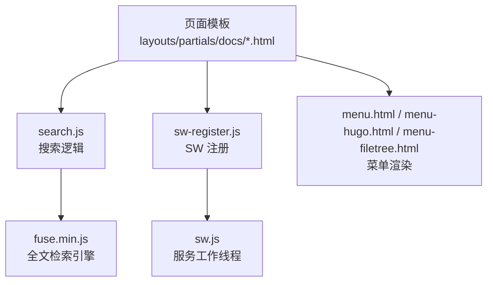
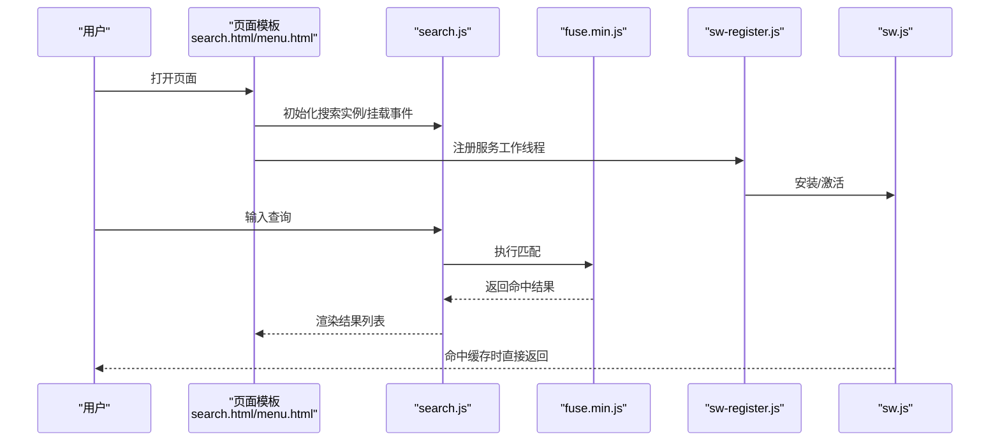
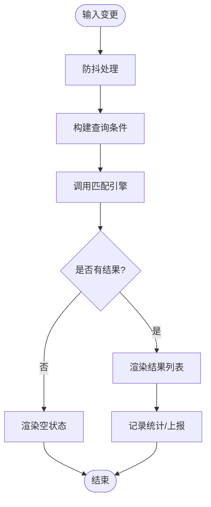
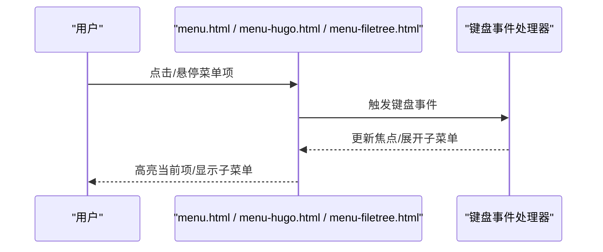
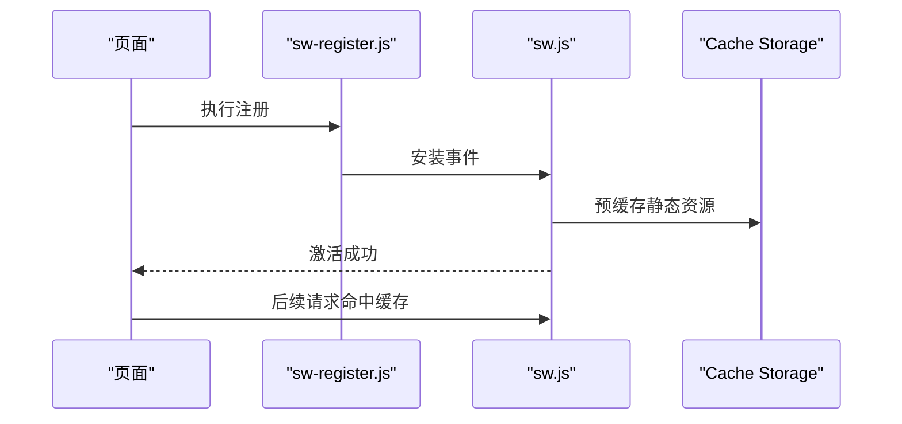
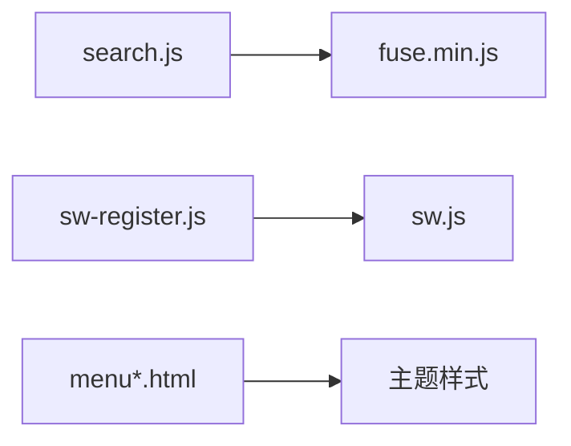

# JavaScript功能扩展

<cite>
**本文引用的文件**   
- [themes/hugo-book/assets/search.js](file://themes/hugo-book/assets/search.js)
- [themes/hugo-book/assets/sw-register.js](file://themes/hugo-book/assets/sw-register.js)
- [themes/hugo-book/assets/sw.js](file://themes/hugo-book/assets/sw.js)
- [themes/hugo-book/layouts/partials/docs/search.html](file://themes/hugo-book/layouts/partials/docs/search.html)
- [themes/hugo-book/layouts/partials/docs/menu.html](file://themes/hugo-book/layouts/partials/docs/menu.html)
- [themes/hugo-book/layouts/partials/docs/menu-hugo.html](file://themes/hugo-book/layouts/partials/docs/menu-hugo.html)
- [themes/hugo-book/layouts/partials/docs/menu-filetree.html](file://themes/hugo-book/layouts/partials/docs/menu-file树.html)
- [themes/hugo-book/static/fuse.min.js](file://themes/hugo-book/static/fuse.min.js)
- [hugo.toml](file://hugo.toml)
</cite>

## 目录
1. [简介](#简介)
2. [项目结构](#项目结构)
3. [核心组件](#核心组件)
4. [架构总览](#架构总览)
5. [详细组件分析](#详细组件分析)
6. [依赖分析](#依赖分析)
7. [性能考虑](#性能考虑)
8. [故障排查指南](#故障排查指南)
9. [结论](#结论)
10. [附录](#附录)

## 简介
本指南面向希望基于 Hugo Book 主题进行前端能力扩展的开发者，聚焦以下目标：
- 深入解析搜索、菜单交互、服务工作者的实现原理与扩展点
- 提供自定义搜索算法、结果展示、索引优化的实践路径
- 解释导航菜单的多级展开、动态加载与键盘导航机制
- 说明服务工作者的配置与使用，包括离线缓存、性能优化与 PWA 能力
- 介绍事件系统的实现与自定义事件绑定方法
- 给出完整的代码示例位置与调试工具使用建议

## 项目结构
本项目采用 Hugo Book 主题作为前端基础。与 JavaScript 功能扩展密切相关的资源主要位于 themes/hugo-book 下，包括：
- 搜索逻辑与 UI 模板
- 服务工作者的注册脚本与 SW 本体
- 第三方全文检索库（Fuse）
- 菜单渲染模板（Hugo 内置菜单与文件树菜单）

图表来源
- [themes/hugo-book/layouts/partials/docs/search.html](file://themes/hugo-book/layouts/partials/docs/search.html)
- [themes/hugo-book/assets/search.js](file://themes/hugo-book/assets/search.js)
- [themes/hugo-book/assets/sw-register.js](file://themes/hugo-book/assets/sw-register.js)
- [themes/hugo-book/assets/sw.js](file://themes/hugo-book/assets/sw.js)
- [themes/hugo-book/static/fuse.min.js](file://themes/hugo-book/static/fuse.min.js)
- [themes/hugo-book/layouts/partials/docs/menu.html](file://themes/hugo-book/layouts/partials/docs/menu.html)
- [themes/hugo-book/layouts/partials/docs/menu-hugo.html](file://themes/hugo-book/layouts/partials/docs/menu-hugo.html)
- [themes/hugo-book/layouts/partials/docs/menu-filetree.html](file://themes/hugo-book/layouts/partials/docs/menu-file树.html)

章节来源
- [hugo.toml](file://hugo.toml)

## 核心组件
- 搜索子系统
  - 负责构建索引、监听输入、执行匹配、渲染结果列表
  - 支持多语言与可配置项（如是否启用 Fuse、是否高亮等）
- 菜单子系统
  - 通过 Hugo 模板渲染多级菜单，支持文件树模式与 Hugo 配置菜单
  - 提供键盘导航与焦点管理
- 服务工作线程（PWA）
  - 通过 sw-register.js 注册 sw.js
  - 提供静态资源缓存策略、离线访问与按需更新

章节来源
- [themes/hugo-book/assets/search.js](file://themes/hugo-book/assets/search.js)
- [themes/hugo-book/assets/sw-register.js](file://themes/hugo-book/assets/sw-register.js)
- [themes/hugo-book/assets/sw.js](file://themes/hugo-book/assets/sw.js)
- [themes/hugo-book/layouts/partials/docs/search.html](file://themes/hugo-book/layouts/partials/docs/search.html)
- [themes/hugo-book/layouts/partials/docs/menu.html](file://themes/hugo-book/layouts/partials/docs/menu.html)
- [themes/hugo-book/layouts/partials/docs/menu-hugo.html](file://themes/hugo-book/layouts/partials/docs/menu-hugo.html)
- [themes/hugo-book/layouts/partials/docs/menu-filetree.html](file://themes/hugo-book/layouts/partials/docs/menu-file树.html)

## 架构总览
下图展示了浏览器端关键模块之间的交互关系：页面模板引入搜索与菜单模板；搜索逻辑在运行时加载 Fuse 并处理用户输入；服务工作线程由注册脚本安装并提供缓存能力。

图表来源
- [themes/hugo-book/layouts/partials/docs/search.html](file://themes/hugo-book/layouts/partials/docs/search.html)
- [themes/hugo-book/assets/search.js](file://themes/hugo-book/assets/search.js)
- [themes/hugo-book/static/fuse.min.js](file://themes/hugo-book/static/fuse.min.js)
- [themes/hugo-book/assets/sw-register.js](file://themes/hugo-book/assets/sw-register.js)
- [themes/hugo-book/assets/sw.js](file://themes/hugo-book/assets/sw.js)

## 详细组件分析

### 搜索功能扩展
- 实现要点
  - 索引构建：从 DOM 或数据源抽取标题、正文、标签等字段，生成结构化条目
  - 匹配引擎：默认集成 Fuse，可通过配置切换为其他引擎或自定义匹配器
  - 结果渲染：根据命中片段高亮显示，支持分页与虚拟滚动
  - 事件系统：对外暴露“搜索开始/完成/清空”等事件，便于埋点与联动
- 扩展方式
  - 自定义搜索算法：替换匹配函数或接入外部 API，保持统一回调接口
  - 结果展示定制：覆盖渲染钩子，插入摘要、图片、面包屑等元信息
  - 索引优化：对长文本分词、去噪、截断；按权重排序；增量更新
- 典型流程

图表来源
- [themes/hugo-book/assets/search.js](file://themes/hugo-book/assets/search.js)
- [themes/hugo-book/static/fuse.min.js](file://themes/hugo-book/static/fuse.min.js)
- [themes/hugo-book/layouts/partials/docs/search.html](file://themes/hugo-book/layouts/partials/docs/search.html)

章节来源
- [themes/hugo-book/assets/search.js](file://themes/hugo-book/assets/search.js)
- [themes/hugo-book/static/fuse.min.js](file://themes/hugo-book/static/fuse.min.js)
- [themes/hugo-book/layouts/partials/docs/search.html](file://themes/hugo-book/layouts/partials/docs/search.html)

### 导航菜单交互
- 实现要点
  - 多级菜单：通过递归模板渲染层级结构，配合 CSS 控制展开/收起
  - 动态加载：可按需懒加载深层节点，减少首屏压力
  - 键盘导航：支持方向键移动焦点、Enter 选择、Esc 关闭面板
- 扩展方式
  - 自定义菜单源：将 Hugo 配置菜单与站点内容树合并
  - 行为增强：添加搜索直达、最近访问、收藏等特性
- 交互序列

图表来源
- [themes/hugo-book/layouts/partials/docs/menu.html](file://themes/hugo-book/layouts/partials/docs/menu.html)
- [themes/hugo-book/layouts/partials/docs/menu-hugo.html](file://themes/hugo-book/layouts/partials/docs/menu-hugo.html)
- [themes/hugo-book/layouts/partials/docs/menu-filetree.html](file://themes/hugo-book/layouts/partials/docs/menu-file树.html)

章节来源
- [themes/hugo-book/layouts/partials/docs/menu.html](file://themes/hugo-book/layouts/partials/docs/menu.html)
- [themes/hugo-book/layouts/partials/docs/menu-hugo.html](file://themes/hugo-book/layouts/partials/docs/menu-hugo.html)
- [themes/hugo-book/layouts/partials/docs/menu-filetree.html](file://themes/hugo-book/layouts/partials/docs/menu-file树.html)

### 服务工作线程（PWA）
- 实现要点
  - 注册流程：页面加载后通过 sw-register.js 注册 sw.js
  - 缓存策略：对静态资源实施预缓存与网络优先/缓存优先策略
  - 版本更新：通过版本号或哈希判断是否需要重新安装
- 扩展方式
  - 自定义缓存规则：针对特定路由或资源类型差异化缓存
  - 离线体验：拦截导航请求，返回友好离线页
- 注册时序

图表来源
- [themes/hugo-book/assets/sw-register.js](file://themes/hugo-book/assets/sw-register.js)
- [themes/hugo-book/assets/sw.js](file://themes/hugo-book/assets/sw.js)

章节来源
- [themes/hugo-book/assets/sw-register.js](file://themes/hugo-book/assets/sw-register.js)
- [themes/hugo-book/assets/sw.js](file://themes/hugo-book/assets/sw.js)

### 事件系统与自定义事件
- 设计思路
  - 在 search.js 中定义统一的事件总线或发布订阅模型
  - 对外暴露 addEventListener/removeEventListener 风格的 API
- 常用事件
  - 搜索开始/完成/错误
  - 菜单展开/收起/选中
  - 服务工作线程安装/激活/更新
- 自定义事件绑定示例（概念性描述）
  - 在页面初始化阶段绑定“搜索结果渲染完成”事件，用于埋点或联动侧边栏
  - 在菜单项点击后派发“导航跳转”事件，供全局路由监听

章节来源
- [themes/hugo-book/assets/search.js](file://themes/hugo-book/assets/search.js)
- [themes/hugo-book/assets/sw-register.js](file://themes/hugo-book/assets/sw-register.js)
- [themes/hugo-book/assets/sw.js](file://themes/hugo-book/assets/sw.js)

## 依赖分析
- 内部依赖
  - search.js 依赖 fuse.min.js 进行模糊匹配
  - sw-register.js 依赖 sw.js 提供服务工作线程能力
  - 菜单模板之间相互独立，但共享样式与交互约定
- 外部依赖
  - Hugo 模板引擎（服务端渲染）
  - 浏览器原生 API（Service Worker、Cache Storage、EventTarget）

图表来源
- [themes/hugo-book/assets/search.js](file://themes/hugo-book/assets/search.js)
- [themes/hugo-book/static/fuse.min.js](file://themes/hugo-book/static/fuse.min.js)
- [themes/hugo-book/assets/sw-register.js](file://themes/hugo-book/assets/sw-register.js)
- [themes/hugo-book/assets/sw.js](file://themes/hugo-book/assets/sw.js)
- [themes/hugo-book/layouts/partials/docs/menu.html](file://themes/hugo-book/layouts/partials/docs/menu.html)
- [themes/hugo-book/layouts/partials/docs/menu-hugo.html](file://themes/hugo-book/layouts/partials/docs/menu-hugo.html)
- [themes/hugo-book/layouts/partials/docs/menu-filetree.html](file://themes/hugo-book/layouts/partials/docs/menu-file树.html)

章节来源
- [themes/hugo-book/assets/search.js](file://themes/hugo-book/assets/search.js)
- [themes/hugo-book/static/fuse.min.js](file://themes/hugo-book/static/fuse.min.js)
- [themes/hugo-book/assets/sw-register.js](file://themes/hugo-book/assets/sw-register.js)
- [themes/hugo-book/assets/sw.js](file://themes/hugo-book/assets/sw.js)
- [themes/hugo-book/layouts/partials/docs/menu.html](file://themes/hugo-book/layouts/partials/docs/menu.html)
- [themes/hugo-book/layouts/partials/docs/menu-hugo.html](file://themes/hugo-book/layouts/partials/docs/menu-hugo.html)
- [themes/hugo-book/layouts/partials/docs/menu-filetree.html](file://themes/hugo-book/layouts/partials/docs/menu-file树.html)

## 性能考虑
- 搜索
  - 使用防抖/节流降低高频输入带来的计算开销
  - 对长文本进行截断与分词，减少索引体积
  - 按需加载 Fuse，避免首屏阻塞
- 菜单
  - 懒加载深层节点，减少初始 DOM 规模
  - 使用事件委托减少监听器数量
- 服务工作线程
  - 合理划分缓存分组，避免单一大缓存导致更新缓慢
  - 使用版本化文件名或哈希，确保强缓存命中

[本节为通用指导，不直接分析具体文件]

## 故障排查指南
- 搜索无结果
  - 检查索引数据来源是否正确注入
  - 确认 Fuse 配置参数（阈值、关键词权重等）
  - 查看控制台是否有匹配异常
- 菜单无法展开
  - 检查模板是否包含必要的容器与类名
  - 验证键盘事件是否被正确捕获
- 服务工作线程未生效
  - 确认 HTTPS 环境与浏览器支持
  - 检查 sw-register.js 是否成功注册
  - 在应用标签页查看 Cache Storage 与 Network 面板

章节来源
- [themes/hugo-book/assets/search.js](file://themes/hugo-book/assets/search.js)
- [themes/hugo-book/assets/sw-register.js](file://themes/hugo-book/assets/sw-register.js)
- [themes/hugo-book/assets/sw.js](file://themes/hugo-book/assets/sw.js)

## 结论
通过对搜索、菜单与服务工作线程三大核心能力的解耦分析与扩展点梳理，可以在不破坏原有主题结构的前提下，快速实现个性化搜索、增强型导航与 PWA 能力。建议在扩展过程中遵循事件驱动与模块化原则，结合性能优化与调试手段，持续迭代用户体验。

[本节为总结性内容，不直接分析具体文件]

## 附录
- 调试工具建议
  - Chrome DevTools：Application 面板查看 Service Worker 与 Cache Storage；Network 面板观察资源命中情况
  - Console：打印搜索中间结果与事件流，定位匹配问题
  - Lighthouse：评估 PWA 指标与性能瓶颈
- 参考入口
  - 搜索模板与脚本：参见“章节来源”中的 search.html 与 search.js
  - 服务工作线程：参见 sw-register.js 与 sw.js
  - 菜单模板：参见 menu.html、menu-hugo.html、menu-filetree.html

[本节为补充信息，不直接分析具体文件]