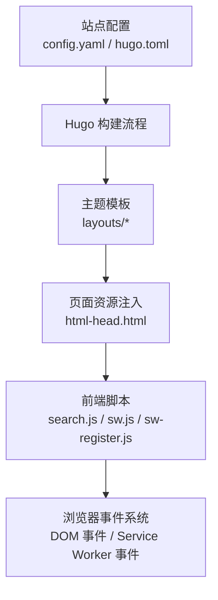
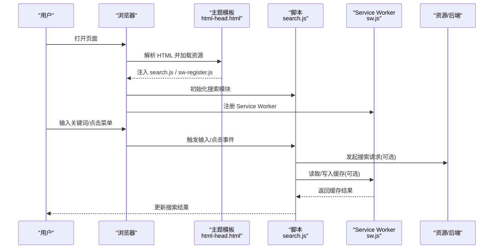
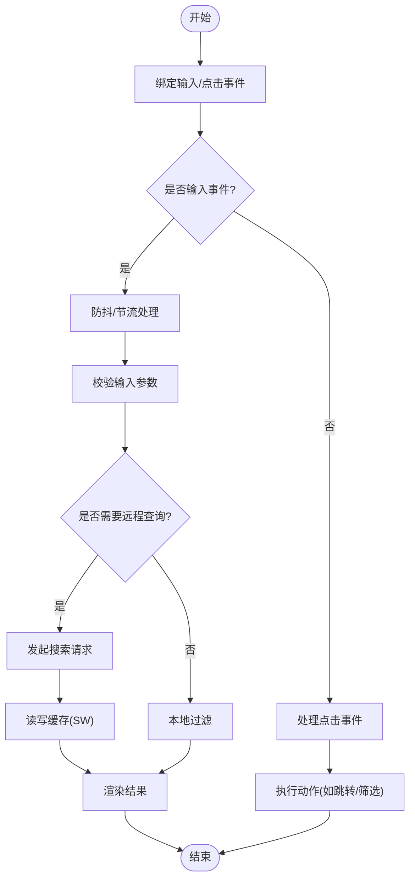
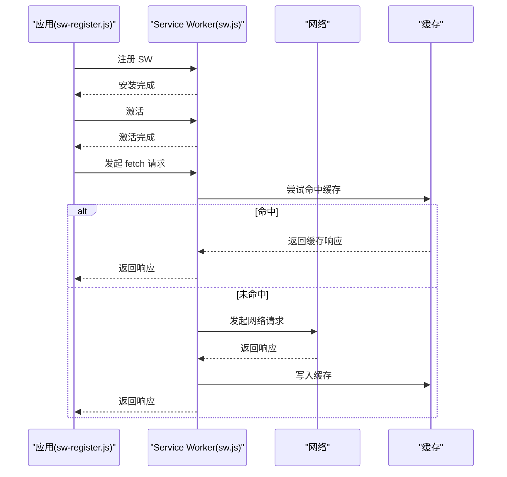
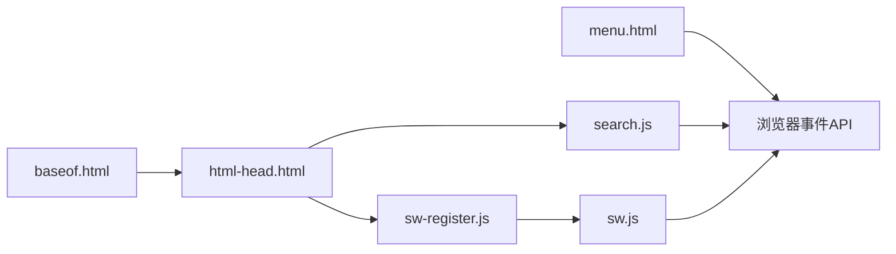

# 事件系统架构

<cite>
**本文引用的文件**   
- [README.md](file://README.md)
- [config.yaml](file://config.yaml)
- [hugo.toml](file://hugo.toml)
- [themes/hugo-book/README.md](file://themes/hugo-book/README.md)
- [themes/hugo-book/theme.toml](file://themes/hugo-book/theme.toml)
- [themes/hugo-book/layouts/_default/baseof.html](file://themes/hugo-book/layouts/_default/baseof.html)
- [themes/hugo-book/layouts/partials/docs/html-head.html](file://themes/hugo-book/layouts/partials/docs/html-head.html)
- [themes/hugo-book/layouts/partials/docs/menu.html](file://themes/hugo-book/layouts/partials/docs/menu.html)
- [themes/hugo-book/assets/book.scss](file://themes/hugo-book/assets/book.scss)
- [themes/hugo-book/assets/search.js](file://themes/hugo-book/assets/search.js)
- [themes/hugo-book/assets/sw.js](file://themes/hugo-book/assets/sw.js)
- [themes/hugo-book/assets/sw-register.js](file://themes/hugo-book/assets/sw-register.js)
- [content/docs/_index.md](file://content/docs/_index.md)
- [content/posts/_index.md](file://content/posts/_index.md)
</cite>

## 目录
1. [简介](#简介)
2. [项目结构](#项目结构)
3. [核心组件](#核心组件)
4. [架构总览](#架构总览)
5. [详细组件分析](#详细组件分析)
6. [依赖分析](#依赖分析)
7. [性能考虑](#性能考虑)
8. [故障排查指南](#故障排查指南)
9. [结论](#结论)
10. [附录](#附录)

## 简介
本文件围绕“事件系统架构”的目标，结合仓库中 Hugo Book 主题与站点配置，梳理在静态站点生成与前端渲染过程中涉及的事件驱动机制：包括浏览器原生事件、主题模板注入的脚本加载、搜索与缓存等运行时行为。文档从事件定义、发布订阅模式、事件冒泡、监听器生命周期、中间件/过滤器/聚合器等扩展思路出发，提供可落地的实践建议与可视化图示，帮助开发者构建灵活的事件驱动功能。

## 项目结构
该仓库为基于 Hugo 的文档站点，使用 hugo-book 主题。关键路径包括：
- 站点配置：根目录下的 config.yaml、hugo.toml
- 主题：themes/hugo-book，包含布局、资源与部分模板
- 内容：content 目录（文档与文章）
- 输出：public 与 docs 为构建产物

图表来源
- [hugo.toml:1-200](file://hugo.toml#L1-L200)
- [config.yaml:1-200](file://config.yaml#L1-L200)
- [themes/hugo-book/layouts/partials/docs/html-head.html:1-200](file://themes/hugo-book/layouts/partials/docs/html-head.html#L1-L200)
- [themes/hugo-book/assets/search.js:1-200](file://themes/hugo-book/assets/search.js#L1-L200)
- [themes/hugo-book/assets/sw.js:1-200](file://themes/hugo-book/assets/sw.js#L1-L200)
- [themes/hugo-book/assets/sw-register.js:1-200](file://themes/hugo-book/assets/sw-register.js#L1-L200)

章节来源
- [README.md:1-200](file://README.md#L1-L200)
- [hugo.toml:1-200](file://hugo.toml#L1-L200)
- [config.yaml:1-200](file://config.yaml#L1-L200)
- [themes/hugo-book/README.md:1-200](file://themes/hugo-book/README.md#L1-L200)
- [themes/hugo-book/theme.toml:1-200](file://themes/hugo-book/theme.toml#L1-L200)

## 核心组件
- 主题入口与基础布局：baseof.html 作为所有页面的基础模板，负责注入全局样式与脚本。
- 头部资源注入：html-head.html 用于向页面 head 注入 CSS/JS 等资源，是事件脚本加载的关键位置。
- 菜单与导航：menu.html 控制侧边栏与导航交互，可能触发 UI 相关事件。
- 前端脚本：
  - search.js：实现站内搜索逻辑，通常通过 DOM 事件与异步请求协作。
  - sw.js：Service Worker 脚本，处理网络拦截、缓存策略等后台事件。
  - sw-register.js：注册 Service Worker，将 SW 生命周期事件接入应用。
- 样式与主题变量：book.scss 统一样式，影响交互反馈与视觉状态。

章节来源
- [themes/hugo-book/layouts/_default/baseof.html:1-200](file://themes/hugo-book/layouts/_default/baseof.html#L1-L200)
- [themes/hugo-book/layouts/partials/docs/html-head.html:1-200](file://themes/hugo-book/layouts/partials/docs/html-head.html#L1-L200)
- [themes/hugo-book/layouts/partials/docs/menu.html:1-200](file://themes/hugo-book/layouts/partials/docs/menu.html#L1-L200)
- [themes/hugo-book/assets/book.scss:1-200](file://themes/hugo-book/assets/book.scss#L1-L200)
- [themes/hugo-book/assets/search.js:1-200](file://themes/hugo-book/assets/search.js#L1-L200)
- [themes/hugo-book/assets/sw.js:1-200](file://themes/hugo-book/assets/sw.js#L1-L200)
- [themes/hugo-book/assets/sw-register.js:1-200](file://themes/hugo-book/assets/sw-register.js#L1-L200)

## 架构总览
下图展示从页面渲染到运行时事件的端到端流程：Hugo 根据主题模板生成 HTML，注入脚本；浏览器执行脚本并绑定事件；用户交互或系统事件触发回调；必要时通过 Service Worker 进行缓存与离线处理。

图表来源
- [themes/hugo-book/layouts/partials/docs/html-head.html:1-200](file://themes/hugo-book/layouts/partials/docs/html-head.html#L1-L200)
- [themes/hugo-book/assets/search.js:1-200](file://themes/hugo-book/assets/search.js#L1-L200)
- [themes/hugo-book/assets/sw-register.js:1-200](file://themes/hugo-book/assets/sw-register.js#L1-L200)
- [themes/hugo-book/assets/sw.js:1-200](file://themes/hugo-book/assets/sw.js#L1-L200)

## 详细组件分析

### 主题基础布局与资源注入
- baseof.html 作为基础模板，组织页面骨架与通用资源引用。
- html-head.html 负责在 <head> 中注入样式与脚本，确保事件脚本在页面可用时尽早加载。
- 建议：将事件相关的脚本按职责拆分，并通过 html-head.html 集中管理加载顺序，避免竞态条件。

章节来源
- [themes/hugo-book/layouts/_default/baseof.html:1-200](file://themes/hugo-book/layouts/_default/baseof.html#L1-L200)
- [themes/hugo-book/layouts/partials/docs/html-head.html:1-200](file://themes/hugo-book/layouts/partials/docs/html-head.html#L1-L200)

### 搜索模块与事件流
- search.js 通常监听输入框的输入事件、按钮点击事件，并在回调中执行过滤或异步请求。
- 事件对象应包含目标元素、时间戳、上下文信息等字段，便于调试与追踪。
- 参数传递：通过事件对象的自定义属性或闭包捕获上下文，避免全局污染。
- 异步处理：对长耗时操作采用 Promise/async-await，并在 UI 上给出加载状态。

图表来源
- [themes/hugo-book/assets/search.js:1-200](file://themes/hugo-book/assets/search.js#L1-L200)

章节来源
- [themes/hugo-book/assets/search.js:1-200](file://themes/hugo-book/assets/search.js#L1-L200)

### Service Worker 与后台事件
- sw-register.js 负责注册 Service Worker，将应用与后台事件通道连接。
- sw.js 处理 fetch、install、activate 等事件，实现缓存策略与离线能力。
- 最佳实践：
  - 明确缓存键策略，避免脏数据。
  - 对失败请求设置降级策略（返回缓存或友好提示）。
  - 定期清理过期缓存，防止内存泄漏。

图表来源
- [themes/hugo-book/assets/sw-register.js:1-200](file://themes/hugo-book/assets/sw-register.js#L1-L200)
- [themes/hugo-book/assets/sw.js:1-200](file://themes/hugo-book/assets/sw.js#L1-L200)

章节来源
- [themes/hugo-book/assets/sw-register.js:1-200](file://themes/hugo-book/assets/sw-register.js#L1-L200)
- [themes/hugo-book/assets/sw.js:1-200](file://themes/hugo-book/assets/sw.js#L1-L200)

### 菜单与导航交互
- menu.html 控制侧边栏与导航项，常见事件包括展开/折叠、选中高亮、路由切换。
- 建议：
  - 使用事件委托减少监听器数量。
  - 对动态生成的节点采用懒绑定，避免重复绑定。
  - 在离开页面或销毁组件时解绑事件，防止内存泄漏。

章节来源
- [themes/hugo-book/layouts/partials/docs/menu.html:1-200](file://themes/hugo-book/layouts/partials/docs/menu.html#L1-L200)

### 样式与交互反馈
- book.scss 统一管理样式，影响交互状态（如 hover、active、focus）。
- 建议：
  - 将交互状态类名与事件回调分离，保持关注点清晰。
  - 使用 CSS 变量提升主题可扩展性。

章节来源
- [themes/hugo-book/assets/book.scss:1-200](file://themes/hugo-book/assets/book.scss#L1-L200)

## 依赖分析
- 主题与布局：baseof.html 依赖 html-head.html 注入资源；menu.html 作为局部模板被布局引入。
- 脚本依赖：search.js 与 sw-register.js 由 html-head.html 注入；sw.js 由 sw-register.js 注册。
- 外部依赖：浏览器原生事件 API、Service Worker API、Fetch API。

图表来源
- [themes/hugo-book/layouts/_default/baseof.html:1-200](file://themes/hugo-book/layouts/_default/baseof.html#L1-L200)
- [themes/hugo-book/layouts/partials/docs/html-head.html:1-200](file://themes/hugo-book/layouts/partials/docs/html-head.html#L1-L200)
- [themes/hugo-book/layouts/partials/docs/menu.html:1-200](file://themes/hugo-book/layouts/partials/docs/menu.html#L1-L200)
- [themes/hugo-book/assets/search.js:1-200](file://themes/hugo-book/assets/search.js#L1-L200)
- [themes/hugo-book/assets/sw-register.js:1-200](file://themes/hugo-book/assets/sw-register.js#L1-L200)
- [themes/hugo-book/assets/sw.js:1-200](file://themes/hugo-book/assets/sw.js#L1-L200)

章节来源
- [themes/hugo-book/layouts/_default/baseof.html:1-200](file://themes/hugo-book/layouts/_default/baseof.html#L1-L200)
- [themes/hugo-book/layouts/partials/docs/html-head.html:1-200](file://themes/hugo-book/layouts/partials/docs/html-head.html#L1-L200)
- [themes/hugo-book/layouts/partials/docs/menu.html:1-200](file://themes/hugo-book/layouts/partials/docs/menu.html#L1-L200)
- [themes/hugo-book/assets/search.js:1-200](file://themes/hugo-book/assets/search.js#L1-L200)
- [themes/hugo-book/assets/sw-register.js:1-200](file://themes/hugo-book/assets/sw-register.js#L1-L200)
- [themes/hugo-book/assets/sw.js:1-200](file://themes/hugo-book/assets/sw.js#L1-L200)

## 性能考虑
- 事件去抖与节流：对高频输入事件（如搜索）实施防抖/节流，降低回调频率。
- 事件委托：在父节点上统一监听子节点事件，减少监听器数量。
- 懒加载与按需绑定：仅在需要时绑定事件，避免不必要的开销。
- 缓存策略：利用 Service Worker 缓存热点资源，减少网络往返。
- 内存管理：及时解绑事件监听器，避免闭包导致的内存泄漏。

## 故障排查指南
- 搜索无结果：
  - 检查输入事件是否正确绑定与触发。
  - 确认异步请求是否成功，查看网络面板与错误日志。
  - 验证缓存键是否与请求一致，避免命中旧数据。
- Service Worker 不生效：
  - 确认 sw-register.js 已正确注册 SW。
  - 检查 sw.js 的 install/activate/fetch 事件处理逻辑。
  - 在浏览器 DevTools 的 Application 面板查看 SW 状态与缓存。
- 内存泄漏：
  - 审查是否存在未解绑的事件监听器。
  - 检查闭包是否持有大对象引用。
  - 在页面卸载或组件销毁时主动清理。

章节来源
- [themes/hugo-book/assets/search.js:1-200](file://themes/hugo-book/assets/search.js#L1-L200)
- [themes/hugo-book/assets/sw-register.js:1-200](file://themes/hugo-book/assets/sw-register.js#L1-L200)
- [themes/hugo-book/assets/sw.js:1-200](file://themes/hugo-book/assets/sw.js#L1-L200)

## 结论
通过将主题模板、前端脚本与 Service Worker 纳入统一的事件驱动视角，可以清晰地理解从页面渲染到运行时交互的完整链路。遵循事件去抖、事件委托、缓存策略与内存管理等最佳实践，能够显著提升用户体验与系统稳定性。同时，借助中间件/过滤器/聚合器等扩展思路，可在现有基础上进一步增强系统的灵活性与可维护性。

## 附录

### API 参考（概念性）
- 事件定义
  - 名称：字符串标识，建议使用命名空间前缀（如 ui.menu.toggle）。
  - 类型：UI 事件、网络事件、系统事件等。
  - 载荷：事件携带的数据对象，包含必要字段与可选扩展字段。
- 发布订阅
  - 发布：emit(event, payload)
  - 订阅：on(event, handler), once(event, handler), off(event, handler)
  - 取消：unsubscribe(handler)
- 事件冒泡
  - 支持冒泡与捕获阶段，允许在父级拦截与修改事件。
- 异步处理
  - 支持 Promise/async-await，提供错误边界与重试策略。
- 中间件/过滤器
  - 在事件分发前后插入钩子，实现鉴权、日志、限流等横切逻辑。
- 事件聚合器
  - 组合多个事件源，统一调度与统计，便于监控与分析。

[本节为概念性说明，不直接分析具体文件]

### 实际应用场景示例
- 站内搜索
  - 输入事件触发搜索，结合本地过滤与远程查询，使用 Service Worker 缓存结果。
- 菜单交互
  - 点击菜单项触发路由切换，记录访问日志并更新高亮状态。
- 离线阅读
  - 通过 Service Worker 预取与缓存文章内容，在网络不可用时提供离线体验。

[本节为概念性说明，不直接分析具体文件]