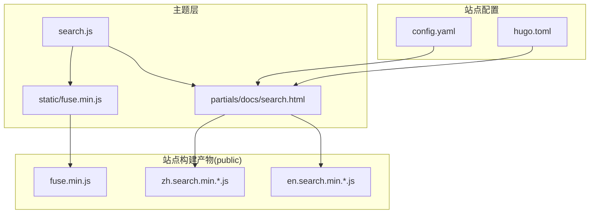
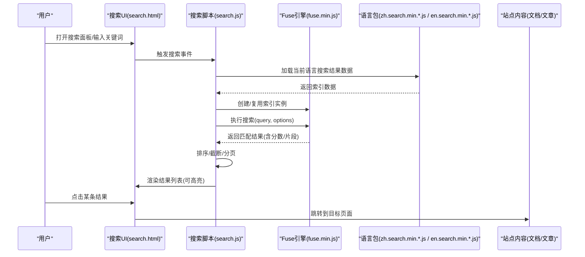
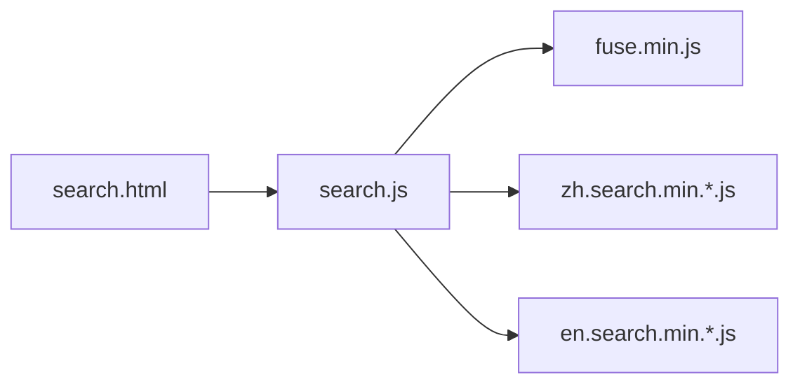

# 搜索功能扩展

<cite>
**本文引用的文件**   
- [themes/hugo-book/assets/search.js](file://themes/hugo-book/assets/search.js)
- [themes/hugo-book/layouts/partials/docs/search.html](file://themes/hugo-book/layouts/partials/docs/search.html)
- [themes/hugo-book/static/fuse.min.js](file://themes/hugo-book/static/fuse.min.js)
- [public/fuse.min.js](file://public/fuse.min.js)
- [public/zh.search.min.25b524aee42951afa88a6975283d6db14d90d143a2192196f14db9aae5587fbe.js](file://public/zh.search.min.25b524aee42951afa88a6975283d6db14d90d143a2192196f14db9aae5587fbe.js)
- [public/en.search.min.02d85b689512a69202541ad1c1d3f48428a41203fe5bd53d521f2e29c62436f9.js](file://public/en.search.min.02d85b689512a69202541ad1c1d3f48428a41203fe5bd53d521f2e29c62436f9.js)
- [config.yaml](file://config.yaml)
- [hugo.toml](file://hugo.toml)
</cite>

## 目录
1. [简介](#简介)
2. [项目结构](#项目结构)
3. [核心组件](#核心组件)
4. [架构总览](#架构总览)
5. [详细组件分析](#详细组件分析)
6. [依赖关系分析](#依赖关系分析)
7. [性能考虑](#性能考虑)
8. [故障排查指南](#故障排查指南)
9. [结论](#结论)
10. [附录：API参考与示例](#附录api参考与示例)

## 简介
本文件面向希望在Hugo Book主题中扩展“基于Fuse.js的全文搜索”能力的开发者，系统性解析索引构建、搜索算法配置、结果排序与分页机制，并提供自定义搜索界面（展示样式、高亮显示、搜索建议）的方法。同时给出性能优化策略（索引大小控制、延迟优化、内存管理）、完整API参考（初始化配置、事件监听、方法调用），以及高级用法示例（模糊搜索、多语言支持、搜索统计）。

## 项目结构
本项目使用Hugo Book主题，搜索能力由前端脚本与静态资源共同实现：
- 主题侧提供搜索UI模板与JS逻辑入口
- 构建产物在public目录下生成各语言的搜索脚本与Fuse库
- 站点根配置用于启用或调整搜索行为

图示来源
- [themes/hugo-book/assets/search.js](file://themes/hugo-book/assets/search.js)
- [themes/hugo-book/layouts/partials/docs/search.html](file://themes/hugo-book/layouts/partials/docs/search.html)
- [themes/hugo-book/static/fuse.min.js](file://themes/hugo-book/static/fuse.min.js)
- [public/fuse.min.js](file://public/fuse.min.js)
- [public/zh.search.min.25b524aee42951afa88a6975283d6db14d90d143a2192196f14db9aae5587fbe.js](file://public/zh.search.min.25b524aee42951afa88a6975283d6db14d90d143a2192196f14db9aae5587fbe.js)
- [public/en.search.min.02d85b689512a69202541ad1c1d3f48428a41203fe5bd53d521f2e29c62436f9.js](file://public/en.search.min.02d85b689512a69202541ad1c1d3f48428a41203fe5bd53d521f2e29c62436f9.js)
- [config.yaml](file://config.yaml)
- [hugo.toml](file://hugo.toml)

章节来源
- [themes/hugo-book/assets/search.js](file://themes/hugo-book/assets/search.js)
- [themes/hugo-book/layouts/partials/docs/search.html](file://themes/hugo-book/layouts/partials/docs/search.html)
- [themes/hugo-book/static/fuse.min.js](file://themes/hugo-book/static/fuse.min.js)
- [public/fuse.min.js](file://public/fuse.min.js)
- [public/zh.search.min.25b524aee42951afa88a6975283d6db14d90d143a2192196f14db9aae5587fbe.js](file://public/zh.search.min.25b524aee42951afa88a6975283d6db14d90d143a2192196f14db9aae5587fbe.js)
- [public/en.search.min.02d85b689512a69202541ad1c1d3f48428a41203fe5bd53d521f2e29c62436f9.js](file://public/en.search.min.02d85b689512a69202541ad1c1d3f48428a41203fe5bd53d521f2e29c62436f9.js)
- [config.yaml](file://config.yaml)
- [hugo.toml](file://hugo.toml)

## 核心组件
- 搜索UI模板：负责渲染输入框、下拉面板、结果列表与分页控件，并绑定用户交互事件。
- 搜索逻辑脚本：负责加载语言包、构建Fuse索引、执行查询、排序与分页、渲染高亮与跳转。
- Fuse.js引擎：提供模糊匹配、权重评分、阈值控制等核心搜索能力。
- 多语言搜索包：按语言预编译的搜索结果数据与分词/词典相关资源。
- 站点配置：控制是否启用搜索、语言选择、缓存策略等。

章节来源
- [themes/hugo-book/layouts/partials/docs/search.html](file://themes/hugo-book/layouts/partials/docs/search.html)
- [themes/hugo-book/assets/search.js](file://themes/hugo-book/assets/search.js)
- [themes/hugo-book/static/fuse.min.js](file://themes/hugo-book/static/fuse.min.js)
- [public/zh.search.min.25b524aee42951afa88a6975283d6db14d90d143a2192196f14db9aae5587fbe.js](file://public/zh.search.min.25b524aee42951afa88a6975283d6db14d90d143a2192196f14db9aae5587fbe.js)
- [public/en.search.min.02d85b689512a69202541ad1c1d3f48428a41203fe5bd53d521f2e29c62436f9.js](file://public/en.search.min.02d85b689512a69202541ad1c1d3f48428a41203fe5bd53d521f2e29c62436f9.js)
- [config.yaml](file://config.yaml)
- [hugo.toml](file://hugo.toml)

## 架构总览
下图展示了从页面加载到用户输入、再到结果渲染与跳转的完整流程。

图示来源
- [themes/hugo-book/layouts/partials/docs/search.html](file://themes/hugo-book/layouts/partials/docs/search.html)
- [themes/hugo-book/assets/search.js](file://themes/hugo-book/assets/search.js)
- [themes/hugo-book/static/fuse.min.js](file://themes/hugo-book/static/fuse.min.js)
- [public/zh.search.min.25b524aee42951afa88a6975283d6db14d90d143a2192196f14db9aae5587fbe.js](file://public/zh.search.min.25b524aee42951afa88a6975283d6db14d90d143a2192196f14db9aae5587fbe.js)
- [public/en.search.min.02d85b689512a69202541ad1c1d3f48428a41203fe5bd53d521f2e29c62436f9.js](file://public/en.search.min.02d85b689512a69202541ad1c1d3f48428a41203fe5bd53d521f2e29c62436f9.js)

## 详细组件分析

### 搜索UI模板（partials/docs/search.html）
- 职责
  - 渲染搜索输入框、下拉面板、结果项模板与分页控件
  - 绑定键盘导航、回车跳转、点击关闭等交互
  - 根据当前语言动态引入对应搜索脚本
- 关键点
  - 通过模板变量注入语言与资源路径
  - 为结果项预留高亮容器与摘要占位
  - 暴露最小化DOM API供JS操作（如清空、追加、切换可见性）

章节来源
- [themes/hugo-book/layouts/partials/docs/search.html](file://themes/hugo-book/layouts/partials/docs/search.html)

### 搜索逻辑脚本（assets/search.js）
- 职责
  - 初始化Fuse实例与索引数据
  - 处理防抖与节流，降低频繁输入带来的计算压力
  - 执行搜索、排序、分页、高亮与结果渲染
  - 派发事件以便外部统计与埋点
- 关键流程
  - 加载语言包：根据站点语言选择对应的zh或en搜索包
  - 构建索引：将标题、链接、摘要等字段映射到Fuse键空间
  - 搜索选项：设置阈值、忽略位置、权重、是否包含片段等
  - 结果处理：按分数降序、限制最大数量、分页切片
  - 高亮渲染：对命中片段进行包裹标记
  - 跳转与关闭：点击结果后导航至目标URL，并重置UI状态
- 事件与钩子
  - 提供事件回调（如onSearchStart/onSearchEnd/onRenderResult）以接入统计或日志

章节来源
- [themes/hugo-book/assets/search.js](file://themes/hugo-book/assets/search.js)

### Fuse.js引擎集成（static/fuse.min.js / public/fuse.min.js）
- 职责
  - 提供模糊匹配、相似度评分、阈值过滤、权重排序等核心能力
  - 支持多字段检索与字段权重
- 常用配置要点
  - threshold：控制容错度，值越小越严格
  - ignoreLocation：是否忽略匹配位置
  - includeMatches：是否返回匹配片段用于高亮
  - keys：定义检索字段与权重
  - minMatchCharLength：最小匹配长度，影响中文体验
- 注意
  - 中文分词与同义词需依赖语言包或预处理；Fuse默认按字符级匹配

章节来源
- [themes/hugo-book/static/fuse.min.js](file://themes/hugo-book/static/fuse.min.js)
- [public/fuse.min.js](file://public/fuse.min.js)

### 多语言搜索包（zh.search.min.*.js / en.search.min.*.js）
- 职责
  - 提供按语言预构建的搜索结果数据集
  - 可能包含分词规则、停用词表或语言特定优化
- 选择策略
  - 根据站点语言自动加载对应包
  - 支持按需懒加载，减少首屏体积

章节来源
- [public/zh.search.min.25b524aee42951afa88a6975283d6db14d90d143a2192196f14db9aae5587fbe.js](file://public/zh.search.min.25b524aee42951afa88a6975283d6db14d90d143a2192196f14db9aae5587fbe.js)
- [public/en.search.min.02d85b689512a69202541ad1c1d3f48428a41203fe5bd53d521f2e29c62436f9.js](file://public/en.search.min.02d85b689512a69202541ad1c1d3f48428a41203fe5bd53d521f2e29c62436f9.js)

### 站点配置（config.yaml / hugo.toml）
- 作用
  - 控制是否启用搜索、默认语言、资源版本与缓存策略
  - 决定在页面中注入哪些搜索脚本与语言包
- 常见开关
  - 启用/禁用搜索
  - 指定语言
  - 是否开启高亮与分页
  - 是否启用缓存或预取

章节来源
- [config.yaml](file://config.yaml)
- [hugo.toml](file://hugo.toml)

## 依赖关系分析
- 模块耦合
  - search.html仅依赖search.js提供的最小DOM接口，解耦良好
  - search.js依赖Fuse引擎与语言包，二者均为静态资源，便于缓存
- 外部依赖
  - Fuse.js为核心算法依赖
  - 语言包为可选增强，提升中文等多语言体验
- 潜在循环
  - 无直接循环依赖；模板与脚本单向引用

图示来源
- [themes/hugo-book/layouts/partials/docs/search.html](file://themes/hugo-book/layouts/partials/docs/search.html)
- [themes/hugo-book/assets/search.js](file://themes/hugo-book/assets/search.js)
- [themes/hugo-book/static/fuse.min.js](file://themes/hugo-book/static/fuse.min.js)
- [public/zh.search.min.25b524aee42951afa88a6975283d6db14d90d143a2192196f14db9aae5587fbe.js](file://public/zh.search.min.25b524aee42951afa88a6975283d6db14d90d143a2192196f14db9aae5587fbe.js)
- [public/en.search.min.02d85b689512a69202541ad1c1d3f48428a41203fe5bd53d521f2e29c62436f9.js](file://public/en.search.min.02d85b689512a69202541ad1c1d3f48428a41203fe5bd53d521f2e29c62436f9.js)

## 性能考虑
- 索引大小控制
  - 仅索引必要字段（标题、摘要、URL），避免大段正文
  - 对长文本做截断或摘要抽取，降低JSON体积
- 搜索延迟优化
  - 输入防抖/节流，减少重复计算
  - 首次加载时预构建索引，后续查询O(1)~O(log n)级别
  - 分页与限流：限制单次返回结果数，避免大量DOM操作
- 内存管理
  - 销毁不再使用的索引实例，释放内存
  - 语言包按需加载，避免一次性加载所有语言
- 网络与缓存
  - 静态资源强缓存，利用浏览器HTTP缓存
  - 使用CDN分发Fuse与语言包，缩短TTFB

[本节为通用指导，不直接分析具体文件]

## 故障排查指南
- 现象：搜索无结果
  - 检查语言包是否正确加载
  - 确认索引字段与查询字段一致
  - 查看控制台是否有资源404或跨域错误
- 现象：中文匹配差
  - 调整minMatchCharLength与threshold
  - 确认语言包已正确引入
- 现象：卡顿或掉帧
  - 增加防抖时间
  - 减少每次渲染的结果数量
  - 关闭includeMatches或简化高亮逻辑
- 现象：分页无效
  - 检查分页参数与结果总数计算
  - 确保DOM更新未阻塞主线程

章节来源
- [themes/hugo-book/assets/search.js](file://themes/hugo-book/assets/search.js)
- [themes/hugo-book/layouts/partials/docs/search.html](file://themes/hugo-book/layouts/partials/docs/search.html)

## 结论
该搜索方案以Fuse.js为核心，结合主题模板与多语言包，实现了轻量、可扩展的前端全文搜索。通过合理配置阈值、权重与分页策略，可在保证用户体验的同时兼顾性能。建议在大型站点上采用索引裁剪、懒加载与缓存策略，以获得更稳定的表现。

[本节为总结，不直接分析具体文件]

## 附录：API参考与示例

### 初始化配置
- 基本参数
  - 语言：选择zh或en语言包
  - 阈值threshold：控制模糊程度
  - 字段keys：定义标题、摘要、URL等字段及权重
  - 包含片段includeMatches：用于高亮
  - 最小匹配长度minMatchCharLength：影响中文体验
- 示例路径
  - 初始化与配置参考：[themes/hugo-book/assets/search.js](file://themes/hugo-book/assets/search.js)
  - 模板注入语言与资源：[themes/hugo-book/layouts/partials/docs/search.html](file://themes/hugo-book/layouts/partials/docs/search.html)

章节来源
- [themes/hugo-book/assets/search.js](file://themes/hugo-book/assets/search.js)
- [themes/hugo-book/layouts/partials/docs/search.html](file://themes/hugo-book/layouts/partials/docs/search.html)

### 事件监听
- 可用事件
  - onSearchStart：开始搜索前
  - onSearchEnd：搜索完成后
  - onRenderResult：渲染单条结果前
  - onNavigate：跳转到结果页前
- 用途
  - 埋点统计、日志上报、A/B测试
- 示例路径
  - 事件注册与派发：[themes/hugo-book/assets/search.js](file://themes/hugo-book/assets/search.js)

章节来源
- [themes/hugo-book/assets/search.js](file://themes/hugo-book/assets/search.js)

### 方法调用
- 常用方法
  - search(query)：执行搜索
  - setOptions(options)：动态更新搜索选项
  - destroy()：销毁索引与事件
- 示例路径
  - 方法与生命周期：[themes/hugo-book/assets/search.js](file://themes/hugo-book/assets/search.js)

章节来源
- [themes/hugo-book/assets/search.js](file://themes/hugo-book/assets/search.js)

### 自定义搜索界面
- 展示样式
  - 在模板中重写结果项HTML结构，添加CSS类名
  - 支持缩略图、标签、时间戳等元信息
- 高亮显示
  - 使用includeMatches获取命中片段，包裹为高亮节点
- 搜索建议
  - 监听输入事件，实时展示Top N建议项
- 示例路径
  - 模板与渲染逻辑：[themes/hugo-book/layouts/partials/docs/search.html](file://themes/hugo-book/layouts/partials/docs/search.html)
  - 渲染与高亮：[themes/hugo-book/assets/search.js](file://themes/hugo-book/assets/search.js)

章节来源
- [themes/hugo-book/layouts/partials/docs/search.html](file://themes/hugo-book/layouts/partials/docs/search.html)
- [themes/hugo-book/assets/search.js](file://themes/hugo-book/assets/search.js)

### 高级搜索示例
- 模糊搜索
  - 调整threshold与ignoreLocation，平衡精确与容错
  - 参考：[themes/hugo-book/assets/search.js](file://themes/hugo-book/assets/search.js)
- 多语言支持
  - 根据站点语言加载对应zh或en语言包
  - 参考：[public/zh.search.min.25b524aee42951afa88a6975283d6db14d90d143a2192196f14db9aae5587fbe.js](file://public/zh.search.min.25b524aee42951afa88a6975283d6db14d90d143a2192196f14db9aae5587fbe.js)、[public/en.search.min.02d85b689512a69202541ad1c1d3f48428a41203fe5bd53d521f2e29c62436f9.js](file://public/en.search.min.02d85b689512a69202541ad1c1d3f48428a41203fe5bd53d521f2e29c62436f9.js)
- 搜索统计
  - 通过事件回调上报查询词、结果数、耗时等指标
  - 参考：[themes/hugo-book/assets/search.js](file://themes/hugo-book/assets/search.js)

章节来源
- [themes/hugo-book/assets/search.js](file://themes/hugo-book/assets/search.js)
- [public/zh.search.min.25b524aee42951afa88a6975283d6db14d90d143a2192196f14db9aae5587fbe.js](file://public/zh.search.min.25b524aee42951afa88a6975283d6db14d90d143a2192196f14db9aae5587fbe.js)
- [public/en.search.min.02d85b689512a69202541ad1c1d3f48428a41203fe5bd53d521f2e29c62436f9.js](file://public/en.search.min.02d85b689512a69202541ad1c1d3f48428a41203fe5bd53d521f2e29c62436f9.js)

### 结果排序与分页机制
- 排序
  - 基于Fuse评分降序，可按权重字段二次排序
- 分页
  - 计算总页数与当前页切片，避免一次性渲染过多DOM
- 示例路径
  - 排序与分页逻辑：[themes/hugo-book/assets/search.js](file://themes/hugo-book/assets/search.js)

章节来源
- [themes/hugo-book/assets/search.js](file://themes/hugo-book/assets/search.js)