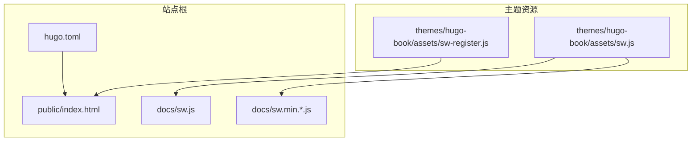
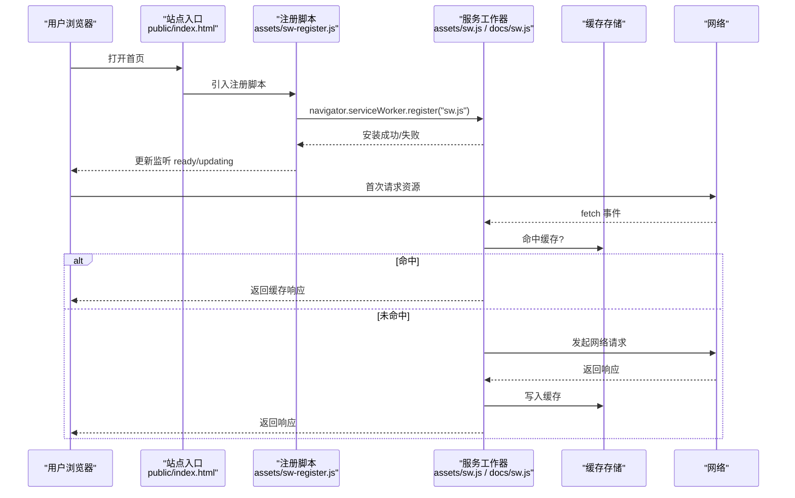
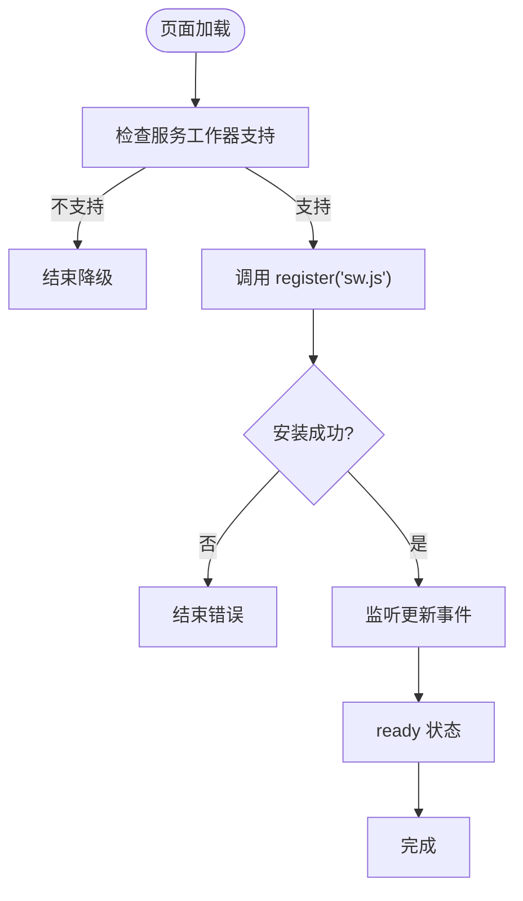
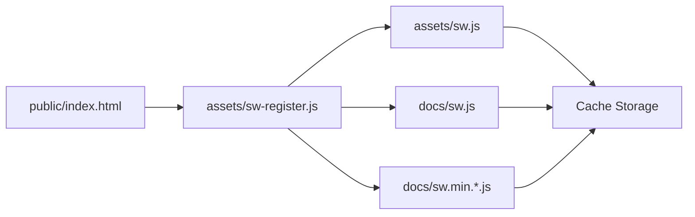

# 服务工作器集成

<cite>
**本文引用的文件**   
- [sw.js](file://docs/sw.js)
- [sw.min.6f6f90fcb8eb1c49ec389838e6b801d0de19430b8e516902f8d75c3c8bd98739.js](file://docs/sw.min.6f6f90fcb8eb1c49ec389838e6b801d0de19430b8e516902f8d75c3c8bd98739.js)
- [sw-register.js](file://themes/hugo-book/assets/sw-register.js)
- [sw.js](file://themes/hugo-book/assets/sw.js)
- [index.html](file://public/index.html)
- [hugo.toml](file://hugo.toml)
</cite>

## 目录
1. [简介](#简介)
2. [项目结构](#项目结构)
3. [核心组件](#核心组件)
4. [架构总览](#架构总览)
5. [详细组件分析](#详细组件分析)
6. [依赖关系分析](#依赖关系分析)
7. [性能考虑](#性能考虑)
8. [故障排查指南](#故障排查指南)
9. [结论](#结论)
10. [附录](#附录)

## 简介
本文件面向在 Hugo 站点中集成 PWA（渐进式 Web 应用）的开发者，聚焦服务工作器（Service Worker）的注册、缓存策略与离线支持。文档基于仓库中的实际产物与主题资源，梳理服务工作者脚本、注册逻辑以及构建输出之间的关系，并提供配置示例、最佳实践与调试优化建议，帮助构建高性能的离线体验。

## 项目结构
本项目为 Hugo 静态站点，PWA 相关能力由主题提供：
- 主题内包含服务工作器脚本与服务工作者注册脚本
- 构建产物位于 docs 与 public 目录，其中包含已生成的 sw.js 与压缩版本
- 站点入口 index.html 负责加载并注册服务工作器

图表来源
- [hugo.toml](file://hugo.toml)
- [index.html](file://public/index.html)
- [sw-register.js](file://themes/hugo-book/assets/sw-register.js)
- [sw.js](file://themes/hugo-book/assets/sw.js)
- [sw.js](file://docs/sw.js)
- [sw.min.6f6f90fcb8eb1c49ec389838e6b801d0de19430b8e516902f8d75c3c8bd98739.js](file://docs/sw.min.6f6f90fcb8eb1c49ec389838e6b801d0de19430b8e516902f8d75c3c8bd98739.js)

章节来源
- [hugo.toml](file://hugo.toml)
- [index.html](file://public/index.html)
- [sw-register.js](file://themes/hugo-book/assets/sw-register.js)
- [sw.js](file://themes/hugo-book/assets/sw.js)
- [sw.js](file://docs/sw.js)
- [sw.min.6f6f90fcb8eb1c49ec389838e6b801d0de19430b8e516902f8d75c3c8bd98739.js](file://docs/sw.min.6f6f90fcb8eb1c49ec389838e6b801d0de19430b8e516902f8d75c3c8bd98739.js)

## 核心组件
- 服务工作器脚本（主题 assets 与构建产物）
  - 职责：定义缓存名称、预缓存清单、请求拦截与响应策略、后台同步与推送事件处理等
  - 位置：主题资源与构建输出均存在对应文件
- 服务工作器注册脚本
  - 职责：检测浏览器支持、动态选择 sw.js 或压缩版本、完成注册与更新监听
  - 位置：主题 assets 下的注册脚本
- 站点入口页面
  - 职责：引入注册脚本，触发服务工作器生命周期
  - 位置：public/index.html
- 站点配置
  - 职责：控制构建行为与资源路径，间接影响服务工作器可访问的资源清单

章节来源
- [sw.js](file://themes/hugo-book/assets/sw.js)
- [sw.js](file://docs/sw.js)
- [sw.min.6f6f90fcb8eb1c49ec389838e6b801d0de19430b8e516902f8d75c3c8bd98739.js](file://docs/sw.min.6f6f90fcb8eb1c49ec389838e6b801d0de19430b8e516902f8d75c3c8bd98739.js)
- [sw-register.js](file://themes/hugo-book/assets/sw-register.js)
- [index.html](file://public/index.html)
- [hugo.toml](file://hugo.toml)

## 架构总览
下图展示了从页面加载到服务工作器生效的关键流程，包括注册、安装、激活与网络请求拦截。

图表来源
- [index.html](file://public/index.html)
- [sw-register.js](file://themes/hugo-book/assets/sw-register.js)
- [sw.js](file://themes/hugo-book/assets/sw.js)
- [sw.js](file://docs/sw.js)

## 详细组件分析

### 服务工作器脚本（主题与构建产物）
- 角色定位
  - 主题 assets 下的 sw.js 是源码参考；构建后生成到 docs/sw.js 与 docs/sw.min.*.js
  - 通常包含：预缓存清单、缓存命名空间、请求路由策略、后台任务与消息通道
- 关键能力
  - 安装阶段：预缓存静态资源（HTML/CSS/JS/字体/图标），确保首屏快速可用
  - 激活阶段：清理旧缓存、迁移数据、升级策略
  - 请求拦截：按类型匹配策略（如静态资源强缓存、动态内容网络优先或缓存优先）
  - 离线兜底：无网络时返回默认页面或占位内容
- 版本管理
  - 通过文件名哈希或版本号区分不同构建产物，避免缓存污染
  - 注册脚本会尝试加载最新 sw 文件，并在更新完成后提示刷新

章节来源
- [sw.js](file://themes/hugo-book/assets/sw.js)
- [sw.js](file://docs/sw.js)
- [sw.min.6f6f90fcb8eb1c49ec389838e6b801d0de19430b8e516902f8d75c3c8bd98739.js](file://docs/sw.min.6f6f90fcb8eb1c49ec389838e6b801d0de19430b8e516902f8d75c3c8bd98739.js)

### 服务工作器注册脚本
- 功能要点
  - 检测浏览器是否支持服务工作器
  - 根据环境选择 sw.js 或压缩版本
  - 注册成功后监听更新事件，必要时提示用户刷新
- 典型流程
  - 页面加载时执行注册
  - 若发现新版本 sw，等待当前页面关闭后激活
  - 提供手动触发更新的入口（可选）

图表来源
- [sw-register.js](file://themes/hugo-book/assets/sw-register.js)
- [index.html](file://public/index.html)

章节来源
- [sw-register.js](file://themes/hugo-book/assets/sw-register.js)
- [index.html](file://public/index.html)

### 站点入口与构建产物
- 入口页面
  - 引入注册脚本，触发服务工作器生命周期
  - 可能包含更新提示 UI 或按钮
- 构建产物
  - docs/sw.js 与 docs/sw.min.*.js 为最终部署的服务工作器脚本
  - 文件名含哈希，便于缓存失效与版本升级

章节来源
- [index.html](file://public/index.html)
- [sw.js](file://docs/sw.js)
- [sw.min.6f6f90fcb8eb1c49ec389838e6b801d0de19430b8e516902f8d75c3c8bd98739.js](file://docs/sw.min.6f6f90fcb8eb1c49ec389838e6b801d0de19430b8e516902f8d75c3c8bd98739.js)

### 配置与资源路径
- Hugo 配置
  - hugo.toml 控制站点构建参数与资源路径，间接影响服务工作器可访问的文件
- 资源组织
  - 主题将服务工作器脚本放置于 assets，构建后复制到 docs 与 public
  - 入口页面引用路径需与构建输出一致

章节来源
- [hugo.toml](file://hugo.toml)
- [index.html](file://public/index.html)

## 依赖关系分析
- 入口页面依赖注册脚本
- 注册脚本依赖服务工作器脚本
- 服务工作器脚本依赖缓存 API 与网络 API
- 构建产物与主题资源存在映射关系

图表来源
- [index.html](file://public/index.html)
- [sw-register.js](file://themes/hugo-book/assets/sw-register.js)
- [sw.js](file://themes/hugo-book/assets/sw.js)
- [sw.js](file://docs/sw.js)
- [sw.min.6f6f90fcb8eb1c49ec389838e6b801d0de19430b8e516902f8d75c3c8bd98739.js](file://docs/sw.min.6f6f90fcb8eb1c49ec389838e6b801d0de19430b8e516902f8d75c3c8bd98739.js)

章节来源
- [index.html](file://public/index.html)
- [sw-register.js](file://themes/hugo-book/assets/sw-register.js)
- [sw.js](file://themes/hugo-book/assets/sw.js)
- [sw.js](file://docs/sw.js)
- [sw.min.6f6f90fcb8eb1c49ec389838e6b801d0de19430b8e516902f8d75c3c8bd98739.js](file://docs/sw.min.6f6f90fcb8eb1c49ec389838e6b801d0de19430b8e516902f8d75c3c8bd98739.js)

## 性能考虑
- 预缓存关键资源
  - 将首屏所需 HTML/CSS/JS/字体/图标加入预缓存清单，缩短首屏时间
- 合理设置缓存策略
  - 静态资源使用强缓存（带哈希文件名）
  - 动态内容采用网络优先或缓存优先策略，结合过期时间与校验头
- 减少重复下载
  - 利用 HTTP 缓存头与服务工作器双重保障
- 控制存储空间
  - 定期清理过期缓存，限制最大条目数或大小
- 版本升级平滑过渡
  - 新 sw 激活前保持旧版本运行，避免中断用户体验

[本节为通用指导，不直接分析具体文件]

## 故障排查指南
- 服务工作器未注册
  - 检查入口页面是否正确引入注册脚本
  - 确认浏览器支持服务工作器
- 服务工作器未更新
  - 确认新 sw 文件已部署且路径正确
  - 检查注册脚本是否监听更新事件并提示刷新
- 缓存未命中或命中旧版本
  - 核对资源文件名是否包含哈希
  - 检查服务工作器缓存命名空间与清理逻辑
- 离线模式异常
  - 验证预缓存清单是否包含必要资源
  - 检查网络失败时的兜底响应逻辑

章节来源
- [sw-register.js](file://themes/hugo-book/assets/sw-register.js)
- [sw.js](file://themes/hugo-book/assets/sw.js)
- [sw.js](file://docs/sw.js)
- [sw.min.6f6f90fcb8eb1c49ec389838e6b801d0de19430b8e516902f8d75c3c8bd98739.js](file://docs/sw.min.6f6f90fcb8eb1c49ec389838e6b801d0de19430b8e516902f8d75c3c8bd98739.js)
- [index.html](file://public/index.html)

## 结论
通过在 Hugo 站点中集成主题提供的服务工作器与注册脚本，可实现稳定的离线能力与高效的缓存策略。结合合理的预缓存清单、版本管理与更新机制，能够显著提升首屏性能与用户体验。建议在发布前进行全面的离线与缓存测试，并持续监控存储空间与性能指标。

[本节为总结性内容，不直接分析具体文件]

## 附录

### 配置示例与最佳实践
- 入口页面
  - 确保引入注册脚本，并在注册成功后监听更新事件
- 服务工作器
  - 明确缓存命名空间，区分不同版本
  - 预缓存关键资源，避免运行时缺失
  - 对动态接口采用网络优先策略，必要时回退到缓存
- 构建与部署
  - 使用带哈希的文件名，确保缓存失效可控
  - 在 CI/CD 中验证 sw 文件生成与路径一致性
- 调试与监控
  - 使用浏览器开发者工具查看服务工作器状态、缓存内容与网络拦截
  - 记录关键日志，关注安装/激活/更新失败场景

[本节为通用指导，不直接分析具体文件]