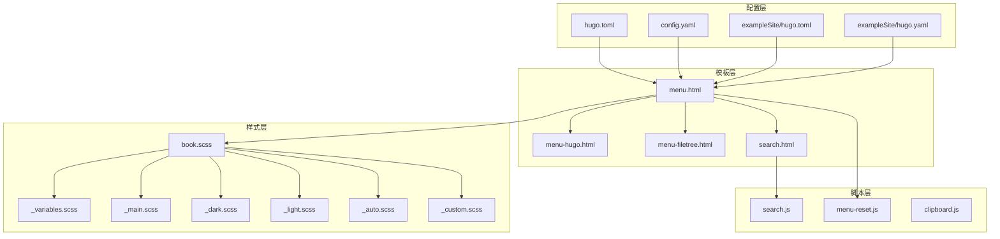
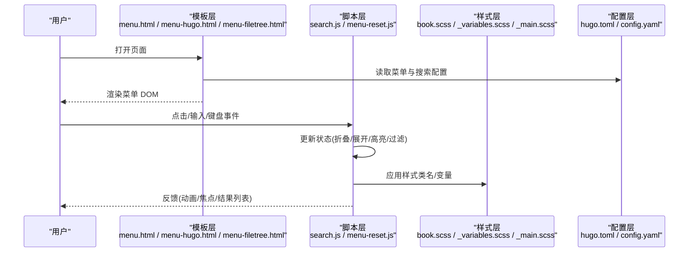
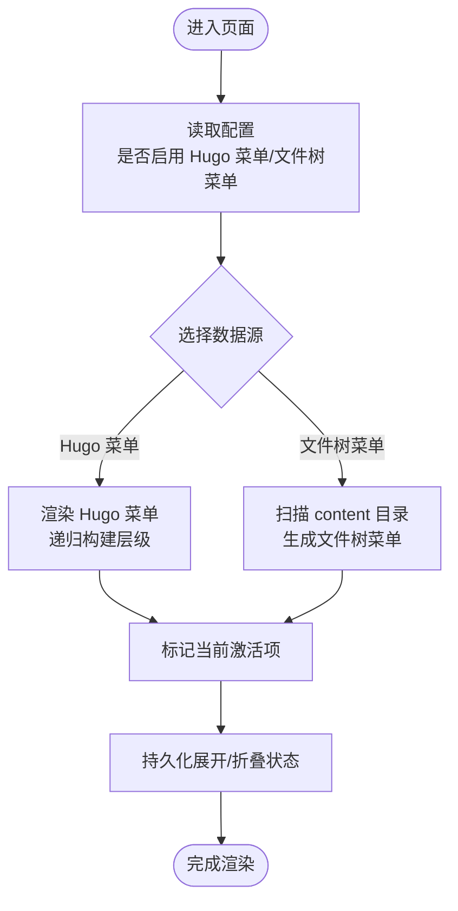
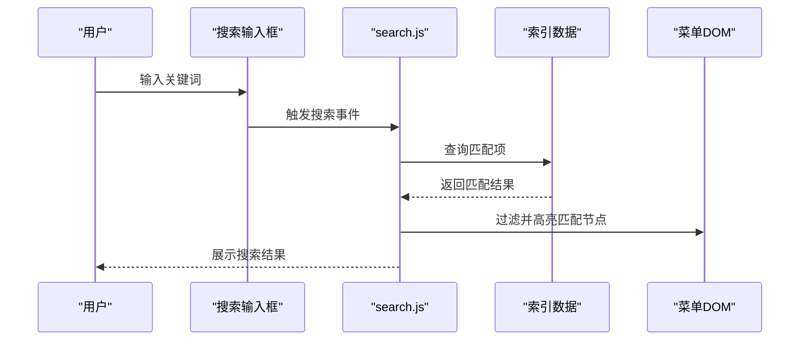
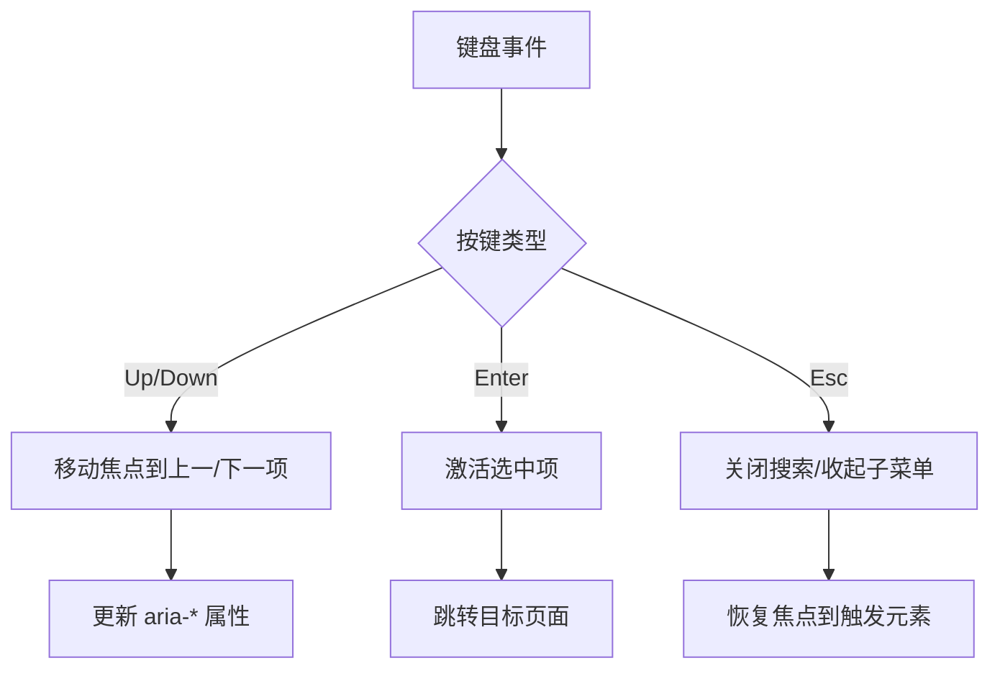
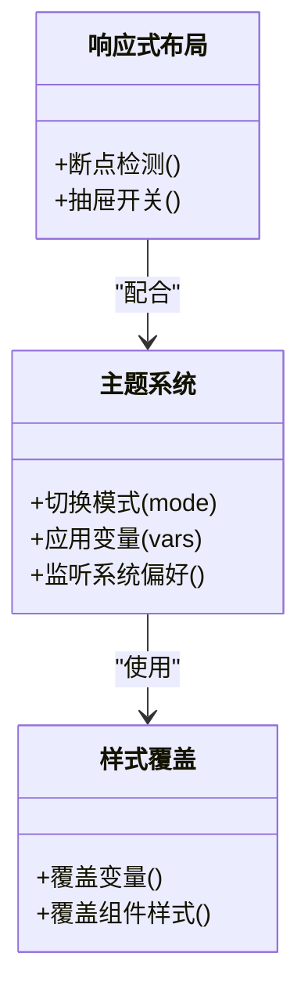
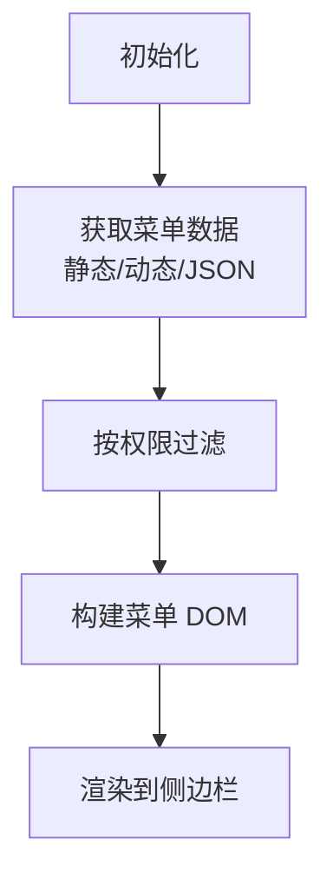
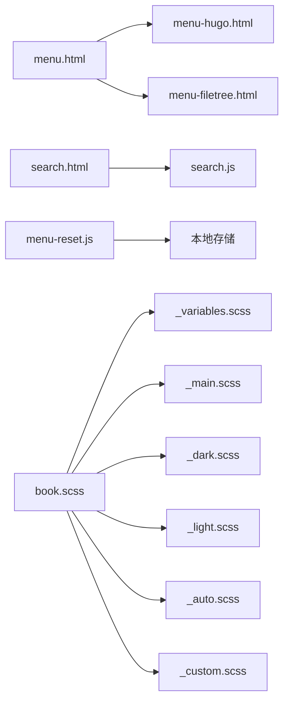

# 菜单导航交互

<cite>
**本文引用的文件**   
- [hugo-book 主题 README](file://themes/hugo-book/README.md)
- [主题配置示例 hugo.toml](file://themes/hugo-book/exampleSite/hugo.toml)
- [主题配置示例 hugo.yaml](file://themes/hugo-book/exampleSite/hugo.yaml)
- [侧边栏菜单模板 menu.html](file://themes/hugo-book/layouts/partials/docs/menu.html)
- [Hugo 内置菜单渲染模板 menu-hugo.html](file://themes/hugo-book/layouts/partials/docs/menu-hugo.html)
- [文件树菜单模板 menu-filetree.html](file://themes/hugo-book/layouts/partials/docs/menu-filetree.html)
- [搜索组件模板 search.html](file://themes/hugo-book/layouts/partials/docs/search.html)
- [搜索逻辑脚本 search.js](file://themes/hugo-book/assets/search.js)
- [菜单重置脚本 menu-reset.js](file://themes/hugo-book/assets/menu-reset.js)
- [复制按钮脚本 clipboard.js](file://themes/hugo-book/assets/clipboard.js)
- [样式入口 book.scss](file://themes/hugo-book/assets/book.scss)
- [变量与默认样式 _variables.scss](file://themes/hugo-book/assets/_variables.scss)
- [主样式 _main.scss](file://themes/hugo-book/assets/_main.scss)
- [自定义样式覆盖入口 _custom.scss](file://themes/hugo-book/assets/_custom.scss)
- [暗黑主题 _dark.scss](file://themes/hugo-book/assets/themes/_dark.scss)
- [浅色主题 _light.scss](file://themes/hugo-book/assets/themes/_light.scss)
- [自动主题 _auto.scss](file://themes/hugo-book/assets/themes/_auto.scss)
- [根站点配置 hugo.toml](file://hugo.toml)
- [根站点配置 config.yaml](file://config.yaml)
</cite>

## 目录
1. [简介](#简介)
2. [项目结构](#项目结构)
3. [核心组件](#核心组件)
4. [架构总览](#架构总览)
5. [详细组件分析](#详细组件分析)
6. [依赖关系分析](#依赖关系分析)
7. [性能考虑](#性能考虑)
8. [故障排查指南](#故障排查指南)
9. [结论](#结论)
10. [附录：JavaScript API 参考与使用示例](#附录javascript-api-参考与使用示例)

## 简介
本文件聚焦于 Hugo Book 主题的“菜单导航交互”，围绕侧边栏菜单的渲染、层级结构处理、状态管理、动态加载、权限控制、搜索过滤、键盘导航与无障碍访问、主题定制等展开，提供从架构到实现细节的系统性说明，并给出可操作的扩展方法与最佳实践。

## 项目结构
本项目基于 Hugo Book 主题，菜单与导航相关的关键位置如下：
- 模板层：负责将数据（Hugo 页面、Hugo 菜单、文件系统）渲染为 HTML 菜单结构
- 脚本层：负责菜单行为（折叠/展开、焦点管理、搜索过滤、移动端开关）
- 样式层：负责视觉呈现（布局、动画、响应式、主题切换）
- 配置层：通过 Hugo 配置启用/禁用特性、设置语言、搜索后端等

图表来源
- [侧边栏菜单模板 menu.html](file://themes/hugo-book/layouts/partials/docs/menu.html)
- [Hugo 内置菜单渲染模板 menu-hugo.html](file://themes/hugo-book/layouts/partials/docs/menu-hugo.html)
- [文件树菜单模板 menu-filetree.html](file://themes/hugo-book/layouts/partials/docs/menu-filetree.html)
- [搜索组件模板 search.html](file://themes/hugo-book/layouts/partials/docs/search.html)
- [搜索逻辑脚本 search.js](file://themes/hugo-book/assets/search.js)
- [菜单重置脚本 menu-reset.js](file://themes/hugo-book/assets/menu-reset.js)
- [复制按钮脚本 clipboard.js](file://themes/hugo-book/assets/clipboard.js)
- [样式入口 book.scss](file://themes/hugo-book/assets/book.scss)
- [变量与默认样式 _variables.scss](file://themes/hugo-book/assets/_variables.scss)
- [主样式 _main.scss](file://themes/hugo-book/assets/_main.scss)
- [暗黑主题 _dark.scss](file://themes/hugo-book/assets/themes/_dark.scss)
- [浅色主题 _light.scss](file://themes/hugo-book/assets/themes/_light.scss)
- [自动主题 _auto.scss](file://themes/hugo-book/assets/themes/_auto.scss)
- [根站点配置 hugo.toml](file://hugo.toml)
- [根站点配置 config.yaml](file://config.yaml)
- [主题配置示例 hugo.toml](file://themes/hugo-book/exampleSite/hugo.toml)
- [主题配置示例 hugo.yaml](file://themes/hugo-book/exampleSite/hugo.yaml)

章节来源
- [侧边栏菜单模板 menu.html](file://themes/hugo-book/layouts/partials/docs/menu.html)
- [Hugo 内置菜单渲染模板 menu-hugo.html](file://themes/hugo-book/layouts/partials/docs/menu-hugo.html)
- [文件树菜单模板 menu-filetree.html](file://themes/hugo-book/layouts/partials/docs/menu-filetree.html)
- [搜索组件模板 search.html](file://themes/hugo-book/layouts/partials/docs/search.html)
- [搜索逻辑脚本 search.js](file://themes/hugo-book/assets/search.js)
- [菜单重置脚本 menu-reset.js](file://themes/hugo-book/assets/menu-reset.js)
- [复制按钮脚本 clipboard.js](file://themes/hugo-book/assets/clipboard.js)
- [样式入口 book.scss](file://themes/hugo-book/assets/book.scss)
- [变量与默认样式 _variables.scss](file://themes/hugo-book/assets/_variables.scss)
- [主样式 _main.scss](file://themes/hugo-book/assets/_main.scss)
- [暗黑主题 _dark.scss](file://themes/hugo-book/assets/themes/_dark.scss)
- [浅色主题 _light.scss](file://themes/hugo-book/assets/themes/_light.scss)
- [自动主题 _auto.scss](file://themes/hugo-book/assets/themes/_auto.scss)
- [根站点配置 hugo.toml](file://hugo.toml)
- [根站点配置 config.yaml](file://config.yaml)
- [主题配置示例 hugo.toml](file://themes/hugo-book/exampleSite/hugo.toml)
- [主题配置示例 hugo.yaml](file://themes/hugo-book/exampleSite/hugo.yaml)

## 核心组件
- 菜单渲染器
  - Hugo 内置菜单：通过 Hugo 配置的菜单项生成，支持多级嵌套与排序
  - 文件树菜单：根据 content 目录结构自动生成，适合文档站
- 搜索与过滤
  - 前端索引构建与模糊匹配，支持中文分词与高亮
- 交互与状态
  - 折叠/展开、移动端抽屉开关、焦点管理与键盘导航
- 主题与样式
  - 多主题切换、CSS 变量覆盖、响应式适配与动画

章节来源
- [Hugo 内置菜单渲染模板 menu-hugo.html](file://themes/hugo-book/layouts/partials/docs/menu-hugo.html)
- [文件树菜单模板 menu-filetree.html](file://themes/hugo-book/layouts/partials/docs/menu-filetree.html)
- [搜索组件模板 search.html](file://themes/hugo-book/layouts/partials/docs/search.html)
- [搜索逻辑脚本 search.js](file://themes/hugo-book/assets/search.js)
- [菜单重置脚本 menu-reset.js](file://themes/hugo-book/assets/menu-reset.js)
- [样式入口 book.scss](file://themes/hugo-book/assets/book.scss)
- [变量与默认样式 _variables.scss](file://themes/hugo-book/assets/_variables.scss)
- [主样式 _main.scss](file://themes/hugo-book/assets/_main.scss)
- [暗黑主题 _dark.scss](file://themes/hugo-book/assets/themes/_dark.scss)
- [浅色主题 _light.scss](file://themes/hugo-book/assets/themes/_light.scss)
- [自动主题 _auto.scss](file://themes/hugo-book/assets/themes/_auto.scss)

## 架构总览
下图展示了菜单导航在模板、脚本与样式之间的协作关系，以及配置对行为的驱动方式。

图表来源
- [侧边栏菜单模板 menu.html](file://themes/hugo-book/layouts/partials/docs/menu.html)
- [Hugo 内置菜单渲染模板 menu-hugo.html](file://themes/hugo-book/layouts/partials/docs/menu-hugo.html)
- [文件树菜单模板 menu-filetree.html](file://themes/hugo-book/layouts/partials/docs/menu-filetree.html)
- [搜索组件模板 search.html](file://themes/hugo-book/layouts/partials/docs/search.html)
- [搜索逻辑脚本 search.js](file://themes/hugo-book/assets/search.js)
- [菜单重置脚本 menu-reset.js](file://themes/hugo-book/assets/menu-reset.js)
- [样式入口 book.scss](file://themes/hugo-book/assets/book.scss)
- [变量与默认样式 _variables.scss](file://themes/hugo-book/assets/_variables.scss)
- [主样式 _main.scss](file://themes/hugo-book/assets/_main.scss)
- [根站点配置 hugo.toml](file://hugo.toml)
- [根站点配置 config.yaml](file://config.yaml)

## 详细组件分析

### 侧边栏菜单渲染与层级结构
- 渲染入口
  - 通用菜单容器由菜单模板引入，内部可选择 Hugo 内置菜单或文件树菜单两种数据源
- Hugo 内置菜单
  - 通过 Hugo 配置定义菜单项，支持标题、URL、权重、子项嵌套
  - 模板递归渲染层级，标记当前激活项，维护展开/折叠状态
- 文件树菜单
  - 基于 content 目录结构自动生成，适合文档站快速搭建
  - 自动识别层级，生成缩进与图标，支持隐藏与折叠
- 状态管理
  - 使用本地存储持久化展开/折叠状态
  - 滚动时保持当前页对应菜单项高亮

图表来源
- [侧边栏菜单模板 menu.html](file://themes/hugo-book/layouts/partials/docs/menu.html)
- [Hugo 内置菜单渲染模板 menu-hugo.html](file://themes/hugo-book/layouts/partials/docs/menu-hugo.html)
- [文件树菜单模板 menu-filetree.html](file://themes/hugo-book/layouts/partials/docs/menu-filetree.html)

章节来源
- [侧边栏菜单模板 menu.html](file://themes/hugo-book/layouts/partials/docs/menu.html)
- [Hugo 内置菜单渲染模板 menu-hugo.html](file://themes/hugo-book/layouts/partials/docs/menu-hugo.html)
- [文件树菜单模板 menu-filetree.html](file://themes/hugo-book/layouts/partials/docs/menu-filetree.html)

### 搜索与过滤
- 搜索入口
  - 搜索面板由搜索模板注入，支持中英文输入
- 索引构建
  - 脚本收集页面标题、内容片段，构建轻量级索引
- 匹配与高亮
  - 支持模糊匹配与关键词高亮，提升检索体验
- 过滤菜单
  - 根据输入实时过滤菜单项，仅显示匹配节点及其祖先路径

图表来源
- [搜索组件模板 search.html](file://themes/hugo-book/layouts/partials/docs/search.html)
- [搜索逻辑脚本 search.js](file://themes/hugo-book/assets/search.js)

章节来源
- [搜索组件模板 search.html](file://themes/hugo-book/layouts/partials/docs/search.html)
- [搜索逻辑脚本 search.js](file://themes/hugo-book/assets/search.js)

### 键盘导航与无障碍访问
- 快捷键
  - 支持方向键在菜单项间移动，Enter 确认选择，Esc 关闭搜索或收起子菜单
- 焦点管理
  - 打开/关闭菜单时正确设置焦点，避免焦点丢失
- 语义化与 ARIA
  - 使用合适的标签与属性，确保屏幕阅读器可读

图表来源
- [菜单重置脚本 menu-reset.js](file://themes/hugo-book/assets/menu-reset.js)
- [搜索组件模板 search.html](file://themes/hugo-book/layouts/partials/docs/search.html)

章节来源
- [菜单重置脚本 menu-reset.js](file://themes/hugo-book/assets/menu-reset.js)
- [搜索组件模板 search.html](file://themes/hugo-book/layouts/partials/docs/search.html)

### 主题定制与响应式适配
- 主题切换
  - 支持深色/浅色/自动模式，通过 CSS 变量与主题样式文件组合实现
- 样式覆盖
  - 通过自定义样式入口进行覆盖，优先于默认样式
- 响应式
  - 在小屏设备下以抽屉形式展示菜单，提供开关按钮与遮罩层
- 动画
  - 菜单展开/收起、搜索面板出现/消失均带有过渡动画

图表来源
- [样式入口 book.scss](file://themes/hugo-book/assets/book.scss)
- [变量与默认样式 _variables.scss](file://themes/hugo-book/assets/_variables.scss)
- [主样式 _main.scss](file://themes/hugo-book/assets/_main.scss)
- [暗黑主题 _dark.scss](file://themes/hugo-book/assets/themes/_dark.scss)
- [浅色主题 _light.scss](file://themes/hugo-book/assets/themes/_light.scss)
- [自动主题 _auto.scss](file://themes/hugo-book/assets/themes/_auto.scss)
- [自定义样式覆盖入口 _custom.scss](file://themes/hugo-book/assets/_custom.scss)

章节来源
- [样式入口 book.scss](file://themes/hugo-book/assets/book.scss)
- [变量与默认样式 _variables.scss](file://themes/hugo-book/assets/_variables.scss)
- [主样式 _main.scss](file://themes/hugo-book/assets/_main.scss)
- [暗黑主题 _dark.scss](file://themes/hugo-book/assets/themes/_dark.scss)
- [浅色主题 _light.scss](file://themes/hugo-book/assets/themes/_light.scss)
- [自动主题 _auto.scss](file://themes/hugo-book/assets/themes/_auto.scss)
- [自定义样式覆盖入口 _custom.scss](file://themes/hugo-book/assets/_custom.scss)

### 动态菜单加载与权限控制
- 动态菜单
  - 可在页面初始化后通过脚本追加菜单项，或使用外部 JSON 数据源动态构建
- 权限控制
  - 在渲染阶段根据用户角色或权限字段过滤菜单项
  - 也可在服务端预处理菜单数据，仅输出有权限的节点

图表来源
- [Hugo 内置菜单渲染模板 menu-hugo.html](file://themes/hugo-book/layouts/partials/docs/menu-hugo.html)
- [文件树菜单模板 menu-filetree.html](file://themes/hugo-book/layouts/partials/docs/menu-filetree.html)
- [搜索逻辑脚本 search.js](file://themes/hugo-book/assets/search.js)

章节来源
- [Hugo 内置菜单渲染模板 menu-hugo.html](file://themes/hugo-book/layouts/partials/docs/menu-hugo.html)
- [文件树菜单模板 menu-filetree.html](file://themes/hugo-book/layouts/partials/docs/menu-filetree.html)
- [搜索逻辑脚本 search.js](file://themes/hugo-book/assets/search.js)

## 依赖关系分析
- 模板依赖
  - 菜单模板依赖 Hugo 提供的数据对象与局部模板
- 脚本依赖
  - 搜索脚本依赖 DOM API 与可选的分词库
  - 菜单重置脚本依赖事件系统与本地存储
- 样式依赖
  - 主题样式依赖 CSS 变量与媒体查询
- 配置依赖
  - Hugo 配置决定菜单数据源、搜索后端、语言与主题模式

图表来源
- [侧边栏菜单模板 menu.html](file://themes/hugo-book/layouts/partials/docs/menu.html)
- [Hugo 内置菜单渲染模板 menu-hugo.html](file://themes/hugo-book/layouts/partials/docs/menu-hugo.html)
- [文件树菜单模板 menu-filetree.html](file://themes/hugo-book/layouts/partials/docs/menu-filetree.html)
- [搜索组件模板 search.html](file://themes/hugo-book/layouts/partials/docs/search.html)
- [搜索逻辑脚本 search.js](file://themes/hugo-book/assets/search.js)
- [菜单重置脚本 menu-reset.js](file://themes/hugo-book/assets/menu-reset.js)
- [样式入口 book.scss](file://themes/hugo-book/assets/book.scss)
- [变量与默认样式 _variables.scss](file://themes/hugo-book/assets/_variables.scss)
- [主样式 _main.scss](file://themes/hugo-book/assets/_main.scss)
- [暗黑主题 _dark.scss](file://themes/hugo-book/assets/themes/_dark.scss)
- [浅色主题 _light.scss](file://themes/hugo-book/assets/themes/_light.scss)
- [自动主题 _auto.scss](file://themes/hugo-book/assets/themes/_auto.scss)
- [自定义样式覆盖入口 _custom.scss](file://themes/hugo-book/assets/_custom.scss)

章节来源
- [侧边栏菜单模板 menu.html](file://themes/hugo-book/layouts/partials/docs/menu.html)
- [Hugo 内置菜单渲染模板 menu-hugo.html](file://themes/hugo-book/layouts/partials/docs/menu-hugo.html)
- [文件树菜单模板 menu-filetree.html](file://themes/hugo-book/layouts/partials/docs/menu-filetree.html)
- [搜索组件模板 search.html](file://themes/hugo-book/layouts/partials/docs/search.html)
- [搜索逻辑脚本 search.js](file://themes/hugo-book/assets/search.js)
- [菜单重置脚本 menu-reset.js](file://themes/hugo-book/assets/menu-reset.js)
- [样式入口 book.scss](file://themes/hugo-book/assets/book.scss)
- [变量与默认样式 _variables.scss](file://themes/hugo-book/assets/_variables.scss)
- [主样式 _main.scss](file://themes/hugo-book/assets/_main.scss)
- [暗黑主题 _dark.scss](file://themes/hugo-book/assets/themes/_dark.scss)
- [浅色主题 _light.scss](file://themes/hugo-book/assets/themes/_light.scss)
- [自动主题 _auto.scss](file://themes/hugo-book/assets/themes/_auto.scss)
- [自定义样式覆盖入口 _custom.scss](file://themes/hugo-book/assets/_custom.scss)

## 性能考虑
- 菜单渲染
  - 优先使用服务端预渲染，减少客户端计算
  - 大菜单采用懒加载与虚拟滚动策略
- 搜索性能
  - 合理限制索引规模，按需构建索引
  - 使用防抖与节流优化输入事件
- 样式与动画
  - 避免重排重绘，使用 transform 与 opacity 做动画
  - 合理使用媒体查询与 CSS 变量，减少重复样式

## 故障排查指南
- 菜单不显示
  - 检查 Hugo 配置是否正确启用菜单数据源
  - 确认模板路径与局部模板引用无误
- 搜索无结果
  - 检查搜索脚本是否加载成功
  - 确认索引数据是否构建完成
- 键盘导航异常
  - 检查事件绑定是否被其他脚本覆盖
  - 确认焦点元素是否存在且可聚焦
- 主题未生效
  - 检查主题模式配置与 CSS 变量覆盖顺序
  - 确认浏览器缓存已清理

章节来源
- [搜索组件模板 search.html](file://themes/hugo-book/layouts/partials/docs/search.html)
- [搜索逻辑脚本 search.js](file://themes/hugo-book/assets/search.js)
- [菜单重置脚本 menu-reset.js](file://themes/hugo-book/assets/menu-reset.js)
- [样式入口 book.scss](file://themes/hugo-book/assets/book.scss)
- [变量与默认样式 _variables.scss](file://themes/hugo-book/assets/_variables.scss)
- [主样式 _main.scss](file://themes/hugo-book/assets/_main.scss)
- [暗黑主题 _dark.scss](file://themes/hugo-book/assets/themes/_dark.scss)
- [浅色主题 _light.scss](file://themes/hugo-book/assets/themes/_light.scss)
- [自动主题 _auto.scss](file://themes/hugo-book/assets/themes/_auto.scss)

## 结论
通过对模板、脚本与样式的分层解析，可以清晰地理解 Hugo Book 主题中菜单导航的实现机制。借助配置与扩展点，开发者能够灵活地实现动态菜单、权限控制、搜索过滤、键盘导航与主题定制，从而构建出高效、易用且可访问的导航体验。

## 附录：JavaScript API 参考与使用示例
以下列出与菜单导航相关的脚本与典型用法要点，便于集成与二次开发。

- 搜索脚本
  - 职责：构建索引、执行匹配、更新菜单高亮与可见性
  - 典型用法：在搜索输入事件中调用匹配函数，传入关键词与回调
  - 参考文件
    - [搜索组件模板 search.html](file://themes/hugo-book/layouts/partials/docs/search.html)
    - [搜索逻辑脚本 search.js](file://themes/hugo-book/assets/search.js)

- 菜单重置脚本
  - 职责：管理菜单状态、焦点与键盘事件
  - 典型用法：在打开/关闭菜单时调用重置方法，确保焦点与 ARIA 属性一致
  - 参考文件
    - [菜单重置脚本 menu-reset.js](file://themes/hugo-book/assets/menu-reset.js)

- 复制按钮脚本
  - 职责：提供代码块复制功能，与菜单无关但常与文档站配套使用
  - 典型用法：在代码块渲染完成后绑定复制事件
  - 参考文件
    - [复制按钮脚本 clipboard.js](file://themes/hugo-book/assets/clipboard.js)

- 主题与样式
  - 职责：提供主题切换与样式覆盖能力
  - 典型用法：通过 CSS 变量覆盖颜色、字体、间距；使用媒体查询适配小屏
  - 参考文件
    - [样式入口 book.scss](file://themes/hugo-book/assets/book.scss)
    - [变量与默认样式 _variables.scss](file://themes/hugo-book/assets/_variables.scss)
    - [主样式 _main.scss](file://themes/hugo-book/assets/_main.scss)
    - [暗黑主题 _dark.scss](file://themes/hugo-book/assets/themes/_dark.scss)
    - [浅色主题 _light.scss](file://themes/hugo-book/assets/themes/_light.scss)
    - [自动主题 _auto.scss](file://themes/hugo-book/assets/themes/_auto.scss)
    - [自定义样式覆盖入口 _custom.scss](file://themes/hugo-book/assets/_custom.scss)

- 配置示例
  - 主题配置示例
    - [主题配置示例 hugo.toml](file://themes/hugo-book/exampleSite/hugo.toml)
    - [主题配置示例 hugo.yaml](file://themes/hugo-book/exampleSite/hugo.yaml)
  - 根站点配置
    - [根站点配置 hugo.toml](file://hugo.toml)
    - [根站点配置 config.yaml](file://config.yaml)

章节来源
- [搜索组件模板 search.html](file://themes/hugo-book/layouts/partials/docs/search.html)
- [搜索逻辑脚本 search.js](file://themes/hugo-book/assets/search.js)
- [菜单重置脚本 menu-reset.js](file://themes/hugo-book/assets/menu-reset.js)
- [复制按钮脚本 clipboard.js](file://themes/hugo-book/assets/clipboard.js)
- [样式入口 book.scss](file://themes/hugo-book/assets/book.scss)
- [变量与默认样式 _variables.scss](file://themes/hugo-book/assets/_variables.scss)
- [主样式 _main.scss](file://themes/hugo-book/assets/_main.scss)
- [暗黑主题 _dark.scss](file://themes/hugo-book/assets/themes/_dark.scss)
- [浅色主题 _light.scss](file://themes/hugo-book/assets/themes/_light.scss)
- [自动主题 _auto.scss](file://themes/hugo-book/assets/themes/_auto.scss)
- [自定义样式覆盖入口 _custom.scss](file://themes/hugo-book/assets/_custom.scss)
- [主题配置示例 hugo.toml](file://themes/hugo-book/exampleSite/hugo.toml)
- [主题配置示例 hugo.yaml](file://themes/hugo-book/exampleSite/hugo.yaml)
- [根站点配置 hugo.toml](file://hugo.toml)
- [根站点配置 config.yaml](file://config.yaml)