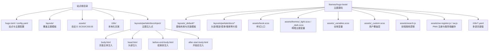
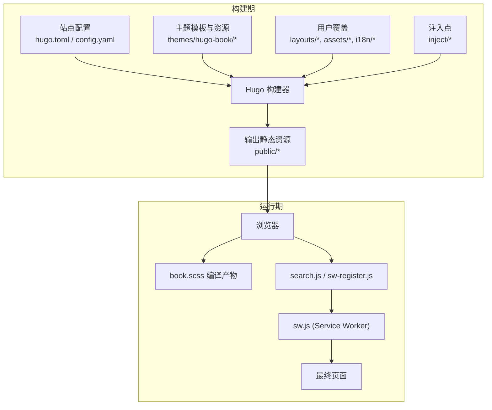
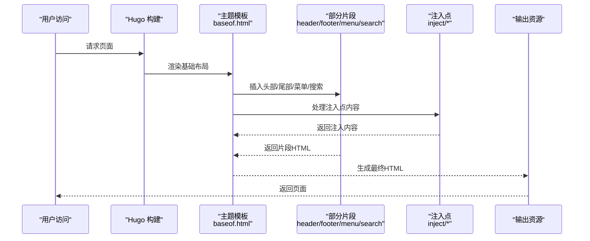
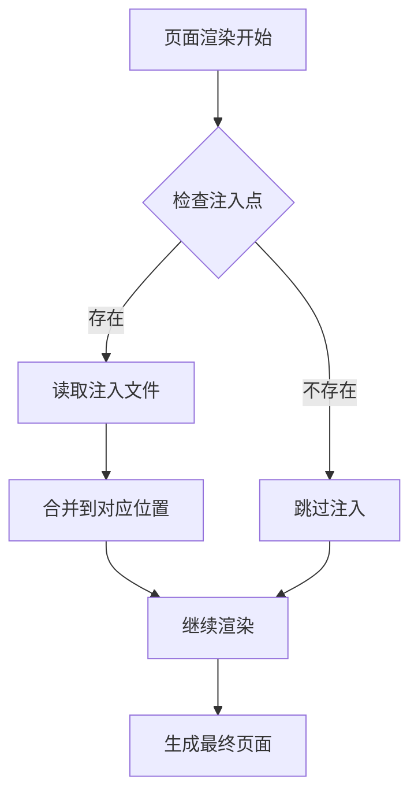
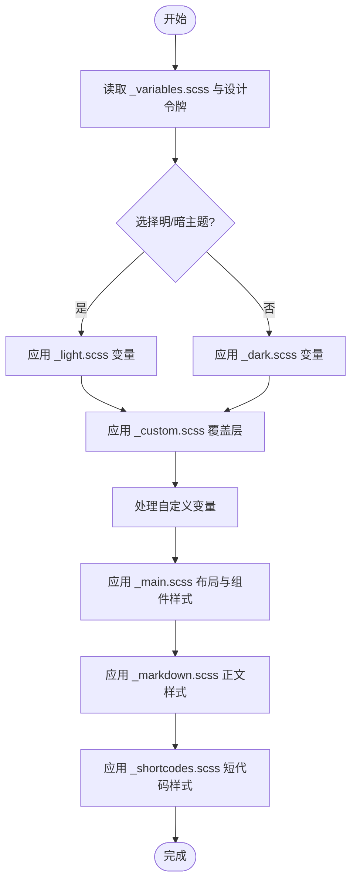
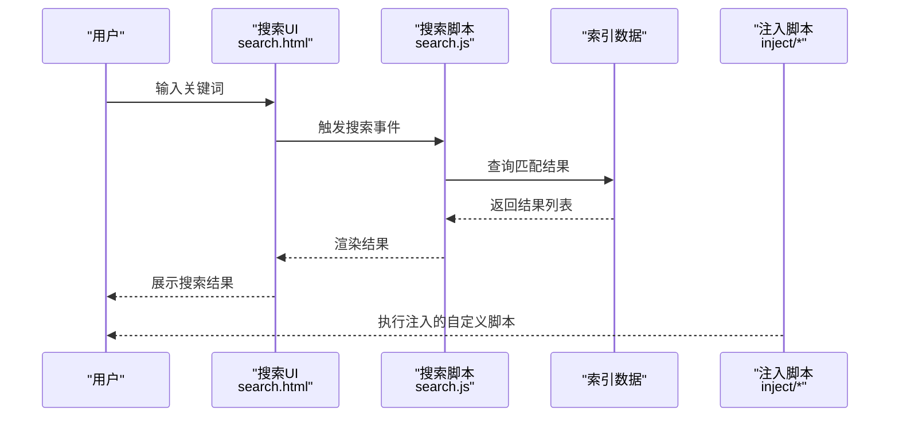
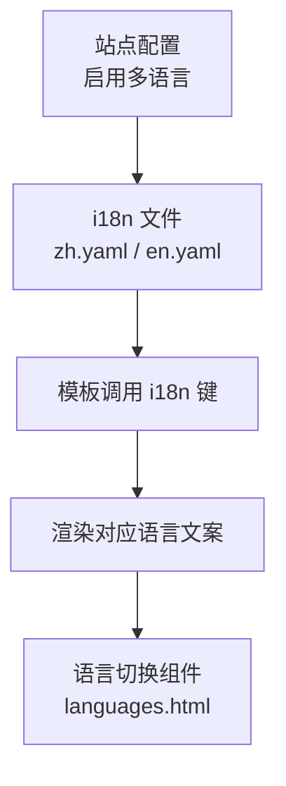
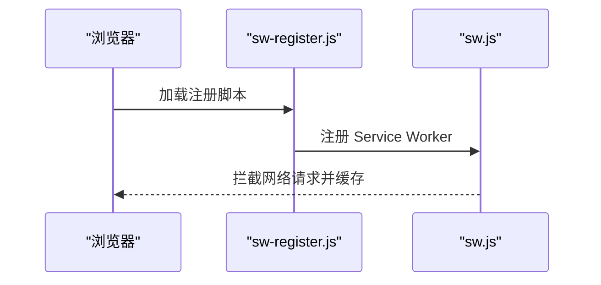
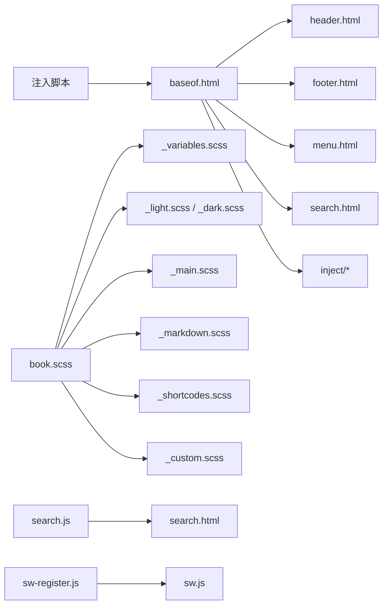

# 主题定制

<cite>
**本文引用的文件**   
- [hugo.toml](file://hugo.toml)
- [config.yaml](file://config.yaml)
- [layouts/_default/baseof.html](file://themes/hugo-book/layouts/_default/baseof.html)
- [layouts/partials/docs/header.html](file://themes/hugo-book/layouts/partials/docs/header.html)
- [layouts/partials/docs/footer.html](file://themes/hugo-book/layouts/partials/docs/footer.html)
- [layouts/partials/docs/menu.html](file://themes/hugo-book/layouts/partials/docs/menu.html)
- [layouts/partials/docs/search.html](file://themes/hugo-book/layouts/partials/docs/search.html)
- [assets/book.scss](file://themes/hugo-book/assets/book.scss)
- [assets/_variables.scss](file://themes/hugo-book/assets/_variables.scss)
- [assets/_custom.scss](file://themes/hugo-book/assets/_custom.scss)
- [assets/themes/_light.scss](file://themes/hugo-book/assets/themes/_light.scss)
- [assets/themes/_dark.scss](file://themes/hugo-book/assets/themes/_dark.scss)
- [assets/_fonts.scss](file://themes/hugo-book/assets/_fonts.scss)
- [assets/_main.scss](file://themes/hugo-book/assets/_main.scss)
- [assets/_markdown.scss](file://themes/hugo-book/assets/_markdown.scss)
- [assets/_shortcodes.scss](file://themes/hugo-book/assets/_shortcodes.scss)
- [assets/normalize.css](file://themes/hugo-book/assets/normalize.css)
- [assets/search.js](file://themes/hugo-book/assets/search.js)
- [assets/sw-register.js](file://themes/hugo-book/assets/sw-register.js)
- [assets/sw.js](file://themes/hugo-book/assets/sw.js)
- [i18n/zh.yaml](file://themes/hugo-book/i18n/zh.yaml)
- [i18n/en.yaml](file://themes/hugo-book/i18n/en.yaml)
- [layouts/partials/docs/inject/body.html](file://layouts/partials/docs/inject/body.html)
</cite>

## 更新摘要
**变更内容**   
- 新增主题注入功能章节，详细说明 inject 机制的使用方法
- 扩展 SCSS 变量定制部分，增加变量覆盖和自定义变量的最佳实践
- 增强样式定制指南，提供更详细的变量定制示例
- 更新模板覆盖机制，说明注入点的使用场景

## 目录
1. [简介](#简介)
2. [项目结构](#项目结构)
3. [核心组件](#核心组件)
4. [架构总览](#架构总览)
5. [详细组件分析](#详细组件分析)
6. [依赖关系分析](#依赖关系分析)
7. [性能考虑](#性能考虑)
8. [故障排查指南](#故障排查指南)
9. [结论](#结论)
10. [附录](#附录)

## 简介
本指南面向希望深度定制 hugo-book 主题的开发者与内容作者，系统解析主题结构与扩展点，覆盖布局模板、样式资源、脚本交互、多语言支持、品牌元素替换以及性能优化实践。文档以"从整体到局部"的方式组织，既提供高层架构图，也给出关键文件的定位与参考路径，帮助你在不破坏默认行为的前提下实现个性化定制。

**更新** 新增了主题注入功能和增强的 SCSS 变量定制能力，进一步提升了主题的扩展性和样式定制选项。

## 项目结构
本项目采用 Hugo 标准目录约定，并通过子模块引入 hugo-book 主题。主题的核心可定制点集中在以下位置：
- 站点配置：hugo.toml、config.yaml
- 模板覆盖：layouts（优先于主题内置 layouts）
- 样式与变量：assets（SCSS/CSS），通过 book.scss 统一入口
- 脚本与 PWA：assets 下的 search.js、sw-register.js、sw.js
- 多语言文案：i18n/*.yaml
- **新增** 主题注入点：layouts/partials/docs/inject/*

图表来源
- [hugo.toml](file://hugo.toml)
- [config.yaml](file://config.yaml)
- [layouts/partials/docs/inject/body.html](file://layouts/partials/docs/inject/body.html)
- [themes/hugo-book/layouts/_default/baseof.html](file://themes/hugo-book/layouts/_default/baseof.html)
- [themes/hugo-book/layouts/partials/docs/header.html](file://themes/hugo-book/layouts/partials/docs/header.html)
- [themes/hugo-book/layouts/partials/docs/footer.html](file://themes/hugo-book/layouts/partials/docs/footer.html)
- [themes/hugo-book/layouts/partials/docs/menu.html](file://themes/hugo-book/layouts/partials/docs/menu.html)
- [themes/hugo-book/layouts/partials/docs/search.html](file://themes/hugo-book/layouts/partials/docs/search.html)
- [themes/hugo-book/assets/book.scss](file://themes/hugo-book/assets/book.scss)
- [themes/hugo-book/assets/_variables.scss](file://themes/hugo-book/assets/_variables.scss)
- [themes/hugo-book/assets/_custom.scss](file://themes/hugo-book/assets/_custom.scss)
- [themes/hugo-book/assets/themes/_light.scss](file://themes/hugo-book/assets/themes/_light.scss)
- [themes/hugo-book/assets/themes/_dark.scss](file://themes/hugo-book/assets/themes/_dark.scss)
- [themes/hugo-book/assets/_fonts.scss](file://themes/hugo-book/assets/_fonts.scss)
- [themes/hugo-book/assets/_main.scss](file://themes/hugo-book/assets/_main.scss)
- [themes/hugo-book/assets/_markdown.scss](file://themes/hugo-book/assets/_markdown.scss)
- [themes/hugo-book/assets/_shortcodes.scss](file://themes/hugo-book/assets/_shortcodes.scss)
- [themes/hugo-book/assets/normalize.css](file://themes/hugo-book/assets/normalize.css)
- [themes/hugo-book/assets/search.js](file://themes/hugo-book/assets/search.js)
- [themes/hugo-book/assets/sw-register.js](file://themes/hugo-book/assets/sw-register.js)
- [themes/hugo-book/assets/sw.js](file://themes/hugo-book/assets/sw.js)
- [themes/hugo-book/i18n/zh.yaml](file://themes/hugo-book/i18n/zh.yaml)
- [themes/hugo-book/i18n/en.yaml](file://themes/hugo-book/i18n/en.yaml)

章节来源
- [hugo.toml](file://hugo.toml)
- [config.yaml](file://config.yaml)

## 核心组件
- 模板体系
  - baseof.html：全站基础布局，定义 HTML 骨架、资源注入与区块插槽。
  - list.html/single.html：列表页与单页模板，组合 partials 生成最终页面。
  - partials/docs/*：头部、尾部、菜单、搜索、标题、语言切换等可复用片段。
  - **新增** inject/*：主题注入点，允许在特定位置插入自定义内容。
- 样式体系
  - book.scss：样式入口，聚合 normalize、变量、主题、主样式、Markdown 渲染、短代码样式等。
  - _variables.scss：颜色、字体、间距、断点等设计令牌。
  - themes/_light.scss / _dark.scss：明暗两套变量集合。
  - _custom.scss：用户覆盖层，推荐在此进行二次定制。
  - _fonts.scss / _main.scss / _markdown.scss / _shortcodes.scss：字体、布局、排版与短代码样式。
- 脚本与 PWA
  - search.js：前端搜索索引构建与交互。
  - sw-register.js / sw.js：Service Worker 注册与离线缓存策略。
- 多语言
  - i18n/*.yaml：键值对文案，按语言区分。

章节来源
- [themes/hugo-book/layouts/_default/baseof.html](file://themes/hugo-book/layouts/_default/baseof.html)
- [themes/hugo-book/layouts/partials/docs/header.html](file://themes/hugo-book/layouts/partials/docs/header.html)
- [themes/hugo-book/layouts/partials/docs/footer.html](file://themes/hugo-book/layouts/partials/docs/footer.html)
- [themes/hugo-book/layouts/partials/docs/menu.html](file://themes/hugo-book/layouts/partials/docs/menu.html)
- [themes/hugo-book/layouts/partials/docs/search.html](file://themes/hugo-book/layouts/partials/docs/search.html)
- [layouts/partials/docs/inject/body.html](file://layouts/partials/docs/inject/body.html)
- [themes/hugo-book/assets/book.scss](file://themes/hugo-book/assets/book.scss)
- [themes/hugo-book/assets/_variables.scss](file://themes/hugo-book/assets/_variables.scss)
- [themes/hugo-book/assets/_custom.scss](file://themes/hugo-book/assets/_custom.scss)
- [themes/hugo-book/assets/themes/_light.scss](file://themes/hugo-book/assets/themes/_light.scss)
- [themes/hugo-book/assets/themes/_dark.scss](file://themes/hugo-book/assets/themes/_dark.scss)
- [themes/hugo-book/assets/_fonts.scss](file://themes/hugo-book/assets/_fonts.scss)
- [themes/hugo-book/assets/_main.scss](file://themes/hugo-book/assets/_main.scss)
- [themes/hugo-book/assets/_markdown.scss](file://themes/hugo-book/assets/_markdown.scss)
- [themes/hugo-book/assets/_shortcodes.scss](file://themes/hugo-book/assets/_shortcodes.scss)
- [themes/hugo-book/assets/search.js](file://themes/hugo-book/assets/search.js)
- [themes/hugo-book/assets/sw-register.js](file://themes/hugo-book/assets/sw-register.js)
- [themes/hugo-book/assets/sw.js](file://themes/hugo-book/assets/sw.js)
- [themes/hugo-book/i18n/zh.yaml](file://themes/hugo-book/i18n/zh.yaml)
- [themes/hugo-book/i18n/en.yaml](file://themes/hugo-book/i18n/en.yaml)

## 架构总览
下图展示了站点构建与运行时各组件的协作关系：Hugo 在构建期根据配置加载主题，合并 layouts 与 assets；运行时由浏览器加载编译后的 CSS/JS，并执行搜索与 PWA 功能。

图表来源
- [hugo.toml](file://hugo.toml)
- [config.yaml](file://config.yaml)
- [layouts/partials/docs/inject/body.html](file://layouts/partials/docs/inject/body.html)
- [themes/hugo-book/assets/book.scss](file://themes/hugo-book/assets/book.scss)
- [themes/hugo-book/assets/search.js](file://themes/hugo-book/assets/search.js)
- [themes/hugo-book/assets/sw-register.js](file://themes/hugo-book/assets/sw-register.js)
- [themes/hugo-book/assets/sw.js](file://themes/hugo-book/assets/sw.js)

## 详细组件分析

### 模板覆盖机制与布局要点
- 覆盖优先级
  - 站点 layouts > 主题 layouts。将需要修改的模板复制到站点对应路径即可生效。
- 关键模板
  - baseof.html：定义 <html>/<head>/<body> 骨架与资源注入点，建议仅在必要时覆盖。
  - header/footer/menu：常用可插拔区域，适合调整导航、版权、外链等。
  - search：集成前端搜索 UI 与数据源。
- 覆盖示例路径
  - 覆盖基础布局：[layouts/_default/baseof.html](file://layouts/_default/baseof.html)
  - 覆盖头部：[layouts/partials/docs/header.html](file://layouts/partials/docs/header.html)
  - 覆盖尾部：[layouts/partials/docs/footer.html](file://layouts/partials/docs/footer.html)
  - 覆盖菜单：[layouts/partials/docs/menu.html](file://layouts/partials/docs/menu.html)
  - 覆盖搜索：[layouts/partials/docs/search.html](file://layouts/partials/docs/search.html)

图表来源
- [themes/hugo-book/layouts/_default/baseof.html](file://themes/hugo-book/layouts/_default/baseof.html)
- [themes/hugo-book/layouts/partials/docs/header.html](file://themes/hugo-book/layouts/partials/docs/header.html)
- [themes/hugo-book/layouts/partials/docs/footer.html](file://themes/hugo-book/layouts/partials/docs/footer.html)
- [themes/hugo-book/layouts/partials/docs/menu.html](file://themes/hugo-book/layouts/partials/docs/menu.html)
- [themes/hugo-book/layouts/partials/docs/search.html](file://themes/hugo-book/layouts/partials/docs/search.html)
- [layouts/partials/docs/inject/body.html](file://layouts/partials/docs/inject/body.html)

章节来源
- [themes/hugo-book/layouts/_default/baseof.html](file://themes/hugo-book/layouts/_default/baseof.html)
- [themes/hugo-book/layouts/partials/docs/header.html](file://themes/hugo-book/layouts/partials/docs/header.html)
- [themes/hugo-book/layouts/partials/docs/footer.html](file://themes/hugo-book/layouts/partials/docs/footer.html)
- [themes/hugo-book/layouts/partials/docs/menu.html](file://themes/hugo-book/layouts/partials/docs/menu.html)
- [themes/hugo-book/layouts/partials/docs/search.html](file://themes/hugo-book/layouts/partials/docs/search.html)

### 主题注入功能
**新增** 主题注入功能提供了灵活的扩展点，允许在不修改主题核心文件的情况下插入自定义内容。

- 注入点类型
  - body.html：在页面主体中注入内容
  - head.html：在 HTML head 部分注入内容
  - before-end-body.html：在 </body> 标签之前注入
  - after-start-body.html：在 <body> 标签之后注入
- 使用方法
  - 在站点的 layouts/partials/docs/inject/ 目录下创建对应文件
  - 文件中编写任意 HTML、JavaScript 或 CSS 代码
  - Hugo 会自动将这些内容合并到最终页面中
- 使用场景
  - 添加第三方分析脚本
  - 插入自定义样式或脚本
  - 集成外部服务 SDK
  - 添加特定的页面功能

图表来源
- [layouts/partials/docs/inject/body.html](file://layouts/partials/docs/inject/body.html)

章节来源
- [layouts/partials/docs/inject/body.html](file://layouts/partials/docs/inject/body.html)

### 样式定制（CSS/SCSS）
- 入口与分层
  - book.scss：统一入口，依次引入 normalize、变量、主题、主样式、Markdown 与短代码样式。
  - _variables.scss：设计令牌集中地（颜色、字体、间距、断点）。
  - themes/_light.scss / _dark.scss：明暗两套变量集合。
  - _custom.scss：用户覆盖层，推荐在此追加或覆盖变量与规则。
- **增强** SCSS 变量定制
  - 变量覆盖：在 _custom.scss 中重新定义变量值
  - 自定义变量：在 _custom.scss 中定义新的变量供后续使用
  - 条件变量：基于媒体查询或主题模式设置不同变量值
  - 变量继承：利用 SCSS 的 @extend 机制共享样式规则
- 定制清单
  - 颜色主题：在 _custom.scss 中覆盖变量，或通过新增主题变量文件并在入口中引入。
  - 字体设置：在 _fonts.scss 中管理字体族与加载策略，或在 _variables.scss 中调整字体变量。
  - 响应式布局：在 _variables.scss 中调整断点变量，结合 _main.scss 中的布局规则微调。
  - Markdown 排版：通过 _markdown.scss 控制正文样式（行高、链接、表格、代码块等）。
  - 短代码样式：通过 _shortcodes.scss 调整按钮、提示框、标签页等组件外观。
- 推荐做法
  - 仅覆盖必要变量，避免重写整段样式。
  - 使用 _custom.scss 作为唯一覆盖入口，保持变更可追踪。
  - 利用浏览器开发者工具定位具体类名，再精准覆盖。
  - **新增** 为大型项目建立变量命名规范，提高可维护性。

图表来源
- [themes/hugo-book/assets/book.scss](file://themes/hugo-book/assets/book.scss)
- [themes/hugo-book/assets/_variables.scss](file://themes/hugo-book/assets/_variables.scss)
- [themes/hugo-book/assets/_custom.scss](file://themes/hugo-book/assets/_custom.scss)
- [themes/hugo-book/assets/themes/_light.scss](file://themes/hugo-book/assets/themes/_light.scss)
- [themes/hugo-book/assets/themes/_dark.scss](file://themes/hugo-book/assets/themes/_dark.scss)
- [themes/hugo-book/assets/_fonts.scss](file://themes/hugo-book/assets/_fonts.scss)
- [themes/hugo-book/assets/_main.scss](file://themes/hugo-book/assets/_main.scss)
- [themes/hugo-book/assets/_markdown.scss](file://themes/hugo-book/assets/_markdown.scss)
- [themes/hugo-book/assets/_shortcodes.scss](file://themes/hugo-book/assets/_shortcodes.scss)
- [themes/hugo-book/assets/normalize.css](file://themes/hugo-book/assets/normalize.css)

章节来源
- [themes/hugo-book/assets/book.scss](file://themes/hugo-book/assets/book.scss)
- [themes/hugo-book/assets/_variables.scss](file://themes/hugo-book/assets/_variables.scss)
- [themes/hugo-book/assets/_custom.scss](file://themes/hugo-book/assets/_custom.scss)
- [themes/hugo-book/assets/themes/_light.scss](file://themes/hugo-book/assets/themes/_light.scss)
- [themes/hugo-book/assets/themes/_dark.scss](file://themes/hugo-book/assets/themes/_dark.scss)
- [themes/hugo-book/assets/_fonts.scss](file://themes/hugo-book/assets/_fonts.scss)
- [themes/hugo-book/assets/_main.scss](file://themes/hugo-book/assets/_main.scss)
- [themes/hugo-book/assets/_markdown.scss](file://themes/hugo-book/assets/_markdown.scss)
- [themes/hugo-book/assets/_shortcodes.scss](file://themes/hugo-book/assets/_shortcodes.scss)
- [themes/hugo-book/assets/normalize.css](file://themes/hugo-book/assets/normalize.css)

### JavaScript 交互扩展（搜索、导航、动画）
- 搜索功能
  - 入口：search.js 负责构建索引与交互。
  - 集成：partials/docs/search.html 负责渲染搜索 UI 并与脚本联动。
  - 扩展点：可在站点 layouts 中覆盖 search 片段，注入自定义数据源或 UI 行为。
- 导航行为
  - 菜单渲染：partials/docs/menu.html 控制侧边栏/顶部导航结构。
  - 可通过覆盖该片段添加新菜单项、外链或动态逻辑。
- 动画效果
  - 建议在 _custom.scss 中使用 CSS 过渡/动画，减少 JS 开销。
  - 若需复杂交互，可在 assets 下新增独立脚本并在模板中按需引入。
- **新增** 通过注入点扩展
  - 使用 inject/body.html 添加页面级 JavaScript 功能
  - 使用 inject/head.html 引入外部脚本库
  - 使用 inject/before-end-body.html 添加初始化脚本

图表来源
- [themes/hugo-book/layouts/partials/docs/search.html](file://themes/hugo-book/layouts/partials/docs/search.html)
- [themes/hugo-book/assets/search.js](file://themes/hugo-book/assets/search.js)
- [layouts/partials/docs/inject/body.html](file://layouts/partials/docs/inject/body.html)

章节来源
- [themes/hugo-book/layouts/partials/docs/search.html](file://themes/hugo-book/layouts/partials/docs/search.html)
- [themes/hugo-book/assets/search.js](file://themes/hugo-book/assets/search.js)
- [themes/hugo-book/layouts/partials/docs/menu.html](file://themes/hugo-book/layouts/partials/docs/menu.html)
- [layouts/partials/docs/inject/body.html](file://layouts/partials/docs/inject/body.html)

### 多语言支持与本地化
- 配置
  - 在站点配置文件中启用多语言与默认语言，并为每种语言提供 content 目录或翻译键。
- 文案管理
  - i18n/zh.yaml、i18n/en.yaml 等文件维护键值对，模板通过 i18n 函数引用键名。
- 语言切换
  - 通过 partials/docs/languages.html 渲染语言列表，可按需覆盖以改变显示方式。
- 最佳实践
  - 为每个语言维护独立的 i18n 文件，避免硬编码文本。
  - 使用一致的键名，便于跨语言同步与维护。

图表来源
- [themes/hugo-book/i18n/zh.yaml](file://themes/hugo-book/i18n/zh.yaml)
- [themes/hugo-book/i18n/en.yaml](file://themes/hugo-book/i18n/en.yaml)
- [themes/hugo-book/layouts/partials/docs/languages.html](file://themes/hugo-book/layouts/partials/docs/languages.html)

章节来源
- [themes/hugo-book/i18n/zh.yaml](file://themes/hugo-book/i18n/zh.yaml)
- [themes/hugo-book/i18n/en.yaml](file://themes/hugo-book/i18n/en.yaml)

### 图标、Logo 与品牌元素替换
- Logo 与品牌
  - 在 partials/docs/header.html 中替换品牌标识区域，可改为 SVG 或图片。
- 图标与 favicon
  - 在 html-head-favicon 相关片段中配置站点图标与触摸图标路径。
- 建议
  - 使用矢量格式（SVG）以获得清晰缩放效果。
  - 将品牌资源放入站点 static 或 assets，并通过相对路径引用。

章节来源
- [themes/hugo-book/layouts/partials/docs/header.html](file://themes/hugo-book/layouts/partials/docs/header.html)
- [themes/hugo-book/layouts/partials/docs/html-head-favicon.html](file://themes/hugo-book/layouts/partials/docs/html-head-favicon.html)

### PWA 与离线能力（可选）
- Service Worker
  - sw-register.js 负责注册 sw.js，sw.js 定义缓存策略与离线资源。
- 适用场景
  - 文档站点的离线阅读与快速加载。
- 注意事项
  - 确保资源路径稳定，避免频繁变更导致缓存失效。
  - 在生产环境开启压缩与版本化资源。

图表来源
- [themes/hugo-book/assets/sw-register.js](file://themes/hugo-book/assets/sw-register.js)
- [themes/hugo-book/assets/sw.js](file://themes/hugo-book/assets/sw.js)

章节来源
- [themes/hugo-book/assets/sw-register.js](file://themes/hugo-book/assets/sw-register.js)
- [themes/hugo-book/assets/sw.js](file://themes/hugo-book/assets/sw.js)

## 依赖关系分析
- 模板依赖
  - baseof.html 组合多个 partials，形成完整页面。
  - **新增** inject/* 注入点被主题模板自动包含。
- 样式依赖
  - book.scss 聚合 normalize、变量、主题、主样式、Markdown 与短代码样式。
  - **增强** _custom.scss 作为覆盖层，依赖于所有其他样式文件。
- 脚本依赖
  - search.js 与 search.html 配合工作；sw-register.js 与 sw.js 协同实现 PWA。
  - **新增** 注入脚本可依赖主题提供的全局变量和函数。
- 外部依赖
  - 字体、KaTeX 字体等资源位于主题 static/fonts 与 static/katex/fonts。

图表来源
- [themes/hugo-book/layouts/_default/baseof.html](file://themes/hugo-book/layouts/_default/baseof.html)
- [themes/hugo-book/layouts/partials/docs/header.html](file://themes/hugo-book/layouts/partials/docs/header.html)
- [themes/hugo-book/layouts/partials/docs/footer.html](file://themes/hugo-book/layouts/partials/docs/footer.html)
- [themes/hugo-book/layouts/partials/docs/menu.html](file://themes/hugo-book/layouts/partials/docs/menu.html)
- [themes/hugo-book/layouts/partials/docs/search.html](file://themes/hugo-book/layouts/partials/docs/search.html)
- [layouts/partials/docs/inject/body.html](file://layouts/partials/docs/inject/body.html)
- [themes/hugo-book/assets/book.scss](file://themes/hugo-book/assets/book.scss)
- [themes/hugo-book/assets/_variables.scss](file://themes/hugo-book/assets/_variables.scss)
- [themes/hugo-book/assets/themes/_light.scss](file://themes/hugo-book/assets/themes/_light.scss)
- [themes/hugo-book/assets/themes/_dark.scss](file://themes/hugo-book/assets/themes/_dark.scss)
- [themes/hugo-book/assets/_main.scss](file://themes/hugo-book/assets/_main.scss)
- [themes/hugo-book/assets/_markdown.scss](file://themes/hugo-book/assets/_markdown.scss)
- [themes/hugo-book/assets/_shortcodes.scss](file://themes/hugo-book/assets/_shortcodes.scss)
- [themes/hugo-book/assets/_custom.scss](file://themes/hugo-book/assets/_custom.scss)
- [themes/hugo-book/assets/search.js](file://themes/hugo-book/assets/search.js)
- [themes/hugo-book/assets/sw-register.js](file://themes/hugo-book/assets/sw-register.js)
- [themes/hugo-book/assets/sw.js](file://themes/hugo-book/assets/sw.js)

章节来源
- [themes/hugo-book/layouts/_default/baseof.html](file://themes/hugo-book/layouts/_default/baseof.html)
- [layouts/partials/docs/inject/body.html](file://layouts/partials/docs/inject/body.html)
- [themes/hugo-book/assets/book.scss](file://themes/hugo-book/assets/book.scss)
- [themes/hugo-book/assets/_custom.scss](file://themes/hugo-book/assets/_custom.scss)
- [themes/hugo-book/assets/search.js](file://themes/hugo-book/assets/search.js)
- [themes/hugo-book/assets/sw-register.js](file://themes/hugo-book/assets/sw-register.js)
- [themes/hugo-book/assets/sw.js](file://themes/hugo-book/assets/sw.js)

## 性能考虑
- 样式优化
  - 尽量覆盖变量而非重写大段 CSS，减少冗余。
  - 使用 _custom.scss 集中管理覆盖，避免分散改动。
  - **新增** 合理使用 SCSS 变量，避免重复定义相同样式。
- 脚本优化
  - 按需引入 search.js，非搜索站点可移除以减少体积。
  - 使用防抖/节流优化高频交互（如搜索输入）。
  - **新增** 通过注入点按需加载第三方脚本，避免阻塞页面渲染。
- 资源优化
  - 启用资源压缩与缓存头；对字体与图片进行压缩与懒加载。
  - 合理使用 Service Worker 缓存静态资源，提升二次访问速度。
- 构建优化
  - 合理组织 assets 与 layouts，避免不必要的重复渲染。
  - 使用 Hugo 的资源管道进行版本化与延迟加载。
  - **新增** 将大型脚本通过注入点异步加载，提升首屏性能。

## 故障排查指南
- 样式未生效
  - 检查是否覆盖了正确的变量或类名；确认 _custom.scss 被正确引入。
  - 使用浏览器开发者工具查看最终计算样式与冲突来源。
  - **新增** 检查 SCSS 变量覆盖顺序是否正确。
- 搜索无结果
  - 确认 search.html 与 search.js 均被加载且路径正确。
  - 检查生成的索引数据是否包含目标内容。
- 多语言文案缺失
  - 核对 i18n 文件中的键名是否与模板一致。
  - 确认当前语言已启用且对应的 i18n 文件存在。
- PWA 不生效
  - 检查 sw-register.js 是否成功注册 sw.js。
  - 确认服务 worker 作用域与资源路径无误。
- **新增** 注入功能问题
  - 检查注入文件路径是否正确（layouts/partials/docs/inject/）。
  - 确认注入文件语法正确，无 JavaScript 错误。
  - 检查浏览器控制台是否有相关错误信息。

章节来源
- [themes/hugo-book/assets/_custom.scss](file://themes/hugo-book/assets/_custom.scss)
- [themes/hugo-book/assets/book.scss](file://themes/hugo-book/assets/book.scss)
- [themes/hugo-book/layouts/partials/docs/search.html](file://themes/hugo-book/layouts/partials/docs/search.html)
- [themes/hugo-book/assets/search.js](file://themes/hugo-book/assets/search.js)
- [themes/hugo-book/i18n/zh.yaml](file://themes/hugo-book/i18n/zh.yaml)
- [themes/hugo-book/i18n/en.yaml](file://themes/hugo-book/i18n/en.yaml)
- [themes/hugo-book/assets/sw-register.js](file://themes/hugo-book/assets/sw-register.js)
- [themes/hugo-book/assets/sw.js](file://themes/hugo-book/assets/sw.js)
- [layouts/partials/docs/inject/body.html](file://layouts/partials/docs/inject/body.html)

## 结论
通过理解 hugo-book 的主题结构与扩展点，你可以以最小侵入的方式实现高度个性化的站点体验。**新增的主题注入功能和增强的 SCSS 变量定制能力**进一步提升了主题的灵活性和可扩展性。建议遵循"变量优先、片段覆盖、按需引入"的原则，在保证可维护性的同时获得良好的性能表现。

## 附录
- 常见定制清单
  - 站点配置：[hugo.toml](file://hugo.toml)、[config.yaml](file://config.yaml)
  - 基础布局：[layouts/_default/baseof.html](file://themes/hugo-book/layouts/_default/baseof.html)
  - 头部/尾部/菜单/搜索：[partials/docs/header.html](file://themes/hugo-book/layouts/partials/docs/header.html)、[partials/docs/footer.html](file://themes/hugo-book/layouts/partials/docs/footer.html)、[partials/docs/menu.html](file://themes/hugo-book/layouts/partials/docs/menu.html)、[partials/docs/search.html](file://themes/hugo-book/layouts/partials/docs/search.html)
  - **新增** 注入点：[inject/body.html](file://layouts/partials/docs/inject/body.html)
  - 样式入口与变量：[assets/book.scss](file://themes/hugo-book/assets/book.scss)、[assets/_variables.scss](file://themes/hugo-book/assets/_variables.scss)、[assets/_custom.scss](file://themes/hugo-book/assets/_custom.scss)
  - 主题变量：[assets/themes/_light.scss](file://themes/hugo-book/assets/themes/_light.scss)、[assets/themes/_dark.scss](file://themes/hugo-book/assets/themes/_dark.scss)
  - 字体与排版：[assets/_fonts.scss](file://themes/hugo-book/assets/_fonts.scss)、[assets/_main.scss](file://themes/hugo-book/assets/_main.scss)、[assets/_markdown.scss](file://themes/hugo-book/assets/_markdown.scss)
  - 短代码样式：[assets/_shortcodes.scss](file://themes/hugo-book/assets/_shortcodes.scss)
  - 脚本与 PWA：[assets/search.js](file://themes/hugo-book/assets/search.js)、[assets/sw-register.js](file://themes/hugo-book/assets/sw-register.js)、[assets/sw.js](file://themes/hugo-book/assets/sw.js)
  - 多语言文案：[i18n/zh.yaml](file://themes/hugo-book/i18n/zh.yaml)、[i18n/en.yaml](file://themes/hugo-book/i18n/en.yaml)