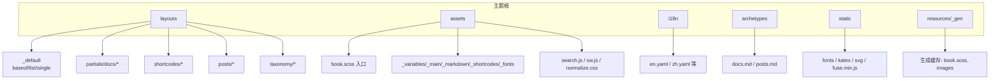
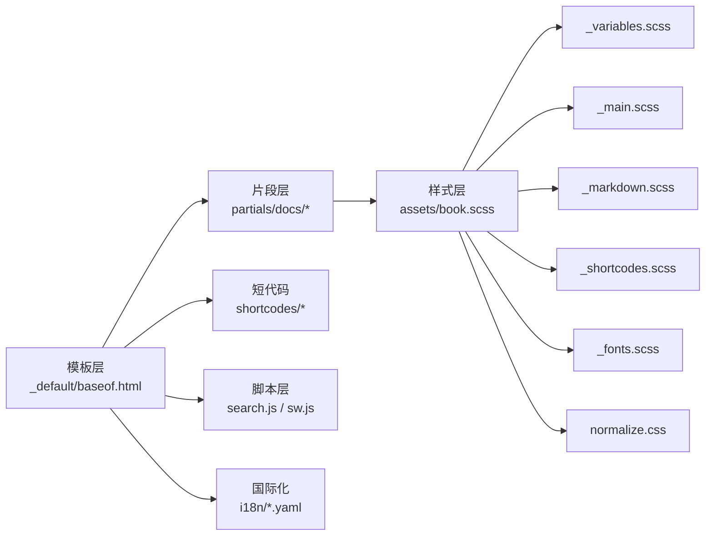
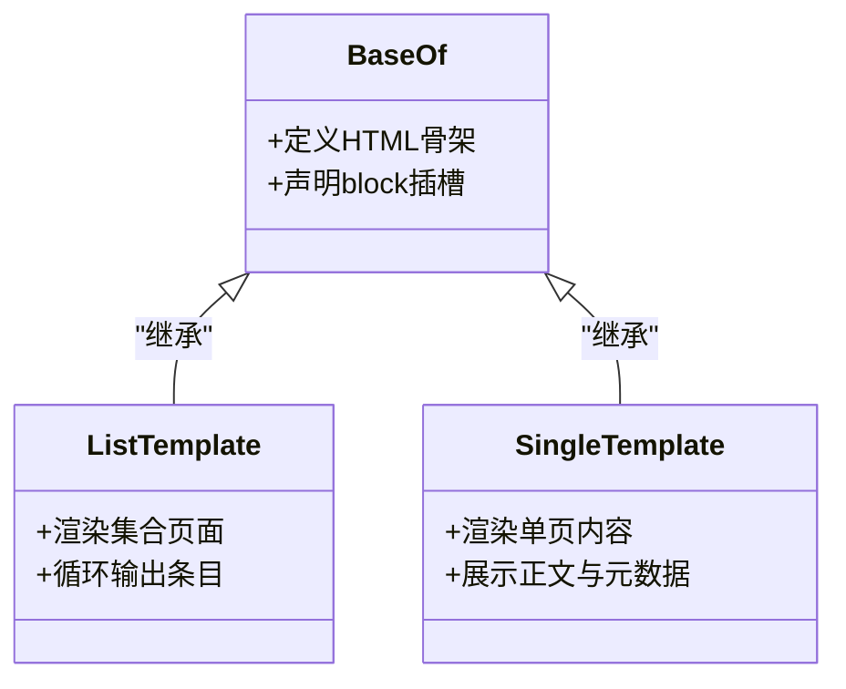
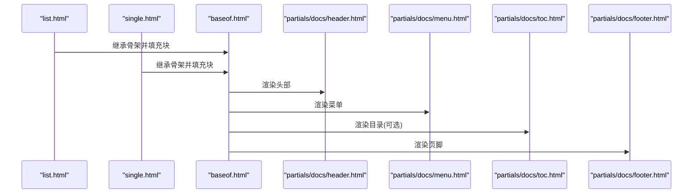
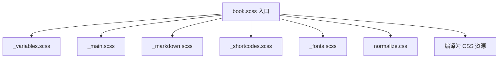
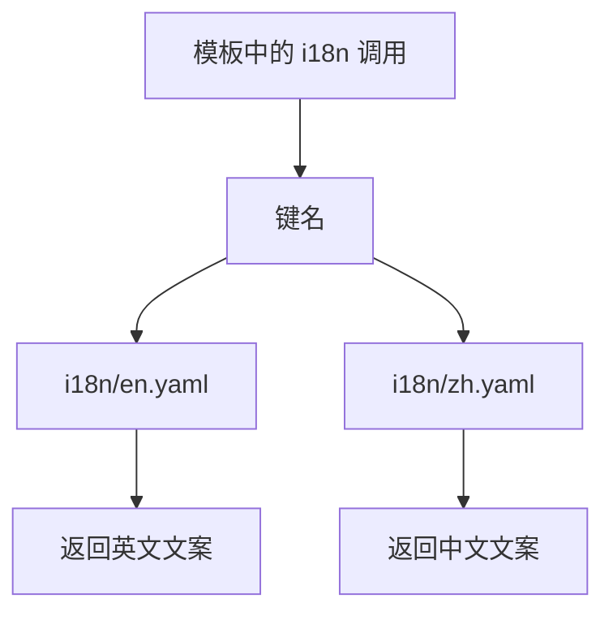
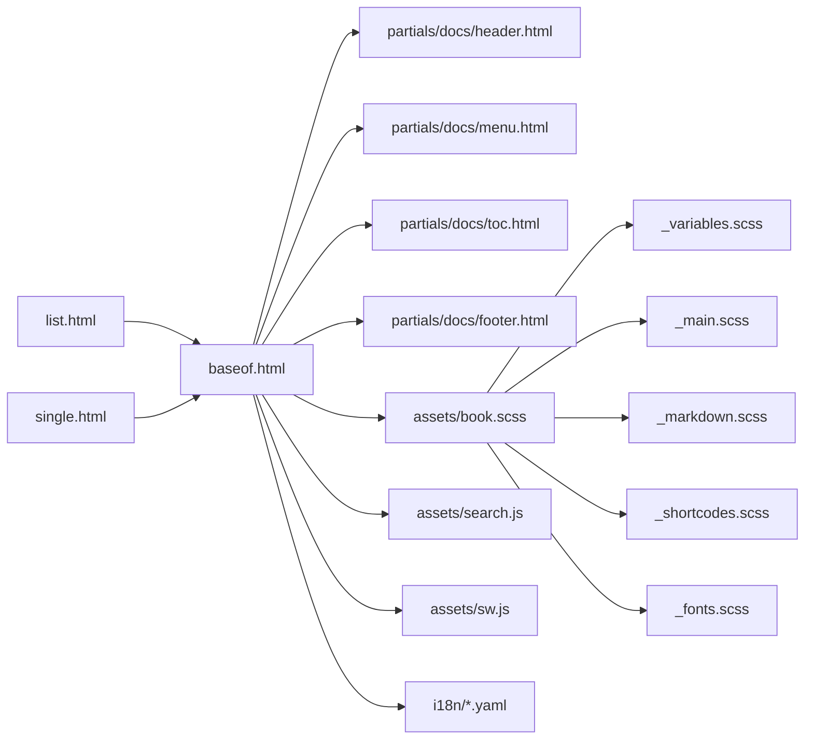

# 主题结构解析

<cite>
**本文引用的文件**   
- [theme.toml](file://themes/hugo-book/theme.toml)
- [layouts/_default/baseof.html](file://themes/hugo-book/layouts/_default/baseof.html)
- [layouts/_default/single.html](file://themes/hugo-book/layouts/_default/single.html)
- [layouts/_default/list.html](file://themes/hugo-book/layouts/_default/list.html)
- [layouts/partials/docs/header.html](file://themes/hugo-book/layouts/partials/docs/header.html)
- [layouts/partials/docs/footer.html](file://themes/hugo-book/layouts/partials/docs/footer.html)
- [layouts/partials/docs/menu.html](file://themes/hugo-book/layouts/partials/docs/menu.html)
- [layouts/partials/docs/toc.html](file://themes/hugo-book/layouts/partials/docs/toc.html)
- [assets/book.scss](file://themes/hugo-book/assets/book.scss)
- [assets/_variables.scss](file://themes/hugo-book/assets/_variables.scss)
- [assets/_main.scss](file://themes/hugo-book/assets/_main.scss)
- [assets/_markdown.scss](file://themes/hugo-book/assets/_markdown.scss)
- [assets/_shortcodes.scss](file://themes/hugo-book/assets/_shortcodes.scss)
- [assets/_fonts.scss](file://themes/hugo-book/assets/_fonts.scss)
- [assets/normalize.css](file://themes/hugo-book/assets/normalize.css)
- [assets/search.js](file://themes/hugo-book/assets/search.js)
- [assets/sw.js](file://themes/hugo-book/assets/sw.js)
- [i18n/en.yaml](file://themes/hugo-book/i18n/en.yaml)
- [i18n/zh.yaml](file://themes/hugo-book/i18n/zh.yaml)
- [archetypes/docs.md](file://themes/hugo-book/archetypes/docs.md)
- [archetypes/posts.md](file://themes/hugo-book/archetypes/posts.md)
</cite>

## 目录
1. [简介](#简介)
2. [项目结构](#项目结构)
3. [核心组件](#核心组件)
4. [架构总览](#架构总览)
5. [详细组件分析](#详细组件分析)
6. [依赖关系分析](#依赖关系分析)
7. [性能考虑](#性能考虑)
8. [故障排查指南](#故障排查指南)
9. [结论](#结论)
10. [附录](#附录)

## 简介
本文件面向使用与二次开发 hugo-book 主题的开发者，系统化解析主题目录组织、模板层次、资源组织方式、国际化配置以及可配置项。文档以“由浅入深”的方式展开：先给出整体结构与职责划分，再深入到布局模板、样式与脚本、国际化与示例站点等关键模块，最后提供最佳实践与常见问题排查建议。

## 项目结构
hugo-book 主题采用 Hugo 标准主题目录约定，核心目录包括：
- layouts：主题模板与片段（partials）、短代码（shortcodes）
- assets：SCSS/CSS、JS 等前端资源
- i18n：多语言文案
- archetypes：内容类型脚手架
- static：静态资源（字体、图标、第三方库等）
- resources/_gen：Hugo 生成的资源缓存（构建产物）

图表来源
- [theme.toml](file://themes/hugo-book/theme.toml)
- [layouts/_default/baseof.html](file://themes/hugo-book/layouts/_default/baseof.html)
- [layouts/_default/list.html](file://themes/hugo-book/layouts/_default/list.html)
- [layouts/_default/single.html](file://themes/hugo-book/layouts/_default/single.html)
- [assets/book.scss](file://themes/hugo-book/assets/book.scss)
- [assets/_variables.scss](file://themes/hugo-book/assets/_variables.scss)
- [assets/_main.scss](file://themes/hugo-book/assets/_main.scss)
- [assets/_markdown.scss](file://themes/hugo-book/assets/_markdown.scss)
- [assets/_shortcodes.scss](file://themes/hugo-book/assets/_shortcodes.scss)
- [assets/_fonts.scss](file://themes/hugo-book/assets/_fonts.scss)
- [assets/normalize.css](file://themes/hugo-book/assets/normalize.css)
- [assets/search.js](file://themes/hugo-book/assets/search.js)
- [assets/sw.js](file://themes/hugo-book/assets/sw.js)
- [i18n/en.yaml](file://themes/hugo-book/i18n/en.yaml)
- [i18n/zh.yaml](file://themes/hugo-book/i18n/zh.yaml)
- [archetypes/docs.md](file://themes/hugo-book/archetypes/docs.md)
- [archetypes/posts.md](file://themes/hugo-book/archetypes/posts.md)

章节来源
- [theme.toml](file://themes/hugo-book/theme.toml)

## 核心组件
- 基础布局模板
  - baseof.html：页面骨架，定义 HTML 根节点、头部注入点、主体区块与页脚注入点，供其他模板继承。
  - list.html：列表页模板，用于归档、分类、标签、索引等集合型页面。
  - single.html：单页模板，用于文章、文档等独立内容渲染。
- 片段（partials）
  - docs/header.html、docs/footer.html：页面头尾通用结构。
  - docs/menu.html：侧边导航菜单。
  - docs/toc.html：目录（TOC）。
- 样式与脚本
  - book.scss：SCSS 入口，聚合变量、主样式、Markdown 渲染样式、短代码样式、字体等。
  - _variables.scss：主题变量（颜色、字号、间距等）。
  - _main.scss：全局布局与组件样式。
  - _markdown.scss：Markdown 内容排版样式。
  - _shortcodes.scss：内置短代码样式。
  - _fonts.scss：字体加载与回退策略。
  - normalize.css：浏览器默认样式重置。
  - search.js：搜索功能逻辑。
  - sw.js：PWA 服务工作者（可选）。
- 国际化
  - i18n/*.yaml：按语言分文件存放翻译键值对。
- 内容脚手架
  - archetypes/docs.md、archetypes/posts.md：新建文档/文章时的默认 Front Matter 与结构。

章节来源
- [layouts/_default/baseof.html](file://themes/hugo-book/layouts/_default/baseof.html)
- [layouts/_default/list.html](file://themes/hugo-book/layouts/_default/list.html)
- [layouts/_default/single.html](file://themes/hugo-book/layouts/_default/single.html)
- [layouts/partials/docs/header.html](file://themes/hugo-book/layouts/partials/docs/header.html)
- [layouts/partials/docs/footer.html](file://themes/hugo-book/layouts/partials/docs/footer.html)
- [layouts/partials/docs/menu.html](file://themes/hugo-book/layouts/partials/docs/menu.html)
- [layouts/partials/docs/toc.html](file://themes/hugo-book/layouts/partials/docs/toc.html)
- [assets/book.scss](file://themes/hugo-book/assets/book.scss)
- [assets/_variables.scss](file://themes/hugo-book/assets/_variables.scss)
- [assets/_main.scss](file://themes/hugo-book/assets/_main.scss)
- [assets/_markdown.scss](file://themes/hugo-book/assets/_markdown.scss)
- [assets/_shortcodes.scss](file://themes/hugo-book/assets/_shortcodes.scss)
- [assets/_fonts.scss](file://themes/hugo-book/assets/_fonts.scss)
- [assets/normalize.css](file://themes/hugo-book/assets/normalize.css)
- [assets/search.js](file://themes/hugo-book/assets/search.js)
- [assets/sw.js](file://themes/hugo-book/assets/sw.js)
- [i18n/en.yaml](file://themes/hugo-book/i18n/en.yaml)
- [i18n/zh.yaml](file://themes/hugo-book/i18n/zh.yaml)
- [archetypes/docs.md](file://themes/hugo-book/archetypes/docs.md)
- [archetypes/posts.md](file://themes/hugo-book/archetypes/posts.md)

## 架构总览
下图展示了主题在构建期的主要依赖与调用关系：模板通过 partials 组合 UI 片段，样式通过 SCSS 入口聚合，脚本按需加载，国际化通过 i18n 文件提供文案。

图表来源
- [layouts/_default/baseof.html](file://themes/hugo-book/layouts/_default/baseof.html)
- [layouts/partials/docs/header.html](file://themes/hugo-book/layouts/partials/docs/header.html)
- [layouts/partials/docs/footer.html](file://themes/hugo-book/layouts/partials/docs/footer.html)
- [layouts/partials/docs/menu.html](file://themes/hugo-book/layouts/partials/docs/menu.html)
- [layouts/partials/docs/toc.html](file://themes/hugo-book/layouts/partials/docs/toc.html)
- [assets/book.scss](file://themes/hugo-book/assets/book.scss)
- [assets/_variables.scss](file://themes/hugo-book/assets/_variables.scss)
- [assets/_main.scss](file://themes/hugo-book/assets/_main.scss)
- [assets/_markdown.scss](file://themes/hugo-book/assets/_markdown.scss)
- [assets/_shortcodes.scss](file://themes/hugo-book/assets/_shortcodes.scss)
- [assets/_fonts.scss](file://themes/hugo-book/assets/_fonts.scss)
- [assets/normalize.css](file://themes/hugo-book/assets/normalize.css)
- [assets/search.js](file://themes/hugo-book/assets/search.js)
- [assets/sw.js](file://themes/hugo-book/assets/sw.js)
- [i18n/en.yaml](file://themes/hugo-book/i18n/en.yaml)
- [i18n/zh.yaml](file://themes/hugo-book/i18n/zh.yaml)

## 详细组件分析

### 布局模板层次与职责
- baseof.html
  - 作用：定义页面骨架，包含 <html>/<head>/<body> 结构，声明 block 插槽（如 head、header、main、footer），供子模板填充。
  - 典型用法：list.html 与 single.html 均 extends 该模板，分别实现列表与详情渲染。
- list.html
  - 作用：渲染集合型页面（如首页、分类、标签、归档等），循环输出条目摘要或链接。
- single.html
  - 作用：渲染单篇内容（文章/文档），通常包含标题、元信息、正文、评论、相关推荐等。

图表来源
- [layouts/_default/baseof.html](file://themes/hugo-book/layouts/_default/baseof.html)
- [layouts/_default/list.html](file://themes/hugo-book/layouts/_default/list.html)
- [layouts/_default/single.html](file://themes/hugo-book/layouts/_default/single.html)

章节来源
- [layouts/_default/baseof.html](file://themes/hugo-book/layouts/_default/baseof.html)
- [layouts/_default/list.html](file://themes/hugo-book/layouts/_default/list.html)
- [layouts/_default/single.html](file://themes/hugo-book/layouts/_default/single.html)

### 片段（partials）与页面组装
- header.html：放置站点标识、导航入口、搜索入口等。
- footer.html：版权、外链、统计脚本等。
- menu.html：根据站点配置与内容树生成侧边栏。
- toc.html：基于内容目录生成目录导航。

图表来源
- [layouts/_default/baseof.html](file://themes/hugo-book/layouts/_default/baseof.html)
- [layouts/_default/list.html](file://themes/hugo-book/layouts/_default/list.html)
- [layouts/_default/single.html](file://themes/hugo-book/layouts/_default/single.html)
- [layouts/partials/docs/header.html](file://themes/hugo-book/layouts/partials/docs/header.html)
- [layouts/partials/docs/menu.html](file://themes/hugo-book/layouts/partials/docs/menu.html)
- [layouts/partials/docs/toc.html](file://themes/hugo-book/layouts/partials/docs/toc.html)
- [layouts/partials/docs/footer.html](file://themes/hugo-book/layouts/partials/docs/footer.html)

章节来源
- [layouts/partials/docs/header.html](file://themes/hugo-book/layouts/partials/docs/header.html)
- [layouts/partials/docs/footer.html](file://themes/hugo-book/layouts/partials/docs/footer.html)
- [layouts/partials/docs/menu.html](file://themes/hugo-book/layouts/partials/docs/menu.html)
- [layouts/partials/docs/toc.html](file://themes/hugo-book/layouts/partials/docs/toc.html)

### 样式与脚本组织
- 入口与聚合
  - book.scss：统一引入变量、主样式、Markdown 渲染、短代码样式、字体与第三方重置样式。
- 模块化拆分
  - _variables.scss：主题色板、字号、行高、间距等设计令牌。
  - _main.scss：布局容器、网格、响应式断点、通用组件。
  - _markdown.scss：标题、段落、表格、代码块、引用等 Markdown 元素样式。
  - _shortcodes.scss：按钮、提示框、折叠面板等短代码样式。
  - _fonts.scss：字体加载策略与回退。
  - normalize.css：跨浏览器一致性。
- 脚本
  - search.js：客户端搜索逻辑（如 Fuse/FlexSearch 集成）。
  - sw.js：PWA 服务工作线程（缓存、离线能力）。

图表来源
- [assets/book.scss](file://themes/hugo-book/assets/book.scss)
- [assets/_variables.scss](file://themes/hugo-book/assets/_variables.scss)
- [assets/_main.scss](file://themes/hugo-book/assets/_main.scss)
- [assets/_markdown.scss](file://themes/hugo-book/assets/_markdown.scss)
- [assets/_shortcodes.scss](file://themes/hugo-book/assets/_shortcodes.scss)
- [assets/_fonts.scss](file://themes/hugo-book/assets/_fonts.scss)
- [assets/normalize.css](file://themes/hugo-book/assets/normalize.css)

章节来源
- [assets/book.scss](file://themes/hugo-book/assets/book.scss)
- [assets/_variables.scss](file://themes/hugo-book/assets/_variables.scss)
- [assets/_main.scss](file://themes/hugo-book/assets/_main.scss)
- [assets/_markdown.scss](file://themes/hugo-book/assets/_markdown.scss)
- [assets/_shortcodes.scss](file://themes/hugo-book/assets/_shortcodes.scss)
- [assets/_fonts.scss](file://themes/hugo-book/assets/_fonts.scss)
- [assets/normalize.css](file://themes/hugo-book/assets/normalize.css)
- [assets/search.js](file://themes/hugo-book/assets/search.js)
- [assets/sw.js](file://themes/hugo-book/assets/sw.js)

### 国际化（i18n）
- 文件命名：按语言代码命名，如 en.yaml、zh.yaml。
- 键值结构：每个键对应一个字符串，模板中通过 i18n 函数引用。
- 覆盖机制：站点可在自身 i18n 目录中提供同名文件进行覆盖。

图表来源
- [i18n/en.yaml](file://themes/hugo-book/i18n/en.yaml)
- [i18n/zh.yaml](file://themes/hugo-book/i18n/zh.yaml)

章节来源
- [i18n/en.yaml](file://themes/hugo-book/i18n/en.yaml)
- [i18n/zh.yaml](file://themes/hugo-book/i18n/zh.yaml)

### 内容脚手架（archetypes）
- docs.md：创建文档时自动填充的 Front Matter 与目录结构建议。
- posts.md：创建文章时自动填充的 Front Matter 与示例段落。

章节来源
- [archetypes/docs.md](file://themes/hugo-book/archetypes/docs.md)
- [archetypes/posts.md](file://themes/hugo-book/archetypes/posts.md)

## 依赖关系分析
- 模板依赖
  - list.html 与 single.html 共同继承 baseof.html，复用公共骨架。
  - 各页面通过 partials 组合 header、menu、toc、footer 等片段，降低耦合度。
- 样式依赖
  - book.scss 作为唯一入口，集中管理 SCSS 依赖，避免重复引入。
  - 变量与模块分离，便于主题定制与扩展。
- 脚本依赖
  - search.js 与 sw.js 按需加载，减少首屏体积。
- 国际化依赖
  - 模板通过 i18n 键访问文案，语言包按语言文件组织。

图表来源
- [layouts/_default/baseof.html](file://themes/hugo-book/layouts/_default/baseof.html)
- [layouts/_default/list.html](file://themes/hugo-book/layouts/_default/list.html)
- [layouts/_default/single.html](file://themes/hugo-book/layouts/_default/single.html)
- [layouts/partials/docs/header.html](file://themes/hugo-book/layouts/partials/docs/header.html)
- [layouts/partials/docs/menu.html](file://themes/hugo-book/layouts/partials/docs/menu.html)
- [layouts/partials/docs/toc.html](file://themes/hugo-book/layouts/partials/docs/toc.html)
- [layouts/partials/docs/footer.html](file://themes/hugo-book/layouts/partials/docs/footer.html)
- [assets/book.scss](file://themes/hugo-book/assets/book.scss)
- [assets/_variables.scss](file://themes/hugo-book/assets/_variables.scss)
- [assets/_main.scss](file://themes/hugo-book/assets/_main.scss)
- [assets/_markdown.scss](file://themes/hugo-book/assets/_markdown.scss)
- [assets/_shortcodes.scss](file://themes/hugo-book/assets/_shortcodes.scss)
- [assets/_fonts.scss](file://themes/hugo-book/assets/_fonts.scss)
- [assets/search.js](file://themes/hugo-book/assets/search.js)
- [assets/sw.js](file://themes/hugo-book/assets/sw.js)
- [i18n/en.yaml](file://themes/hugo-book/i18n/en.yaml)
- [i18n/zh.yaml](file://themes/hugo-book/i18n/zh.yaml)

## 性能考虑
- 样式合并与按需加载
  - 通过单一 SCSS 入口聚合，减少请求数；仅引入必要模块，避免冗余。
- 字体优化
  - 使用 _fonts.scss 控制字体加载策略，优先本地字体，必要时异步加载。
- 脚本瘦身
  - 将搜索与服务工作者脚本分离，仅在需要时加载，降低首屏压力。
- 缓存利用
  - 利用 Hugo 的资源管道与浏览器缓存，结合版本号或哈希化文件名提升缓存命中率。

[本节为通用指导，不直接分析具体文件]

## 故障排查指南
- 样式未生效
  - 检查 book.scss 是否被正确引入，确认 SCSS 模块路径与变量是否正确。
  - 查看浏览器控制台是否有编译错误。
- 搜索不可用
  - 确认 search.js 已加载且无跨域限制；检查搜索索引是否生成。
- 国际化文案缺失
  - 核对 i18n 键名是否与模板一致，确认目标语言文件存在且语法正确。
- 模板继承异常
  - 确保 baseof.html 的 block 名称与子模板一致，避免命名冲突。

章节来源
- [assets/book.scss](file://themes/hugo-book/assets/book.scss)
- [assets/_variables.scss](file://themes/hugo-book/assets/_variables.scss)
- [assets/search.js](file://themes/hugo-book/assets/search.js)
- [i18n/en.yaml](file://themes/hugo-book/i18n/en.yaml)
- [i18n/zh.yaml](file://themes/hugo-book/i18n/zh.yaml)
- [layouts/_default/baseof.html](file://themes/hugo-book/layouts/_default/baseof.html)

## 结论
hugo-book 主题遵循 Hugo 的标准约定，采用清晰的模板分层、模块化样式与脚本组织、完善的国际化支持，以及便捷的内容脚手架。通过理解 baseof/list/single 的继承关系、partials 的组合方式、SCSS 的聚合策略与 i18n 的键值映射，开发者可以高效地进行主题定制与功能扩展。

[本节为总结性内容，不直接分析具体文件]

## 附录
- 主题配置文件 theme.toml
  - 用途：描述主题元信息（名称、版本、作者、许可证等）与可选的配置开关。
  - 常见字段：name、description、version、author、license 等。
  - 建议：保持最小可用配置，复杂行为尽量通过模板与参数控制。

章节来源
- [theme.toml](file://themes/hugo-book/theme.toml)