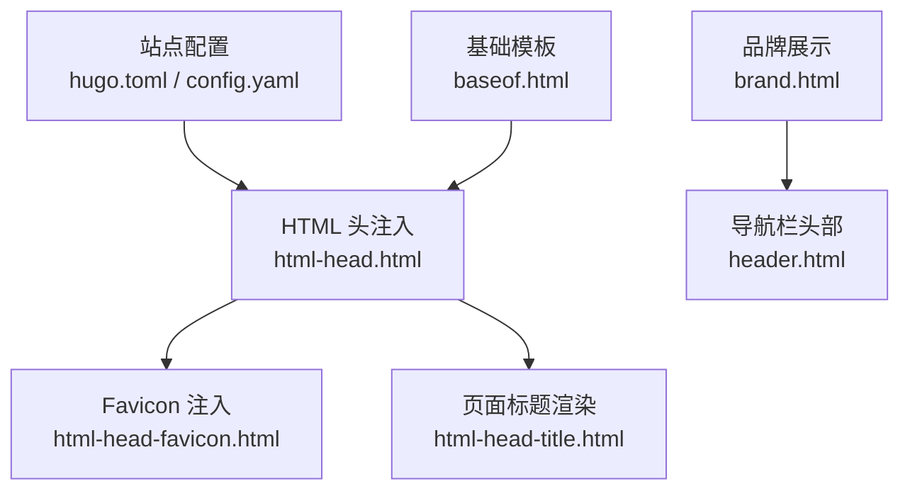
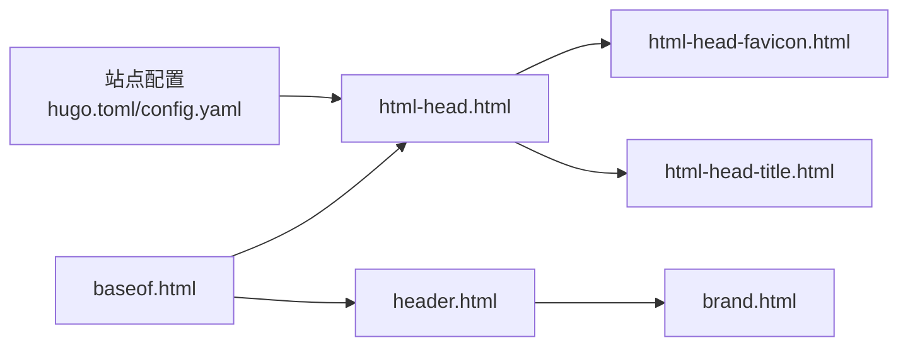

# 品牌元素定制

<cite>
**本文引用的文件**
- [hugo.toml](file://hugo.toml)
- [config.yaml](file://config.yaml)
- [layouts/partials/docs/html-head.html](file://themes/hugo-book/layouts/partials/docs/html-head.html)
- [layouts/partials/docs/html-head-favicon.html](file://themes/hugo-book/layouts/partials/docs/html-head-favicon.html)
- [layouts/partials/docs/brand.html](file://themes/hugo-book/layouts/partials/docs/brand.html)
- [layouts/partials/docs/header.html](file://themes/hugo-book/layouts/partials/docs/header.html)
- [layouts/partials/docs/html-head-title.html](file://themes/hugo-book/layouts/partials/docs/html-head-title.html)
- [layouts/_default/baseof.html](file://themes/hugo-book/layouts/_default/baseof.html)
</cite>

## 目录
1. [简介](#简介)
2. [项目结构](#项目结构)
3. [核心组件](#核心组件)
4. [架构总览](#架构总览)
5. [详细组件分析](#详细组件分析)
6. [依赖关系分析](#依赖关系分析)
7. [性能与体验优化](#性能与体验优化)
8. [故障排查指南](#故障排查指南)
9. [结论](#结论)
10. [附录：配置示例与一致性检查清单](#附录配置示例与一致性检查清单)

## 简介
本指南聚焦于在 Hugo Book 主题下的“品牌元素定制”，涵盖以下关键能力：
- Logo、Favicon、网站标题与描述的配置与替换
- 多格式 Logo（SVG/PNG）适配与暗色模式策略
- Favicon 多尺寸与暗色模式适配
- SEO 元数据、Open Graph 与社交媒体分享卡片
- 自定义图标集成（Font Awesome、内嵌 SVG 等）
- 完整配置示例与品牌一致性检查清单

## 项目结构
本项目基于 Hugo Book 主题，品牌相关的关键位置包括：
- 站点级配置：hugo.toml、config.yaml
- 头部与元信息注入：html-head.html、html-head-favicon.html、html-head-title.html
- 品牌展示区域：brand.html、header.html
- 页面基础模板：baseof.html



图表来源
- [hugo.toml](file://hugo.toml)
- [config.yaml](file://config.yaml)
- [layouts/partials/docs/html-head.html](file://themes/hugo-book/layouts/partials/docs/html-head.html)
- [layouts/partials/docs/html-head-favicon.html](file://themes/hugo-book/layouts/partials/docs/html-head-favicon.html)
- [layouts/partials/docs/html-head-title.html](file://themes/hugo-book/layouts/partials/docs/html-head-title.html)
- [layouts/partials/docs/brand.html](file://themes/hugo-book/layouts/partials/docs/brand.html)
- [layouts/partials/docs/header.html](file://themes/hugo-book/layouts/partials/docs/header.html)
- [layouts/_default/baseof.html](file://themes/hugo-book/layouts/_default/baseof.html)

章节来源
- [hugo.toml](file://hugo.toml)
- [config.yaml](file://config.yaml)
- [layouts/partials/docs/html-head.html](file://themes/hugo-book/layouts/partials/docs/html-head.html)
- [layouts/partials/docs/html-head-favicon.html](file://themes/hugo-book/layouts/partials/docs/html-head-favicon.html)
- [layouts/partials/docs/html-head-title.html](file://themes/hugo-book/layouts/partials/docs/html-head-title.html)
- [layouts/partials/docs/brand.html](file://themes/hugo-book/layouts/partials/docs/brand.html)
- [layouts/partials/docs/header.html](file://themes/hugo-book/layouts/partials/docs/header.html)
- [layouts/_default/baseof.html](file://themes/hugo-book/layouts/_default/baseof.html)

## 核心组件
- 站点配置层
  - 站点名称、描述、语言、URL、作者、版权等信息集中管理
  - 通过 hugo.toml 或 config.yaml 统一维护
- HTML 头注入层
  - 负责注入 meta、OG、Twitter Card、Favicon、预加载资源等
  - 提供扩展点以覆盖默认行为
- 品牌展示层
  - 侧边栏/顶部导航的品牌标识（Logo、站点名）
  - 支持暗色/亮色模式切换时的视觉一致性
- 基础模板层
  - baseof.html 作为所有页面的根模板，串联 head、body、footer 等区块

章节来源
- [hugo.toml](file://hugo.toml)
- [config.yaml](file://config.yaml)
- [layouts/partials/docs/html-head.html](file://themes/hugo-book/layouts/partials/docs/html-head.html)
- [layouts/partials/docs/html-head-favicon.html](file://themes/hugo-book/layouts/partials/docs/html-head-favicon.html)
- [layouts/partials/docs/html-head-title.html](file://themes/hugo-book/layouts/partials/docs/html-head-title.html)
- [layouts/partials/docs/brand.html](file://themes/hugo-book/layouts/partials/docs/brand.html)
- [layouts/partials/docs/header.html](file://themes/hugo-book/layouts/partials/docs/header.html)
- [layouts/_default/baseof.html](file://themes/hugo-book/layouts/_default/baseof.html)

## 架构总览
下图展示了从配置到最终渲染的链路，以及各部分职责。

```mermaid
sequenceDiagram
participant Dev as "开发者"
participant Config as "站点配置<br/>hugo.toml/config.yaml"
participant Base as "基础模板<br/>baseof.html"
participant Head as "头部注入<br/>html-head.html"
participant Fav as "Favicon 注入<br/>html-head-favicon.html"
participant Title as "标题渲染<br/>html-head-title.html"
participant Brand as "品牌展示<br/>brand.html"
participant Header as "导航头部<br/>header.html"
Dev->>Config : 设置站点名称/描述/URL/作者等
Dev->>Brand : 放置 Logo 图片/SVG
Base->>Head : 渲染 <head> 内容
Head->>Fav : 生成 favicon 链接
Head->>Title : 输出页面标题
Base->>Header : 渲染导航区
Header->>Brand : 显示 Logo 与站点名
```

图表来源
- [hugo.toml](file://hugo.toml)
- [config.yaml](file://config.yaml)
- [layouts/_default/baseof.html](file://themes/hugo-book/layouts/_default/baseof.html)
- [layouts/partials/docs/html-head.html](file://themes/hugo-book/layouts/partials/docs/html-head.html)
- [layouts/partials/docs/html-head-favicon.html](file://themes/hugo-book/layouts/partials/docs/html-head-favicon.html)
- [layouts/partials/docs/html-head-title.html](file://themes/hugo-book/layouts/partials/docs/html-head-title.html)
- [layouts/partials/docs/brand.html](file://themes/hugo-book/layouts/partials/docs/brand.html)
- [layouts/partials/docs/header.html](file://themes/hugo-book/layouts/partials/docs/header.html)

## 详细组件分析

### 站点配置（hugo.toml / config.yaml）
- 作用
  - 定义站点全局元信息：站点名、描述、语言、URL、作者、版权、首页路径等
  - 为 SEO、OG、社交分享提供数据来源
- 建议字段
  - title、description、languageCode、baseURL、author、copyright、home 等
- 注意事项
  - baseURL 需与实际部署域名一致，避免 OG 图片与链接解析异常
  - 多语言站点时，确保 i18n 键值与页面 front matter 对应

章节来源
- [hugo.toml](file://hugo.toml)
- [config.yaml](file://config.yaml)

### HTML 头注入（html-head.html）
- 作用
  - 集中注入 meta、OG、Twitter Card、样式与脚本等
  - 提供可覆写的扩展点，便于二次开发
- 常见注入项
  - charset、viewport、SEO meta、OG（og:title、og:description、og:image、og:url）、Twitter Card、预加载资源等
- 扩展建议
  - 若需新增 OG 字段或第三方验证标签，优先在此处追加
  - 保持条件判断与空值保护，避免未配置导致无效标签

章节来源
- [layouts/partials/docs/html-head.html](file://themes/hugo-book/layouts/partials/docs/html-head.html)

### Favicon 注入（html-head-favicon.html）
- 作用
  - 根据站点配置生成 favicon 链接，支持多尺寸与暗色模式适配
- 实现要点
  - 使用 rel="icon" 与 rel="apple-touch-icon" 等多类型链接
  - 针对深色主题提供暗色版 favicon（如 color-scheme 或 prefers-color-scheme）
- 最佳实践
  - 提供 16x16、32x32、180x180（iOS）等常用尺寸
  - 将静态资源放入 static 目录，并通过相对路径引用

章节来源
- [layouts/partials/docs/html-head-favicon.html](file://themes/hugo-book/layouts/partials/docs/html-head-favicon.html)

### 页面标题渲染（html-head-title.html）
- 作用
  - 组合页面标题，通常包含站点名与当前页标题
- 逻辑建议
  - 当页面未设置标题时回退到站点名
  - 控制分隔符与顺序，保证搜索引擎友好

章节来源
- [layouts/partials/docs/html-head-title.html](file://themes/hugo-book/layouts/partials/docs/html-head-title.html)

### 品牌展示（brand.html）
- 作用
  - 在侧边栏或导航中展示 Logo 与站点名
- 适配建议
  - 同时支持 SVG 与 PNG，SVG 推荐用于矢量缩放与暗色模式
  - 暗色模式下可通过 CSS 变量或 media query 切换图标颜色
- 交互建议
  - 点击 Logo 返回首页
  - 为 Logo 添加 alt 文本以提升可访问性

章节来源
- [layouts/partials/docs/brand.html](file://themes/hugo-book/layouts/partials/docs/brand.html)

### 导航头部（header.html）
- 作用
  - 承载品牌展示、搜索、语言切换等导航功能
- 与品牌的关系
  - 调用 brand.html 渲染 Logo 与站点名
  - 在移动端折叠菜单中保持一致的品牌呈现

章节来源
- [layouts/partials/docs/header.html](file://themes/hugo-book/layouts/partials/docs/header.html)

### 基础模板（baseof.html）
- 作用
  - 作为所有页面的根模板，组织 head、body、footer 等区块
- 与品牌的关系
  - 引入 html-head.html 完成元信息与资源注入
  - 引入 header.html 与 brand.html 完成品牌展示

章节来源
- [layouts/_default/baseof.html](file://themes/hugo-book/layouts/_default/baseof.html)

## 依赖关系分析
- 配置到渲染的依赖链
  - hugo.toml/config.yaml → html-head.html → html-head-favicon.html / html-head-title.html
  - baseof.html → html-head.html / header.html → brand.html
- 外部依赖
  - 字体与图标库（如 Font Awesome）可在 html-head.html 中按需引入
  - 静态资源（favicon、logo、OG 图片）位于 static 目录



图表来源
- [hugo.toml](file://hugo.toml)
- [config.yaml](file://config.yaml)
- [layouts/partials/docs/html-head.html](file://themes/hugo-book/layouts/partials/docs/html-head.html)
- [layouts/partials/docs/html-head-favicon.html](file://themes/hugo-book/layouts/partials/docs/html-head-favicon.html)
- [layouts/partials/docs/html-head-title.html](file://themes/hugo-book/layouts/partials/docs/html-head-title.html)
- [layouts/partials/docs/header.html](file://themes/hugo-book/layouts/partials/docs/header.html)
- [layouts/partials/docs/brand.html](file://themes/hugo-book/layouts/partials/docs/brand.html)
- [layouts/_default/baseof.html](file://themes/hugo-book/layouts/_default/baseof.html)

## 性能与体验优化
- 资源体积
  - 优先使用 SVG 作为 Logo，减少请求大小并提升清晰度
  - Favicon 仅提供必要尺寸，避免冗余下载
- 缓存与预加载
  - 对 logo 与 favicon 启用长期缓存
  - 对首屏关键资源进行预加载（如主字体、关键样式）
- 暗色模式
  - 使用 prefers-color-scheme 媒体查询切换暗色图标
  - 为不同背景准备对比度合适的图标版本
- 可访问性
  - 为 Logo 与图标提供有意义的 alt 文本
  - 确保键盘可达性与焦点可见性

[本节为通用指导，不直接分析具体文件]

## 故障排查指南
- 问题：Favicon 不显示
  - 检查 static 目录下是否存在对应文件
  - 确认 html-head-favicon.html 中的路径与文件名正确
  - 浏览器缓存可能导致旧图标残留，尝试硬刷新或无痕模式
- 问题：OG 图片无法预览
  - 确认 og:image 为绝对 URL，且服务器允许跨域抓取
  - 检查图片尺寸与格式是否符合平台要求
- 问题：暗色模式下 Logo 不可见
  - 检查 CSS 变量或媒体查询是否正确切换图标颜色
  - 确认暗色版图标对比度足够
- 问题：页面标题不正确
  - 检查 front matter 的 title 是否覆盖默认标题
  - 确认 html-head-title.html 的组合逻辑符合预期

章节来源
- [layouts/partials/docs/html-head-favicon.html](file://themes/hugo-book/layouts/partials/docs/html-head-favicon.html)
- [layouts/partials/docs/html-head-title.html](file://themes/hugo-book/layouts/partials/docs/html-head-title.html)
- [layouts/partials/docs/brand.html](file://themes/hugo-book/layouts/partials/docs/brand.html)

## 结论
通过在站点配置层与模板层协同工作，可以系统化地完成品牌元素的定制与优化。遵循本文提供的结构与最佳实践，能够建立专业、一致且高性能的品牌形象。

[本节为总结性内容，不直接分析具体文件]

## 附录：配置示例与一致性检查清单

### 配置示例（说明性）
- 站点配置（hugo.toml / config.yaml）
  - 设置 title、description、languageCode、baseURL、author、copyright、home 等
- Favicon 资源
  - 在 static 目录放置 favicon.ico、favicon.svg、apple-touch-icon.png 等
- Logo 资源
  - 在 static 目录放置 logo.svg、logo-dark.svg、logo.png 等
- OG 图片
  - 在 static 目录放置 og-image.png，并确保 og:image 指向绝对 URL

[本节为概念性示例，不直接分析具体文件]

### 品牌一致性检查清单
- 站点信息
  - 站点名、描述、语言、URL、作者、版权已配置且一致
- 图标与 Logo
  - 提供 SVG 与 PNG 双格式；暗色模式有对应版本
  - Favicon 多尺寸齐全（16x16、32x32、180x180）
- SEO 与社交分享
  - meta description、og:title、og:description、og:image、og:url 已设置
  - Twitter Card 字段（如 twitter:card、twitter:title、twitter:description、twitter:image）已设置
- 可访问性与性能
  - Logo 与图标具备 alt 文本
  - 关键资源启用缓存与预加载
- 构建与部署
  - baseURL 与实际域名一致
  - 静态资源路径正确，无 404

[本节为通用检查清单，不直接分析具体文件]