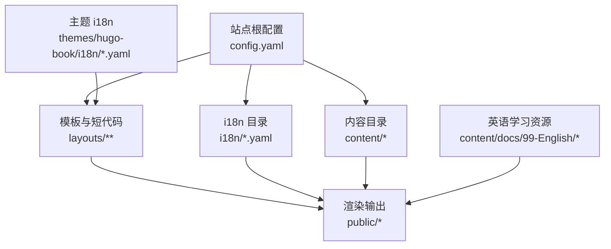
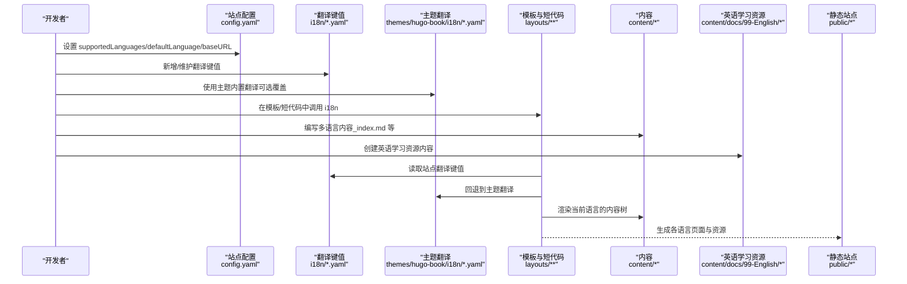
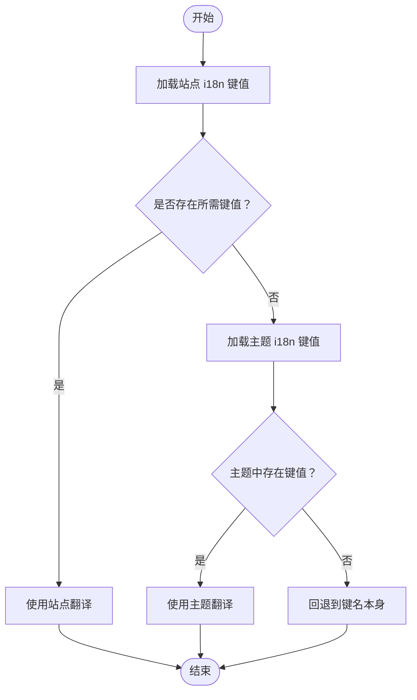
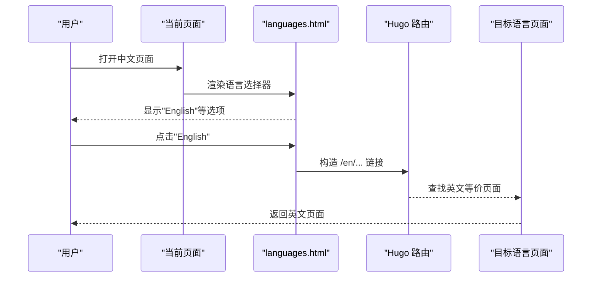
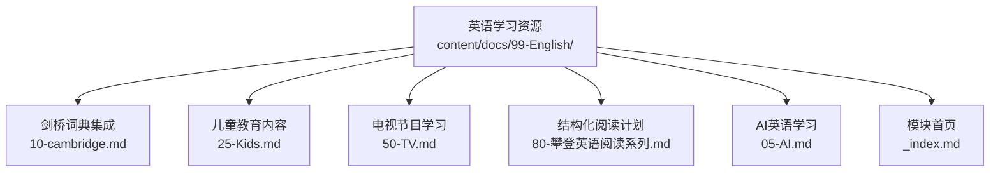
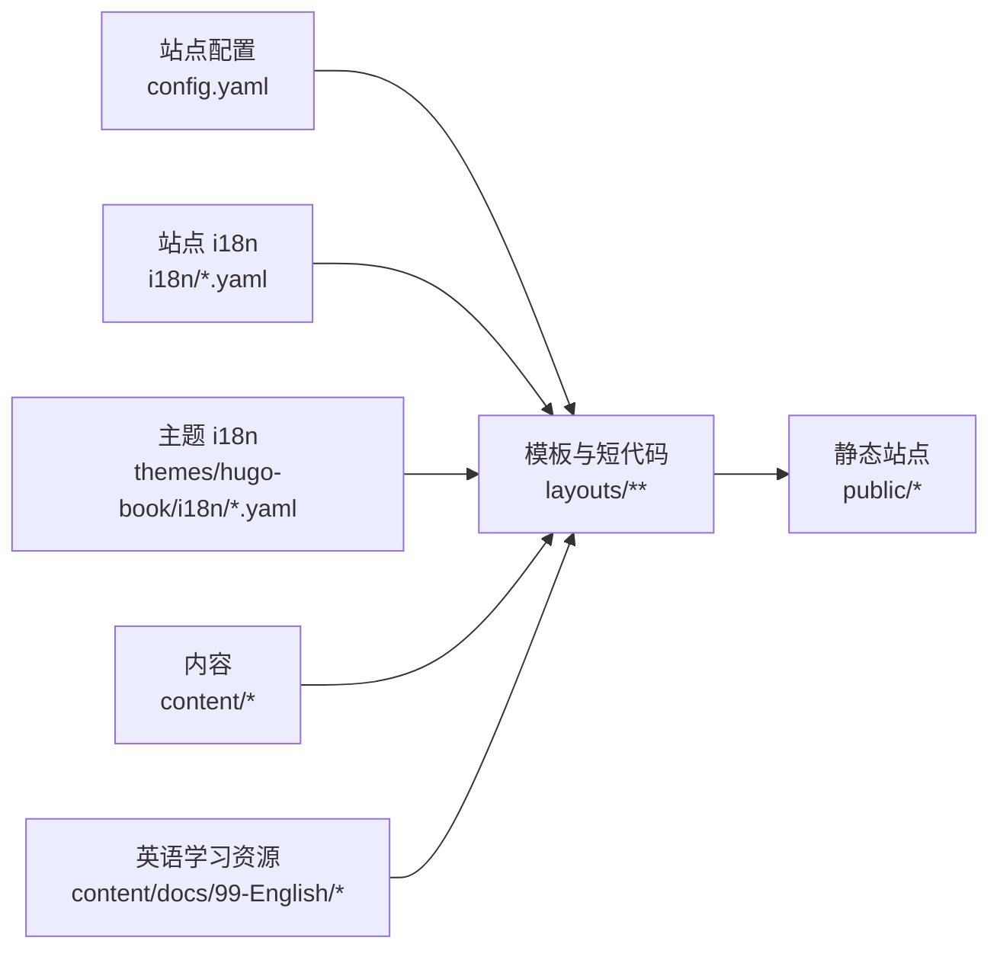

# 多语言支持

<cite>
**本文引用的文件**   
- [config.yaml](file://config.yaml)
- [content/docs/99-English/_index.md](file://content/docs/99-English/_index.md)
- [content/docs/99-English/10-cambridge.md](file://content/docs/99-English/10-cambridge.md)
- [content/docs/99-English/25-Kids.md](file://content/docs/99-English/25-Kids.md)
- [content/docs/99-English/50-TV.md](file://content/docs/99-English/50-TV.md)
- [content/docs/99-English/80-攀登英语阅读系列.md](file://content/docs/99-English/80-攀登英语阅读系列.md)
- [content/docs/99-English/05-AI.md](file://content/docs/99-English/05-AI.md)
</cite>

## 更新摘要
**变更内容**   
- 新增英语学习资源模块的多语言支持说明
- 添加剑桥词典集成、儿童教育内容、电视节目学习材料和结构化阅读计划的多语言实现指南
- 更新内容组织结构和路由配置示例

## 目录
1. [简介](#简介)
2. [项目结构](#项目结构)
3. [核心组件](#核心组件)
4. [架构总览](#架构总览)
5. [详细组件分析](#详细组件分析)
6. [英语学习资源模块](#英语学习资源模块)
7. [依赖关系分析](#依赖关系分析)
8. [性能考虑](#性能考虑)
9. [故障排查指南](#故障排查指南)
10. [结论](#结论)
11. [附录](#附录)

## 简介
本指南面向希望在 Hugo 站点中实现完整多语言支持的开发者，围绕以下目标展开：
- 深入解析 Hugo 的多语言架构与数据流
- 说明语言文件组织、翻译键值管理、语言切换机制
- 提供新增语言的完整流程（配置、翻译、默认语言）
- 讲解国际化文本管理（键值、占位符、复数形式）
- 给出语言特定内容实现方法（布局差异、路由、SEO）
- 说明日期、数字、货币等本地化格式的配置要点
- 提供可操作的示例与搭建流程，帮助构建国际化的技术文档站点
- **新增**：专门针对英语学习资源模块的多语言实现方案

## 项目结构
该仓库采用 Hugo + hugo-book 主题的结构。多语言相关的关键位置包括：
- 站点根级配置文件：config.yaml
- 站点 i18n 目录：i18n（存放站点自定义翻译键值）
- 主题 i18n 目录：themes/hugo-book/i18n（主题内置翻译）
- 模板与短代码：layouts（覆盖主题模板）、layouts/shortcodes/i18n.html（用于在内容中使用 i18n）
- 内容目录：content（按语言分目录或共享目录，配合 _index.md 定义站点首页与章节页）
- **新增**：英语学习资源模块 content/docs/99-English/

图表来源
- [config.yaml](file://config.yaml)
- [content/docs/99-English/_index.md](file://content/docs/99-English/_index.md)

章节来源
- [config.yaml](file://config.yaml)

## 核心组件
- 多语言配置入口
  - 站点根级配置文件负责声明 supportedLanguages、defaultLanguage、baseURL 等关键项，决定站点可用的语言集合与默认语言。
  - 参考路径：[config.yaml](file://config.yaml)
- 翻译键值管理
  - 站点自定义翻译位于 i18n 目录，主题内置翻译位于 themes/hugo-book/i18n。Hugo 会优先使用站点 i18n 中的键值，未命中时回退到主题 i18n。
  - 参考路径：[i18n/zh.yaml](file://i18n/zh.yaml)、[themes/hugo-book/i18n/zh.yaml](file://themes/hugo-book/i18n/zh.yaml)
- 语言切换组件
  - 通过 partials/docs/languages.html 渲染语言选择器，结合当前页面语言上下文生成链接。
  - 参考路径：[layouts/partials/docs/languages.html](file://layouts/partials/docs/languages.html)、[themes/hugo-book/layouts/partials/docs/languages.html](file://themes/hugo-book/layouts/partials/docs/languages.html)
- 内容侧的国际化调用
  - 使用 shortcodes/i18n.html 在 Markdown 中插入翻译文本，支持参数与占位符。
  - 参考路径：[layouts/shortcodes/i18n.html](file://layouts/shortcodes/i18n.html)
- 内容与路由
  - content/_index.md 与 content/docs/_index.md 作为站点与文档模块的首页，配合多语言目录结构生成对应语言的路由。
  - 参考路径：[content/_index.md](file://content/_index.md)、[content/docs/_index.md](file://content/docs/_index.md)

章节来源
- [config.yaml](file://config.yaml)
- [layouts/partials/docs/languages.html](file://layouts/partials/docs/languages.html)
- [layouts/shortcodes/i18n.html](file://layouts/shortcodes/i18n.html)

## 架构总览
下图展示了从配置到渲染的多语言数据流与组件交互：

图表来源
- [config.yaml](file://config.yaml)
- [content/docs/99-English/_index.md](file://content/docs/99-English/_index.md)

## 详细组件分析

### 组件A：多语言配置与默认语言
- 作用
  - 定义站点可用语言集合、默认语言、基础 URL 等，影响路由前缀与语言切换行为。
- 关键点
  - supportedLanguages：列出所有启用语言（如 zh、en）。
  - defaultLanguage：指定默认语言，未匹配到语言前缀时回退到此语言。
  - baseURL：建议包含语言前缀或使用相对路径策略，确保多语言路由正确。
- 实践建议
  - 将 baseURL 设置为不含语言前缀的形式，并在模板中根据 .Site.LanguagePrefix 拼接，以获得更灵活的路由控制。
  - 为每种语言准备对应的 _index.md 以定制首页文案与 SEO 元信息。

章节来源
- [config.yaml](file://config.yaml)

### 组件B：翻译键值管理与回退机制
- 作用
  - 集中管理 UI 文案与提示文本，避免硬编码字符串，便于维护与扩展。
- 文件组织
  - 站点 i18n：i18n/*.yaml（优先级最高）
  - 主题 i18n：themes/hugo-book/i18n/*.yaml（作为回退）
- 键值命名与复用
  - 建议使用语义化的键名（如 menu.home、footer.copyright），跨模板与短代码统一引用。
- 回退策略
  - 若站点 i18n 缺少某键值，Hugo 自动回退到主题 i18n；若仍缺失，则显示键名本身以便定位问题。

章节来源
- [i18n/zh.yaml](file://i18n/zh.yaml)
- [themes/hugo-book/i18n/zh.yaml](file://themes/hugo-book/i18n/zh.yaml)

### 组件C：语言切换机制与导航
- 作用
  - 在页面顶部或侧边栏展示语言选择器，点击后跳转到对应语言的等价页面。
- 实现要点
  - 使用 layouts/partials/docs/languages.html 渲染语言列表，依据当前页面的 Language 与 LanguagePrefix 生成链接。
  - 需要确保每个语言下存在等价内容（至少 _index.md），否则跳转可能返回 404。
- 最佳实践
  - 在模板中统一引入 languages.html，保证全站一致的语言切换体验。
  - 对缺失等价内容的页面，可在语言选择器中隐藏该语言选项。

章节来源
- [layouts/partials/docs/languages.html](file://layouts/partials/docs/languages.html)
- [themes/hugo-book/layouts/partials/docs/languages.html](file://themes/hugo-book/layouts/partials/docs/languages.html)

### 组件D：内容侧的国际化调用（短代码）
- 作用
  - 在 Markdown 内容中直接插入翻译文本，支持参数与占位符，提升内容可读性与可维护性。
- 使用方法
  - 在 Markdown 中使用 i18n 短代码，传入键名与必要参数。
  - 若键值不存在，将显示键名以便快速发现遗漏。
- 注意事项
  - 建议在站点 i18n 中集中维护业务文案，主题文案尽量复用主题 i18n。

章节来源
- [layouts/shortcodes/i18n.html](file://layouts/shortcodes/i18n.html)

### 组件E：内容路由与首页
- 作用
  - 通过 content/_index.md 与 content/docs/_index.md 定义站点与文档模块的首页，配合多语言目录结构生成不同语言的页面。
- 路由规则
  - 默认语言通常无前缀（如 /），其他语言带前缀（如 /en/）。
  - 章节与文章遵循层级映射，保持各语言间一致的目录结构有助于 SEO 与用户体验。
- SEO 优化
  - 在各语言 _index.md 中设置 title、description、keywords 等元信息，利于搜索引擎索引。

章节来源
- [content/_index.md](file://content/_index.md)
- [content/docs/_index.md](file://content/docs/_index.md)

## 英语学习资源模块

### 模块概述
英语学习资源模块是专门为英语学习者设计的多语言内容集合，包含以下核心功能：
- 剑桥词典集成：提供权威英语词典查询和学习资源
- 儿童教育内容：适合不同年龄段的英语学习材料
- 电视节目学习材料：通过影视内容进行沉浸式英语学习
- 结构化阅读计划：系统化的英语阅读训练方案

### 内容组织结构
英语学习资源模块采用清晰的分层结构：

图表来源
- [content/docs/99-English/_index.md](file://content/docs/99-English/_index.md)
- [content/docs/99-English/10-cambridge.md](file://content/docs/99-English/10-cambridge.md)
- [content/docs/99-English/25-Kids.md](file://content/docs/99-English/25-Kids.md)
- [content/docs/99-English/50-TV.md](file://content/docs/99-English/50-TV.md)
- [content/docs/99-English/80-攀登英语阅读系列.md](file://content/docs/99-English/80-攀登英语阅读系列.md)
- [content/docs/99-English/05-AI.md](file://content/docs/99-English/05-AI.md)

### 多语言实现要点

#### 1. 模块首页配置
英语学习资源模块的首页 `_index.md` 定义了模块的基本信息和导航结构，支持多语言标题和描述。

**章节来源**
- [content/docs/99-English/_index.md](file://content/docs/99-English/_index.md)

#### 2. 剑桥词典集成
剑桥词典集成页面提供了权威的英语词典查询功能，支持中英文对照显示，便于学习者理解词汇含义和用法。

**章节来源**
- [content/docs/99-English/10-cambridge.md](file://content/docs/99-English/10-cambridge.md)

#### 3. 儿童教育内容
儿童教育内容针对不同年龄段的学习者设计了专门的英语学习材料，包含游戏化学习和互动练习。

**章节来源**
- [content/docs/99-English/25-Kids.md](file://content/docs/99-English/25-Kids.md)

#### 4. 电视节目学习材料
电视节目学习材料通过精选的英语影视作品，提供沉浸式的语言学习环境，包含字幕、词汇表和练习题。

**章节来源**
- [content/docs/99-English/50-TV.md](file://content/docs/99-English/50-TV.md)

#### 5. 结构化阅读计划
结构化阅读计划提供了系统化的英语阅读训练方案，按照难度分级，循序渐进地提升阅读能力。

**章节来源**
- [content/docs/99-English/80-攀登英语阅读系列.md](file://content/docs/99-English/80-攀登英语阅读系列.md)

#### 6. AI英语学习
AI英语学习模块利用人工智能技术提供个性化的学习建议和智能辅导。

**章节来源**
- [content/docs/99-English/05-AI.md](file://content/docs/99-English/05-AI.md)

### 多语言路由配置
英语学习资源模块遵循标准的多语言路由规则：
- 中文版本：/docs/99-English/
- 英文版本：/docs/en/99-English/
- 各子页面保持相同的层级结构

### SEO 优化策略
- 为每个英语学习资源页面设置独立的 meta 标签
- 使用语义化的标题和描述
- 添加适当的关键词和分类标签
- 优化图片 alt 属性和内部链接结构

## 依赖关系分析
- 配置到模板
  - config.yaml 决定 supportedLanguages 与 defaultLanguage，影响模板渲染时的语言上下文。
- 模板到翻译
  - layouts 与 shortcodes 通过 i18n 函数或短代码读取键值，优先站点 i18n，其次主题 i18n。
- 内容到输出
  - content 下的 _index.md 与各章节页在不同语言下生成对应路由，最终输出到 public 目录。
- **新增**：英语学习资源模块依赖
  - 英语学习资源模块依赖于主站点的多语言配置和翻译系统
  - 各英语学习页面通过统一的模板渲染，确保多语言一致性

图表来源
- [config.yaml](file://config.yaml)
- [content/docs/99-English/_index.md](file://content/docs/99-English/_index.md)

章节来源
- [config.yaml](file://config.yaml)
- [content/docs/99-English/_index.md](file://content/docs/99-English/_index.md)

## 性能考虑
- 减少不必要的 i18n 键值扫描
  - 仅维护必要的键值，避免在大型站点中出现过多的空键值导致额外开销。
- 缓存与预编译
  - Hugo 在构建时会缓存 i18n 键值，合理组织文件结构与键名可减少重复解析。
- 模板优化
  - 在模板中避免频繁调用 i18n 函数，可将常用文案提取为变量或在部分模板中缓存结果。
- 资源体积
  - 多语言站点会增加资源数量，注意压缩与按需加载，尤其是搜索与字体资源。
- **新增**：英语学习资源模块性能优化
  - 合理使用懒加载技术加载英语学习资源
  - 优化图片和媒体资源的加载策略
  - 使用 CDN 加速英语学习内容的分发

## 故障排查指南
- 现象：语言切换后返回 404
  - 原因：目标语言下缺少等价内容（如 _index.md 或对应章节页）
  - 处理：确保每种语言都创建等价内容，或在语言选择器中隐藏缺失语言
- 现象：文案显示为键名而非翻译
  - 原因：站点 i18n 与主题 i18n 均缺少该键值
  - 处理：在站点 i18n 中补充键值，或检查键名拼写与大小写
- 现象：默认语言路由异常
  - 原因：defaultLanguage 与 baseURL 配置不一致
  - 处理：核对 defaultLanguage 与 baseURL 的设置，确保语言前缀策略一致
- 现象：短代码 i18n 不生效
  - 原因：短代码未正确传入键名或参数
  - 处理：检查短代码调用方式与键值定义是否匹配
- **新增**：英语学习资源模块常见问题
  - 现象：英语学习资源页面无法访问
    - 原因：英语学习资源模块的路由配置错误
    - 处理：检查 content/docs/99-English/ 目录结构和文件名
  - 现象：英语学习内容显示乱码
    - 原因：文件编码问题
    - 处理：确保所有英语学习资源文件使用 UTF-8 编码

章节来源
- [layouts/partials/docs/languages.html](file://layouts/partials/docs/languages.html)
- [layouts/shortcodes/i18n.html](file://layouts/shortcodes/i18n.html)
- [content/docs/99-English/_index.md](file://content/docs/99-English/_index.md)

## 结论
通过合理的配置、规范的键值管理与完善的模板集成，Hugo 能够高效地支撑多语言站点的构建与维护。建议在实践中：
- 明确默认语言与语言前缀策略
- 集中管理站点 i18n 键值，充分利用主题 i18n 回退
- 确保每种语言的内容完整性，避免 404
- 在模板与短代码中统一调用 i18n，提升可维护性
- 关注 SEO 元信息与本地化格式，提升用户体验
- **新增**：对于英语学习资源模块，应特别注意内容的多语言一致性和用户体验的连贯性

## 附录
- 新增语言支持步骤（概览）
  - 在站点配置中添加新语言到 supportedLanguages，并确认 defaultLanguage 与 baseURL 策略
  - 为新语言创建 content 下的等价内容（至少 _index.md）
  - 在 i18n 目录下为新语言添加翻译键值（如需覆盖主题文案）
  - 验证语言切换与路由是否正确，检查 SEO 元信息
- 国际化文本管理要点
  - 使用语义化键名，避免硬编码
  - 合理使用占位符与参数，提高文案复用率
  - 复数形式与性别变化可通过 i18n 的高级特性实现（视具体实现而定）
- 本地化格式
  - 日期、数字、货币等格式可根据语言环境进行配置与格式化，确保符合当地习惯
- **新增**：英语学习资源模块开发指南
  - 遵循统一的文件命名规范和目录结构
  - 为每个英语学习页面提供完整的元数据
  - 确保英语学习内容的多语言版本同步更新
  - 定期检查和更新英语学习资源的准确性和时效性
- 参考路径
  - [config.yaml](file://config.yaml)
  - [content/docs/99-English/_index.md](file://content/docs/99-English/_index.md)
  - [content/docs/99-English/10-cambridge.md](file://content/docs/99-English/10-cambridge.md)
  - [content/docs/99-English/25-Kids.md](file://content/docs/99-English/25-Kids.md)
  - [content/docs/99-English/50-TV.md](file://content/docs/99-English/50-TV.md)
  - [content/docs/99-English/80-攀登英语阅读系列.md](file://content/docs/99-English/80-攀登英语阅读系列.md)
  - [content/docs/99-English/05-AI.md](file://content/docs/99-English/05-AI.md)