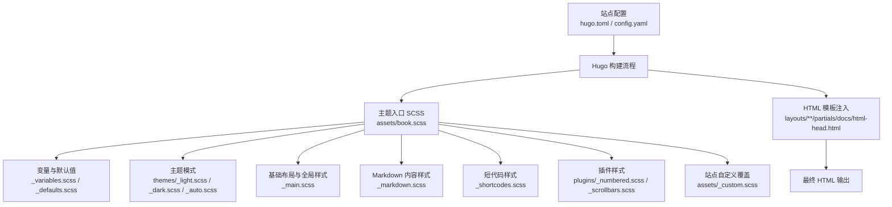
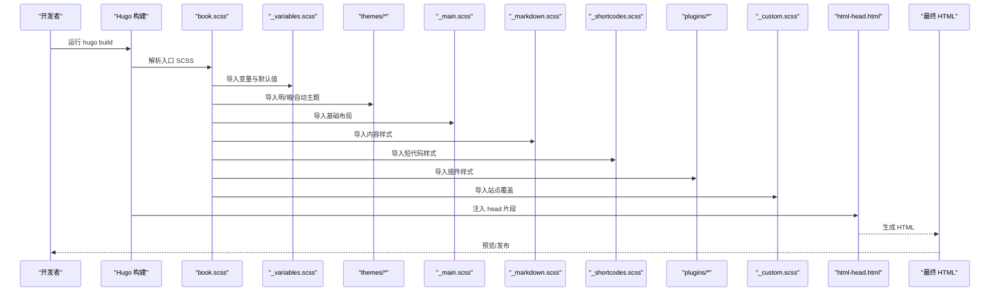
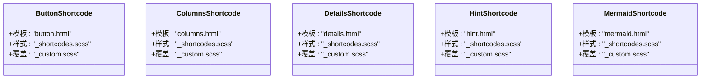
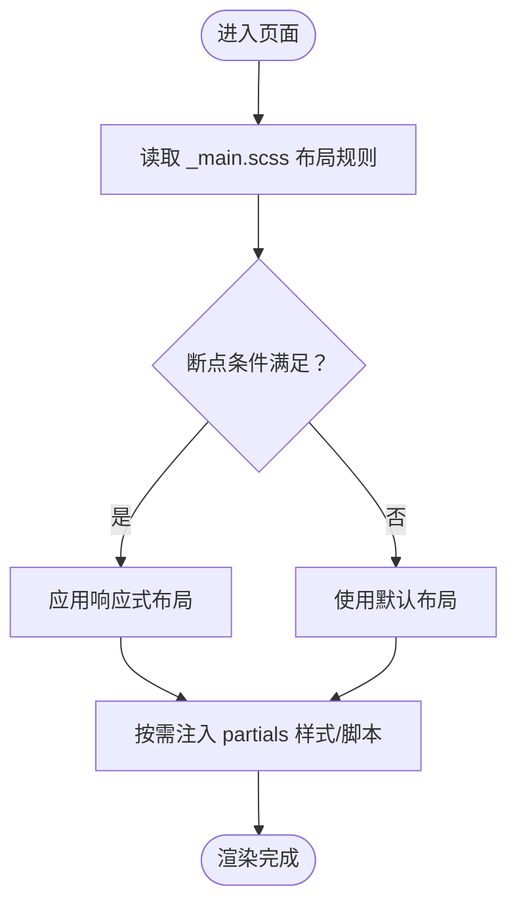
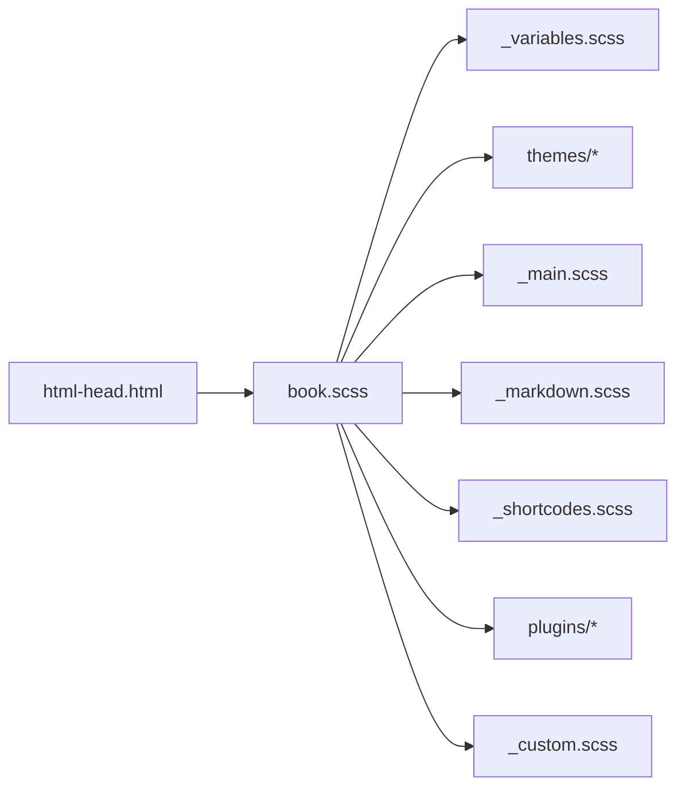

# CSS覆盖与扩展

<cite>
**本文引用的文件**   
- [hugo.toml](file://hugo.toml)
- [config.yaml](file://config.yaml)
- [book.scss](file://themes/hugo-book/assets/book.scss)
- [_variables.scss](file://themes/hugo-book/assets/_variables.scss)
- [_main.scss](file://themes/hugo-book/assets/_main.scss)
- [_markdown.scss](file://themes/hugo-book/assets/_markdown.scss)
- [_shortcodes.scss](file://themes/hugo-book/assets/_shortcodes.scss)
- [_custom.scss](file://themes/hugo-book/assets/_custom.scss)
- [_defaults.scss](file://themes/hugo-book/assets/_defaults.scss)
- [_fonts.scss](file://themes/hugo-book/assets/_fonts.scss)
- [_print.scss](file://themes/hugo-book/assets/_print.scss)
- [_utils.scss](file://themes/hugo-book/assets/_utils.scss)
- [_auto.scss](file://themes/hugo-book/assets/themes/_auto.scss)
- [_dark.scss](file://themes/hugo-book/assets/themes/_dark.scss)
- [_light.scss](file://themes/hugo-book/assets/themes/_light.scss)
- [_numbered.scss](file://themes/hugo-book/assets/plugins/_numbered.scss)
- [_scrollbars.scss](file://themes/hugo-book/assets/plugins/_scrollbars.scss)
- [baseof.html](file://themes/hugo-book/layouts/_default/baseof.html)
- [single.html](file://themes/hugo-book/layouts/_default/single.html)
- [list.html](file://themes/hugo-book/layouts/_default/list.html)
- [html-head.html](file://themes/hugo-book/layouts/partials/docs/html-head.html)
- [button.html](file://themes/hugo-book/layouts/shortcodes/button.html)
- [columns.html](file://themes/hugo-book/layouts/shortcodes/columns.html)
- [details.html](file://themes/hugo-book/layouts/shortcodes/details.html)
- [hint.html](file://themes/hugo-book/layouts/shortcodes/hint.html)
- [mermaid.html](file://themes/hugo-book/layouts/shortcodes/mermaid.html)
</cite>

## 目录
1. [简介](#简介)
2. [项目结构](#项目结构)
3. [核心组件](#核心组件)
4. [架构总览](#架构总览)
5. [详细组件分析](#详细组件分析)
6. [依赖关系分析](#依赖关系分析)
7. [性能考虑](#性能考虑)
8. [故障排查指南](#故障排查指南)
9. [结论](#结论)
10. [附录](#附录)

## 简介
本指南面向使用 Hugo Book 主题的项目，提供系统化的 CSS 覆盖与扩展方法。内容涵盖：
- 安全覆盖主题默认样式（优先级管理、选择器优化、冲突解决）
- 自定义组件样式开发（短代码样式定制、页面布局调整、动画效果）
- 主题扩展最佳实践（SCSS 模块化组织、CSS 变量继承、命名约定）
- 资源扩展（自定义图标、背景图片、装饰元素）
- 性能监控与优化（文件大小控制、关键路径提取、渲染调优）
- 调试工具与浏览器开发者工具使用

## 项目结构
本项目基于 Hugo Book 主题，样式入口为 SCSS 聚合文件，通过 Hugo Pipes 编译输出到最终 HTML。主题提供了变量、主题色、排版、短代码等模块，便于在站点层进行覆盖与扩展。

图表来源
- [book.scss](file://themes/hugo-book/assets/book.scss)
- [_variables.scss](file://themes/hugo-book/assets/_variables.scss)
- [_main.scss](file://themes/hugo-book/assets/_main.scss)
- [_markdown.scss](file://themes/hugo-book/assets/_markdown.scss)
- [_shortcodes.scss](file://themes/hugo-book/assets/_shortcodes.scss)
- [_custom.scss](file://themes/hugo-book/assets/_custom.scss)
- [_light.scss](file://themes/hugo-book/assets/themes/_light.scss)
- [_dark.scss](file://themes/hugo-book/assets/themes/_dark.scss)
- [_auto.scss](file://themes/hugo-book/assets/themes/_auto.scss)
- [_numbered.scss](file://themes/hugo-book/assets/plugins/_numbered.scss)
- [_scrollbars.scss](file://themes/hugo-book/assets/plugins/_scrollbars.scss)
- [html-head.html](file://themes/hugo-book/layouts/partials/docs/html-head.html)

章节来源
- [hugo.toml](file://hugo.toml)
- [config.yaml](file://config.yaml)
- [book.scss](file://themes/hugo-book/assets/book.scss)
- [_custom.scss](file://themes/hugo-book/assets/_custom.scss)
- [html-head.html](file://themes/hugo-book/layouts/partials/docs/html-head.html)

## 核心组件
- 样式入口与模块划分
  - 入口：book.scss 负责引入变量、主题、基础、内容、短代码与插件样式。
  - 变量与默认值：_variables.scss 与 _defaults.scss 集中定义颜色、字体、间距、断点等。
  - 主题模式：_light.scss、_dark.scss、_auto.scss 提供明暗主题与自动切换逻辑。
  - 基础布局：_main.scss 包含全局重置、布局容器、导航、侧边栏等。
  - 内容排版：_markdown.scss 针对 Markdown 生成的标签与组件进行样式化。
  - 短代码样式：_shortcodes.scss 对应按钮、提示、折叠、分栏等短代码的视觉表现。
  - 插件样式：_numbered.scss（编号）、_scrollbars.scss（滚动条美化）。
  - 站点覆盖：_custom.scss 作为站点级覆盖入口，避免直接修改主题源码。

- 模板与资源注入
  - html-head.html 用于注入 favicon、预加载、第三方资源等。
  - baseof.html、single.html、list.html 构成页面骨架与局部区域。

章节来源
- [book.scss](file://themes/hugo-book/assets/book.scss)
- [_variables.scss](file://themes/hugo-book/assets/_variables.scss)
- [_defaults.scss](file://themes/hugo-book/assets/_defaults.scss)
- [_light.scss](file://themes/hugo-book/assets/themes/_light.scss)
- [_dark.scss](file://themes/hugo-book/assets/themes/_dark.scss)
- [_auto.scss](file://themes/hugo-book/assets/themes/_auto.scss)
- [_main.scss](file://themes/hugo-book/assets/_main.scss)
- [_markdown.scss](file://themes/hugo-book/assets/_markdown.scss)
- [_shortcodes.scss](file://themes/hugo-book/assets/_shortcodes.scss)
- [_numbered.scss](file://themes/hugo-book/assets/plugins/_numbered.scss)
- [_scrollbars.scss](file://themes/hugo-book/assets/plugins/_scrollbars.scss)
- [html-head.html](file://themes/hugo-book/layouts/partials/docs/html-head.html)
- [baseof.html](file://themes/hugo-book/layouts/_default/baseof.html)
- [single.html](file://themes/hugo-book/layouts/_default/single.html)
- [list.html](file://themes/hugo-book/layouts/_default/list.html)

## 架构总览
下图展示了从站点配置到最终 HTML 的关键路径，以及 SCSS 模块间的依赖关系。

图表来源
- [book.scss](file://themes/hugo-book/assets/book.scss)
- [_variables.scss](file://themes/hugo-book/assets/_variables.scss)
- [_light.scss](file://themes/hugo-book/assets/themes/_light.scss)
- [_dark.scss](file://themes/hugo-book/assets/themes/_dark.scss)
- [_auto.scss](file://themes/hugo-book/assets/themes/_auto.scss)
- [_main.scss](file://themes/hugo-book/assets/_main.scss)
- [_markdown.scss](file://themes/hugo-book/assets/_markdown.scss)
- [_shortcodes.scss](file://themes/hugo-book/assets/_shortcodes.scss)
- [_numbered.scss](file://themes/hugo-book/assets/plugins/_numbered.scss)
- [_scrollbars.scss](file://themes/hugo-book/assets/plugins/_scrollbars.scss)
- [_custom.scss](file://themes/hugo-book/assets/_custom.scss)
- [html-head.html](file://themes/hugo-book/layouts/partials/docs/html-head.html)

## 详细组件分析

### 安全覆盖主题默认样式
- 优先级管理
  - 利用 Hugo Pipes 的加载顺序，确保站点 _custom.scss 在主题样式之后加载，从而以更高优先级覆盖。
  - 谨慎使用 !important；优先通过更具体的选择器或作用域限定来覆盖。
- 选择器优化
  - 使用语义化类名与作用域（如 .page-content、.sidebar）减少全局污染。
  - 对复杂嵌套保持适度深度，避免过深导致维护困难。
- 冲突解决策略
  - 定位冲突：在浏览器开发者工具中查看计算样式来源，确认覆盖是否生效。
  - 缩小影响范围：将覆盖限制在特定页面或区块，避免影响其他页面。
  - 版本兼容：当主题升级时，对比变更日志并回归测试关键页面。

章节来源
- [_custom.scss](file://themes/hugo-book/assets/_custom.scss)
- [_main.scss](file://themes/hugo-book/assets/_main.scss)
- [_markdown.scss](file://themes/hugo-book/assets/_markdown.scss)
- [_shortcodes.scss](file://themes/hugo-book/assets/_shortcodes.scss)

### 自定义组件样式开发（短代码）
- 短代码模板与样式映射
  - button.html、columns.html、details.html、hint.html、mermaid.html 等短代码模板定义了 DOM 结构。
  - _shortcodes.scss 对这些结构进行样式化，可通过 _custom.scss 针对性覆盖。
- 开发步骤
  - 在 _custom.scss 中根据目标元素的类名或属性选择器进行覆盖。
  - 如需新增短代码，先在 layouts/shortcodes 下创建模板，再在 _shortcodes.scss 中添加样式。
- 示例要点（不展示具体代码）
  - 按钮尺寸、颜色、悬停态
  - 分栏在不同断点的响应式行为
  - 折叠面板展开/收起动效
  - 提示框类型与图标

图表来源
- [button.html](file://themes/hugo-book/layouts/shortcodes/button.html)
- [columns.html](file://themes/hugo-book/layouts/shortcodes/columns.html)
- [details.html](file://themes/hugo-book/layouts/shortcodes/details.html)
- [hint.html](file://themes/hugo-book/layouts/shortcodes/hint.html)
- [mermaid.html](file://themes/hugo-book/layouts/shortcodes/mermaid.html)
- [_shortcodes.scss](file://themes/hugo-book/assets/_shortcodes.scss)
- [_custom.scss](file://themes/hugo-book/assets/_custom.scss)

章节来源
- [button.html](file://themes/hugo-book/layouts/shortcodes/button.html)
- [columns.html](file://themes/hugo-book/layouts/shortcodes/columns.html)
- [details.html](file://themes/hugo-book/layouts/shortcodes/details.html)
- [hint.html](file://themes/hugo-book/layouts/shortcodes/hint.html)
- [mermaid.html](file://themes/hugo-book/layouts/shortcodes/mermaid.html)
- [_shortcodes.scss](file://themes/hugo-book/assets/_shortcodes.scss)
- [_custom.scss](file://themes/hugo-book/assets/_custom.scss)

### 页面布局调整
- 全局布局
  - _main.scss 定义侧边栏、主内容区、顶部导航等布局容器与栅格。
  - 通过 _variables.scss 中的断点变量调整响应式行为。
- 单页与列表页
  - single.html 与 list.html 分别承载文章与列表页面，可在局部 partials 中注入额外样式或脚本。
- 打印样式
  - _print.scss 控制打印时的可见性与排版，适合文档导出场景。

图表来源
- [_main.scss](file://themes/hugo-book/assets/_main.scss)
- [_variables.scss](file://themes/hugo-book/assets/_variables.scss)
- [single.html](file://themes/hugo-book/layouts/_default/single.html)
- [list.html](file://themes/hugo-book/layouts/_default/list.html)
- [_print.scss](file://themes/hugo-book/assets/_print.scss)

章节来源
- [_main.scss](file://themes/hugo-book/assets/_main.scss)
- [_variables.scss](file://themes/hugo-book/assets/_variables.scss)
- [single.html](file://themes/hugo-book/layouts/_default/single.html)
- [list.html](file://themes/hugo-book/layouts/_default/list.html)
- [_print.scss](file://themes/hugo-book/assets/_print.scss)

### 动画效果添加
- 推荐做法
  - 在 _custom.scss 中使用 CSS transitions 与 keyframes，尽量复用主题变量（颜色、时长、缓动函数）。
  - 对交互元素（按钮、卡片、折叠面板）添加轻量动效，避免过度动画影响性能。
- 注意事项
  - 避免在移动端触发重排重绘的昂贵属性（如 width/height），优先使用 transform 与 opacity。
  - 结合 prefers-reduced-motion 媒体查询，尊重用户偏好。

章节来源
- [_custom.scss](file://themes/hugo-book/assets/_custom.scss)
- [_variables.scss](file://themes/hugo-book/assets/_variables.scss)

### 主题扩展最佳实践
- SCSS 模块化组织
  - 遵循“变量—主题—基础—内容—短代码—插件—覆盖”的分层结构，便于维护与升级。
- CSS 变量继承
  - 在 _variables.scss 中统一定义主题色、字体、间距等，并在 _custom.scss 中覆写以实现品牌化。
- 命名约定规范
  - 使用语义化类名（如 btn-primary、card-info、toc-item），避免通用名（如 box、wrap）。
  - 对短代码相关类名前缀保持一致，便于查找与覆盖。

章节来源
- [_variables.scss](file://themes/hugo-book/assets/_variables.scss)
- [_custom.scss](file://themes/hugo-book/assets/_custom.scss)
- [_shortcodes.scss](file://themes/hugo-book/assets/_shortcodes.scss)

### 添加自定义图标、背景图片与装饰元素
- 图标
  - 推荐使用 SVG 图标，放置在 assets 或 static 目录，并通过  或 background-image 引用。
  - 若需内联 SVG，可在模板中注入或使用 data URI。
- 背景图片
  - 在 _custom.scss 中通过 background-image 设置，注意压缩与懒加载以提升性能。
- 装饰元素
  - 使用伪元素（::before/::after）添加装饰线、角标等，避免增加多余 DOM。

章节来源
- [_custom.scss](file://themes/hugo-book/assets/_custom.scss)
- [html-head.html](file://themes/hugo-book/layouts/partials/docs/html-head.html)

## 依赖关系分析
- 模块耦合与内聚
  - book.scss 作为聚合入口，低耦合地引入各模块，提升内聚性。
  - _variables.scss 与 _defaults.scss 被广泛引用，形成单一事实源。
- 外部依赖
  - 第三方资源（如 KaTeX、Fuse.js）通过 html-head.html 注入，避免阻塞首屏。
- 潜在循环依赖
  - 当前结构无循环导入风险，但应避免在 _custom.scss 中反向引入主题内部模块。

图表来源
- [book.scss](file://themes/hugo-book/assets/book.scss)
- [_variables.scss](file://themes/hugo-book/assets/_variables.scss)
- [_light.scss](file://themes/hugo-book/assets/themes/_light.scss)
- [_dark.scss](file://themes/hugo-book/assets/themes/_dark.scss)
- [_auto.scss](file://themes/hugo-book/assets/themes/_auto.scss)
- [_main.scss](file://themes/hugo-book/assets/_main.scss)
- [_markdown.scss](file://themes/hugo-book/assets/_markdown.scss)
- [_shortcodes.scss](file://themes/hugo-book/assets/_shortcodes.scss)
- [_numbered.scss](file://themes/hugo-book/assets/plugins/_numbered.scss)
- [_scrollbars.scss](file://themes/hugo-book/assets/plugins/_scrollbars.scss)
- [_custom.scss](file://themes/hugo-book/assets/_custom.scss)
- [html-head.html](file://themes/hugo-book/layouts/partials/docs/html-head.html)

章节来源
- [book.scss](file://themes/hugo-book/assets/book.scss)
- [_custom.scss](file://themes/hugo-book/assets/_custom.scss)
- [html-head.html](file://themes/hugo-book/layouts/partials/docs/html-head.html)

## 性能考虑
- CSS 文件大小控制
  - 仅引入必要模块，避免重复定义与冗余选择器。
  - 使用 Hugo Pipes 的 minify 与缓存机制，减少传输体积。
- 关键路径提取
  - 将首屏关键样式（布局、字体、主题色）尽早加载，非关键样式延迟加载。
  - 通过 html-head.html 注入预加载与关键资源。
- 渲染性能调优
  - 减少重排重绘：优先使用 transform、opacity 实现动画。
  - 合理使用 will-change 与 GPU 加速，避免滥用。
  - 对长列表与大图启用懒加载与占位图。

[本节为通用指导，不直接分析具体文件]

## 故障排查指南
- 常见问题定位
  - 样式未生效：检查 _custom.scss 加载顺序与选择器优先级，确认未被后续样式覆盖。
  - 主题切换异常：验证 themes/_auto.scss 与 prefers-color-scheme 兼容性。
  - 短代码样式错乱：核对模板结构与 _shortcodes.scss 的类名一致性。
- 调试工具使用
  - 浏览器开发者工具：Elements 面板查看计算样式来源；Network 面板检查资源加载顺序与大小；Performance 面板分析渲染耗时。
  - 控制台日志：在关键样式处添加临时注释或降级样式，逐步定位问题。
- 回归与版本升级
  - 升级主题后，对比变更日志，回归关键页面与组件样式。
  - 建立样式快照与自动化测试（如截图对比）辅助回归。

章节来源
- [_custom.scss](file://themes/hugo-book/assets/_custom.scss)
- [_auto.scss](file://themes/hugo-book/assets/themes/_auto.scss)
- [_shortcodes.scss](file://themes/hugo-book/assets/_shortcodes.scss)
- [html-head.html](file://themes/hugo-book/layouts/partials/docs/html-head.html)

## 结论
通过分层清晰的 SCSS 模块化与站点级覆盖机制，可以在不侵入主题源码的前提下，安全、可控地完成样式覆盖与扩展。配合合理的命名约定、变量继承与性能优化策略，能够显著提升可维护性与用户体验。建议在团队中统一规范，并结合调试工具与回归测试保障质量。

[本节为总结性内容，不直接分析具体文件]

## 附录
- 快速参考清单
  - 覆盖入口：_custom.scss
  - 变量中心：_variables.scss
  - 主题模式：_light.scss / _dark.scss / _auto.scss
  - 基础布局：_main.scss
  - 内容样式：_markdown.scss
  - 短代码样式：_shortcodes.scss
  - 插件样式：_numbered.scss / _scrollbars.scss
  - 资源注入：html-head.html

[本节为补充信息，不直接分析具体文件]