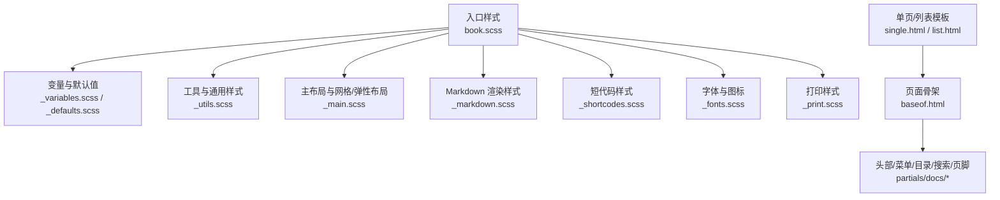
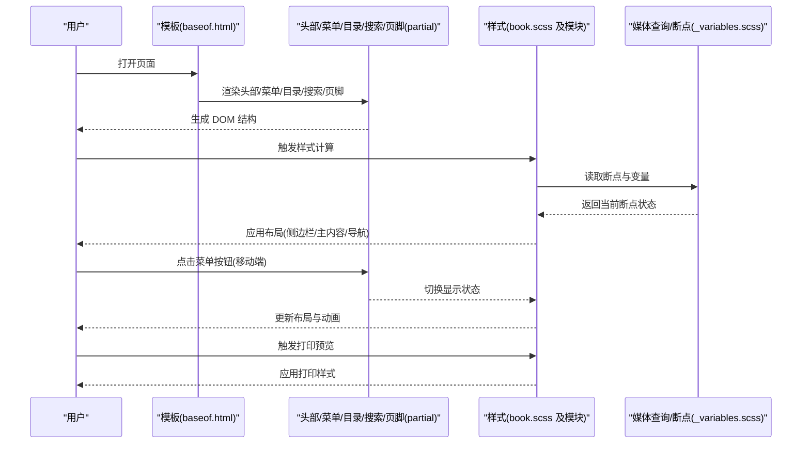
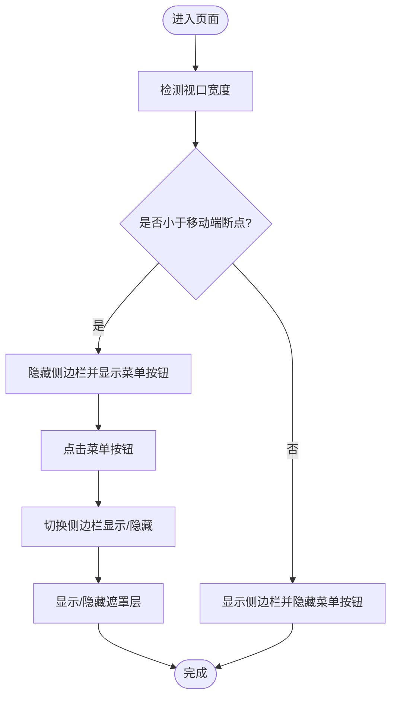
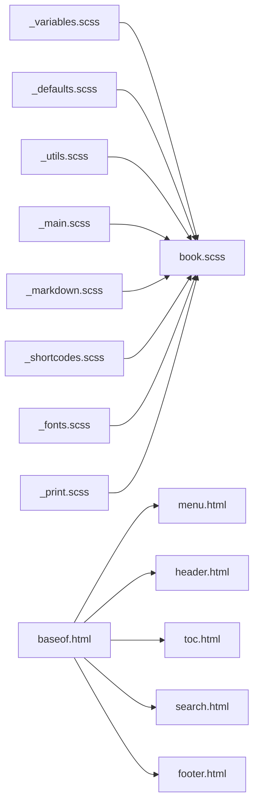

# 响应式设计

<cite>
**本文引用的文件**   
- [book.scss](file://themes/hugo-book/assets/book.scss)
- [_variables.scss](file://themes/hugo-book/assets/_variables.scss)
- [_main.scss](file://themes/hugo-book/assets/_main.scss)
- [_markdown.scss](file://themes/hugo-book/assets/_markdown.scss)
- [_print.scss](file://themes/hugo-book/assets/_print.scss)
- [_shortcodes.scss](file://themes/hugo-book/assets/_shortcodes.scss)
- [_utils.scss](file://themes/hugo-book/assets/_utils.scss)
- [_fonts.scss](file://themes/hugo-book/assets/_fonts.scss)
- [_defaults.scss](file://themes/hugo-book/assets/_defaults.scss)
- [_custom.scss](file://themes/hugo-book/assets/_custom.scss)
- [menu.html](file://themes/hugo-book/layouts/partials/docs/menu.html)
- [header.html](file://themes/hugo-book/layouts/partials/docs/header.html)
- [footer.html](file://themes/hugo-book/layouts/partials/docs/footer.html)
- [toc.html](file://themes/hugo-book/layouts/partials/docs/toc.html)
- [search.html](file://themes/hugo-book/layouts/partials/docs/search.html)
- [baseof.html](file://themes/hugo-book/layouts/_default/baseof.html)
- [single.html](file://themes/hugo-book/layouts/_default/single.html)
- [list.html](file://themes/hugo-book/layouts/_default/list.html)
- [hugo.toml](file://hugo.toml)
- [config.yaml](file://config.yaml)
</cite>

## 目录
1. [简介](#简介)
2. [项目结构](#项目结构)
3. [核心组件](#核心组件)
4. [架构总览](#架构总览)
5. [详细组件分析](#详细组件分析)
6. [依赖关系分析](#依赖关系分析)
7. [性能考量](#性能考量)
8. [故障排查指南](#故障排查指南)
9. [结论](#结论)
10. [附录](#附录)

## 简介
本指南面向使用 Hugo Book 主题的项目，聚焦响应式设计与移动端适配的定制方法。内容涵盖断点系统、CSS Grid/Flexbox 布局策略、媒体查询最佳实践、侧边栏与导航在移动端的适配、触摸交互优化、打印样式定制、性能优化（图片自适应、资源懒加载、CSS 压缩）以及跨浏览器兼容性与测试方法。文档以仓库中实际存在的主题源码为依据，提供可操作的定制路径与可视化说明。

## 项目结构
Hugo Book 主题的响应式能力主要由 SCSS 样式层与部分模板组成：
- 样式层：入口 book.scss 聚合变量、默认值、工具类、主布局、Markdown 渲染、短代码样式、字体与打印等模块。
- 布局层：通过 partials 注入头部、菜单、目录、搜索、页脚等区域，配合 CSS 实现多屏适配。
- 配置层：hugo.toml/config.yaml 控制主题行为与构建产物。

图表来源
- [book.scss](file://themes/hugo-book/assets/book.scss)
- [_variables.scss](file://themes/hugo-book/assets/_variables.scss)
- [_defaults.scss](file://themes/hugo-book/assets/_defaults.scss)
- [_utils.scss](file://themes/hugo-book/assets/_utils.scss)
- [_main.scss](file://themes/hugo-book/assets/_main.scss)
- [_markdown.scss](file://themes/hugo-book/assets/_markdown.scss)
- [_shortcodes.scss](file://themes/hugo-book/assets/_shortcodes.scss)
- [_fonts.scss](file://themes/hugo-book/assets/_fonts.scss)
- [_print.scss](file://themes/hugo-book/assets/_print.scss)
- [baseof.html](file://themes/hugo-book/layouts/_default/baseof.html)
- [menu.html](file://themes/hugo-book/layouts/partials/docs/menu.html)
- [header.html](file://themes/hugo-book/layouts/partials/docs/header.html)
- [toc.html](file://themes/hugo-book/layouts/partials/docs/toc.html)
- [search.html](file://themes/hugo-book/layouts/partials/docs/search.html)
- [footer.html](file://themes/hugo-book/layouts/partials/docs/footer.html)
- [single.html](file://themes/hugo-book/layouts/_default/single.html)
- [list.html](file://themes/hugo-book/layouts/_default/list.html)

章节来源
- [book.scss](file://themes/hugo-book/assets/book.scss)
- [_main.scss](file://themes/hugo-book/assets/_main.scss)
- [_variables.scss](file://themes/hugo-book/assets/_variables.scss)
- [_print.scss](file://themes/hugo-book/assets/_print.scss)
- [baseof.html](file://themes/hugo-book/layouts/_default/baseof.html)
- [menu.html](file://themes/hugo-book/layouts/partials/docs/menu.html)
- [header.html](file://themes/hugo-book/layouts/partials/docs/header.html)
- [toc.html](file://themes/hugo-book/layouts/partials/docs/toc.html)
- [search.html](file://themes/hugo-book/layouts/partials/docs/search.html)
- [footer.html](file://themes/hugo-book/layouts/partials/docs/footer.html)
- [single.html](file://themes/hugo-book/layouts/_default/single.html)
- [list.html](file://themes/hugo-book/layouts/_default/list.html)

## 核心组件
- 断点与变量体系：集中定义于变量与默认值文件，用于统一控制栅格、间距、字号、颜色与主题切换。
- 主布局与网格：基于 Flexbox 与 CSS Grid 的组合，实现“侧边栏 + 主内容”的经典文档布局，并在小屏下自动折叠或堆叠。
- Markdown 渲染样式：确保长文本、表格、代码块在不同屏幕下的可读性。
- 短代码样式：按钮、提示框、标签页等交互组件在小屏下的可用性保障。
- 打印样式：去除无关装饰、调整字号与行距、隐藏导航与侧边栏，提升纸质输出质量。
- 模板注入点：头部、菜单、目录、搜索、页脚等 partials 为响应式行为提供 DOM 结构与交互钩子。

章节来源
- [_variables.scss](file://themes/hugo-book/assets/_variables.scss)
- [_defaults.scss](file://themes/hugo-book/assets/_defaults.scss)
- [_main.scss](file://themes/hugo-book/assets/_main.scss)
- [_markdown.scss](file://themes/hugo-book/assets/_markdown.scss)
- [_shortcodes.scss](file://themes/hugo-book/assets/_shortcodes.scss)
- [_print.scss](file://themes/hugo-book/assets/_print.scss)
- [menu.html](file://themes/hugo-book/layouts/partials/docs/menu.html)
- [header.html](file://themes/hugo-book/layouts/partials/docs/header.html)
- [toc.html](file://themes/hugo-book/layouts/partials/docs/toc.html)
- [search.html](file://themes/hugo-book/layouts/partials/docs/search.html)
- [footer.html](file://themes/hugo-book/layouts/partials/docs/footer.html)

## 架构总览
下图展示了从模板到样式的响应式数据流与渲染流程，包括移动端菜单展开、目录定位与打印模式切换的关键节点。

图表来源
- [baseof.html](file://themes/hugo-book/layouts/_default/baseof.html)
- [menu.html](file://themes/hugo-book/layouts/partials/docs/menu.html)
- [header.html](file://themes/hugo-book/layouts/partials/docs/header.html)
- [toc.html](file://themes/hugo-book/layouts/partials/docs/toc.html)
- [search.html](file://themes/hugo-book/layouts/partials/docs/search.html)
- [footer.html](file://themes/hugo-book/layouts/partials/docs/footer.html)
- [book.scss](file://themes/hugo-book/assets/book.scss)
- [_variables.scss](file://themes/hugo-book/assets/_variables.scss)

## 详细组件分析

### 断点系统与媒体查询最佳实践
- 断点来源：主题将常用断点与尺寸变量集中在变量文件中，便于统一维护与扩展。
- 使用建议：
  - 优先使用相对单位与流体排版，避免硬编码像素值。
  - 在需要复杂二维布局时使用 CSS Grid，在一维排列与对齐场景使用 Flexbox。
  - 针对小屏优先设计，逐步增强到大屏体验。
  - 使用 prefers-reduced-motion 与 prefers-color-scheme 等特性提升可访问性与用户体验。

章节来源
- [_variables.scss](file://themes/hugo-book/assets/_variables.scss)
- [_main.scss](file://themes/hugo-book/assets/_main.scss)

### 侧边栏折叠与导航菜单适配
- 布局模式：桌面端采用“侧边栏 + 主内容”的双栏布局；移动端通过媒体查询将侧边栏隐藏，并提供顶部汉堡菜单进行切换。
- 交互要点：
  - 菜单按钮点击后切换侧边栏可见性，同时为遮罩层添加点击关闭逻辑。
  - 滚动时保持目录高亮与锚点跳转，注意移动端滚动容器的边界处理。
- 定制路径：
  - 修改菜单模板以调整层级与展示项。
  - 在自定义样式中覆盖侧边栏宽度、背景与过渡动画。

图表来源
- [menu.html](file://themes/hugo-book/layouts/partials/docs/menu.html)
- [_main.scss](file://themes/hugo-book/assets/_main.scss)
- [_variables.scss](file://themes/hugo-book/assets/_variables.scss)

章节来源
- [menu.html](file://themes/hugo-book/layouts/partials/docs/menu.html)
- [_main.scss](file://themes/hugo-book/assets/_main.scss)

### 内容区域与网格布局
- 主内容区：在大屏下占据主要列宽，在小屏下全宽显示；表格与代码块需启用横向滚动以避免溢出。
- 网格策略：
  - 使用 CSS Grid 定义整体页面网格（侧边栏、主内容、目录）。
  - 使用 Flexbox 处理局部对齐与分布（如工具栏、标签组）。
- 定制建议：
  - 通过变量调整列数与间距，保证不同屏幕下的阅读节奏。
  - 对长表格与代码块设置最小宽度与滚动容器，提升可读性。

章节来源
- [_main.scss](file://themes/hugo-book/assets/_main.scss)
- [_markdown.scss](file://themes/hugo-book/assets/_markdown.scss)

### 触摸交互优化
- 点击区域：确保按钮与链接的最小触控面积，避免误触。
- 手势支持：
  - 滑动关闭侧边栏或切换标签页时，使用原生事件与节流策略减少重排。
  - 禁用不必要的缩放与双击放大，提升移动端浏览体验。
- 滚动性能：
  - 使用 will-change 与 transform 优化动画。
  - 避免在滚动事件中执行昂贵计算，必要时使用 requestAnimationFrame。

章节来源
- [_shortcodes.scss](file://themes/hugo-book/assets/_shortcodes.scss)
- [_main.scss](file://themes/hugo-book/assets/_main.scss)

### 打印样式定制
- 目标：去除装饰元素、隐藏导航与侧边栏、调整字号与行距、保证链接可识别。
- 关键做法：
  - 在打印媒体查询中重置布局为单列。
  - 隐藏非必需 DOM 节点（菜单、搜索、页脚等）。
  - 为链接追加 URL 文本，便于纸质阅读。
  - 控制分页与断页，避免表格与代码块被截断。

章节来源
- [_print.scss](file://themes/hugo-book/assets/_print.scss)

### 短代码与交互组件适配
- 按钮、提示框、标签页等组件在小屏下应自动调整内边距与字号，确保可读性与触控友好。
- 建议在自定义样式中覆盖组件的断点行为，使其与整体布局一致。

章节来源
- [_shortcodes.scss](file://themes/hugo-book/assets/_shortcodes.scss)

### 模板注入点与响应式行为
- baseof.html 作为页面骨架，负责引入头部、菜单、目录、搜索与页脚等 partials。
- 各 partials 提供响应式行为的 DOM 结构与事件钩子，便于在样式层进行适配。

章节来源
- [baseof.html](file://themes/hugo-book/layouts/_default/baseof.html)
- [menu.html](file://themes/hugo-book/layouts/partials/docs/menu.html)
- [header.html](file://themes/hugo-book/layouts/partials/docs/header.html)
- [toc.html](file://themes/hugo-book/layouts/partials/docs/toc.html)
- [search.html](file://themes/hugo-book/layouts/partials/docs/search.html)
- [footer.html](file://themes/hugo-book/layouts/partials/docs/footer.html)

## 依赖关系分析
- 样式依赖：book.scss 聚合所有模块，按顺序引入变量、默认值、工具、主布局、Markdown、短代码、字体与打印样式。
- 模板依赖：baseof.html 组合多个 partials，形成完整的页面结构。
- 配置依赖：hugo.toml/config.yaml 决定主题启用与构建选项，影响最终产物的样式与脚本。

图表来源
- [book.scss](file://themes/hugo-book/assets/book.scss)
- [_variables.scss](file://themes/hugo-book/assets/_variables.scss)
- [_defaults.scss](file://themes/hugo-book/assets/_defaults.scss)
- [_utils.scss](file://themes/hugo-book/assets/_utils.scss)
- [_main.scss](file://themes/hugo-book/assets/_main.scss)
- [_markdown.scss](file://themes/hugo-book/assets/_markdown.scss)
- [_shortcodes.scss](file://themes/hugo-book/assets/_shortcodes.scss)
- [_fonts.scss](file://themes/hugo-book/assets/_fonts.scss)
- [_print.scss](file://themes/hugo-book/assets/_print.scss)
- [baseof.html](file://themes/hugo-book/layouts/_default/baseof.html)
- [menu.html](file://themes/hugo-book/layouts/partials/docs/menu.html)
- [header.html](file://themes/hugo-book/layouts/partials/docs/header.html)
- [toc.html](file://themes/hugo-book/layouts/partials/docs/toc.html)
- [search.html](file://themes/hugo-book/layouts/partials/docs/search.html)
- [footer.html](file://themes/hugo-book/layouts/partials/docs/footer.html)

章节来源
- [book.scss](file://themes/hugo-book/assets/book.scss)
- [baseof.html](file://themes/hugo-book/layouts/_default/baseof.html)
- [hugo.toml](file://hugo.toml)
- [config.yaml](file://config.yaml)

## 性能考量
- 图片自适应：
  - 使用 srcset 与 sizes 属性提供多分辨率图片，减少带宽消耗。
  - 对大图启用懒加载，仅在进入视口时加载。
- 资源懒加载：
  - 对非首屏脚本与样式按需加载，降低首屏时间。
  - 使用预连接与预加载关键资源。
- CSS 压缩策略：
  - 在生产环境启用 CSS 压缩与合并，减少请求数量与体积。
  - 移除未使用的样式规则，避免冗余。
- 滚动与动画：
  - 使用 transform 与 opacity 进行动画，避免触发重排。
  - 在滚动事件中节流或防抖，减少主线程压力。

[本节为通用指导，不直接分析具体文件]

## 故障排查指南
- 侧边栏无法折叠：
  - 检查菜单按钮的事件绑定与样式类名是否正确。
  - 确认媒体查询断点是否与预期一致。
- 表格溢出：
  - 为表格容器设置横向滚动，并确保最小宽度合理。
- 打印样式异常：
  - 检查打印媒体查询中的隐藏规则是否覆盖了必要元素。
  - 验证链接 URL 追加逻辑是否生效。
- 移动端触控不灵敏：
  - 增大按钮与链接的点击区域，避免过小导致误触。
  - 禁用不必要的缩放与双击放大。

章节来源
- [_main.scss](file://themes/hugo-book/assets/_main.scss)
- [_markdown.scss](file://themes/hugo-book/assets/_markdown.scss)
- [_print.scss](file://themes/hugo-book/assets/_print.scss)
- [_shortcodes.scss](file://themes/hugo-book/assets/_shortcodes.scss)

## 结论
通过对 Hugo Book 主题的断点系统、布局策略与模板结构的深入解析，可以系统化地定制响应式行为，确保在多设备与多场景下的良好体验。结合触摸优化、打印样式与性能策略，能够进一步提升可用性与加载效率。建议在开发过程中遵循小屏优先、渐进增强的原则，并通过自动化测试与人工交叉验证保障兼容性。

[本节为总结，不直接分析具体文件]

## 附录
- 快速定制清单：
  - 在变量文件中新增或调整断点与尺寸常量。
  - 在主布局中覆盖侧边栏宽度与过渡效果。
  - 在 Markdown 样式中优化表格与代码块的滚动行为。
  - 在打印样式中隐藏非必要元素并调整排版。
  - 在短代码样式中提升触控友好度。
- 推荐测试方法：
  - 使用浏览器开发者工具的响应式模式进行多断点验证。
  - 在不同设备上测试触摸交互与滚动性能。
  - 使用 Lighthouse 评估性能与可访问性指标。

[本节为补充信息，不直接分析具体文件]