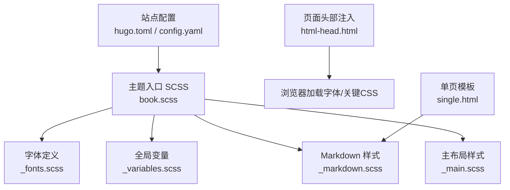
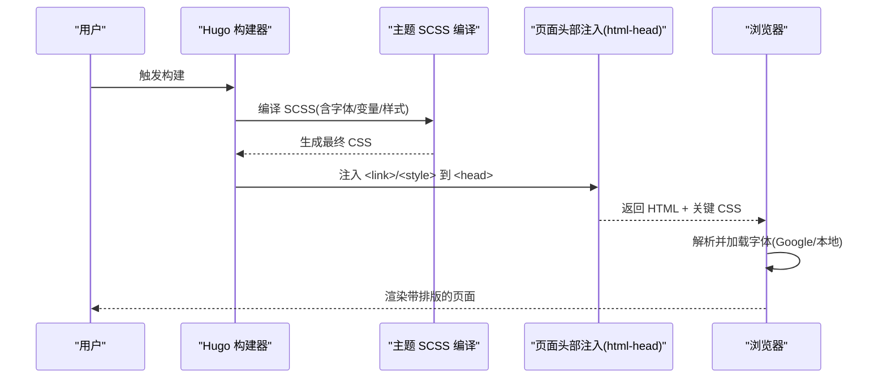
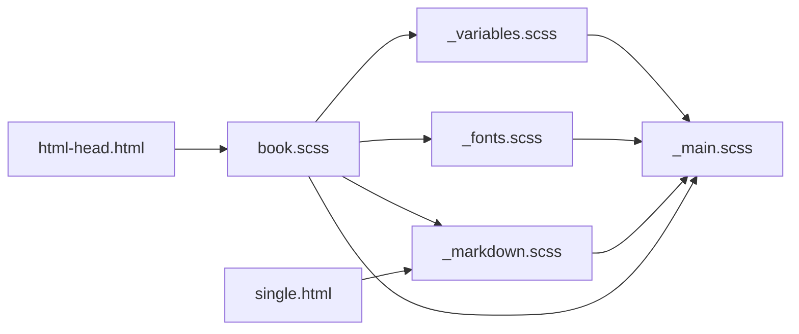

# 字体与排版

<cite>
**本文引用的文件**
- [hugo.toml](file://hugo.toml)
- [config.yaml](file://config.yaml)
- [_fonts.scss](file://themes/hugo-book/assets/_fonts.scss)
- [_variables.scss](file://themes/hugo-book/assets/_variables.scss)
- [_markdown.scss](file://themes/hugo-book/assets/_markdown.scss)
- [_main.scss](file://themes/hugo-book/assets/_main.scss)
- [_custom.scss](file://themes/hugo-book/assets/_custom.scss)
- [book.scss](file://themes/hugo-book/assets/book.scss)
- [html-head.html](file://themes/hugo-book/layouts/partials/docs/html-head.html)
- [single.html](file://themes/hugo-book/layouts/_default/single.html)
</cite>

## 目录
1. [简介](#简介)
2. [项目结构](#项目结构)
3. [核心组件](#核心组件)
4. [架构总览](#架构总览)
5. [详细组件分析](#详细组件分析)
6. [依赖关系分析](#依赖关系分析)
7. [性能考虑](#性能考虑)
8. [故障排查指南](#故障排查指南)
9. [结论](#结论)
10. [附录](#附录)

## 简介
本指南面向使用 Hugo Book 主题的博客/文档站点，聚焦“字体与排版”的完整定制能力。内容覆盖：
- 字体加载机制：Google Fonts 集成、本地字体部署、中文字体支持方案
- 字体变量配置：字体族、字重、行高、字间距等排版属性
- Markdown 样式定制：标题层级、代码块、引用块、列表等元素优化
- 响应式字体大小：多设备阅读体验保障
- 性能优化：字体子集化、预加载策略、缓存配置
- 无障碍访问：字体要求与高对比度模式支持

## 项目结构
本项目基于 Hugo Book 主题，字体与排版相关的关键位置如下：
- 主题资源（SCSS）：位于 themes/hugo-book/assets 下，包含字体定义、变量、Markdown 渲染样式等
- 页面头部注入：layouts/partials/docs/html-head.html 用于在 <head> 中注入字体链接或内联关键 CSS
- 单页模板：layouts/_default/single.html 作为正文渲染入口，承载排版样式生效范围
- 站点配置：根目录 hugo.toml 与 config.yaml 可启用/关闭 Google Fonts 或设置自定义变量

图表来源
- [book.scss](file://themes/hugo-book/assets/book.scss)
- [_fonts.scss](file://themes/hugo-book/assets/_fonts.scss)
- [_variables.scss](file://themes/hugo-book/assets/_variables.scss)
- [_markdown.scss](file://themes/hugo-book/assets/_markdown.scss)
- [_main.scss](file://themes/hugo-book/assets/_main.scss)
- [html-head.html](file://themes/hugo-book/layouts/partials/docs/html-head.html)
- [single.html](file://themes/hugo-book/layouts/_default/single.html)

章节来源
- [hugo.toml](file://hugo.toml)
- [config.yaml](file://config.yaml)
- [book.scss](file://themes/hugo-book/assets/book.scss)
- [_fonts.scss](file://themes/hugo-book/assets/_fonts.scss)
- [_variables.scss](file://themes/hugo-book/assets/_variables.scss)
- [_markdown.scss](file://themes/hugo-book/assets/_markdown.scss)
- [_main.scss](file://themes/hugo-book/assets/_main.scss)
- [html-head.html](file://themes/hugo-book/layouts/partials/docs/html-head.html)
- [single.html](file://themes/hugo-book/layouts/_default/single.html)

## 核心组件
- 字体加载层：通过主题 SCSS 与页面头部注入，完成 Google Fonts 或本地字体的引入与声明
- 变量层：集中管理字体族、字重、行高、字间距、字号等排版变量
- 样式层：针对 Markdown 元素（标题、段落、代码、引用、列表等）应用排版规则
- 注入层：在 <head> 中按需注入字体链接或关键 CSS，控制首屏渲染路径

章节来源
- [_fonts.scss](file://themes/hugo-book/assets/_fonts.scss)
- [_variables.scss](file://themes/hugo-book/assets/_variables.scss)
- [_markdown.scss](file://themes/hugo-book/assets/_markdown.scss)
- [html-head.html](file://themes/hugo-book/layouts/partials/docs/html-head.html)

## 架构总览
下图展示了从配置到渲染的端到端流程，以及各模块间的依赖关系。

图表来源
- [book.scss](file://themes/hugo-book/assets/book.scss)
- [_fonts.scss](file://themes/hugo-book/assets/_fonts.scss)
- [html-head.html](file://themes/hugo-book/layouts/partials/docs/html-head.html)

## 详细组件分析

### 字体加载机制
- Google Fonts 集成
  - 主题提供开关与默认值，可在站点配置中启用/禁用
  - 启用后，页面头部会注入对应 <link> 标签以加载远程字体
  - 建议为常用字重与字形指定 subset，减少体积
- 本地字体部署
  - 将字体文件放入静态资源目录，并在 SCSS 中使用 @font-face 声明
  - 推荐同时提供 WOFF2 与 WOFF 格式，提升兼容性
- 中文字体支持方案
  - 优先选择对中文友好的开源字体（如思源系列），并按需裁剪子集
  - 若使用系统字体回退，确保 font-family 顺序合理，避免字符缺失

章节来源
- [_fonts.scss](file://themes/hugo-book/assets/_fonts.scss)
- [html-head.html](file://themes/hugo-book/layouts/partials/docs/html-head.html)
- [hugo.toml](file://hugo.toml)
- [config.yaml](file://config.yaml)

### 字体变量与排版属性
- 字体族
  - 通过变量集中定义正文字体族、无衬线/等宽字体族，便于统一替换
- 字重
  - 定义常规/粗体字重映射，保证标题与强调文本层次清晰
- 行高与字间距
  - 调整行高以提升可读性；适度增加字间距改善长文阅读体验
- 字号与缩放
  - 基础字号配合响应式断点实现自适应缩放

章节来源
- [_variables.scss](file://themes/hugo-book/assets/_variables.scss)
- [_main.scss](file://themes/hugo-book/assets/_main.scss)

### Markdown 内容样式定制
- 标题层级
  - 为 h1-h6 定义统一的字号、字重、边距与锚点样式，保持层级感
- 代码块
  - 设置等宽字体族、背景色、圆角与滚动条样式，提升可读性与美观度
- 引用块
  - 定义左侧边框、背景与内边距，突出提示与注释信息
- 列表
  - 规范有序/无序列表缩进、符号样式与行高，增强条目清晰度

章节来源
- [_markdown.scss](file://themes/hugo-book/assets/_markdown.scss)
- [_main.scss](file://themes/hugo-book/assets/_main.scss)

### 响应式字体大小
- 使用相对单位与媒体查询，在小屏设备上适当缩小基础字号
- 在大屏设备上增大字号与行高，提升沉浸阅读体验
- 结合容器宽度动态调整标题字号，避免溢出与换行异常

章节来源
- [_main.scss](file://themes/hugo-book/assets/_main.scss)
- [_variables.scss](file://themes/hugo-book/assets/_variables.scss)

### 字体性能优化
- 字体子集化
  - 仅包含所需字符集（如 zh-Hans），显著减小字体体积
- 预加载策略
  - 对首屏关键字体添加 preconnect/preload，缩短阻塞时间
- 缓存配置
  - 利用浏览器缓存与 CDN 缓存，降低重复请求成本
- 字体显示策略
  - 使用 swap/fallback 策略，避免 FOIT/FOUT 影响用户体验

章节来源
- [_fonts.scss](file://themes/hugo-book/assets/_fonts.scss)
- [html-head.html](file://themes/hugo-book/layouts/partials/docs/html-head.html)

### 无障碍访问与高对比度模式
- 字体要求
  - 选择清晰易读的字体族，避免过细字重导致低分辨率屏幕难以辨认
- 高对比度模式
  - 在 prefers-contrast 媒体查询中提高对比度，确保文本与背景区分明显
- 可缩放与可聚焦
  - 确保字体随缩放放大不失真，焦点指示不被字体样式遮挡

章节来源
- [_main.scss](file://themes/hugo-book/assets/_main.scss)
- [_variables.scss](file://themes/hugo-book/assets/_variables.scss)

## 依赖关系分析
- 主题入口 SCSS 聚合各模块，按顺序引入字体、变量、Markdown 与主布局样式
- 页面头部注入负责在构建期插入字体链接或关键 CSS，影响首屏渲染路径
- 单页模板承载正文内容，受 Markdown 样式与全局变量共同作用

图表来源
- [book.scss](file://themes/hugo-book/assets/book.scss)
- [_fonts.scss](file://themes/hugo-book/assets/_fonts.scss)
- [_variables.scss](file://themes/hugo-book/assets/_variables.scss)
- [_markdown.scss](file://themes/hugo-book/assets/_markdown.scss)
- [_main.scss](file://themes/hugo-book/assets/_main.scss)
- [html-head.html](file://themes/hugo-book/layouts/partials/docs/html-head.html)
- [single.html](file://themes/hugo-book/layouts/_default/single.html)

章节来源
- [book.scss](file://themes/hugo-book/assets/book.scss)
- [html-head.html](file://themes/hugo-book/layouts/partials/docs/html-head.html)
- [single.html](file://themes/hugo-book/layouts/_default/single.html)

## 性能考虑
- 优先加载关键字体，非关键字体延迟加载
- 使用现代格式（WOFF2）并提供降级（WOFF）
- 开启 HTTP/2 与 CDN 缓存，减少往返时延
- 监控 LCP/CLS 指标，评估字体对首屏与布局稳定性的影响

[本节为通用指导，不直接分析具体文件]

## 故障排查指南
- 字体未生效
  - 检查页面头部是否注入了正确的 <link> 或 @import
  - 确认本地字体路径与 @font-face 声明一致
- 中文显示异常
  - 确认字体包含中文字形或使用合适的回退字体族
  - 检查子集化是否遗漏必要字符
- 首屏闪烁或卡顿
  - 调整字体显示策略与预加载优先级
  - 评估字体体积与网络条件，必要时进一步裁剪子集
- 高对比度模式下可读性差
  - 在媒体查询中提高对比度与描边效果，避免浅色字配浅背景

章节来源
- [_fonts.scss](file://themes/hugo-book/assets/_fonts.scss)
- [html-head.html](file://themes/hugo-book/layouts/partials/docs/html-head.html)

## 结论
通过主题提供的字体加载机制与变量体系，结合 Markdown 样式定制与响应式策略，可以在不同设备上获得一致的阅读体验。配合字体子集化、预加载与缓存优化，能显著提升性能与可用性。遵循无障碍最佳实践，可进一步提升站点的包容性与可访问性。

[本节为总结性内容，不直接分析具体文件]

## 附录
- 快速上手清单
  - 在站点配置中启用/禁用 Google Fonts
  - 如需本地字体，放置字体文件并更新 @font-face 声明
  - 调整 _variables.scss 中的字体族、字重、行高与字间距
  - 在 _markdown.scss 中微调标题、代码、引用与列表样式
  - 在 html-head.html 中添加预加载与连接提示
  - 使用浏览器开发者工具验证字体加载与渲染效果

章节来源
- [hugo.toml](file://hugo.toml)
- [config.yaml](file://config.yaml)
- [_variables.scss](file://themes/hugo-book/assets/_variables.scss)
- [_markdown.scss](file://themes/hugo-book/assets/_markdown.scss)
- [_fonts.scss](file://themes/hugo-book/assets/_fonts.scss)
- [html-head.html](file://themes/hugo-book/layouts/partials/docs/html-head.html)