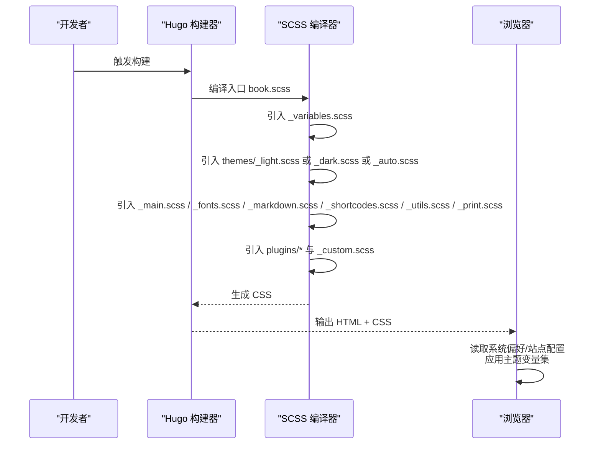
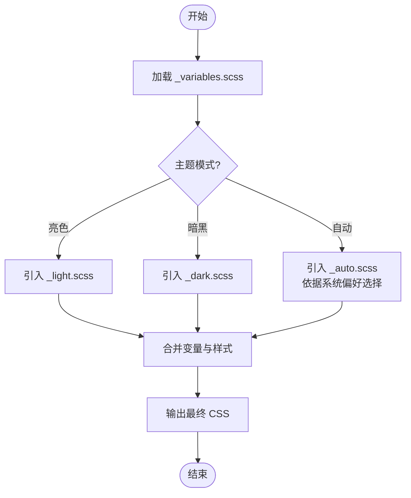
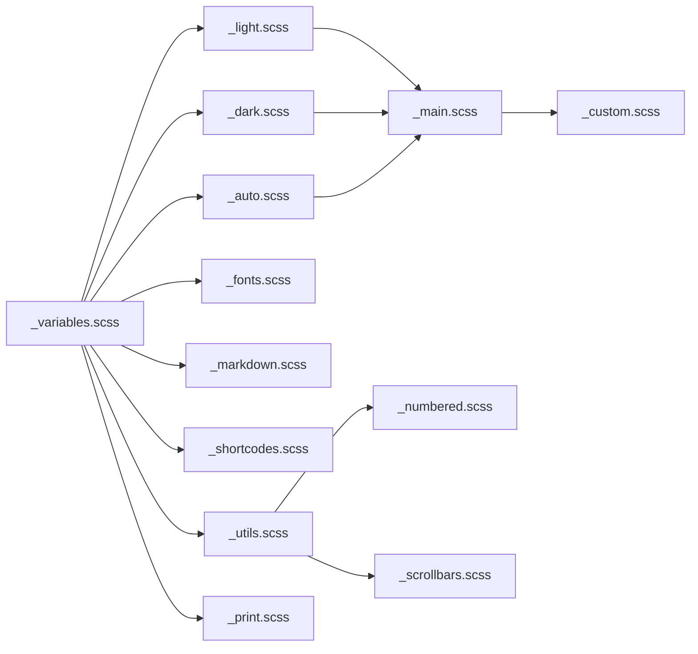

# 样式定制

<cite>
**本文引用的文件**   
- [book.scss](file://themes/hugo-book/assets/book.scss)
- [_variables.scss](file://themes/hugo-book/assets/_variables.scss)
- [_main.scss](file://themes/hugo-book/assets/_main.scss)
- [_fonts.scss](file://themes/hugo-book/assets/_fonts.scss)
- [_markdown.scss](file://themes/hugo-book/assets/_markdown.scss)
- [_shortcodes.scss](file://themes/hugo-book/assets/_shortcodes.scss)
- [_utils.scss](file://themes/hugo-book/assets/_utils.scss)
- [_print.scss](file://themes/hugo-book/assets/_print.scss)
- [_custom.scss](file://themes/hugo-book/assets/_custom.scss)
- [_defaults.scss](file://themes/hugo-book/assets/_defaults.scss)
- [_light.scss](file://themes/hugo-book/assets/themes/_light.scss)
- [_dark.scss](file://themes/hugo-book/assets/themes/_dark.scss)
- [_auto.scss](file://themes/hugo-book/assets/themes/_auto.scss)
- [_numbered.scss](file://themes/hugo-book/assets/plugins/_numbered.scss)
- [_scrollbars.scss](file://themes/hugo-book/assets/plugins/_scrollbars.scss)
- [baseof.html](file://themes/hugo-book/layouts/_default/baseof.html)
- [html-head.html](file://themes/hugo-book/layouts/partials/docs/html-head.html)
- [menu.html](file://themes/hugo-book/layouts/partials/docs/menu.html)
- [search.html](file://themes/hugo-book/layouts/partials/docs/search.html)
- [hugo.toml](file://hugo.toml)
- [config.yaml](file://config.yaml)
</cite>

## 目录
1. [简介](#简介)
2. [项目结构](#项目结构)
3. [核心组件](#核心组件)
4. [架构总览](#架构总览)
5. [详细组件分析](#详细组件分析)
6. [依赖关系分析](#依赖关系分析)
7. [性能与可维护性建议](#性能与可维护性建议)
8. [故障排查指南](#故障排查指南)
9. [结论](#结论)
10. [附录：常用定制清单](#附录常用定制清单)

## 简介
本指南面向希望深度定制 hugo-book 主题视觉风格的开发者，围绕 SCSS 变量系统、主题切换机制（亮色/暗黑/自动）、响应式实现、字体与排版、CSS 覆盖与扩展、动画与交互增强等维度展开。文档提供从“最小改动”到“全面重构”的渐进式路径，并给出可视化图示与定位指引，帮助你快速落地个性化风格。

## 项目结构
hugo-book 主题的样式体系集中在 assets 目录，采用模块化 SCSS 组织方式：入口文件聚合各模块，变量集中管理，主题模式通过独立文件区分，插件样式以子目录隔离，便于按需启用。

```mermaid
graph TB
A["assets/book.scss<br/>入口聚合"] --> B["assets/_variables.scss<br/>全局变量"]
A --> C["assets/_main.scss<br/>基础布局与重置"]
A --> D["assets/_fonts.scss<br/>字体加载与回退"]
A --> E["assets/_markdown.scss<br/>Markdown 渲染样式"]
A --> F["assets/_shortcodes.scss<br/>内置短代码样式"]
A --> G["assets/_utils.scss<br/>工具类与混合宏"]
A --> H["assets/_print.scss<br/>打印样式"]
A --> I["assets/_custom.scss<br/>用户自定义覆盖层"]
A --> J["assets/_defaults.scss<br/>默认值兜底"]
A --> K["assets/themes/_light.scss<br/>亮色主题变量"]
A --> L["assets/themes/_dark.scss<br/>暗黑主题变量"]
A --> M["assets/themes/_auto.scss<br/>自动模式媒体查询"]
A --> N["assets/plugins/_numbered.scss<br/>编号插件"]
A --> O["assets/plugins/_scrollbars.scss<br/>滚动条美化"]
```

图表来源
- [book.scss](file://themes/hugo-book/assets/book.scss)
- [_variables.scss](file://themes/hugo-book/assets/_variables.scss)
- [_main.scss](file://themes/hugo-book/assets/_main.scss)
- [_fonts.scss](file://themes/hugo-book/assets/_fonts.scss)
- [_markdown.scss](file://themes/hugo-book/assets/_markdown.scss)
- [_shortcodes.scss](file://themes/hugo-book/assets/_shortcodes.scss)
- [_utils.scss](file://themes/hugo-book/assets/_utils.scss)
- [_print.scss](file://themes/hugo-book/assets/_print.scss)
- [_custom.scss](file://themes/hugo-book/assets/_custom.scss)
- [_defaults.scss](file://themes/hugo-book/assets/_defaults.scss)
- [_light.scss](file://themes/hugo-book/assets/themes/_light.scss)
- [_dark.scss](file://themes/hugo-book/assets/themes/_dark.scss)
- [_auto.scss](file://themes/hugo-book/assets/themes/_auto.scss)
- [_numbered.scss](file://themes/hugo-book/assets/plugins/_numbered.scss)
- [_scrollbars.scss](file://themes/hugo-book/assets/plugins/_scrollbars.scss)

章节来源
- [book.scss](file://themes/hugo-book/assets/book.scss)
- [_variables.scss](file://themes/hugo-book/assets/_variables.scss)
- [_main.scss](file://themes/hugo-book/assets/_main.scss)
- [_fonts.scss](file://themes/hugo-book/assets/_fonts.scss)
- [_markdown.scss](file://themes/hugo-book/assets/_markdown.scss)
- [_shortcodes.scss](file://themes/hugo-book/assets/_shortcodes.scss)
- [_utils.scss](file://themes/hugo-book/assets/_utils.scss)
- [_print.scss](file://themes/hugo-book/assets/_print.scss)
- [_custom.scss](file://themes/hugo-book/assets/_custom.scss)
- [_defaults.scss](file://themes/hugo-book/assets/_defaults.scss)
- [_light.scss](file://themes/hugo-book/assets/themes/_light.scss)
- [_dark.scss](file://themes/hugo-book/assets/themes/_dark.scss)
- [_auto.scss](file://themes/hugo-book/assets/themes/_auto.scss)
- [_numbered.scss](file://themes/hugo-book/assets/plugins/_numbered.scss)
- [_scrollbars.scss](file://themes/hugo-book/assets/plugins/_scrollbars.scss)

## 核心组件
- 变量系统：集中定义颜色、间距、字号、圆角、阴影、断点等，是定制的核心入口。
- 主题模式：通过 light/dark/auto 三套变量集配合媒体查询或数据属性实现切换。
- 基础布局与排版：主布局、侧边栏、内容区、页眉页脚、导航与搜索等。
- Markdown 渲染：标题、段落、列表、表格、代码块、引用等。
- 短代码样式：按钮、提示框、标签页、折叠面板等。
- 工具与插件：响应式工具、滚动条美化、编号插件等。
- 用户覆盖层：在构建时注入的 _custom.scss，用于安全覆盖而不修改源码。

章节来源
- [_variables.scss](file://themes/hugo-book/assets/_variables.scss)
- [_light.scss](file://themes/hugo-book/assets/themes/_light.scss)
- [_dark.scss](file://themes/hugo-book/assets/themes/_dark.scss)
- [_auto.scss](file://themes/hugo-book/assets/themes/_auto.scss)
- [_main.scss](file://themes/hugo-book/assets/_main.scss)
- [_markdown.scss](file://themes/hugo-book/assets/_markdown.scss)
- [_shortcodes.scss](file://themes/hugo-book/assets/_shortcodes.scss)
- [_utils.scss](file://themes/hugo-book/assets/_utils.scss)
- [_numbered.scss](file://themes/hugo-book/assets/plugins/_numbered.scss)
- [_scrollbars.scss](file://themes/hugo-book/assets/plugins/_scrollbars.scss)
- [_custom.scss](file://themes/hugo-book/assets/_custom.scss)

## 架构总览
下图展示了样式编译与运行时主题切换的关键路径：Hugo 将 book.scss 作为入口，按顺序引入变量、主题、布局与插件；浏览器根据系统偏好或站点配置选择对应主题变量集，最终输出 CSS。

图表来源
- [book.scss](file://themes/hugo-book/assets/book.scss)
- [_variables.scss](file://themes/hugo-book/assets/_variables.scss)
- [_light.scss](file://themes/hugo-book/assets/themes/_light.scss)
- [_dark.scss](file://themes/hugo-book/assets/themes/_dark.scss)
- [_auto.scss](file://themes/hugo-book/assets/themes/_auto.scss)
- [_main.scss](file://themes/hugo-book/assets/_main.scss)
- [_fonts.scss](file://themes/hugo-book/assets/_fonts.scss)
- [_markdown.scss](file://themes/hugo-book/assets/_markdown.scss)
- [_shortcodes.scss](file://themes/hugo-book/assets/_shortcodes.scss)
- [_utils.scss](file://themes/hugo-book/assets/_utils.scss)
- [_print.scss](file://themes/hugo-book/assets/_print.scss)
- [_numbered.scss](file://themes/hugo-book/assets/plugins/_numbered.scss)
- [_scrollbars.scss](file://themes/hugo-book/assets/plugins/_scrollbars.scss)
- [_custom.scss](file://themes/hugo-book/assets/_custom.scss)

## 详细组件分析

### 变量系统与主题切换
- 变量分层
  - 基础变量：颜色、尺寸、断点、字体族、行高、字重、圆角、阴影等。
  - 主题变量：light/dark 两套变量集，分别定义明暗场景下的背景、前景、强调色、边框、阴影等。
  - 自动模式：_auto.scss 使用媒体查询或 prefers-color-scheme 组合，动态选择亮/暗变量。
- 切换机制
  - 站点级：通过站点配置决定默认主题模式。
  - 客户端：支持跟随系统偏好或用户手动切换（若站点启用了相应逻辑）。
- 定制要点
  - 优先覆盖变量而非直接写死样式值。
  - 保持明暗对比度一致，确保可读性与无障碍体验。
  - 为关键语义元素（链接、按钮、警告）定义一致的强调色。

图表来源
- [_variables.scss](file://themes/hugo-book/assets/_variables.scss)
- [_light.scss](file://themes/hugo-book/assets/themes/_light.scss)
- [_dark.scss](file://themes/hugo-book/assets/themes/_dark.scss)
- [_auto.scss](file://themes/hugo-book/assets/themes/_auto.scss)

章节来源
- [_variables.scss](file://themes/hugo-book/assets/_variables.scss)
- [_light.scss](file://themes/hugo-book/assets/themes/_light.scss)
- [_dark.scss](file://themes/hugo-book/assets/themes/_dark.scss)
- [_auto.scss](file://themes/hugo-book/assets/themes/_auto.scss)

### 颜色主题定制（主色、辅助色、背景色）
- 主色调：通常用于链接、按钮、高亮文本与图标。建议在变量中统一定义，并在不同主题下保持一致的语义。
- 辅助色：用于次级信息、标签、状态指示（成功、警告、错误等），需保证明暗模式下均有足够对比度。
- 背景色：页面背景、卡片背景、代码块背景等，注意层级关系与阴影表现。
- 实践建议
  - 使用语义化变量名，避免硬编码颜色。
  - 为每种语义色提供明暗两套值，确保一致性。
  - 利用工具函数或混合宏统一处理透明度与对比度。

章节来源
- [_variables.scss](file://themes/hugo-book/assets/_variables.scss)
- [_light.scss](file://themes/hugo-book/assets/themes/_light.scss)
- [_dark.scss](file://themes/hugo-book/assets/themes/_dark.scss)

### 字体设置与排版（含中文支持）
- 字体族策略
  - 英文字体：定义无衬线/等宽字体栈，提升可读性与代码显示效果。
  - 中文字体：在字体栈中追加常见中文字体，确保跨平台渲染稳定。
- 行距与字重
  - 正文行高建议略大于 1，兼顾紧凑与易读。
  - 标题字重与层级清晰，避免过粗导致视觉拥挤。
- 字号与层级
  - 基于相对单位建立层级，适配不同屏幕密度。
  - 代码块使用等宽字体，并考虑缩放与换行策略。
- 加载与回退
  - 合理设置字体加载策略，避免闪烁与布局抖动。
  - 提供多语言回退链，确保缺失字体时的降级体验。

章节来源
- [_fonts.scss](file://themes/hugo-book/assets/_fonts.scss)
- [_variables.scss](file://themes/hugo-book/assets/_variables.scss)
- [_markdown.scss](file://themes/hugo-book/assets/_markdown.scss)

### 响应式设计实现
- 断点与网格
  - 使用统一的断点变量控制布局变化。
  - 侧边栏与内容区在小屏下自动堆叠或隐藏。
- 导航与搜索
  - 移动端优化菜单与搜索入口，减少点击成本。
- 图片与代码
  - 图片自适应容器宽度，代码块支持横向滚动与换行。
- 打印样式
  - 隐藏无关装饰，保留核心内容与链接地址。

章节来源
- [_main.scss](file://themes/hugo-book/assets/_main.scss)
- [_utils.scss](file://themes/hugo-book/assets/_utils.scss)
- [_markdown.scss](file://themes/hugo-book/assets/_markdown.scss)
- [_print.scss](file://themes/hugo-book/assets/_print.scss)

### CSS 覆盖与扩展（自定义组件、布局调整、动画）
- 覆盖策略
  - 优先在 _custom.scss 中覆盖变量与少量样式，避免侵入源码。
  - 对特定组件进行局部覆盖，使用更具体的选择器提高优先级。
- 布局调整
  - 调整侧边栏宽度、内容区最大宽度、间距与留白。
  - 针对长文阅读优化行宽与行高。
- 动画与交互
  - 为悬停、聚焦、过渡添加平滑动画，注意性能与可访问性。
  - 谨慎使用复杂动画，避免影响首屏性能。
- 插件样式
  - 按需启用编号、滚动条美化等插件，避免不必要的开销。

章节来源
- [_custom.scss](file://themes/hugo-book/assets/_custom.scss)
- [_main.scss](file://themes/hugo-book/assets/_main.scss)
- [_shortcodes.scss](file://themes/hugo-book/assets/_shortcodes.scss)
- [_numbered.scss](file://themes/hugo-book/assets/plugins/_numbered.scss)
- [_scrollbars.scss](file://themes/hugo-book/assets/plugins/_scrollbars.scss)

### 暗黑模式与亮色模式的切换实现
- 站点配置
  - 在站点配置文件中指定默认主题模式（亮色/暗黑/自动）。
- 客户端行为
  - 自动模式：依据系统偏好切换。
  - 手动切换：若站点提供了切换逻辑，可在页面中添加控制入口。
- 最佳实践
  - 所有颜色均通过变量驱动，避免硬编码。
  - 测试对比度与可读性，确保无障碍体验。

章节来源
- [hugo.toml](file://hugo.toml)
- [config.yaml](file://config.yaml)
- [_auto.scss](file://themes/hugo-book/assets/themes/_auto.scss)
- [_light.scss](file://themes/hugo-book/assets/themes/_light.scss)
- [_dark.scss](file://themes/hugo-book/assets/themes/_dark.scss)

### 模板集成与资源注入
- 入口与头部
  - baseof.html 作为基础模板，负责引入必要资源与主题样式。
  - html-head.html 负责注入 favicon、SEO 元信息与样式资源。
- 导航与搜索
  - menu.html 渲染侧边导航，search.html 渲染搜索入口。
- 构建产物
  - 生成的 CSS 由 Hugo 的资产管线编译并缓存，更新后需重新构建。

章节来源
- [baseof.html](file://themes/hugo-book/layouts/_default/baseof.html)
- [html-head.html](file://themes/hugo-book/layouts/partials/docs/html-head.html)
- [menu.html](file://themes/hugo-book/layouts/partials/docs/menu.html)
- [search.html](file://themes/hugo-book/layouts/partials/docs/search.html)

## 依赖关系分析
样式模块之间的依赖遵循“变量先行、主题随后、布局与渲染最后”的顺序，确保变量在所有样式生效前可用。

图表来源
- [_variables.scss](file://themes/hugo-book/assets/_variables.scss)
- [_light.scss](file://themes/hugo-book/assets/themes/_light.scss)
- [_dark.scss](file://themes/hugo-book/assets/themes/_dark.scss)
- [_auto.scss](file://themes/hugo-book/assets/themes/_auto.scss)
- [_main.scss](file://themes/hugo-book/assets/_main.scss)
- [_fonts.scss](file://themes/hugo-book/assets/_fonts.scss)
- [_markdown.scss](file://themes/hugo-book/assets/_markdown.scss)
- [_shortcodes.scss](file://themes/hugo-book/assets/_shortcodes.scss)
- [_utils.scss](file://themes/hugo-book/assets/_utils.scss)
- [_print.scss](file://themes/hugo-book/assets/_print.scss)
- [_custom.scss](file://themes/hugo-book/assets/_custom.scss)
- [_numbered.scss](file://themes/hugo-book/assets/plugins/_numbered.scss)
- [_scrollbars.scss](file://themes/hugo-book/assets/plugins/_scrollbars.scss)

章节来源
- [_variables.scss](file://themes/hugo-book/assets/_variables.scss)
- [_main.scss](file://themes/hugo-book/assets/_main.scss)
- [_utils.scss](file://themes/hugo-book/assets/_utils.scss)
- [_custom.scss](file://themes/hugo-book/assets/_custom.scss)

## 性能与可维护性建议
- 变量优先：尽量通过变量与混合宏管理样式，减少重复与硬编码。
- 按需启用插件：仅引入必要的插件样式，降低 CSS 体积。
- 字体优化：合理使用字体加载策略与回退链，避免布局抖动。
- 动画克制：优先使用 transform 与 opacity，避免重排与重绘。
- 构建缓存：利用 Hugo 的资产缓存，增量构建提升效率。

## 故障排查指南
- 样式未生效
  - 检查 _custom.scss 是否被正确引入与覆盖优先级。
  - 确认变量名与主题模式是否正确。
- 暗黑模式不切换
  - 核对站点配置中的主题模式设置。
  - 检查浏览器系统偏好与媒体查询兼容性。
- 中文显示异常
  - 检查字体栈顺序与字体文件可用性。
  - 验证字体加载策略与回退链。
- 移动端布局错乱
  - 检查断点变量与响应式规则。
  - 验证侧边栏与内容区的堆叠逻辑。

章节来源
- [_custom.scss](file://themes/hugo-book/assets/_custom.scss)
- [_variables.scss](file://themes/hugo-book/assets/_variables.scss)
- [_auto.scss](file://themes/hugo-book/assets/themes/_auto.scss)
- [_fonts.scss](file://themes/hugo-book/assets/_fonts.scss)
- [_main.scss](file://themes/hugo-book/assets/_main.scss)

## 结论
通过变量驱动的样式体系与清晰的主题分层，hugo-book 提供了高度可定制的视觉框架。遵循“变量优先、语义明确、按需扩展”的原则，你可以在不侵入源码的前提下，完成从配色到排版、从布局到动画的全面定制，同时保持良好的性能与可维护性。

## 附录：常用定制清单
- 颜色主题
  - 定义主色、辅助色、背景色与强调色的明暗两套值。
  - 校验对比度与可读性。
- 字体与排版
  - 完善中英文字体栈与回退链。
  - 调整行高、字重与字号层级。
- 布局与响应式
  - 调整侧边栏宽度与内容区最大宽度。
  - 优化移动端导航与搜索入口。
- 组件与插件
  - 覆盖短代码样式（按钮、提示框、标签页等）。
  - 按需启用编号与滚动条美化插件。
- 主题切换
  - 在站点配置中设定默认主题模式。
  - 如需手动切换，补充前端控制逻辑。