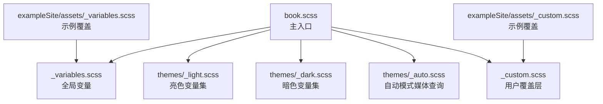
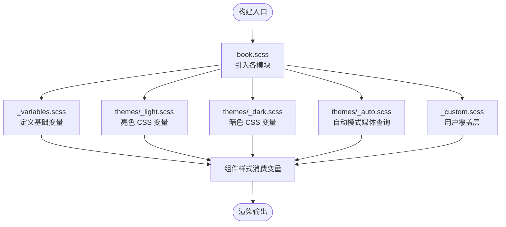
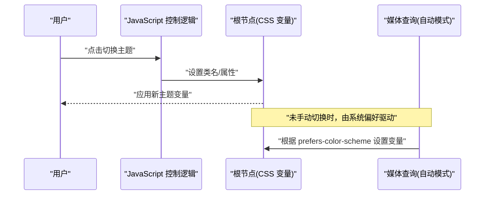
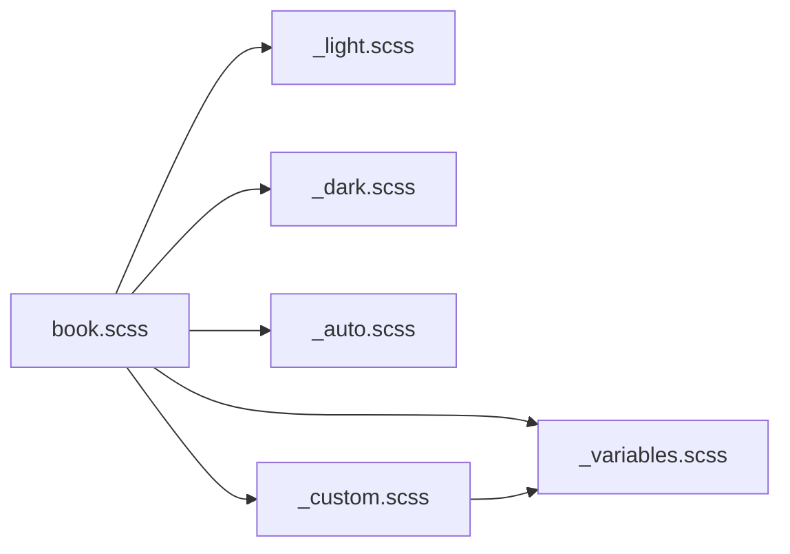

# 颜色主题定制

<cite>
**本文引用的文件**   
- [themes/hugo-book/assets/_variables.scss](file://themes/hugo-book/assets/_variables.scss)
- [themes/hugo-book/assets/themes/_light.scss](file://themes/hugo-book/assets/themes/_light.scss)
- [themes/hugo-book/assets/themes/_dark.scss](file://themes/hugo-book/assets/themes/_dark.scss)
- [themes/hugo-book/assets/themes/_auto.scss](file://themes/hugo-book/assets/themes/_auto.scss)
- [themes/hugo-book/assets/book.scss](file://themes/hugo-book/assets/book.scss)
- [themes/hugo-book/assets/_custom.scss](file://themes/hugo-book/assets/_custom.scss)
- [themes/hugo-book/exampleSite/assets/_variables.scss](file://themes/hugo-book/exampleSite/assets/_variables.scss)
- [themes/hugo-book/exampleSite/assets/_custom.scss](file://themes/hugo-book/exampleSite/assets/_custom.scss)
</cite>

## 目录
1. [简介](#简介)
2. [项目结构](#项目结构)
3. [核心组件](#核心组件)
4. [架构总览](#架构总览)
5. [详细组件分析](#详细组件分析)
6. [依赖关系分析](#依赖关系分析)
7. [性能考虑](#性能考虑)
8. [故障排查指南](#故障排查指南)
9. [结论](#结论)
10. [附录](#附录)

## 简介
本指南面向使用 hugo-book 主题的开发者与内容作者，聚焦“颜色主题定制”。文档将系统解析 SCSS 变量体系、亮/暗模式实现机制（CSS 变量切换、媒体查询与 JavaScript 控制）、配色规范与无障碍对比度建议，并提供可操作的配置路径、实时预览技巧与调试方法。读者无需深入前端背景即可上手完成品牌化主题定制。

## 项目结构
hugo-book 主题的颜色相关资源集中在 assets 目录：
- 变量定义与入口样式
  - _variables.scss：主题色板、字体、间距等全局变量
  - book.scss：主入口，负责引入各模块与主题集
- 主题集（亮/暗/自动）
  - themes/_light.scss：亮色模式 CSS 变量集合
  - themes/_dark.scss：暗色模式 CSS 变量集合
  - themes/_auto.scss：根据系统偏好自动选择亮/暗的媒体查询逻辑
- 自定义覆盖层
  - _custom.scss：推荐用于覆盖默认变量的用户自定义入口
- 示例站点
  - exampleSite/assets/_variables.scss 与 _custom.scss：演示如何覆盖默认变量与样式

图表来源
- [themes/hugo-book/assets/book.scss](file://themes/hugo-book/assets/book.scss)
- [themes/hugo-book/assets/_variables.scss](file://themes/hugo-book/assets/_variables.scss)
- [themes/hugo-book/assets/themes/_light.scss](file://themes/hugo-book/assets/themes/_light.scss)
- [themes/hugo-book/assets/themes/_dark.scss](file://themes/hugo-book/assets/themes/_dark.scss)
- [themes/hugo-book/assets/themes/_auto.scss](file://themes/hugo-book/assets/themes/_auto.scss)
- [themes/hugo-book/assets/_custom.scss](file://themes/hugo-book/assets/_custom.scss)
- [themes/hugo-book/exampleSite/assets/_variables.scss](file://themes/hugo-book/exampleSite/assets/_variables.scss)
- [themes/hugo-book/exampleSite/assets/_custom.scss](file://themes/hugo-book/exampleSite/assets/_custom.scss)

章节来源
- [themes/hugo-book/assets/book.scss](file://themes/hugo-book/assets/book.scss)
- [themes/hugo-book/assets/_variables.scss](file://themes/hugo-book/assets/_variables.scss)
- [themes/hugo-book/assets/themes/_light.scss](file://themes/hugo-book/assets/themes/_light.scss)
- [themes/hugo-book/assets/themes/_dark.scss](file://themes/hugo-book/assets/themes/_dark.scss)
- [themes/hugo-book/assets/themes/_auto.scss](file://themes/hugo-book/assets/themes/_auto.scss)
- [themes/hugo-book/assets/_custom.scss](file://themes/hugo-book/assets/_custom.scss)
- [themes/hugo-book/exampleSite/assets/_variables.scss](file://themes/hugo-book/exampleSite/assets/_variables.scss)
- [themes/hugo-book/exampleSite/assets/_custom.scss](file://themes/hugo-book/exampleSite/assets/_custom.scss)

## 核心组件
- 变量层（_variables.scss）
  - 集中定义主题色板、文本、背景、边框、阴影、圆角、字号、行高、间距等基础变量
  - 命名通常遵循语义化前缀（如颜色、背景、文本、边框、阴影等），便于按用途分组查找
- 主题集（_light.scss / _dark.scss）
  - 以 CSS 变量形式提供亮/暗两套变量值，供页面运行时读取
  - 通过类名或根节点属性切换，实现主题切换
- 自动模式（_auto.scss）
  - 基于 prefers-color-scheme 媒体查询，自动匹配系统亮/暗偏好
- 自定义覆盖（_custom.scss）
  - 推荐在此文件中覆盖变量或追加样式，避免修改主题源码
- 入口（book.scss）
  - 统一引入变量、主题集与自定义层，确保编译顺序正确

章节来源
- [themes/hugo-book/assets/_variables.scss](file://themes/hugo-book/assets/_variables.scss)
- [themes/hugo-book/assets/themes/_light.scss](file://themes/hugo-book/assets/themes/_light.scss)
- [themes/hugo-book/assets/themes/_dark.scss](file://themes/hugo-book/assets/themes/_dark.scss)
- [themes/hugo-book/assets/themes/_auto.scss](file://themes/hugo-book/assets/themes/_auto.scss)
- [themes/hugo-book/assets/_custom.scss](file://themes/hugo-book/assets/_custom.scss)
- [themes/hugo-book/assets/book.scss](file://themes/hugo-book/assets/book.scss)

## 架构总览
下图展示了从入口到变量、主题集与自定义层的加载与覆盖关系。

图表来源
- [themes/hugo-book/assets/book.scss](file://themes/hugo-book/assets/book.scss)
- [themes/hugo-book/assets/_variables.scss](file://themes/hugo-book/assets/_variables.scss)
- [themes/hugo-book/assets/themes/_light.scss](file://themes/hugo-book/assets/themes/_light.scss)
- [themes/hugo-book/assets/themes/_dark.scss](file://themes/hugo-book/assets/themes/_dark.scss)
- [themes/hugo-book/assets/themes/_auto.scss](file://themes/hugo-book/assets/themes/_auto.scss)
- [themes/hugo-book/assets/_custom.scss](file://themes/hugo-book/assets/_custom.scss)

## 详细组件分析

### 变量系统与命名规范
- 变量分层
  - 基础变量：颜色、字体、间距、圆角、阴影等
  - 语义变量：按钮、链接、卡片、导航、代码块等组件级变量
  - 主题变量：亮/暗两套 CSS 变量集合
- 命名约定
  - 采用语义化前缀与层级分隔，例如“颜色-用途-明度”、“背景-区域-状态”等
  - 建议在 _variables.scss 中按功能分区注释，便于维护
- 继承与覆盖
  - 组件样式优先消费语义变量；若需微调，可在 _custom.scss 中覆盖对应变量
  - 主题集通过 CSS 变量在运行时生效，避免重复定义

章节来源
- [themes/hugo-book/assets/_variables.scss](file://themes/hugo-book/assets/_variables.scss)
- [themes/hugo-book/assets/_custom.scss](file://themes/hugo-book/assets/_custom.scss)

### 亮色与暗色模式实现机制
- CSS 变量切换
  - 亮/暗主题分别定义一组 CSS 变量，页面通过根节点类名或属性切换
- 媒体查询自动模式
  - 使用 prefers-color-scheme 媒体查询，自动匹配系统偏好
- JavaScript 控制（可选）
  - 可通过脚本在运行时切换根节点类名或属性，实现手动开关
  - 注意持久化用户选择（如 localStorage）并处理首次加载闪烁

图表来源
- [themes/hugo-book/assets/themes/_light.scss](file://themes/hugo-book/assets/themes/_light.scss)
- [themes/hugo-book/assets/themes/_dark.scss](file://themes/hugo-book/assets/themes/_dark.scss)
- [themes/hugo-book/assets/themes/_auto.scss](file://themes/hugo-book/assets/themes/_auto.scss)

章节来源
- [themes/hugo-book/assets/themes/_light.scss](file://themes/hugo-book/assets/themes/_light.scss)
- [themes/hugo-book/assets/themes/_dark.scss](file://themes/hugo-book/assets/themes/_dark.scss)
- [themes/hugo-book/assets/themes/_auto.scss](file://themes/hugo-book/assets/themes/_auto.scss)

### 自定义主色调、辅助色、背景与文字
- 主色调
  - 在 _variables.scss 中定位主色变量（通常为品牌色、强调色）
  - 如需调整明度/饱和度，建议在同一变量处统一修改，保持全站一致
- 辅助色
  - 定位成功、警告、错误、信息态等语义色变量，按需调整
- 背景与文字
  - 背景色变量通常区分页面、卡片、侧边栏、代码块等区域
  - 文字色变量区分标题、正文、次要信息、禁用态等
- 覆盖策略
  - 在 _custom.scss 中覆盖变量，确保在主题变量之后加载
  - 若需要更细粒度控制，可在组件样式中使用 CSS 变量引用，而非硬编码颜色

章节来源
- [themes/hugo-book/assets/_variables.scss](file://themes/hugo-book/assets/_variables.scss)
- [themes/hugo-book/assets/_custom.scss](file://themes/hugo-book/assets/_custom.scss)

### 渐变色、阴影与透明度
- 渐变色
  - 若主题提供渐变变量，可在 _variables.scss 中调整起止色与方向
  - 若无现成变量，可在 _custom.scss 中为特定组件定义局部渐变
- 阴影
  - 使用阴影变量统一控制卡片、弹窗、悬浮态的投影强度与扩散半径
- 透明度
  - 对遮罩、悬浮态、禁用态等场景使用统一的透明度变量，保证一致性

章节来源
- [themes/hugo-book/assets/_variables.scss](file://themes/hugo-book/assets/_variables.scss)
- [themes/hugo-book/assets/_custom.scss](file://themes/hugo-book/assets/_custom.scss)

### 无障碍访问与对比度优化
- 对比度目标
  - 正文文本与背景的对比度建议达到 WCAG AA 标准（至少 4.5:1）
  - 大文本与图形控件可适当放宽，但仍需保证可读性
- 实践建议
  - 优先使用深色背景+浅色文字或浅色背景+深色文字的成熟组合
  - 避免低对比度的装饰性颜色作为关键信息载体
  - 为交互元素提供清晰的焦点态与悬停态
- 验证工具
  - 使用浏览器控制台或在线对比度检测工具进行校验

[本节为通用指导，不直接分析具体文件]

### 完整配置文件示例（路径与要点）
- 覆盖变量
  - 在站点 assets 下创建 _variables.scss 或 _custom.scss，覆盖主题变量
  - 参考示例站点的覆盖方式，确保加载顺序在主题变量之后
- 示例站点参考
  - exampleSite/assets/_variables.scss：展示如何覆盖默认变量
  - exampleSite/assets/_custom.scss：展示如何在自定义层追加样式

章节来源
- [themes/hugo-book/exampleSite/assets/_variables.scss](file://themes/hugo-book/exampleSite/assets/_variables.scss)
- [themes/hugo-book/exampleSite/assets/_custom.scss](file://themes/hugo-book/exampleSite/assets/_custom.scss)

### 实时预览与调试技巧
- 本地开发
  - 使用 Hugo 服务器增量构建，快速查看 SCSS 变更效果
- 浏览器调试
  - 在 Elements 面板检查根节点的 CSS 变量，确认是否被覆盖
  - 使用计算样式查看最终颜色值，定位冲突来源
- 常见问题
  - 变量未被覆盖：检查 _custom.scss 是否在主题变量之后加载
  - 主题切换无效：检查根节点类名/属性是否正确设置
  - 自动模式异常：检查 prefers-color-scheme 媒体查询是否生效

[本节为通用指导，不直接分析具体文件]

## 依赖关系分析
- 入口依赖
  - book.scss 依次引入变量、主题集与自定义层，确保覆盖顺序正确
- 主题集依赖
  - _light.scss 与 _dark.scss 提供互斥的 CSS 变量集合
  - _auto.scss 通过媒体查询决定使用哪一套变量
- 自定义层依赖
  - _custom.scss 依赖 _variables.scss 中的变量，进行覆盖或扩展

图表来源
- [themes/hugo-book/assets/book.scss](file://themes/hugo-book/assets/book.scss)
- [themes/hugo-book/assets/_variables.scss](file://themes/hugo-book/assets/_variables.scss)
- [themes/hugo-book/assets/themes/_light.scss](file://themes/hugo-book/assets/themes/_light.scss)
- [themes/hugo-book/assets/themes/_dark.scss](file://themes/hugo-book/assets/themes/_dark.scss)
- [themes/hugo-book/assets/themes/_auto.scss](file://themes/hugo-book/assets/themes/_auto.scss)
- [themes/hugo-book/assets/_custom.scss](file://themes/hugo-book/assets/_custom.scss)

章节来源
- [themes/hugo-book/assets/book.scss](file://themes/hugo-book/assets/book.scss)
- [themes/hugo-book/assets/_variables.scss](file://themes/hugo-book/assets/_variables.scss)
- [themes/hugo-book/assets/themes/_light.scss](file://themes/hugo-book/assets/themes/_light.scss)
- [themes/hugo-book/assets/themes/_dark.scss](file://themes/hugo-book/assets/themes/_dark.scss)
- [themes/hugo-book/assets/themes/_auto.scss](file://themes/hugo-book/assets/themes/_auto.scss)
- [themes/hugo-book/assets/_custom.scss](file://themes/hugo-book/assets/_custom.scss)

## 性能考虑
- 变量复用
  - 尽量通过 CSS 变量减少重复声明，降低样式体积
- 媒体查询
  - 合理使用 prefers-color-scheme，避免不必要的 JS 干预
- 构建缓存
  - 利用 Hugo 增量构建与浏览器缓存，提升迭代效率

[本节为通用指导，不直接分析具体文件]

## 故障排查指南
- 变量未生效
  - 检查 _custom.scss 的加载顺序是否在主题变量之后
  - 确认变量名与层级是否与主题一致
- 主题切换无效
  - 检查根节点类名/属性是否正确设置
  - 确认 _light.scss 与 _dark.scss 的变量是否被正确应用
- 自动模式异常
  - 检查浏览器是否支持 prefers-color-scheme
  - 确认 _auto.scss 的媒体查询优先级是否足够

章节来源
- [themes/hugo-book/assets/_custom.scss](file://themes/hugo-book/assets/_custom.scss)
- [themes/hugo-book/assets/themes/_light.scss](file://themes/hugo-book/assets/themes/_light.scss)
- [themes/hugo-book/assets/themes/_dark.scss](file://themes/hugo-book/assets/themes/_dark.scss)
- [themes/hugo-book/assets/themes/_auto.scss](file://themes/hugo-book/assets/themes/_auto.scss)

## 结论
通过理解 hugo-book 的变量体系与主题集机制，开发者可以高效完成品牌化主题定制。建议始终在 _custom.scss 中进行覆盖，保持主题升级的可维护性；同时关注对比度与无障碍体验，确保在不同设备与系统偏好下的可读性与可用性。

[本节为总结性内容，不直接分析具体文件]

## 附录
- 常用操作清单
  - 在主色调变量处统一调整品牌色
  - 在 _custom.scss 中覆盖组件级变量
  - 使用浏览器 DevTools 检查 CSS 变量与计算样式
  - 借助示例站点覆盖方式作为模板
- 参考路径
  - 变量定义入口：_variables.scss
  - 主题集：_light.scss、_dark.scss、_auto.scss
  - 自定义层：_custom.scss
  - 示例覆盖：exampleSite/assets/_variables.scss、exampleSite/assets/_custom.scss

章节来源
- [themes/hugo-book/assets/_variables.scss](file://themes/hugo-book/assets/_variables.scss)
- [themes/hugo-book/assets/themes/_light.scss](file://themes/hugo-book/assets/themes/_light.scss)
- [themes/hugo-book/assets/themes/_dark.scss](file://themes/hugo-book/assets/themes/_dark.scss)
- [themes/hugo-book/assets/themes/_auto.scss](file://themes/hugo-book/assets/themes/_auto.scss)
- [themes/hugo-book/assets/_custom.scss](file://themes/hugo-book/assets/_custom.scss)
- [themes/hugo-book/exampleSite/assets/_variables.scss](file://themes/hugo-book/exampleSite/assets/_variables.scss)
- [themes/hugo-book/exampleSite/assets/_custom.scss](file://themes/hugo-book/exampleSite/assets/_custom.scss)