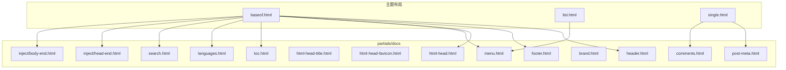
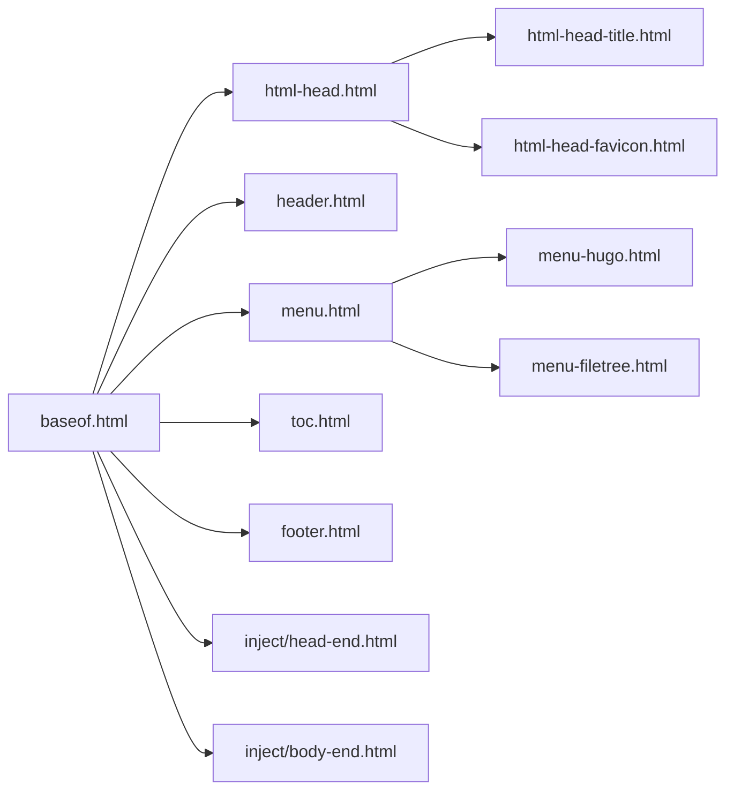

# Partials部分模板扩展

<cite>
**本文引用的文件**   
- [layouts/_default/baseof.html](file://themes/hugo-book/layouts/_default/baseof.html)
- [layouts/partials/docs/header.html](file://themes/hugo-book/layouts/partials/docs/header.html)
- [layouts/partials/docs/footer.html](file://themes/hugo-book/layouts/partials/docs/footer.html)
- [layouts/partials/docs/menu.html](file://themes/hugo-book/layouts/partials/docs/menu.html)
- [layouts/partials/docs/toc.html](file://themes/hugo-book/layouts/partials/docs/toc.html)
- [layouts/partials/docs/html-head.html](file://themes/hugo-book/layouts/partials/docs/html-head.html)
- [layouts/partials/docs/html-head-title.html](file://themes/hugo-book/layouts/partials/docs/html-head-title.html)
- [layouts/partials/docs/html-head-favicon.html](file://themes/hugo-book/layouts/partials/docs/html-head-favicon.html)
- [layouts/partials/docs/languages.html](file://themes/hugo-book/layouts/partials/docs/languages.html)
- [layouts/partials/docs/post-meta.html](file://themes/hugo-book/layouts/partials/docs/post-meta.html)
- [layouts/partials/docs/search.html](file://themes/hugo-book/layouts/partials/docs/search.html)
- [layouts/partials/docs/brand.html](file://themes/hugo-book/layouts/partials/docs/brand.html)
- [layouts/partials/docs/comments.html](file://themes/hugo-book/layouts/partials/docs/comments.html)
- [layouts/partials/docs/menu-hugo.html](file://themes/hugo-book/layouts/partials/docs/menu-hugo.html)
- [layouts/partials/docs/menu-filetree.html](file://themes/hugo-book/layouts/partials/docs/menu-file树.html)
- [layouts/partials/docs/inject/head-end.html](file://themes/hugo-book/layouts/partials/docs/inject/head-end.html)
- [layouts/partials/docs/inject/body-end.html](file://themes/hugo-book/layouts/partials/docs/inject/body-end.html)
- [layouts/_default/list.html](file://themes/hugo-book/layouts/_default/list.html)
- [layouts/_default/single.html](file://themes/hugo-book/layouts/_default/single.html)
- [config.yaml](file://config.yaml)
- [hugo.toml](file://hugo.toml)
</cite>

## 目录
1. [简介](#简介)
2. [项目结构](#项目结构)
3. [核心组件](#核心组件)
4. [架构总览](#架构总览)
5. [详细组件分析](#详细组件分析)
6. [依赖关系分析](#依赖关系分析)
7. [性能考虑](#性能考虑)
8. [故障排查指南](#故障排查指南)
9. [结论](#结论)
10. [附录](#附录)

## 简介
本文件聚焦于Hugo主题中的Partials（部分模板）系统，结合当前仓库中hugo-book主题的partials实现，系统性说明如何创建可复用的部分模板、如何进行参数传递与条件渲染、如何在不同页面复用相同代码片段，以及如何组织partials的结构与命名规范。文档同时给出与主模板的集成方式与性能优化建议，帮助开发者构建模块化、可维护的模板系统。

## 项目结构
本项目基于hugo-book主题，其partials主要位于主题布局目录下的partials/docs目录中，按功能模块划分：
- 页面头部与尾部：header.html、footer.html
- 导航菜单：menu.html、menu-hugo.html、menu-filetree.html
- 标题与元信息：html-head-title.html、post-meta.html
- 资源注入：html-head.html、html-head-favicon.html
- 多语言与搜索：languages.html、search.html
- 内容辅助：toc.html、brand.html、comments.html
- 注入点：inject/* 用于在head或body末尾插入自定义逻辑



图表来源
- [layouts/_default/baseof.html](file://themes/hugo-book/layouts/_default/baseof.html)
- [layouts/partials/docs/header.html](file://themes/hugo-book/layouts/partials/docs/header.html)
- [layouts/partials/docs/footer.html](file://themes/hugo-book/layouts/partials/docs/footer.html)
- [layouts/partials/docs/menu.html](file://themes/hugo-book/layouts/partials/docs/menu.html)
- [layouts/partials/docs/toc.html](file://themes/hugo-book/layouts/partials/docs/toc.html)
- [layouts/partials/docs/html-head.html](file://themes/hugo-book/layouts/partials/docs/html-head.html)
- [layouts/partials/docs/html-head-title.html](file://themes/hugo-book/layouts/partials/docs/html-head-title.html)
- [layouts/partials/docs/html-head-favicon.html](file://themes/hugo-book/layouts/partials/docs/html-head-favicon.html)
- [layouts/partials/docs/languages.html](file://themes/hugo-book/layouts/partials/docs/languages.html)
- [layouts/partials/docs/post-meta.html](file://themes/hugo-book/layouts/partials/docs/post-meta.html)
- [layouts/partials/docs/search.html](file://themes/hugo-book/layouts/partials/docs/search.html)
- [layouts/partials/docs/brand.html](file://themes/hugo-book/layouts/partials/docs/brand.html)
- [layouts/partials/docs/comments.html](file://themes/hugo-book/layouts/partials/docs/comments.html)
- [layouts/partials/docs/inject/head-end.html](file://themes/hugo-book/layouts/partials/docs/inject/head-end.html)
- [layouts/partials/docs/inject/body-end.html](file://themes/hugo-book/layouts/partials/docs/inject/body-end.html)
- [layouts/_default/list.html](file://themes/hugo-book/layouts/_default/list.html)
- [layouts/_default/single.html](file://themes/hugo-book/layouts/_default/single.html)

章节来源
- [layouts/_default/baseof.html](file://themes/hugo-book/layouts/_default/baseof.html)
- [layouts/_default/list.html](file://themes/hugo-book/layouts/_default/list.html)
- [layouts/_default/single.html](file://themes/hugo-book/layouts/_default/single.html)

## 核心组件
- 基础模板baseof.html：定义页面骨架，组合各partials，提供块级插槽供子模板覆盖。
- 头部partial header.html：包含品牌标识、搜索入口、语言切换等通用头部元素。
- 尾部partial footer.html：版权、链接、脚本注入等通用尾部元素。
- 导航partial menu.html：聚合菜单项，内部可调用menu-hugo.html与menu-filetree.html。
- 目录partial toc.html：根据页面内容生成目录。
- 头信息partial html-head.html：统一注入CSS/JS、favicon、title等。
- 标题partial html-head-title.html：处理页面标题拼接与SEO友好输出。
- 元信息partial post-meta.html：文章发布日期、分类、标签等元数据展示。
- 搜索partial search.html：集成前端搜索能力。
- 多语言partial languages.html：根据配置渲染语言选择器。
- 注入点inject/*：允许在head或body末尾安全插入第三方脚本或自定义逻辑。

章节来源
- [layouts/partials/docs/header.html](file://themes/hugo-book/layouts/partials/docs/header.html)
- [layouts/partials/docs/footer.html](file://themes/hugo-book/layouts/partials/docs/footer.html)
- [layouts/partials/docs/menu.html](file://themes/hugo-book/layouts/partials/docs/menu.html)
- [layouts/partials/docs/toc.html](file://themes/hugo-book/layouts/partials/docs/toc.html)
- [layouts/partials/docs/html-head.html](file://themes/hugo-book/layouts/partials/docs/html-head.html)
- [layouts/partials/docs/html-head-title.html](file://themes/hugo-book/layouts/partials/docs/html-head-title.html)
- [layouts/partials/docs/post-meta.html](file://themes/hugo-book/layouts/partials/docs/post-meta.html)
- [layouts/partials/docs/search.html](file://themes/hugo-book/layouts/partials/docs/search.html)
- [layouts/partials/docs/languages.html](file://themes/hugo-book/layouts/partials/docs/languages.html)
- [layouts/partials/docs/inject/head-end.html](file://themes/hugo-book/layouts/partials/docs/inject/head-end.html)
- [layouts/partials/docs/inject/body-end.html](file://themes/hugo-book/layouts/partials/docs/inject/body-end.html)

## 架构总览
下图展示了partials在主模板中的装配流程与数据流向，包括从配置到页面渲染的关键路径。

```mermaid
sequenceDiagram
participant User as "用户浏览器"
participant Hugo as "Hugo构建器"
participant Base as "baseof.html"
participant Head as "html-head.html"
participant Title as "html-head-title.html"
participant Header as "header.html"
participant Menu as "menu.html"
participant Toc as "toc.html"
participant Footer as "footer.html"
participant InjectHead as "inject/head-end.html"
participant InjectBody as "inject/body-end.html"
User->>Hugo : 请求页面
Hugo->>Base : 解析基础模板
Base->>Head : 渲染头部资源
Head->>Title : 获取页面标题
Title-->>Head : 返回标题字符串
Head-->>Base : 完成head段
Base->>Header : 渲染头部UI
Base->>Menu : 渲染导航菜单
Base->>Toc : 渲染目录(单页)
Base->>Footer : 渲染尾部UI
Base->>InjectHead : 注入head末尾逻辑
Base->>InjectBody : 注入body末尾逻辑
Base-->>User : 返回完整HTML
```

图表来源
- [layouts/_default/baseof.html](file://themes/hugo-book/layouts/_default/baseof.html)
- [layouts/partials/docs/html-head.html](file://themes/hugo-book/layouts/partials/docs/html-head.html)
- [layouts/partials/docs/html-head-title.html](file://themes/hugo-book/layouts/partials/docs/html-head-title.html)
- [layouts/partials/docs/header.html](file://themes/hugo-book/layouts/partials/docs/header.html)
- [layouts/partials/docs/menu.html](file://themes/hugo-book/layouts/partials/docs/menu.html)
- [layouts/partials/docs/toc.html](file://themes/hugo-book/layouts/partials/docs/toc.html)
- [layouts/partials/docs/footer.html](file://themes/hugo-book/layouts/partials/docs/footer.html)
- [layouts/partials/docs/inject/head-end.html](file://themes/hugo-book/layouts/partials/docs/inject/head-end.html)
- [layouts/partials/docs/inject/body-end.html](file://themes/hugo-book/layouts/partials/docs/inject/body-end.html)

## 详细组件分析

### 头部与尾部组件
- 头部组件负责品牌展示、搜索入口、语言切换等；尾部组件负责版权信息与必要的脚本加载。
- 通过partials将重复的UI逻辑抽离，便于统一修改与局部定制。

章节来源
- [layouts/partials/docs/header.html](file://themes/hugo-book/layouts/partials/docs/header.html)
- [layouts/partials/docs/footer.html](file://themes/hugo-book/layouts/partials/docs/footer.html)

### 导航菜单组件
- menu.html作为菜单容器，内部可组合menu-hugo.html（基于Hugo站点结构）与menu-filetree.html（基于文件系统）。
- 支持多级菜单与动态展开，适合文档站点的侧边栏导航。

章节来源
- [layouts/partials/docs/menu.html](file://themes/hugo-book/layouts/partials/docs/menu.html)
- [layouts/partials/docs/menu-hugo.html](file://themes/hugo-book/layouts/partials/docs/menu-hugo.html)
- [layouts/partials/docs/menu-filetree.html](file://themes/hugo-book/layouts/partials/docs/menu-filetree.html)

### 目录与元信息组件
- toc.html根据页面内容自动生成目录，提升长文阅读体验。
- post-meta.html集中展示文章的发布时间、分类、标签等元信息，保持列表与详情页的一致性。

章节来源
- [layouts/partials/docs/toc.html](file://themes/hugo-book/layouts/partials/docs/toc.html)
- [layouts/partials/docs/post-meta.html](file://themes/hugo-book/layouts/partials/docs/post-meta.html)

### 资源注入与标题组件
- html-head.html统一管理CSS/JS引入与资源版本控制。
- html-head-title.html负责标题拼接与SEO友好输出。
- html-head-favicon.html管理网站图标。

章节来源
- [layouts/partials/docs/html-head.html](file://themes/hugo-book/layouts/partials/docs/html-head.html)
- [layouts/partials/docs/html-head-title.html](file://themes/hugo-book/layouts/partials/docs/html-head-title.html)
- [layouts/partials/docs/html-head-favicon.html](file://themes/hugo-book/layouts/partials/docs/html-head-favicon.html)

### 多语言与搜索组件
- languages.html根据i18n配置渲染语言选择器。
- search.html集成前端搜索库，提供站内检索能力。

章节来源
- [layouts/partials/docs/languages.html](file://themes/hugo-book/layouts/partials/docs/languages.html)
- [layouts/partials/docs/search.html](file://themes/hugo-book/layouts/partials/docs/search.html)

### 注入点机制
- inject/head-end.html与inject/body-end.html提供安全的注入位置，避免直接修改主题源码。
- 推荐在此处添加第三方统计、广告、自定义脚本等。

章节来源
- [layouts/partials/docs/inject/head-end.html](file://themes/hugo-book/layouts/partials/docs/inject/head-end.html)
- [layouts/partials/docs/inject/body-end.html](file://themes/hugo-book/layouts/partials/docs/inject/body-end.html)

### 与主模板的集成
- baseof.html作为所有页面的基础模板，组合上述partials并定义可覆盖的块。
- list.html与single.html分别对应列表页与单页，按需引入特定partials（如toc、post-meta、comments）。

章节来源
- [layouts/_default/baseof.html](file://themes/hugo-book/layouts/_default/baseof.html)
- [layouts/_default/list.html](file://themes/hugo-book/layouts/_default/list.html)
- [layouts/_default/single.html](file://themes/hugo-book/layouts/_default/single.html)

## 依赖关系分析
partials之间的依赖关系清晰，遵循“低耦合、高内聚”原则：
- baseof.html依赖多个UI与资源partials。
- menu.html可能依赖menu-hugo.html与menu-filetree.html。
- html-head.html依赖html-head-title.html与html-head-favicon.html。
- inject/*为外部注入点，不反向依赖其他partials。



图表来源
- [layouts/_default/baseof.html](file://themes/hugo-book/layouts/_default/baseof.html)
- [layouts/partials/docs/html-head.html](file://themes/hugo-book/layouts/partials/docs/html-head.html)
- [layouts/partials/docs/html-head-title.html](file://themes/hugo-book/layouts/partials/docs/html-head-title.html)
- [layouts/partials/docs/html-head-favicon.html](file://themes/hugo-book/layouts/partials/docs/html-head-favicon.html)
- [layouts/partials/docs/header.html](file://themes/hugo-book/layouts/partials/docs/header.html)
- [layouts/partials/docs/menu.html](file://themes/hugo-book/layouts/partials/docs/menu.html)
- [layouts/partials/docs/menu-hugo.html](file://themes/hugo-book/layouts/partials/docs/menu-hugo.html)
- [layouts/partials/docs/menu-filetree.html](file://themes/hugo-book/layouts/partials/docs/menu-filetree.html)
- [layouts/partials/docs/toc.html](file://themes/hugo-book/layouts/partials/docs/toc.html)
- [layouts/partials/docs/footer.html](file://themes/hugo-book/layouts/partials/docs/footer.html)
- [layouts/partials/docs/inject/head-end.html](file://themes/hugo-book/layouts/partials/docs/inject/head-end.html)
- [layouts/partials/docs/inject/body-end.html](file://themes/hugo-book/layouts/partials/docs/inject/body-end.html)

## 性能考虑
- 减少不必要的partials嵌套层级，避免过多include导致渲染开销增加。
- 使用缓存友好的资源路径与版本号，确保浏览器缓存命中。
- 仅在需要的页面引入大型脚本（如search），避免全局加载。
- 利用inject/*进行第三方脚本延迟加载，降低首屏阻塞。
- 对复杂循环与条件判断进行简化，必要时在数据层预处理。

[本节为通用指导，无需引用具体文件]

## 故障排查指南
- 若页面缺少头部或尾部，检查baseof.html是否正确组合了header.html与footer.html。
- 若导航菜单未显示，确认menu.html是否被正确引入，以及menu-hugo.html/menu-filetree.html是否存在。
- 若标题不正确，检查html-head-title.html的拼接逻辑与页面上下文变量。
- 若第三方脚本未生效，确认inject/head-end.html或inject/body-end.html是否被调用。
- 若多语言切换无效，检查languages.html与i18n配置。

章节来源
- [layouts/_default/baseof.html](file://themes/hugo-book/layouts/_default/baseof.html)
- [layouts/partials/docs/header.html](file://themes/hugo-book/layouts/partials/docs/header.html)
- [layouts/partials/docs/footer.html](file://themes/hugo-book/layouts/partials/docs/footer.html)
- [layouts/partials/docs/menu.html](file://themes/hugo-book/layouts/partials/docs/menu.html)
- [layouts/partials/docs/html-head-title.html](file://themes/hugo-book/layouts/partials/docs/html-head-title.html)
- [layouts/partials/docs/inject/head-end.html](file://themes/hugo-book/layouts/partials/docs/inject/head-end.html)
- [layouts/partials/docs/inject/body-end.html](file://themes/hugo-book/layouts/partials/docs/inject/body-end.html)
- [layouts/partials/docs/languages.html](file://themes/hugo-book/layouts/partials/docs/languages.html)

## 结论
通过将常用UI与逻辑拆分为partials，并结合baseof.html的统一装配，可以显著提升模板的可维护性与复用性。配合inject/*注入点与合理的资源管理策略，能够在不侵入主题源码的前提下实现灵活定制与性能优化。

[本节为总结性内容，无需引用具体文件]

## 附录

### Partials参数传递与高级特性
- 参数传递：在调用partial时可通过位置参数或命名参数传递上下文数据，便于在不同页面复用同一partial并适配不同场景。
- 条件渲染：使用条件语句根据页面属性（如是否为首页、是否启用评论）控制渲染分支。
- 循环处理：遍历集合数据（如菜单项、标签列表）生成DOM节点，注意控制循环深度与复杂度。
- 模板继承：通过block与define在baseof.html中定义可覆盖区域，子模板按需重写。

[本节为概念性说明，无需引用具体文件]

### 组织结构与命名规范最佳实践
- 按功能模块分类：将partials按职责划分至独立文件（如header、footer、menu、toc等），便于定位与维护。
- 命名一致性：使用小写加连字符的命名风格，保持可读性与跨平台兼容。
- 注入优先：尽量通过inject/*注入第三方逻辑，避免直接修改主题源码。
- 配置驱动：将可变行为（如是否启用搜索、评论）置于配置文件，由partials读取并控制渲染。

章节来源
- [config.yaml](file://config.yaml)
- [hugo.toml](file://hugo.toml)