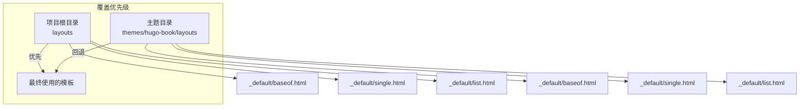
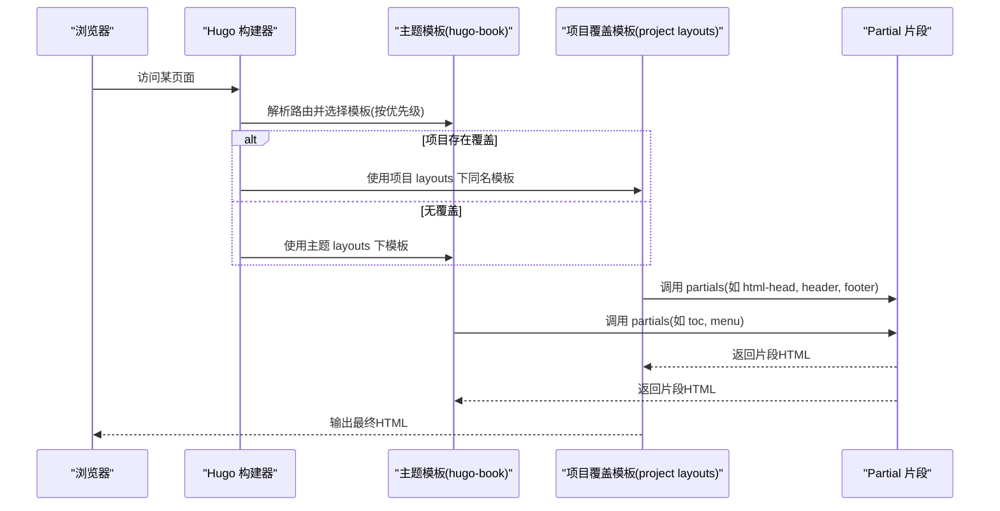
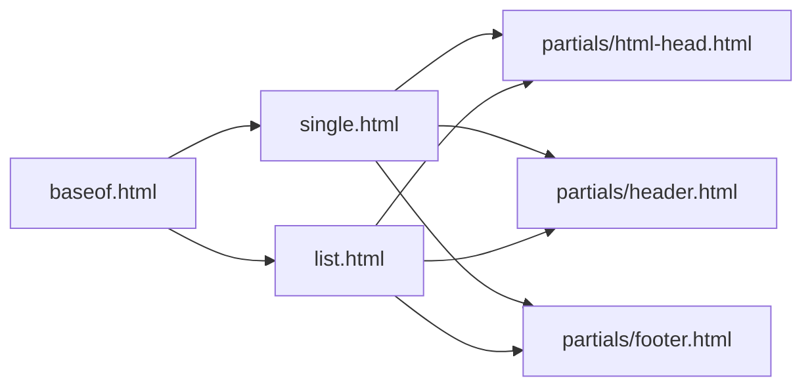

# 布局模板覆盖

<cite>
**本文引用的文件**   
- [hugo.toml](file://hugo.toml)
- [config.yaml](file://config.yaml)
- [layouts/_default/baseof.html](file://layouts/_default/baseof.html)
- [layouts/_default/single.html](file://layouts/_default/single.html)
- [layouts/_default/list.html](file://layouts/_default/list.html)
- [themes/hugo-book/layouts/_default/baseof.html](file://themes/hugo-book/layouts/_default/baseof.html)
- [themes/hugo-book/layouts/_default/single.html](file://themes/hugo-book/layouts/_default/single.html)
- [themes/hugo-book/layouts/_default/list.html](file://themes/hugo-book/layouts/_default/list.html)
- [themes/hugo-book/layouts/partials/docs/html-head.html](file://themes/hugo-book/layouts/partials/docs/html-head.html)
- [themes/hugo-book/layouts/partials/docs/header.html](file://themes/hugo-book/layouts/partials/docs/header.html)
- [themes/hugo-book/layouts/partials/docs/footer.html](file://themes/hugo-book/layouts/partials/docs/footer.html)
</cite>

## 目录
1. [简介](#简介)
2. [项目结构](#项目结构)
3. [核心组件](#核心组件)
4. [架构总览](#架构总览)
5. [详细组件分析](#详细组件分析)
6. [依赖分析](#依赖分析)
7. [性能考虑](#性能考虑)
8. [故障排查指南](#故障排查指南)
9. [结论](#结论)
10. [附录](#附录)

## 简介
本文件面向使用 Hugo 的开发者，系统讲解“布局模板覆盖”机制：如何通过项目根目录下的 layouts 文件夹结构，覆盖默认主题（本仓库为 hugo-book）提供的布局模板；并深入说明 baseof.html、single.html、list.html 等基础模板的职责与覆盖方式，解释模板继承与嵌套（define/block）、partials 注入点的使用，以及常见自定义场景（修改页面结构、添加自定义元素、调整 CSS 类名等）。文末提供调试技巧与最佳实践，帮助高效完成布局定制。

## 项目结构
Hugo 在渲染时优先查找项目根目录下的 layouts 中的模板；若未找到，则回退到主题目录 themes/<theme>/layouts 中同名模板。因此，只需在项目中创建与主题一致的相对路径，即可实现“覆盖”。

图示来源
- [hugo.toml](file://hugo.toml)
- [config.yaml](file://config.yaml)
- [layouts/_default/baseof.html](file://layouts/_default/baseof.html)
- [themes/hugo-book/layouts/_default/baseof.html](file://themes/hugo-book/layouts/_default/baseof.html)

章节来源
- [hugo.toml](file://hugo.toml)
- [config.yaml](file://config.yaml)

## 核心组件
- baseof.html：站点级基础模板，定义 HTML 骨架、头部/尾部注入点、全局脚本与样式加载位置。子模板通过 block/define 填充具体区域。
- single.html：单页内容模板（文章、文档等），负责渲染正文、侧边栏、目录、元信息等。
- list.html：列表页模板（首页、分类、标签、归档等），负责渲染条目集合与分页。
- partials：可复用片段，如 html-head、header、footer、toc、menu 等，便于局部替换与组合。

章节来源
- [themes/hugo-book/layouts/_default/baseof.html](file://themes/hugo-book/layouts/_default/baseof.html)
- [themes/hugo-book/layouts/_default/single.html](file://themes/hugo-book/layouts/_default/single.html)
- [themes/hugo-book/layouts/_default/list.html](file://themes/hugo-book/layouts/_default/list.html)
- [themes/hugo-book/layouts/partials/docs/html-head.html](file://themes/hugo-book/layouts/partials/docs/html-head.html)
- [themes/hugo-book/layouts/partials/docs/header.html](file://themes/hugo-book/layouts/partials/docs/header.html)
- [themes/hugo-book/layouts/partials/docs/footer.html](file://themes/hugo-book/layouts/partials/docs/footer.html)

## 架构总览
下图展示从请求到最终输出的关键流程，以及模板覆盖与部分片段的参与方式。

图示来源
- [themes/hugo-book/layouts/_default/baseof.html](file://themes/hugo-book/layouts/_default/baseof.html)
- [themes/hugo-book/layouts/_default/single.html](file://themes/hugo-book/layouts/_default/single.html)
- [themes/hugo-book/layouts/_default/list.html](file://themes/hugo-book/layouts/_default/list.html)
- [themes/hugo-book/layouts/partials/docs/html-head.html](file://themes/hugo-book/layouts/partials/docs/html-head.html)
- [themes/hugo-book/layouts/partials/docs/header.html](file://themes/hugo-book/layouts/partials/docs/header.html)
- [themes/hugo-book/layouts/partials/docs/footer.html](file://themes/hugo-book/layouts/partials/docs/footer.html)

## 详细组件分析

### 基础模板 baseof.html 覆盖
- 职责：定义 <html>/<head>/<body> 骨架，声明可被子模板填充的块（block/define），并在合适位置引入主题样式、脚本与第三方资源。
- 覆盖要点：
  - 复制主题的 baseof.html 到项目 layouts/_default/baseof.html。
  - 保留所有 block/define 名称不变，仅替换内部实现或新增注入点。
  - 如需插入自定义 CSS/JS，建议在 head/body 末尾追加，避免破坏主题原有顺序。
- 典型变更：
  - 增加站点统计代码、自定义 meta、字体预加载等。
  - 调整 body 根容器类名以适配新样式体系。

章节来源
- [themes/hugo-book/layouts/_default/baseof.html](file://themes/hugo-book/layouts/_default/baseof.html)
- [layouts/_default/baseof.html](file://layouts/_default/baseof.html)

### 单页模板 single.html 覆盖
- 职责：渲染单个内容项（文章/文档），包括标题、元信息、正文、目录、评论、相关文章等。
- 覆盖要点：
  - 复制主题 single.html 到项目 layouts/_default/single.html。
  - 保持对 baseof 的继承关系（通常通过 extend 或 include 基模板）。
  - 按需调整正文容器、侧边栏、目录显示逻辑。
- 常见扩展：
  - 在正文前后插入广告、打赏、版权提示。
  - 根据 front matter 字段控制是否显示目录、评论、分享按钮等。

章节来源
- [themes/hugo-book/layouts/_default/single.html](file://themes/hugo-book/layouts/_default/single.html)
- [layouts/_default/single.html](file://layouts/_default/single.html)

### 列表模板 list.html 覆盖
- 职责：渲染列表型页面（首页、分类、标签、归档等），循环输出条目卡片、分页导航等。
- 覆盖要点：
  - 复制主题 list.html 到项目 layouts/_default/list.html。
  - 保持与 baseof 的继承关系。
  - 根据 .Type/.Kind 区分不同列表类型，分别定制布局。
- 常见扩展：
  - 切换列表视图（网格/列表）、增加摘要长度控制、自定义排序与过滤。

章节来源
- [themes/hugo-book/layouts/_default/list.html](file://themes/hugo-book/layouts/_default/list.html)
- [layouts/_default/list.html](file://layouts/_default/list.html)

### 模板继承与片段机制（define/block 与 partials）
- define/block：用于在基模板中声明“插槽”，子模板用同名块进行填充。确保块名一致是继承生效的关键。
- partials：将通用 UI 片段抽离为独立文件，通过 partial 函数复用。主题常用 partials 包括：
  - html-head：注入 <head> 内容（SEO、统计、CSS/JS 引入）。
  - header/footer：站点头尾区域。
  - toc/menu/taxonomy：目录、菜单、分类等。
- 覆盖策略：
  - 优先覆盖 partials 而非重写整页，减少重复与维护成本。
  - 在覆盖模板中直接调用同名 partial，即可无缝替换行为。

章节来源
- [themes/hugo-book/layouts/partials/docs/html-head.html](file://themes/hugo-book/layouts/partials/docs/html-head.html)
- [themes/hugo-book/layouts/partials/docs/header.html](file://themes/hugo-book/layouts/partials/docs/header.html)
- [themes/hugo-book/layouts/partials/docs/footer.html](file://themes/hugo-book/layouts/partials/docs/footer.html)

### 覆盖示例与实践清单
- 修改页面结构
  - 在 baseof.html 中调整根容器类名，或在 single/list 中重构主内容区与侧边栏比例。
- 添加自定义元素
  - 在 html-head partial 中添加统计脚本、favicon、预连接等。
  - 在 header/footer partial 中添加公告横幅、底部链接等。
- 调整 CSS 类名
  - 在覆盖模板中为关键节点更换 class，并通过 assets 中的 SCSS/CSS 适配新样式。
- 条件渲染
  - 基于 front matter 字段（如 show_toc、show_comments）控制目录、评论等模块显隐。
- 多语言与 SEO
  - 在 html-head 中完善 lang、canonical、open graph 等元数据。

[本节为概念性指导，不直接分析具体文件]

## 依赖分析
- 模板间依赖
  - single/list 均依赖 baseof 作为骨架。
  - 各模板广泛依赖 partials（html-head、header、footer、toc、menu 等）。
- 主题与项目依赖
  - 项目 layouts 优先于主题 layouts，形成“覆盖链”。
  - 若项目未覆盖某模板，Hugo 自动回退至主题对应模板。

图示来源
- [themes/hugo-book/layouts/_default/baseof.html](file://themes/hugo-book/layouts/_default/baseof.html)
- [themes/hugo-book/layouts/_default/single.html](file://themes/hugo-book/layouts/_default/single.html)
- [themes/hugo-book/layouts/_default/list.html](file://themes/hugo-book/layouts/_default/list.html)
- [themes/hugo-book/layouts/partials/docs/html-head.html](file://themes/hugo-book/layouts/partials/docs/html-head.html)
- [themes/hugo-book/layouts/partials/docs/header.html](file://themes/hugo-book/layouts/partials/docs/header.html)
- [themes/hugo-book/layouts/partials/docs/footer.html](file://themes/hugo-book/layouts/partials/docs/footer.html)

章节来源
- [themes/hugo-book/layouts/_default/baseof.html](file://themes/hugo-book/layouts/_default/baseof.html)
- [themes/hugo-book/layouts/_default/single.html](file://themes/hugo-book/layouts/_default/single.html)
- [themes/hugo-book/layouts/_default/list.html](file://themes/hugo-book/layouts/_default/list.html)
- [themes/hugo-book/layouts/partials/docs/html-head.html](file://themes/hugo-book/layouts/partials/docs/html-head.html)
- [themes/hugo-book/layouts/partials/docs/header.html](file://themes/hugo-book/layouts/partials/docs/header.html)
- [themes/hugo-book/layouts/partials/docs/footer.html](file://themes/hugo-book/layouts/partials/docs/footer.html)

## 性能考虑
- 最小化覆盖范围：优先覆盖 partials，避免整页重写，降低维护成本与渲染差异风险。
- 资源加载优化：仅在必要页面引入重型脚本；利用 defer/async 控制加载时机。
- 缓存友好：静态资源加指纹（Hugo 已处理），避免频繁改动文件名导致缓存失效。
- 模板复杂度：减少不必要的条件分支与循环，提升构建速度。

[本节为通用建议，不直接分析具体文件]

## 故障排查指南
- 覆盖未生效
  - 检查项目 layouts 路径是否与主题一致（例如 _default/baseof.html）。
  - 确认 Hugo 配置的主题名称正确（hugo.toml/config.yaml）。
- 样式错乱
  - 检查是否在覆盖模板中删除了必要的容器或类名。
  - 对比主题原始模板，逐步恢复缺失结构定位问题。
- 脚本未执行
  - 确认脚本引入位置与加载属性（defer/async）是否符合预期。
  - 查看浏览器控制台是否有报错。
- 构建缓慢
  - 评估是否引入了过多复杂逻辑或外部资源。
  - 使用增量构建与并行构建选项加速开发体验。

章节来源
- [hugo.toml](file://hugo.toml)
- [config.yaml](file://config.yaml)

## 结论
通过理解 Hugo 的模板覆盖机制与主题模板职责划分，开发者可以以最小代价实现高度定制的页面结构与交互。推荐遵循“优先覆盖 partials、保持块名一致、谨慎修改容器结构”的原则，结合调试技巧快速定位问题，从而稳定地交付高质量的站点外观与体验。

[本节为总结性内容，不直接分析具体文件]

## 附录
- 快速上手步骤
  - 确定要覆盖的模板（如 single.html）。
  - 在 layouts/_default 下创建同名文件。
  - 从主题复制原模板内容，逐步修改并验证效果。
- 参考路径
  - 主题模板：themes/hugo-book/layouts/_default/*
  - 项目覆盖：layouts/_default/*
  - 公共片段：themes/hugo-book/layouts/partials/docs/*

[本节为补充信息，不直接分析具体文件]