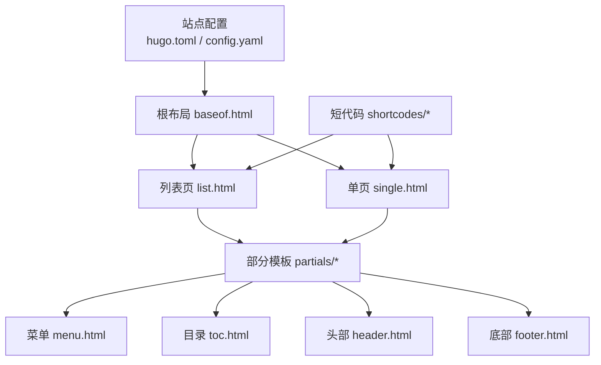
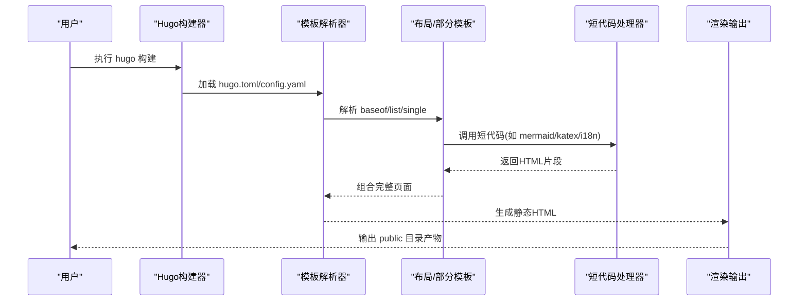
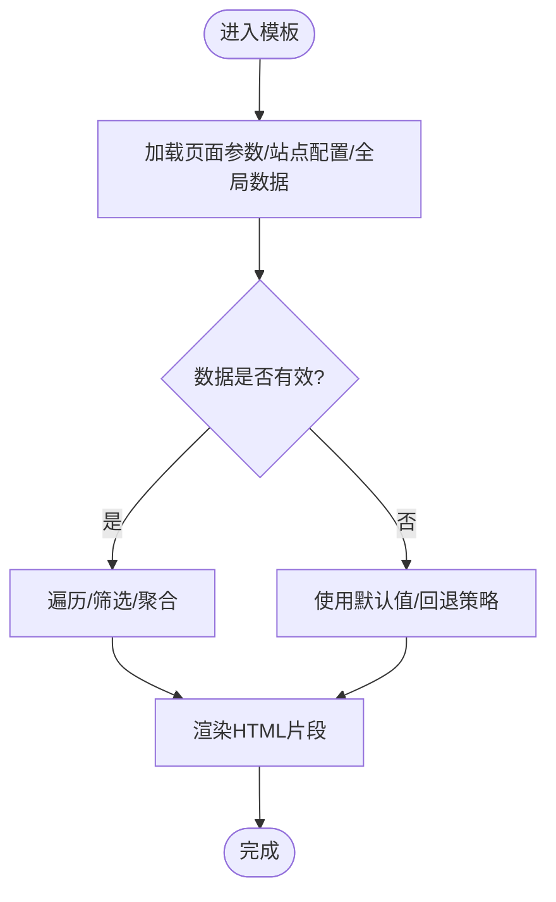
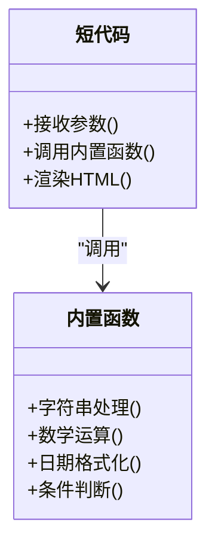
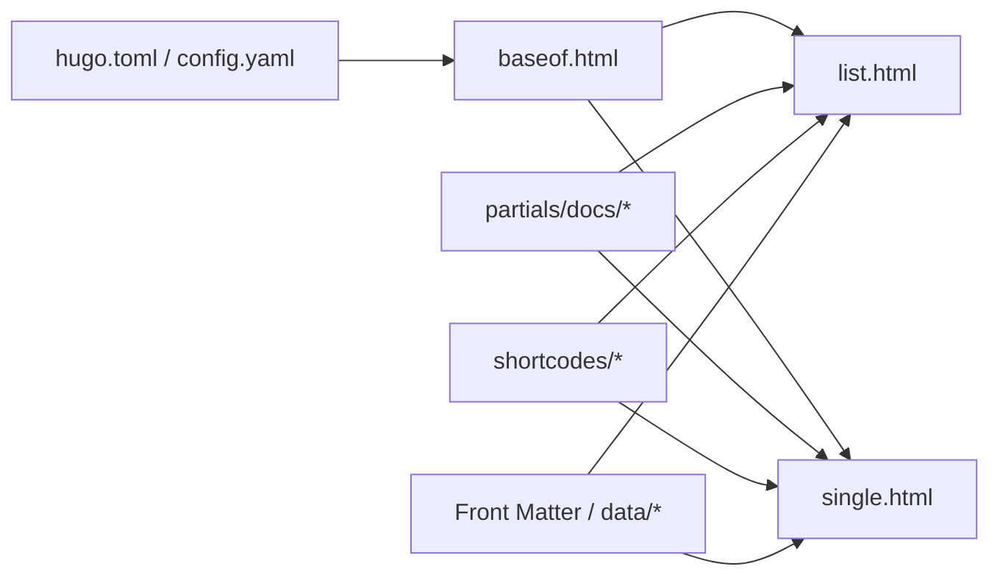

# 模板函数与数据处理

<cite>
**本文引用的文件**   
- [hugo.toml](file://hugo.toml)
- [config.yaml](file://config.yaml)
- [layouts/_default/baseof.html](file://themes/hugo-book/layouts/_default/baseof.html)
- [layouts/_default/list.html](file://themes/hugo-book/layouts/_default/list.html)
- [layouts/_default/single.html](file://themes/hugo-book/layouts/_default/single.html)
- [layouts/partials/docs/header.html](file://themes/hugo-book/layouts/partials/docs/header.html)
- [layouts/partials/docs/footer.html](file://themes/hugo-book/layouts/partials/docs/footer.html)
- [layouts/partials/docs/menu.html](file://themes/hugo-book/layouts/partials/docs/menu.html)
- [layouts/partials/docs/toc.html](file://themes/hugo-book/layouts/partials/docs/toc.html)
- [layouts/shortcodes/button.html](file://themes/hugo-book/layouts/shortcodes/button.html)
- [layouts/shortcodes/columns.html](file://themes/hugo-book/layouts/shortcodes/columns.html)
- [layouts/shortcodes/details.html](file://themes/hugo-book/layouts/shortcodes/details.html)
- [layouts/shortcodes/hint.html](file://themes/hugo-book/layouts/shortcodes/hint.html)
- [layouts/shortcodes/i18n.html](file://themes/hugo-book/layouts/shortcodes/i18n.html)
- [layouts/shortcodes/katex.html](file://themes/hugo-book/layouts/shortcodes/katex.html)
- [layouts/shortcodes/mermaid.html](file://themes/hugo-book/layouts/shortcodes/mermaid.html)
- [layouts/shortcodes/section.html](file://themes/hugo-book/layouts/shortcodes/section.html)
- [layouts/shortcodes/tab.html](file://themes/hugo-book/layouts/shortcodes/tab.html)
- [layouts/shortcodes/tabs.html](file://themes/hugo-book/layouts/shortcodes/tabs.html)
- [content/posts/hugoisforlovers.md](file://content/posts/hugoisforlovers.md)
- [content/docs/60-AI/20-map.md](file://content/docs/60-AI/20-map.md)
</cite>

## 目录
1. [简介](#简介)
2. [项目结构](#项目结构)
3. [核心组件](#核心组件)
4. [架构总览](#架构总览)
5. [详细组件分析](#详细组件分析)
6. [依赖分析](#依赖分析)
7. [性能考虑](#性能考虑)
8. [故障排查指南](#故障排查指南)
9. [结论](#结论)
10. [附录](#附录)

## 简介
本文件聚焦于Hugo模板引擎中的模板函数与数据处理，结合当前仓库的布局与短代码实现，系统梳理：
- 内置函数库在字符串处理、数学运算、日期格式化、条件判断等方面的使用场景
- 自定义模板函数的创建方法与Go语言扩展点
- 数据传递机制（页面参数、站点配置、全局变量）
- 复杂数据结构处理（数组、对象、嵌套访问）
- 条件渲染与逻辑控制（if-else、range、with等）
- 性能优化技巧与调试方法

## 项目结构
本项目采用Hugo标准目录组织，主题位于 themes/hugo-book。关键模板与短代码集中在 layouts 与 layouts/shortcodes 下；站点配置位于 hugo.toml 与 config.yaml；示例内容位于 content 目录。

图表来源
- [hugo.toml:1-200](file://hugo.toml#L1-L200)
- [config.yaml:1-200](file://config.yaml#L1-L200)
- [layouts/_default/baseof.html:1-200](file://themes/hugo-book/layouts/_default/baseof.html#L1-L200)
- [layouts/_default/list.html:1-200](file://themes/hugo-book/layouts/_default/list.html#L1-L200)
- [layouts/_default/single.html:1-200](file://themes/hugo-book/layouts/_default/single.html#L1-L200)
- [layouts/partials/docs/menu.html:1-200](file://themes/hugo-book/layouts/partials/docs/menu.html#L1-L200)
- [layouts/partials/docs/toc.html:1-200](file://themes/hugo-book/layouts/partials/docs/toc.html#L1-L200)
- [layouts/partials/docs/header.html:1-200](file://themes/hugo-book/layouts/partials/docs/header.html#L1-L200)
- [layouts/partials/docs/footer.html:1-200](file://themes/hugo-book/layouts/partials/docs/footer.html#L1-L200)

章节来源
- [hugo.toml:1-200](file://hugo.toml#L1-L200)
- [config.yaml:1-200](file://config.yaml#L1-L200)
- [layouts/_default/baseof.html:1-200](file://themes/hugo-book/layouts/_default/baseof.html#L1-L200)
- [layouts/_default/list.html:1-200](file://themes/hugo-book/layouts/_default/list.html#L1-L200)
- [layouts/_default/single.html:1-200](file://themes/hugo-book/layouts/_default/single.html#L1-L200)
- [layouts/partials/docs/menu.html:1-200](file://themes/hugo-book/layouts/partials/docs/menu.html#L1-L200)
- [layouts/partials/docs/toc.html:1-200](file://themes/hugo-book/layouts/partials/docs/toc.html#L1-L200)
- [layouts/partials/docs/header.html:1-200](file://themes/hugo-book/layouts/partials/docs/header.html#L1-L200)
- [layouts/partials/docs/footer.html:1-200](file://themes/hugo-book/layouts/partials/docs/footer.html#L1-L200)

## 核心组件
- 根布局 baseof.html：定义HTML骨架、引入资源、挂载页面主体块，是模板树的核心入口。
- 列表页 list.html：用于归档、分类、标签等列表视图，常配合 range 遍历集合。
- 单页 single.html：用于文章或文档详情展示，通常包含标题、元信息、正文等。
- 部分模板 partials/docs/*：可复用的UI片段，如菜单、目录、头部、底部等，便于组合复用。
- 短代码 shortcodes/*：内联可复用的小组件，常用于按钮、提示、表格、Mermaid图、KaTeX公式等。

章节来源
- [layouts/_default/baseof.html:1-200](file://themes/hugo-book/layouts/_default/baseof.html#L1-L200)
- [layouts/_default/list.html:1-200](file://themes/hugo-book/layouts/_default/list.html#L1-L200)
- [layouts/_default/single.html:1-200](file://themes/hugo-book/layouts/_default/single.html#L1-L200)
- [layouts/partials/docs/menu.html:1-200](file://themes/hugo-book/layouts/partials/docs/menu.html#L1-L200)
- [layouts/partials/docs/toc.html:1-200](file://themes/hugo-book/layouts/partials/docs/toc.html#L1-L200)
- [layouts/partials/docs/header.html:1-200](file://themes/hugo-book/layouts/partials/docs/header.html#L1-L200)
- [layouts/partials/docs/footer.html:1-200](file://themes/hugo-book/layouts/partials/docs/footer.html#L1-L200)
- [layouts/shortcodes/button.html:1-200](file://themes/hugo-book/layouts/shortcodes/button.html#L1-L200)
- [layouts/shortcodes/columns.html:1-200](file://themes/hugo-book/layouts/shortcodes/columns.html#L1-L200)
- [layouts/shortcodes/details.html:1-200](file://themes/hugo-book/layouts/shortcodes/details.html#L1-L200)
- [layouts/shortcodes/hint.html:1-200](file://themes/hugo-book/layouts/shortcodes/hint.html#L1-L200)
- [layouts/shortcodes/i18n.html:1-200](file://themes/hugo-book/layouts/shortcodes/i18n.html#L1-L200)
- [layouts/shortcodes/katex.html:1-200](file://themes/hugo-book/layouts/shortcodes/katex.html#L1-L200)
- [layouts/shortcodes/mermaid.html:1-200](file://themes/hugo-book/layouts/shortcodes/mermaid.html#L1-L200)
- [layouts/shortcodes/section.html:1-200](file://themes/hugo-book/layouts/shortcodes/section.html#L1-L200)
- [layouts/shortcodes/tab.html:1-200](file://themes/hugo-book/layouts/shortcodes/tab.html#L1-L200)
- [layouts/shortcodes/tabs.html:1-200](file://themes/hugo-book/layouts/shortcodes/tabs.html#L1-L200)

## 架构总览
下图展示了从站点配置到页面渲染的关键路径，以及模板函数与数据在其中的流转。

图表来源
- [hugo.toml:1-200](file://hugo.toml#L1-L200)
- [config.yaml:1-200](file://config.yaml#L1-L200)
- [layouts/_default/baseof.html:1-200](file://themes/hugo-book/layouts/_default/baseof.html#L1-L200)
- [layouts/_default/list.html:1-200](file://themes/hugo-book/layouts/_default/list.html#L1-L200)
- [layouts/_default/single.html:1-200](file://themes/hugo-book/layouts/_default/single.html#L1-L200)
- [layouts/shortcodes/mermaid.html:1-200](file://themes/hugo-book/layouts/shortcodes/mermaid.html#L1-L200)
- [layouts/shortcodes/katex.html:1-200](file://themes/hugo-book/layouts/shortcodes/katex.html#L1-L200)
- [layouts/shortcodes/i18n.html:1-200](file://themes/hugo-book/layouts/shortcodes/i18n.html#L1-L200)

## 详细组件分析

### 内置模板函数与数据处理要点
- 字符串处理
  - 常见能力：大小写转换、截取、拼接、替换、去空白、正则匹配等。
  - 典型用法：在标题、链接、摘要、SEO字段中统一格式。
- 数学运算
  - 常见能力：加减乘除、取整、比较、随机数等。
  - 典型用法：分页计算、索引序号、进度条宽度百分比。
- 日期格式化
  - 常见能力：本地化时间、时区、相对时间、格式化模板。
  - 典型用法：文章发布时间、最后修改时间、版权年份。
- 条件判断
  - 常见能力：布尔判断、空值检查、类型判断、范围判断。
  - 典型用法：根据主题开关显示/隐藏模块、按语言切换文案。
- 集合与对象
  - 常见能力：range遍历、map键值访问、切片操作、排序过滤。
  - 典型用法：导航菜单、侧边栏、标签云、文章列表。
- 上下文与作用域
  - with 限定作用域，避免重复 . 引用；$. 访问根上下文。
  - 典型用法：在局部块中简化属性访问。

章节来源
- [layouts/_default/list.html:1-200](file://themes/hugo-book/layouts/_default/list.html#L1-L200)
- [layouts/_default/single.html:1-200](file://themes/hugo-book/layouts/_default/single.html#L1-L200)
- [layouts/partials/docs/menu.html:1-200](file://themes/hugo-book/layouts/partials/docs/menu.html#L1-L200)
- [layouts/partials/docs/toc.html:1-200](file://themes/hugo-book/layouts/partials/docs/toc.html#L1-L200)

### 自定义模板函数与Go扩展
- 注册方式
  - 通过 Hugo 扩展点将Go函数注册为模板函数，供模板直接调用。
  - 可在站点级或主题级注册，注意命名空间与冲突。
- 设计建议
  - 纯函数优先，避免副作用；输入校验与错误返回；幂等性。
  - 对大数据集进行分批处理，减少内存峰值。
- 调试与测试
  - 使用 hugo --debug 查看构建日志；在Go层打印中间结果。
  - 编写单元测试覆盖边界条件与异常分支。

章节来源
- [hugo.toml:1-200](file://hugo.toml#L1-L200)
- [config.yaml:1-200](file://config.yaml#L1-L200)

### 数据传递机制
- 页面参数
  - 在Front Matter中声明键值，模板中以 .Params 访问。
  - 适合页面级个性化配置（如封面、作者、标签）。
- 站点配置
  - 通过 hugo.toml 或 config.yaml 集中管理站点级设置。
  - 模板中以 site 对象访问，例如站点名、描述、语言、菜单等。
- 全局变量
  - 可通过 data 目录或资源注入全局数据，模板中以 $.Site.Data 或资源API访问。
  - 适合跨页面共享的配置或字典表。

章节来源
- [hugo.toml:1-200](file://hugo.toml#L1-L200)
- [config.yaml:1-200](file://config.yaml#L1-L200)
- [content/posts/hugoisforlovers.md:1-200](file://content/posts/hugoisforlovers.md#L1-L200)
- [content/docs/60-AI/20-map.md:1-200](file://content/docs/60-AI/20-map.md#L1-L200)

### 复杂数据结构处理
- 数组与切片
  - 使用 range 遍历，结合 index 获取元素；注意越界保护。
  - 常用函数：len、append、slice、sort、uniq 等。
- 对象与Map
  - 以键访问属性；若键不存在需做空值回退。
  - 使用 merge 合并配置，避免重复定义。
- 嵌套数据访问
  - 使用 with 缩小作用域，提升可读性与性能。
  - 多级访问时使用安全访问模式，避免空指针。

章节来源
- [layouts/_default/list.html:1-200](file://themes/hugo-book/layouts/_default/list.html#L1-L200)
- [layouts/_default/single.html:1-200](file://themes/hugo-book/layouts/_default/single.html#L1-L200)
- [layouts/partials/docs/menu.html:1-200](file://themes/hugo-book/layouts/partials/docs/menu.html#L1-L200)

### 条件渲染与逻辑控制高级用法
- if-else
  - 基于布尔表达式或空值判断，控制区块显隐。
  - 推荐将复杂条件抽取为自定义函数，保持模板简洁。
- range循环
  - 遍历集合时同时使用索引与计数，辅助分页与样式切换。
  - 对大型集合进行分页或懒加载，降低首屏压力。
- with上下文
  - 在局部块中绑定对象，简化属性访问并提高可读性。
  - 注意区分 $. 与 . 的作用域差异。

章节来源
- [layouts/_default/list.html:1-200](file://themes/hugo-book/layouts/_default/list.html#L1-L200)
- [layouts/_default/single.html:1-200](file://themes/hugo-book/layouts/_default/single.html#L1-L200)
- [layouts/partials/docs/menu.html:1-200](file://themes/hugo-book/layouts/partials/docs/menu.html#L1-L200)

### 短代码与模板函数协作
- 短代码作为“微组件”，封装常用交互与渲染逻辑，内部可自由调用内置函数与自定义函数。
- 典型短代码：
  - button：按钮组件，支持文本、链接、样式参数。
  - columns：多列布局，支持响应式排版。
  - details：折叠面板，增强可读性。
  - hint：提示框，用于强调或警告信息。
  - i18n：国际化文案插值。
  - katex：数学公式渲染。
  - mermaid：流程图/时序图等可视化。
  - section/tab/tabs：分组与标签页。

图表来源
- [layouts/shortcodes/button.html:1-200](file://themes/hugo-book/layouts/shortcodes/button.html#L1-L200)
- [layouts/shortcodes/columns.html:1-200](file://themes/hugo-book/layouts/shortcodes/columns.html#L1-L200)
- [layouts/shortcodes/details.html:1-200](file://themes/hugo-book/layouts/shortcodes/details.html#L1-L200)
- [layouts/shortcodes/hint.html:1-200](file://themes/hugo-book/layouts/shortcodes/hint.html#L1-L200)
- [layouts/shortcodes/i18n.html:1-200](file://themes/hugo-book/layouts/shortcodes/i18n.html#L1-L200)
- [layouts/shortcodes/katex.html:1-200](file://themes/hugo-book/layouts/shortcodes/katex.html#L1-L200)
- [layouts/shortcodes/mermaid.html:1-200](file://themes/hugo-book/layouts/shortcodes/mermaid.html#L1-L200)
- [layouts/shortcodes/section.html:1-200](file://themes/hugo-book/layouts/shortcodes/section.html#L1-L200)
- [layouts/shortcodes/tab.html:1-200](file://themes/hugo-book/layouts/shortcodes/tab.html#L1-L200)
- [layouts/shortcodes/tabs.html:1-200](file://themes/hugo-book/layouts/shortcodes/tabs.html#L1-L200)

章节来源
- [layouts/shortcodes/button.html:1-200](file://themes/hugo-book/layouts/shortcodes/button.html#L1-L200)
- [layouts/shortcodes/columns.html:1-200](file://themes/hugo-book/layouts/shortcodes/columns.html#L1-L200)
- [layouts/shortcodes/details.html:1-200](file://themes/hugo-book/layouts/shortcodes/details.html#L1-L200)
- [layouts/shortcodes/hint.html:1-200](file://themes/hugo-book/layouts/shortcodes/hint.html#L1-L200)
- [layouts/shortcodes/i18n.html:1-200](file://themes/hugo-book/layouts/shortcodes/i18n.html#L1-L200)
- [layouts/shortcodes/katex.html:1-200](file://themes/hugo-book/layouts/shortcodes/katex.html#L1-L200)
- [layouts/shortcodes/mermaid.html:1-200](file://themes/hugo-book/layouts/shortcodes/mermaid.html#L1-L200)
- [layouts/shortcodes/section.html:1-200](file://themes/hugo-book/layouts/shortcodes/section.html#L1-L200)
- [layouts/shortcodes/tab.html:1-200](file://themes/hugo-book/layouts/shortcodes/tab.html#L1-L200)
- [layouts/shortcodes/tabs.html:1-200](file://themes/hugo-book/layouts/shortcodes/tabs.html#L1-L200)

## 依赖分析
- 布局与部分模板
  - baseof.html 作为根布局，被 list.html 与 single.html 继承。
  - partials/docs/* 提供通用UI片段，被多个页面复用。
- 短代码与模板函数
  - 短代码内部大量依赖内置函数进行数据处理与渲染。
  - 自定义函数可作为桥梁，将Go逻辑暴露给模板与短代码。
- 配置与数据
  - hugo.toml 与 config.yaml 驱动站点行为与主题外观。
  - Front Matter 与 data 目录提供页面与全局数据源。

图表来源
- [layouts/_default/baseof.html:1-200](file://themes/hugo-book/layouts/_default/baseof.html#L1-L200)
- [layouts/_default/list.html:1-200](file://themes/hugo-book/layouts/_default/list.html#L1-L200)
- [layouts/_default/single.html:1-200](file://themes/hugo-book/layouts/_default/single.html#L1-L200)
- [layouts/partials/docs/menu.html:1-200](file://themes/hugo-book/layouts/partials/docs/menu.html#L1-L200)
- [layouts/partials/docs/toc.html:1-200](file://themes/hugo-book/layouts/partials/docs/toc.html#L1-L200)
- [layouts/partials/docs/header.html:1-200](file://themes/hugo-book/layouts/partials/docs/header.html#L1-L200)
- [layouts/partials/docs/footer.html:1-200](file://themes/hugo-book/layouts/partials/docs/footer.html#L1-L200)
- [layouts/shortcodes/button.html:1-200](file://themes/hugo-book/layouts/shortcodes/button.html#L1-L200)
- [layouts/shortcodes/mermaid.html:1-200](file://themes/hugo-book/layouts/shortcodes/mermaid.html#L1-L200)
- [layouts/shortcodes/katex.html:1-200](file://themes/hugo-book/layouts/shortcodes/katex.html#L1-L200)
- [layouts/shortcodes/i18n.html:1-200](file://themes/hugo-book/layouts/shortcodes/i18n.html#L1-L200)
- [hugo.toml:1-200](file://hugo.toml#L1-L200)
- [config.yaml:1-200](file://config.yaml#L1-L200)

章节来源
- [layouts/_default/baseof.html:1-200](file://themes/hugo-book/layouts/_default/baseof.html#L1-L200)
- [layouts/_default/list.html:1-200](file://themes/hugo-book/layouts/_default/list.html#L1-L200)
- [layouts/_default/single.html:1-200](file://themes/hugo-book/layouts/_default/single.html#L1-L200)
- [layouts/partials/docs/menu.html:1-200](file://themes/hugo-book/layouts/partials/docs/menu.html#L1-L200)
- [layouts/partials/docs/toc.html:1-200](file://themes/hugo-book/layouts/partials/docs/toc.html#L1-L200)
- [layouts/partials/docs/header.html:1-200](file://themes/hugo-book/layouts/partials/docs/header.html#L1-L200)
- [layouts/partials/docs/footer.html:1-200](file://themes/hugo-book/layouts/partials/docs/footer.html#L1-L200)
- [layouts/shortcodes/button.html:1-200](file://themes/hugo-book/layouts/shortcodes/button.html#L1-L200)
- [layouts/shortcodes/mermaid.html:1-200](file://themes/hugo-book/layouts/shortcodes/mermaid.html#L1-L200)
- [layouts/shortcodes/katex.html:1-200](file://themes/hugo-book/layouts/shortcodes/katex.html#L1-L200)
- [layouts/shortcodes/i18n.html:1-200](file://themes/hugo-book/layouts/shortcodes/i18n.html#L1-L200)
- [hugo.toml:1-200](file://hugo.toml#L1-L200)
- [config.yaml:1-200](file://config.yaml#L1-L200)

## 性能考虑
- 模板层面
  - 减少不必要的嵌套与重复计算，尽量在partial中缓存中间结果。
  - 合理使用 with 缩小作用域，避免多次 . 查找。
  - 对大集合进行分页或限制数量，避免一次性渲染过多节点。
- 函数层面
  - 自定义函数应幂等且无副作用，避免IO与网络请求。
  - 对字符串与集合操作进行批量处理，减少临时对象分配。
- 资源层面
  - 按需加载脚本与样式，避免首屏阻塞。
  - 图片与媒体资源启用压缩与懒加载。
- 构建层面
  - 使用 hugo --minify 与资源哈希，提升缓存命中率。
  - 增量构建与并行编译，缩短构建时间。

[本节为通用指导，不直接分析具体文件]

## 故障排查指南
- 常见问题
  - 模板函数未找到：检查注册位置与命名空间，确认导入路径正确。
  - 空值或类型不匹配：增加空值检查与类型断言，提供默认回退。
  - 性能退化：定位热点模板与函数，拆分复杂逻辑，减少DOM节点。
- 调试手段
  - 使用 hugo --debug 输出详细构建日志。
  - 在模板中使用 printf 或 debug 工具打印中间状态。
  - 针对短代码与partial进行最小化复现，快速定位问题。
- 回归与测试
  - 建立用例覆盖边界条件与异常分支。
  - 在CI中加入模板与资源构建验证。

章节来源
- [layouts/_default/baseof.html:1-200](file://themes/hugo-book/layouts/_default/baseof.html#L1-L200)
- [layouts/_default/list.html:1-200](file://themes/hugo-book/layouts/_default/list.html#L1-L200)
- [layouts/_default/single.html:1-200](file://themes/hugo-book/layouts/_default/single.html#L1-L200)
- [layouts/shortcodes/mermaid.html:1-200](file://themes/hugo-book/layouts/shortcodes/mermaid.html#L1-L200)
- [layouts/shortcodes/katex.html:1-200](file://themes/hugo-book/layouts/shortcodes/katex.html#L1-L200)
- [layouts/shortcodes/i18n.html:1-200](file://themes/hugo-book/layouts/shortcodes/i18n.html#L1-L200)

## 结论
通过对布局、部分模板与短代码的系统分析，可以清晰看到Hugo模板函数与数据处理在站点构建中的核心作用。合理组织数据、善用内置函数与自定义函数、遵循性能与调试最佳实践，能够显著提升模板的可维护性与渲染效率。

[本节为总结性内容，不直接分析具体文件]

## 附录
- 参考文件
  - 站点配置：hugo.toml、config.yaml
  - 布局与部分模板：baseof.html、list.html、single.html、partials/docs/*
  - 短代码：button、columns、details、hint、i18n、katex、mermaid、section、tab、tabs
  - 示例内容：posts/hugoisforlovers.md、docs/60-AI/20-map.md

章节来源
- [hugo.toml:1-200](file://hugo.toml#L1-L200)
- [config.yaml:1-200](file://config.yaml#L1-L200)
- [layouts/_default/baseof.html:1-200](file://themes/hugo-book/layouts/_default/baseof.html#L1-L200)
- [layouts/_default/list.html:1-200](file://themes/hugo-book/layouts/_default/list.html#L1-L200)
- [layouts/_default/single.html:1-200](file://themes/hugo-book/layouts/_default/single.html#L1-L200)
- [layouts/partials/docs/menu.html:1-200](file://themes/hugo-book/layouts/partials/docs/menu.html#L1-L200)
- [layouts/partials/docs/toc.html:1-200](file://themes/hugo-book/layouts/partials/docs/toc.html#L1-L200)
- [layouts/partials/docs/header.html:1-200](file://themes/hugo-book/layouts/partials/docs/header.html#L1-L200)
- [layouts/partials/docs/footer.html:1-200](file://themes/hugo-book/layouts/partials/docs/footer.html#L1-L200)
- [layouts/shortcodes/button.html:1-200](file://themes/hugo-book/layouts/shortcodes/button.html#L1-L200)
- [layouts/shortcodes/columns.html:1-200](file://themes/hugo-book/layouts/shortcodes/columns.html#L1-L200)
- [layouts/shortcodes/details.html:1-200](file://themes/hugo-book/layouts/shortcodes/details.html#L1-L200)
- [layouts/shortcodes/hint.html:1-200](file://themes/hugo-book/layouts/shortcodes/hint.html#L1-L200)
- [layouts/shortcodes/i18n.html:1-200](file://themes/hugo-book/layouts/shortcodes/i18n.html#L1-L200)
- [layouts/shortcodes/katex.html:1-200](file://themes/hugo-book/layouts/shortcodes/katex.html#L1-L200)
- [layouts/shortcodes/mermaid.html:1-200](file://themes/hugo-book/layouts/shortcodes/mermaid.html#L1-L200)
- [layouts/shortcodes/section.html:1-200](file://themes/hugo-book/layouts/shortcodes/section.html#L1-L200)
- [layouts/shortcodes/tab.html:1-200](file://themes/hugo-book/layouts/shortcodes/tab.html#L1-L200)
- [layouts/shortcodes/tabs.html:1-200](file://themes/hugo-book/layouts/shortcodes/tabs.html#L1-L200)
- [content/posts/hugoisforlovers.md:1-200](file://content/posts/hugoisforlovers.md#L1-L200)
- [content/docs/60-AI/20-map.md:1-200](file://content/docs/60-AI/20-map.md#L1-L200)