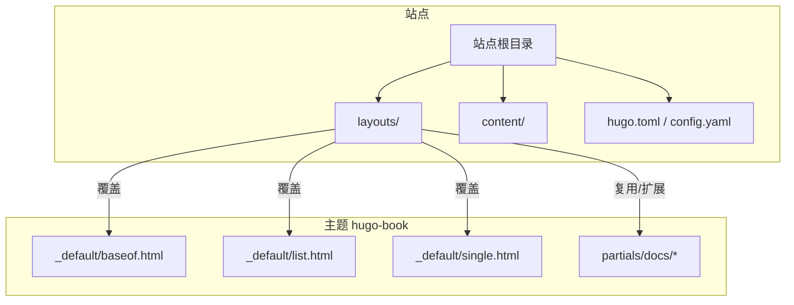
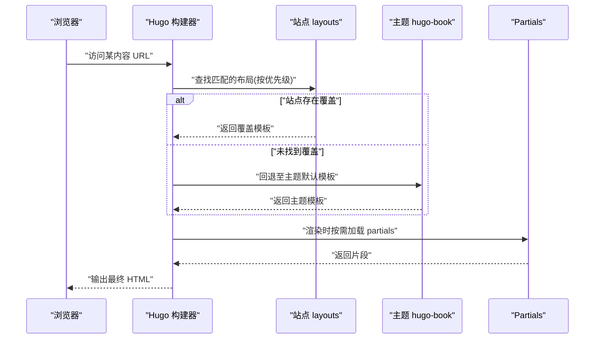
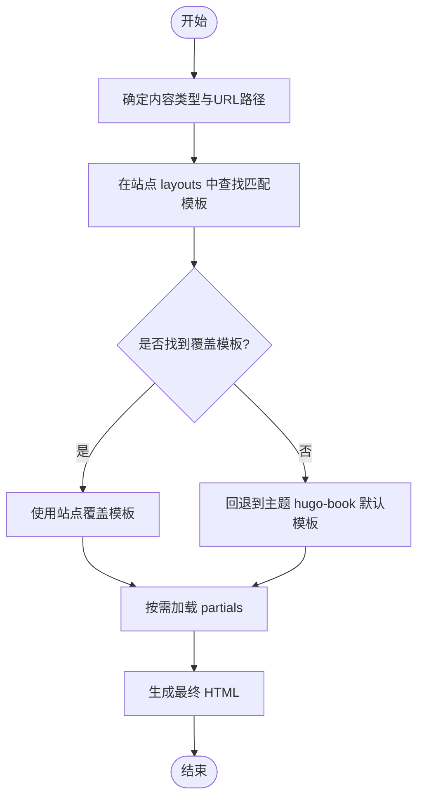
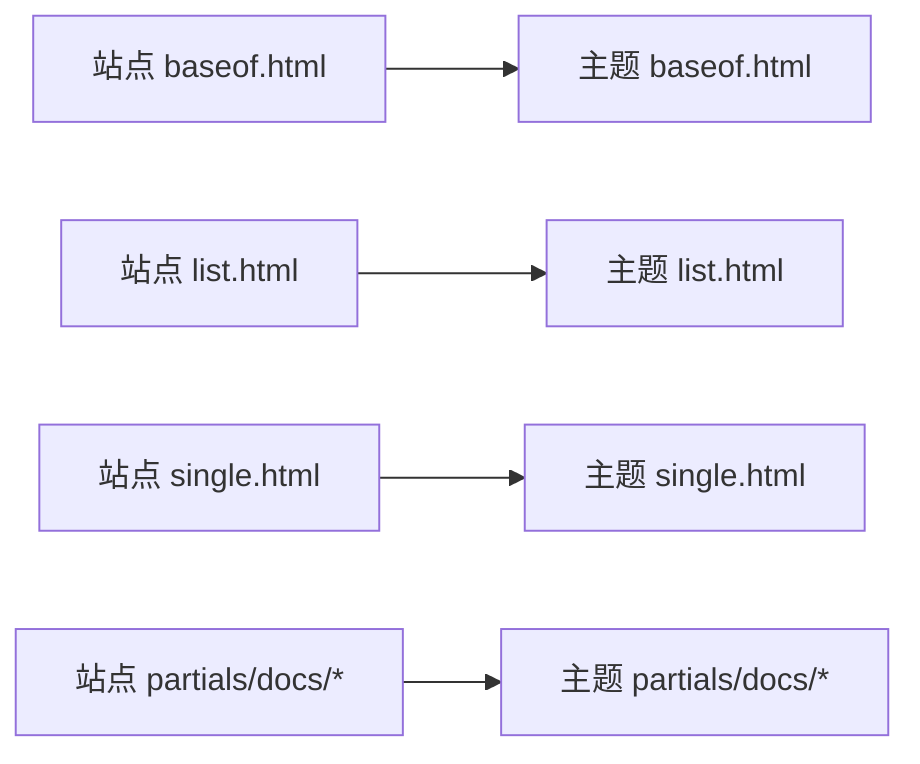

# 模板覆盖

<cite>
**本文引用的文件**   
- [hugo.toml](file://hugo.toml)
- [config.yaml](file://config.yaml)
- [layouts/_default/baseof.html](file://layouts/_default/baseof.html)
- [layouts/_default/list.html](file://layouts/_default/list.html)
- [layouts/_default/single.html](file://layouts/_default/single.html)
- [layouts/partials/docs/header.html](file://layouts/partials/docs/header.html)
- [layouts/partials/docs/footer.html](file://layouts/partials/docs/footer.html)
- [layouts/partials/docs/menu.html](file://layouts/partials/docs/menu.html)
- [layouts/posts/list.html](file://layouts/posts/list.html)
- [layouts/posts/single.html](file://layouts/posts/single.html)
- [themes/hugo-book/layouts/_default/baseof.html](file://themes/hugo-book/layouts/_default/baseof.html)
- [themes/hugo-book/layouts/_default/list.html](file://themes/hugo-book/layouts/_default/list.html)
- [themes/hugo-book/layouts/_default/single.html](file://themes/hugo-book/layouts/_default/single.html)
- [themes/hugo-book/layouts/partials/docs/header.html](file://themes/hugo-book/layouts/partials/docs/header.html)
- [themes/hugo-book/layouts/partials/docs/footer.html](file://themes/hugo-book/layouts/partials/docs/footer.html)
- [themes/hugo-book/layouts/partials/docs/menu.html](file://themes/hugo-book/layouts/partials/docs/menu.html)
</cite>

## 目录
1. [简介](#简介)
2. [项目结构](#项目结构)
3. [核心组件](#核心组件)
4. [架构总览](#架构总览)
5. [详细组件分析](#详细组件分析)
6. [依赖分析](#依赖分析)
7. [性能考虑](#性能考虑)
8. [故障排查指南](#故障排查指南)
9. [结论](#结论)
10. [附录](#附录)

## 简介
本文件面向使用 Hugo 与 hugo-book 主题的开发者，系统阐述“模板覆盖机制”的原理与实践。重点包括：
- 主题模板的优先级与覆盖规则
- 在站点根目录 layouts 下如何覆盖默认主题模板（单页、列表、基础模板）
- Partials 部分模板的使用与扩展（头部、尾部、侧边栏等）
- 自定义页面类型与布局变体的创建方法
- 模板函数与数据传递、条件渲染等高级特性
- 完整的覆盖示例与调试技巧

## 项目结构
本项目采用“站点 + 主题”的典型组织方式：
- 站点根目录下的 layouts 用于覆盖主题提供的模板
- 主题位于 themes/hugo-book，包含默认的基础模板、partials 与短代码
- 配置文件支持 hugo.toml 或 config.yaml，二者可并存，Hugo 会合并配置项

图表来源
- [hugo.toml](file://hugo.toml)
- [config.yaml](file://config.yaml)
- [themes/hugo-book/layouts/_default/baseof.html](file://themes/hugo-book/layouts/_default/baseof.html)
- [themes/hugo-book/layouts/_default/list.html](file://themes/hugo-book/layouts/_default/list.html)
- [themes/hugo-book/layouts/_default/single.html](file://themes/hugo-book/layouts/_default/single.html)
- [themes/hugo-book/layouts/partials/docs/header.html](file://themes/hugo-book/layouts/partials/docs/header.html)
- [themes/hugo-book/layouts/partials/docs/footer.html](file://themes/hugo-book/layouts/partials/docs/footer.html)
- [themes/hugo-book/layouts/partials/docs/menu.html](file://themes/hugo-book/layouts/partials/docs/menu.html)

章节来源
- [hugo.toml](file://hugo.toml)
- [config.yaml](file://config.yaml)

## 核心组件
- 基础模板 baseof.html：定义站点骨架（HTML 头尾、脚本注入点、块区域），是其他模板继承的根基
- 列表模板 list.html：用于归档、分类、标签、栏目索引等列表型页面
- 单页模板 single.html：用于文章、文档等具体内容的展示
- Partials 部分模板：如 header.html、footer.html、menu.html 等，提供可复用的 UI 片段

章节来源
- [themes/hugo-book/layouts/_default/baseof.html](file://themes/hugo-book/layouts/_default/baseof.html)
- [themes/hugo-book/layouts/_default/list.html](file://themes/hugo-book/layouts/_default/list.html)
- [themes/hugo-book/layouts/_default/single.html](file://themes/hugo-book/layouts/_default/single.html)
- [themes/hugo-book/layouts/partials/docs/header.html](file://themes/hugo-book/layouts/partials/docs/header.html)
- [themes/hugo-book/layouts/partials/docs/footer.html](file://themes/hugo-book/layouts/partials/docs/footer.html)
- [themes/hugo-book/layouts/partials/docs/menu.html](file://themes/hugo-book/layouts/partials/docs/menu.html)

## 架构总览
下图展示了“站点覆盖层”与“主题默认层”的关系，以及请求到最终 HTML 的渲染路径。

图表来源
- [layouts/_default/baseof.html](file://layouts/_default/baseof.html)
- [layouts/_default/list.html](file://layouts/_default/list.html)
- [layouts/_default/single.html](file://layouts/_default/single.html)
- [themes/hugo-book/layouts/_default/baseof.html](file://themes/hugo-book/layouts/_default/baseof.html)
- [themes/hugo-book/layouts/_default/list.html](file://themes/hugo-book/layouts/_default/list.html)
- [themes/hugo-book/layouts/_default/single.html](file://themes/hugo-book/layouts/_default/single.html)
- [themes/hugo-book/layouts/partials/docs/header.html](file://themes/hugo-book/layouts/partials/docs/header.html)
- [themes/hugo-book/layouts/partials/docs/footer.html](file://themes/hugo-book/layouts/partials/docs/footer.html)
- [themes/hugo-book/layouts/partials/docs/menu.html](file://themes/hugo-book/layouts/partials/docs/menu.html)

## 详细组件分析

### 基础模板覆盖（baseof.html）
- 作用：定义全局 HTML 结构、块插槽（如 head、main、footer）、资源注入点
- 覆盖方式：在站点 layouts/_default/baseof.html 中重写，保留必要的 block 名称以兼容主题
- 建议：尽量只覆盖差异部分，通过 include 引入主题 partials，避免重复实现

章节来源
- [layouts/_default/baseof.html](file://layouts/_default/baseof.html)
- [themes/hugo-book/layouts/_default/baseof.html](file://themes/hugo-book/layouts/_default/baseof.html)

### 列表模板覆盖（list.html）
- 作用：渲染栏目、分类、标签、归档等列表页面
- 覆盖方式：在站点 layouts/_default/list.html 或更具体的路径（如 layouts/posts/list.html）进行覆盖
- 要点：
  - 使用 .Title、.Content、.Pages 等上下文变量
  - 结合 partials 渲染导航、分页、面包屑等通用元素
  - 针对 posts 列表，可使用 layouts/posts/list.html 精准覆盖

章节来源
- [layouts/_default/list.html](file://layouts/_default/list.html)
- [layouts/posts/list.html](file://layouts/posts/list.html)
- [themes/hugo-book/layouts/_default/list.html](file://themes/hugo-book/layouts/_default/list.html)

### 单页模板覆盖（single.html）
- 作用：渲染文章、文档等具体内容页
- 覆盖方式：在站点 layouts/_default/single.html 或更具体的路径（如 layouts/posts/single.html）进行覆盖
- 要点：
  - 使用 .Title、.Params、.Content、.Date 等上下文变量
  - 通过 partials 插入头部信息、元数据、评论、目录等
  - 针对 posts 单页，可使用 layouts/posts/single.html 精准覆盖

章节来源
- [layouts/_default/single.html](file://layouts/_default/single.html)
- [layouts/posts/single.html](file://layouts/posts/single.html)
- [themes/hugo-book/layouts/_default/single.html](file://themes/hugo-book/layouts/_default/single.html)

### Partials 部分模板（header/footer/menu 等）
- 作用：将可复用的 UI 片段抽离为 partials，便于多处复用与局部替换
- 常见 partials：
  - docs/header.html：站点头部、导航、搜索入口
  - docs/footer.html：站点底部、版权、外链
  - docs/menu.html：侧边栏菜单、树形目录
- 扩展方式：
  - 在站点 layouts/partials/docs/ 下创建同名文件即可覆盖主题默认 partials
  - 也可新增自定义 partials，并在模板中以 partial 调用

章节来源
- [layouts/partials/docs/header.html](file://layouts/partials/docs/header.html)
- [layouts/partials/docs/footer.html](file://layouts/partials/docs/footer.html)
- [layouts/partials/docs/menu.html](file://layouts/partials/docs/menu.html)
- [themes/hugo-book/layouts/partials/docs/header.html](file://themes/hugo-book/layouts/partials/docs/header.html)
- [themes/hugo-book/layouts/partials/docs/footer.html](file://themes/hugo-book/layouts/partials/docs/footer.html)
- [themes/hugo-book/layouts/partials/docs/menu.html](file://themes/hugo-book/layouts/partials/docs/menu.html)

### 自定义页面类型与布局变体
- 新内容类型：在 content 下新建目录（如 content/products），并创建对应模板 layouts/products/single.html 与 layouts/products/list.html
- 布局变体：在 front matter 中使用 layout 字段指定特定布局模板，或在模板内根据参数分支渲染
- 命名约定：Hugo 会根据内容类型自动匹配最具体的模板；若未命中，则回退到 _default 下的通用模板

章节来源
- [layouts/_default/list.html](file://layouts/_default/list.html)
- [layouts/_default/single.html](file://layouts/_default/single.html)
- [layouts/posts/list.html](file://layouts/posts/list.html)
- [layouts/posts/single.html](file://layouts/posts/single.html)

### 模板函数与数据传递、条件渲染
- 内置函数：Hugo 提供丰富的模板函数（如 printf、time.Format、len、eq、ne、and、or 等）
- 自定义函数：可通过 Hugo 扩展或第三方模块注册自定义函数，并在模板中直接调用
- 数据传递：
  - 上下文对象：.Page、.Site、.Data、.Params 等
  - 通过 partial 的参数传递额外数据
- 条件渲染：使用 if/else 与比较函数控制不同分支的显示逻辑

章节来源
- [layouts/_default/baseof.html](file://layouts/_default/baseof.html)
- [layouts/_default/list.html](file://layouts/_default/list.html)
- [layouts/_default/single.html](file://layouts/_default/single.html)
- [layouts/partials/docs/header.html](file://layouts/partials/docs/header.html)
- [layouts/partials/docs/footer.html](file://layouts/partials/docs/footer.html)
- [layouts/partials/docs/menu.html](file://layouts/partials/docs/menu.html)

### 覆盖流程与优先级（流程图）

图表来源
- [layouts/_default/baseof.html](file://layouts/_default/baseof.html)
- [layouts/_default/list.html](file://layouts/_default/list.html)
- [layouts/_default/single.html](file://layouts/_default/single.html)
- [themes/hugo-book/layouts/_default/baseof.html](file://themes/hugo-book/layouts/_default/baseof.html)
- [themes/hugo-book/layouts/_default/list.html](file://themes/hugo-book/layouts/_default/list.html)
- [themes/hugo-book/layouts/_default/single.html](file://themes/hugo-book/layouts/_default/single.html)

## 依赖分析
- 站点模板依赖主题 partials：当站点未覆盖某个 partials 时，会自动从主题中加载
- 模板间继承关系：single/list 通常基于 baseof 定义的块进行填充
- 配置影响行为：hugo.toml 与 config.yaml 共同决定主题启用、语言、菜单、SEO 等，从而影响模板渲染上下文

图表来源
- [layouts/_default/baseof.html](file://layouts/_default/baseof.html)
- [layouts/_default/list.html](file://layouts/_default/list.html)
- [layouts/_default/single.html](file://layouts/_default/single.html)
- [layouts/partials/docs/header.html](file://layouts/partials/docs/header.html)
- [layouts/partials/docs/footer.html](file://layouts/partials/docs/footer.html)
- [layouts/partials/docs/menu.html](file://layouts/partials/docs/menu.html)
- [themes/hugo-book/layouts/_default/baseof.html](file://themes/hugo-book/layouts/_default/baseof.html)
- [themes/hugo-book/layouts/_default/list.html](file://themes/hugo-book/layouts/_default/list.html)
- [themes/hugo-book/layouts/_default/single.html](file://themes/hugo-book/layouts/_default/single.html)
- [themes/hugo-book/layouts/partials/docs/header.html](file://themes/hugo-book/layouts/partials/docs/header.html)
- [themes/hugo-book/layouts/partials/docs/footer.html](file://themes/hugo-book/layouts/partials/docs/footer.html)
- [themes/hugo-book/layouts/partials/docs/menu.html](file://themes/hugo-book/layouts/partials/docs/menu.html)

章节来源
- [hugo.toml](file://hugo.toml)
- [config.yaml](file://config.yaml)

## 性能考虑
- 最小化覆盖范围：优先覆盖差异部分，复用主题 partials，减少重复渲染逻辑
- 合理使用缓存：对复杂计算结果使用 Hugo 的缓存机制（如 .Scratch）
- 精简模板函数：避免在模板中进行重型计算，必要时在构建阶段预处理数据
- 资源优化：确保 CSS/JS 仅加载必要资源，利用 Hugo 的资源管道进行压缩与哈希

## 故障排查指南
- 确认覆盖路径是否正确：检查站点 layouts 下的文件路径是否与目标模板一致
- 查看构建日志：定位模板解析错误、缺失 partials、变量未定义等问题
- 逐步缩小范围：先恢复为默认主题模板，再逐步添加覆盖，定位问题所在
- 验证配置：检查 hugo.toml 与 config.yaml 的主题设置、语言、菜单等是否生效
- 清理缓存：删除 resources/_gen 与 public 后重新构建，排除缓存干扰

章节来源
- [hugo.toml](file://hugo.toml)
- [config.yaml](file://config.yaml)

## 结论
通过站点根目录下的 layouts 覆盖主题模板，可以在不修改主题源码的前提下灵活定制页面结构与行为。遵循“最小覆盖、最大复用”的原则，结合 partials 与模板函数，可实现高度可维护的个性化站点。遇到问题时，依据优先级与回退机制逐步排查，能显著提升调试效率。

## 附录
- 常用覆盖清单：
  - 基础骨架：layouts/_default/baseof.html
  - 列表页面：layouts/_default/list.html、layouts/posts/list.html
  - 单页内容：layouts/_default/single.html、layouts/posts/single.html
  - 部分模板：layouts/partials/docs/header.html、footer.html、menu.html
- 最佳实践：
  - 保持与主题一致的 block 与 partials 命名
  - 在 front matter 中使用 layout 指定布局变体
  - 通过 partial 参数传递上下文数据，增强灵活性