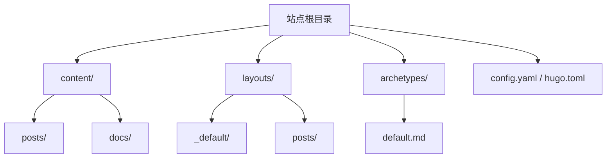
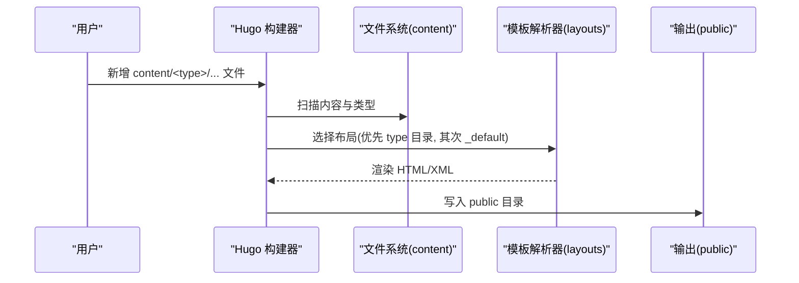
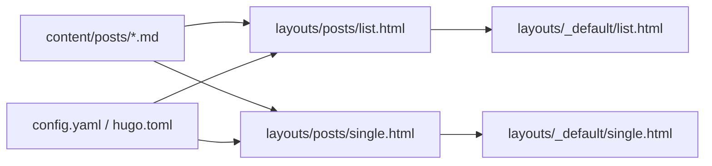
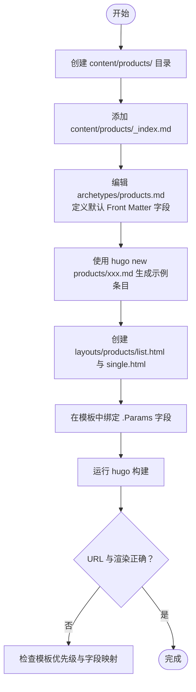

# 自定义页面类型

<cite>
**本文引用的文件**   
- [archetypes/default.md](file://archetypes/default.md)
- [content/docs/_index.md](file://content/docs/_index.md)
- [content/posts/_index.md](file://content/posts/_index.md)
- [layouts/_default/baseof.html](file://layouts/_default/baseof.html)
- [layouts/_default/list.html](file://layouts/_default/list.html)
- [layouts/_default/single.html](file://layouts/_default/single.html)
- [layouts/posts/list.html](file://layouts/posts/list.html)
- [layouts/posts/single.html](file://layouts/posts/single.html)
- [config.yaml](file://config.yaml)
- [hugo.toml](file://hugo.toml)
</cite>

## 目录
1. [简介](#简介)
2. [项目结构](#项目结构)
3. [核心组件](#核心组件)
4. [架构总览](#架构总览)
5. [详细组件分析](#详细组件分析)
6. [依赖关系分析](#依赖关系分析)
7. [性能与SEO建议](#性能与seo建议)
8. [故障排查指南](#故障排查指南)
9. [结论](#结论)
10. [附录：完整示例流程](#附录完整示例流程)

## 简介
本文件面向希望扩展 Hugo 内容模型的开发者，系统讲解如何创建“自定义页面类型”（Content Types），包括：
- 内容类型系统与模板解析优先级
- Front Matter 元数据定义、默认值、验证与绑定
- 为自定义类型创建专属布局变体（单页、列表、搜索索引）
- 从 archetype 到布局文件的端到端流程
- URL 路由规则与 SEO 友好链接生成
- 内容迁移策略与版本兼容性考虑

## 项目结构
本项目采用主题 + 站点覆盖的方式组织。站点根目录下的 layouts 和 archetypes 会优先覆盖主题中的同名文件；content 下按内容类型分目录存放资源。

图表来源
- [archetypes/default.md](file://archetypes/default.md)
- [content/posts/_index.md](file://content/posts/_index.md)
- [content/docs/_index.md](file://content/docs/_index.md)
- [layouts/_default/baseof.html](file://layouts/_default/baseof.html)
- [layouts/_default/list.html](file://layouts/_default/list.html)
- [layouts/_default/single.html](file://layouts/_default/single.html)
- [layouts/posts/list.html](file://layouts/posts/list.html)
- [layouts/posts/single.html](file://layouts/posts/single.html)
- [config.yaml](file://config.yaml)
- [hugo.toml](file://hugo.toml)

章节来源
- [archetypes/default.md](file://archetypes/default.md)
- [content/posts/_index.md](file://content/posts/_index.md)
- [content/docs/_index.md](file://content/docs/_index.md)
- [layouts/_default/baseof.html](file://layouts/_default/baseof.html)
- [layouts/_default/list.html](file://layouts/_default/list.html)
- [layouts/_default/single.html](file://layouts/_default/single.html)
- [layouts/posts/list.html](file://layouts/posts/list.html)
- [layouts/posts/single.html](file://layouts/posts/single.html)
- [config.yaml](file://config.yaml)
- [hugo.toml](file://hugo.toml)

## 核心组件
- 内容类型（Content Type）：Hugo 根据 content 下的目录名识别类型，如 posts、docs。每个类型可拥有独立的 list 与 single 布局。
- 布局模板（Layouts）：_default 提供通用 fallback；具体类型目录（如 posts）提供专属实现。
- Archetype：用于为新内容快速生成带默认 Front Matter 的初始文件。
- 配置：通过 config.yaml/hugo.toml 设置站点行为、菜单、输出格式等。

章节来源
- [layouts/_default/list.html](file://layouts/_default/list.html)
- [layouts/_default/single.html](file://layouts/_default/single.html)
- [layouts/posts/list.html](file://layouts/posts/list.html)
- [layouts/posts/single.html](file://layouts/posts/single.html)
- [archetypes/default.md](file://archetypes/default.md)
- [config.yaml](file://config.yaml)
- [hugo.toml](file://hugo.toml)

## 架构总览
下图展示“新建内容类型”的关键路径：从 content 目录到模板解析与渲染。

图表来源
- [content/posts/_index.md](file://content/posts/_index.md)
- [content/docs/_index.md](file://content/docs/_index.md)
- [layouts/_default/list.html](file://layouts/_default/list.html)
- [layouts/_default/single.html](file://layouts/_default/single.html)
- [layouts/posts/list.html](file://layouts/posts/list.html)
- [layouts/posts/single.html](file://layouts/posts/single.html)

## 详细组件分析

### 内容类型与模板解析优先级
- 类型识别：content 下的一级子目录即为内容类型，例如 posts、docs。
- 模板解析顺序（以 posts 为例）：
  - 精确匹配：layouts/posts/list.html、layouts/posts/single.html
  - 回退：layouts/_default/list.html、layouts/_default/single.html
- 列表与单页：
  - list：聚合该类型或某分类下的条目集合
  - single：渲染单个内容项

章节来源
- [layouts/_default/list.html](file://layouts/_default/list.html)
- [layouts/_default/single.html](file://layouts/_default/single.html)
- [layouts/posts/list.html](file://layouts/posts/list.html)
- [layouts/posts/single.html](file://layouts/posts/single.html)

### Front Matter 元数据：定义、默认值、验证与绑定
- 定义位置：每个 Markdown 文件头部 YAML/TOML/JSON 块。
- 常用字段：title、date、description、tags、categories、draft、weight、menu 等。
- 默认值：
  - 使用 archetype 为新内容预置字段
  - 在模板中通过条件判断提供回退值
- 验证：
  - 可在模板层进行存在性与取值范围校验
  - 也可结合外部工具在 CI 阶段做静态检查
- 数据绑定：
  - 模板中直接访问 .Params.<key> 获取自定义字段
  - 与 taxonomy（tags/categories）、menus、resources 联动

章节来源
- [archetypes/default.md](file://archetypes/default.md)
- [layouts/_default/single.html](file://layouts/_default/single.html)
- [layouts/_default/list.html](file://layouts/_default/list.html)

### 为自定义类型创建专属布局变体
- 单页视图（single）：用于渲染单个文档，通常包含标题、正文、侧边信息（日期、标签等）。
- 列表视图（list）：用于列出该类型的所有条目，支持分页、筛选、排序。
- 搜索索引：
  - 若启用搜索，确保单页模板将必要字段纳入索引（如 title、summary、tags）
  - 可通过 partial 或片段复用统一注入逻辑

章节来源
- [layouts/posts/single.html](file://layouts/posts/single.html)
- [layouts/posts/list.html](file://layouts/posts/list.html)
- [layouts/_default/single.html](file://layouts/_default/single.html)
- [layouts/_default/list.html](file://layouts/_default/list.html)

### 路由与 URL 生成（SEO 友好）
- 基本规则：
  - 单页：content/<type>/<slug>.md -> /<type>/<slug>/
  - 列表：content/<type>/_index.md -> /<type>/
- SEO 优化要点：
  - 使用语义化文件名（小写、连字符分隔）
  - 合理设置 weight 控制排序
  - 填写 description、tags、categories 提升摘要与导航质量
- 国际化与多语言：
  - 通过 i18n 目录管理文案
  - 多语言站点下注意 baseURL 与 languageCode 配置

章节来源
- [content/posts/_index.md](file://content/posts/_index.md)
- [content/docs/_index.md](file://content/docs/_index.md)
- [config.yaml](file://config.yaml)
- [hugo.toml](file://hugo.toml)

### 内容迁移策略与版本兼容
- 迁移步骤：
  - 规划新类型目录结构与命名规范
  - 编写 archetype 保证字段一致性
  - 批量转换旧内容到新类型（脚本或手动）
  - 更新模板与路由，保留旧链接重定向（必要时）
- 兼容性：
  - 保持向后兼容的字段别名（同时支持新旧键名）
  - 在模板中对缺失字段提供默认值
  - 逐步废弃旧字段，记录变更日志

[本节为方法论说明，不直接分析具体文件]

## 依赖关系分析
- 模板依赖：
  - posts 类型优先使用 layouts/posts/*，否则回退到 layouts/_default/*
- 内容依赖：
  - 列表页依赖同目录下 _index.md 作为入口
  - 单页依赖自身 Front Matter 与正文
- 配置依赖：
  - 站点全局配置影响输出格式、菜单、搜索等

图表来源
- [content/posts/_index.md](file://content/posts/_index.md)
- [layouts/posts/list.html](file://layouts/posts/list.html)
- [layouts/posts/single.html](file://layouts/posts/single.html)
- [layouts/_default/list.html](file://layouts/_default/list.html)
- [layouts/_default/single.html](file://layouts/_default/single.html)
- [config.yaml](file://config.yaml)
- [hugo.toml](file://hugo.toml)

章节来源
- [layouts/posts/list.html](file://layouts/posts/list.html)
- [layouts/posts/single.html](file://layouts/posts/single.html)
- [layouts/_default/list.html](file://layouts/_default/list.html)
- [layouts/_default/single.html](file://layouts/_default/single.html)
- [config.yaml](file://config.yaml)
- [hugo.toml](file://hugo.toml)

## 性能与SEO建议
- 性能
  - 合理使用 resources 与图片优化
  - 避免在模板中进行重型计算，尽量前置处理
  - 按需加载脚本与样式
- SEO
  - 完善 meta 描述、结构化数据
  - 生成 sitemap.xml 并提交搜索引擎
  - 使用语义化 URL 与清晰的层级结构

[本节为通用建议，不直接分析具体文件]

## 故障排查指南
- 常见问题
  - 模板未生效：确认 layouts 目录结构与优先级是否正确
  - 字段为空：检查 archetype 是否包含必要字段，模板是否提供默认值
  - 列表页空白：确认是否存在对应 _index.md
  - 搜索无结果：检查单页模板是否将关键字段纳入索引
- 定位方法
  - 查看构建日志与错误堆栈
  - 临时在模板中打印上下文变量，确认数据模型
  - 对比 _default 与类型专属模板差异

章节来源
- [layouts/_default/list.html](file://layouts/_default/list.html)
- [layouts/_default/single.html](file://layouts/_default/single.html)
- [layouts/posts/list.html](file://layouts/posts/list.html)
- [layouts/posts/single.html](file://layouts/posts/single.html)

## 结论
通过理解 Hugo 的内容类型与模板解析机制，配合 archetype 与合理的 Front Matter 设计，可以快速扩展网站的内容模型。遵循 SEO 友好的 URL 规范与迁移策略，能够保障长期维护与升级的平滑性。

[本节为总结性内容，不直接分析具体文件]

## 附录：完整示例流程
以下以“产品（products）”为例，演示从零创建自定义内容类型的端到端流程。

图表来源
- [archetypes/default.md](file://archetypes/default.md)
- [content/posts/_index.md](file://content/posts/_index.md)
- [layouts/_default/list.html](file://layouts/_default/list.html)
- [layouts/_default/single.html](file://layouts/_default/single.html)
- [layouts/posts/list.html](file://layouts/posts/list.html)
- [layouts/posts/single.html](file://layouts/posts/single.html)

章节来源
- [archetypes/default.md](file://archetypes/default.md)
- [content/posts/_index.md](file://content/posts/_index.md)
- [layouts/_default/list.html](file://layouts/_default/list.html)
- [layouts/_default/single.html](file://layouts/_default/single.html)
- [layouts/posts/list.html](file://layouts/posts/list.html)
- [layouts/posts/single.html](file://layouts/posts/single.html)