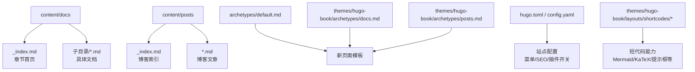
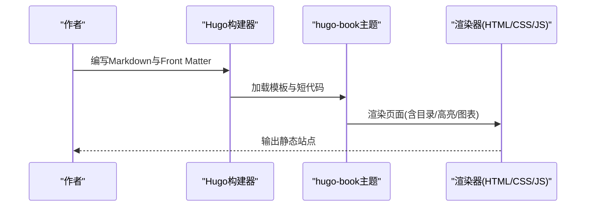
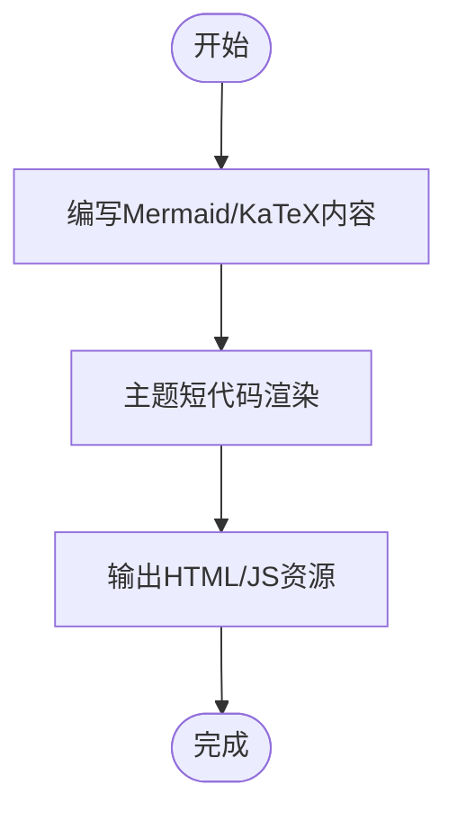
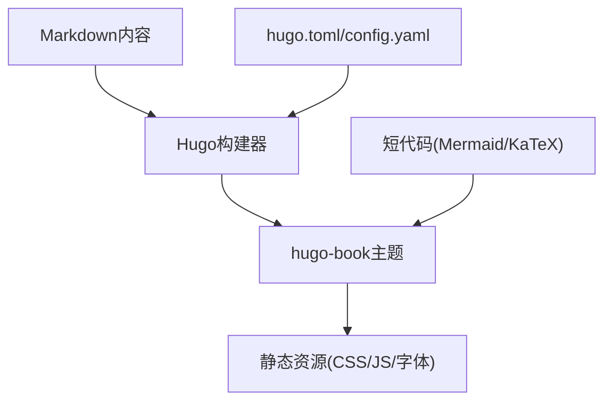

# Markdown写作规范

<cite>
**本文引用的文件**   
- [archetypes/default.md](file://archetypes/default.md)
- [content/docs/_index.md](file://content/docs/_index.md)
- [content/posts/_index.md](file://content/posts/_index.md)
- [content/posts/hugoisforlovers.md](file://content/posts/hugoisforlovers.md)
- [config.yaml](file://config.yaml)
- [hugo.toml](file://hugo.toml)
- [themes/hugo-book/archetypes/docs.md](file://themes/hugo-book/archetypes/docs.md)
- [themes/hugo-book/archetypes/posts.md](file://themes/hugo-book/archetypes/posts.md)
- [themes/hugo-book/layouts/shortcodes/mermaid.html](file://themes/hugo-book/layouts/shortcodes/mermaid.html)
- [themes/hugo-book/layouts/shortcodes/katex.html](file://themes/hugo-book/layouts/shortcodes/katex.html)
- [themes/hugo-book/layouts/partials/docs/toc.html](file://themes/hugo-book/layouts/partials/docs/toc.html)
</cite>

## 目录
1. [简介](#简介)
2. [项目结构](#项目结构)
3. [核心组件](#核心组件)
4. [架构总览](#架构总览)
5. [详细组件分析](#详细组件分析)
6. [依赖分析](#依赖分析)
7. [性能考虑](#性能考虑)
8. [故障排查指南](#故障排查指南)
9. [结论](#结论)
10. [附录](#附录)

## 简介
本规范面向在Hugo项目中编写高质量Markdown内容的作者与维护者，目标是统一文档与博客的写作风格、元数据配置与排版约定，确保内容可维护、可检索、可复用。本文覆盖：
- Markdown语法基础（标题层级、段落、列表、表格、链接等）
- Front Matter元数据最佳实践（title、date、description、tags、categories等）
- 不同内容类型的模板示例（技术文档、博客文章、教程）
- 代码块语法高亮与多语言支持
- 图片插入、引用块、脚注等特殊格式
- 实际写作示例与常见错误避免

## 项目结构
本项目采用Hugo + hugo-book主题的结构，内容按“类型+领域”组织：
- content/docs：文档集合，按主题分目录，每个目录通常包含_index.md作为章节首页
- content/posts：博客文章集合，每篇文章一个Markdown文件
- archetypes：默认内容模板，用于快速生成新页面
- themes/hugo-book：主题提供短代码、布局与样式，包括Mermaid图表、KaTeX公式、目录等能力

图示来源
- [content/docs/_index.md:1-20](file://content/docs/_index.md#L1-L20)
- [content/posts/_index.md:1-20](file://content/posts/_index.md#L1-L20)
- [archetypes/default.md:1-20](file://archetypes/default.md#L1-L20)
- [themes/hugo-book/archetypes/docs.md:1-20](file://themes/hugo-book/archetypes/docs.md#L1-L20)
- [themes/hugo-book/archetypes/posts.md:1-20](file://themes/hugo-book/archetypes/posts.md#L1-L20)
- [hugo.toml:1-30](file://hugo.toml#L1-L30)
- [config.yaml:1-30](file://config.yaml#L1-L30)

章节来源
- [content/docs/_index.md:1-20](file://content/docs/_index.md#L1-L20)
- [content/posts/_index.md:1-20](file://content/posts/_index.md#L1-L20)
- [archetypes/default.md:1-20](file://archetypes/default.md#L1-L20)
- [themes/hugo-book/archetypes/docs.md:1-20](file://themes/hugo-book/archetypes/docs.md#L1-L20)
- [themes/hugo-book/archetypes/posts.md:1-20](file://themes/hugo-book/archetypes/posts.md#L1-L20)
- [hugo.toml:1-30](file://hugo.toml#L1-L30)
- [config.yaml:1-30](file://config.yaml#L1-L30)

## 核心组件
- 内容类型与模板
  - 文档类型：使用主题提供的文档模板，便于自动生成目录、侧边栏与导航
  - 博客类型：使用主题提供的博客模板，便于展示日期、标签、分类等元信息
- 元数据（Front Matter）
  - 常用字段：title、date、description、tags、categories、weight、menu
  - 建议：为每篇内容填写title与description；合理设置tags与categories以利于归档与搜索
- 短代码与扩展
  - Mermaid：流程图、时序图、类图等
  - KaTeX：数学公式渲染
  - 提示框、按钮、折叠面板等增强体验
- 目录与导航
  - 自动目录：根据标题层级生成
  - 侧边栏：基于目录结构与权重排序

章节来源
- [themes/hugo-book/archetypes/docs.md:1-20](file://themes/hugo-book/archetypes/docs.md#L1-L20)
- [themes/hugo-book/archetypes/posts.md:1-20](file://themes/hugo-book/archetypes/posts.md#L1-L20)
- [themes/hugo-book/layouts/shortcodes/mermaid.html:1-20](file://themes/hugo-book/layouts/shortcodes/mermaid.html#L1-L20)
- [themes/hugo-book/layouts/shortcodes/katex.html:1-20](file://themes/hugo-book/layouts/shortcodes/katex.html#L1-L20)
- [themes/hugo-book/layouts/partials/docs/toc.html:1-20](file://themes/hugo-book/layouts/partials/docs/toc.html#L1-L20)

## 架构总览
下图展示了从内容到页面的关键流程：作者编写Markdown并配置Front Matter，Hugo解析并渲染，主题通过短代码与布局增强呈现效果。

图示来源
- [hugo.toml:1-30](file://hugo.toml#L1-L30)
- [config.yaml:1-30](file://config.yaml#L1-L30)
- [themes/hugo-book/layouts/partials/docs/toc.html:1-20](file://themes/hugo-book/layouts/partials/docs/toc.html#L1-L20)
- [themes/hugo-book/layouts/shortcodes/mermaid.html:1-20](file://themes/hugo-book/layouts/shortcodes/mermaid.html#L1-L20)
- [themes/hugo-book/layouts/shortcodes/katex.html:1-20](file://themes/hugo-book/layouts/shortcodes/katex.html#L1-L20)

## 详细组件分析

### Markdown语法基础
- 标题层级
  - 使用#至######表示层级，保持语义清晰，避免跨级跳跃
  - 建议：一级标题用于页面主标题，二级用于主要章节，三级及以下用于细分小节
- 段落与强调
  - 空行分隔段落；使用粗体与斜体进行强调，避免过度使用
- 列表
  - 有序列表与无序列表混用时注意缩进一致
  - 列表项内可嵌套子列表或段落
- 表格
  - 表头与对齐符需完整；长文本建议使用滚动容器或拆分说明
- 链接
  - 站内链接优先使用相对路径；外部链接建议添加rel="noopener noreferrer"
- 引用块与脚注
  - 引用块用于注释或补充说明；脚注用于参考文献与备注

章节来源
- [content/posts/hugoisforlovers.md:1-20](file://content/posts/hugoisforlovers.md#L1-L20)

### Front Matter元数据配置
- 必备字段
  - title：页面标题，影响SEO与分享卡片
  - date：发布时间，用于排序与归档
- 推荐字段
  - description：页面摘要，提升搜索引擎与社交分享质量
  - tags：关键词标签，便于聚合与检索
  - categories：分类，用于结构化导航
  - weight：排序权重，控制目录顺序
  - menu：是否加入主菜单或侧边栏
- 最佳实践
  - 标题简洁明确，描述不超过两句话
  - 标签小而精，避免同义重复
  - 分类层级不宜过深，保持扁平化

章节来源
- [archetypes/default.md:1-20](file://archetypes/default.md#L1-L20)
- [themes/hugo-book/archetypes/docs.md:1-20](file://themes/hugo-book/archetypes/docs.md#L1-L20)
- [themes/hugo-book/archetypes/posts.md:1-20](file://themes/hugo-book/archetypes/posts.md#L1-L20)

### 内容类型模板示例
- 技术文档
  - 使用文档模板，自动生成目录与侧边栏
  - 建议：每节有明确目标，配合图示与示例
- 博客文章
  - 使用博客模板，突出时间线与标签
  - 建议：开头给出摘要与阅读时长，结尾总结与参考
- 教程
  - 步骤化结构，前置条件、操作步骤、验证结果
  - 建议：每步附带截图或命令片段，失败场景给出排错指引

章节来源
- [themes/hugo-book/archetypes/docs.md:1-20](file://themes/hugo-book/archetypes/docs.md#L1-L20)
- [themes/hugo-book/archetypes/posts.md:1-20](file://themes/hugo-book/archetypes/posts.md#L1-L20)

### 代码块与语法高亮
- 语法高亮
  - 使用三反引号包裹代码块，指定语言标识
  - 建议：选择最贴近的语言标识以获得最佳高亮效果
- 多语言支持
  - 在Front Matter中声明language或使用主题的多语言配置
  - 同一内容可按语言拆分为不同文件，或通过参数切换显示
- 复制与行号
  - 主题通常提供复制按钮与行号功能，可在配置中启用

章节来源
- [hugo.toml:1-30](file://hugo.toml#L1-L30)
- [config.yaml:1-30](file://config.yaml#L1-L30)

### 图片、引用块与脚注
- 图片插入
  - 推荐使用相对路径指向static或assets目录
  - 为图片添加alt属性以提升可访问性与SEO
- 引用块
  - 使用>前缀创建引用，适合摘录与注释
- 脚注
  - 使用[^n]标记脚注并在文末定义，避免正文冗长

章节来源
- [content/posts/hugoisforlovers.md:1-20](file://content/posts/hugoisforlovers.md#L1-L20)

### 图表与公式（短代码）
- Mermaid图表
  - 使用mermaid短代码嵌入流程图、时序图、类图等
  - 建议：图表简洁明了，标注关键节点与流向
- KaTeX公式
  - 使用katex短代码渲染数学公式
  - 建议：复杂公式拆分为多行，变量命名保持一致

图示来源
- [themes/hugo-book/layouts/shortcodes/mermaid.html:1-20](file://themes/hugo-book/layouts/shortcodes/mermaid.html#L1-L20)
- [themes/hugo-book/layouts/shortcodes/katex.html:1-20](file://themes/hugo-book/layouts/shortcodes/katex.html#L1-L20)

章节来源
- [themes/hugo-book/layouts/shortcodes/mermaid.html:1-20](file://themes/hugo-book/layouts/shortcodes/mermaid.html#L1-L20)
- [themes/hugo-book/layouts/shortcodes/katex.html:1-20](file://themes/hugo-book/layouts/shortcodes/katex.html#L1-L20)

### 目录与导航
- 自动目录
  - 根据标题层级生成，建议在长文档开启
- 侧边栏与菜单
  - 使用_front matter中的menu与weight控制显示与排序
- 最佳实践
  - 标题层级清晰，避免过长标题导致目录拥挤

章节来源
- [themes/hugo-book/layouts/partials/docs/toc.html:1-20](file://themes/hugo-book/layouts/partials/docs/toc.html#L1-L20)

## 依赖分析
- 内容与主题
  - 内容文件依赖主题提供的模板与短代码
  - 主题通过layouts与assets提供渲染能力
- 配置与构建
  - hugo.toml与config.yaml决定站点行为（如菜单、SEO、插件开关）
- 外部资源
  - 字体、图标、搜索脚本由主题静态资源提供

图示来源
- [hugo.toml:1-30](file://hugo.toml#L1-L30)
- [config.yaml:1-30](file://config.yaml#L1-L30)
- [themes/hugo-book/layouts/shortcodes/mermaid.html:1-20](file://themes/hugo-book/layouts/shortcodes/mermaid.html#L1-L20)
- [themes/hugo-book/layouts/shortcodes/katex.html:1-20](file://themes/hugo-book/layouts/shortcodes/katex.html#L1-L20)

章节来源
- [hugo.toml:1-30](file://hugo.toml#L1-L30)
- [config.yaml:1-30](file://config.yaml#L1-L30)

## 性能考虑
- 图片优化
  - 使用合适尺寸与格式（WebP/AVIF），避免过大原图
- 代码块与图表
  - 控制代码块数量与大小；复杂图表按需加载
- 搜索与脚本
  - 按需启用搜索与第三方脚本，减少首屏负载
- 缓存与CDN
  - 利用浏览器缓存与CDN加速静态资源

[本节为通用指导，不直接分析具体文件]

## 故障排查指南
- 标题未生成目录
  - 检查标题层级是否正确，避免跨级
- 代码块无高亮
  - 确认语言标识正确且主题已启用高亮
- 图表不显示
  - 检查mermaid短代码语法与闭合符号
- 公式渲染异常
  - 检查katex短代码与LaTeX语法
- 链接失效
  - 使用相对路径或绝对URL，确保资源存在

章节来源
- [themes/hugo-book/layouts/shortcodes/mermaid.html:1-20](file://themes/hugo-book/layouts/shortcodes/mermaid.html#L1-L20)
- [themes/hugo-book/layouts/shortcodes/katex.html:1-20](file://themes/hugo-book/layouts/shortcodes/katex.html#L1-L20)

## 结论
遵循本规范可显著提升内容质量与一致性：清晰的标题层级、规范的元数据、合理的模板选择、完善的代码与图表支持，以及良好的可访问性与SEO。建议团队在新增内容时对照本规范自查，并在评审阶段关注可读性与可维护性。

[本节为总结，不直接分析具体文件]

## 附录
- 写作清单
  - 标题层级清晰、段落紧凑
  - 元数据完整（title、date、description、tags、categories）
  - 代码块语言标识正确，必要时提供运行环境说明
  - 图片具备alt属性，链接有效
  - 图表与公式简洁准确，必要时附解释
- 常见错误避免
  - 避免滥用粗体与斜体
  - 避免表格过长导致移动端不可读
  - 避免外链过多且无安全属性
  - 避免图表与公式过于复杂影响加载

[本节为补充说明，不直接分析具体文件]