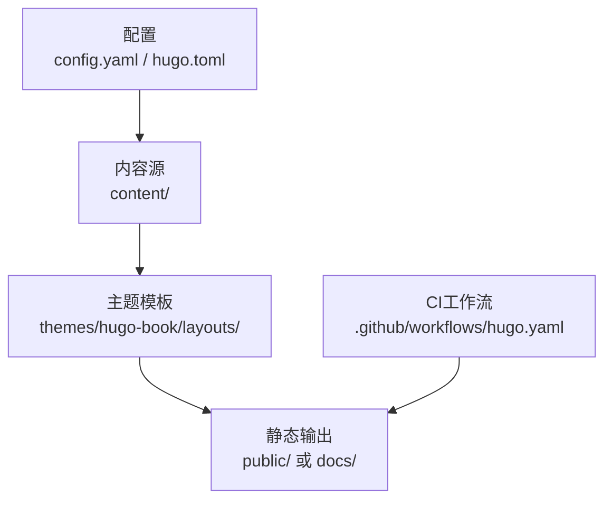
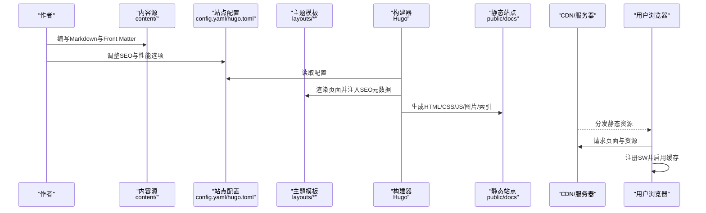
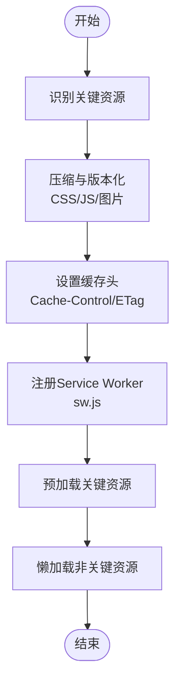
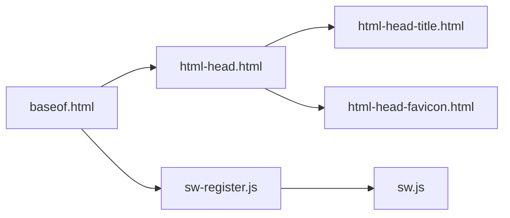

# SEO优化与性能调优

<cite>
**本文引用的文件**   
- [config.yaml](file://config.yaml)
- [hugo.toml](file://hugo.toml)
- [README.md](file://README.md)
- [.github/workflows/hugo.yaml](file://.github/workflows/hugo.yaml)
- [themes/hugo-book/layouts/partials/docs/html-head.html](file://themes/hugo-book/layouts/partials/docs/html-head.html)
- [themes/hugo-book/layouts/partials/docs/html-head-title.html](file://themes/hugo-book/layouts/partials/docs/html-head-title.html)
- [themes/hugo-book/layouts/partials/docs/html-head-favicon.html](file://themes/hugo-book/layouts/partials/docs/html-head-favicon.html)
- [themes/hugo-book/layouts/_default/baseof.html](file://themes/hugo-book/layouts/_default/baseof.html)
- [themes/hugo-book/assets/sw.js](file://themes/hugo-book/assets/sw.js)
- [themes/hugo-book/assets/sw-register.js](file://themes/hugo-book/assets/sw-register.js)
- [content/docs/_index.md](file://content/docs/_index.md)
- [content/posts/_index.md](file://content/posts/_index.md)
</cite>

## 目录
1. [简介](#简介)
2. [项目结构](#项目结构)
3. [核心组件](#核心组件)
4. [架构总览](#架构总览)
5. [详细组件分析](#详细组件分析)
6. [依赖分析](#依赖分析)
7. [性能考虑](#性能考虑)
8. [故障排查指南](#故障排查指南)
9. [结论](#结论)
10. [附录](#附录)

## 简介
本指南面向使用 Hugo + hugo-book 主题的技术文档作者，聚焦“SEO优化”和“性能调优”两大目标。内容覆盖：
- SEO最佳实践：标题、描述、关键词策略、结构化数据标记、站点地图与 robots.txt、Open Graph/社交分享标签等
- Hugo SEO相关配置：站点地图生成、多语言与国际化、URL规范化、SRI与缓存策略
- 性能优化：资源压缩、缓存策略、图片优化、CSS/JS最小化、预加载与懒加载
- 移动端适配与响应式设计要点
- 分析工具集成：Google Analytics、百度统计等
- 性能监控与诊断方法：构建期与运行期指标、持续改进闭环

## 项目结构
本项目采用Hugo静态站点生成器，主题使用 hugo-book。关键目录与职责：
- 根级配置：config.yaml、hugo.toml（站点元信息、输出格式、菜单、主题、插件等）
- 内容：content/（文档与文章），通过Front Matter控制SEO字段
- 主题：themes/hugo-book/（布局、模板、部分片段、PWA Service Worker等）
- 工作流：.github/workflows/hugo.yaml（CI构建与部署）
- 输出：public/ 或 docs/（取决于部署路径与baseURL设置）

图表来源
- [config.yaml:1-200](file://config.yaml#L1-L200)
- [hugo.toml:1-200](file://hugo.toml#L1-L200)
- [.github/workflows/hugo.yaml:1-200](file://.github/workflows/hugo.yaml#L1-L200)

章节来源
- [README.md:1-200](file://README.md#L1-L200)
- [config.yaml:1-200](file://config.yaml#L1-L200)
- [hugo.toml:1-200](file://hugo.toml#L1-L200)

## 核心组件
- 站点配置与SEO开关
  - 站点地图、robots、多语言、URL规范化、SRI、资源管道等由配置驱动
- 主题头部注入点
  - html-head.html、html-head-title.html、html-head-favicon.html 提供SEO元数据注入位置
- PWA与服务端缓存
  - sw.js 与 sw-register.js 提供离线与缓存能力，影响首屏与重复访问性能
- CI构建与部署
  - GitHub Actions 负责构建与发布，确保可复现的产物与缓存命中

章节来源
- [themes/hugo-book/layouts/partials/docs/html-head.html](file://themes/hugo-book/layouts/partials/docs/html-head.html)
- [themes/hugo-book/layouts/partials/docs/html-head-title.html](file://themes/hugo-book/layouts/partials/docs/html-head-title.html)
- [themes/hugo-book/layouts/partials/docs/html-head-favicon.html](file://themes/hugo-book/layouts/partials/docs/html-head-favicon.html)
- [themes/hugo-book/assets/sw.js](file://themes/hugo-book/assets/sw.js)
- [themes/hugo-book/assets/sw-register.js](file://themes/hugo-book/assets/sw-register.js)
- [.github/workflows/hugo.yaml:1-200](file://.github/workflows/hugo.yaml#L1-L200)

## 架构总览
下图展示从配置到输出的端到端流程，以及SEO与性能的关键节点。

图表来源
- [config.yaml:1-200](file://config.yaml#L1-L200)
- [hugo.toml:1-200](file://hugo.toml#L1-L200)
- [themes/hugo-book/layouts/_default/baseof.html](file://themes/hugo-book/layouts/_default/baseof.html)
- [themes/hugo-book/assets/sw.js](file://themes/hugo-book/assets/sw.js)
- [themes/hugo-book/assets/sw-register.js](file://themes/hugo-book/assets/sw-register.js)

## 详细组件分析

### SEO基础与Hugo实现
- 标题与描述
  - 在内容Front Matter中设置 title、description；主题模板会在<head>中注入对应标签
  - 建议：标题包含核心关键词且简洁明确；描述控制在合理长度，突出价值主张
- 关键词策略
  - 现代搜索引擎对keywords标签权重较低，但仍可在Front Matter中维护关键词列表用于内部检索与一致性检查
- 结构化数据
  - 建议在单页模板中为文章添加JSON-LD（如Article、BreadcrumbList），提升搜索结果富摘要质量
- Open Graph与社交分享
  - 在html-head中注入og:title、og:description、og:image、twitter:*等标签，提高社交平台预览效果
- 站点地图与robots
  - 启用sitemap.xml；根据部署路径配置baseURL与relativeURLs；必要时自定义robots.txt以控制抓取
- URL规范化与多语言
  - 使用canonical链接避免重复内容；多语言站点需为每语种设置独立URL与hreflang

章节来源
- [themes/hugo-book/layouts/partials/docs/html-head.html](file://themes/hugo-book/layouts/partials/docs/html-head.html)
- [themes/hugo-book/layouts/partials/docs/html-head-title.html](file://themes/hugo-book/layouts/partials/docs/html-head-title.html)
- [themes/hugo-book/layouts/partials/docs/html-head-favicon.html](file://themes/hugo-book/layouts/partials/docs/html-head-favicon.html)
- [content/docs/_index.md:1-200](file://content/docs/_index.md#L1-L200)
- [content/posts/_index.md:1-200](file://content/posts/_index.md#L1-L200)

### Hugo SEO相关配置项
- 站点地图
  - 启用 sitemap 并在部署时暴露 sitemap.xml
- robots.txt
  - 若需要，将自定义 robots.txt 放入 static/ 或在模板中动态生成
- Open Graph与Twitter Card
  - 在主题头部注入相应meta标签，统一全局默认值，并在Front Matter覆盖
- Canonical与hreflang
  - 为每个页面生成canonical；多语言站点配置hreflang
- SRI与子资源完整性
  - 开启SRI以提升第三方脚本安全性
- baseURL与相对路径
  - 根据部署路径正确设置baseURL与relativeURLs，保证所有链接与资源路径有效

章节来源
- [config.yaml:1-200](file://config.yaml#L1-L200)
- [hugo.toml:1-200](file://hugo.toml#L1-L200)

### 性能优化：资源与缓存
- CSS/JS最小化与合并
  - 利用Hugo资源管道进行压缩与版本化；按需加载非关键脚本
- 图片优化
  - 使用WebP/AVIF格式；按需生成不同尺寸；懒加载首屏外图片
- 预加载与优先级
  - 对关键字体、首屏样式使用preload；对非关键资源使用defer或async
- 缓存策略
  - 服务端/CDN设置强缓存与协商缓存；结合Service Worker缓存静态资源
- 构建期优化
  - 关闭不必要的插件；仅生成必要页面；使用增量构建减少CI时间

图表来源
- [themes/hugo-book/assets/sw.js](file://themes/hugo-book/assets/sw.js)
- [themes/hugo-book/assets/sw-register.js](file://themes/hugo-book/assets/sw-register.js)

章节来源
- [themes/hugo-book/assets/sw.js](file://themes/hugo-book/assets/sw.js)
- [themes/hugo-book/assets/sw-register.js](file://themes/hugo-book/assets/sw-register.js)

### 移动端适配与响应式设计
- 视口与缩放
  - 确保<meta name="viewport">正确设置，避免过度缩放
- 触摸与交互
  - 按钮与链接具备足够点击区域；避免悬停依赖
- 字体与可读性
  - 使用相对单位；确保对比度与行高合适
- 图片与媒体
  - 使用srcset/picture元素适配不同屏幕密度
- 测试与验证
  - 使用Chrome DevTools设备模拟与Lighthouse进行移动端体验评估

[本节为通用指导，不直接分析具体文件]

### 分析工具集成
- Google Analytics
  - 在html-head中插入GA脚本；在生产环境启用，开发环境禁用
- 百度统计
  - 在html-head中插入百度统计代码；注意隐私合规与用户同意
- 埋点与事件
  - 对关键交互（搜索、下载、外链）进行事件上报，便于后续优化

章节来源
- [themes/hugo-book/layouts/partials/docs/html-head.html](file://themes/hugo-book/layouts/partials/docs/html-head.html)

### 构建与部署流水线中的SEO与性能
- CI构建
  - 固定Hugo版本；缓存依赖与模块；并行构建加速
- 产物校验
  - 构建后检查sitemap.xml、robots.txt、OG标签、canonical是否存在
- 部署策略
  - 使用CDN+缓存；开启HTTP/2或HTTP/3；Gzip/Brotli压缩

章节来源
- [.github/workflows/hugo.yaml:1-200](file://.github/workflows/hugo.yaml#L1-L200)

## 依赖分析
- 主题与模板
  - baseof.html作为基础布局，被list/single等模板继承
  - html-head系列partial集中管理<head>内容，是SEO注入的核心入口
- 运行时依赖
  - Service Worker（sw.js）与注册脚本（sw-register.js）增强缓存与离线能力
- 外部依赖
  - 分析脚本（GA/百度统计）、第三方字体与图标库等

图表来源
- [themes/hugo-book/layouts/_default/baseof.html](file://themes/hugo-book/layouts/_default/baseof.html)
- [themes/hugo-book/layouts/partials/docs/html-head.html](file://themes/hugo-book/layouts/partials/docs/html-head.html)
- [themes/hugo-book/layouts/partials/docs/html-head-title.html](file://themes/hugo-book/layouts/partials/docs/html-head-title.html)
- [themes/hugo-book/layouts/partials/docs/html-head-favicon.html](file://themes/hugo-book/layouts/partials/docs/html-head-favicon.html)
- [themes/hugo-book/assets/sw-register.js](file://themes/hugo-book/assets/sw-register.js)
- [themes/hugo-book/assets/sw.js](file://themes/hugo-book/assets/sw.js)

章节来源
- [themes/hugo-book/layouts/_default/baseof.html](file://themes/hugo-book/layouts/_default/baseof.html)
- [themes/hugo-book/layouts/partials/docs/html-head.html](file://themes/hugo-book/layouts/partials/docs/html-head.html)
- [themes/hugo-book/assets/sw.js](file://themes/hugo-book/assets/sw.js)
- [themes/hugo-book/assets/sw-register.js](file://themes/hugo-book/assets/sw-register.js)

## 性能考虑
- 首屏加载
  - 关键CSS内联、延迟加载非关键JS、预加载关键字体与首图
- 网络与缓存
  - 启用HTTP/2或HTTP/3；合理设置Cache-Control与Etag；使用CDN就近分发
- 资源体积
  - 图片转WebP/AVIF；按需裁剪；移除未使用的CSS/JS
- 渲染性能
  - 减少重排与回流；避免阻塞渲染的同步脚本
- 监控与回归
  - 建立Lighthouse基线；在CI中执行性能预算检查

[本节为通用指导，不直接分析具体文件]

## 故障排查指南
- 站点地图缺失
  - 检查是否启用sitemap；确认部署路径下存在sitemap.xml
- robots.txt拦截
  - 检查robots规则是否误屏蔽重要页面；确认baseURL与相对路径
- OG标签无效
  - 检查html-head注入逻辑；确认图片可达且尺寸符合平台要求
- canonical冲突
  - 检查多语言与分页场景下的canonical是否正确
- Service Worker不生效
  - 检查sw.js与sw-register.js是否随页面加载；确认HTTPS与MIME类型
- 分析数据为空
  - 检查脚本是否在生产环境加载；确认域名与ID配置正确

章节来源
- [themes/hugo-book/layouts/partials/docs/html-head.html](file://themes/hugo-book/layouts/partials/docs/html-head.html)
- [themes/hugo-book/assets/sw.js](file://themes/hugo-book/assets/sw.js)
- [themes/hugo-book/assets/sw-register.js](file://themes/hugo-book/assets/sw-register.js)

## 结论
通过系统化的SEO配置与严格的性能优化策略，技术文档可获得更好的搜索可见性与用户体验。建议将SEO与性能纳入日常写作规范与CI流程，形成持续优化的闭环。

[本节为总结性内容，不直接分析具体文件]

## 附录
- 快速清单
  - Front Matter：title、description、tags、categories
  - 主题头部：OG/Twitter、canonical、favicon
  - 站点地图与robots：启用并校验
  - 资源优化：压缩、懒加载、预加载
  - 缓存：服务端/CDN/SW
  - 分析：GA/百度统计接入与验证
  - 移动端：viewport、触控、可读性
  - CI：构建稳定、产物校验、性能预算

[本节为补充说明，不直接分析具体文件]