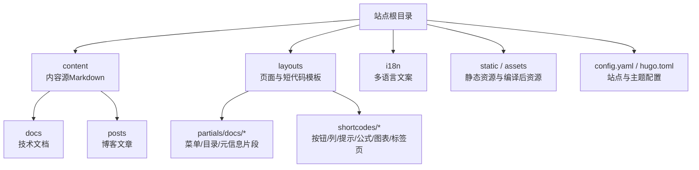
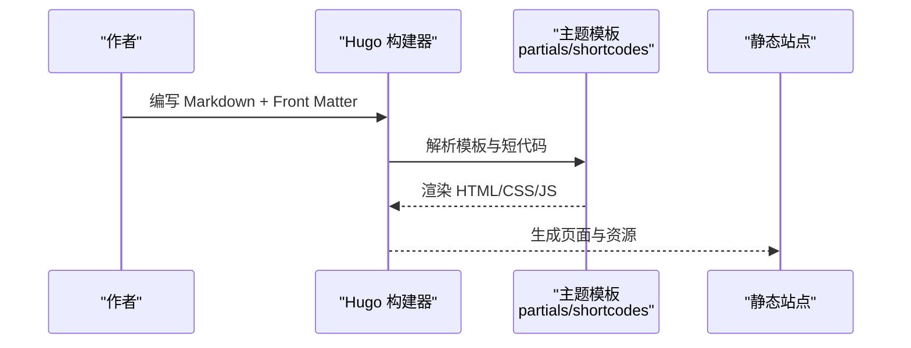
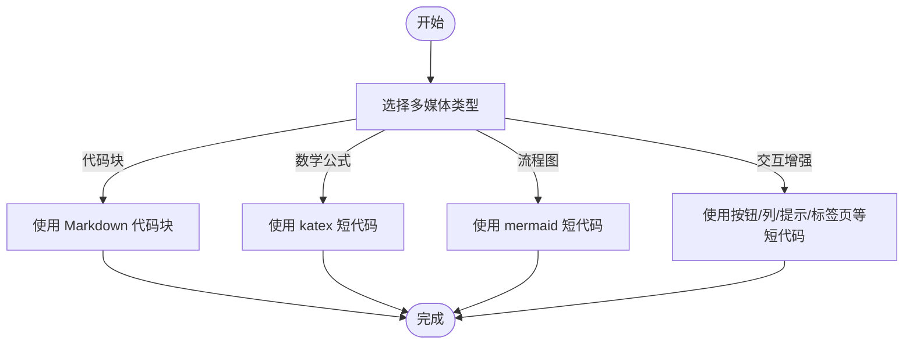
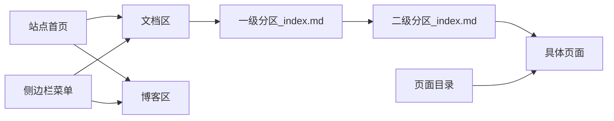
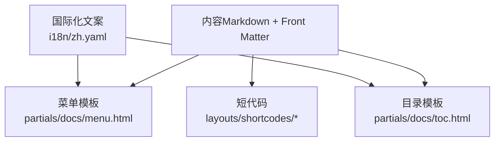

# 内容创作指南

<cite>
**本文引用的文件**   
- [config.yaml](file://config.yaml)
- [hugo.toml](file://hugo.toml)
- [archetypes/default.md](file://archetypes/default.md)
- [themes/hugo-book/archetypes/docs.md](file://themes/hugo-book/archetypes/docs.md)
- [themes/hugo-book/archetypes/posts.md](file://themes/hugo-book/archetypes/posts.md)
- [content/_index.md](file://content/_index.md)
- [content/docs/_index.md](file://content/docs/_index.md)
- [content/posts/_index.md](file://content/posts/_index.md)
- [content/docs/50-linux/_index.md](file://content/docs/50-linux/_index.md)
- [content/docs/51-k8s/_index.md](file://content/docs/51-k8s/_index.md)
- [content/docs/60-AI/_index.md](file://content/docs/60-AI/_index.md)
- [content/docs/70-CNCF/_index.md](file://content/docs/70-CNCF/_index.md)
- [content/docs/80-Programming/_index.md](file://content/docs/80-Programming/_index.md)
- [content/docs/90-Tools/_index.md](file://content/docs/90-Tools/_index.md)
- [content/docs/99-English/_index.md](file://content/docs/99-English/_index.md)
- [content/docs/52-istio/_index.md](file://content/docs/52-istio/_index.md)
- [content/docs/52-istio/a.yaml](file://content/docs/52-istio/a.yaml)
- [layouts/partials/docs/menu.html](file://layouts/partials/docs/menu.html)
- [layouts/partials/docs/toc.html](file://layouts/partials/docs/toc.html)
- [layouts/partials/docs/post-meta.html](file://layouts/partials/docs/post-meta.html)
- [layouts/shortcodes/button.html](file://layouts/shortcodes/button.html)
- [layouts/shortcodes/columns.html](file://layouts/shortcodes/columns.html)
- [layouts/shortcodes/details.html](file://layouts/shortcodes/details.html)
- [layouts/shortcodes/hint.html](file://layouts/shortcodes/hint.html)
- [layouts/shortcodes/katex.html](file://layouts/shortcodes/katex.html)
- [layouts/shortcodes/mermaid.html](file://layouts/shortcodes/mermaid.html)
- [layouts/shortcodes/tab.html](file://layouts/shortcodes/tab.html)
- [layouts/shortcodes/tabs.html](file://layouts/shortcodes/tabs.html)
- [layouts/shortcodes/section.html](file://layouts/shortcodes/section.html)
- [i18n/zh.yaml](file://i18n/zh.yaml)
</cite>

## 目录
1. [简介](#简介)
2. [项目结构](#项目结构)
3. [核心组件](#核心组件)
4. [架构总览](#架构总览)
5. [详细组件分析](#详细组件分析)
6. [依赖关系分析](#依赖关系分析)
7. [性能与优化](#性能与优化)
8. [故障排查](#故障排查)
9. [结论](#结论)
10. [附录：模板与示例路径](#附录模板与示例路径)

## 简介
本指南面向内容创作者，帮助你在基于 Hugo Book 主题的站点中高效编写技术文档与博客文章。你将学会：
- 使用 Markdown 与 Front Matter 组织内容
- 配置标题、日期、分类、标签等元数据
- 创建不同类型的内容（文档、教程、代码示例）
- 集成代码块、数学公式（KaTeX）、流程图（Mermaid）等多媒体元素
- 规划目录结构与导航（菜单、目录、面包屑）
- 使用短代码增强表达（按钮、列布局、提示框、标签页等）
- 实践 SEO 优化、图片资源管理与性能优化技巧
- 快速上手：参考提供的模板与示例路径

## 项目结构
本项目采用 Hugo 静态站点生成器与 hugo-book 主题。内容位于 content 目录，按“文档”和“博客”两类进行组织；主题能力通过 layouts 与 shortcodes 扩展；国际化文案在 i18n 下管理。

图示来源
- [config.yaml](file://config.yaml)
- [hugo.toml](file://hugo.toml)
- [content/_index.md](file://content/_index.md)
- [content/docs/_index.md](file://content/docs/_index.md)
- [content/posts/_index.md](file://content/posts/_index.md)
- [layouts/partials/docs/menu.html](file://layouts/partials/docs/menu.html)
- [layouts/partials/docs/toc.html](file://layouts/partials/docs/toc.html)
- [layouts/shortcodes/button.html](file://layouts/shortcodes/button.html)
- [layouts/shortcodes/katex.html](file://layouts/shortcodes/katex.html)
- [layouts/shortcodes/mermaid.html](file://layouts/shortcodes/mermaid.html)

章节来源
- [config.yaml](file://config.yaml)
- [hugo.toml](file://hugo.toml)
- [content/_index.md](file://content/_index.md)
- [content/docs/_index.md](file://content/docs/_index.md)
- [content/posts/_index.md](file://content/posts/_index.md)

## 核心组件
- 内容类型与目录
  - docs：技术文档集合，支持多级子目录与索引页
  - posts：博客文章集合，适合时间线展示
- 元数据（Front Matter）
  - 常用字段：title、date、categories、tags、description、weight、menu 等
- 导航与目录
  - 侧边栏菜单：由 partials/docs/menu.html 渲染
  - 页面内目录：由 partials/docs/toc.html 渲染
- 多媒体与增强
  - 代码块：标准 Markdown 语法
  - 数学公式：KaTeX 短代码 katex
  - 流程图：Mermaid 短代码 mermaid
  - 交互增强：button、columns、details、hint、tabs/tab、section 等

章节来源
- [layouts/partials/docs/menu.html](file://layouts/partials/docs/menu.html)
- [layouts/partials/docs/toc.html](file://layouts/partials/docs/toc.html)
- [layouts/shortcodes/katex.html](file://layouts/shortcodes/katex.html)
- [layouts/shortcodes/mermaid.html](file://layouts/shortcodes/mermaid.html)
- [layouts/shortcodes/button.html](file://layouts/shortcodes/button.html)
- [layouts/shortcodes/columns.html](file://layouts/shortcodes/columns.html)
- [layouts/shortcodes/details.html](file://layouts/shortcodes/details.html)
- [layouts/shortcodes/hint.html](file://layouts/shortcodes/hint.html)
- [layouts/shortcodes/tab.html](file://layouts/shortcodes/tab.html)
- [layouts/shortcodes/tabs.html](file://layouts/shortcodes/tabs.html)
- [layouts/shortcodes/section.html](file://layouts/shortcodes/section.html)

## 架构总览
下图展示了从内容到页面的关键流程：作者编写 Markdown 与 Front Matter → Hugo 解析并渲染 → 主题模板与短代码参与输出 → 生成静态页面与资源。

图示来源
- [layouts/partials/docs/menu.html](file://layouts/partials/docs/menu.html)
- [layouts/partials/docs/toc.html](file://layouts/partials/docs/toc.html)
- [layouts/shortcodes/katex.html](file://layouts/shortcodes/katex.html)
- [layouts/shortcodes/mermaid.html](file://layouts/shortcodes/mermaid.html)

## 详细组件分析

### Front Matter 与元数据配置
- 推荐字段
  - title：页面标题
  - date：发布时间
  - categories/tags：分类与标签
  - description：SEO 描述
  - weight：排序权重
  - menu：侧边栏菜单项（名称、标识、父级、权重）
- 模板参考
  - 默认文章模板：archetypes/default.md
  - 文档模板：themes/hugo-book/archetypes/docs.md
  - 博客模板：themes/hugo-book/archetypes/posts.md
- 示例索引页
  - 站点首页：content/_index.md
  - 文档首页：content/docs/_index.md
  - 博客首页：content/posts/_index.md
  - 各文档分区索引：如 content/docs/50-linux/_index.md、content/docs/51-k8s/_index.md、content/docs/60-AI/_index.md、content/docs/70-CNCF/_index.md、content/docs/80-Programming/_index.md、content/docs/90-Tools/_index.md、content/docs/99-English/_index.md、content/docs/52-istio/_index.md

章节来源
- [archetypes/default.md](file://archetypes/default.md)
- [themes/hugo-book/archetypes/docs.md](file://themes/hugo-book/archetypes/docs.md)
- [themes/hugo-book/archetypes/posts.md](file://themes/hugo-book/archetypes/posts.md)
- [content/_index.md](file://content/_index.md)
- [content/docs/_index.md](file://content/docs/_index.md)
- [content/posts/_index.md](file://content/posts/_index.md)
- [content/docs/50-linux/_index.md](file://content/docs/50-linux/_index.md)
- [content/docs/51-k8s/_index.md](file://content/docs/51-k8s/_index.md)
- [content/docs/60-AI/_index.md](file://content/docs/60-AI/_index.md)
- [content/docs/70-CNCF/_index.md](file://content/docs/70-CNCF/_index.md)
- [content/docs/80-Programming/_index.md](file://content/docs/80-Programming/_index.md)
- [content/docs/90-Tools/_index.md](file://content/docs/90-Tools/_index.md)
- [content/docs/99-English/_index.md](file://content/docs/99-English/_index.md)
- [content/docs/52-istio/_index.md](file://content/docs/52-istio/_index.md)

### 内容类型与创建方法
- 技术文档（docs）
  - 建议以主题文档模板为起点，设置清晰的层级与索引页
  - 使用 weight 控制排序，使用 menu 将重要条目加入侧边栏
- 教程文章（posts）
  - 使用博客模板，强调时间与可读性
  - 配合 tags/categories 提升检索与聚合体验
- 代码示例
  - 使用标准 Markdown 代码块，标注语言以便高亮
  - 复杂示例可拆分为独立页面并通过 section 短代码聚合

章节来源
- [themes/hugo-book/archetypes/docs.md](file://themes/hugo-book/archetypes/docs.md)
- [themes/hugo-book/archetypes/posts.md](file://themes/hugo-book/archetypes/posts.md)
- [layouts/shortcodes/section.html](file://layouts/shortcodes/section.html)

### 多媒体元素集成
- 代码块
  - 使用反引号包裹代码，指定语言实现语法高亮
- 数学公式（KaTeX）
  - 使用 katex 短代码插入行内或块级公式
- 流程图（Mermaid）
  - 使用 mermaid 短代码绘制流程图、时序图等
- 其他增强
  - button：按钮
  - columns：列布局
  - details：折叠详情
  - hint：提示框
  - tabs/tab：标签页

图示来源
- [layouts/shortcodes/katex.html](file://layouts/shortcodes/katex.html)
- [layouts/shortcodes/mermaid.html](file://layouts/shortcodes/mermaid.html)
- [layouts/shortcodes/button.html](file://layouts/shortcodes/button.html)
- [layouts/shortcodes/columns.html](file://layouts/shortcodes/columns.html)
- [layouts/shortcodes/details.html](file://layouts/shortcodes/details.html)
- [layouts/shortcodes/hint.html](file://layouts/shortcodes/hint.html)
- [layouts/shortcodes/tab.html](file://layouts/shortcodes/tab.html)
- [layouts/shortcodes/tabs.html](file://layouts/shortcodes/tabs.html)

章节来源
- [layouts/shortcodes/katex.html](file://layouts/shortcodes/katex.html)
- [layouts/shortcodes/mermaid.html](file://layouts/shortcodes/mermaid.html)
- [layouts/shortcodes/button.html](file://layouts/shortcodes/button.html)
- [layouts/shortcodes/columns.html](file://layouts/shortcodes/columns.html)
- [layouts/shortcodes/details.html](file://layouts/shortcodes/details.html)
- [layouts/shortcodes/hint.html](file://layouts/shortcodes/hint.html)
- [layouts/shortcodes/tab.html](file://layouts/shortcodes/tab.html)
- [layouts/shortcodes/tabs.html](file://layouts/shortcodes/tabs.html)

### 内容组织与导航最佳实践
- 目录结构规划
  - 顶层 content/docs 与 content/posts 分离不同内容类型
  - 每个分区使用 _index.md 作为入口，提供摘要与导航
- 菜单配置
  - 在 Front Matter 的 menu 字段定义侧边栏条目（name、identifier、parent、weight）
  - 通过 partials/docs/menu.html 渲染
- 页面内目录
  - 使用 partials/docs/toc.html 自动生成目录
- 面包屑导航
  - 通过主题模板与页面层级自动推导，保持层级清晰即可

图示来源
- [content/_index.md](file://content/_index.md)
- [content/docs/_index.md](file://content/docs/_index.md)
- [content/posts/_index.md](file://content/posts/_index.md)
- [layouts/partials/docs/menu.html](file://layouts/partials/docs/menu.html)
- [layouts/partials/docs/toc.html](file://layouts/partials/docs/toc.html)

章节来源
- [content/_index.md](file://content/_index.md)
- [content/docs/_index.md](file://content/docs/_index.md)
- [content/posts/_index.md](file://content/posts/_index.md)
- [layouts/partials/docs/menu.html](file://layouts/partials/docs/menu.html)
- [layouts/partials/docs/toc.html](file://layouts/partials/docs/toc.html)

### 短代码详解
- 按钮（button）
  - 用于引导操作或跳转链接
- 列布局（columns）
  - 将内容分栏展示，提升信息密度
- 折叠详情（details）
  - 隐藏次要信息，减少首屏压力
- 提示框（hint）
  - 突出注意事项、警告或提示
- 标签页（tabs/tab）
  - 在同一页面切换不同内容块
- 聚合分区（section）
  - 动态列出某分区下的页面，便于汇总

章节来源
- [layouts/shortcodes/button.html](file://layouts/shortcodes/button.html)
- [layouts/shortcodes/columns.html](file://layouts/shortcodes/columns.html)
- [layouts/shortcodes/details.html](file://layouts/shortcodes/details.html)
- [layouts/shortcodes/hint.html](file://layouts/shortcodes/hint.html)
- [layouts/shortcodes/tab.html](file://layouts/shortcodes/tab.html)
- [layouts/shortcodes/tabs.html](file://layouts/shortcodes/tabs.html)
- [layouts/shortcodes/section.html](file://layouts/shortcodes/section.html)

### 示例与模板路径速查
- 模板
  - 默认文章模板：[archetypes/default.md](file://archetypes/default.md)
  - 文档模板：[themes/hugo-book/archetypes/docs.md](file://themes/hugo-book/archetypes/docs.md)
  - 博客模板：[themes/hugo-book/archetypes/posts.md](file://themes/hugo-book/archetypes/posts.md)
- 示例索引页
  - 站点首页：[content/_index.md](file://content/_index.md)
  - 文档首页：[content/docs/_index.md](file://content/docs/_index.md)
  - 博客首页：[content/posts/_index.md](file://content/posts/_index.md)
  - 分区索引：
    - [content/docs/50-linux/_index.md](file://content/docs/50-linux/_index.md)
    - [content/docs/51-k8s/_index.md](file://content/docs/51-k8s/_index.md)
    - [content/docs/60-AI/_index.md](file://content/docs/60-AI/_index.md)
    - [content/docs/70-CNCF/_index.md](file://content/docs/70-CNCF/_index.md)
    - [content/docs/80-Programming/_index.md](file://content/docs/80-Programming/_index.md)
    - [content/docs/90-Tools/_index.md](file://content/docs/90-Tools/_index.md)
    - [content/docs/99-English/_index.md](file://content/docs/99-English/_index.md)
    - [content/docs/52-istio/_index.md](file://content/docs/52-istio/_index.md)
- 示例资源
  - 示例 YAML 清单：[content/docs/52-istio/a.yaml](file://content/docs/52-istio/a.yaml)

章节来源
- [archetypes/default.md](file://archetypes/default.md)
- [themes/hugo-book/archetypes/docs.md](file://themes/hugo-book/archetypes/docs.md)
- [themes/hugo-book/archetypes/posts.md](file://themes/hugo-book/archetypes/posts.md)
- [content/_index.md](file://content/_index.md)
- [content/docs/_index.md](file://content/docs/_index.md)
- [content/posts/_index.md](file://content/posts/_index.md)
- [content/docs/50-linux/_index.md](file://content/docs/50-linux/_index.md)
- [content/docs/51-k8s/_index.md](file://content/docs/51-k8s/_index.md)
- [content/docs/60-AI/_index.md](file://content/docs/60-AI/_index.md)
- [content/docs/70-CNCF/_index.md](file://content/docs/70-CNCF/_index.md)
- [content/docs/80-Programming/_index.md](file://content/docs/80-Programming/_index.md)
- [content/docs/90-Tools/_index.md](file://content/docs/90-Tools/_index.md)
- [content/docs/99-English/_index.md](file://content/docs/99-English/_index.md)
- [content/docs/52-istio/_index.md](file://content/docs/52-istio/_index.md)
- [content/docs/52-istio/a.yaml](file://content/docs/52-istio/a.yaml)

## 依赖关系分析
- 内容与模板
  - 内容通过 Front Matter 与目录结构驱动主题渲染
  - 菜单与目录分别由 partials/docs/menu.html 与 partials/docs/toc.html 负责
- 短代码与功能
  - 多媒体与交互由 layouts/shortcodes/* 提供
- 国际化
  - 中文文案在 i18n/zh.yaml 中维护

图示来源
- [layouts/partials/docs/menu.html](file://layouts/partials/docs/menu.html)
- [layouts/partials/docs/toc.html](file://layouts/partials/docs/toc.html)
- [layouts/shortcodes/katex.html](file://layouts/shortcodes/katex.html)
- [layouts/shortcodes/mermaid.html](file://layouts/shortcodes/mermaid.html)
- [i18n/zh.yaml](file://i18n/zh.yaml)

章节来源
- [layouts/partials/docs/menu.html](file://layouts/partials/docs/menu.html)
- [layouts/partials/docs/toc.html](file://layouts/partials/docs/toc.html)
- [layouts/shortcodes/katex.html](file://layouts/shortcodes/katex.html)
- [layouts/shortcodes/mermaid.html](file://layouts/shortcodes/mermaid.html)
- [i18n/zh.yaml](file://i18n/zh.yaml)

## 性能与优化
- 图片资源管理
  - 将图片放入 static 或 assets 目录，按需引用，避免过大图片直接嵌入
- 缓存与压缩
  - 利用 Hugo 与主题的资源管道进行 CSS/JS 压缩与缓存
- 目录与菜单精简
  - 合理使用 weight 与 menu 控制显示范围，避免过深层级
- 搜索与交互
  - 按需启用搜索与短代码，减少不必要的脚本加载

## 故障排查
- 常见问题
  - 侧边栏未显示：检查 Front Matter 的 menu 字段与 partials/docs/menu.html 是否被正确渲染
  - 目录缺失：确认页面包含足够层级的标题，且 partials/docs/toc.html 未被覆盖
  - 公式不渲染：确保使用 katex 短代码且主题已启用 KaTeX
  - 流程图不显示：确保使用 mermaid 短代码且浏览器支持
- 调试建议
  - 查看控制台错误日志
  - 逐步禁用短代码定位问题
  - 检查 i18n 文案是否缺失导致显示异常

章节来源
- [layouts/partials/docs/menu.html](file://layouts/partials/docs/menu.html)
- [layouts/partials/docs/toc.html](file://layouts/partials/docs/toc.html)
- [layouts/shortcodes/katex.html](file://layouts/shortcodes/katex.html)
- [layouts/shortcodes/mermaid.html](file://layouts/shortcodes/mermaid.html)
- [i18n/zh.yaml](file://i18n/zh.yaml)

## 结论
通过合理的目录结构、清晰的 Front Matter 配置、丰富的短代码与主题能力，你可以高效地构建高质量的技术文档与博客。遵循本指南的最佳实践，结合示例与模板路径，能够快速上手并持续优化你的内容生态。

## 附录：模板与示例路径
- 模板
  - [archetypes/default.md](file://archetypes/default.md)
  - [themes/hugo-book/archetypes/docs.md](file://themes/hugo-book/archetypes/docs.md)
  - [themes/hugo-book/archetypes/posts.md](file://themes/hugo-book/archetypes/posts.md)
- 示例索引页
  - [content/_index.md](file://content/_index.md)
  - [content/docs/_index.md](file://content/docs/_index.md)
  - [content/posts/_index.md](file://content/posts/_index.md)
  - [content/docs/50-linux/_index.md](file://content/docs/50-linux/_index.md)
  - [content/docs/51-k8s/_index.md](file://content/docs/51-k8s/_index.md)
  - [content/docs/60-AI/_index.md](file://content/docs/60-AI/_index.md)
  - [content/docs/70-CNCF/_index.md](file://content/docs/70-CNCF/_index.md)
  - [content/docs/80-Programming/_index.md](file://content/docs/80-Programming/_index.md)
  - [content/docs/90-Tools/_index.md](file://content/docs/90-Tools/_index.md)
  - [content/docs/99-English/_index.md](file://content/docs/99-English/_index.md)
  - [content/docs/52-istio/_index.md](file://content/docs/52-istio/_index.md)
- 示例资源
  - [content/docs/52-istio/a.yaml](file://content/docs/52-istio/a.yaml)