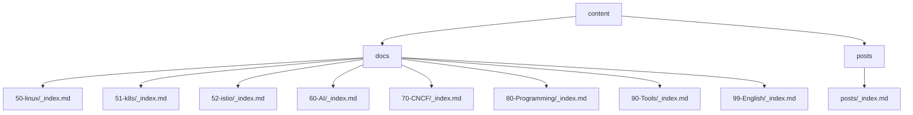
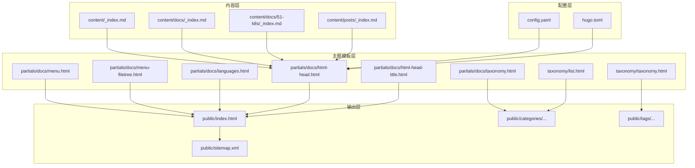
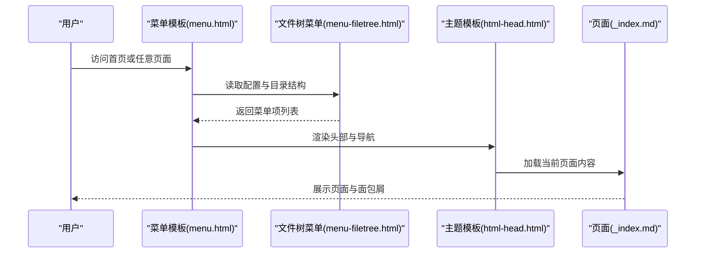
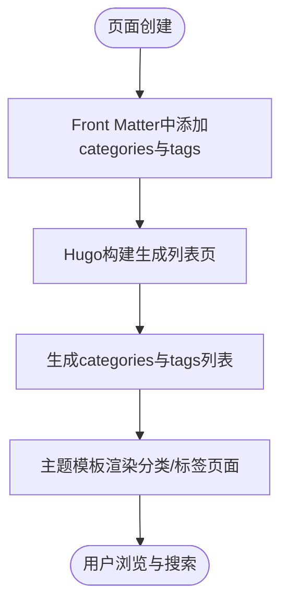
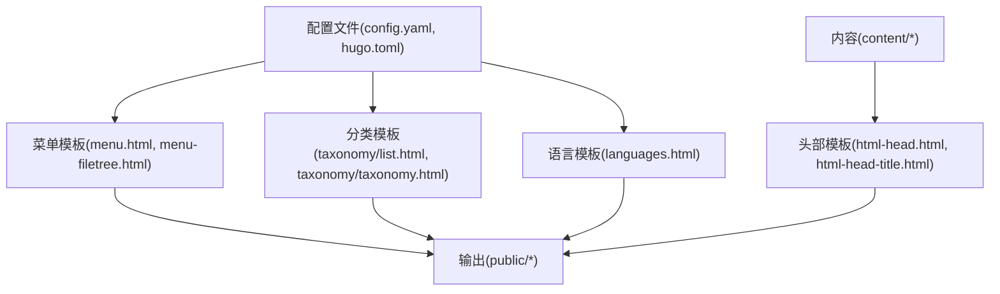

# 内容组织结构

<cite>
**本文引用的文件**   
- [config.yaml](file://config.yaml)
- [hugo.toml](file://hugo.toml)
- [content/_index.md](file://content/_index.md)
- [content/docs/_index.md](file://content/docs/_index.md)
- [content/docs/50-linux/_index.md](file://content/docs/50-linux/_index.md)
- [content/docs/51-k8s/_index.md](file://content/docs/51-k8s/_index.md)
- [content/docs/52-istio/_index.md](file://content/docs/52-istio/_index.md)
- [content/docs/60-AI/_index.md](file://content/docs/60-AI/_index.md)
- [content/docs/70-CNCF/_index.md](file://content/docs/70-CNCF/_index.md)
- [content/docs/80-Programming/_index.md](file://content/docs/80-Programming/_index.md)
- [content/docs/90-Tools/_index.md](file://content/docs/90-Tools/_index.md)
- [content/docs/99-English/_index.md](file://content/docs/99-English/_index.md)
- [content/posts/_index.md](file://content/posts/_index.md)
- [archetypes/default.md](file://archetypes/default.md)
- [themes/hugo-book/layouts/partials/docs/menu.html](file://themes/hugo-book/layouts/partials/docs/menu.html)
- [themes/hugo-book/layouts/partials/docs/menu-filetree.html](file://themes/hugo-book/layouts/partials/docs/menu-filetree.html)
- [themes/hugo-book/layouts/partials/docs/taxonomy.html](file://themes/hugo-book/layouts/partials/docs/taxonomy.html)
- [themes/hugo-book/layouts/partials/docs/languages.html](file://themes/hugo-book/layouts/partials/docs/languages.html)
- [themes/hugo-book/layouts/partials/docs/html-head.html](file://themes/hugo-book/layouts/partials/docs/html-head.html)
- [themes/hugo-book/layouts/partials/docs/html-head-title.html](file://themes/hugo-book/layouts/partials/docs/html-head-title.html)
- [themes/hugo-book/layouts/taxonomy/list.html](file://themes/hugo-book/layouts/taxonomy/list.html)
- [themes/hugo-book/layouts/taxonomy/taxonomy.html](file://themes/hugo-book/layouts/taxonomy/taxonomy.html)
</cite>

## 目录
1. [简介](#简介)
2. [项目结构](#项目结构)
3. [核心组件](#核心组件)
4. [架构总览](#架构总览)
5. [详细组件分析](#详细组件分析)
6. [依赖分析](#依赖分析)
7. [性能考虑](#性能考虑)
8. [故障排查指南](#故障排查指南)
9. [结论](#结论)
10. [附录](#附录)

## 简介
本指南面向大型技术文档项目的规划与落地，聚焦于Hugo的内容层次结构、菜单与导航设计、分类与标签体系、SEO优化以及多语言组织。结合仓库中实际的文件布局与主题模板，提供可复用的最佳实践与命名约定，帮助团队在规模增长时保持文档的可维护性与可发现性。

## 项目结构
该仓库采用“按领域分区的文档树”组织方式：顶层content下包含docs与posts两大分支；docs内部以数字前缀的领域目录划分（如50-linux、51-k8s、52-istio等），每个领域目录内放置_index.md作为索引页，子页面或子目录进一步细化。posts用于博客文章集合。

图表来源
- [content/_index.md](file://content/_index.md)
- [content/docs/_index.md](file://content/docs/_index.md)
- [content/docs/50-linux/_index.md](file://content/docs/50-linux/_index.md)
- [content/docs/51-k8s/_index.md](file://content/docs/51-k8s/_index.md)
- [content/docs/52-istio/_index.md](file://content/docs/52-istio/_index.md)
- [content/docs/60-AI/_index.md](file://content/docs/60-AI/_index.md)
- [content/docs/70-CNCF/_index.md](file://content/docs/70-CNCF/_index.md)
- [content/docs/80-Programming/_index.md](file://content/docs/80-Programming/_index.md)
- [content/docs/90-Tools/_index.md](file://content/docs/90-Tools/_index.md)
- [content/docs/99-English/_index.md](file://content/docs/99-English/_index.md)
- [content/posts/_index.md](file://content/posts/_index.md)

章节来源
- [content/_index.md](file://content/_index.md)
- [content/docs/_index.md](file://content/docs/_index.md)
- [content/docs/50-linux/_index.md](file://content/docs/50-linux/_index.md)
- [content/docs/51-k8s/_index.md](file://content/docs/51-k8s/_index.md)
- [content/docs/52-istio/_index.md](file://content/docs/52-istio/_index.md)
- [content/docs/60-AI/_index.md](file://content/docs/60-AI/_index.md)
- [content/docs/70-CNCF/_index.md](file://content/docs/70-CNCF/_index.md)
- [content/docs/80-Programming/_index.md](file://content/docs/80-Programming/_index.md)
- [content/docs/90-Tools/_index.md](file://content/docs/90-Tools/_index.md)
- [content/docs/99-English/_index.md](file://content/docs/99-English/_index.md)
- [content/posts/_index.md](file://content/posts/_index.md)

## 核心组件
- 内容与部分
  - 页面：单个Markdown文件代表一个页面，适合独立主题的文章或教程。
  - 部分：通过目录表示的部分（Section），通常包含_index.md作为该部分的索引页，聚合子页面与子部分。
  - 关系：部分可以嵌套，形成树状层级；页面属于某个部分，也可跨部分被引用。
- 菜单与导航
  - 主菜单：由配置定义，控制顶部导航项。
  - 侧边栏菜单：Hugo Book主题支持基于文件树的自动菜单与手动菜单两种模式。
  - 面包屑导航：由主题模板根据当前页面的路径自动生成。
- 分类与标签
  - 分类：对内容进行粗粒度分组（如Development、golang）。
  - 标签：对内容进行细粒度标记（如hugo、templates、themes）。
- SEO与站点地图
  - URL结构：遵循Hugo默认友好URL规则，避免特殊字符与过长路径。
  - 元数据：在页面Front Matter中设置title、description、keywords等。
  - 站点地图：Hugo自动生成sitemap.xml，便于搜索引擎抓取。
- 多语言
  - 使用i18n目录管理翻译键值，配合layouts中的多语言模板渲染不同语言版本。

章节来源
- [themes/hugo-book/layouts/partials/docs/menu.html](file://themes/hugo-book/layouts/partials/docs/menu.html)
- [themes/hugo-book/layouts/partials/docs/menu-filetree.html](file://themes/hugo-book/layouts/partials/docs/menu-filetree.html)
- [themes/hugo-book/layouts/partials/docs/taxonomy.html](file://themes/hugo-book/layouts/partials/docs/taxonomy.html)
- [themes/hugo-book/layouts/partials/docs/languages.html](file://themes/hugo-book/layouts/partials/docs/languages.html)
- [themes/hugo-book/layouts/partials/docs/html-head.html](file://themes/hugo-book/layouts/partials/docs/html-head.html)
- [themes/hugo-book/layouts/partials/docs/html-head-title.html](file://themes/hugo-book/layouts/partials/docs/html-head-title.html)
- [themes/hugo-book/layouts/taxonomy/list.html](file://themes/hugo-book/layouts/taxonomy/list.html)
- [themes/hugo-book/layouts/taxonomy/taxonomy.html](file://themes/hugo-book/layouts/taxonomy/taxonomy.html)

## 架构总览
下图展示了从内容到渲染的关键路径：内容源（Markdown）→ Hugo构建 → 主题模板渲染 → 静态输出。

图表来源
- [config.yaml](file://config.yaml)
- [hugo.toml](file://hugo.toml)
- [content/_index.md](file://content/_index.md)
- [content/docs/_index.md](file://content/docs/_index.md)
- [content/docs/51-k8s/_index.md](file://content/docs/51-k8s/_index.md)
- [content/posts/_index.md](file://content/posts/_index.md)
- [themes/hugo-book/layouts/partials/docs/menu.html](file://themes/hugo-book/layouts/partials/docs/menu.html)
- [themes/hugo-book/layouts/partials/docs/menu-filetree.html](file://themes/hugo-book/layouts/partials/docs/menu-filetree.html)
- [themes/hugo-book/layouts/partials/docs/taxonomy.html](file://themes/hugo-book/layouts/partials/docs/taxonomy.html)
- [themes/hugo-book/layouts/partials/docs/languages.html](file://themes/hugo-book/layouts/partials/docs/languages.html)
- [themes/hugo-book/layouts/partials/docs/html-head.html](file://themes/hugo-book/layouts/partials/docs/html-head.html)
- [themes/hugo-book/layouts/partials/docs/html-head-title.html](file://themes/hugo-book/layouts/partials/docs/html-head-title.html)
- [themes/hugo-book/layouts/taxonomy/list.html](file://themes/hugo-book/layouts/taxonomy/list.html)
- [themes/hugo-book/layouts/taxonomy/taxonomy.html](file://themes/hugo-book/layouts/taxonomy/taxonomy.html)

## 详细组件分析

### 内容层次结构与命名约定
- 建议采用“数字前缀+领域名”的目录命名，保证排序稳定且可读性强（例如50-linux、51-k8s、52-istio）。
- 每个部分必须包含_index.md作为索引页，描述该领域的概览与导航链接。
- 页面文件命名应简洁明确，避免空格与特殊字符，优先使用小写英文或拼音，必要时用连字符分隔。
- 示例参考：
  - [content/docs/50-linux/_index.md](file://content/docs/50-linux/_index.md)
  - [content/docs/51-k8s/_index.md](file://content/docs/51-k8s/_index.md)
  - [content/docs/52-istio/_index.md](file://content/docs/52-istio/_index.md)
  - [content/docs/60-AI/_index.md](file://content/docs/60-AI/_index.md)
  - [content/docs/70-CNCF/_index.md](file://content/docs/70-CNCF/_index.md)
  - [content/docs/80-Programming/_index.md](file://content/docs/80-Programming/_index.md)
  - [content/docs/90-Tools/_index.md](file://content/docs/90-Tools/_index.md)
  - [content/docs/99-English/_index.md](file://content/docs/99-English/_index.md)

章节来源
- [content/docs/50-linux/_index.md](file://content/docs/50-linux/_index.md)
- [content/docs/51-k8s/_index.md](file://content/docs/51-k8s/_index.md)
- [content/docs/52-istio/_index.md](file://content/docs/52-istio/_index.md)
- [content/docs/60-AI/_index.md](file://content/docs/60-AI/_index.md)
- [content/docs/70-CNCF/_index.md](file://content/docs/70-CNCF/_index.md)
- [content/docs/80-Programming/_index.md](file://content/docs/80-Programming/_index.md)
- [content/docs/90-Tools/_index.md](file://content/docs/90-Tools/_index.md)
- [content/docs/99-English/_index.md](file://content/docs/99-English/_index.md)

### 菜单与导航设计
- 主菜单：在配置文件中定义菜单项，指向各部分或外部链接，确保入口清晰。
- 侧边栏菜单：
  - 文件树菜单：基于content目录结构自动生成，适合大规模文档。
  - 手动菜单：在配置中显式声明，适合需要自定义顺序与折叠逻辑的场景。
- 面包屑导航：由主题模板根据当前页面路径生成，无需额外配置。
- 相关模板位置：
  - 主菜单与文件树菜单渲染：[themes/hugo-book/layouts/partials/docs/menu.html](file://themes/hugo-book/layouts/partials/docs/menu.html)、[themes/hugo-book/layouts/partials/docs/menu-filetree.html](file://themes/hugo-book/layouts/partials/docs/menu-filetree.html)

图表来源
- [themes/hugo-book/layouts/partials/docs/menu.html](file://themes/hugo-book/layouts/partials/docs/menu.html)
- [themes/hugo-book/layouts/partials/docs/menu-filetree.html](file://themes/hugo-book/layouts/partials/docs/menu-filetree.html)
- [themes/hugo-book/layouts/partials/docs/html-head.html](file://themes/hugo-book/layouts/partials/docs/html-head.html)
- [content/docs/_index.md](file://content/docs/_index.md)

章节来源
- [themes/hugo-book/layouts/partials/docs/menu.html](file://themes/hugo-book/layouts/partials/docs/menu.html)
- [themes/hugo-book/layouts/partials/docs/menu-filetree.html](file://themes/hugo-book/layouts/partials/docs/menu-filetree.html)
- [themes/hugo-book/layouts/partials/docs/html-head.html](file://themes/hugo-book/layouts/partials/docs/html-head.html)

### 分类与标签系统
- 分类与标签在Front Matter中声明，Hugo自动生成对应列表页与RSS。
- 主题模板提供分类与标签的渲染逻辑，位于layouts/taxonomy与partials/docs/taxonomy.html。
- 建议：
  - 分类数量控制在合理范围，避免过度细分。
  - 标签用于关键词检索，保持统一大小写与拼写规范。
- 相关模板位置：
  - 分类列表与详情：[themes/hugo-book/layouts/taxonomy/list.html](file://themes/hugo-book/layouts/taxonomy/list.html)、[themes/hugo-book/layouts/taxonomy/taxonomy.html](file://themes/hugo-book/layouts/taxonomy/taxonomy.html)
  - 分类展示片段：[themes/hugo-book/layouts/partials/docs/taxonomy.html](file://themes/hugo-book/layouts/partials/docs/taxonomy.html)

图表来源
- [themes/hugo-book/layouts/taxonomy/list.html](file://themes/hugo-book/layouts/taxonomy/list.html)
- [themes/hugo-book/layouts/taxonomy/taxonomy.html](file://themes/hugo-book/layouts/taxonomy/taxonomy.html)
- [themes/hugo-book/layouts/partials/docs/taxonomy.html](file://themes/hugo-book/layouts/partials/docs/taxonomy.html)

章节来源
- [themes/hugo-book/layouts/taxonomy/list.html](file://themes/hugo-book/layouts/taxonomy/list.html)
- [themes/hugo-book/layouts/taxonomy/taxonomy.html](file://themes/hugo-book/layouts/taxonomy/taxonomy.html)
- [themes/hugo-book/layouts/partials/docs/taxonomy.html](file://themes/hugo-book/layouts/partials/docs/taxonomy.html)

### SEO优化最佳实践
- URL结构设计：
  - 使用简短、语义化的路径，避免中文与特殊字符。
  - 利用Hugo的slug或别名功能进行URL规范化。
- 元数据优化：
  - 在页面Front Matter中设置title、description、keywords。
  - 主题模板html-head与html-head-title负责注入必要的meta标签。
- 站点地图：
  - Hugo自动生成sitemap.xml，提交至搜索引擎控制台。
- 相关模板位置：
  - HTML头部注入：[themes/hugo-book/layouts/partials/docs/html-head.html](file://themes/hugo-book/layouts/partials/docs/html-head.html)
  - 标题处理：[themes/hugo-book/layouts/partials/docs/html-head-title.html](file://themes/hugo-book/layouts/partials/docs/html-head-title.html)

章节来源
- [themes/hugo-book/layouts/partials/docs/html-head.html](file://themes/hugo-book/layouts/partials/docs/html-head.html)
- [themes/hugo-book/layouts/partials/docs/html-head-title.html](file://themes/hugo-book/layouts/partials/docs/html-head-title.html)

### 多语言内容组织与管理
- i18n目录存放翻译键值，配合主题模板languages.html渲染语言切换。
- 建议在content下按语言分区（如content.zh、content.en），或使用单语内容配合i18n键值。
- 相关模板位置：
  - 语言切换：[themes/hugo-book/layouts/partials/docs/languages.html](file://themes/hugo-book/layouts/partials/docs/languages.html)

章节来源
- [themes/hugo-book/layouts/partials/docs/languages.html](file://themes/hugo-book/layouts/partials/docs/languages.html)

### 实际目录结构示例与命名约定建议
- 推荐结构：
  - content/docs/<编号>-<领域>/_index.md
  - content/docs/<编号>-<领域>/<子主题>.md
  - content/posts/<文章>.md
- 命名约定：
  - 目录使用小写英文与连字符，避免空格与中文。
  - 页面文件使用名词短语，体现主题与范围。
  - 索引页统一命名为_index.md，并包含概述与导航。
- 示例参考：
  - [content/docs/50-linux/_index.md](file://content/docs/50-linux/_index.md)
  - [content/docs/51-k8s/_index.md](file://content/docs/51-k8s/_index.md)
  - [content/posts/_index.md](file://content/posts/_index.md)

章节来源
- [content/docs/50-linux/_index.md](file://content/docs/50-linux/_index.md)
- [content/docs/51-k8s/_index.md](file://content/docs/51-k8s/_index.md)
- [content/posts/_index.md](file://content/posts/_index.md)

## 依赖分析
- 内容依赖主题模板进行渲染，菜单、分类、语言切换均由partials与taxonomy模板驱动。
- 配置文件（config.yaml、hugo.toml）决定站点行为与菜单项。
- 输出层包含HTML、XML（sitemap、RSS）、静态资源等。

图表来源
- [config.yaml](file://config.yaml)
- [hugo.toml](file://hugo.toml)
- [themes/hugo-book/layouts/partials/docs/menu.html](file://themes/hugo-book/layouts/partials/docs/menu.html)
- [themes/hugo-book/layouts/partials/docs/menu-filetree.html](file://themes/hugo-book/layouts/partials/docs/menu-filetree.html)
- [themes/hugo-book/layouts/taxonomy/list.html](file://themes/hugo-book/layouts/taxonomy/list.html)
- [themes/hugo-book/layouts/taxonomy/taxonomy.html](file://themes/hugo-book/layouts/taxonomy/taxonomy.html)
- [themes/hugo-book/layouts/partials/docs/languages.html](file://themes/hugo-book/layouts/partials/docs/languages.html)
- [themes/hugo-book/layouts/partials/docs/html-head.html](file://themes/hugo-book/layouts/partials/docs/html-head.html)
- [themes/hugo-book/layouts/partials/docs/html-head-title.html](file://themes/hugo-book/layouts/partials/docs/html-head-title.html)

章节来源
- [config.yaml](file://config.yaml)
- [hugo.toml](file://hugo.toml)
- [themes/hugo-book/layouts/partials/docs/menu.html](file://themes/hugo-book/layouts/partials/docs/menu.html)
- [themes/hugo-book/layouts/partials/docs/menu-filetree.html](file://themes/hugo-book/layouts/partials/docs/menu-filetree.html)
- [themes/hugo-book/layouts/taxonomy/list.html](file://themes/hugo-book/layouts/taxonomy/list.html)
- [themes/hugo-book/layouts/taxonomy/taxonomy.html](file://themes/hugo-book/layouts/taxonomy/taxonomy.html)
- [themes/hugo-book/layouts/partials/docs/languages.html](file://themes/hugo-book/layouts/partials/docs/languages.html)
- [themes/hugo-book/layouts/partials/docs/html-head.html](file://themes/hugo-book/layouts/partials/docs/html-head.html)
- [themes/hugo-book/layouts/partials/docs/html-head-title.html](file://themes/hugo-book/layouts/partials/docs/html-head-title.html)

## 性能考虑
- 减少不必要的菜单项与深层嵌套，提升渲染与导航效率。
- 合理使用分类与标签，避免过多细粒度导致列表页膨胀。
- 图片与静态资源尽量压缩与懒加载，降低首屏负载。
- 启用Hugo缓存与增量构建，缩短开发迭代时间。

## 故障排查指南
- 菜单未显示或顺序异常：检查配置文件中的菜单定义与模板渲染逻辑。
- 分类/标签页面空白：确认Front Matter是否正确声明categories与tags，并检查taxonomy模板是否覆盖。
- 多语言切换无效：核对i18n键值与languages模板是否匹配。
- SEO元信息缺失：查看html-head与html-head-title模板是否注入必要meta。
- 相关模板位置：
  - 菜单：[themes/hugo-book/layouts/partials/docs/menu.html](file://themes/hugo-book/layouts/partials/docs/menu.html)、[themes/hugo-book/layouts/partials/docs/menu-filetree.html](file://themes/hugo-book/layouts/partials/docs/menu-filetree.html)
  - 分类/标签：[themes/hugo-book/layouts/taxonomy/list.html](file://themes/hugo-book/layouts/taxonomy/list.html)、[themes/hugo-book/layouts/taxonomy/taxonomy.html](file://themes/hugo-book/layouts/taxonomy/taxonomy.html)
  - 语言切换：[themes/hugo-book/layouts/partials/docs/languages.html](file://themes/hugo-book/layouts/partials/docs/languages.html)
  - SEO头部：[themes/hugo-book/layouts/partials/docs/html-head.html](file://themes/hugo-book/layouts/partials/docs/html-head.html)、[themes/hugo-book/layouts/partials/docs/html-head-title.html](file://themes/hugo-book/layouts/partials/docs/html-head-title.html)

章节来源
- [themes/hugo-book/layouts/partials/docs/menu.html](file://themes/hugo-book/layouts/partials/docs/menu.html)
- [themes/hugo-book/layouts/partials/docs/menu-filetree.html](file://themes/hugo-book/layouts/partials/docs/menu-filetree.html)
- [themes/hugo-book/layouts/taxonomy/list.html](file://themes/hugo-book/layouts/taxonomy/list.html)
- [themes/hugo-book/layouts/taxonomy/taxonomy.html](file://themes/hugo-book/layouts/taxonomy/taxonomy.html)
- [themes/hugo-book/layouts/partials/docs/languages.html](file://themes/hugo-book/layouts/partials/docs/languages.html)
- [themes/hugo-book/layouts/partials/docs/html-head.html](file://themes/hugo-book/layouts/partials/docs/html-head.html)
- [themes/hugo-book/layouts/partials/docs/html-head-title.html](file://themes/hugo-book/layouts/partials/docs/html-head-title.html)

## 结论
通过合理的目录结构、清晰的菜单与导航、规范的分类与标签体系、完善的SEO与多语言支持，大型技术文档项目可以在规模增长时依然保持良好的可维护性与用户体验。建议团队制定统一的命名约定与审核流程，持续优化内容质量与站点性能。

## 附录
- 快速开始：为新页面选择默认模板，参考[archetypes/default.md](file://archetypes/default.md)。
- 常用模板路径：
  - 菜单与文件树：[themes/hugo-book/layouts/partials/docs/menu.html](file://themes/hugo-book/layouts/partials/docs/menu.html)、[themes/hugo-book/layouts/partials/docs/menu-filetree.html](file://themes/hugo-book/layouts/partials/docs/menu-filetree.html)
  - 分类与标签：[themes/hugo-book/layouts/taxonomy/list.html](file://themes/hugo-book/layouts/taxonomy/list.html)、[themes/hugo-book/layouts/taxonomy/taxonomy.html](file://themes/hugo-book/layouts/taxonomy/taxonomy.html)
  - 语言切换：[themes/hugo-book/layouts/partials/docs/languages.html](file://themes/hugo-book/layouts/partials/docs/languages.html)
  - SEO头部：[themes/hugo-book/layouts/partials/docs/html-head.html](file://themes/hugo-book/layouts/partials/docs/html-head.html)、[themes/hugo-book/layouts/partials/docs/html-head-title.html](file://themes/hugo-book/layouts/partials/docs/html-head-title.html)

章节来源
- [archetypes/default.md](file://archetypes/default.md)
- [themes/hugo-book/layouts/partials/docs/menu.html](file://themes/hugo-book/layouts/partials/docs/menu.html)
- [themes/hugo-book/layouts/partials/docs/menu-filetree.html](file://themes/hugo-book/layouts/partials/docs/menu-filetree.html)
- [themes/hugo-book/layouts/taxonomy/list.html](file://themes/hugo-book/layouts/taxonomy/list.html)
- [themes/hugo-book/layouts/taxonomy/taxonomy.html](file://themes/hugo-book/layouts/taxonomy/taxonomy.html)
- [themes/hugo-book/layouts/partials/docs/languages.html](file://themes/hugo-book/layouts/partials/docs/languages.html)
- [themes/hugo-book/layouts/partials/docs/html-head.html](file://themes/hugo-book/layouts/partials/docs/html-head.html)
- [themes/hugo-book/layouts/partials/docs/html-head-title.html](file://themes/hugo-book/layouts/partials/docs/html-head-title.html)