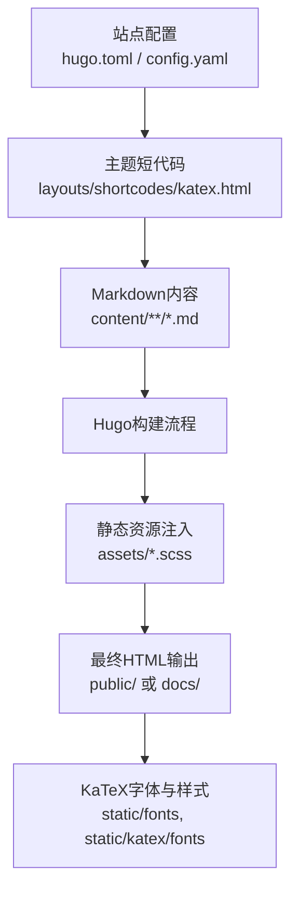
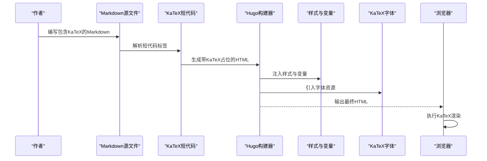
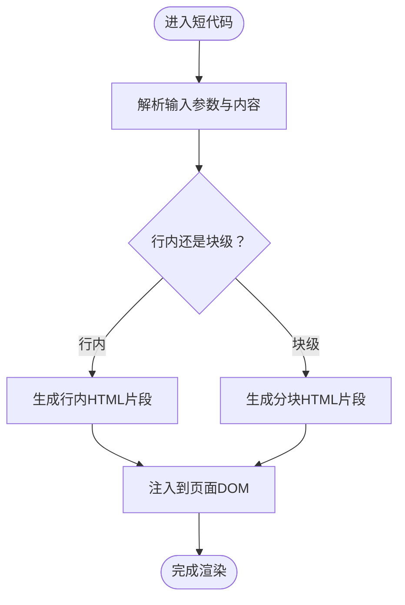
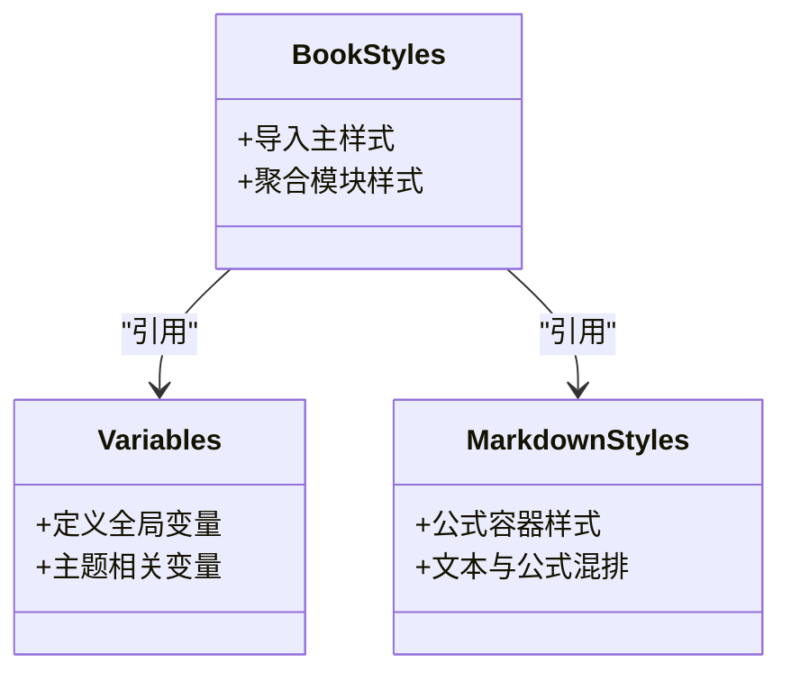
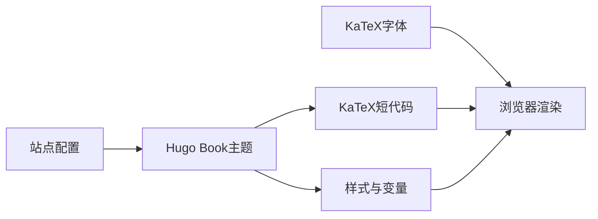

# KaTeX数学公式

<cite>
**本文引用的文件**   
- [hugo.toml](file://hugo.toml)
- [config.yaml](file://config.yaml)
- [katex.html](file://themes/hugo-book/layouts/shortcodes/katex.html)
- [_markdown.scss](file://themes/hugo-book/assets/_markdown.scss)
- [_variables.scss](file://themes/hugo-book/assets/_variables.scss)
- [book.scss](file://themes/hugo-book/assets/book.scss)
- [index.html](file://docs/docs/shortcodes/katex/index.html)
</cite>

## 目录
1. [简介](#简介)
2. [项目结构](#项目结构)
3. [核心组件](#核心组件)
4. [架构总览](#架构总览)
5. [详细组件分析](#详细组件分析)
6. [依赖关系分析](#依赖关系分析)
7. [性能考虑](#性能考虑)
8. [故障排查指南](#故障排查指南)
9. [结论](#结论)
10. [附录](#附录)

## 简介
本文件面向在Hugo文档中使用KaTeX渲染数学公式的读者，提供从基础语法到高级表达式的完整实践指南。内容涵盖：
- 如何在Markdown中嵌入行内与独立块级公式
- 常用符号、函数与运算符的使用方式
- 复杂表达式（分数、根号、上下标、矩阵、方程组、积分、求和等）的编写技巧
- 样式定制（大小、颜色、对齐）与主题变量控制
- Markdown最佳实践与性能优化建议

## 项目结构
本项目基于Hugo Book主题，KaTeX通过主题内置的shortcode实现集成，并在构建产物中输出演示页面。关键位置如下：
- Hugo配置：站点级配置位于根目录的配置文件
- 主题短代码：用于在Markdown中调用KaTeX渲染
- 样式资源：SCSS变量与样式定义影响公式外观
- 生成示例：构建后在docs目录下存在KaTeX shortcode的示例页面

图表来源
- [hugo.toml](file://hugo.toml)
- [config.yaml](file://config.yaml)
- [katex.html](file://themes/hugo-book/layouts/shortcodes/katex.html)
- [_markdown.scss](file://themes/hugo-book/assets/_markdown.scss)
- [_variables.scss](file://themes/hugo-book/assets/_variables.scss)
- [book.scss](file://themes/hugo-book/assets/book.scss)

章节来源
- [hugo.toml](file://hugo.toml)
- [config.yaml](file://config.yaml)
- [katex.html](file://themes/hugo-book/layouts/shortcodes/katex.html)
- [_markdown.scss](file://themes/hugo-book/assets/_markdown.scss)
- [_variables.scss](file://themes/hugo-book/assets/_variables.scss)
- [book.scss](file://themes/hugo-book/assets/book.scss)

## 核心组件
- 短代码渲染器：负责解析Markdown中的KaTeX标记并生成可渲染的HTML片段
- 样式系统：通过SCSS变量与样式文件控制公式字体、尺寸、间距与主题适配
- 资源加载：确保KaTeX字体与样式在页面中正确加载
- 示例页面：展示KaTeX在Hugo中的实际使用效果

章节来源
- [katex.html](file://themes/hugo-book/layouts/shortcodes/katex.html)
- [_markdown.scss](file://themes/hugo-book/assets/_markdown.scss)
- [_variables.scss](file://themes/hugo-book/assets/_variables.scss)
- [book.scss](file://themes/hugo-book/assets/book.scss)
- [index.html](file://docs/docs/shortcodes/katex/index.html)

## 架构总览
下图展示了从Markdown到最终页面的KaTeX渲染流程，以及样式与字体的加载路径。

图表来源
- [katex.html](file://themes/hugo-book/layouts/shortcodes/katex.html)
- [_markdown.scss](file://themes/hugo-book/assets/_markdown.scss)
- [_variables.scss](file://themes/hugo-book/assets/_variables.scss)
- [book.scss](file://themes/hugo-book/assets/book.scss)

## 详细组件分析

### 短代码渲染器（KaTeX Shortcode）
- 职责：识别Markdown中的KaTeX标记，将其转换为浏览器可渲染的HTML节点
- 行为要点：
  - 支持行内与块级两种模式
  - 将生成的HTML插入到页面结构中
  - 与主题样式协同工作，保证视觉一致性
- 扩展点：可通过自定义短代码或模板覆盖调整渲染逻辑

图表来源
- [katex.html](file://themes/hugo-book/layouts/shortcodes/katex.html)

章节来源
- [katex.html](file://themes/hugo-book/layouts/shortcodes/katex.html)

### 样式系统与变量
- 样式入口：主题主样式文件聚合各模块样式
- 变量控制：通过SCSS变量统一控制字号、行高、间距等
- Markdown样式：针对Markdown内容的排版规则，包括公式容器与文本混排
- 主题适配：支持浅色/深色主题的样式切换

图表来源
- [book.scss](file://themes/hugo-book/assets/book.scss)
- [_variables.scss](file://themes/hugo-book/assets/_variables.scss)
- [_markdown.scss](file://themes/hugo-book/assets/_markdown.scss)

章节来源
- [book.scss](file://themes/hugo-book/assets/book.scss)
- [_variables.scss](file://themes/hugo-book/assets/_variables.scss)
- [_markdown.scss](file://themes/hugo-book/assets/_markdown.scss)

### 示例页面与效果验证
- 示例位置：构建后的KaTeX示例页面位于docs目录下的对应路径
- 用途：验证KaTeX在Hugo中的集成效果，便于对照修改与调试
- 建议：在本地开发时优先查看该页面以确认渲染结果

章节来源
- [index.html](file://docs/docs/shortcodes/katex/index.html)

## 依赖关系分析
- 主题依赖：KaTeX集成依赖于Hugo Book主题的短代码与样式体系
- 资源依赖：KaTeX字体与样式需在页面中正确加载
- 配置依赖：站点配置可能影响资源加载路径与主题行为

图表来源
- [katex.html](file://themes/hugo-book/layouts/shortcodes/katex.html)
- [_markdown.scss](file://themes/hugo-book/assets/_markdown.scss)
- [_variables.scss](file://themes/hugo-book/assets/_variables.scss)
- [book.scss](file://themes/hugo-book/assets/book.scss)
- [hugo.toml](file://hugo.toml)
- [config.yaml](file://config.yaml)

章节来源
- [katex.html](file://themes/hugo-book/layouts/shortcodes/katex.html)
- [_markdown.scss](file://themes/hugo-book/assets/_markdown.scss)
- [_variables.scss](file://themes/hugo-book/assets/_variables.scss)
- [book.scss](file://themes/hugo-book/assets/book.scss)
- [hugo.toml](file://hugo.toml)
- [config.yaml](file://config.yaml)

## 性能考虑
- 资源预加载：提前声明KaTeX字体与样式，减少首屏阻塞
- 按需加载：仅在需要渲染公式的页面引入必要资源
- 缓存策略：利用浏览器缓存与CDN加速字体与样式资源
- 简化表达式：避免过度复杂的嵌套结构，提升渲染速度
- 批量处理：在构建阶段合并与压缩资源，减少请求数量

[本节为通用指导，不直接分析具体文件]

## 故障排查指南
- 字体缺失：检查KaTeX字体是否被正确引入，确认路径与权限
- 样式未生效：核对样式文件是否被主题正确加载，变量是否覆盖
- 渲染异常：检查Markdown中的KaTeX语法是否正确，必要时参考示例页面
- 主题冲突：若启用深色模式，确认样式变量与主题适配是否一致
- 构建问题：清理构建缓存并重新生成，确保资源路径正确

章节来源
- [index.html](file://docs/docs/shortcodes/katex/index.html)
- [_markdown.scss](file://themes/hugo-book/assets/_markdown.scss)
- [_variables.scss](file://themes/hugo-book/assets/_variables.scss)
- [book.scss](file://themes/hugo-book/assets/book.scss)

## 结论
通过Hugo Book主题的KaTeX短代码与样式体系，可在Markdown中便捷地嵌入数学公式。结合合理的样式定制与性能优化策略，能够显著提升文档的可读性与用户体验。建议在写作过程中充分利用示例页面进行验证，并遵循最佳实践以确保稳定高效的渲染效果。

[本节为总结性内容，不直接分析具体文件]

## 附录
- 常用KaTeX语法速查（行内与块级）
- 复杂表达式编写技巧（分数、根号、上下标、矩阵、方程组、积分、求和）
- 样式定制清单（大小、颜色、对齐）
- 性能优化清单（资源加载、缓存、压缩）

[本节为补充信息，不直接分析具体文件]