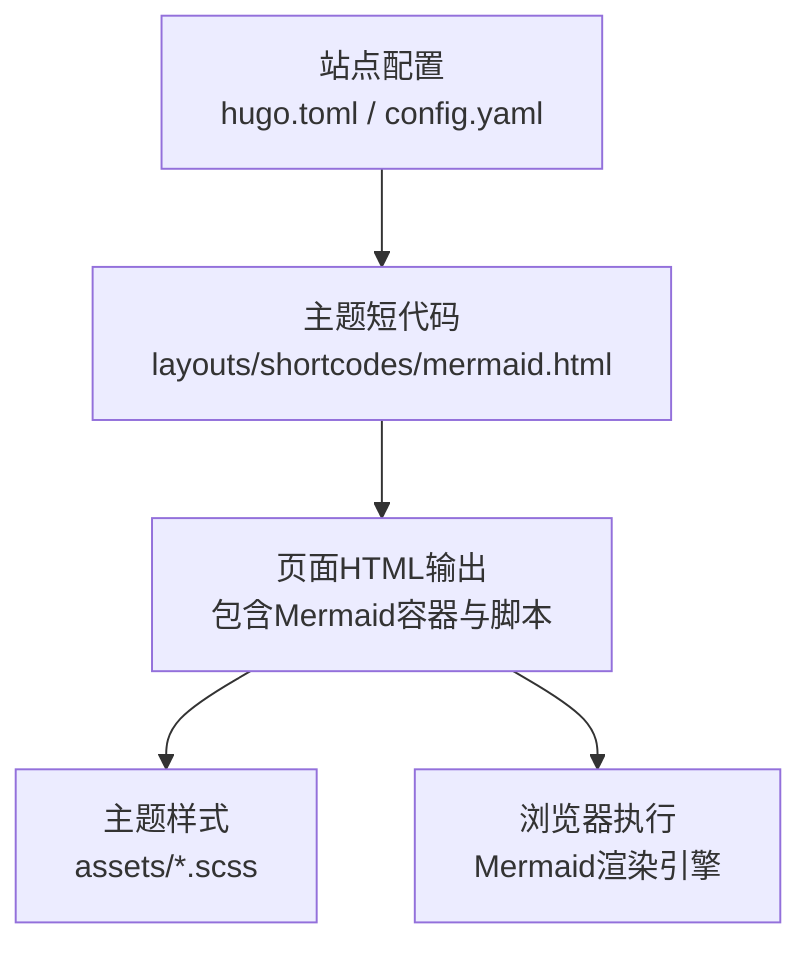
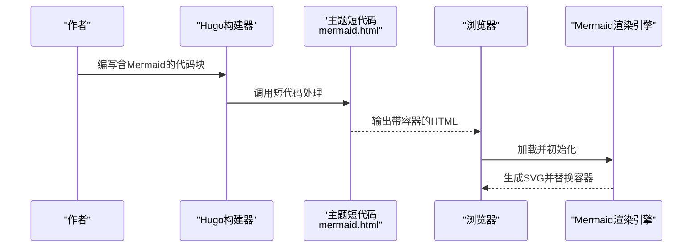
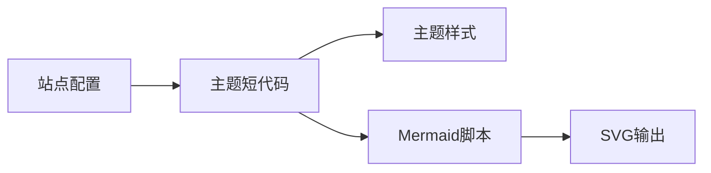

# Mermaid图表绘制

<cite>
**本文引用的文件**   
- [hugo.toml](file://hugo.toml)
- [config.yaml](file://config.yaml)
- [mermaid.html](file://themes/hugo-book/layouts/shortcodes/mermaid.html)
- [book.scss](file://themes/hugo-book/assets/book.scss)
- [_custom.scss](file://themes/hugo-book/assets/_custom.scss)
- [_variables.scss](file://themes/hugo-book/assets/_variables.scss)
- [_main.scss](file://themes/hugo-book/assets/_main.scss)
- [_markdown.scss](file://themes/hugo-book/assets/_markdown.scss)
- [index.html](file://content/docs/shortcodes/mermaid/index.html)
</cite>

## 目录
1. [简介](#简介)
2. [项目结构](#项目结构)
3. [核心组件](#核心组件)
4. [架构总览](#架构总览)
5. [详细组件分析](#详细组件分析)
6. [依赖关系分析](#依赖关系分析)
7. [性能考虑](#性能考虑)
8. [故障排查指南](#故障排查指南)
9. [结论](#结论)
10. [附录](#附录)

## 简介
本指南面向在Hugo博客中使用Mermaid进行图表绘制的作者与开发者，系统讲解Mermaid语法基础、常见图表类型（流程图、时序图、类图、状态图、甘特图、饼图等）的创建方法，以及属性配置与样式定制。同时结合本仓库中Hugo Book主题对Mermaid的集成方式，说明如何在内容中嵌入图表、如何启用渲染、如何进行响应式适配与主题集成，并提供大型图表的性能优化技巧与调试方法。

## 项目结构
本项目基于Hugo与Hugo Book主题构建，Mermaid通过主题的短代码与资源加载机制集成到页面中。关键位置包括：
- Hugo站点配置：用于启用Mermaid渲染与相关选项
- 主题短代码模板：负责在页面中注入Mermaid脚本与容器
- 主题样式：提供默认排版与深色/浅色主题变量
- 示例页面：展示如何在文档中插入Mermaid图表

图示来源
- [hugo.toml](file://hugo.toml)
- [config.yaml](file://config.yaml)
- [mermaid.html](file://themes/hugo-book/layouts/shortcodes/mermaid.html)
- [book.scss](file://themes/hugo-book/assets/book.scss)

章节来源
- [hugo.toml](file://hugo.toml)
- [config.yaml](file://config.yaml)
- [mermaid.html](file://themes/hugo-book/layouts/shortcodes/mermaid.html)
- [book.scss](file://themes/hugo-book/assets/book.scss)

## 核心组件
- 站点配置层
  - 控制是否启用Mermaid渲染、选择主题、设置全局参数等
- 主题短代码层
  - 将Markdown中的Mermaid块转换为可渲染的DOM节点，并注入必要的脚本
- 样式层
  - 通过SCSS变量与规则统一图表外观，支持深色/浅色主题切换
- 运行时渲染层
  - 由浏览器端Mermaid库完成解析与SVG生成

章节来源
- [hugo.toml](file://hugo.toml)
- [config.yaml](file://config.yaml)
- [mermaid.html](file://themes/hugo-book/layouts/shortcodes/mermaid.html)
- [book.scss](file://themes/hugo-book/assets/book.scss)

## 架构总览
下图展示了从内容编写到最终渲染的关键流程：作者在Markdown中写入Mermaid代码块，Hugo构建时通过主题短代码将其包裹为可渲染元素；页面加载后，浏览器引入Mermaid脚本并完成渲染。

图示来源
- [mermaid.html](file://themes/hugo-book/layouts/shortcodes/mermaid.html)

## 详细组件分析

### 站点配置（启用与参数）
- 作用
  - 启用Mermaid渲染开关
  - 指定主题或全局行为（如是否自动缩放、是否启用交互等）
- 建议
  - 在开发环境开启调试日志以便定位问题
  - 在生产环境关闭不必要的功能以提升性能

章节来源
- [hugo.toml](file://hugo.toml)
- [config.yaml](file://config.yaml)

### 主题短代码（Mermaid渲染入口）
- 职责
  - 接收Markdown中的Mermaid代码块
  - 生成唯一容器ID
  - 注入Mermaid脚本与初始化逻辑
  - 根据主题变量调整样式
- 关键点
  - 确保脚本仅在需要时加载，避免重复初始化
  - 正确处理错误回调，便于前端诊断

章节来源
- [mermaid.html](file://themes/hugo-book/layouts/shortcodes/mermaid.html)

### 样式与主题（SCSS）
- 默认样式
  - 通过主样式文件统一布局与间距
- 自定义样式
  - 使用自定义SCSS覆盖默认变量与规则
- 主题变量
  - 定义颜色、字体、阴影等，配合深色/浅色模式

章节来源
- [book.scss](file://themes/hugo-book/assets/book.scss)
- [_custom.scss](file://themes/hugo-book/assets/_custom.scss)
- [_variables.scss](file://themes/hugo-book/assets/_variables.scss)
- [_main.scss](file://themes/hugo-book/assets/_main.scss)
- [_markdown.scss](file://themes/hugo-book/assets/_markdown.scss)

### 示例页面（在文档中插入图表）
- 目标
  - 演示如何在文档中插入Mermaid图表
- 要点
  - 使用正确的代码块标记
  - 合理组织节点与连线，保持可读性
  - 利用主题样式获得一致的视觉体验

章节来源
- [index.html](file://content/docs/shortcodes/mermaid/index.html)

## 依赖关系分析
- 内部依赖
  - 站点配置影响主题行为
  - 主题短代码依赖样式变量以保持一致外观
- 外部依赖
  - 浏览器端Mermaid库负责解析与渲染
  - Hugo负责静态资源打包与页面生成

图示来源
- [hugo.toml](file://hugo.toml)
- [config.yaml](file://config.yaml)
- [mermaid.html](file://themes/hugo-book/layouts/shortcodes/mermaid.html)
- [book.scss](file://themes/hugo-book/assets/book.scss)

章节来源
- [hugo.toml](file://hugo.toml)
- [config.yaml](file://config.yaml)
- [mermaid.html](file://themes/hugo-book/layouts/shortcodes/mermaid.html)
- [book.scss](file://themes/hugo-book/assets/book.scss)

## 性能考虑
- 按需加载
  - 仅在包含Mermaid内容的页面加载脚本，减少首屏开销
- 缓存策略
  - 利用浏览器缓存Mermaid脚本与主题资源
- 大型图表优化
  - 拆分复杂图表为多个子图
  - 简化节点形状与文本长度
  - 避免过多动画与交互
- 构建期优化
  - 预编译与压缩静态资源
  - 禁用不必要的调试信息

[本节为通用指导，不直接分析具体文件]

## 故障排查指南
- 常见问题
  - 图表未渲染：检查短代码是否正确注入脚本与容器
  - 样式异常：确认主题样式是否被覆盖或冲突
  - 性能卡顿：评估图表复杂度与资源加载顺序
- 定位步骤
  - 打开浏览器控制台查看脚本加载与报错
  - 检查页面源码中是否存在Mermaid容器与脚本引用
  - 对比不同主题变量对图表外观的影响
- 修复建议
  - 修正Mermaid语法错误
  - 调整短代码初始化逻辑以避免重复渲染
  - 清理冗余样式规则

章节来源
- [mermaid.html](file://themes/hugo-book/layouts/shortcodes/mermaid.html)
- [_custom.scss](file://themes/hugo-book/assets/_custom.scss)
- [_variables.scss](file://themes/hugo-book/assets/_variables.scss)

## 结论
通过在Hugo Book主题中集成Mermaid，可以在文档中以声明式的方式快速生成高质量图表。合理的配置、清晰的样式管理与良好的性能策略，是保证用户体验与可维护性的关键。建议在团队内建立统一的Mermaid编码规范与审查流程，持续提升可视化质量与效率。

[本节为总结性内容，不直接分析具体文件]

## 附录

### Mermaid语法基础与图表类型速览
- 流程图
  - 使用节点与箭头表达流程分支与汇聚
  - 适合描述业务过程与算法步骤
- 时序图
  - 用参与者与消息线表达交互时序
  - 适合API调用链与事件流
- 类图
  - 用类框与继承/关联关系表达结构
  - 适合架构设计与模块划分
- 状态图
  - 用状态与转移边表达生命周期
  - 适合工作流与协议状态机
- 甘特图
  - 用任务条与时间轴表达计划
  - 适合项目管理与里程碑
- 饼图
  - 用扇区比例表达构成
  - 适合统计与占比分析

[本节为概念性介绍，不直接分析具体文件]

### 属性配置与样式定制要点
- 节点与连线
  - 设置形状、边框、填充、文字对齐等
- 主题与变量
  - 通过SCSS变量统一颜色与字体
  - 支持深色/浅色模式切换
- 交互与响应式
  - 启用缩放与平移，适配移动端阅读
  - 限制最大宽度与高度，避免溢出

章节来源
- [_custom.scss](file://themes/hugo-book/assets/_custom.scss)
- [_variables.scss](file://themes/hugo-book/assets/_variables.scss)
- [_main.scss](file://themes/hugo-book/assets/_main.scss)
- [_markdown.scss](file://themes/hugo-book/assets/_markdown.scss)

### 实际示例路径参考
- 在文档中插入Mermaid图表的示例页面
  - 参考路径：[示例页面](file://content/docs/shortcodes/mermaid/index.html)

章节来源
- [index.html](file://content/docs/shortcodes/mermaid/index.html)