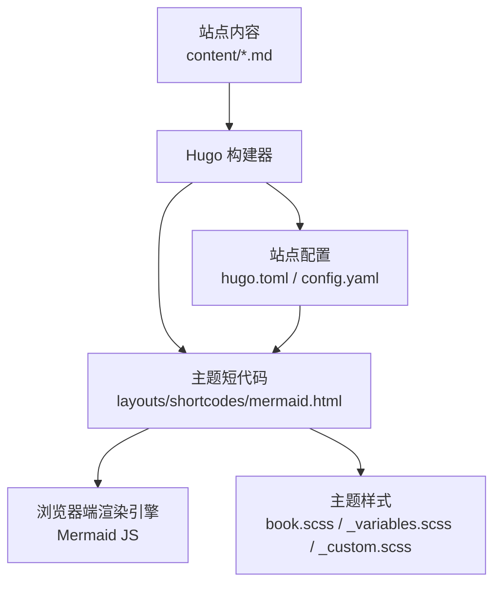
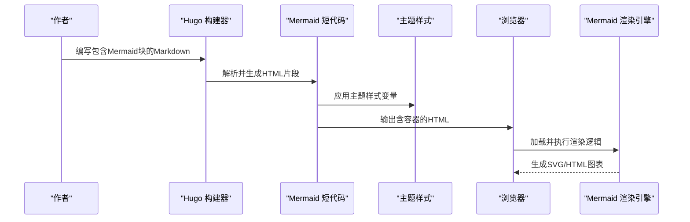
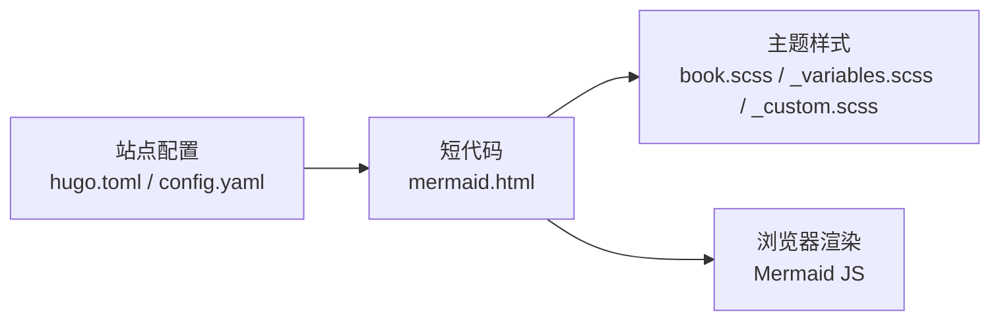

# 其他图表类型

<cite>
**本文引用的文件**   
- [layouts/shortcodes/mermaid.html](file://themes/hugo-book/layouts/shortcodes/mermaid.html)
- [assets/book.scss](file://themes/hugo-book/assets/book.scss)
- [assets/_variables.scss](file://themes/hugo-book/assets/_variables.scss)
- [assets/_custom.scss](file://themes/hugo-book/assets/_custom.scss)
- [hugo.toml](file://hugo.toml)
- [config.yaml](file://config.yaml)
</cite>

## 目录
1. [简介](#简介)
2. [项目结构](#项目结构)
3. [核心组件](#核心组件)
4. [架构总览](#架构总览)
5. [详细组件分析](#详细组件分析)
6. [依赖分析](#依赖分析)
7. [性能考虑](#性能考虑)
8. [故障排查指南](#故障排查指南)
9. [结论](#结论)
10. [附录](#附录)

## 简介
本指南聚焦于在Hugo Book主题中绘制“其他图表类型”的实战方法，包括饼图、雷达图、散点图等统计图表，以及实体关系图(ERD)、用户体验图(UX)和架构图。文档将系统讲解：
- 如何在Markdown中使用Mermaid语法创建各类图表
- 数据绑定与动态更新思路（基于站点构建期与前端渲染）
- 响应式适配与主题定制（颜色、字体、尺寸等）
- 从基础图表到复杂仪表板的组合实践
- 图表选择原则与可视化设计要点

## 项目结构
本项目采用Hugo Book主题组织内容，Mermaid图表通过主题的短代码进行渲染。关键路径如下：
- 主题短代码：负责将Markdown中的Mermaid块转换为可渲染的SVG/HTML
- 主题样式：提供全局变量与默认样式，便于统一外观
- 站点配置：控制是否启用Mermaid及加载行为

图示来源
- [layouts/shortcodes/mermaid.html](file://themes/hugo-book/layouts/shortcodes/mermaid.html)
- [assets/book.scss](file://themes/hugo-book/assets/book.scss)
- [assets/_variables.scss](file://themes/hugo-book/assets/_variables.scss)
- [assets/_custom.scss](file://themes/hugo-book/assets/_custom.scss)
- [hugo.toml](file://hugo.toml)
- [config.yaml](file://config.yaml)

章节来源
- [layouts/shortcodes/mermaid.html](file://themes/hugo-book/layouts/shortcodes/mermaid.html)
- [assets/book.scss](file://themes/hugo-book/assets/book.scss)
- [assets/_variables.scss](file://themes/hugo-book/assets/_variables.scss)
- [assets/_custom.scss](file://themes/hugo-book/assets/_custom.scss)
- [hugo.toml](file://hugo.toml)
- [config.yaml](file://config.yaml)

## 核心组件
- 短代码渲染器：解析Markdown中的Mermaid代码块，注入必要的脚本与容器，交由浏览器端渲染引擎完成最终绘制。
- 主题样式层：通过SCSS变量与自定义样式覆盖默认外观，确保图表与站点整体风格一致。
- 站点配置层：控制Mermaid相关开关与加载策略，影响构建产物与运行时行为。

章节来源
- [layouts/shortcodes/mermaid.html](file://themes/hugo-book/layouts/shortcodes/mermaid.html)
- [assets/book.scss](file://themes/hugo-book/assets/book.scss)
- [assets/_variables.scss](file://themes/hugo-book/assets/_variables.scss)
- [assets/_custom.scss](file://themes/hugo-book/assets/_custom.scss)
- [hugo.toml](file://hugo.toml)
- [config.yaml](file://config.yaml)

## 架构总览
下图展示了从内容编写到页面渲染的关键流程，以及各组件之间的交互关系。

图示来源
- [layouts/shortcodes/mermaid.html](file://themes/hugo-book/layouts/shortcodes/mermaid.html)
- [assets/book.scss](file://themes/hugo-book/assets/book.scss)
- [assets/_variables.scss](file://themes/hugo-book/assets/_variables.scss)
- [assets/_custom.scss](file://themes/hugo-book/assets/_custom.scss)

## 详细组件分析

### 统计图表：饼图、雷达图、散点图
- 饼图
  - 适用场景：占比分析、类别分布概览
  - 建议：类别不宜过多；使用对比色区分；为移动端保留足够标签空间
  - 示例参考路径：[layouts/shortcodes/mermaid.html](file://themes/hugo-book/layouts/shortcodes/mermaid.html)
- 雷达图
  - 适用场景：多维能力评估、指标对比
  - 建议：维度控制在5-7个；网格线清晰；多系列时注意透明度与图例
  - 示例参考路径：[layouts/shortcodes/mermaid.html](file://themes/hugo-book/layouts/shortcodes/mermaid.html)
- 散点图
  - 适用场景：相关性分析、异常值识别
  - 建议：坐标轴范围合理；必要时添加趋势线；对重叠点进行抖动或聚合
  - 示例参考路径：[layouts/shortcodes/mermaid.html](file://themes/hugo-book/layouts/shortcodes/mermaid.html)

章节来源
- [layouts/shortcodes/mermaid.html](file://themes/hugo-book/layouts/shortcodes/mermaid.html)

### 实体关系图(ERD)
- 建模要点
  - 明确主键/外键关系，避免循环引用
  - 使用清晰的命名约定与注释
  - 拆分大图为子图，提升可读性
- 布局建议
  - 按业务域分组布局
  - 保持连线方向一致，减少交叉
- 示例参考路径：[layouts/shortcodes/mermaid.html](file://themes/hugo-book/layouts/shortcodes/mermaid.html)

章节来源
- [layouts/shortcodes/mermaid.html](file://themes/hugo-book/layouts/shortcodes/mermaid.html)

### 用户体验图(UX)
- 用户旅程图
  - 阶段划分清晰，标注痛点与机会点
  - 结合情绪曲线突出关键触点
- 流程图/状态图
  - 决策分支简洁，错误路径完整
  - 使用一致的节点形状与颜色语义
- 示例参考路径：[layouts/shortcodes/mermaid.html](file://themes/hugo-book/layouts/shortcodes/mermaid.html)

章节来源
- [layouts/shortcodes/mermaid.html](file://themes/hugo-book/layouts/shortcodes/mermaid.html)

### 架构图
- 分层与边界
  - 明确系统边界、外部依赖与接口
  - 使用不同形状表达组件类型（服务、数据库、消息队列等）
- 交互与数据流
  - 用箭头表示调用与数据流向
  - 标注协议与版本信息
- 示例参考路径：[layouts/shortcodes/mermaid.html](file://themes/hugo-book/layouts/shortcodes/mermaid.html)

章节来源
- [layouts/shortcodes/mermaid.html](file://themes/hugo-book/layouts/shortcodes/mermaid.html)

### 数据绑定、动态更新与响应式适配
- 数据绑定
  - 静态站点：在构建期将数据嵌入图表定义
  - 动态站点：通过API获取数据后在前端触发重绘
- 动态更新
  - 监听数据变化事件，调用渲染引擎的重绘接口
  - 增量更新优先，避免整页重绘
- 响应式适配
  - 使用相对单位与自适应容器
  - 在小屏设备上简化标签与图例
  - 利用主题变量统一缩放策略

章节来源
- [layouts/shortcodes/mermaid.html](file://themes/hugo-book/layouts/shortcodes/mermaid.html)
- [assets/book.scss](file://themes/hugo-book/assets/book.scss)
- [assets/_variables.scss](file://themes/hugo-book/assets/_variables.scss)
- [assets/_custom.scss](file://themes/hugo-book/assets/_custom.scss)

### 自定义主题与样式深度定制
- 主题变量
  - 通过SCSS变量集中管理颜色、字号、间距等
  - 与站点配色体系保持一致
- 自定义样式
  - 在自定义样式文件中覆盖默认规则
  - 针对特定图表类型设置差异化样式
- 示例参考路径：
  - [assets/_variables.scss](file://themes/hugo-book/assets/_variables.scss)
  - [assets/_custom.scss](file://themes/hugo-book/assets/_custom.scss)
  - [assets/book.scss](file://themes/hugo-book/assets/book.scss)

章节来源
- [assets/_variables.scss](file://themes/hugo-book/assets/_variables.scss)
- [assets/_custom.scss](file://themes/hugo-book/assets/_custom.scss)
- [assets/book.scss](file://themes/hugo-book/assets/book.scss)

### 图表选择指导与设计原则
- 选择原则
  - 以受众与目标为导向：汇报型偏概览，分析型偏细节
  - 数据特征决定图表类型：分布、对比、关联、构成、流程
- 设计要点
  - 色彩克制且具语义；对比度充足
  - 信息密度适中，留白合理
  - 标题、图例、单位齐全，避免歧义
- 复杂度演进
  - 从单一图表起步，逐步叠加辅助元素（趋势线、阈值线、注释）
  - 复杂仪表板采用分栏与折叠，保证首屏可读性

## 依赖分析
- 组件耦合
  - 短代码与主题样式解耦，通过变量与类名间接耦合
  - 构建期与运行期职责清晰：构建期生成HTML，运行期完成渲染
- 外部依赖
  - 浏览器端渲染引擎负责最终图形绘制
  - 主题样式影响图表视觉一致性
- 潜在风险
  - 若未正确引入渲染引擎，图表无法显示
  - 样式覆盖不当可能导致布局错乱

图示来源
- [layouts/shortcodes/mermaid.html](file://themes/hugo-book/layouts/shortcodes/mermaid.html)
- [assets/book.scss](file://themes/hugo-book/assets/book.scss)
- [assets/_variables.scss](file://themes/hugo-book/assets/_variables.scss)
- [assets/_custom.scss](file://themes/hugo-book/assets/_custom.scss)
- [hugo.toml](file://hugo.toml)
- [config.yaml](file://config.yaml)

章节来源
- [layouts/shortcodes/mermaid.html](file://themes/hugo-book/layouts/shortcodes/mermaid.html)
- [assets/book.scss](file://themes/hugo-book/assets/book.scss)
- [assets/_variables.scss](file://themes/hugo-book/assets/_variables.scss)
- [assets/_custom.scss](file://themes/hugo-book/assets/_custom.scss)
- [hugo.toml](file://hugo.toml)
- [config.yaml](file://config.yaml)

## 性能考虑
- 构建期优化
  - 减少不必要的图表实例，按需加载
  - 合并相似图表，复用通用样式
- 运行期优化
  - 避免频繁全量重绘，采用增量更新
  - 大图表分页或懒加载
- 资源体积
  - 仅引入必要功能模块
  - 压缩与缓存静态资源

## 故障排查指南
- 常见问题
  - 图表不显示：检查短代码是否正确引入渲染引擎
  - 样式异常：确认主题变量与自定义样式优先级
  - 布局错位：检查容器宽度与响应式断点
- 定位步骤
  - 查看控制台是否有脚本加载错误
  - 验证站点配置是否启用了相关功能
  - 逐步缩小问题范围至具体图表或样式覆盖

章节来源
- [layouts/shortcodes/mermaid.html](file://themes/hugo-book/layouts/shortcodes/mermaid.html)
- [assets/book.scss](file://themes/hugo-book/assets/book.scss)
- [assets/_variables.scss](file://themes/hugo-book/assets/_variables.scss)
- [assets/_custom.scss](file://themes/hugo-book/assets/_custom.scss)
- [hugo.toml](file://hugo.toml)
- [config.yaml](file://config.yaml)

## 结论
通过在Hugo Book主题中合理使用Mermaid短代码与主题样式，可以高效实现从基础统计图表到复杂架构图的多样化可视化需求。遵循数据驱动与用户导向的设计原则，配合响应式与主题定制，能够构建出既美观又实用的可视化内容。

## 附录
- 快速上手清单
  - 在Markdown中插入Mermaid代码块
  - 使用主题变量统一外观
  - 根据设备尺寸调整布局与密度
- 进阶技巧
  - 组合多种图表形成仪表板
  - 通过事件与API实现动态更新
  - 建立团队级样式规范与模板库