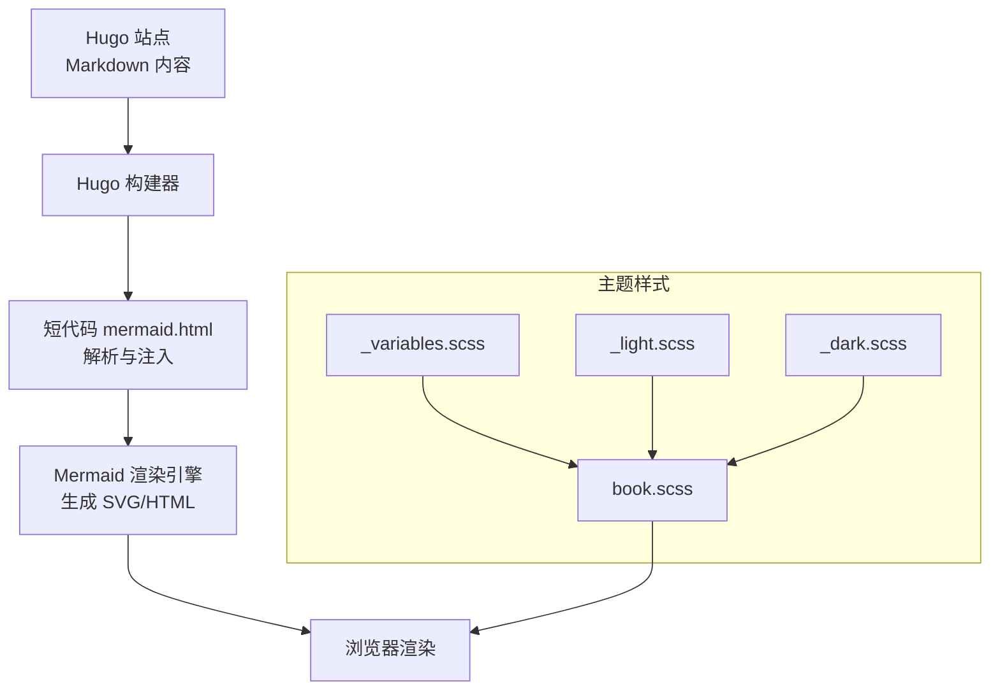
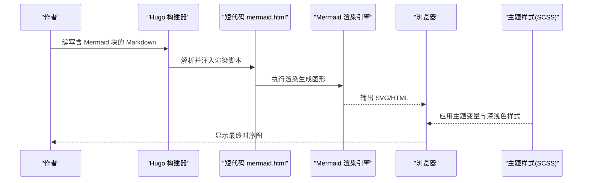
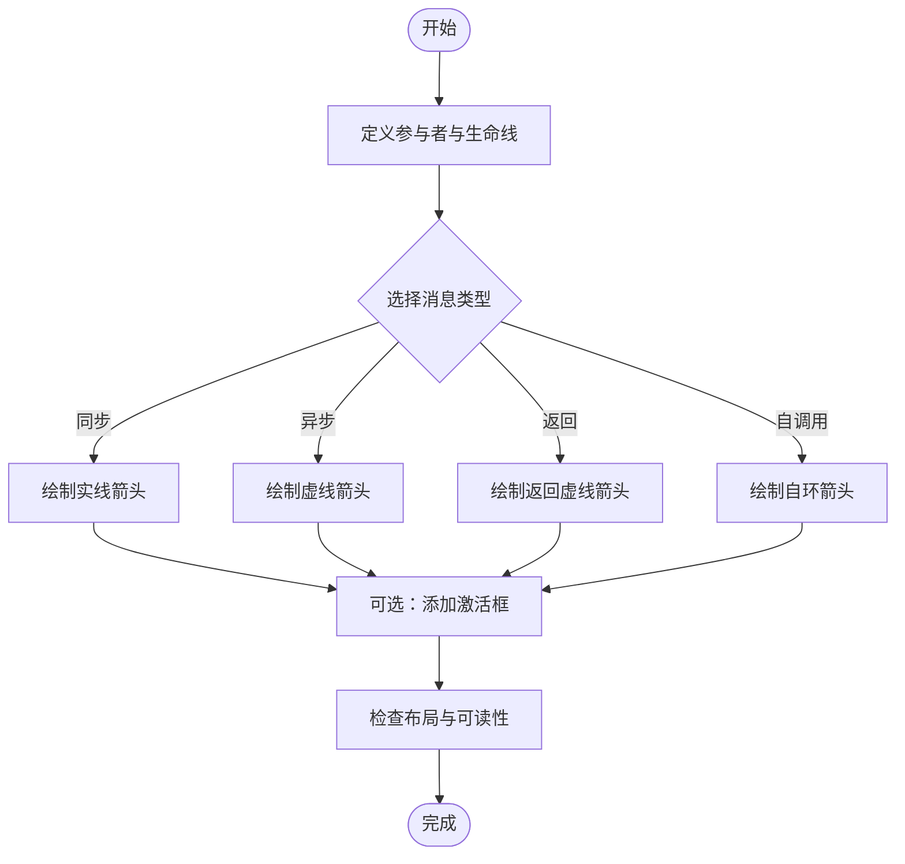
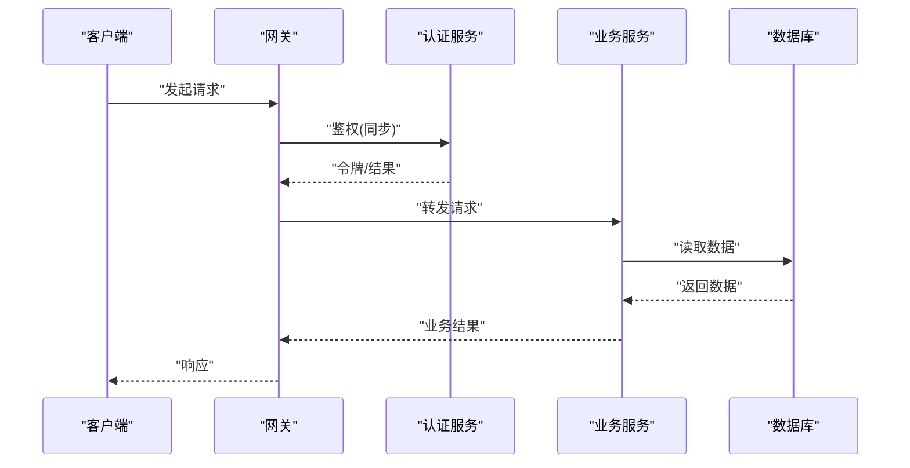
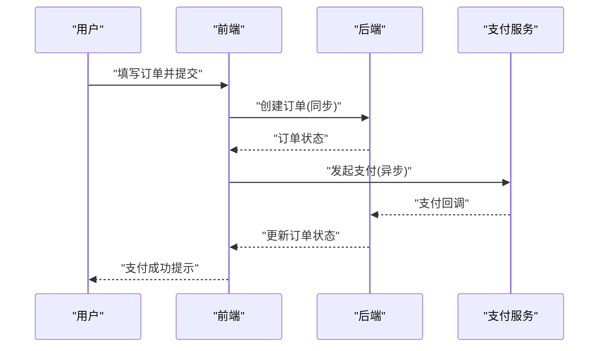
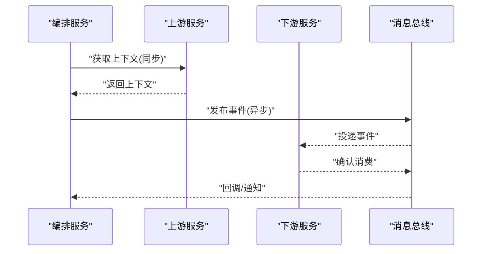
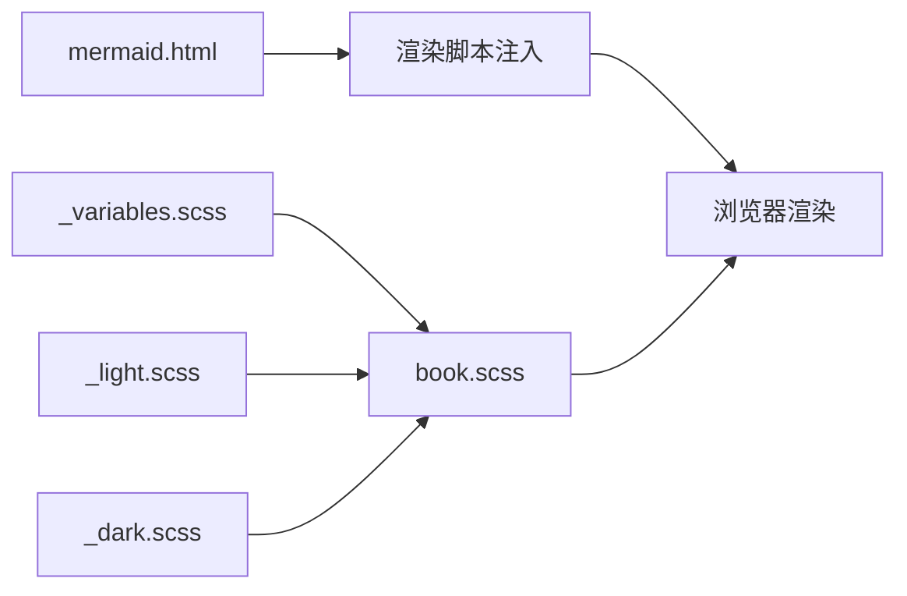

# 时序图绘制

<cite>
**本文引用的文件**   
- [hugo-book/shortcodes/mermaid.html](file://themes/hugo-book/layouts/shortcodes/mermaid.html)
- [hugo-book/assets/book.scss](file://themes/hugo-book/assets/book.scss)
- [hugo-book/assets/_variables.scss](file://themes/hugo-book/assets/_variables.scss)
- [hugo-book/assets/themes/_light.scss](file://themes/hugo-book/assets/themes/_light.scss)
- [hugo-book/assets/themes/_dark.scss](file://themes/hugo-book/assets/themes/_dark.scss)
- [hugo-book/exampleSite/hugo.yaml](file://themes/hugo-book/exampleSite/hugo.yaml)
- [content/docs/99-English/21-note.md](file://content/docs/99-English/21-note.md)
</cite>

## 目录
1. [简介](#简介)
2. [项目结构](#项目结构)
3. [核心组件](#核心组件)
4. [架构总览](#架构总览)
5. [详细组件分析](#详细组件分析)
6. [依赖分析](#依赖分析)
7. [性能考虑](#性能考虑)
8. [故障排查指南](#故障排查指南)
9. [结论](#结论)
10. [附录](#附录)

## 简介
本指南面向在 Hugo Book 主题中使用 Mermaid 绘制“时序图”的读者，系统讲解参与者定义、消息传递语法与激活框用法，深入对比同步消息、异步消息、返回消息与自调用消息的差异与适用场景。同时提供 API 调用序列、用户操作流程与微服务通信等实际示例，并介绍生命线、注释与分组的高级特性，以及样式定制与主题集成方法。文末给出复杂交互场景的最佳实践与调试技巧，帮助你在文档中高效表达复杂的系统交互。

## 项目结构
本项目基于 Hugo Book 主题，Mermaid 渲染通过主题的短代码实现，并在构建时由 Hugo 将 Markdown 中的 Mermaid 块转换为可渲染的 SVG/HTML。主题还包含 SCSS 变量与主题样式，用于控制整体视觉风格（包括深色/浅色模式），从而间接影响 Mermaid 图表的配色与可读性。

图示来源
- [hugo-book/shortcodes/mermaid.html](file://themes/hugo-book/layouts/shortcodes/mermaid.html)
- [hugo-book/assets/book.scss](file://themes/hugo-book/assets/book.scss)
- [hugo-book/assets/_variables.scss](file://themes/hugo-book/assets/_variables.scss)
- [hugo-book/assets/themes/_light.scss](file://themes/hugo-book/assets/themes/_light.scss)
- [hugo-book/assets/themes/_dark.scss](file://themes/hugo-book/assets/themes/_dark.scss)

章节来源
- [hugo-book/shortcodes/mermaid.html](file://themes/hugo-book/layouts/shortcodes/mermaid.html)
- [hugo-book/assets/book.scss](file://themes/hugo-book/assets/book.scss)
- [hugo-book/assets/_variables.scss](file://themes/hugo-book/assets/_variables.scss)
- [hugo-book/assets/themes/_light.scss](file://themes/hugo-book/assets/themes/_light.scss)
- [hugo-book/assets/themes/_dark.scss](file://themes/hugo-book/assets/themes/_dark.scss)

## 核心组件
- 短代码 mermaid.html：负责在页面中插入 Mermaid 脚本与容器，触发渲染流程。
- 主题样式（SCSS）：提供全局变量与深浅色主题，影响文本、边框与背景等视觉元素，从而改善时序图的阅读体验。
- 示例配置（exampleSite）：展示如何在 Hugo 配置中启用或调整相关能力（如数学公式、搜索等），可作为参考以理解主题扩展方式。

章节来源
- [hugo-book/shortcodes/mermaid.html](file://themes/hugo-book/layouts/shortcodes/mermaid.html)
- [hugo-book/assets/book.scss](file://themes/hugo-book/assets/book.scss)
- [hugo-book/assets/_variables.scss](file://themes/hugo-book/assets/_variables.scss)
- [hugo-book/assets/themes/_light.scss](file://themes/hugo-book/assets/themes/_light.scss)
- [hugo-book/assets/themes/_dark.scss](file://themes/hugo-book/assets/themes/_dark.scss)
- [hugo-book/exampleSite/hugo.yaml](file://themes/hugo-book/exampleSite/hugo.yaml)

## 架构总览
下图展示了从 Markdown 到最终可视化的端到端流程，以及主题样式对最终呈现的影响路径。

图示来源
- [hugo-book/shortcodes/mermaid.html](file://themes/hugo-book/layouts/shortcodes/mermaid.html)
- [hugo-book/assets/book.scss](file://themes/hugo-book/assets/book.scss)
- [hugo-book/assets/_variables.scss](file://themes/hugo-book/assets/_variables.scss)
- [hugo-book/assets/themes/_light.scss](file://themes/hugo-book/assets/themes/_light.scss)
- [hugo-book/assets/themes/_dark.scss](file://themes/hugo-book/assets/themes/_dark.scss)

## 详细组件分析

### 参与者定义与生命线
- 参与者命名：使用简短、语义清晰的名称，避免过长导致布局拥挤。
- 生命线：每个参与者在图中表现为一条垂直线，代表其生命周期；建议为关键参与者添加简要说明，便于读者快速定位。
- 最佳实践：
  - 将外部系统与内部服务分层排列，减少交叉连线。
  - 对频繁交互的参与者靠近放置，降低视觉复杂度。

章节来源
- [hugo-book/shortcodes/mermaid.html](file://themes/hugo-book/layouts/shortcodes/mermaid.html)

### 消息传递语法与激活框
- 同步消息：实线箭头表示请求-响应在同一时间线上进行，适合描述阻塞式调用。
- 异步消息：虚线箭头表示非阻塞发送，常用于事件驱动或消息队列场景。
- 返回消息：虚线箭头回指调用方，强调返回值或回调。
- 自调用消息：同一参与者内部的循环调用，适合封装复杂逻辑或递归处理。
- 激活框：用矩形高亮某段活跃期，清晰表达“谁在何时忙”，有助于区分并发与串行阶段。

图示来源
- [hugo-book/shortcodes/mermaid.html](file://themes/hugo-book/layouts/shortcodes/mermaid.html)

章节来源
- [hugo-book/shortcodes/mermaid.html](file://themes/hugo-book/layouts/shortcodes/mermaid.html)

### 高级特性：注释与分组
- 注释：在关键步骤旁添加说明，解释业务含义或异常分支，提升可读性。
- 分组：将相关步骤放入一个逻辑区域，突出子流程或边界上下文，便于分层理解。
- 最佳实践：
  - 注释尽量贴近对应消息或激活框，避免跨页引用。
  - 分组层级不宜过深，保持信息密度适中。

章节来源
- [hugo-book/shortcodes/mermaid.html](file://themes/hugo-book/layouts/shortcodes/mermaid.html)

### 实战示例一：API 调用序列
- 典型角色：客户端、网关、认证服务、业务服务、数据库。
- 交互要点：登录鉴权、权限校验、数据查询、缓存命中与回源。
- 可视化建议：
  - 使用同步消息表示鉴权与授权的关键路径。
  - 使用异步消息表示日志上报或指标采集。
  - 用激活框标注鉴权与缓存层的高负载阶段。

图示来源
- [hugo-book/shortcodes/mermaid.html](file://themes/hugo-book/layouts/shortcodes/mermaid.html)

章节来源
- [hugo-book/shortcodes/mermaid.html](file://themes/hugo-book/layouts/shortcodes/mermaid.html)

### 实战示例二：用户操作流程
- 典型角色：用户、前端、后端、第三方服务。
- 交互要点：表单提交、校验、支付、通知。
- 可视化建议：
  - 使用异步消息表示通知与埋点。
  - 使用返回消息明确错误码与重试策略。
  - 用激活框标注支付阶段的敏感操作。

图示来源
- [hugo-book/shortcodes/mermaid.html](file://themes/hugo-book/layouts/shortcodes/mermaid.html)

章节来源
- [hugo-book/shortcodes/mermaid.html](file://themes/hugo-book/layouts/shortcodes/mermaid.html)

### 实战示例三：微服务通信模式
- 典型角色：编排服务、上游服务、下游服务、消息总线。
- 交互要点：事件发布、订阅、补偿与重试。
- 可视化建议：
  - 使用异步消息表示事件发布与消费。
  - 使用返回消息表示失败与重试信号。
  - 用激活框标注补偿事务的执行窗口。

图示来源
- [hugo-book/shortcodes/mermaid.html](file://themes/hugo-book/layouts/shortcodes/mermaid.html)

章节来源
- [hugo-book/shortcodes/mermaid.html](file://themes/hugo-book/layouts/shortcodes/mermaid.html)

### 样式定制与主题集成
- 主题变量：通过 SCSS 变量统一控制字体、颜色与间距，确保时序图在不同主题下保持一致的可读性。
- 深浅色主题：分别定义浅色与深色模式的变量，使时序图在切换主题后仍具备良好对比度。
- 集成建议：
  - 优先使用主题提供的变量，避免硬编码颜色。
  - 在自定义样式中仅覆盖必要项，保持与主题一致的设计语言。

章节来源
- [hugo-book/assets/_variables.scss](file://themes/hugo-book/assets/_variables.scss)
- [hugo-book/assets/themes/_light.scss](file://themes/hugo-book/assets/themes/_light.scss)
- [hugo-book/assets/themes/_dark.scss](file://themes/hugo-book/assets/themes/_dark.scss)
- [hugo-book/assets/book.scss](file://themes/hugo-book/assets/book.scss)

### 复杂交互场景的最佳实践
- 分层表达：将跨系统交互拆分为多个子图，主图聚焦关键路径，子图展开细节。
- 命名规范：参与者与消息采用一致的命名约定，便于检索与维护。
- 关注点分离：将监控、审计等非核心流程以注释或独立子图呈现，避免干扰主线。
- 版本演进：在变更频繁的服务间增加版本号或环境标识，增强可追溯性。

[本节为通用指导，不直接分析具体文件]

### 调试技巧
- 逐步验证：先画最小可用图，再逐步添加分支与异常路径。
- 局部隔离：将复杂流程拆分为多张图，逐图验证逻辑正确性。
- 主题预览：在深浅色模式下分别预览，确保对比度与可读性。
- 参考示例：结合主题示例站点的配置与结构，快速定位问题。

章节来源
- [hugo-book/exampleSite/hugo.yaml](file://themes/hugo-book/exampleSite/hugo.yaml)

## 依赖分析
- 短代码与渲染：短代码 mermaid.html 是入口，负责在页面中注入渲染脚本与容器。
- 样式依赖：book.scss 聚合主题样式，_variables.scss 提供基础变量，_light.scss 与 _dark.scss 分别定义深浅色主题。
- 示例配置：exampleSite/hugo.yaml 展示主题的配置方式，可作为扩展与排障参考。

图示来源
- [hugo-book/shortcodes/mermaid.html](file://themes/hugo-book/layouts/shortcodes/mermaid.html)
- [hugo-book/assets/book.scss](file://themes/hugo-book/assets/book.scss)
- [hugo-book/assets/_variables.scss](file://themes/hugo-book/assets/_variables.scss)
- [hugo-book/assets/themes/_light.scss](file://themes/hugo-book/assets/themes/_light.scss)
- [hugo-book/assets/themes/_dark.scss](file://themes/hugo-book/assets/themes/_dark.scss)

章节来源
- [hugo-book/shortcodes/mermaid.html](file://themes/hugo-book/layouts/shortcodes/mermaid.html)
- [hugo-book/assets/book.scss](file://themes/hugo-book/assets/book.scss)
- [hugo-book/assets/_variables.scss](file://themes/hugo-book/assets/_variables.scss)
- [hugo-book/assets/themes/_light.scss](file://themes/hugo-book/assets/themes/_light.scss)
- [hugo-book/assets/themes/_dark.scss](file://themes/hugo-book/assets/themes/_dark.scss)

## 性能考虑
- 控制图规模：单图参与者与消息数量适中，避免过度复杂导致渲染缓慢。
- 复用子图：将重复流程抽象为子图，减少冗余与计算量。
- 优化布局：合理排序参与者，减少交叉连线，提高可读性与渲染效率。
- 主题变量：使用主题变量而非内联样式，减少 CSS 体积与冲突。

[本节为通用指导，不直接分析具体文件]

## 故障排查指南
- 渲染失败：检查短代码是否被正确引入，确认页面已加载渲染脚本。
- 样式异常：确认主题样式已加载，深浅色切换后对比度是否正常。
- 布局错乱：简化图结构，逐步添加分支定位问题；必要时拆分多图。
- 配置问题：参考示例站点配置，核对 Hugo 与主题版本兼容性。

章节来源
- [hugo-book/shortcodes/mermaid.html](file://themes/hugo-book/layouts/shortcodes/mermaid.html)
- [hugo-book/assets/book.scss](file://themes/hugo-book/assets/book.scss)
- [hugo-book/assets/_variables.scss](file://themes/hugo-book/assets/_variables.scss)
- [hugo-book/assets/themes/_light.scss](file://themes/hugo-book/assets/themes/_light.scss)
- [hugo-book/assets/themes/_dark.scss](file://themes/hugo-book/assets/themes/_dark.scss)
- [hugo-book/exampleSite/hugo.yaml](file://themes/hugo-book/exampleSite/hugo.yaml)

## 结论
通过本指南，你可以在 Hugo Book 主题中高效绘制高质量的 Mermaid 时序图。掌握参与者与消息的基本语法、激活框与高级特性，并结合主题样式进行定制，能够清晰表达 API 调用、用户流程与微服务通信等复杂交互。遵循最佳实践与调试技巧，将显著提升文档的可读性与维护性。

[本节为总结性内容，不直接分析具体文件]

## 附录
- 参考示例：可在主题示例站点中查看配置与结构，作为扩展与排障参考。
- 笔记与补充：如需记录个人经验与踩坑点，可在内容区新增笔记页面。

章节来源
- [hugo-book/exampleSite/hugo.yaml](file://themes/hugo-book/exampleSite/hugo.yaml)
- [content/docs/99-English/21-note.md](file://content/docs/99-English/21-note.md)