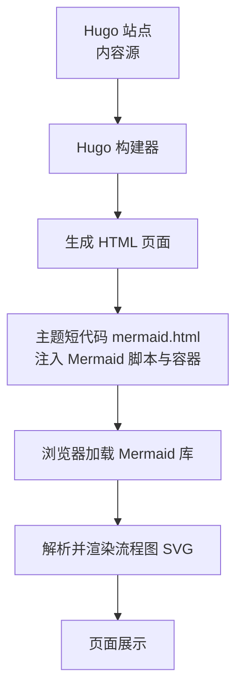
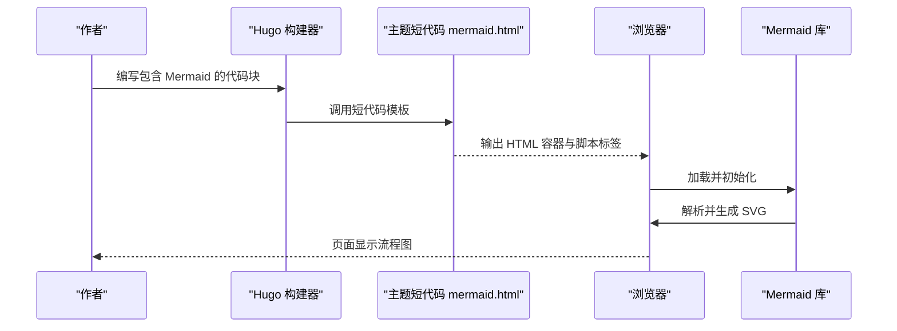
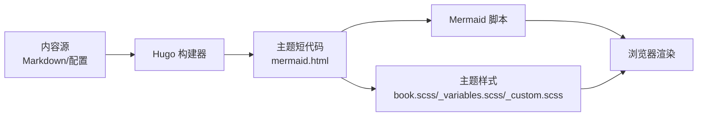

# 流程图绘制

<cite>
**本文引用的文件**   
- [mermaid.html](file://themes/hugo-book/layouts/shortcodes/mermaid.html)
- [book.scss](file://themes/hugo-book/assets/book.scss)
- [_variables.scss](file://themes/hugo-book/assets/_variables.scss)
- [_custom.scss](file://themes/hugo-book/assets/_custom.scss)
- [index.html](file://content/docs/90-Tools/11_Golang.md)
- [a.yaml](file://content/docs/52-istio/a.yaml)
</cite>

## 目录
1. [简介](#简介)
2. [项目结构](#项目结构)
3. [核心组件](#核心组件)
4. [架构总览](#架构总览)
5. [详细组件分析](#详细组件分析)
6. [依赖分析](#依赖分析)
7. [性能考虑](#性能考虑)
8. [故障排查指南](#故障排查指南)
9. [结论](#结论)
10. [附录](#附录)

## 简介
本文件面向在 Hugo Book 主题中使用 Mermaid 流程图的作者与开发者，系统讲解：
- 流程图基本语法：节点定义、连接线样式、条件分支与循环结构
- 节点类型与属性：矩形、圆形、菱形、圆角矩形等
- 连接线的样式与箭头类型：直线、曲线、虚线、点线、箭头方向
- 主题定制与样式覆盖：通过 SCSS 变量与自定义样式调整外观
- 性能优化与大型流程图组织策略：渲染性能、缓存与模块化拆分

## 项目结构
本项目基于 Hugo Book 主题。Mermaid 的渲染由主题的短代码模板驱动，并在页面中加载 Mermaid 库进行客户端渲染。样式通过 SCSS 变量与自定义样式文件控制。

图表来源
- [mermaid.html](file://themes/hugo-book/layouts/shortcodes/mermaid.html)
- [book.scss](file://themes/hugo-book/assets/book.scss)
- [_variables.scss](file://themes/hugo-book/assets/_variables.scss)
- [_custom.scss](file://themes/hugo-book/assets/_custom.scss)

章节来源
- [mermaid.html](file://themes/hugo-book/layouts/shortcodes/mermaid.html)
- [book.scss](file://themes/hugo-book/assets/book.scss)
- [_variables.scss](file://themes/hugo-book/assets/_variables.scss)
- [_custom.scss](file://themes/hugo-book/assets/_custom.scss)

## 核心组件
- 短代码模板：负责将 Markdown 中的 Mermaid 块转换为可渲染的 DOM 容器，并引入必要的脚本资源。
- 样式系统：通过 SCSS 变量与自定义样式文件对流程图容器、字体、颜色等进行全局控制。
- 示例与集成：在文档或配置中引用 Mermaid 示例，验证渲染效果与主题适配。

章节来源
- [mermaid.html](file://themes/hugo-book/layouts/shortcodes/mermaid.html)
- [book.scss](file://themes/hugo-book/assets/book.scss)
- [_variables.scss](file://themes/hugo-book/assets/_variables.scss)
- [_custom.scss](file://themes/hugo-book/assets/_custom.scss)
- [index.html](file://content/docs/90-Tools/11_Golang.md)
- [a.yaml](file://content/docs/52-istio/a.yaml)

## 架构总览
下图展示了从内容到最终渲染的关键路径，以及样式注入的位置。

图表来源
- [mermaid.html](file://themes/hugo-book/layouts/shortcodes/mermaid.html)
- [book.scss](file://themes/hugo-book/assets/book.scss)

## 详细组件分析

### 短代码模板（mermaid.html）
职责
- 为每个 Mermaid 代码块创建唯一 ID 的容器元素
- 在页面头部或尾部注入 Mermaid 库与初始化脚本
- 将代码块内容传递给 Mermaid 进行渲染

关键点
- 确保容器 ID 唯一，避免重复渲染冲突
- 按需加载脚本，减少首屏开销
- 提供错误捕获与降级提示

章节来源
- [mermaid.html](file://themes/hugo-book/layouts/shortcodes/mermaid.html)

### 样式系统（SCSS）
职责
- 通过变量集中管理颜色、字体、间距等主题风格
- 为流程图容器提供基础布局与响应式适配
- 支持自定义覆盖，便于品牌化与深色模式

关键文件
- _variables.scss：主题变量定义
- book.scss：主样式入口，聚合变量与模块
- _custom.scss：用户自定义覆盖层

章节来源
- [_variables.scss](file://themes/hugo-book/assets/_variables.scss)
- [book.scss](file://themes/hugo-book/assets/book.scss)
- [_custom.scss](file://themes/hugo-book/assets/_custom.scss)

### 示例与集成
- 在文档中嵌入 Mermaid 示例，验证渲染与样式
- 在配置文件中声明外部资源或主题选项（如适用）

章节来源
- [index.html](file://content/docs/90-Tools/11_Golang.md)
- [a.yaml](file://content/docs/52-istio/a.yaml)

## 依赖分析
- 运行时依赖：浏览器端 Mermaid 库（由短代码模板注入）
- 样式依赖：SCSS 变量与主题样式
- 构建期依赖：Hugo 与主题模板

图表来源
- [mermaid.html](file://themes/hugo-book/layouts/shortcodes/mermaid.html)
- [book.scss](file://themes/hugo-book/assets/book.scss)
- [_variables.scss](file://themes/hugo-book/assets/_variables.scss)
- [_custom.scss](file://themes/hugo-book/assets/_custom.scss)

章节来源
- [mermaid.html](file://themes/hugo-book/layouts/shortcodes/mermaid.html)
- [book.scss](file://themes/hugo-book/assets/book.scss)
- [_variables.scss](file://themes/hugo-book/assets/_variables.scss)
- [_custom.scss](file://themes/hugo-book/assets/_custom.scss)

## 性能考虑
- 延迟加载：仅在需要时加载 Mermaid 脚本，降低首屏体积
- 缓存策略：利用浏览器缓存与 CDN 加速脚本与静态资源
- 分块与懒渲染：大型流程图可拆分为多个子图，按需渲染
- 样式合并：减少 SCSS 重复计算，使用变量与 mixin 提升编译效率
- 资源压缩：启用资源压缩与哈希命名，提高缓存命中率

[本节为通用指导，不直接分析具体文件]

## 故障排查指南
常见问题与定位思路
- 未显示流程图：检查短代码是否被正确解析，确认容器 ID 唯一
- 样式错乱：核对 SCSS 变量与自定义覆盖顺序，确认样式未被其他规则覆盖
- 脚本加载失败：检查网络请求与 CSP 策略，确认 Mermaid 脚本可用
- 渲染异常：查看浏览器控制台错误信息，简化流程图逐步定位问题

章节来源
- [mermaid.html](file://themes/hugo-book/layouts/shortcodes/mermaid.html)
- [book.scss](file://themes/hugo-book/assets/book.scss)
- [_variables.scss](file://themes/hugo-book/assets/_variables.scss)
- [_custom.scss](file://themes/hugo-book/assets/_custom.scss)

## 结论
通过在 Hugo Book 主题中集成 Mermaid，可以在文档中便捷地绘制高质量流程图。借助短代码模板与 SCSS 样式系统，既能保证一致的视觉风格，又能灵活定制。结合性能优化与模块化组织策略，可在复杂场景下保持良好体验。

[本节为总结性内容，不直接分析具体文件]

## 附录

### 流程图语法速查与实践建议
- 节点类型
  - 矩形：用于普通步骤
  - 圆角矩形：用于开始/结束或特殊处理
  - 菱形：用于判断与分支
  - 圆形：用于事件或状态
  - 六边形：用于输入/输出或预定义过程
- 连接线样式
  - 直线与曲线：根据布局选择更清晰的连线方式
  - 虚线与点线：表示非关键路径或辅助关系
  - 箭头类型：单向、双向、无箭头，表达不同语义
- 条件分支与循环
  - 使用判断节点引出多条分支，标注条件标签
  - 通过回环边实现循环结构，注意避免交叉与歧义
- 主题定制
  - 通过 SCSS 变量统一修改颜色、字体与间距
  - 在自定义样式文件中覆盖默认规则，保持可维护性
- 性能与组织
  - 大型流程图按功能域拆分子图，复用公共片段
  - 合理命名与注释，提升可读性与协作效率

[本节为概念性说明，不直接分析具体文件]