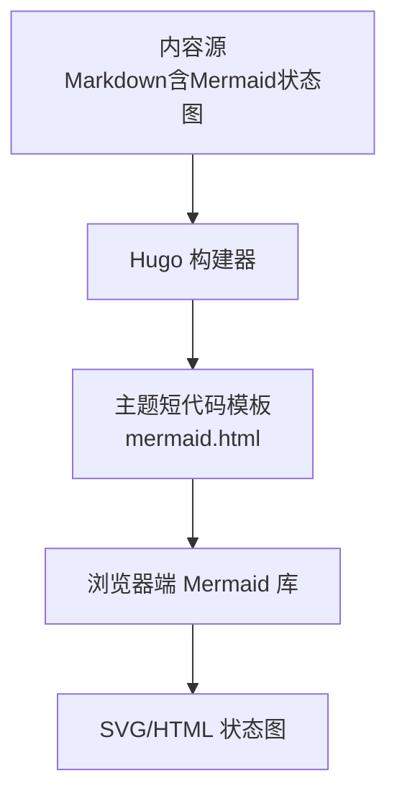
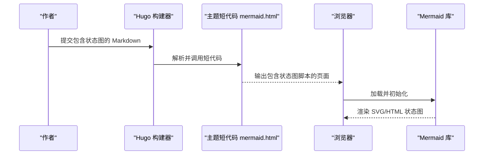

# 状态图绘制

<cite>
**本文引用的文件**   
- [themes/hugo-book/layouts/shortcodes/mermaid.html](file://themes/hugo-book/layouts/shortcodes/mermaid.html)
- [content/docs/99-English/25-Kids.md](file://content/docs/99-English/25-Kids.md)
- [content/docs/60-AI/21-note.md](file://content/docs/60-AI/21-note.md)
- [config.yaml](file://config.yaml)
- [hugo.toml](file://hugo.toml)
</cite>

## 目录
1. [简介](#简介)
2. [项目结构](#项目结构)
3. [核心组件](#核心组件)
4. [架构总览](#架构总览)
5. [详细组件分析](#详细组件分析)
6. [依赖分析](#依赖分析)
7. [性能考虑](#性能考虑)
8. [故障排查指南](#故障排查指南)
9. [结论](#结论)
10. [附录](#附录)

## 简介
本指南面向在Hugo博客中使用Mermaid状态图的作者与开发者，系统讲解如何定义状态、设置初始与终止状态、触发条件与事件处理、动作执行，以及复合状态、并行状态与嵌套状态等高级特性。同时提供用户会话管理、工作流引擎与协议状态机的建模示例，并给出动画效果与交互功能的实践建议，以及设计模式与并发处理的最佳实践。

## 项目结构
本项目基于Hugo与hugo-book主题，Mermaid通过主题的短代码模板渲染。内容侧以Markdown编写状态图，构建期由Hugo调用主题中的Mermaid短代码进行渲染。

图表来源
- [themes/hugo-book/layouts/shortcodes/mermaid.html](file://themes/hugo-book/layouts/shortcodes/mermaid.html)

章节来源
- [themes/hugo-book/layouts/shortcodes/mermaid.html](file://themes/hugo-book/layouts/shortcodes/mermaid.html)

## 核心组件
- 内容层：使用Markdown内嵌Mermaid状态图语法，描述状态机模型。
- 主题层：通过短代码模板将Mermaid块转换为可渲染的DOM节点。
- 运行层：浏览器加载Mermaid库，解析并渲染为矢量图形。

章节来源
- [themes/hugo-book/layouts/shortcodes/mermaid.html](file://themes/hugo-book/layouts/shortcodes/mermaid.html)

## 架构总览
下图展示了从内容到最终渲染的关键路径，以及配置对行为的影响。

图表来源
- [themes/hugo-book/layouts/shortcodes/mermaid.html](file://themes/hugo-book/layouts/shortcodes/mermaid.html)

## 详细组件分析

### 状态定义与基本语法
- 状态命名：使用简洁明确的中文或英文标识符，避免特殊字符。
- 箭头与标签：用“-->”表示转换，可在箭头上标注触发条件与动作。
- 注释与样式：可使用注释行与可选的样式修饰提升可读性。

章节来源
- [content/docs/99-English/25-Kids.md](file://content/docs/99-English/25-Kids.md)
- [content/docs/60-AI/21-note.md](file://content/docs/60-AI/21-note.md)

### 初始状态与终止状态
- 初始状态：通常以带圆点的起始标记指向首个状态。
- 终止状态：以双圈或带圆点的结束标记表示流程终结。
- 多入口/多出口：允许从不同状态汇聚到同一目标，或从同一状态分支到多个目标。

章节来源
- [content/docs/99-English/25-Kids.md](file://content/docs/99-English/25-Kids.md)
- [content/docs/60-AI/21-note.md](file://content/docs/60-AI/21-note.md)

### 条件触发、事件处理与动作执行
- 条件触发：在转换箭头的标签中表达布尔条件或守卫表达式。
- 事件处理：将外部事件作为转换的触发源，配合条件判断控制流向。
- 动作执行：在转换或进入/退出状态时附加动作说明，便于追踪副作用。

章节来源
- [content/docs/99-English/25-Kids.md](file://content/docs/99-English/25-Kids.md)
- [content/docs/60-AI/21-note.md](file://content/docs/60-AI/21-note.md)

### 复合状态、并行状态与嵌套状态
- 复合状态：将相关子状态组织在一个容器内，体现层次化结构。
- 并行状态：在同一父状态下同时存在多个正交区域，各自独立演化。
- 嵌套状态：在复合状态内部继续分层，形成多级状态树，提高复杂系统的可维护性。

章节来源
- [content/docs/99-English/25-Kids.md](file://content/docs/99-English/25-Kids.md)
- [content/docs/60-AI/21-note.md](file://content/docs/60-AI/21-note.md)

### 实际建模示例

#### 用户会话管理
- 典型状态：未认证、已认证、锁定、过期、注销。
- 关键转换：登录成功进入已认证；鉴权失败返回未认证；长时间无操作进入过期；异常错误进入锁定。
- 动作与日志：记录登录尝试次数、超时清理、安全审计事件。

章节来源
- [content/docs/99-English/25-Kids.md](file://content/docs/99-English/25-Kids.md)
- [content/docs/60-AI/21-note.md](file://content/docs/60-AI/21-note.md)

#### 工作流引擎
- 典型状态：待开始、进行中、挂起、重试、完成、失败。
- 关键转换：任务调度后进入进行中；人工干预可挂起；失败策略决定重试或失败；完成后归档。
- 动作与监控：采集耗时指标、告警阈值、补偿与回滚动作。

章节来源
- [content/docs/99-English/25-Kids.md](file://content/docs/99-English/25-Kids.md)
- [content/docs/60-AI/21-note.md](file://content/docs/60-AI/21-note.md)

#### 协议状态机
- 典型状态：空闲、握手、协商、建立、传输、关闭。
- 关键转换：三次握手成功后进入建立；协商失败回到空闲；传输异常触发关闭。
- 动作与重连：统计丢包率、指数退避重连、资源释放。

章节来源
- [content/docs/99-English/25-Kids.md](file://content/docs/99-English/25-Kids.md)
- [content/docs/60-AI/21-note.md](file://content/docs/60-AI/21-note.md)

### 动画效果与交互功能
- 动画：可通过主题或Mermaid配置启用过渡与高亮，增强演示效果。
- 交互：支持点击跳转、缩放与拖拽查看细节，适合交互式文档。
- 注意事项：移动端性能与可读性需权衡，必要时降级静态展示。

章节来源
- [themes/hugo-book/layouts/shortcodes/mermaid.html](file://themes/hugo-book/layouts/shortcodes/mermaid.html)

### 状态机设计模式与并发处理最佳实践
- 设计模式
  - 状态封装：将状态与行为绑定，降低耦合。
  - 事件驱动：以事件为中心编排转换，提升扩展性。
  - 守卫与动作分离：条件与副作用清晰解耦。
  - 分层抽象：用复合状态组织复杂逻辑。
- 并发处理
  - 幂等转换：确保重复事件不改变结果。
  - 锁与原子性：并发写入时使用细粒度锁或事务。
  - 背压与限流：高峰期保护状态机稳定。
  - 观测与可恢复：持久化快照与回放能力。

章节来源
- [content/docs/99-English/25-Kids.md](file://content/docs/99-English/25-Kids.md)
- [content/docs/60-AI/21-note.md](file://content/docs/60-AI/21-note.md)

## 依赖分析
- 构建期依赖：Hugo解析Markdown并调用主题短代码。
- 运行时依赖：浏览器加载Mermaid库完成渲染。
- 配置影响：站点配置可能影响主题行为与资源加载。

图表来源
- [themes/hugo-book/layouts/shortcodes/mermaid.html](file://themes/hugo-book/layouts/shortcodes/mermaid.html)
- [config.yaml](file://config.yaml)
- [hugo.toml](file://hugo.toml)

章节来源
- [themes/hugo-book/layouts/shortcodes/mermaid.html](file://themes/hugo-book/layouts/shortcodes/mermaid.html)
- [config.yaml](file://config.yaml)
- [hugo.toml](file://hugo.toml)

## 性能考虑
- 首屏渲染：按需加载Mermaid库，减少无关资源。
- 大图优化：拆分复杂状态图为多页或多图，避免单图过大。
- 缓存策略：利用浏览器缓存与CDN加速静态资源。
- 降级方案：在无JS环境提供静态图片预览。

[本节为通用指导，无需引用具体文件]

## 故障排查指南
- 短代码未生效：确认主题短代码模板存在且被正确调用。
- 渲染空白：检查浏览器控制台是否有Mermaid解析错误。
- 样式异常：核对主题CSS与Mermaid默认样式的冲突。
- 构建缓慢：减少单次状态图规模，拆分为多个小图。

章节来源
- [themes/hugo-book/layouts/shortcodes/mermaid.html](file://themes/hugo-book/layouts/shortcodes/mermaid.html)

## 结论
通过在Hugo中结合主题短代码与Mermaid，可以高效地表达复杂的状态机模型。遵循良好的设计模式与并发处理原则，能够显著提升状态机的可维护性与稳定性。合理运用复合、并行与嵌套状态，有助于在保持可读性的同时表达真实业务复杂度。

[本节为总结性内容，无需引用具体文件]

## 附录
- 快速上手清单
  - 在Markdown中插入状态图块。
  - 使用主题短代码模板进行渲染。
  - 在浏览器中验证交互与动画效果。
- 参考位置
  - 主题短代码模板：[themes/hugo-book/layouts/shortcodes/mermaid.html](file://themes/hugo-book/layouts/shortcodes/mermaid.html)
  - 示例内容：[content/docs/99-English/25-Kids.md](file://content/docs/99-English/25-Kids.md)、[content/docs/60-AI/21-note.md](file://content/docs/60-AI/21-note.md)
  - 站点配置：[config.yaml](file://config.yaml)、[hugo.toml](file://hugo.toml)