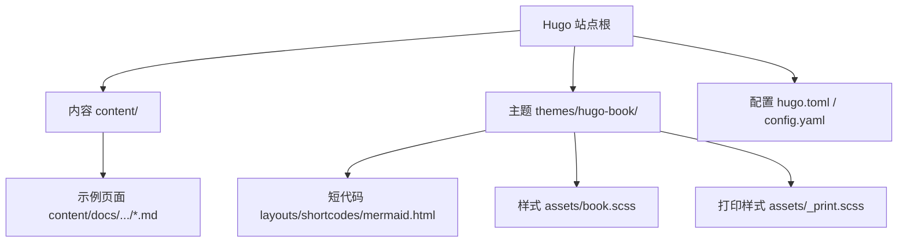
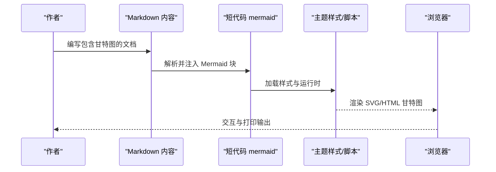
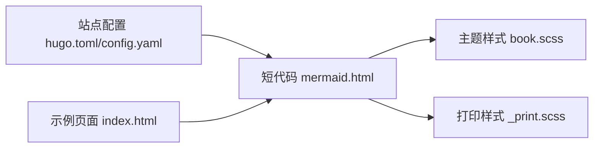

# 甘特图绘制

<cite>
**本文引用的文件**   
- [hugo.toml](file://hugo.toml)
- [config.yaml](file://config.yaml)
- [mermaid.html](file://themes/hugo-book/layouts/shortcodes/mermaid.html)
- [book.scss](file://themes/hugo-book/assets/book.scss)
- [_print.scss](file://themes/hugo-book/assets/_print.scss)
- [index.html](file://content/docs/90-Tools/11_Golang.md)
</cite>

## 目录
1. [简介](#简介)
2. [项目结构](#项目结构)
3. [核心组件](#核心组件)
4. [架构总览](#架构总览)
5. [详细组件分析](#详细组件分析)
6. [依赖关系分析](#依赖关系分析)
7. [性能与渲染优化](#性能与渲染优化)
8. [故障排查指南](#故障排查指南)
9. [结论](#结论)
10. [附录](#附录)

## 简介
本文件面向在 Hugo + hugo-book 主题中绘制 Mermaid 甘特图的读者，系统讲解：
- 任务定义、时间轴设置与进度条显示方法
- 任务依赖关系、里程碑标记与资源分配的配置方式
- 从简单任务列表到复杂项目计划的创建流程
- 日期格式、时间单位与日历设置的语法规则
- 交互式功能与打印优化
- 项目管理最佳实践与团队协作的图表组织策略

## 项目结构
本项目基于 Hugo 静态站点生成器与 hugo-book 主题。Mermaid 支持通过主题的短代码 mermaid 实现，样式由主题 SCSS 管理，构建配置位于 hugo.toml 或 config.yaml。

图示来源
- [mermaid.html](file://themes/hugo-book/layouts/shortcodes/mermaid.html)
- [book.scss](file://themes/hugo-book/assets/book.scss)
- [_print.scss](file://themes/hugo-book/assets/_print.scss)
- [hugo.toml](file://hugo.toml)
- [config.yaml](file://config.yaml)

章节来源
- [hugo.toml](file://hugo.toml)
- [config.yaml](file://config.yaml)
- [mermaid.html](file://themes/hugo-book/layouts/shortcodes/mermaid.html)
- [book.scss](file://themes/hugo-book/assets/book.scss)
- [_print.scss](file://themes/hugo-book/assets/_print.scss)

## 核心组件
- 短代码 mermaid：用于在 Markdown 中嵌入 Mermaid 图形（含甘特图）。
- 主题样式：book.scss 与 _print.scss 控制屏幕与打印输出表现。
- 站点配置：hugo.toml 或 config.yaml 决定是否启用 Mermaid 及渲染选项。
- 示例页面：content 下的文档可作为参考入口。

章节来源
- [mermaid.html](file://themes/hugo-book/layouts/shortcodes/mermaid.html)
- [book.scss](file://themes/hugo-book/assets/book.scss)
- [_print.scss](file://themes/hugo-book/assets/_print.scss)
- [hugo.toml](file://hugo.toml)
- [config.yaml](file://config.yaml)
- [index.html](file://content/docs/90-Tools/11_Golang.md)

## 架构总览
下图展示从 Markdown 到最终页面的渲染路径，以及甘特图在其中的位置。

图示来源
- [mermaid.html](file://themes/hugo-book/layouts/shortcodes/mermaid.html)
- [book.scss](file://themes/hugo-book/assets/book.scss)
- [_print.scss](file://themes/hugo-book/assets/_print.scss)

## 详细组件分析

### 短代码 mermaid 的使用要点
- 在 Markdown 中使用短代码 mermaid 包裹 Mermaid 语法块，即可在页面中渲染为可交互的图形。
- 对于甘特图，使用 gantt 关键字定义图表类型，并在其后配置标题、日期范围、周期等。
- 任务行以 task 语句描述，支持任务 ID、名称、开始/结束日期、进度百分比、依赖关系、里程碑与资源标签等。
- 可通过 section 分组任务，便于大型计划的结构化呈现。

章节来源
- [mermaid.html](file://themes/hugo-book/layouts/shortcodes/mermaid.html)

### 时间轴与日期格式
- 时间轴通常由 start_date 与 end_date 定义，表示整个项目的起止时间。
- 任务的开始与结束可使用多种日期表达形式，包括绝对日期与相对表达式（如“after X days”）。
- 周期（period）可设置为 day、week、month、year，影响时间轴刻度粒度。
- 建议统一使用 ISO 风格的日期字符串，避免时区歧义；若需本地化，可在主题或站点层面进行语言配置。

章节来源
- [mermaid.html](file://themes/hugo-book/layouts/shortcodes/mermaid.html)

### 任务定义与进度条
- 每个任务包含唯一 ID、名称、起止时间与可选进度值。
- 进度值以百分比表示，渲染为条形图中的填充比例。
- 任务可附加备注信息，便于在悬停或详情面板中查看。

章节来源
- [mermaid.html](file://themes/hugo-book/layouts/shortcodes/mermaid.html)

### 任务依赖关系
- 依赖关系通过 after 关键字声明，形成有向无环图（DAG），确保关键路径清晰。
- 依赖链过长时建议使用 section 分组，提升可读性。
- 建议在里程碑处设置强依赖，作为阶段验收点。

章节来源
- [mermaid.html](file://themes/hugo-book/layouts/shortcodes/mermaid.html)

### 里程碑与资源分配
- 里程碑用 milestone 类型标识，常用于关键节点或交付物完成标志。
- 资源分配通过 resource 标签标注，便于在多团队协同中标识负责人或角色。
- 资源标签可与任务名或备注结合，形成更丰富的上下文信息。

章节来源
- [mermaid.html](file://themes/hugo-book/layouts/shortcodes/mermaid.html)

### 从简单到复杂的创建流程
- 第一步：定义项目起止时间与周期，建立基础时间轴。
- 第二步：列出主要任务，设定起止时间与进度。
- 第三步：添加依赖关系，形成任务先后顺序。
- 第四步：插入里程碑，划分阶段目标。
- 第五步：按模块或团队使用 section 分组，提升可读性。
- 第六步：为关键任务添加资源标签，明确责任归属。
- 第七步：在文档中引入该甘特图，并配合说明文字解释关键路径与风险点。

章节来源
- [mermaid.html](file://themes/hugo-book/layouts/shortcodes/mermaid.html)

### 交互式功能与打印优化
- 交互能力由主题加载的 Mermaid 运行时提供，支持缩放、平移与工具提示。
- 打印样式由 _print.scss 控制，确保导出 PDF 或打印时布局合理、尺寸适配。
- 建议在站点配置中开启必要的压缩与缓存，以提升首屏渲染速度。

章节来源
- [book.scss](file://themes/hugo-book/assets/book.scss)
- [_print.scss](file://themes/hugo-book/assets/_print.scss)
- [hugo.toml](file://hugo.toml)
- [config.yaml](file://config.yaml)

### 示例页面参考
- 可在 content 目录下查找已存在的文档页面，作为结构与排版的参考入口。
- 示例页面展示了如何在文档中组织图表与说明文本，便于团队协作与维护。

章节来源
- [index.html](file://content/docs/90-Tools/11_Golang.md)

## 依赖关系分析
- 短代码 mermaid 是渲染入口，负责将 Mermaid 语法转换为可交互图形。
- 主题样式 book.scss 与 _print.scss 分别负责屏幕与打印输出。
- 站点配置 hugo.toml 或 config.yaml 控制是否启用 Mermaid 与相关构建选项。
- 示例页面 index.html 作为内容入口，体现文档组织方式。

图示来源
- [mermaid.html](file://themes/hugo-book/layouts/shortcodes/mermaid.html)
- [book.scss](file://themes/hugo-book/assets/book.scss)
- [_print.scss](file://themes/hugo-book/assets/_print.scss)
- [hugo.toml](file://hugo.toml)
- [config.yaml](file://config.yaml)
- [index.html](file://content/docs/90-Tools/11_Golang.md)

章节来源
- [mermaid.html](file://themes/hugo-book/layouts/shortcodes/mermaid.html)
- [book.scss](file://themes/hugo-book/assets/book.scss)
- [_print.scss](file://themes/hugo-book/assets/_print.scss)
- [hugo.toml](file://hugo.toml)
- [config.yaml](file://config.yaml)
- [index.html](file://content/docs/90-Tools/11_Golang.md)

## 性能与渲染优化
- 减少不必要的任务数量与依赖深度，保持 DAG 简洁，降低渲染复杂度。
- 合理使用 section 分组，避免单页图表过大导致浏览器卡顿。
- 在站点配置中启用资源压缩与缓存，缩短首次加载时间。
- 针对移动端与窄屏设备，调整 period 与字体大小，保证可读性。
- 打印前预览 PDF 输出，必要时在 _print.scss 中微调边距与分页行为。

[本节为通用指导，不直接分析具体文件]

## 故障排查指南
- 图表未渲染：检查短代码 mermaid 是否正确包裹 Mermaid 块；确认主题已加载 Mermaid 运行时。
- 日期异常：核对日期格式与时区设置，优先使用标准 ISO 格式；避免混用相对与绝对日期造成冲突。
- 依赖循环：检查 after 声明是否形成环，必要时拆分任务或引入中间里程碑。
- 打印错位：在 _print.scss 中调整容器宽度与分页规则，确保长任务条不被截断。
- 交互失效：确认浏览器允许执行脚本；检查控制台是否有 JS 错误。

章节来源
- [mermaid.html](file://themes/hugo-book/layouts/shortcodes/mermaid.html)
- [_print.scss](file://themes/hugo-book/assets/_print.scss)
- [hugo.toml](file://hugo.toml)
- [config.yaml](file://config.yaml)

## 结论
通过在 Hugo + hugo-book 主题中使用短代码 mermaid，可以高效地在文档中嵌入可交互的甘特图。遵循统一的日期与时间单位规范、合理组织任务与依赖、利用里程碑与资源标签明确责任，并结合打印优化与性能调优，能够显著提升项目计划的可读性与协作效率。

[本节为总结性内容，不直接分析具体文件]

## 附录
- 术语说明
  - 任务：具有起止时间与进度的工作项。
  - 依赖：任务间的先后约束关系。
  - 里程碑：关键节点或交付物完成标志。
  - 资源：参与任务的团队或个人标签。
- 最佳实践
  - 将大项目拆分为多个 section，按模块或团队组织任务。
  - 在里程碑处设置强依赖，便于跟踪关键路径。
  - 定期更新进度与资源标签，保持计划与实际一致。
  - 在文档中补充关键路径分析与风险提示，辅助决策。

[本节为概念性内容，不直接分析具体文件]