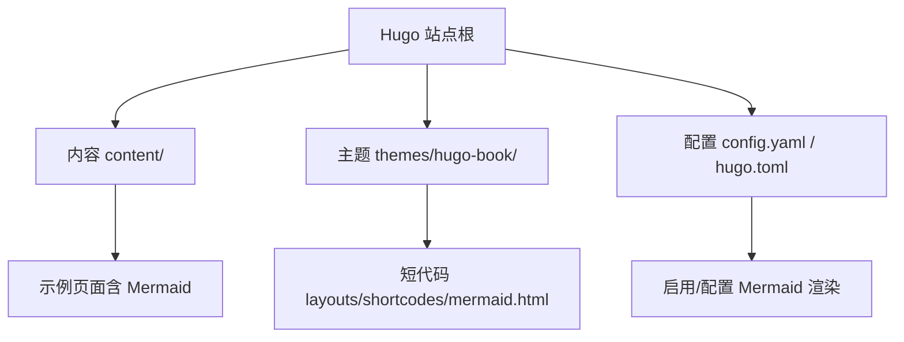
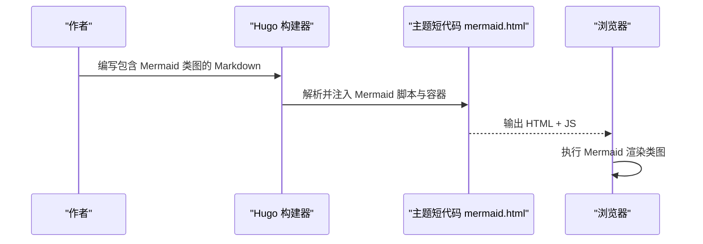
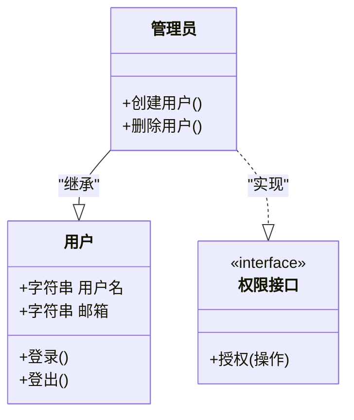
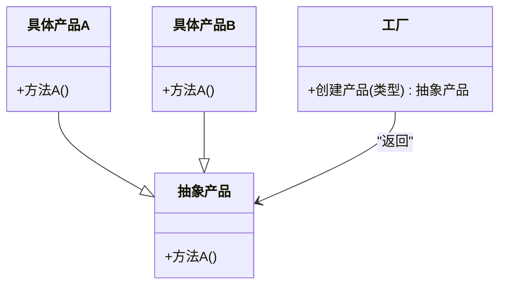

# 类图绘制

<cite>
**本文引用的文件**   
- [README.md](file://README.md)
- [config.yaml](file://config.yaml)
- [hugo.toml](file://hugo.toml)
- [themes/hugo-book/layouts/shortcodes/mermaid.html](file://themes/hugo-book/layouts/shortcodes/mermaid.html)
- [content/docs/99-English/25-Kids.md](file://content/docs/99-English/25-Kids.md)
</cite>

## 目录
1. [简介](#简介)
2. [项目结构](#项目结构)
3. [核心组件](#核心组件)
4. [架构总览](#架构总览)
5. [详细组件分析](#详细组件分析)
6. [依赖关系分析](#依赖关系分析)
7. [性能与渲染特性](#性能与渲染特性)
8. [故障排查指南](#故障排查指南)
9. [结论](#结论)
10. [附录：Mermaid 类图语法与实践](#附录mermaid-类图语法与实践)

## 简介
本文件面向希望在 Hugo 站点中绘制 Mermaid 类图的读者，系统讲解类图语法、继承/实现/关联/依赖的表示方法、可见性与静态成员、接口定义、样式定制与代码生成能力，并结合 UML 最佳实践与设计模式的图示表达。内容基于仓库中的主题短代码与配置进行说明，帮助你在文档中高效、规范地呈现面向对象设计。

## 项目结构
本项目为基于 Hugo 的博客站点，使用 hugo-book 主题提供文档排版与图表支持。Mermaid 类图通过主题的 mermaid 短代码在 Markdown 中嵌入并渲染。

**章节来源**
- [README.md](file://README.md)
- [config.yaml](file://config.yaml)
- [hugo.toml](file://hugo.toml)
- [themes/hugo-book/layouts/shortcodes/mermaid.html](file://themes/hugo-book/layouts/shortcodes/mermaid.html)

## 核心组件
- 主题短代码 mermaid：负责在页面中插入 Mermaid 脚本与容器，完成类图渲染。
- 站点配置：控制是否启用 Mermaid、加载版本或自定义参数等。
- 内容页：以 Markdown 内嵌 Mermaid 类图块，描述类、属性、方法与关系。

**章节来源**
- [themes/hugo-book/layouts/shortcodes/mermaid.html](file://themes/hugo-book/layouts/shortcodes/mermaid.html)
- [config.yaml](file://config.yaml)
- [hugo.toml](file://hugo.toml)

## 架构总览
下图展示“作者编写 Markdown → Hugo 构建 → 主题短代码注入 → 浏览器渲染”的整体流程。

**图表来源**
- [themes/hugo-book/layouts/shortcodes/mermaid.html](file://themes/hugo-book/layouts/shortcodes/mermaid.html)

## 详细组件分析

### 主题短代码 mermaid.html
- 职责：在页面中注入 Mermaid 初始化与渲染逻辑，将 Markdown 中的类图块转换为可视化图形。
- 关键点：
  - 识别类图块标记，提取图元文本。
  - 注入必要的 CSS/JS 资源与渲染容器。
  - 调用 Mermaid API 完成渲染。
- 扩展点：可通过主题变量或站点配置调整行为（如延迟渲染、主题色、字体等）。

**章节来源**
- [themes/hugo-book/layouts/shortcodes/mermaid.html](file://themes/hugo-book/layouts/shortcodes/mermaid.html)

### 站点配置（config.yaml / hugo.toml）
- 作用：启用/禁用 Mermaid、指定版本、设置全局参数（如主题、语言、缩放等）。
- 建议：
  - 在站点级统一开启 Mermaid，避免每页重复配置。
  - 若需特定版本或 CDN，可在配置中声明。
  - 结合 hugo-book 主题变量，保持全站风格一致。

**章节来源**
- [config.yaml](file://config.yaml)
- [hugo.toml](file://hugo.toml)

### 内容示例（含 Mermaid 类图）
- 示例位置：content/docs/99-English/25-Kids.md
- 用途：演示如何在页面中嵌入 Mermaid 类图，验证渲染效果。
- 建议：
  - 使用清晰的类名与关系标签。
  - 控制类图规模，必要时拆分为多张图。
  - 配合标题与说明文字，提升可读性。

**章节来源**
- [content/docs/99-English/25-Kids.md](file://content/docs/99-English/25-Kids.md)

## 依赖关系分析
- 主题层依赖：
  - hugo-book 主题提供的 mermaid 短代码模板。
  - Hugo 的模板引擎与资源管线。
- 运行时依赖：
  - 浏览器端 Mermaid 库（由短代码注入）。
- 可能的循环依赖：无（短代码单向注入，不反向依赖页面内容）。

**图表来源**
- [themes/hugo-book/layouts/shortcodes/mermaid.html](file://themes/hugo-book/layouts/shortcodes/mermaid.html)

**章节来源**
- [themes/hugo-book/layouts/shortcodes/mermaid.html](file://themes/hugo-book/layouts/shortcodes/mermaid.html)

## 性能与渲染特性
- 渲染时机：建议在页面滚动到可视区域后再触发渲染，减少首屏开销。
- 资源体积：按需引入 Mermaid 最小化包；避免在同一页面重复初始化。
- 复杂度控制：单图节点数建议控制在合理范围，复杂体系可拆分多张图。
- 缓存策略：利用浏览器缓存与 Hugo 静态资源缓存，提升二次访问速度。

[本节为通用指导，无需具体文件引用]

## 故障排查指南
- 现象：类图未显示或空白
  - 检查是否启用了 Mermaid 短代码与相关资源。
  - 确认页面中存在合法的类图文本块。
  - 查看浏览器控制台是否有 JS 错误。
- 现象：样式异常或字体缺失
  - 核对主题样式与 Mermaid 默认样式的兼容性。
  - 检查是否被第三方样式覆盖。
- 现象：构建缓慢
  - 评估类图数量与复杂度，考虑分页或懒加载。
  - 优化资源加载顺序与缓存策略。

[本节为通用指导，无需具体文件引用]

## 结论
通过在 hugo-book 主题中使用 mermaid 短代码，你可以在 Hugo 站点中以简洁的 Markdown 方式绘制高质量的类图。结合合理的配置与内容组织，既能保证可读性，也能兼顾构建与渲染性能。

[本节为总结性内容，无需具体文件引用]

## 附录：Mermaid 类图语法与实践

### 基本语法要点
- 类定义：使用 class 关键字声明类名，并在类体内列出属性与方法。
- 可见性修饰符：
  - 公有：+
  - 私有：-
  - 受保护：#
- 静态成员：
  - 静态属性与方法通常以下划线前缀或标注 static 的方式表达（遵循团队约定）。
- 接口定义：
  - 使用 interface 关键字声明接口，再让类实现该接口。
- 关系表达：
  - 继承：空心三角箭头指向父类。
  - 实现：虚线加空心三角箭头指向接口。
  - 关联：实线连接两个类，可标注多重性与角色名。
  - 聚合/组合：菱形箭头分别表示弱/强拥有关系。
  - 依赖：虚线箭头表示使用关系。

### 面向对象建模示例（从简单到复杂）
- 简单类：仅包含必要属性与方法，体现单一职责。
- 继承体系：抽象基类定义通用行为，子类细化差异。
- 接口契约：定义稳定接口，便于替换实现与测试。
- 组合优先：用组合替代深层继承，降低耦合度。

**图表来源**
- [themes/hugo-book/layouts/shortcodes/mermaid.html](file://themes/hugo-book/layouts/shortcodes/mermaid.html)

### 设计模式图示表达
- 工厂模式：抽象产品与具体产品、工厂与具体工厂之间的继承/实现关系。
- 观察者模式：主题与观察者之间的关联与通知关系。
- 策略模式：上下文与多种策略的依赖关系，强调可插拔。

**图表来源**
- [themes/hugo-book/layouts/shortcodes/mermaid.html](file://themes/hugo-book/layouts/shortcodes/mermaid.html)

### 样式定制与代码生成
- 样式定制：
  - 通过主题变量或自定义 CSS 调整字体、颜色、间距。
  - 使用 Mermaid 主题选项切换明暗主题。
- 代码生成：
  - 可从现有代码库导出类图（例如借助 IDE 或工具链），再将生成的 Mermaid 文本粘贴到文档中。
  - 在 CI 中自动校验类图与源码一致性（可选）。

[本节为通用指导，无需具体文件引用]

### UML 最佳实践
- 命名清晰：类名采用名词短语，方法名采用动词短语。
- 粒度适中：单类职责单一，单图节点数量可控。
- 关系明确：区分继承、实现、关联、依赖，避免滥用继承。
- 文档配套：为关键类与关系添加简短说明，增强可读性。

[本节为通用指导，无需具体文件引用]