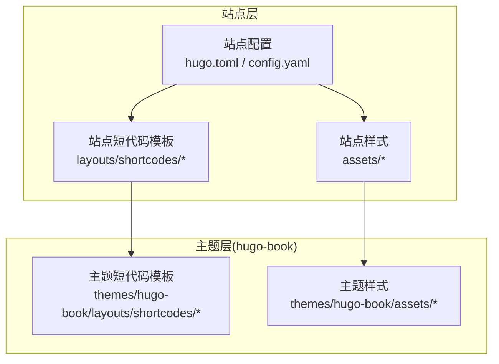
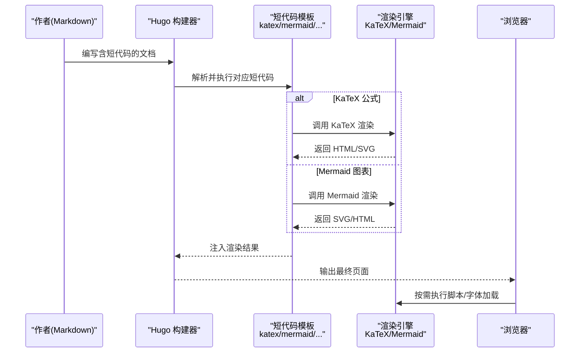
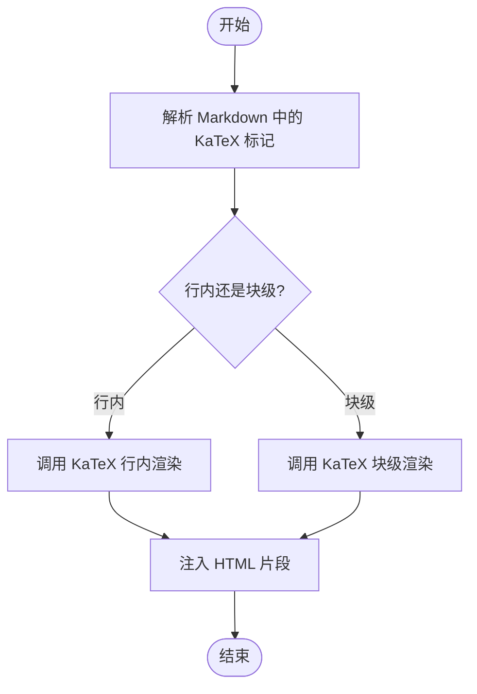
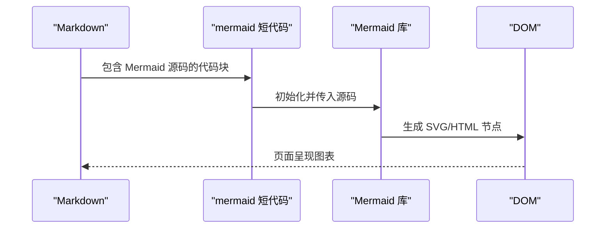
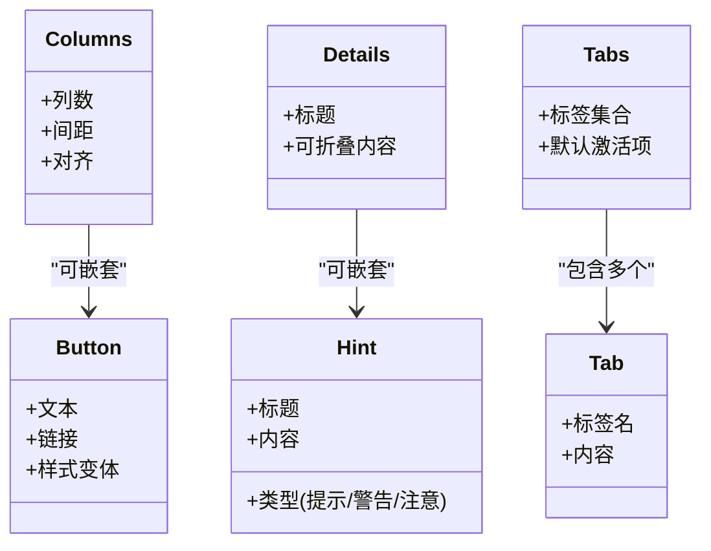
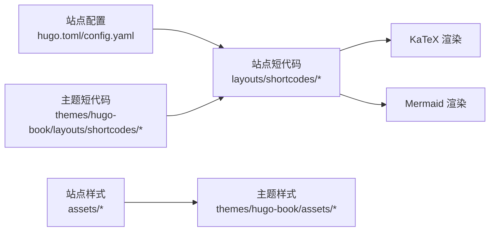

# 多媒体元素集成

<cite>
**本文引用的文件**   
- [hugo.toml](file://hugo.toml)
- [config.yaml](file://config.yaml)
- [layouts/shortcodes/katex.html](file://layouts/shortcodes/katex.html)
- [layouts/shortcodes/mermaid.html](file://layouts/shortcodes/mermaid.html)
- [layouts/shortcodes/button.html](file://layouts/shortcodes/button.html)
- [layouts/shortcodes/columns.html](file://layouts/shortcodes/columns.html)
- [layouts/shortcodes/details.html](file://layouts/shortcodes/details.html)
- [layouts/shortcodes/hint.html](file://layouts/shortcodes/hint.html)
- [layouts/shortcodes/tabs.html](file://layouts/shortcodes/tabs.html)
- [layouts/shortcodes/tab.html](file://layouts/shortcodes/tab.html)
- [assets/book.scss](file://assets/book.scss)
- [assets/_variables.scss](file://assets/_variables.scss)
- [assets/_shortcodes.scss](file://assets/_shortcodes.scss)
- [themes/hugo-book/layouts/shortcodes/katex.html](file://themes/hugo-book/layouts/shortcodes/katex.html)
- [themes/hugo-book/layouts/shortcodes/mermaid.html](file://themes/hugo-book/layouts/shortcodes/mermaid.html)
- [themes/hugo-book/layouts/shortcodes/button.html](file://themes/hugo-book/layouts/shortcodes/button.html)
- [themes/hugo-book/layouts/shortcodes/columns.html](file://themes/hugo-book/layouts/shortcodes/columns.html)
- [themes/hugo-book/layouts/shortcodes/details.html](file://themes/hugo-book/layouts/shortcodes/details.html)
- [themes/hugo-book/layouts/shortcodes/hint.html](file://themes/hugo-book/layouts/shortcodes/hint.html)
- [themes/hugo-book/layouts/shortcodes/tabs.html](file://themes/hugo-book/layouts/shortcodes/tabs.html)
- [themes/hugo-book/layouts/shortcodes/tab.html](file://themes/hugo-book/layouts/shortcodes/tab.html)
- [themes/hugo-book/assets/book.scss](file://themes/hugo-book/assets/book.scss)
- [themes/hugo-book/assets/_variables.scss](file://themes/hugo-book/assets/_variables.scss)
- [themes/hugo-book/assets/_shortcodes.scss](file://themes/hugo-book/assets/_shortcodes.scss)
</cite>

## 目录
1. [简介](#简介)
2. [项目结构](#项目结构)
3. [核心组件](#核心组件)
4. [架构总览](#架构总览)
5. [详细组件分析](#详细组件分析)
6. [依赖关系分析](#依赖关系分析)
7. [性能考虑](#性能考虑)
8. [故障排查指南](#故障排查指南)
9. [结论](#结论)
10. [附录](#附录)

## 简介
本指南面向在文档中集成富媒体内容的作者与开发者，聚焦以下能力：
- KaTeX 数学公式：基础符号、复杂表达式、矩阵与方程组等。
- Mermaid 图表：流程图、时序图、类图、甘特图等。
- 短代码增强：按钮、列布局、提示框、标签页、详情折叠等。
- 图片与视频资源组织：响应式图片、懒加载、CDN 配置与优化技巧。
- 最佳实践与常见问题排查。

## 项目结构
本项目基于 Hugo + hugo-book 主题，通过“站点级覆盖”的方式扩展默认主题行为。关键路径说明：
- 站点配置：hugo.toml、config.yaml
- 站点级短代码模板：layouts/shortcodes/*（优先于主题内置）
- 主题内置短代码模板：themes/hugo-book/layouts/shortcodes/*
- 样式覆盖：assets/*（站点层）与 themes/hugo-book/assets/*（主题层）

图示来源
- [hugo.toml](file://hugo.toml)
- [config.yaml](file://config.yaml)
- [layouts/shortcodes/katex.html](file://layouts/shortcodes/katex.html)
- [layouts/shortcodes/mermaid.html](file://layouts/shortcodes/mermaid.html)
- [themes/hugo-book/layouts/shortcodes/katex.html](file://themes/hugo-book/layouts/shortcodes/katex.html)
- [themes/hugo-book/layouts/shortcodes/mermaid.html](file://themes/hugo-book/layouts/shortcodes/mermaid.html)

章节来源
- [hugo.toml](file://hugo.toml)
- [config.yaml](file://config.yaml)

## 核心组件
- KaTeX 渲染：通过站点或主题的 katex 短代码模板启用行内与块级公式渲染。
- Mermaid 渲染：通过 mermaid 短代码模板将 Mermaid 源码转换为 SVG/HTML 图表。
- 短代码 UI 增强：button、columns、details、hint、tabs/tab 等提升内容可读性与交互性。
- 样式系统：通过 SCSS 变量与模块统一控制主题外观与短代码样式。

章节来源
- [layouts/shortcodes/katex.html](file://layouts/shortcodes/katex.html)
- [layouts/shortcodes/mermaid.html](file://layouts/shortcodes/mermaid.html)
- [layouts/shortcodes/button.html](file://layouts/shortcodes/button.html)
- [layouts/shortcodes/columns.html](file://layouts/shortcodes/columns.html)
- [layouts/shortcodes/details.html](file://layouts/shortcodes/details.html)
- [layouts/shortcodes/hint.html](file://layouts/shortcodes/hint.html)
- [layouts/shortcodes/tabs.html](file://layouts/shortcodes/tabs.html)
- [layouts/shortcodes/tab.html](file://layouts/shortcodes/tab.html)
- [assets/book.scss](file://assets/book.scss)
- [assets/_variables.scss](file://assets/_variables.scss)
- [assets/_shortcodes.scss](file://assets/_shortcodes.scss)

## 架构总览
下图展示从 Markdown 到最终页面的渲染流程，包括 KaTeX 与 Mermaid 的参与点。

图示来源
- [layouts/shortcodes/katex.html](file://layouts/shortcodes/katex.html)
- [layouts/shortcodes/mermaid.html](file://layouts/shortcodes/mermaid.html)
- [themes/hugo-book/layouts/shortcodes/katex.html](file://themes/hugo-book/layouts/shortcodes/katex.html)
- [themes/hugo-book/layouts/shortcodes/mermaid.html](file://themes/hugo-book/layouts/shortcodes/mermaid.html)

## 详细组件分析

### KaTeX 数学公式
- 使用方式
  - 行内公式：在正文中使用行内语法包裹公式。
  - 块级公式：使用独立区块语法以居中显示。
- 支持范围
  - 基本数学符号、函数、上下标、分式、根号、积分、求和等。
  - 矩阵与数组、对齐与编号、多行方程组等。
- 配置要点
  - 确认站点已启用 KaTeX 相关参数（如是否自动引入 CSS/JS）。
  - 如需自定义字体或宏包，可在站点 assets 中提供并引用。
- 示例参考
  - 站点示例页面：[docs/shortcodes/katex/index.html](file://docs/shortcodes/katex/index.html)

图示来源
- [layouts/shortcodes/katex.html](file://layouts/shortcodes/katex.html)
- [themes/hugo-book/layouts/shortcodes/katex.html](file://themes/hugo-book/layouts/shortcodes/katex.html)

章节来源
- [layouts/shortcodes/katex.html](file://layouts/shortcodes/katex.html)
- [themes/hugo-book/layouts/shortcodes/katex.html](file://themes/hugo-book/layouts/shortcodes/katex.html)

### Mermaid 图表绘制
- 支持的图表类型
  - 流程图、时序图、类图、状态图、甘特图、饼图、ER 图等。
- 使用方式
  - 在 Markdown 中以代码块形式声明 Mermaid 源码，并通过 mermaid 短代码进行渲染。
- 配置要点
  - 确保站点启用了 Mermaid 渲染（引入必要 JS/CSS）。
  - 可通过站点配置调整主题行为（如是否延迟加载、是否启用特定功能）。
- 示例参考
  - 站点示例页面：[docs/shortcodes/mermaid/index.html](file://docs/shortcodes/mermaid/index.html)

图示来源
- [layouts/shortcodes/mermaid.html](file://layouts/shortcodes/mermaid.html)
- [themes/hugo-book/layouts/shortcodes/mermaid.html](file://themes/hugo-book/layouts/shortcodes/mermaid.html)

章节来源
- [layouts/shortcodes/mermaid.html](file://layouts/shortcodes/mermaid.html)
- [themes/hugo-book/layouts/shortcodes/mermaid.html](file://themes/hugo-book/layouts/shortcodes/mermaid.html)

### 短代码增强功能
- 按钮 button
  - 用途：创建可点击的按钮，常用于跳转链接或触发交互。
  - 常用属性：文本、链接地址、样式变体等。
  - 参考实现：[layouts/shortcodes/button.html](file://layouts/shortcodes/button.html)、[themes/hugo-book/layouts/shortcodes/button.html](file://themes/hugo-book/layouts/shortcodes/button.html)
- 列布局 columns
  - 用途：将内容按列排布，适配不同屏幕宽度。
  - 参考实现：[layouts/shortcodes/columns.html](file://layouts/shortcodes/columns.html)、[themes/hugo-book/layouts/shortcodes/columns.html](file://themes/hugo-book/layouts/shortcodes/columns.html)
- 提示框 hint
  - 用途：高亮提示、警告、注意等信息。
  - 参考实现：[layouts/shortcodes/hint.html](file://layouts/shortcodes/hint.html)、[themes/hugo-book/layouts/shortcodes/hint.html](file://themes/hugo-book/layouts/shortcodes/hint.html)
- 详情折叠 details
  - 用途：折叠/展开长内容，保持版面整洁。
  - 参考实现：[layouts/shortcodes/details.html](file://layouts/shortcodes/details.html)、[themes/hugo-book/layouts/shortcodes/details.html](file://themes/hugo-book/layouts/shortcodes/details.html)
- 标签页 tabs/tab
  - 用途：在同一区域切换多个内容面板。
  - 参考实现：[layouts/shortcodes/tabs.html](file://layouts/shortcodes/tabs.html)、[layouts/shortcodes/tab.html](file://layouts/shortcodes/tab.html)、[themes/hugo-book/layouts/shortcodes/tabs.html](file://themes/hugo-book/layouts/shortcodes/tabs.html)、[themes/hugo-book/layouts/shortcodes/tab.html](file://themes/hugo-book/layouts/shortcodes/tab.html)

图示来源
- [layouts/shortcodes/button.html](file://layouts/shortcodes/button.html)
- [layouts/shortcodes/columns.html](file://layouts/shortcodes/columns.html)
- [layouts/shortcodes/details.html](file://layouts/shortcodes/details.html)
- [layouts/shortcodes/hint.html](file://layouts/shortcodes/hint.html)
- [layouts/shortcodes/tabs.html](file://layouts/shortcodes/tabs.html)
- [layouts/shortcodes/tab.html](file://layouts/shortcodes/tab.html)
- [themes/hugo-book/layouts/shortcodes/button.html](file://themes/hugo-book/layouts/shortcodes/button.html)
- [themes/hugo-book/layouts/shortcodes/columns.html](file://themes/hugo-book/layouts/shortcodes/columns.html)
- [themes/hugo-book/layouts/shortcodes/details.html](file://themes/hugo-book/layouts/shortcodes/details.html)
- [themes/hugo-book/layouts/shortcodes/hint.html](file://themes/hugo-book/layouts/shortcodes/hint.html)
- [themes/hugo-book/layouts/shortcodes/tabs.html](file://themes/hugo-book/layouts/shortcodes/tabs.html)
- [themes/hugo-book/layouts/shortcodes/tab.html](file://themes/hugo-book/layouts/shortcodes/tab.html)

章节来源
- [layouts/shortcodes/button.html](file://layouts/shortcodes/button.html)
- [layouts/shortcodes/columns.html](file://layouts/shortcodes/columns.html)
- [layouts/shortcodes/details.html](file://layouts/shortcodes/details.html)
- [layouts/shortcodes/hint.html](file://layouts/shortcodes/hint.html)
- [layouts/shortcodes/tabs.html](file://layouts/shortcodes/tabs.html)
- [layouts/shortcodes/tab.html](file://layouts/shortcodes/tab.html)
- [themes/hugo-book/layouts/shortcodes/button.html](file://themes/hugo-book/layouts/shortcodes/button.html)
- [themes/hugo-book/layouts/shortcodes/columns.html](file://themes/hugo-book/layouts/shortcodes/columns.html)
- [themes/hugo-book/layouts/shortcodes/details.html](file://themes/hugo-book/layouts/shortcodes/details.html)
- [themes/hugo-book/layouts/shortcodes/hint.html](file://themes/hugo-book/layouts/shortcodes/hint.html)
- [themes/hugo-book/layouts/shortcodes/tabs.html](file://themes/hugo-book/layouts/shortcodes/tabs.html)
- [themes/hugo-book/layouts/shortcodes/tab.html](file://themes/hugo-book/layouts/shortcodes/tab.html)

### 图片与视频资源管理
- 资源组织建议
  - 将静态资源放入 static 目录，或通过 resources 机制处理。
  - 为图片提供多种尺寸，结合 srcset 实现响应式加载。
- 懒加载与 CDN
  - 在 HTML 中使用 loading="lazy" 实现懒加载。
  - 将资源托管至 CDN，缩短首屏时间并提升缓存命中率。
- 视频嵌入
  - 使用原生 video 标签或第三方播放器，注意跨域与格式兼容性。
- 站点配置
  - 在 hugo.toml 或 config.yaml 中配置资源路径、CDN 前缀等。

章节来源
- [hugo.toml](file://hugo.toml)
- [config.yaml](file://config.yaml)

## 依赖关系分析
- 短代码模板优先级
  - 站点 layouts/shortcodes/* 优先于主题 themes/hugo-book/layouts/shortcodes/*。
- 样式合并顺序
  - 站点 assets/* 覆盖主题 themes/hugo-book/assets/*。
- 外部依赖
  - KaTeX：用于数学公式渲染。
  - Mermaid：用于图表渲染。
  - Hugo 构建器：负责模板解析与资源打包。

图示来源
- [hugo.toml](file://hugo.toml)
- [config.yaml](file://config.yaml)
- [layouts/shortcodes/katex.html](file://layouts/shortcodes/katex.html)
- [layouts/shortcodes/mermaid.html](file://layouts/shortcodes/mermaid.html)
- [themes/hugo-book/layouts/shortcodes/katex.html](file://themes/hugo-book/layouts/shortcodes/katex.html)
- [themes/hugo-book/layouts/shortcodes/mermaid.html](file://themes/hugo-book/layouts/shortcodes/mermaid.html)
- [assets/book.scss](file://assets/book.scss)
- [themes/hugo-book/assets/book.scss](file://themes/hugo-book/assets/book.scss)

章节来源
- [hugo.toml](file://hugo.toml)
- [config.yaml](file://config.yaml)
- [assets/book.scss](file://assets/book.scss)
- [assets/_variables.scss](file://assets/_variables.scss)
- [assets/_shortcodes.scss](file://assets/_shortcodes.scss)
- [themes/hugo-book/assets/book.scss](file://themes/hugo-book/assets/book.scss)
- [themes/hugo-book/assets/_variables.scss](file://themes/hugo-book/assets/_variables.scss)
- [themes/hugo-book/assets/_shortcodes.scss](file://themes/hugo-book/assets/_shortcodes.scss)

## 性能考虑
- 按需加载
  - 对 Mermaid 等大体积脚本采用延迟加载策略，减少首屏阻塞。
- 资源压缩与缓存
  - 启用静态资源压缩与长期缓存；合理设置 Cache-Control。
- 字体与图标
  - 仅引入必要的 KaTeX 字体子集，避免冗余下载。
- 图片优化
  - 使用现代格式（WebP/AVIF）、按需裁剪与懒加载。
- 构建产物
  - 利用 Hugo 的资源管道生成哈希化文件名，提升缓存命中。

## 故障排查指南
- KaTeX 不渲染
  - 检查站点是否启用 KaTeX 相关配置；确认 katex 短代码模板存在且未被错误覆盖。
  - 查看浏览器控制台是否有字体或脚本加载失败。
- Mermaid 不显示
  - 确认 mermaid 短代码模板正确引入；检查浏览器控制台是否有脚本错误。
  - 若使用延迟加载，确认触发时机与事件绑定。
- 短代码样式异常
  - 检查站点 _shortcodes.scss 与 _variables.scss 是否覆盖了主题样式导致冲突。
  - 清理浏览器缓存后重试。
- 图片/视频无法加载
  - 核对资源路径与权限；检查 CDN 域名与跨域策略。
  - 验证浏览器是否拦截了非安全资源。

章节来源
- [layouts/shortcodes/katex.html](file://layouts/shortcodes/katex.html)
- [layouts/shortcodes/mermaid.html](file://layouts/shortcodes/mermaid.html)
- [assets/_shortcodes.scss](file://assets/_shortcodes.scss)
- [assets/_variables.scss](file://assets/_variables.scss)

## 结论
通过站点级短代码模板与样式覆盖，可以在 hugo-book 主题上灵活扩展富媒体能力。KaTeX 与 Mermaid 提供了强大的数学与可视化表达，配合短代码 UI 组件与资源优化策略，能够显著提升文档的可读性与用户体验。

## 附录
- 示例页面参考
  - KaTeX 示例：[docs/shortcodes/katex/index.html](file://docs/shortcodes/katex/index.html)
  - Mermaid 示例：[docs/shortcodes/mermaid/index.html](file://docs/shortcodes/mermaid/index.html)
  - 其他短代码示例：[docs/shortcodes/buttons/index.html](file://docs/shortcodes/buttons/index.html)、[docs/shortcodes/columns/index.html](file://docs/shortcodes/columns/index.html)、[docs/shortcodes/details/index.html](file://docs/shortcodes/details/index.html)、[docs/shortcodes/hints/index.html](file://docs/shortcodes/hints/index.html)、[docs/shortcodes/tabs4/index.html](file://docs/shortcodes/tabs4/index.html)