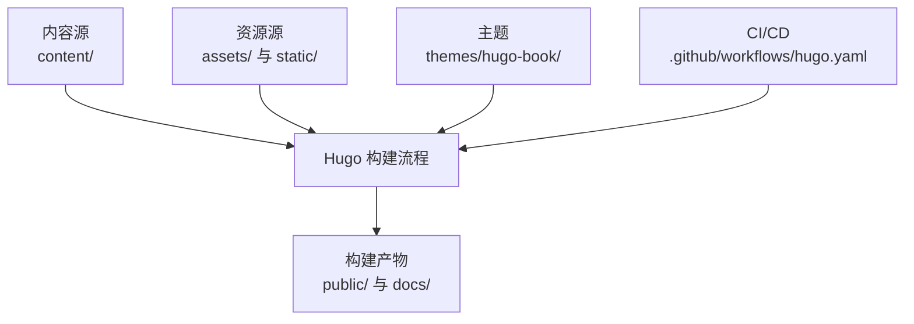
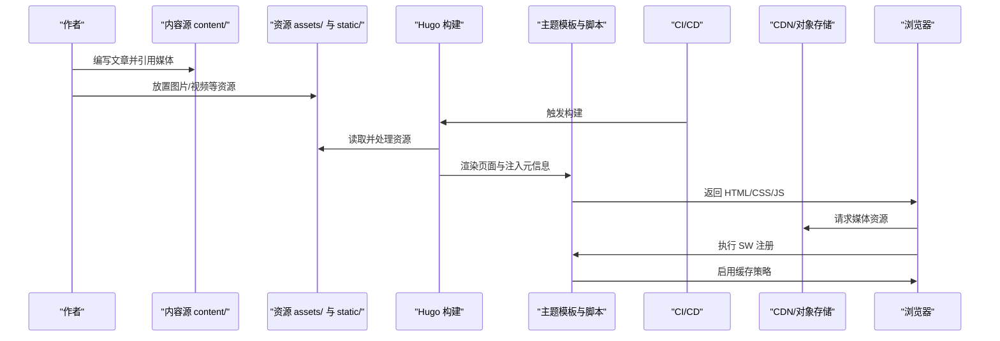
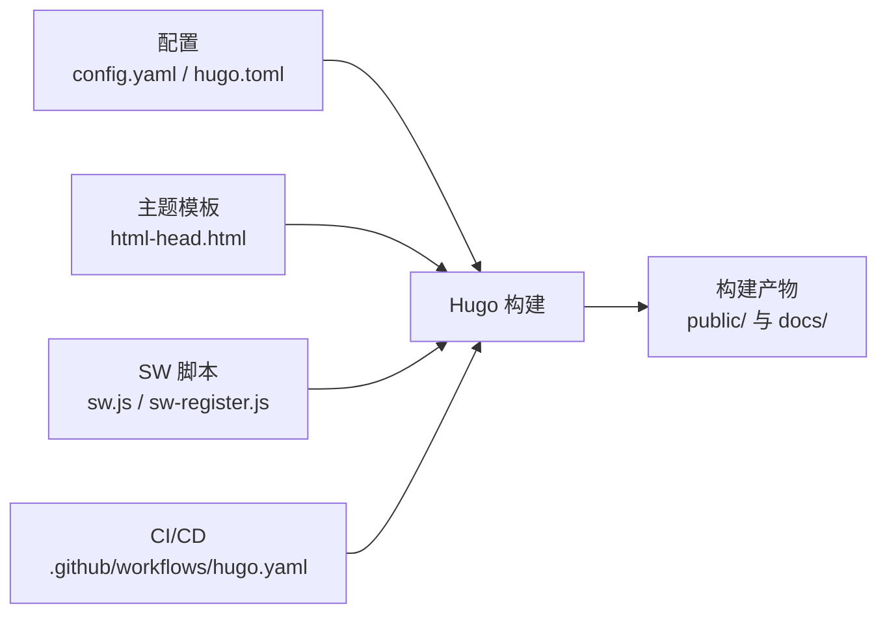

# 媒体资源管理

<cite>
**本文引用的文件**   
- [config.yaml](file://config.yaml)
- [hugo.toml](file://hugo.toml)
- [README.md](file://README.md)
- [.github/workflows/hugo.yaml](file://.github/workflows/hugo.yaml)
- [layouts/partials/docs/html-head.html](file://themes/hugo-book/layouts/partials/docs/html-head.html)
- [assets/sw.js](file://themes/hugo-book/assets/sw.js)
- [assets/sw-register.js](file://themes/hugo-book/assets/sw-register.js)
</cite>

## 目录
1. [简介](#简介)
2. [项目结构](#项目结构)
3. [核心组件](#核心组件)
4. [架构总览](#架构总览)
5. [详细组件分析](#详细组件分析)
6. [依赖关系分析](#依赖关系分析)
7. [性能考虑](#性能考虑)
8. [故障排查指南](#故障排查指南)
9. [结论](#结论)
10. [附录](#附录)

## 简介
本指南面向使用 Hugo + hugo-book 主题构建的站点，系统化说明图片与视频等媒体资源的组织、命名与版本控制策略；深入讲解响应式图片、懒加载、CDN 配置与格式优化；介绍本地托管与第三方平台集成的视频嵌入方法；给出 SEO 优化建议（alt、标题描述、结构化数据）；并提供缓存策略、压缩技术与加载速度优化的实践建议。文档同时结合仓库中的实际结构与主题能力，提供可落地的落地方案。

## 项目结构
该仓库采用 Hugo 静态站点生成器与 hugo-book 主题。媒体资源通常存放于以下位置：
- assets：供 Hugo 处理与转换的资源（如图片、样式、脚本），在构建时参与管道处理。
- static：直接复制到 public 目录的静态资源，适合无需处理的原始媒体文件。
- resources/_gen/images：Hugo 生成的图片变体与缓存产物。
- docs：构建输出目录之一（与 public 并列），用于部署产物或预览。
- themes/hugo-book：主题源码，包含部分前端脚本（如 Service Worker 注册与实现）。

图表来源
- [README.md](file://README.md)
- [.github/workflows/hugo.yaml](file://.github/workflows/hugo.yaml)

章节来源
- [README.md](file://README.md)
- [.github/workflows/hugo.yaml](file://.github/workflows/hugo.yaml)

## 核心组件
- 配置中心
  - config.yaml：站点级配置入口，集中管理 baseURL、语言、主题、模块、菜单、参数等。
  - hugo.toml：兼容 TOML 风格的站点配置，便于不同编辑器与工具链使用。
- 主题能力
  - html-head 模板：注入页面头部元信息，利于 SEO 与媒体展示。
  - Service Worker 相关脚本：提供离线缓存与网络请求拦截能力，可用于媒体资源缓存优化。
- 构建与部署
  - GitHub Actions 工作流：自动化构建与发布，确保构建环境一致性与产物可追溯。

章节来源
- [config.yaml](file://config.yaml)
- [hugo.toml](file://hugo.toml)
- [layouts/partials/docs/html-head.html](file://themes/hugo-book/layouts/partials/docs/html-head.html)
- [assets/sw.js](file://themes/hugo-book/assets/sw.js)
- [assets/sw-register.js](file://themes/hugo-book/assets/sw-register.js)
- [.github/workflows/hugo.yaml](file://.github/workflows/hugo.yaml)

## 架构总览
下图展示了从内容到产物的端到端流程，以及媒体资源在各阶段的处理路径。

图表来源
- [config.yaml](file://config.yaml)
- [hugo.toml](file://hugo.toml)
- [layouts/partials/docs/html-head.html](file://themes/hugo-book/layouts/partials/docs/html-head.html)
- [assets/sw.js](file://themes/hugo-book/assets/sw.js)
- [assets/sw-register.js](file://themes/hugo-book/assets/sw-register.js)
- [.github/workflows/hugo.yaml](file://.github/workflows/hugo.yaml)

## 详细组件分析

### 图片资源组织与管理
- 目录结构规划
  - 按主题或功能划分：例如 images/posts、images/docs、images/icons。
  - 区分原始与生成：原始图放 assets 或 static，Hugo 生成的变体位于 resources/_gen/images。
- 命名规范
  - 语义化命名，避免空格与特殊字符；使用小写与连字符分隔；必要时加入尺寸或用途后缀。
  - 版本化：通过文件名或查询参数进行版本标记，配合构建哈希提升缓存命中率。
- 响应式图片
  - 使用 srcset 与 sizes 属性为不同视口与像素密度提供多分辨率图片。
  - 利用 Hugo 的图片处理管道生成多种尺寸与格式（WebP/AVIF），并在模板中自动注入。
- 懒加载
  - 对非首屏图片添加 loading="lazy"，减少初始负载。
  - 结合 Intersection Observer 实现更精细的懒加载策略（可在主题或自定义脚本中扩展）。
- 格式优化
  - 优先使用现代格式（WebP/AVIF），回退至 JPEG/PNG。
  - 按需裁剪、缩放与质量调优，平衡画质与体积。
- CDN 配置
  - 将静态资源与媒体上传至 CDN 或对象存储，统一域名与缓存策略。
  - 在 baseURL 与资源 URL 前缀中配置 CDN 地址，确保跨域与缓存头正确。

章节来源
- [config.yaml](file://config.yaml)
- [hugo.toml](file://hugo.toml)

### 视频资源嵌入与最佳实践
- 本地托管
  - 将 MP4/WebM 等格式置于 static 或 assets，并通过 <video> 标签嵌入。
  - 设置 preload、poster、controls、playsinline 等属性以优化体验。
  - 使用 HLS/DASH 分片与自适应码率，提升弱网体验（需服务端支持）。
- 第三方平台集成
  - 使用 iframe 嵌入 YouTube/Bilibili 等平台视频，注意隐私与合规。
  - 通过 lazy-loading 与占位图降低首屏压力。
- 性能与兼容性
  - 提供多编码与多分辨率，适配不同设备与带宽。
  - 合理设置 CORS 与缓存头，提高复用率。

章节来源
- [config.yaml](file://config.yaml)
- [hugo.toml](file://hugo.toml)

### SEO 优化技巧
- alt 文本与标题描述
  - 为所有图片提供准确的 alt 文本，增强可访问性与搜索引擎理解。
  - 为视频提供标题与描述，帮助索引与推荐。
- 结构化数据
  - 使用 Schema.org 的 ImageObject、VideoObject 等类型标注媒体资源。
  - 在页面头部注入 JSON-LD，提升富搜索结果概率。
- Open Graph 与 Twitter Card
  - 在 html-head 模板中注入 og:image、og:title、og:description 等元信息。
  - 针对移动端与社交平台优化缩略图与摘要。

章节来源
- [layouts/partials/docs/html-head.html](file://themes/hugo-book/layouts/partials/docs/html-head.html)

### 缓存与服务端策略
- HTTP 缓存
  - 为静态资源设置长期缓存与强校验（ETag/Last-Modified）。
  - 使用版本号或哈希文件名，确保更新即时生效。
- Service Worker 缓存
  - 通过 sw.js 与 sw-register.js 实现离线缓存与预取策略。
  - 对图片与视频实施分级缓存（内存/磁盘/网络回退）。
- CDN 缓存
  - 配置 CDN 缓存规则与失效策略，结合构建产物哈希实现精准刷新。

章节来源
- [assets/sw.js](file://themes/hugo-book/assets/sw.js)
- [assets/sw-register.js](file://themes/hugo-book/assets/sw-register.js)

### 构建与部署流水线
- 构建环境
  - 使用固定版本的 Hugo 与 Node 环境，保证可重复构建。
- 自动化流程
  - 在 GitHub Actions 中定义构建、测试与发布步骤。
  - 将构建产物推送至 CDN 或对象存储，并清理旧版本。
- 产物管理
  - 保留构建日志与产物快照，便于回溯与问题定位。

章节来源
- [.github/workflows/hugo.yaml](file://.github/workflows/hugo.yaml)

## 依赖关系分析
- 配置与主题
  - config.yaml 与 hugo.toml 共同决定站点行为与主题启用。
  - 主题模板负责注入头部元信息与脚本，影响 SEO 与缓存策略。
- 构建与部署
  - CI/CD 工作流驱动构建，产出 public 与 docs 目录，供部署与预览。
- 前端脚本
  - Service Worker 脚本由主题提供，需在页面中注册并配置缓存策略。

图表来源
- [config.yaml](file://config.yaml)
- [hugo.toml](file://hugo.toml)
- [layouts/partials/docs/html-head.html](file://themes/hugo-book/layouts/partials/docs/html-head.html)
- [assets/sw.js](file://themes/hugo-book/assets/sw.js)
- [assets/sw-register.js](file://themes/hugo-book/assets/sw-register.js)
- [.github/workflows/hugo.yaml](file://.github/workflows/hugo.yaml)

章节来源
- [config.yaml](file://config.yaml)
- [hugo.toml](file://hugo.toml)
- [layouts/partials/docs/html-head.html](file://themes/hugo-book/layouts/partials/docs/html-head.html)
- [assets/sw.js](file://themes/hugo-book/assets/sw.js)
- [assets/sw-register.js](file://themes/hugo-book/assets/sw-register.js)
- [.github/workflows/hugo.yaml](file://.github/workflows/hugo.yaml)

## 性能考虑
- 资源体积优化
  - 图片：优先 WebP/AVIF，按需裁剪与压缩；去除冗余元数据。
  - 视频：选择高效编码（H.264/H.265/VP9），合理码率与分片。
- 加载体验优化
  - 懒加载与预加载结合，关键资源尽早加载，非关键延后。
  - 使用 CDN 就近分发，开启 Gzip/Brotli 压缩。
- 缓存策略
  - 长缓存+版本化，Service Worker 多级缓存，HTTP 层强缓存。
- 监控与分析
  - 使用 Lighthouse 与 WebPageTest 评估性能指标，持续优化。

[本节为通用指导，不直接分析具体文件]

## 故障排查指南
- 构建失败
  - 检查 Hugo 版本与依赖是否匹配；确认资源路径与引用是否正确。
- 媒体无法加载
  - 验证 baseURL 与 CDN 域名配置；检查 CORS 与缓存头。
- 缓存未生效
  - 确认文件名哈希与 CDN 缓存规则；检查 Service Worker 注册与缓存策略。
- SEO 不生效
  - 检查 html-head 模板是否注入必要元信息；验证结构化数据语法。

章节来源
- [config.yaml](file://config.yaml)
- [hugo.toml](file://hugo.toml)
- [layouts/partials/docs/html-head.html](file://themes/hugo-book/layouts/partials/docs/html-head.html)
- [assets/sw.js](file://themes/hugo-book/assets/sw.js)
- [assets/sw-register.js](file://themes/hugo-book/assets/sw-register.js)

## 结论
通过合理的目录规划、命名规范与版本控制，结合 Hugo 的资源处理管道与主题能力，可实现高效的图片与视频管理。借助响应式图片、懒加载、CDN 与 Service Worker 缓存，显著提升加载速度与用户体验。完善的 SEO 与结构化数据有助于提升搜索可见性。建议在 CI/CD 中固化构建与发布流程，确保一致性、可追溯与快速迭代。

[本节为总结，不直接分析具体文件]

## 附录
- 术语表
  - 响应式图片：根据设备与视口动态选择合适分辨率的图片。
  - 懒加载：仅在元素进入视口时加载资源。
  - CDN：内容分发网络，加速静态资源交付。
  - Service Worker：浏览器后台脚本，提供缓存与离线能力。
- 参考链接
  - Hugo 官方文档：https://gohugo.io/documentation/
  - hugo-book 主题：https://github.com/alex-shpak/hugo-book

[本节为补充信息，不直接分析具体文件]