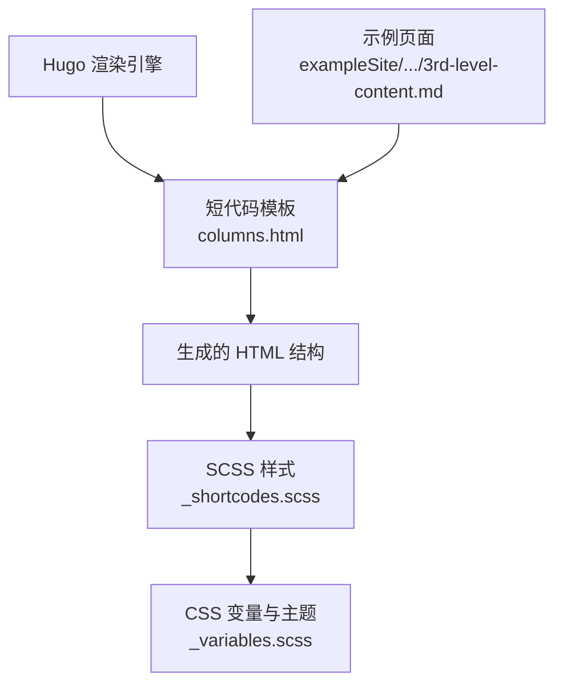
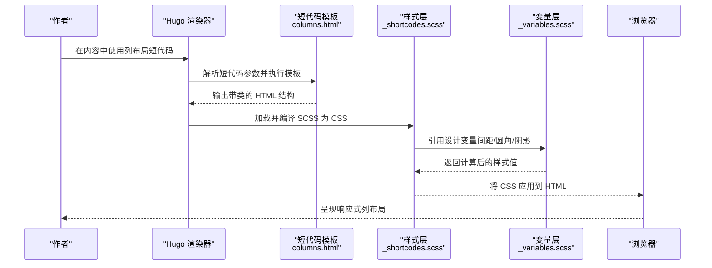
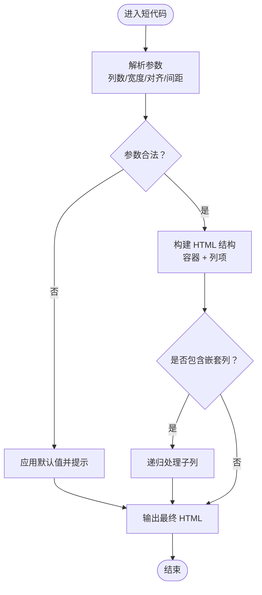
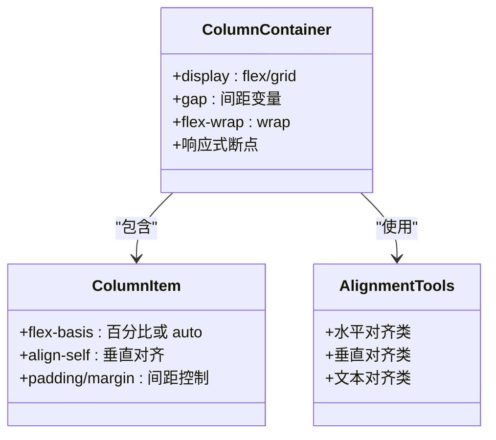
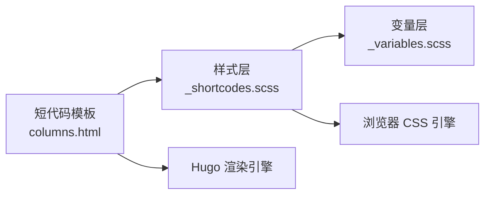

# 列布局短代码

<cite>
**本文引用的文件**   
- [themes/hugo-book/layouts/shortcodes/columns.html](file://themes/hugo-book/layouts/shortcodes/columns.html)
- [themes/hugo-book/assets/_shortcodes.scss](file://themes/hugo-book/assets/_shortcodes.scss)
- [themes/hugo-book/assets/_variables.scss](file://themes/hugo-book/assets/_variables.scss)
- [themes/hugo-book/exampleSite/content.en/docs/example/collapsed/3rd-level/3rd-level-content.md](file://themes/hugo-book/exampleSite/content.en/docs/example/collapsed/3rd-level/3rd-level-content.md)
</cite>

## 目录
1. [简介](#简介)
2. [项目结构](#项目结构)
3. [核心组件](#核心组件)
4. [架构总览](#架构总览)
5. [详细组件分析](#详细组件分析)
6. [依赖关系分析](#依赖关系分析)
7. [性能与移动端适配](#性能与移动端适配)
8. [故障排查指南](#故障排查指南)
9. [结论](#结论)
10. [附录：参数与示例速查](#附录参数与示例速查)

## 简介
本指南聚焦于 Hugo Book 主题中的“列布局”短代码，帮助你快速掌握其使用方法、响应式网格原理、列宽配置、间距设置、对齐方式以及嵌套列等高级用法。文档同时提供移动端适配最佳实践与性能优化建议，帮助你在不同屏幕尺寸下获得一致的阅读体验。

## 项目结构
列布局功能由以下关键部分构成：
- 短代码模板：负责解析短代码参数并生成 HTML 结构
- 样式表：定义列容器、列项、间距、对齐及响应式断点
- 变量与主题：通过 SCSS 变量统一控制间距、边框、圆角等视觉风格
- 示例内容：在示例站点中展示列布局的实际效果

图表来源
- [themes/hugo-book/layouts/shortcodes/columns.html](file://themes/hugo-book/layouts/shortcodes/columns.html)
- [themes/hugo-book/assets/_shortcodes.scss](file://themes/hugo-book/assets/_shortcodes.scss)
- [themes/hugo-book/assets/_variables.scss](file://themes/hugo-book/assets/_variables.scss)
- [themes/hugo-book/exampleSite/content.en/docs/example/collapsed/3rd-level/3rd-level-content.md](file://themes/hugo-book/exampleSite/content.en/docs/example/collapsed/3rd-level/3rd-level-content.md)

章节来源
- [themes/hugo-book/layouts/shortcodes/columns.html](file://themes/hugo-book/layouts/shortcodes/columns.html)
- [themes/hugo-book/assets/_shortcodes.scss](file://themes/hugo-book/assets/_shortcodes.scss)
- [themes/hugo-book/assets/_variables.scss](file://themes/hugo-book/assets/_variables.scss)
- [themes/hugo-book/exampleSite/content.en/docs/example/collapsed/3rd-level/3rd-level-content.md](file://themes/hugo-book/exampleSite/content.en/docs/example/collapsed/3rd-level/3rd-level-content.md)

## 核心组件
- 短代码模板 columns.html
  - 作用：接收短代码参数（如列数、宽度比例、对齐方式、间距等），输出具有语义化的 HTML 结构，便于后续样式控制。
  - 关键点：支持嵌套列；根据参数动态添加 CSS 类名或内联样式；兼容 Markdown 内容块。
- 样式层 _shortcodes.scss
  - 作用：实现响应式网格、列间距、对齐、阴影、圆角等视觉效果；在不同断点下切换布局行为。
  - 关键点：使用 Flexbox/Grid 构建网格；通过媒体查询实现移动端优先的自适应；封装通用类名供短代码复用。
- 变量层 _variables.scss
  - 作用：集中管理间距、颜色、字体、圆角、阴影等设计令牌，确保全站风格一致。
  - 关键点：通过 SCSS 变量注入到样式规则中，便于主题定制与多主题切换。

章节来源
- [themes/hugo-book/layouts/shortcodes/columns.html](file://themes/hugo-book/layouts/shortcodes/columns.html)
- [themes/hugo-book/assets/_shortcodes.scss](file://themes/hugo-book/assets/_shortcodes.scss)
- [themes/hugo-book/assets/_variables.scss](file://themes/hugo-book/assets/_variables.scss)

## 架构总览
列布局从“短代码输入 → 模板渲染 → 样式应用 → 最终呈现”的流水线如下：

图表来源
- [themes/hugo-book/layouts/shortcodes/columns.html](file://themes/hugo-book/layouts/shortcodes/columns.html)
- [themes/hugo-book/assets/_shortcodes.scss](file://themes/hugo-book/assets/_shortcodes.scss)
- [themes/hugo-book/assets/_variables.scss](file://themes/hugo-book/assets/_variables.scss)

## 详细组件分析

### 短代码模板：columns.html
- 功能要点
  - 解析列数量与每列宽度比例，生成对应的容器与列项节点
  - 支持对齐方式（左/中/右/两端）、垂直对齐（顶部/居中/底部）
  - 支持间距控制（列间间距、行高、内外边距）
  - 支持嵌套列：在列项内部再次使用列布局
- 数据结构与复杂度
  - 输入：短代码参数（键值对）
  - 处理：参数校验与默认值合并、类名拼接、HTML 片段组装
  - 输出：结构化 HTML（含语义化标签与可复用的类名）
  - 时间复杂度：O(n)，n 为列项数量；空间复杂度：O(n)
- 错误处理
  - 参数缺失时回退到默认列数与宽度
  - 非法值（如负间距）进行修正或忽略
  - 嵌套层级过深时给出警告或限制深度
- 性能考量
  - 避免过度嵌套，减少 DOM 节点数量
  - 尽量使用类名而非大量内联样式，利于浏览器缓存与复用

图表来源
- [themes/hugo-book/layouts/shortcodes/columns.html](file://themes/hugo-book/layouts/shortcodes/columns.html)

章节来源
- [themes/hugo-book/layouts/shortcodes/columns.html](file://themes/hugo-book/layouts/shortcodes/columns.html)

### 样式层：_shortcodes.scss
- 功能要点
  - 定义列容器与列项的基础样式（盒模型、Flex/Grid 布局）
  - 实现响应式断点：在小屏设备自动堆叠，在中大屏显示多列
  - 提供对齐工具类：水平对齐、垂直对齐、文本对齐
  - 封装间距系统：统一的列间距与行高控制
- 响应式网格原理
  - 基于现代布局能力（Flexbox/Grid）
  - 使用媒体查询按断点切换列数与排列方向
  - 通过 CSS 变量与 SCSS 混合实现主题化与一致性
- 兼容性处理
  - 针对旧版浏览器的降级策略（如回退到单列堆叠）
  - 避免使用过于前沿的属性，保证广泛兼容

图表来源
- [themes/hugo-book/assets/_shortcodes.scss](file://themes/hugo-book/assets/_shortcodes.scss)
- [themes/hugo-book/assets/_variables.scss](file://themes/hugo-book/assets/_variables.scss)

章节来源
- [themes/hugo-book/assets/_shortcodes.scss](file://themes/hugo-book/assets/_shortcodes.scss)
- [themes/hugo-book/assets/_variables.scss](file://themes/hugo-book/assets/_variables.scss)

### 变量层：_variables.scss
- 功能要点
  - 集中定义间距、圆角、阴影、颜色、字体等设计令牌
  - 提供主题级变量，便于全局替换与多主题切换
- 使用建议
  - 修改变量后重新编译 SCSS
  - 保持变量命名规范，避免冲突

章节来源
- [themes/hugo-book/assets/_variables.scss](file://themes/hugo-book/assets/_variables.scss)

### 示例与演示
- 示例位置
  - 在示例站点的折叠示例中包含列布局的使用案例，可用于对照实际渲染效果与最佳实践
- 学习路径
  - 打开示例页面，观察列布局在不同屏幕下的表现
  - 参考示例的参数组合，逐步尝试更复杂的布局

章节来源
- [themes/hugo-book/exampleSite/content.en/docs/example/collapsed/3rd-level/3rd-level-content.md](file://themes/hugo-book/exampleSite/content.en/docs/example/collapsed/3rd-level/3rd-level-content.md)

## 依赖关系分析
- 组件耦合
  - 短代码模板依赖样式层提供的类名与变量
  - 样式层依赖变量层的设计令牌
- 外部依赖
  - Hugo 渲染引擎
  - SCSS 编译器（构建阶段）
  - 浏览器 CSS 引擎（运行阶段）
- 潜在循环依赖
  - 无直接循环依赖；模板与样式解耦良好

图表来源
- [themes/hugo-book/layouts/shortcodes/columns.html](file://themes/hugo-book/layouts/shortcodes/columns.html)
- [themes/hugo-book/assets/_shortcodes.scss](file://themes/hugo-book/assets/_shortcodes.scss)
- [themes/hugo-book/assets/_variables.scss](file://themes/hugo-book/assets/_variables.scss)

章节来源
- [themes/hugo-book/layouts/shortcodes/columns.html](file://themes/hugo-book/layouts/shortcodes/columns.html)
- [themes/hugo-book/assets/_shortcodes.scss](file://themes/hugo-book/assets/_shortcodes.scss)
- [themes/hugo-book/assets/_variables.scss](file://themes/hugo-book/assets/_variables.scss)

## 性能与移动端适配
- 性能优化建议
  - 控制嵌套层级，避免深层嵌套导致 DOM 过大
  - 合理使用列数与宽度比例，减少重排与重绘
  - 利用类名复用，避免重复样式定义
  - 图片与多媒体资源按需加载，避免阻塞首屏
- 移动端适配最佳实践
  - 小屏优先：默认单列堆叠，在大屏再展开多列
  - 合理设置最小列宽，防止内容挤压
  - 调整行高与间距，提升可读性与触控友好性
  - 测试常见断点（手机竖屏、平板横屏、桌面端）

[本节为通用指导，不直接分析具体文件]

## 故障排查指南
- 常见问题
  - 列未正确显示：检查短代码参数是否正确、类名是否被覆盖
  - 间距异常：确认变量层间距值是否被自定义覆盖
  - 嵌套失效：检查嵌套层级是否超出支持范围
  - 移动端错位：验证媒体查询断点与列宽设置
- 定位步骤
  - 使用浏览器开发者工具检查元素结构与类名
  - 对比示例页面的参数组合，逐步缩小问题范围
  - 临时移除自定义样式，确认是否为样式冲突

章节来源
- [themes/hugo-book/layouts/shortcodes/columns.html](file://themes/hugo-book/layouts/shortcodes/columns.html)
- [themes/hugo-book/assets/_shortcodes.scss](file://themes/hugo-book/assets/_shortcodes.scss)
- [themes/hugo-book/assets/_variables.scss](file://themes/hugo-book/assets/_variables.scss)

## 结论
列布局短代码通过“模板 + 样式 + 变量”的分层架构，提供了灵活、可维护且响应式的网格能力。遵循本文的参数说明、示例与实践建议，你可以在不同设备上构建出美观、易读的内容布局。

[本节为总结性内容，不直接分析具体文件]

## 附录：参数与示例速查
- 常用参数
  - 列数：指定整体列数
  - 宽度比例：为每列设置相对宽度
  - 对齐方式：水平与垂直对齐
  - 间距：列间距与行高
- 典型布局模式
  - 两列并排：适合对比信息或图文并列
  - 三列卡片：适合特性列表或产品卡片
  - 嵌套列：在列内继续细分，构建复杂版面
- 移动端注意事项
  - 默认单列堆叠，避免横向滚动
  - 控制内容密度，提升可读性
  - 测试触控区域与点击热区

[本节为概念性速查，不直接分析具体文件]