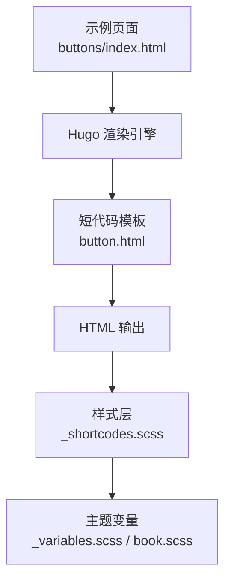
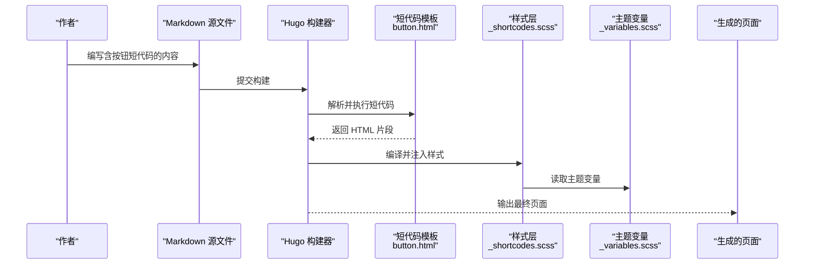
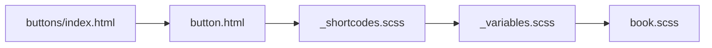

# 按钮短代码

<cite>
**本文引用的文件**   
- [button.html](file://themes/hugo-book/layouts/shortcodes/button.html)
- [_shortcodes.scss](file://themes/hugo-book/assets/_shortcodes.scss)
- [_variables.scss](file://themes/hugo-book/assets/_variables.scss)
- [book.scss](file://themes/hugo-book/assets/book.scss)
- [index.html](file://content/docs/shortcodes/buttons/index.html)
</cite>

## 目录
1. [简介](#简介)
2. [项目结构](#项目结构)
3. [核心组件](#核心组件)
4. [架构总览](#架构总览)
5. [详细组件分析](#详细组件分析)
6. [依赖关系分析](#依赖关系分析)
7. [性能与可访问性](#性能与可访问性)
8. [故障排查指南](#故障排查指南)
9. [结论](#结论)
10. [附录：参数与样式参考](#附录参数与样式参考)

## 简介
本文件为“按钮短代码”的完整使用文档，面向在技术文档中快速创建交互式按钮元素的用户。内容涵盖功能特性、参数配置、样式定制方法、不同按钮类型的使用场景与视觉效果、响应式适配与可访问性支持，以及自定义覆盖与主题集成技巧。

## 项目结构
本项目基于 Hugo Book 主题，按钮短代码由主题的短代码模板与样式共同实现。关键位置如下：
- 短代码模板：layouts/shortcodes/button.html
- 样式定义：assets/_shortcodes.scss（包含按钮相关样式）
- 变量与主题：assets/_variables.scss、assets/book.scss
- 示例页面：content/docs/shortcodes/buttons/index.html（用于展示按钮用法）

图表来源
- [button.html](file://themes/hugo-book/layouts/shortcodes/button.html)
- [_shortcodes.scss](file://themes/hugo-book/assets/_shortcodes.scss)
- [_variables.scss](file://themes/hugo-book/assets/_variables.scss)
- [book.scss](file://themes/hugo-book/assets/book.scss)
- [index.html](file://content/docs/shortcodes/buttons/index.html)

章节来源
- [button.html](file://themes/hugo-book/layouts/shortcodes/button.html)
- [_shortcodes.scss](file://themes/hugo-book/assets/_shortcodes.scss)
- [_variables.scss](file://themes/hugo-book/assets/_variables.scss)
- [book.scss](file://themes/hugo-book/assets/book.scss)
- [index.html](file://content/docs/shortcodes/buttons/index.html)

## 核心组件
- 短代码入口：通过 button 短代码生成按钮元素，支持多种外观与行为。
- 样式系统：基于 SCSS 的按钮样式，提供默认主题色、尺寸、圆角、阴影等视觉属性。
- 主题变量：通过变量集中管理颜色、字号、间距等，便于统一替换与扩展。
- 示例页面：提供可直接复用的按钮组合与常见用法。

章节来源
- [button.html](file://themes/hugo-book/layouts/shortcodes/button.html)
- [_shortcodes.scss](file://themes/hugo-book/assets/_shortcodes.scss)
- [_variables.scss](file://themes/hugo-book/assets/_variables.scss)
- [book.scss](file://themes/hugo-book/assets/book.scss)
- [index.html](file://content/docs/shortcodes/buttons/index.html)

## 架构总览
下图展示了从 Markdown 到最终页面的渲染路径，以及样式注入过程。

图表来源
- [button.html](file://themes/hugo-book/layouts/shortcodes/button.html)
- [_shortcodes.scss](file://themes/hugo-book/assets/_shortcodes.scss)
- [_variables.scss](file://themes/hugo-book/assets/_variables.scss)

## 详细组件分析

### 短代码模板：button.html
- 职责：接收短代码参数，生成语义化按钮标签，附加必要的类名与属性，以便样式层进行渲染。
- 关键点：
  - 参数解析：根据传入的参数决定按钮类型、链接目标、是否禁用、是否块级显示等。
  - 输出结构：生成 <a> 或 <button> 元素，确保可点击区域与键盘可达性。
  - 类名策略：按类型与状态组合类名，供样式层选择器匹配。
  - 可访问性：设置 aria-* 属性与焦点样式，提升屏幕阅读器与键盘操作体验。

章节来源
- [button.html](file://themes/hugo-book/layouts/shortcodes/button.html)

### 样式层：_shortcodes.scss
- 职责：定义按钮的基础样式、变体样式（主要、次要、危险等）、尺寸、交互态（悬停、聚焦、禁用）。
- 关键点：
  - 基础样式：内边距、字体大小、边框、背景色、文本颜色、过渡动画。
  - 变体样式：通过类名区分主要、次要、成功、警告、危险等语义化外观。
  - 尺寸控制：提供小、默认、大等尺寸选项。
  - 交互反馈：悬停加深/提亮、聚焦高亮、禁用灰度与不可点击态。
  - 布局适配：支持行内与块级模式，配合 Flex/Grid 布局。

章节来源
- [_shortcodes.scss](file://themes/hugo-book/assets/_shortcodes.scss)

### 主题变量：_variables.scss 与 book.scss
- 职责：集中管理颜色、字号、间距、圆角、阴影等设计令牌，保证全局一致性。
- 关键点：
  - 颜色变量：主色、辅助色、中性色、语义色（成功/警告/危险）。
  - 尺寸变量：字号、行高、内边距、圆角半径。
  - 主题切换：通过变量组合实现明暗主题下的差异化表现。
  - 扩展点：新增按钮变体时，优先复用变量而非硬编码值。

章节来源
- [_variables.scss](file://themes/hugo-book/assets/_variables.scss)
- [book.scss](file://themes/hugo-book/assets/book.scss)

### 示例页面：buttons/index.html
- 职责：展示按钮短代码的常用组合与典型用法，便于直接复制与参考。
- 关键点：
  - 基本按钮：主要、次要、危险等语义化按钮。
  - 尺寸与布局：小/默认/大尺寸，行内与块级排列。
  - 交互态：悬停、聚焦、禁用状态的演示。
  - 可访问性：aria-label、role 等属性的使用示例。

章节来源
- [index.html](file://content/docs/shortcodes/buttons/index.html)

## 依赖关系分析
按钮短代码的依赖链清晰且低耦合：短代码模板仅负责结构与属性，样式层负责呈现，变量层提供设计令牌。

图表来源
- [button.html](file://themes/hugo-book/layouts/shortcodes/button.html)
- [_shortcodes.scss](file://themes/hugo-book/assets/_shortcodes.scss)
- [_variables.scss](file://themes/hugo-book/assets/_variables.scss)
- [book.scss](file://themes/hugo-book/assets/book.scss)
- [index.html](file://content/docs/shortcodes/buttons/index.html)

章节来源
- [button.html](file://themes/hugo-book/layouts/shortcodes/button.html)
- [_shortcodes.scss](file://themes/hugo-book/assets/_shortcodes.scss)
- [_variables.scss](file://themes/hugo-book/assets/_variables.scss)
- [book.scss](file://themes/hugo-book/assets/book.scss)
- [index.html](file://content/docs/shortcodes/buttons/index.html)

## 性能与可访问性
- 性能
  - 短代码生成轻量 HTML，避免运行时脚本开销。
  - 样式采用 SCSS 编译后的静态资源，减少重复计算。
  - 建议将常用按钮样式合并至主题变量，减少冗余 CSS。
- 可访问性
  - 语义化标签：外部链接使用 <a>，内部动作使用 <button>。
  - 键盘可达：确保 Tab 顺序合理，提供清晰的 :focus 样式。
  - 屏幕阅读器：为图标按钮添加 aria-label，为状态变化提供 aria-live 提示（如需要）。
  - 对比度：遵循 WCAG 对比度要求，确保文字与背景可读。

[本节为通用指导，不直接分析具体文件]

## 故障排查指南
- 按钮未显示或样式异常
  - 检查 _shortcodes.scss 是否被正确引入与编译。
  - 确认主题变量未被覆盖导致颜色或尺寸异常。
  - 查看浏览器开发者工具中的类名是否与预期一致。
- 点击无效或跳转错误
  - 校验 href 或 action 是否正确设置。
  - 确认 target 与 rel 属性是否符合安全策略。
- 键盘无法聚焦或焦点不可见
  - 检查 tabindex 与 :focus-visible 样式是否生效。
  - 验证外层容器是否阻止了事件冒泡。
- 移动端显示错位
  - 检查块级/行内模式与宽度约束。
  - 调整内边距与字号以适配小屏设备。

章节来源
- [_shortcodes.scss](file://themes/hugo-book/assets/_shortcodes.scss)
- [_variables.scss](file://themes/hugo-book/assets/_variables.scss)
- [book.scss](file://themes/hugo-book/assets/book.scss)
- [button.html](file://themes/hugo-book/layouts/shortcodes/button.html)

## 结论
按钮短代码通过简洁的模板与完善的样式体系，提供了开箱即用的多类型按钮能力。借助主题变量与示例页面，用户可以快速实现一致的视觉风格与良好的交互体验。建议在项目中优先复用变量与类名，保持样式一致性与可维护性。

[本节为总结性内容，不直接分析具体文件]

## 附录：参数与样式参考
- 常用参数（依据模板实现）
  - 类型：主要、次要、成功、警告、危险等
  - 尺寸：小、默认、大
  - 链接：href、target、rel
  - 状态：禁用、只读
  - 布局：块级、行内
  - 可访问性：aria-label、role
- 样式覆盖建议
  - 通过自定义 SCSS 文件覆盖变量，实现品牌色与尺寸统一。
  - 使用更具体的选择器或 !important 谨慎覆盖默认样式。
  - 在明暗主题下分别定义变量，确保对比度与可读性。
- 主题集成技巧
  - 在主题变量文件中新增按钮变体对应的颜色与尺寸。
  - 在 _shortcodes.scss 中为新变体添加类名与样式规则。
  - 在示例页面补充新变体的使用示例，便于团队复用。

章节来源
- [button.html](file://themes/hugo-book/layouts/shortcodes/button.html)
- [_shortcodes.scss](file://themes/hugo-book/assets/_shortcodes.scss)
- [_variables.scss](file://themes/hugo-book/assets/_variables.scss)
- [book.scss](file://themes/hugo-book/assets/book.scss)
- [index.html](file://content/docs/shortcodes/buttons/index.html)