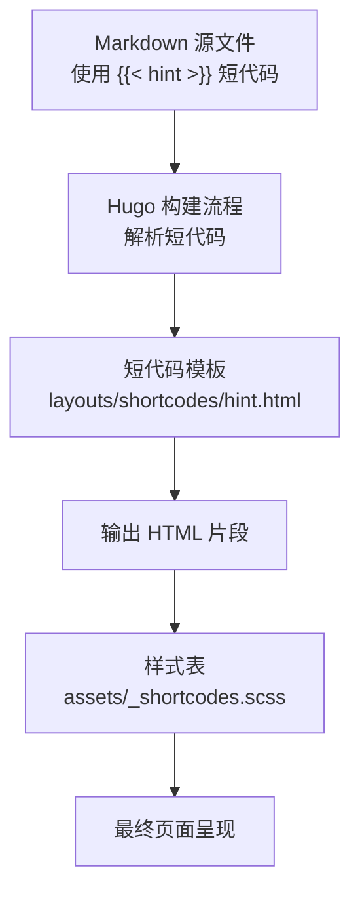
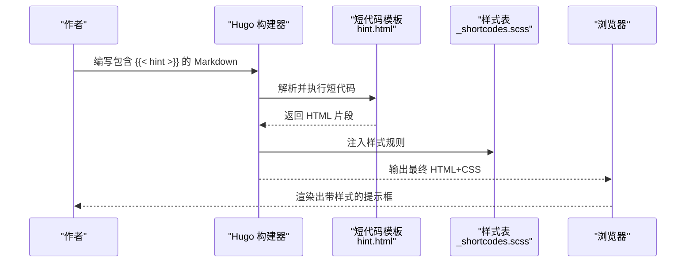
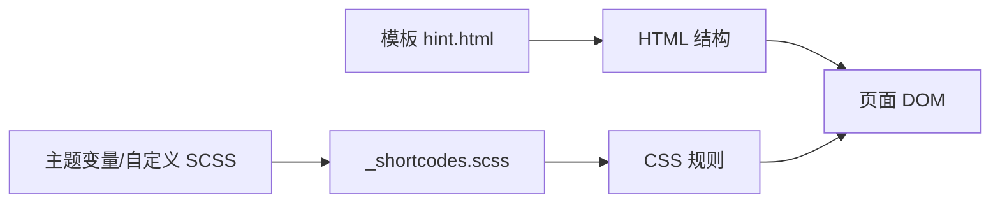

# 提示框短代码

<cite>
**本文引用的文件**   
- [hint.html](file://themes/hugo-book/layouts/shortcodes/hint.html)
- [_shortcodes.scss](file://themes/hugo-book/assets/_shortcodes.scss)
- [book.scss](file://themes/hugo-book/assets/book.scss)
- [hints/index.html](file://docs/docs/shortcodes/hints/index.html)
</cite>

## 目录
1. [简介](#简介)
2. [项目结构](#项目结构)
3. [核心组件](#核心组件)
4. [架构总览](#架构总览)
5. [详细组件分析](#详细组件分析)
6. [依赖关系分析](#依赖关系分析)
7. [性能与可访问性](#性能与可访问性)
8. [故障排查指南](#故障排查指南)
9. [结论](#结论)
10. [附录：参数与示例速查](#附录参数与示例速查)

## 简介
本指南聚焦于“提示框”短代码（hint）的使用方法与主题集成。你将了解：
- 提示框的类型体系与信息层级（信息、警告、错误、成功等）
- 图标配置、边框样式与背景色的视觉设计语言
- 内容格式化与多行文本支持
- 常见应用场景与最佳实践
- 自定义样式的覆盖方式与主题集成技巧

## 项目结构
提示框短代码由以下关键部分构成：
- 渲染模板：负责将 Markdown 中的短代码转换为 HTML 结构
- 样式表：定义不同提示类型的颜色、边框、阴影与排版
- 文档示例：提供可直接参考的用法页面

图表来源
- [hint.html](file://themes/hugo-book/layouts/shortcodes/hint.html)
- [_shortcodes.scss](file://themes/hugo-book/assets/_shortcodes.scss)

章节来源
- [hint.html](file://themes/hugo-book/layouts/shortcodes/hint.html)
- [_shortcodes.scss](file://themes/hugo-book/assets/_shortcodes.scss)
- [book.scss](file://themes/hugo-book/assets/book.scss)

## 核心组件
- 短代码模板：根据传入参数生成带语义化类名的容器，并渲染内部内容
- 样式系统：通过 SCSS 为不同提示类型提供一致的视觉风格（背景色、边框、图标占位等）
- 文档示例：在站点中提供“提示框”示例页，便于快速对照

章节来源
- [hint.html](file://themes/hugo-book/layouts/shortcodes/hint.html)
- [_shortcodes.scss](file://themes/hugo-book/assets/_shortcodes.scss)
- [hints/index.html](file://docs/docs/shortcodes/hints/index.html)

## 架构总览
从作者写作到用户浏览的完整链路如下：

图表来源
- [hint.html](file://themes/hugo-book/layouts/shortcodes/hint.html)
- [_shortcodes.scss](file://themes/hugo-book/assets/_shortcodes.scss)

## 详细组件分析

### 短代码模板：hint.html
- 职责
  - 接收参数（如类型、标题等）
  - 生成具有语义化类名的容器元素
  - 包裹并输出内部内容
- 关键点
  - 类型映射：将“信息/警告/错误/成功”等类型映射为对应的 CSS 类名
  - 标题处理：若提供标题，则渲染为标题区域；否则仅显示正文
  - 内容透传：保持对 Markdown 内容的支持（列表、链接、代码块等）

章节来源
- [hint.html](file://themes/hugo-book/layouts/shortcodes/hint.html)

### 样式系统：_shortcodes.scss
- 职责
  - 定义提示框的基础布局与间距
  - 为不同类型提供差异化配色（背景、边框、强调色）
  - 预留图标位置与对齐方式
- 关键点
  - 变量驱动：通过主题变量控制颜色、圆角、阴影等
  - 组合类名：基础类 + 类型类（如 info/warning/error/success）
  - 响应式适配：在小屏设备上保持良好的可读性与留白

章节来源
- [_shortcodes.scss](file://themes/hugo-book/assets/_shortcodes.scss)
- [book.scss](file://themes/hugo-book/assets/book.scss)

### 文档示例：hints/index.html
- 用途
  - 展示各类型提示框的实际效果
  - 提供可直接复制的写法参考
- 建议
  - 以该页面为基准进行对比验证
  - 结合自定义样式时，优先在该页面做回归测试

章节来源
- [hints/index.html](file://docs/docs/shortcodes/hints/index.html)

## 依赖关系分析
- 模板与样式
  - 模板产出 HTML 结构，样式表基于类名进行渲染
  - 类型参数决定最终应用的 CSS 类名集合
- 主题变量
  - 颜色、圆角、阴影等可通过主题变量或自定义 SCSS 覆盖
- 构建产物
  - Hugo 在构建时将 SCSS 编译为 CSS，并在页面中引入

图表来源
- [hint.html](file://themes/hugo-book/layouts/shortcodes/hint.html)
- [_shortcodes.scss](file://themes/hugo-book/assets/_shortcodes.scss)
- [book.scss](file://themes/hugo-book/assets/book.scss)

章节来源
- [hint.html](file://themes/hugo-book/layouts/shortcodes/hint.html)
- [_shortcodes.scss](file://themes/hugo-book/assets/_shortcodes.scss)
- [book.scss](file://themes/hugo-book/assets/book.scss)

## 性能与可访问性
- 性能
  - 提示框为轻量级 DOM 节点，渲染开销极低
  - 避免在同一页面堆叠过多复杂嵌套内容
- 可访问性
  - 建议使用语义化标签与合适的标题层级
  - 确保颜色对比度满足无障碍要求
  - 为图标提供替代文本（当使用图标时）

[本节为通用指导，不直接分析具体文件]

## 故障排查指南
- 未显示样式
  - 确认样式文件已正确加载
  - 检查是否被其他样式覆盖（提高选择器优先级或使用主题变量）
- 类型无效
  - 核对传入的类型值是否在支持的集合内
- 内容错位
  - 检查是否存在未闭合的标签或非法嵌套
- 图标缺失
  - 确认图标资源路径是否正确，或改用纯文本标题

章节来源
- [hint.html](file://themes/hugo-book/layouts/shortcodes/hint.html)
- [_shortcodes.scss](file://themes/hugo-book/assets/_shortcodes.scss)

## 结论
提示框短代码通过“模板 + 样式”的组合，提供了统一、可扩展的信息提示能力。借助类型系统与主题变量，你可以快速实现一致且美观的提示体验，并通过少量自定义样式完成品牌化集成。

[本节为总结性内容，不直接分析具体文件]

## 附录：参数与示例速查

### 类型体系与适用场景
- 信息（info）：用于一般性说明与补充信息
- 警告（warning）：用于提醒潜在风险或注意事项
- 错误（error）：用于指出问题与失败原因
- 成功（success）：用于确认操作成功或正向反馈

章节来源
- [hints/index.html](file://docs/docs/shortcodes/hints/index.html)

### 常用参数
- 类型：指定提示框类型（如 info/warning/error/success）
- 标题：可选，作为提示框的标题行
- 内容：支持 Markdown 语法，包括列表、链接、代码块等

章节来源
- [hint.html](file://themes/hugo-book/layouts/shortcodes/hint.html)

### 内容与格式
- 多行文本：直接换行即可
- 列表与表格：在提示框内正常使用
- 代码块：支持语法高亮（取决于主题）

章节来源
- [hint.html](file://themes/hugo-book/layouts/shortcodes/hint.html)

### 视觉定制要点
- 背景色与边框：通过类型类名与主题变量控制
- 圆角与阴影：可在自定义 SCSS 中调整
- 图标：如需替换或隐藏，可在样式表中针对图标占位进行处理

章节来源
- [_shortcodes.scss](file://themes/hugo-book/assets/_shortcodes.scss)
- [book.scss](file://themes/hugo-book/assets/book.scss)

### 实战示例清单（按场景）
- 重要提醒：使用“警告”类型，配合简短标题
- 操作步骤：使用“信息”类型，列出步骤编号
- 注意事项：使用“警告”或“错误”类型，突出关键约束
- 成功反馈：使用“成功”类型，确认任务完成

章节来源
- [hints/index.html](file://docs/docs/shortcodes/hints/index.html)