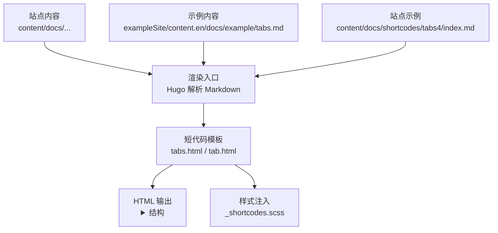
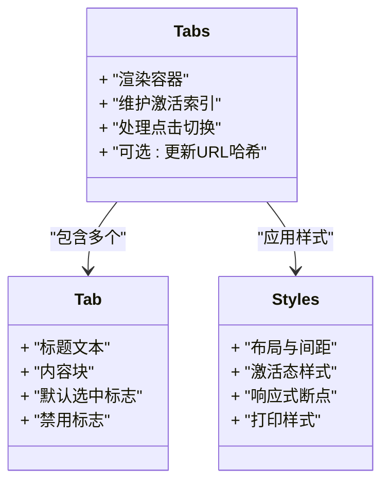
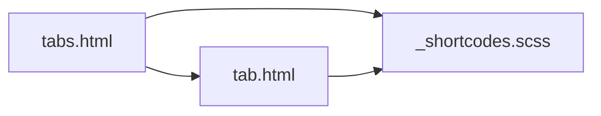

# 标签页短代码

<cite>
**本文引用的文件**   
- [themes/hugo-book/layouts/shortcodes/tabs.html](file://themes/hugo-book/layouts/shortcodes/tabs.html)
- [themes/hugo-book/layouts/shortcodes/tab.html](file://themes/hugo-book/layouts/shortcodes/tab.html)
- [themes/hugo-book/assets/_shortcodes.scss](file://themes/hugo-book/assets/_shortcodes.scss)
- [themes/hugo-book/exampleSite/content.en/docs/example/tabs.md](file://themes/hugo-book/exampleSite/content.en/docs/example/tabs.md)
- [content/docs/shortcodes/tabs4/index.md](file://content/docs/shortcodes/tabs4/index.md)
</cite>

## 目录
1. [简介](#简介)
2. [项目结构](#项目结构)
3. [核心组件](#核心组件)
4. [架构总览](#架构总览)
5. [详细组件分析](#详细组件分析)
6. [依赖关系分析](#依赖关系分析)
7. [性能考量](#性能考量)
8. [故障排查指南](#故障排查指南)
9. [结论](#结论)
10. [附录](#附录)

## 简介
本文件面向使用 Hugo Book 主题的项目，系统化说明“标签页”短代码的用法与实现。内容涵盖：
- 组件架构与状态管理（基于原生 HTML 语义）
- 标签页创建、切换逻辑与 URL 同步策略
- 多种应用场景示例（代码对比、多语言展示、步骤教程等）
- 响应式适配与移动端触摸支持
- 自定义样式与动画效果
- 可访问性与 SEO 优化建议

## 项目结构
Hugo Book 主题的标签页由两个短代码模板组成：容器与子项。样式通过 SCSS 注入到最终页面中。示例内容位于 exampleSite 与站点 content 目录。

图表来源
- [themes/hugo-book/layouts/shortcodes/tabs.html](file://themes/hugo-book/layouts/shortcodes/tabs.html)
- [themes/hugo-book/layouts/shortcodes/tab.html](file://themes/hugo-book/layouts/shortcodes/tab.html)
- [themes/hugo-book/assets/_shortcodes.scss](file://themes/hugo-book/assets/_shortcodes.scss)
- [themes/hugo-book/exampleSite/content.en/docs/example/tabs.md](file://themes/hugo-book/exampleSite/content.en/docs/example/tabs.md)
- [content/docs/shortcodes/tabs4/index.md](file://content/docs/shortcodes/tabs4/index.md)

章节来源
- [themes/hugo-book/layouts/shortcodes/tabs.html](file://themes/hugo-book/layouts/shortcodes/tabs.html)
- [themes/hugo-book/layouts/shortcodes/tab.html](file://themes/hugo-book/layouts/shortcodes/tab.html)
- [themes/hugo-book/assets/_shortcodes.scss](file://themes/hugo-book/assets/_shortcodes.scss)
- [themes/hugo-book/exampleSite/content.en/docs/example/tabs.md](file://themes/hugo-book/exampleSite/content.en/docs/example/tabs.md)
- [content/docs/shortcodes/tabs4/index.md](file://content/docs/shortcodes/tabs4/index.md)

## 核心组件
- 容器短代码 tabs：负责生成标签页容器与导航区域，并维护当前激活状态。
- 子项短代码 tab：定义单个标签页标题与内容，支持默认选中与禁用等属性。
- 样式层 _shortcodes.scss：提供基础布局、交互态与可访问性相关样式。

章节来源
- [themes/hugo-book/layouts/shortcodes/tabs.html](file://themes/hugo-book/layouts/shortcodes/tabs.html)
- [themes/hugo-book/layouts/shortcodes/tab.html](file://themes/hugo-book/layouts/shortcodes/tab.html)
- [themes/hugo-book/assets/_shortcodes.scss](file://themes/hugo-book/assets/_shortcodes.scss)

## 架构总览
标签页采用“容器 + 子项”的短代码组合模式，渲染为标准的 HTML 结构，并通过 CSS 控制显示与隐藏。状态保存在 DOM 节点上，不依赖外部 JS 框架。

图表来源
- [themes/hugo-book/layouts/shortcodes/tabs.html](file://themes/hugo-book/layouts/shortcodes/tabs.html)
- [themes/hugo-book/layouts/shortcodes/tab.html](file://themes/hugo-book/layouts/shortcodes/tab.html)
- [themes/hugo-book/assets/_shortcodes.scss](file://themes/hugo-book/assets/_shortcodes.scss)

## 详细组件分析

### 容器短代码 tabs
- 职责
  - 收集所有子项 tab 的元数据（标题、是否默认选中、是否禁用）。
  - 渲染导航区与内容区。
  - 在页面加载时根据默认选中项或首个可用项确定初始激活状态。
  - 监听导航点击事件，切换激活项并更新可见内容。
  - 可选：将当前激活项写入 URL 哈希，便于分享与回退。
- 关键流程
  - 初始化：遍历子项，计算默认激活项。
  - 切换：移除旧激活态，为新项添加激活态，滚动至可视区域。
  - URL 同步：读取/写入 location.hash，避免重复触发切换。
- 边界情况
  - 无默认选中项时选择第一个可用项。
  - 被禁用的项不可切换。
  - 动态插入新 tab 时需重新计算激活项。

章节来源
- [themes/hugo-book/layouts/shortcodes/tabs.html](file://themes/hugo-book/layouts/shortcodes/tabs.html)

### 子项短代码 tab
- 职责
  - 声明标签标题与内容。
  - 支持属性：默认选中、禁用等。
- 渲染产物
  - 导航项按钮与对应内容区块，具备一致的标识以便容器定位。
- 注意事项
  - 标题需唯一且可读，利于可访问性与 SEO。
  - 内容可为富文本、代码块、表格等任意 Markdown 内容。

章节来源
- [themes/hugo-book/layouts/shortcodes/tab.html](file://themes/hugo-book/layouts/shortcodes/tab.html)

### 样式层 _shortcodes.scss
- 职责
  - 提供标签页的基础布局、内边距、边框与阴影。
  - 定义激活态与非激活态的视觉差异。
  - 针对小屏幕进行堆叠与横向滚动优化。
  - 提供打印友好样式，确保打印时保留必要信息。
- 扩展点
  - 覆盖激活态颜色、过渡时长与缓动函数。
  - 调整导航项宽度与换行行为。
  - 定制滚动条与焦点轮廓以增强可访问性。

章节来源
- [themes/hugo-book/assets/_shortcodes.scss](file://themes/hugo-book/assets/_shortcodes.scss)

### 示例与用法
- 官方示例
  - 参考 exampleSite 中的标签页示例，了解基本语法与常见组合。
- 站点示例
  - 站点 content 下提供了标签页示例页面，可用于验证本地构建效果。

章节来源
- [themes/hugo-book/exampleSite/content.en/docs/example/tabs.md](file://themes/hugo-book/exampleSite/content.en/docs/example/tabs.md)
- [content/docs/shortcodes/tabs4/index.md](file://content/docs/shortcodes/tabs4/index.md)

## 依赖关系分析
- 短代码模板之间：tabs 依赖 tab 的渲染结果，tab 仅作为数据与内容载体。
- 模板与样式：tabs 与 tab 的输出结构受 _shortcodes.scss 影响，可通过覆盖 SCSS 实现主题化。
- 运行时依赖：纯前端交互，无需额外 JS 库；若启用 URL 同步，则依赖浏览器 history API。

图表来源
- [themes/hugo-book/layouts/shortcodes/tabs.html](file://themes/hugo-book/layouts/shortcodes/tabs.html)
- [themes/hugo-book/layouts/shortcodes/tab.html](file://themes/hugo-book/layouts/shortcodes/tab.html)
- [themes/hugo-book/assets/_shortcodes.scss](file://themes/hugo-book/assets/_shortcodes.scss)

## 性能考量
- 渲染成本
  - 每个标签页内容都会参与首次渲染，建议在内容较多时使用懒加载或分页。
- 交互开销
  - 切换逻辑应尽量避免重排重绘，优先操作类名而非直接修改大量样式。
- 资源体积
  - 样式按需引入，避免全局覆盖导致冗余规则。
- 可访问性与 SEO
  - 保持语义化结构与正确的标题层级，有助于搜索引擎抓取与辅助技术识别。

[本节为通用指导，不直接分析具体文件]

## 故障排查指南
- 无法切换
  - 检查是否存在重复 ID 或冲突的类名。
  - 确认未禁用所有项，至少有一个可用项。
- 默认选中无效
  - 确认默认选中项未被禁用。
  - 检查是否有多个默认选中项，只允许一个。
- URL 不同步
  - 确认浏览器地址栏 hash 是否被其他脚本覆盖。
  - 检查是否在 SPA 路由环境下被拦截。
- 样式错乱
  - 检查自定义 SCSS 是否覆盖了必要结构类名。
  - 在小屏设备上确认导航是否出现横向滚动或换行问题。

章节来源
- [themes/hugo-book/layouts/shortcodes/tabs.html](file://themes/hugo-book/layouts/shortcodes/tabs.html)
- [themes/hugo-book/layouts/shortcodes/tab.html](file://themes/hugo-book/layouts/shortcodes/tab.html)
- [themes/hugo-book/assets/_shortcodes.scss](file://themes/hugo-book/assets/_shortcodes.scss)

## 结论
标签页短代码以最小依赖实现了高可用的分组展示能力。通过合理的结构设计与样式扩展，可满足从简单对比到复杂教程的多场景需求。结合可访问性与 SEO 最佳实践，可在保证体验的同时提升内容的可发现性。

[本节为总结性内容，不直接分析具体文件]

## 附录

### 快速上手清单
- 在 Markdown 中使用容器与子项短代码组织内容。
- 指定默认选中项与禁用项以满足业务需求。
- 如需分享链接直达某标签页，启用 URL 哈希同步。
- 通过覆盖 SCSS 定制外观与动效。

[本节为概念性指引，不直接分析具体文件]