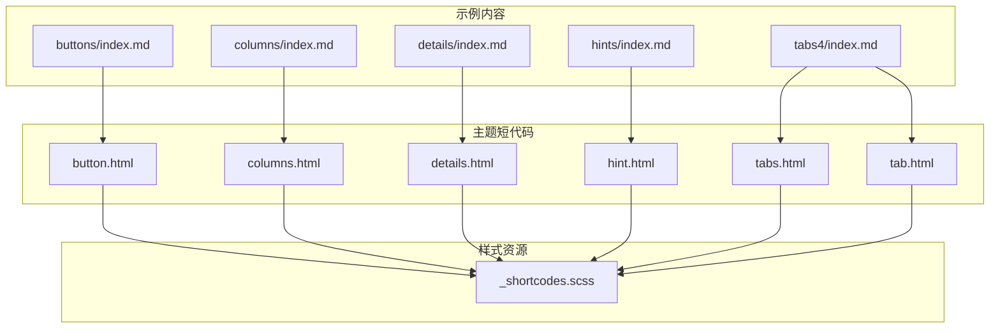
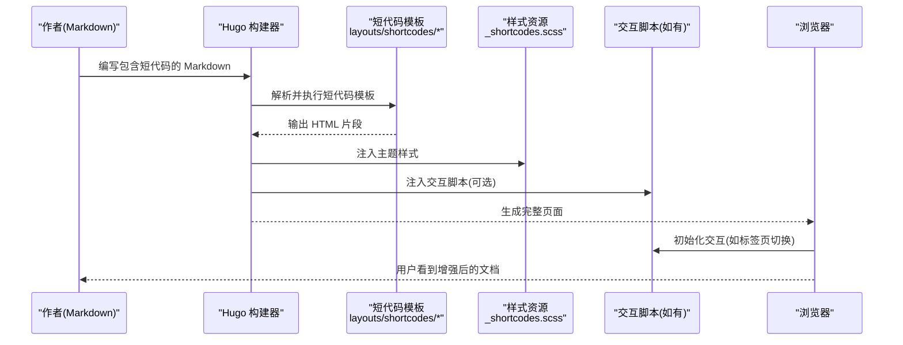
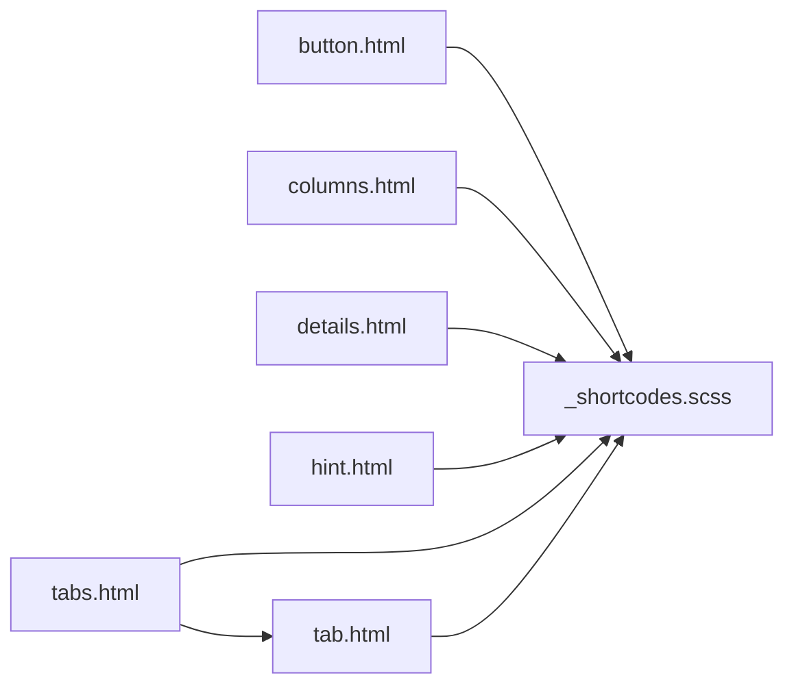

# 短代码增强功能

<cite>
**本文引用的文件**   
- [themes/hugo-book/layouts/shortcodes/button.html](file://themes/hugo-book/layouts/shortcodes/button.html)
- [themes/hugo-book/layouts/shortcodes/columns.html](file://themes/hugo-book/layouts/shortcodes/columns.html)
- [themes/hugo-book/layouts/shortcodes/details.html](file://themes/hugo-book/layouts/shortcodes/details.html)
- [themes/hugo-book/layouts/shortcodes/hint.html](file://themes/hugo-book/layouts/shortcodes/hint.html)
- [themes/hugo-book/layouts/shortcodes/tabs.html](file://themes/hugo-book/layouts/shortcodes/tabs.html)
- [themes/hugo-book/layouts/shortcodes/tab.html](file://themes/hugo-book/layouts/shortcodes/tab.html)
- [themes/hugo-book/assets/_shortcodes.scss](file://themes/hugo-book/assets/_shortcodes.scss)
- [themes/hugo-book/exampleSite/content.en/docs/shortcodes/buttons/index.md](file://themes/hugo-book/exampleSite/content.en/docs/shortcodes/buttons/index.md)
- [themes/hugo-book/exampleSite/content.en/docs/shortcodes/columns/index.md](file://themes/hugo-book/exampleSite/content.en/docs/shortcodes/columns/index.md)
- [themes/hugo-book/exampleSite/content.en/docs/shortcodes/details/index.md](file://themes/hugo-book/exampleSite/content.en/docs/shortcodes/details/index.md)
- [themes/hugo-book/exampleSite/content.en/docs/shortcodes/hints/index.md](file://themes/hugo-book/exampleSite/content.en/docs/shortcodes/hints/index.md)
- [themes/hugo-book/exampleSite/content.en/docs/shortcodes/tabs4/index.md](file://themes/hugo-book/exampleSite/content.en/docs/shortcodes/tabs4/index.md)
</cite>

## 目录
1. [简介](#简介)
2. [项目结构](#项目结构)
3. [核心组件](#核心组件)
4. [架构总览](#架构总览)
5. [详细组件分析](#详细组件分析)
6. [依赖关系分析](#依赖关系分析)
7. [性能与可访问性](#性能与可访问性)
8. [故障排查指南](#故障排查指南)
9. [结论](#结论)
10. [附录：自定义短代码开发指南](#附录自定义短代码开发指南)

## 简介
本指南聚焦于 hugo-book 主题提供的“短代码增强功能”，包括按钮、列布局、详情折叠、提示框、标签页等常用交互组件。文档将系统说明各短代码的用法、参数配置、样式定制与组合技巧，并提供丰富的实际应用示例，帮助你在技术文档中高效提升可读性与用户体验。同时，还将介绍如何基于主题扩展机制开发自定义短代码，以及主题集成与响应式适配要点。

## 项目结构
hugo-book 主题的短代码实现集中在 layouts/shortcodes 目录，样式定义位于 assets/_shortcodes.scss；示例内容位于 exampleSite 对应路径下，便于参考实际使用方式。

图表来源
- [themes/hugo-book/layouts/shortcodes/button.html](file://themes/hugo-book/layouts/shortcodes/button.html)
- [themes/hugo-book/layouts/shortcodes/columns.html](file://themes/hugo-book/layouts/shortcodes/columns.html)
- [themes/hugo-book/layouts/shortcodes/details.html](file://themes/hugo-book/layouts/shortcodes/details.html)
- [themes/hugo-book/layouts/shortcodes/hint.html](file://themes/hugo-book/layouts/shortcodes/hint.html)
- [themes/hugo-book/layouts/shortcodes/tabs.html](file://themes/hugo-book/layouts/shortcodes/tabs.html)
- [themes/hugo-book/layouts/shortcodes/tab.html](file://themes/hugo-book/layouts/shortcodes/tab.html)
- [themes/hugo-book/assets/_shortcodes.scss](file://themes/hugo-book/assets/_shortcodes.scss)
- [themes/hugo-book/exampleSite/content.en/docs/shortcodes/buttons/index.md](file://themes/hugo-book/exampleSite/content.en/docs/shortcodes/buttons/index.md)
- [themes/hugo-book/exampleSite/content.en/docs/shortcodes/columns/index.md](file://themes/hugo-book/exampleSite/content.en/docs/shortcodes/columns/index.md)
- [themes/hugo-book/exampleSite/content.en/docs/shortcodes/details/index.md](file://themes/hugo-book/exampleSite/content.en/docs/shortcodes/details/index.md)
- [themes/hugo-book/exampleSite/content.en/docs/shortcodes/hints/index.md](file://themes/hugo-book/exampleSite/content.en/docs/shortcodes/hints/index.md)
- [themes/hugo-book/exampleSite/content.en/docs/shortcodes/tabs4/index.md](file://themes/hugo-book/exampleSite/content.en/docs/shortcodes/tabs4/index.md)

章节来源
- [themes/hugo-book/layouts/shortcodes/button.html](file://themes/hugo-book/layouts/shortcodes/button.html)
- [themes/hugo-book/layouts/shortcodes/columns.html](file://themes/hugo-book/layouts/shortcodes/columns.html)
- [themes/hugo-book/layouts/shortcodes/details.html](file://themes/hugo-book/layouts/shortcodes/details.html)
- [themes/hugo-book/layouts/shortcodes/hint.html](file://themes/hugo-book/layouts/shortcodes/hint.html)
- [themes/hugo-book/layouts/shortcodes/tabs.html](file://themes/hugo-book/layouts/shortcodes/tabs.html)
- [themes/hugo-book/layouts/shortcodes/tab.html](file://themes/hugo-book/layouts/shortcodes/tab.html)
- [themes/hugo-book/assets/_shortcodes.scss](file://themes/hugo-book/assets/_shortcodes.scss)
- [themes/hugo-book/exampleSite/content.en/docs/shortcodes/buttons/index.md](file://themes/hugo-book/exampleSite/content.en/docs/shortcodes/buttons/index.md)
- [themes/hugo-book/exampleSite/content.en/docs/shortcodes/columns/index.md](file://themes/hugo-book/exampleSite/content.en/docs/shortcodes/columns/index.md)
- [themes/hugo-book/exampleSite/content.en/docs/shortcodes/details/index.md](file://themes/hugo-book/exampleSite/content.en/docs/shortcodes/details/index.md)
- [themes/hugo-book/exampleSite/content.en/docs/shortcodes/hints/index.md](file://themes/hugo-book/exampleSite/content.en/docs/shortcodes/hints/index.md)
- [themes/hugo-book/exampleSite/content.en/docs/shortcodes/tabs4/index.md](file://themes/hugo-book/exampleSite/content.en/docs/shortcodes/tabs4/index.md)

## 核心组件
本节概述各短代码的职责与典型用法，结合示例页面进行说明。

- 按钮（button）
  - 用途：在正文中插入可点击的按钮，常用于引导操作或跳转链接。
  - 常见参数：文本、链接地址、目标打开方式、样式变体（如主色/次色/危险）、尺寸、是否禁用等。
  - 示例参考：[示例页面](file://themes/hugo-book/exampleSite/content.en/docs/shortcodes/buttons/index.md)

- 列布局（columns）
  - 用途：将内容按多列排布，适合并列信息、对比展示。
  - 常见参数：列数、列宽比例、对齐方式、间距、是否自适应等。
  - 示例参考：[示例页面](file://themes/hugo-book/exampleSite/content.en/docs/shortcodes/columns/index.md)

- 详情折叠（details）
  - 用途：提供可展开/收起的内容块，用于隐藏次要信息或答案。
  - 常见参数：标题、默认展开状态、CSS 类名等。
  - 示例参考：[示例页面](file://themes/hugo-book/exampleSite/content.en/docs/shortcodes/details/index.md)

- 提示框（hint）
  - 用途：以高亮区块呈现提示、注意、警告等信息。
  - 常见参数：类型（提示/注意/警告/成功等）、标题、图标、边框样式等。
  - 示例参考：[示例页面](file://themes/hugo-book/exampleSite/content.en/docs/shortcodes/hints/index.md)

- 标签页（tabs + tab）
  - 用途：将相关内容分组到多个标签页，减少页面滚动压力。
  - 常见参数（tabs）：默认激活标签、标签排列方向、是否允许切换动画等。
  - 常见参数（tab）：标签名称、唯一标识、是否默认选中、快捷键等。
  - 示例参考：[示例页面](file://themes/hugo-book/exampleSite/content.en/docs/shortcodes/tabs4/index.md)

章节来源
- [themes/hugo-book/exampleSite/content.en/docs/shortcodes/buttons/index.md](file://themes/hugo-book/exampleSite/content.en/docs/shortcodes/buttons/index.md)
- [themes/hugo-book/exampleSite/content.en/docs/shortcodes/columns/index.md](file://themes/hugo-book/exampleSite/content.en/docs/shortcodes/columns/index.md)
- [themes/hugo-book/exampleSite/content.en/docs/shortcodes/details/index.md](file://themes/hugo-book/exampleSite/content.en/docs/shortcodes/details/index.md)
- [themes/hugo-book/exampleSite/content.en/docs/shortcodes/hints/index.md](file://themes/hugo-book/exampleSite/content.en/docs/shortcodes/hints/index.md)
- [themes/hugo-book/exampleSite/content.en/docs/shortcodes/tabs4/index.md](file://themes/hugo-book/exampleSite/content.en/docs/shortcodes/tabs4/index.md)

## 架构总览
下图展示了从 Markdown 内容到最终渲染页面的关键流程：Hugo 解析短代码模板，生成 HTML 片段，再由主题样式与脚本完成交互与视觉呈现。

图表来源
- [themes/hugo-book/layouts/shortcodes/button.html](file://themes/hugo-book/layouts/shortcodes/button.html)
- [themes/hugo-book/layouts/shortcodes/columns.html](file://themes/hugo-book/layouts/shortcodes/columns.html)
- [themes/hugo-book/layouts/shortcodes/details.html](file://themes/hugo-book/layouts/shortcodes/details.html)
- [themes/hugo-book/layouts/shortcodes/hint.html](file://themes/hugo-book/layouts/shortcodes/hint.html)
- [themes/hugo-book/layouts/shortcodes/tabs.html](file://themes/hugo-book/layouts/shortcodes/tabs.html)
- [themes/hugo-book/layouts/shortcodes/tab.html](file://themes/hugo-book/layouts/shortcodes/tab.html)
- [themes/hugo-book/assets/_shortcodes.scss](file://themes/hugo-book/assets/_shortcodes.scss)

## 详细组件分析

### 按钮（button）
- 设计要点
  - 语义化：按钮应明确表达动作意图，避免仅用颜色传达含义。
  - 可访问性：为链接型按钮提供 aria-label，键盘可达。
  - 一致性：统一尺寸、圆角、阴影与悬停反馈。
- 参数建议
  - 文本、链接、目标、样式变体、尺寸、禁用态。
- 组合技巧
  - 与列布局配合，形成操作面板。
  - 与提示框搭配，强调重要操作。
- 示例参考
  - [示例页面](file://themes/hugo-book/exampleSite/content.en/docs/shortcodes/buttons/index.md)

章节来源
- [themes/hugo-book/layouts/shortcodes/button.html](file://themes/hugo-book/layouts/shortcodes/button.html)
- [themes/hugo-book/exampleSite/content.en/docs/shortcodes/buttons/index.md](file://themes/hugo-book/exampleSite/content.en/docs/shortcodes/buttons/index.md)

### 列布局（columns）
- 设计要点
  - 列数与宽度：根据内容密度选择合适列数，避免过窄导致换行过多。
  - 对齐与间距：保持视觉节奏一致，移动端自动堆叠。
- 参数建议
  - 列数、列宽比例、对齐、间距、响应式断点。
- 组合技巧
  - 与提示框嵌套，形成“卡片式”信息块。
  - 与按钮组合，形成“功能入口矩阵”。
- 示例参考
  - [示例页面](file://themes/hugo-book/exampleSite/content.en/docs/shortcodes/columns/index.md)

章节来源
- [themes/hugo-book/layouts/shortcodes/columns.html](file://themes/hugo-book/layouts/shortcodes/columns.html)
- [themes/hugo-book/exampleSite/content.en/docs/shortcodes/columns/index.md](file://themes/hugo-book/exampleSite/content.en/docs/shortcodes/columns/index.md)

### 详情折叠（details）
- 设计要点
  - 标题清晰：让用户快速判断是否需要展开。
  - 默认状态：谨慎设置默认展开，避免首屏信息过载。
- 参数建议
  - 标题、默认展开、CSS 类名。
- 组合技巧
  - 与提示框嵌套，作为“问答区”。
  - 与标签页组合，形成“分步教程”。
- 示例参考
  - [示例页面](file://themes/hugo-book/exampleSite/content.en/docs/shortcodes/details/index.md)

章节来源
- [themes/hugo-book/layouts/shortcodes/details.html](file://themes/hugo-book/layouts/shortcodes/details.html)
- [themes/hugo-book/exampleSite/content.en/docs/shortcodes/details/index.md](file://themes/hugo-book/exampleSite/content.en/docs/shortcodes/details/index.md)

### 提示框（hint）
- 设计要点
  - 类型区分：不同类型使用不同色彩与图标，提高识别度。
  - 内容精炼：提示语简洁明了，必要时提供链接。
- 参数建议
  - 类型、标题、图标、边框样式、背景深浅。
- 组合技巧
  - 与列布局组合，形成“注意事项矩阵”。
  - 与按钮组合，形成“行动号召”。
- 示例参考
  - [示例页面](file://themes/hugo-book/exampleSite/content.en/docs/shortcodes/hints/index.md)

章节来源
- [themes/hugo-book/layouts/shortcodes/hint.html](file://themes/hugo-book/layouts/shortcodes/hint.html)
- [themes/hugo-book/exampleSite/content.en/docs/shortcodes/hints/index.md](file://themes/hugo-book/exampleSite/content.en/docs/shortcodes/hints/index.md)

### 标签页（tabs + tab）
- 设计要点
  - 标签命名：简短且具描述性，避免过长导致溢出。
  - 默认激活：合理设置默认激活项，减少用户操作成本。
- 参数建议（tabs）
  - 默认激活标签、排列方向、动画开关。
- 参数建议（tab）
  - 标签名称、唯一标识、是否默认选中、快捷键。
- 组合技巧
  - 与详情折叠组合，形成“分步+可展开”的复杂教程。
  - 与列布局组合，形成“多环境/多平台”对照。
- 示例参考
  - [示例页面](file://themes/hugo-book/exampleSite/content.en/docs/shortcodes/tabs4/index.md)

章节来源
- [themes/hugo-book/layouts/shortcodes/tabs.html](file://themes/hugo-book/layouts/shortcodes/tabs.html)
- [themes/hugo-book/layouts/shortcodes/tab.html](file://themes/hugo-book/layouts/shortcodes/tab.html)
- [themes/hugo-book/exampleSite/content.en/docs/shortcodes/tabs4/index.md](file://themes/hugo-book/exampleSite/content.en/docs/shortcodes/tabs4/index.md)

### 样式定制与主题集成
- 样式覆盖
  - 通过主题变量与 _shortcodes.scss 中的类名进行覆盖，优先使用主题变量以保持一致性。
- 响应式适配
  - 列布局在不同断点下自动调整；标签页在小屏上优化触控体验。
- 深色模式
  - 遵循主题明暗主题变量，确保对比度与可读性。

章节来源
- [themes/hugo-book/assets/_shortcodes.scss](file://themes/hugo-book/assets/_shortcodes.scss)

## 依赖关系分析
短代码模板之间通常低耦合，主要依赖主题样式与 Hugo 的模板引擎。标签页由 tabs 与 tab 两个模板协作完成。

图表来源
- [themes/hugo-book/layouts/shortcodes/button.html](file://themes/hugo-book/layouts/shortcodes/button.html)
- [themes/hugo-book/layouts/shortcodes/columns.html](file://themes/hugo-book/layouts/shortcodes/columns.html)
- [themes/hugo-book/layouts/shortcodes/details.html](file://themes/hugo-book/layouts/shortcodes/details.html)
- [themes/hugo-book/layouts/shortcodes/hint.html](file://themes/hugo-book/layouts/shortcodes/hint.html)
- [themes/hugo-book/layouts/shortcodes/tabs.html](file://themes/hugo-book/layouts/shortcodes/tabs.html)
- [themes/hugo-book/layouts/shortcodes/tab.html](file://themes/hugo-book/layouts/shortcodes/tab.html)
- [themes/hugo-book/assets/_shortcodes.scss](file://themes/hugo-book/assets/_shortcodes.scss)

章节来源
- [themes/hugo-book/layouts/shortcodes/tabs.html](file://themes/hugo-book/layouts/shortcodes/tabs.html)
- [themes/hugo-book/layouts/shortcodes/tab.html](file://themes/hugo-book/layouts/shortcodes/tab.html)
- [themes/hugo-book/assets/_shortcodes.scss](file://themes/hugo-book/assets/_shortcodes.scss)

## 性能与可访问性
- 性能
  - 避免过度嵌套短代码，减少 DOM 层级。
  - 合理使用默认展开/激活，降低首屏渲染负担。
- 可访问性
  - 为交互元素提供合适的 ARIA 属性与焦点管理。
  - 保证颜色对比度符合 WCAG 标准。
- 响应式
  - 列布局在小屏自动堆叠；标签页在小屏优化触控区域。

[本节为通用指导，不直接分析具体文件]

## 故障排查指南
- 短代码未生效
  - 检查是否在正确的主题下启用 hugo-book，确认 layouts/shortcodes 路径存在。
- 样式异常
  - 确认 _shortcodes.scss 被正确编译与引入；检查自定义覆盖是否冲突。
- 标签页无法切换
  - 检查 tabs 与 tab 的唯一标识是否重复；确认默认激活项是否存在。
- 提示框显示不正确
  - 检查类型参数是否与内置类型匹配；核对标题与内容结构。

章节来源
- [themes/hugo-book/layouts/shortcodes/tabs.html](file://themes/hugo-book/layouts/shortcodes/tabs.html)
- [themes/hugo-book/layouts/shortcodes/tab.html](file://themes/hugo-book/layouts/shortcodes/tab.html)
- [themes/hugo-book/layouts/shortcodes/hint.html](file://themes/hugo-book/layouts/shortcodes/hint.html)
- [themes/hugo-book/assets/_shortcodes.scss](file://themes/hugo-book/assets/_shortcodes.scss)

## 结论
通过按钮、列布局、详情折叠、提示框与标签页等短代码的组合使用，可以显著提升技术文档的可读性与交互体验。建议在写作时遵循一致的视觉语言与可访问性规范，并结合示例页面快速上手。对于更复杂的场景，可通过主题样式覆盖与自定义短代码进行扩展。

[本节为总结性内容，不直接分析具体文件]

## 附录：自定义短代码开发指南
- 创建位置
  - 在项目根目录的 layouts/shortcodes 下新建 .html 模板文件。
- 模板语法
  - 使用 Hugo 模板函数读取参数、渲染内容块、输出 HTML。
- 样式集成
  - 复用主题样式类或通过 _custom.scss 进行覆盖，保持与设计系统一致。
- 测试与验证
  - 在示例内容中使用新短代码，验证渲染结果与交互行为。
- 发布与维护
  - 记录参数说明与示例，提供变更日志与兼容性说明。

[本节为通用指导，不直接分析具体文件]