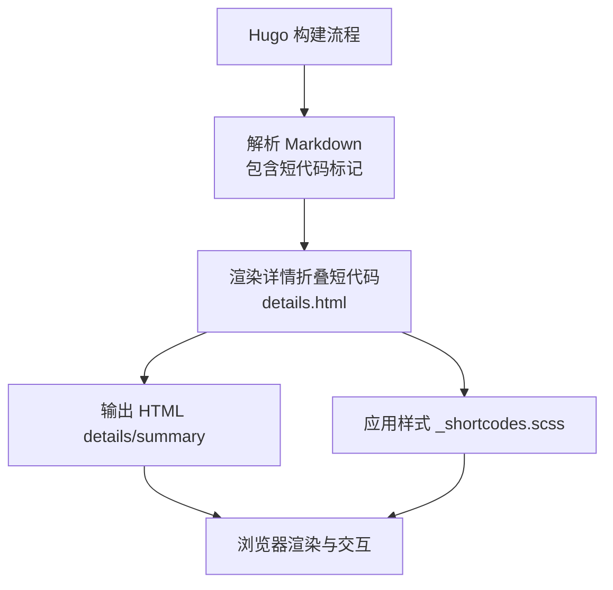
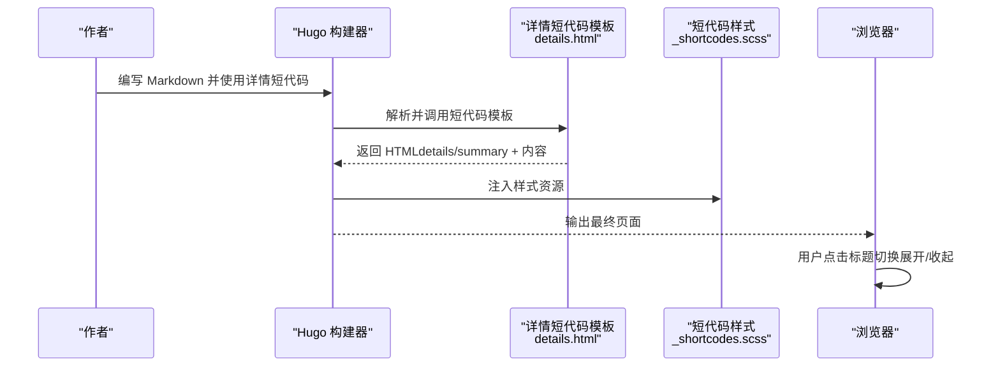
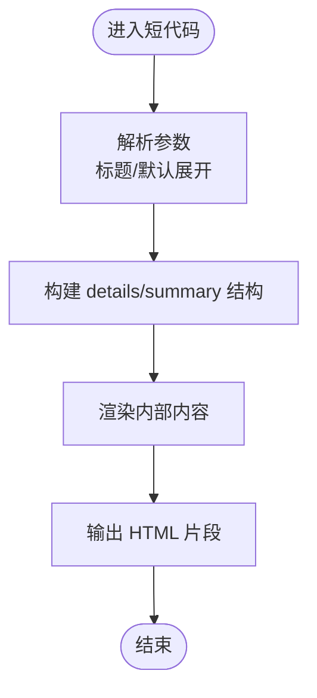
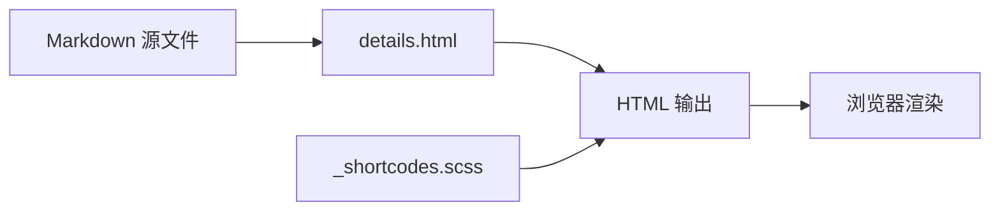

# 详情折叠短代码

<cite>
**本文引用的文件**   
- [themes/hugo-book/layouts/shortcodes/details.html](file://themes/hugo-book/layouts/shortcodes/details.html)
- [themes/hugo-book/assets/_shortcodes.scss](file://themes/hugo-book/assets/_shortcodes.scss)
- [content/docs/example/shortcodes/details/index.md](file://content/docs/example/shortcodes/details/index.md)
- [docs/docs/example/shortcodes/details/index.html](file://docs/docs/example/shortcodes/details/index.html)
</cite>

## 目录
1. [简介](#简介)
2. [项目结构](#项目结构)
3. [核心组件](#核心组件)
4. [架构总览](#架构总览)
5. [详细组件分析](#详细组件分析)
6. [依赖关系分析](#依赖关系分析)
7. [性能考量](#性能考量)
8. [故障排查指南](#故障排查指南)
9. [结论](#结论)
10. [附录](#附录)

## 简介
本文件面向使用 Hugo Book 主题的作者与开发者，提供“详情折叠短代码”的完整使用文档。内容涵盖：
- 实现原理与交互逻辑（基于原生 HTML details/summary）
- 标题设置、默认展开状态与内容组织配置
- 丰富的应用场景示例（FAQ、隐藏代码示例、注意事项提示等）
- 嵌套折叠结构与内容格式化支持
- 自定义动画效果与样式定制方法
- 可访问性与键盘导航兼容性说明

## 项目结构
本项目采用 Hugo Book 主题，详情折叠短代码由主题的 shortcodes 模板与样式共同实现。关键位置如下：
- 短代码模板：layouts/shortcodes/details.html
- 短代码样式：assets/_shortcodes.scss
- 示例页面：content/docs/example/shortcodes/details/index.md（源码），docs/docs/example/shortcodes/details/index.html（生成产物）

图表来源
- [themes/hugo-book/layouts/shortcodes/details.html](file://themes/hugo-book/layouts/shortcodes/details.html)
- [themes/hugo-book/assets/_shortcodes.scss](file://themes/hugo-book/assets/_shortcodes.scss)

章节来源
- [themes/hugo-book/layouts/shortcodes/details.html](file://themes/hugo-book/layouts/shortcodes/details.html)
- [themes/hugo-book/assets/_shortcodes.scss](file://themes/hugo-book/assets/_shortcodes.scss)
- [content/docs/example/shortcodes/details/index.md](file://content/docs/example/shortcodes/details/index.md)
- [docs/docs/example/shortcodes/details/index.html](file://docs/docs/example/shortcodes/details/index.html)

## 核心组件
- 短代码模板：负责将 Markdown 中的短代码块转换为标准的 HTML details/summary 结构，并透传参数（如标题、是否默认展开）。
- 样式模块：为 details/summary 提供视觉样式与过渡动画基础能力，便于通过 CSS 变量或覆盖规则进行定制。
- 示例页面：展示多种用法与组合方式，包括嵌套折叠、富文本内容、代码块等。

章节来源
- [themes/hugo-book/layouts/shortcodes/details.html](file://themes/hugo-book/layouts/shortcodes/details.html)
- [themes/hugo-book/assets/_shortcodes.scss](file://themes/hugo-book/assets/_shortcodes.scss)
- [content/docs/example/shortcodes/details/index.md](file://content/docs/example/shortcodes/details/index.md)

## 架构总览
从内容到页面的数据流与渲染路径如下：

图表来源
- [themes/hugo-book/layouts/shortcodes/details.html](file://themes/hugo-book/layouts/shortcodes/details.html)
- [themes/hugo-book/assets/_shortcodes.scss](file://themes/hugo-book/assets/_shortcodes.scss)

## 详细组件分析

### 组件A：详情折叠短代码（details.html）
- 职责
  - 接收短代码参数（例如标题、是否默认展开）
  - 生成语义化 HTML 结构（details/summary）
  - 将短代码块内的任意 Markdown/HTML 内容作为折叠体
- 关键点
  - 使用原生 details/summary 保证跨平台兼容与可访问性
  - 通过布尔参数控制默认展开状态
  - 支持在折叠体内放置富文本、列表、表格、代码块等

图表来源
- [themes/hugo-book/layouts/shortcodes/details.html](file://themes/hugo-book/layouts/shortcodes/details.html)

章节来源
- [themes/hugo-book/layouts/shortcodes/details.html](file://themes/hugo-book/layouts/shortcodes/details.html)

### 组件B：短代码样式（_shortcodes.scss）
- 职责
  - 定义 details/summary 的基础样式
  - 提供过渡动画与视觉反馈（如箭头指示）
  - 暴露可覆盖的样式钩子，便于主题级定制
- 关键点
  - 使用 CSS 过渡属性实现平滑展开/收起
  - 可通过覆盖样式类或变量调整颜色、间距、字体等
  - 保持与主题整体风格一致

章节来源
- [themes/hugo-book/assets/_shortcodes.scss](file://themes/hugo-book/assets/_shortcodes.scss)

### 组件C：示例页面（index.md / index.html）
- 职责
  - 演示单条折叠、多条并列、嵌套折叠
  - 展示在折叠体内嵌入代码块、表格、图片等富媒体
  - 作为快速上手参考
- 关键点
  - 通过不同参数组合体现标题与默认展开行为
  - 嵌套结构验证层级与样式一致性
  - 生成产物用于在线预览与调试

章节来源
- [content/docs/example/shortcodes/details/index.md](file://content/docs/example/shortcodes/details/index.md)
- [docs/docs/example/shortcodes/details/index.html](file://docs/docs/example/shortcodes/details/index.html)

## 依赖关系分析
- 短代码模板依赖 Hugo 的短代码渲染管线
- 样式模块被主题主样式引入，作用于所有使用详情短代码的页面
- 示例页面依赖上述两者以呈现预期效果

图表来源
- [themes/hugo-book/layouts/shortcodes/details.html](file://themes/hugo-book/layouts/shortcodes/details.html)
- [themes/hugo-book/assets/_shortcodes.scss](file://themes/hugo-book/assets/_shortcodes.scss)

章节来源
- [themes/hugo-book/layouts/shortcodes/details.html](file://themes/hugo-book/layouts/shortcodes/details.html)
- [themes/hugo-book/assets/_shortcodes.scss](file://themes/hugo-book/assets/_shortcodes.scss)

## 性能考量
- 原生 details/summary 由浏览器原生实现，开销小且无需额外 JS
- 大量嵌套折叠时建议避免过深的层级，减少 DOM 节点数量
- 若需复杂动画，优先使用 CSS transition，避免频繁重排重绘
- 在长文档中按需加载或分页展示，降低首屏压力

## 故障排查指南
- 未显示折叠效果
  - 检查是否正确引入主题样式
  - 确认浏览器控制台无 CSS 加载错误
- 默认展开无效
  - 核对短代码参数是否传递正确
  - 检查是否存在同名 CSS 覆盖导致样式异常
- 嵌套折叠错位
  - 检查缩进与层级是否符合规范
  - 确认内部元素未破坏 details/summary 结构
- 键盘不可用
  - 确认焦点落在 summary 上
  - 测试 Enter/Space 键是否能切换展开/收起

章节来源
- [themes/hugo-book/layouts/shortcodes/details.html](file://themes/hugo-book/layouts/shortcodes/details.html)
- [themes/hugo-book/assets/_shortcodes.scss](file://themes/hugo-book/assets/_shortcodes.scss)

## 结论
详情折叠短代码基于标准 HTML details/summary，具备良好兼容性、可访问性与低开销特性。通过主题样式的统一管理与少量 CSS 覆盖，即可实现一致的视觉体验与灵活的交互效果。建议在 FAQ、代码示例隐藏、注意事项提示等场景中广泛使用，并通过嵌套与富文本增强信息密度与可读性。

## 附录

### 使用方法与配置要点
- 基本用法
  - 在 Markdown 中使用短代码包裹标题与内容
  - 标题即折叠触发区，内容即为折叠体
- 标题设置
  - 通过短代码参数指定标题文本
- 默认展开状态
  - 通过布尔参数控制初始是否展开
- 内容组织
  - 支持段落、列表、表格、代码块、图片等
  - 可在折叠体内继续嵌套其他短代码（如提示框、代码高亮等）

章节来源
- [content/docs/example/shortcodes/details/index.md](file://content/docs/example/shortcodes/details/index.md)

### 常见应用场景示例
- FAQ 页面
  - 每个问题为一个折叠项，答案置于折叠体内
- 代码示例隐藏
  - 将冗长代码放入折叠体，读者按需展开查看
- 注意事项提示
  - 将易忽略的重要说明放入折叠体，保持正文简洁

章节来源
- [content/docs/example/shortcodes/details/index.md](file://content/docs/example/shortcodes/details/index.md)

### 嵌套折叠与内容格式化
- 嵌套折叠
  - 在折叠体内再次使用详情短代码形成多级结构
  - 注意层级缩进与闭合顺序，确保结构清晰
- 内容格式化
  - 支持 Markdown 语法与 HTML 标签
  - 可与主题内其他短代码组合使用（如代码块、提示框等）

章节来源
- [content/docs/example/shortcodes/details/index.md](file://content/docs/example/shortcodes/details/index.md)

### 自定义动画与样式定制
- 动画效果
  - 使用 CSS transition 对高度或透明度进行过渡
  - 结合 details 的 open 状态选择器控制展开/收起
- 样式定制
  - 覆盖 summary 的伪元素（如箭头图标）
  - 调整 padding、border、背景色等视觉属性
  - 通过主题变量或局部样式文件进行集中管理

章节来源
- [themes/hugo-book/assets/_shortcodes.scss](file://themes/hugo-book/assets/_shortcodes.scss)

### 可访问性与键盘导航
- 语义化
  - details/summary 自带可访问性语义，屏幕阅读器可识别
- 键盘操作
  - 聚焦于 summary 后，按 Enter 或 Space 可切换展开/收起
- 焦点管理
  - 避免在折叠体内放置会抢占焦点的元素而阻断键盘操作
- 对比度与可见性
  - 确保标题与内容的对比度满足无障碍要求

章节来源
- [themes/hugo-book/layouts/shortcodes/details.html](file://themes/hugo-book/layouts/shortcodes/details.html)