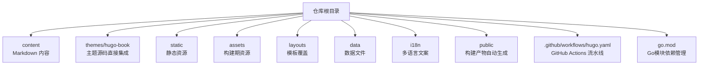
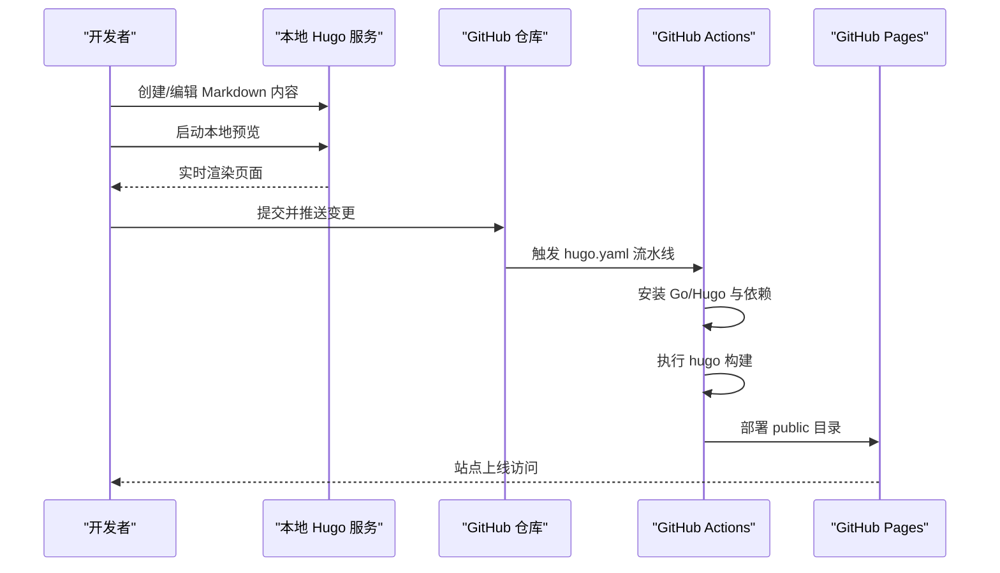
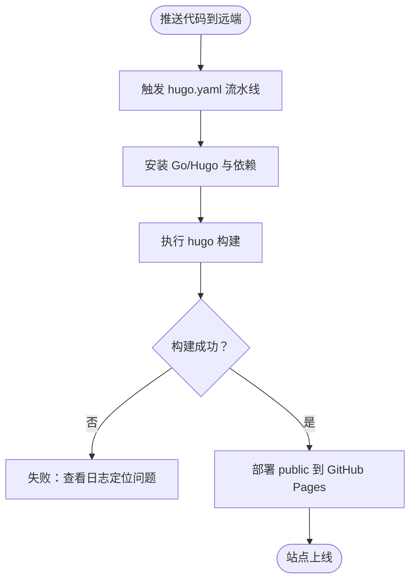
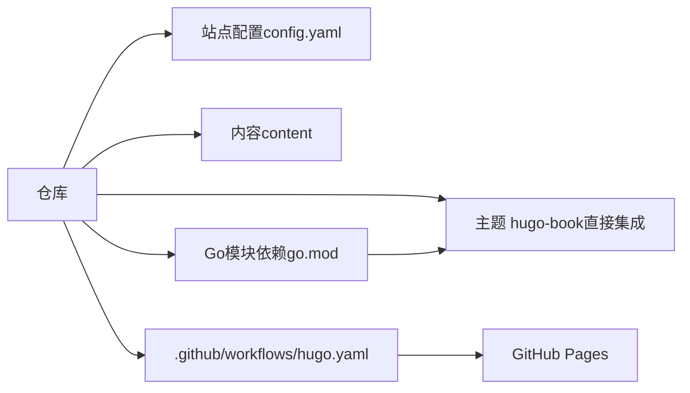

# 快速开始

<cite>
**本文引用的文件**   
- [README.md](file://README.md)
- [config.yaml](file://config.yaml)
- [.github/workflows/hugo.yaml](file://.github/workflows/hugo.yaml)
- [go.mod](file://go.mod)
- [themes/hugo-book/theme.toml](file://themes/hugo-book/theme.toml)
- [content/_index.md](file://content/_index.md)
- [archetypes/default.md](file://archetypes/default.md)
</cite>

## 更新摘要
**变更内容**   
- 项目架构重大重构，从Git Submodule迁移到Go模块依赖管理
- 移除了子模块初始化步骤，简化了依赖管理流程
- 新增了go.mod文件进行Go模块依赖管理
- 更新了环境准备和主题安装步骤，不再需要手动初始化子模块
- 调整了项目结构说明，反映新的依赖管理架构
- 更新了故障排除指南，移除子模块相关的错误处理

## 目录
1. [简介](#简介)
2. [项目结构](#项目结构)
3. [核心组件](#核心组件)
4. [架构总览](#架构总览)
5. [详细组件分析](#详细组件分析)
6. [依赖分析](#依赖分析)
7. [性能考虑](#性能考虑)
8. [故障排除指南](#故障排除指南)
9. [结论](#结论)
10. [附录](#附录)

## 简介
本指南面向初学者，帮助你从零搭建并运行这个基于 Hugo 与 hugo-book 主题的技术博客项目。你将完成以下目标：
- 准备开发环境（Go、Hugo、Git）
- 克隆仓库并安装主题（无需子模块初始化）
- 修改配置并本地预览
- 日常开发工作流（创作、预览、提交）
- 在 GitHub Pages 上自动部署（含 CI/CD 流水线与域名绑定）
- 常见问题排查

## 项目结构
仓库采用标准 Hugo 站点布局，内容以 Markdown 为主，主题通过简化的依赖管理方式集成 hugo-book。关键目录说明：
- content：站点内容与文章
- themes/hugo-book：主题源码（直接集成，非子模块）
- static：静态资源（图片、字体等）
- assets：构建期资源（SCSS、JS 等）
- layouts：自定义模板覆盖（可选）
- data：数据文件（可选）
- i18n：多语言文案（可选）
- public：构建产物（由 Hugo 生成，通常不纳入版本控制）
- docs：示例或文档输出（视使用场景而定）
- go.mod：Go模块依赖配置文件

**章节来源**   
- [README.md:1-200](file://README.md#L1-L200)
- [config.yaml:1-200](file://config.yaml#L1-L200)
- [.github/workflows/hugo.yaml:1-200](file://.github/workflows/hugo.yaml#L1-L200)

## 核心组件
- Hugo 静态网站生成器：负责解析 Markdown、模板与资源，生成静态站点。
- hugo-book 主题：提供文档型站点外观与导航结构。
- GitHub Actions 流水线：在推送时自动构建并部署到 GitHub Pages。
- Go模块依赖管理：通过go.mod统一管理项目依赖，替代传统的Git Submodule方式。

**章节来源**   
- [themes/hugo-book/theme.toml:1-200](file://themes/hugo-book/theme.toml#L1-L200)
- [.github/workflows/hugo.yaml:1-200](file://.github/workflows/hugo.yaml#L1-L200)
- [go.mod:1-200](file://go.mod#L1-L200)

## 架构总览
下图展示从"编写内容"到"线上发布"的整体流程，包括本地开发与 GitHub Pages 自动化部署。

**图表来源**   
- [.github/workflows/hugo.yaml:1-200](file://.github/workflows/hugo.yaml#L1-L200)

## 详细组件分析

### 环境与工具准备
- 安装 Go 语言环境
  - 建议安装官方稳定版，并确保 go 命令可用。
- 安装 Hugo（推荐 Extended 版本）
  - 若使用 SCSS/Sass 编译，需安装 Extended 版本。
- 安装 Git 并配置用户信息
  - 用于拉取代码与管理版本控制。

**章节来源**   
- [README.md:1-200](file://README.md#L1-L200)

### 克隆仓库与初始化主题
- 克隆仓库（主题已直接集成，无需子模块参数）
  - 使用标准 git clone 命令即可，主题源码已包含在仓库中。
- 进入项目目录
  - 后续所有命令均在项目根目录下执行。

**更新** 移除了子模块初始化步骤，简化了仓库克隆过程。现在只需执行标准的git clone命令即可获取完整的项目代码。

**章节来源**   
- [README.md:1-200](file://README.md#L1-L200)

### 主题与依赖
- 主题：hugo-book
  - 直接集成在 themes/hugo-book 目录中，无需额外管理。
- 主题配置文件
  - 主题元信息与能力定义位于 theme.toml。
- 站点配置
  - 使用 config.yaml 进行站点级配置。
- Go模块依赖管理
  - 通过 go.mod 文件统一管理项目依赖，提供更稳定的依赖版本控制。

**更新** 移除了 Git Submodule 依赖管理，主题现在作为直接依赖集成，并通过Go模块系统进行依赖管理。

**章节来源**   
- [themes/hugo-book/theme.toml:1-200](file://themes/hugo-book/theme.toml#L1-L200)
- [config.yaml:1-200](file://config.yaml#L1-L200)
- [go.mod:1-200](file://go.mod#L1-L200)

### 本地预览
- 启动本地服务器
  - 使用 hugo server 启动热重载预览。
- 访问地址
  - 默认监听本地端口，浏览器打开提示的地址即可预览。
- 常用参数
  - 可按需指定端口、基础 URL、构建模式等。

**章节来源**   
- [README.md:1-200](file://README.md#L1-L200)

### 内容创作与模板
- 新增文章
  - 建议在 content 下按分类组织目录，并在对应目录内新建 Markdown 文件。
- 使用模板
  - 可使用 archetypes/default.md 作为新内容的骨架，便于统一 Front Matter。
- 首页与栏目页
  - 站点首页与栏目索引位于 content/_index.md 与各分类下的 _index.md。

**章节来源**   
- [content/_index.md:1-200](file://content/_index.md#L1-L200)
- [archetypes/default.md:1-200](file://archetypes/default.md#L1-L200)

### 本地开发工作流
- 日常步骤
  - 创建/编辑内容 → 本地预览验证 → 提交并推送 → 等待 CI 构建与部署。
- 分支策略（建议）
  - 主分支为生产，功能分支进行开发，合并后触发构建。

**章节来源**   
- [README.md:1-200](file://README.md#L1-L200)

### GitHub Pages 部署（CI/CD）
- 启用 GitHub Pages
  - 在仓库设置中开启 Pages，选择由 GitHub Actions 提供的构建产物。
- 流水线文件
  - .github/workflows/hugo.yaml 定义了安装环境、构建与部署步骤。
- 部署产物
  - 将 public 目录部署到 Pages 分支或 gh-pages 分支（依流水线配置）。
- 自定义域名（可选）
  - 在 Pages 设置中添加自定义域名，并按要求添加 DNS 记录与 CNAME。

**图表来源**   
- [.github/workflows/hugo.yaml:1-200](file://.github/workflows/hugo.yaml#L1-L200)

**章节来源**   
- [.github/workflows/hugo.yaml:1-200](file://.github/workflows/hugo.yaml#L1-L200)

## 依赖分析
- 外部依赖
  - Go 运行时（用于 Hugo 扩展特性）
  - Hugo（Extended 版本，如需 SCSS/Sass）
  - Git（版本管理）
- 内部依赖
  - 主题 hugo-book（直接集成，非子模块）
  - 站点配置（config.yaml）
  - 内容（content 目录）
  - Go模块依赖（go.mod）

**更新** 移除了 Git Submodule 依赖，主题现在作为直接依赖管理，并通过Go模块系统进行统一的依赖版本控制。

**图表来源**   
- [config.yaml:1-200](file://config.yaml#L1-L200)
- [themes/hugo-book/theme.toml:1-200](file://themes/hugo-book/theme.toml#L1-L200)
- [.github/workflows/hugo.yaml:1-200](file://.github/workflows/hugo.yaml#L1-L200)
- [go.mod:1-200](file://go.mod#L1-L200)

**章节来源**   
- [config.yaml:1-200](file://config.yaml#L1-L200)
- [themes/hugo-book/theme.toml:1-200](file://themes/hugo-book/theme.toml#L1-L200)
- [.github/workflows/hugo.yaml:1-200](file://.github/workflows/hugo.yaml#L1-L200)
- [go.mod:1-200](file://go.mod#L1-L200)

## 性能考虑
- 构建优化
  - 合理组织内容目录，避免过深的层级；按需启用缓存。
- 资源优化
  - 图片压缩与懒加载；减少不必要的静态资源体积。
- 主题与插件
  - 仅启用必要功能，避免冗余脚本与样式。
- 部署策略
  - 使用增量构建与缓存加速 CI 构建。
- 依赖管理优化
  - 利用Go模块的依赖缓存机制，提升构建效率。

## 故障排除指南
- 无法找到 hugo 命令
  - 确认已安装 Hugo 且 PATH 配置正确；如使用扩展特性，请安装 Extended 版本。
- 构建失败（SCSS/Sass）
  - 确认使用的是 Hugo Extended 版本，并检查依赖是否完整。
- 本地预览无变化
  - 重启 hugo server；检查文件保存路径是否在 content 下。
- GitHub Pages 部署失败
  - 查看 Actions 日志，确认构建步骤与部署路径；检查 Pages 设置是否正确启用。
- Go模块依赖问题
  - 确保网络连接正常，可访问Go模块代理；检查go.mod文件中的依赖版本是否正确。

**更新** 移除了子模块相关的故障排除项，因为项目不再使用 Git Submodule。新增了Go模块依赖相关的问题排查指导。

**章节来源**   
- [README.md:1-200](file://README.md#L1-L200)
- [.github/workflows/hugo.yaml:1-200](file://.github/workflows/hugo.yaml#L1-L200)
- [go.mod:1-200](file://go.mod#L1-L200)

## 结论
通过以上步骤，你可以快速完成环境准备、本地开发、内容创作与 GitHub Pages 自动化部署。新的简化依赖管理方式使得项目更加易于上手和维护，无需担心子模块的复杂配置问题。通过引入Go模块依赖管理，项目的依赖版本控制更加稳定和可靠。建议在日常工作中保持内容结构与配置清晰，结合 CI/CD 实现高效迭代与稳定发布。

## 附录
- 常用命令速查
  - 克隆仓库（无需子模块参数）
  - 启动本地预览
  - 构建站点
  - 提交与推送
  - 管理Go模块依赖
- 参考链接
  - Hugo 官方文档
  - hugo-book 主题文档
  - GitHub Pages 文档
  - Go模块官方文档