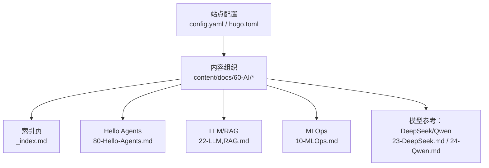
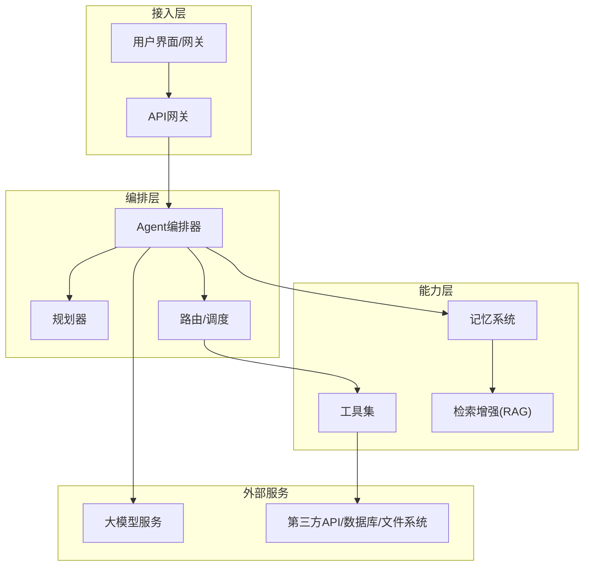
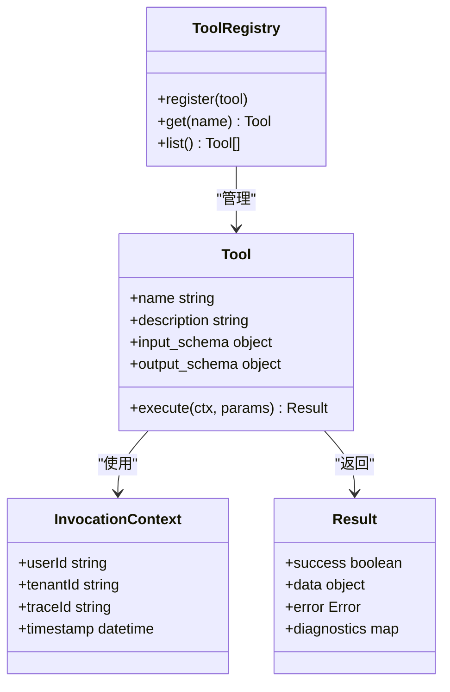
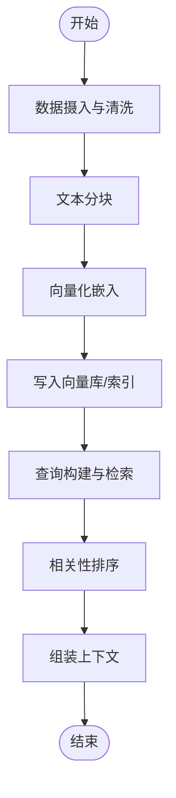
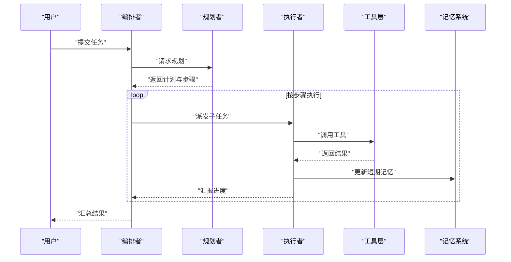
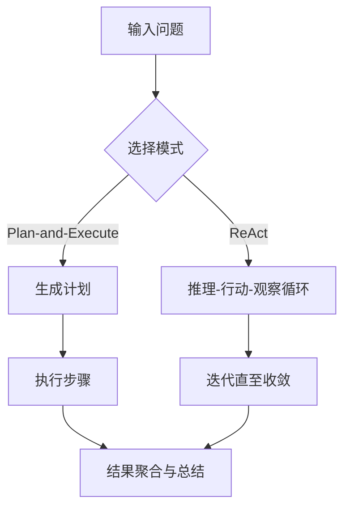
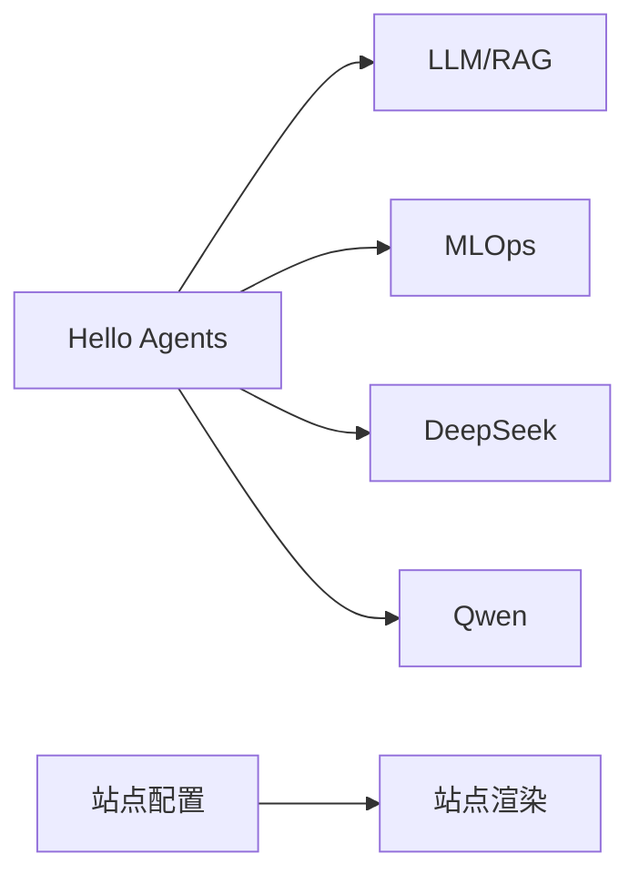

# AI Agent开发指南

<cite>
**本文引用的文件**   
- [content/docs/60-AI/_index.md](file://content/docs/60-AI/_index.md)
- [content/docs/60-AI/80-Hello-Agents.md](file://content/docs/60-AI/80-Hello-Agents.md)
- [content/docs/60-AI/22-LLM,RAG.md](file://content/docs/60-AI/22-LLM,RAG.md)
- [content/docs/60-AI/10-MLOps.md](file://content/docs/60-AI/10-MLOps.md)
- [content/docs/60-AI/23-DeepSeek.md](file://content/docs/60-AI/23-DeepSeek.md)
- [content/docs/60-AI/24-Qwen.md](file://content/docs/60-AI/24-Qwen.md)
- [config.yaml](file://config.yaml)
- [hugo.toml](file://hugo.toml)
</cite>

## 目录
1. [简介](#简介)
2. [项目结构](#项目结构)
3. [核心组件](#核心组件)
4. [架构总览](#架构总览)
5. [详细组件分析](#详细组件分析)
6. [依赖关系分析](#依赖关系分析)
7. [性能考虑](#性能考虑)
8. [故障排查指南](#故障排查指南)
9. [结论](#结论)
10. [附录](#附录)

## 简介
本指南面向AI Agent开发者，围绕Agent架构设计、开发模式与工程实践展开。内容覆盖工具调用框架、记忆系统、多Agent协作机制；给出ReAct、Plan-and-Execute等经典模式的落地思路；介绍LangChain、AutoGen等主流框架的使用要点；并扩展到规划能力、反思与自主学习、安全与权限控制、资源管理、调试与监控、以及典型应用场景（智能助手、自动化工作流、复杂任务处理）的构建方法。

## 项目结构
仓库为Hugo静态站点，文档位于content目录下，AI相关内容集中在content/docs/60-AI。站点配置在根目录的config.yaml与hugo.toml中。

图表来源
- [config.yaml](file://config.yaml)
- [hugo.toml](file://hugo.toml)
- [content/docs/60-AI/_index.md](file://content/docs/60-AI/_index.md)
- [content/docs/60-AI/80-Hello-Agents.md](file://content/docs/60-AI/80-Hello-Agents.md)
- [content/docs/60-AI/22-LLM,RAG.md](file://content/docs/60-AI/22-LLM,RAG.md)
- [content/docs/60-AI/10-MLOps.md](file://content/docs/60-AI/10-MLOps.md)
- [content/docs/60-AI/23-DeepSeek.md](file://content/docs/60-AI/23-DeepSeek.md)
- [content/docs/60-AI/24-Qwen.md](file://content/docs/60-AI/24-Qwen.md)

章节来源
- [content/docs/60-AI/_index.md](file://content/docs/60-AI/_index.md)
- [config.yaml](file://config.yaml)
- [hugo.toml](file://hugo.toml)

## 核心组件
- 工具调用框架
  - 目标：将外部API、脚本、数据库、搜索等能力以“工具”形式暴露给Agent，支持参数校验、错误处理、结果结构化。
  - 关键要素：工具注册表、统一调用接口、上下文注入、幂等与重试、超时与熔断、审计日志。
- 记忆管理系统
  - 短期记忆：会话级上下文窗口、最近交互摘要、计划状态。
  - 长期记忆：向量检索（RAG）、知识图谱、用户画像与偏好。
  - 更新策略：增量写入、去重、过期清理、版本化。
- 多Agent协作机制
  - 角色分工：规划者、执行者、评审者、编排者。
  - 通信协议：消息总线或事件流、契约定义、超时与补偿。
  - 冲突解决：优先级、仲裁策略、回滚与重试。
- 经典模式
  - ReAct：推理-行动-观察循环，适合需要动态探索的任务。
  - Plan-and-Execute：先规划后执行，适合长链路、可分解任务。
- 主流框架
  - LangChain：链式编排、工具集成、记忆与检索增强。
  - AutoGen：多Agent对话编排、角色与策略配置、群聊与工作流。
- 高级能力
  - 规划能力：任务分解、依赖图、约束求解。
  - 反思机制：自我评估、失败归因、策略调整。
  - 自主学习：从反馈中学习、经验沉淀、策略微调。

章节来源
- [content/docs/60-AI/80-Hello-Agents.md](file://content/docs/60-AI/80-Hello-Agents.md)
- [content/docs/60-AI/22-LLM,RAG.md](file://content/docs/60-AI/22-LLM,RAG.md)

## 架构总览
下图展示一个通用Agent系统的分层与数据流：前端入口接收意图，编排器进行规划与路由，工具层提供能力，记忆层支撑上下文与检索，外部服务完成最终动作。

图表来源
- [content/docs/60-AI/80-Hello-Agents.md](file://content/docs/60-AI/80-Hello-Agents.md)
- [content/docs/60-AI/22-LLM,RAG.md](file://content/docs/60-AI/22-LLM,RAG.md)

## 详细组件分析

### 组件A：工具调用框架
- 职责
  - 统一注册与发现工具
  - 参数校验与类型转换
  - 调用生命周期管理（前置检查、执行、后置处理）
  - 错误分类与重试策略
  - 审计与可观测性
- 数据结构
  - 工具元信息：名称、描述、输入输出Schema、权限标签、版本
  - 调用上下文：用户ID、租户、追踪ID、时间戳
  - 结果对象：成功/失败、返回数据、诊断信息
- 复杂度与优化
  - 注册表查找O(1)（哈希），批量调用采用并发+限流
  - 缓存热点工具结果，避免重复计算
  - 使用连接池与超时控制降低外部依赖抖动影响

图表来源
- [content/docs/60-AI/80-Hello-Agents.md](file://content/docs/60-AI/80-Hello-Agents.md)

章节来源
- [content/docs/60-AI/80-Hello-Agents.md](file://content/docs/60-AI/80-Hello-Agents.md)

### 组件B：记忆系统与RAG
- 职责
  - 维护会话短期记忆与长期知识库
  - 提供语义检索与片段召回
  - 支持增量更新与一致性保障
- 流程
  - 写入：清洗→分块→向量化→入库
  - 读取：查询→检索Top-K→排序→拼接上下文
  - 更新：去重→合并→索引重建/增量更新
- 性能
  - 向量库索引优化、近似最近邻检索
  - 缓存热门片段、批处理写入

图表来源
- [content/docs/60-AI/22-LLM,RAG.md](file://content/docs/60-AI/22-LLM,RAG.md)

章节来源
- [content/docs/60-AI/22-LLM,RAG.md](file://content/docs/60-AI/22-LLM,RAG.md)

### 组件C：多Agent协作编排
- 角色
  - 规划者：生成计划、拆解子任务
  - 执行者：调用工具、产出中间结果
  - 评审者：质量评估、风险识别
  - 编排者：协调流转、异常恢复
- 通信
  - 基于消息队列或事件总线
  - 明确契约：消息格式、超时、重试、幂等
- 容错
  - 超时与重试、降级与熔断、补偿事务

图表来源
- [content/docs/60-AI/80-Hello-Agents.md](file://content/docs/60-AI/80-Hello-Agents.md)

章节来源
- [content/docs/60-AI/80-Hello-Agents.md](file://content/docs/60-AI/80-Hello-Agents.md)

### 组件D：ReAct与Plan-and-Execute模式
- ReAct流程
  - 思考→行动→观察→再思考，逐步逼近答案
  - 适用于开放域、需动态探索的问题
- Plan-and-Execute流程
  - 先制定计划，再顺序/并行执行，最后总结
  - 适用于结构化、可分解的长链路任务

图表来源
- [content/docs/60-AI/80-Hello-Agents.md](file://content/docs/60-AI/80-Hello-Agents.md)

章节来源
- [content/docs/60-AI/80-Hello-Agents.md](file://content/docs/60-AI/80-Hello-Agents.md)

### 组件E：主流框架使用要点
- LangChain
  - 链式编排：将LLM、工具、记忆串联成可复用链
  - 工具集成：声明式工具定义与自动参数绑定
  - 检索增强：结合向量库实现RAG
- AutoGen
  - 多Agent对话：通过角色与策略配置实现协作
  - 群聊与工作流：灵活编排Agent间交互
  - 扩展点：自定义Agent、消息协议与回调

章节来源
- [content/docs/60-AI/80-Hello-Agents.md](file://content/docs/60-AI/80-Hello-Agents.md)

### 组件F：安全、权限与资源管理
- 安全
  - 输入校验与输出过滤、敏感信息脱敏
  - 访问控制：基于角色的工具白名单、最小权限原则
  - 审计：全链路日志、操作溯源
- 资源管理
  - 配额与限流：按租户/用户维度限制调用量
  - 成本优化：缓存、批处理、模型选择策略
  - 弹性伸缩：水平扩展、异步队列削峰

章节来源
- [content/docs/60-AI/80-Hello-Agents.md](file://content/docs/60-AI/80-Hello-Agents.md)

### 组件G：调试、监控与故障排查
- 调试
  - 可视化Trace：记录每一步推理、工具调用与结果
  - 回放与断点：对历史会话进行回放与干预
- 监控
  - 指标：延迟、成功率、Token消耗、错误率
  - 告警：阈值触发、异常模式检测
- 排障
  - 常见错误：超时、鉴权失败、参数不匹配、索引缺失
  - 定位路径：从Trace到具体工具与外部依赖

章节来源
- [content/docs/60-AI/80-Hello-Agents.md](file://content/docs/60-AI/80-Hello-Agents.md)

## 依赖关系分析
- 内容依赖
  - Hello Agents作为入门与总览，链接至RAG、MLOps与模型参考
  - RAG文档为记忆与检索增强提供基础
  - MLOps文档为部署、监控与治理提供方法论
- 站点配置
  - config.yaml与hugo.toml决定站点主题、菜单与渲染行为

图表来源
- [content/docs/60-AI/80-Hello-Agents.md](file://content/docs/60-AI/80-Hello-Agents.md)
- [content/docs/60-AI/22-LLM,RAG.md](file://content/docs/60-AI/22-LLM,RAG.md)
- [content/docs/60-AI/10-MLOps.md](file://content/docs/60-AI/10-MLOps.md)
- [content/docs/60-AI/23-DeepSeek.md](file://content/docs/60-AI/23-DeepSeek.md)
- [content/docs/60-AI/24-Qwen.md](file://content/docs/60-AI/24-Qwen.md)
- [config.yaml](file://config.yaml)
- [hugo.toml](file://hugo.toml)

章节来源
- [content/docs/60-AI/_index.md](file://content/docs/60-AI/_index.md)
- [content/docs/60-AI/80-Hello-Agents.md](file://content/docs/60-AI/80-Hello-Agents.md)
- [content/docs/60-AI/22-LLM,RAG.md](file://content/docs/60-AI/22-LLM,RAG.md)
- [content/docs/60-AI/10-MLOps.md](file://content/docs/60-AI/10-MLOps.md)
- [content/docs/60-AI/23-DeepSeek.md](file://content/docs/60-AI/23-DeepSeek.md)
- [content/docs/60-AI/24-Qwen.md](file://content/docs/60-AI/24-Qwen.md)
- [config.yaml](file://config.yaml)
- [hugo.toml](file://hugo.toml)

## 性能考虑
- 减少外部依赖RTT：本地缓存、预取、批处理
- 控制上下文长度：摘要压缩、选择性注入
- 并发与限流：合理设置并发度、令牌桶限流
- 模型选择：根据任务复杂度选择合适模型，平衡成本与效果
- 索引优化：向量库分区、定期重建索引、冷热分离

[本节为通用指导，无需引用具体文件]

## 故障排查指南
- 常见问题
  - 工具调用失败：检查鉴权、网络连通、参数Schema
  - 检索为空：确认索引是否构建、查询词是否与分块一致
  - 响应超时：增加超时阈值、启用重试与熔断
- 定位方法
  - 查看Trace日志，定位到具体步骤与工具
  - 对比输入输出Schema，验证字段映射
  - 复现最小用例，隔离外部依赖
- 恢复策略
  - 降级到备用工具或简化流程
  - 回退到上一稳定版本
  - 通知相关方并记录变更

章节来源
- [content/docs/60-AI/80-Hello-Agents.md](file://content/docs/60-AI/80-Hello-Agents.md)

## 结论
本指南从架构、组件、模式到工程实践，系统化地梳理了AI Agent的开发要点。通过工具调用框架、记忆系统与多Agent协作，结合ReAct与Plan-and-Execute等模式，可在实际项目中构建可靠的智能助手与自动化工作流。配合安全与资源管理、调试与监控手段，能够持续提升稳定性与可维护性。

[本节为总结性内容，无需引用具体文件]

## 附录
- 术语
  - Agent：具备感知、决策与行动能力的智能体
  - RAG：检索增强生成，结合外部知识库提升回答质量
  - ReAct：推理-行动-观察循环范式
  - Plan-and-Execute：先规划后执行的范式
- 参考文档
  - Hello Agents：Agent入门与实践
  - LLM/RAG：检索增强技术要点
  - MLOps：模型运维与治理
  - DeepSeek/Qwen：模型参考与选型建议

章节来源
- [content/docs/60-AI/80-Hello-Agents.md](file://content/docs/60-AI/80-Hello-Agents.md)
- [content/docs/60-AI/22-LLM,RAG.md](file://content/docs/60-AI/22-LLM,RAG.md)
- [content/docs/60-AI/10-MLOps.md](file://content/docs/60-AI/10-MLOps.md)
- [content/docs/60-AI/23-DeepSeek.md](file://content/docs/60-AI/23-DeepSeek.md)
- [content/docs/60-AI/24-Qwen.md](file://content/docs/60-AI/24-Qwen.md)