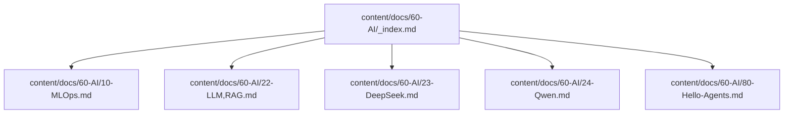
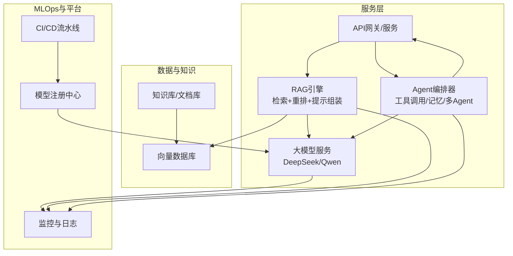
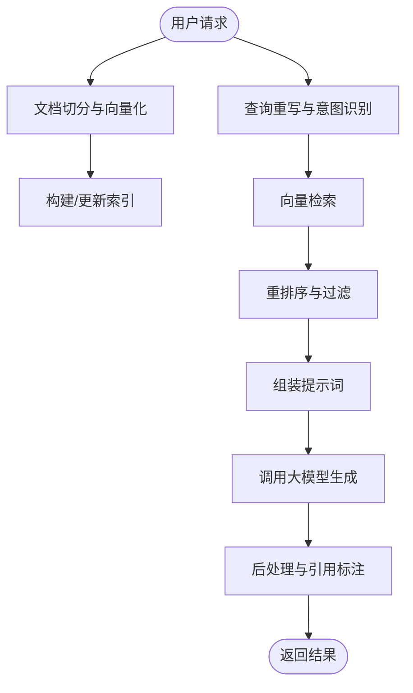
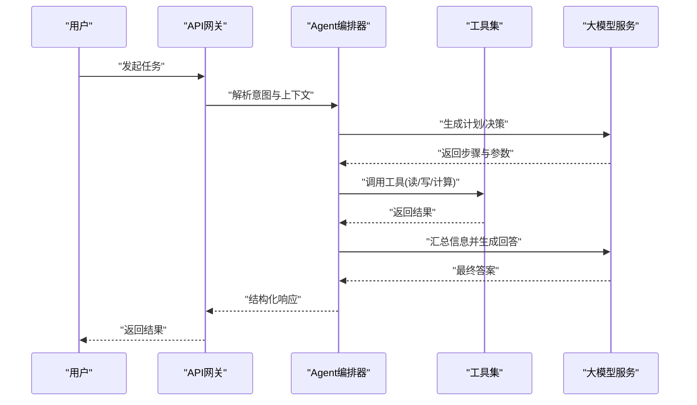
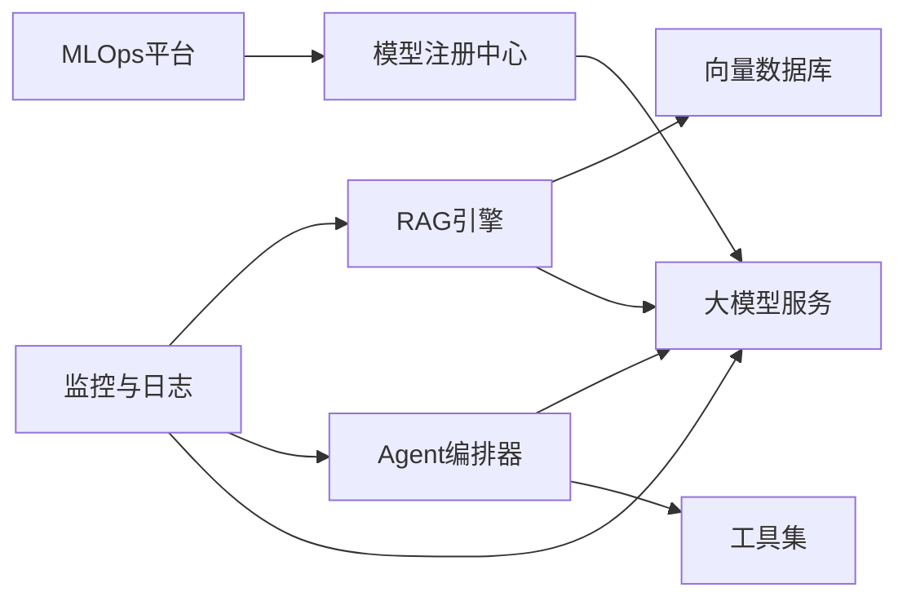

# AI与机器学习

<cite>
**本文引用的文件**   
- [content/docs/60-AI/_index.md](file://content/docs/60-AI/_index.md)
- [content/docs/60-AI/10-MLOps.md](file://content/docs/60-AI/10-MLOps.md)
- [content/docs/60-AI/22-LLM,RAG.md](file://content/docs/60-AI/22-LLM,RAG.md)
- [content/docs/60-AI/23-DeepSeek.md](file://content/docs/60-AI/23-DeepSeek.md)
- [content/docs/60-AI/24-Qwen.md](file://content/docs/60-AI/24-Qwen.md)
- [content/docs/60-AI/80-Hello-Agents.md](file://content/docs/60-AI/80-Hello-Agents.md)
</cite>

## 更新摘要
**所做更改**   
- 新增了完整的AI与机器学习文档体系，涵盖MLOps实践、大语言模型RAG技术、DeepSeek和Qwen模型应用以及AI Agent开发
- 构建了系统化的技术文档架构，从基础概念到生产环境最佳实践
- 提供了端到端的架构图和详细的组件分析

## 目录
1. [简介](#简介)
2. [项目结构](#项目结构)
3. [核心组件](#核心组件)
4. [架构总览](#架构总览)
5. [详细组件分析](#详细组件分析)
6. [依赖关系分析](#依赖关系分析)
7. [性能考量](#性能考量)
8. [故障排查指南](#故障排查指南)
9. [结论](#结论)
10. [附录](#附录)

## 简介
本仓库聚焦AI与机器学习前沿实践，围绕MLOps流水线、大语言模型（LLM）应用、检索增强生成（RAG）、主流模型（如DeepSeek、Qwen）的API使用与本地部署、以及AI Agent开发模式等主题，提供系统化、可落地的技术文档。内容覆盖从数据准备、训练、部署到监控与版本管理的完整生命周期，并结合生产环境的性能优化、成本控制与安全合规建议，帮助开发者快速构建高质量AI应用。

## 项目结构
本项目采用Hugo静态站点组织文档，AI相关内容集中在 content/docs/60-AI 目录下，包含MLOps、LLM与RAG、DeepSeek、Qwen、Agent入门等专题文章与索引页。

图表来源
- [content/docs/60-AI/_index.md](file://content/docs/60-AI/_index.md)
- [content/docs/60-AI/10-MLOps.md](file://content/docs/60-AI/10-MLOps.md)
- [content/docs/60-AI/22-LLM,RAG.md](file://content/docs/60-AI/22-LLM,RAG.md)
- [content/docs/60-AI/23-DeepSeek.md](file://content/docs/60-AI/23-DeepSeek.md)
- [content/docs/60-AI/24-Qwen.md](file://content/docs/60-AI/24-Qwen.md)
- [content/docs/60-AI/80-Hello-Agents.md](file://content/docs/60-AI/80-Hello-Agents.md)

章节来源
- [content/docs/60-AI/_index.md](file://content/docs/60-AI/_index.md)

## 核心组件
- MLOps流水线：涵盖数据版本化、实验跟踪、模型注册、CI/CD集成、灰度发布与在线监控。
- RAG系统：包括向量数据库、检索策略、提示工程与生成后处理。
- 大模型接入：DeepSeek与Qwen的API调用方式、参数调优与本地部署要点。
- AI Agent：工具调用、记忆管理、多Agent协作与编排。

章节来源
- [content/docs/60-AI/10-MLOps.md](file://content/docs/60-AI/10-MLOps.md)
- [content/docs/60-AI/22-LLM,RAG.md](file://content/docs/60-AI/22-LLM,RAG.md)
- [content/docs/60-AI/23-DeepSeek.md](file://content/docs/60-AI/23-DeepSeek.md)
- [content/docs/60-AI/24-Qwen.md](file://content/docs/60-AI/24-Qwen.md)
- [content/docs/60-AI/80-Hello-Agents.md](file://content/docs/60-AI/80-Hello-Agents.md)

## 架构总览
下图展示一个典型的"RAG + LLM + Agent"端到端架构，结合MLOps实现持续交付与监控。

图表来源
- [content/docs/60-AI/10-MLOps.md](file://content/docs/60-AI/10-MLOps.md)
- [content/docs/60-AI/22-LLM,RAG.md](file://content/docs/60-AI/22-LLM,RAG.md)
- [content/docs/60-AI/23-DeepSeek.md](file://content/docs/60-AI/23-DeepSeek.md)
- [content/docs/60-AI/24-Qwen.md](file://content/docs/60-AI/24-Qwen.md)
- [content/docs/60-AI/80-Hello-Agents.md](file://content/docs/60-AI/80-Hello-Agents.md)

## 详细组件分析

### MLOps流水线
- 目标：将模型训练、评估、注册、部署与监控纳入自动化流水线，确保可重复、可追溯与高可用。
- 关键阶段：
  - 数据与特征：版本化、质量校验、增量更新。
  - 训练与实验：超参搜索、指标记录、对比评估。
  - 模型注册：元数据、权重、依赖与环境打包。
  - 部署与发布：蓝绿/金丝雀、回滚策略、A/B测试。
  - 监控与告警：延迟、吞吐、错误率、漂移检测、成本追踪。
- 最佳实践：
  - 以基础设施即代码（IaC）管理资源。
  - 在流水线中嵌入安全扫描与合规检查。
  - 建立模型血缘与审计日志。

章节来源
- [content/docs/60-AI/10-MLOps.md](file://content/docs/60-AI/10-MLOps.md)

### RAG（检索增强生成）
- 原理：通过检索外部知识补充上下文，提升生成准确性与时效性，降低幻觉。
- 核心模块：
  - 文档切分与向量化：分块策略、Embedding模型选择。
  - 检索与重排：相似度检索、混合检索、重排序。
  - 提示工程：结构化Prompt、约束输出、引用溯源。
  - 生成与后处理：温度/Top-p控制、去重、格式化。
- 应用场景：企业知识库问答、客服助手、研究辅助、合规审查。
- 性能优化：缓存热点查询、异步批处理、流式响应、索引分层。

图表来源
- [content/docs/60-AI/22-LLM,RAG.md](file://content/docs/60-AI/22-LLM,RAG.md)

章节来源
- [content/docs/60-AI/22-LLM,RAG.md](file://content/docs/60-AI/22-LLM,RAG.md)

### DeepSeek模型
- 特点：强调高效推理与多模态能力，适合对话、代码与复杂任务。
- API使用：
  - 鉴权与限流：密钥管理、重试与退避策略。
  - 参数调优：温度、Top-p、最大生成长度、频率惩罚。
  - 流式输出：降低首字延迟，提升交互体验。
- 本地部署：
  - 环境准备：GPU驱动、CUDA/cuDNN、依赖包。
  - 模型加载：权重下载、显存优化、量化与并发。
  - 服务化：容器化、负载均衡、健康检查。
- 注意事项：许可证与合规、数据隐私、成本核算。

章节来源
- [content/docs/60-AI/23-DeepSeek.md](file://content/docs/60-AI/23-DeepSeek.md)

### Qwen模型
- 特点：中文理解与生成能力强，生态完善，适配多种业务场景。
- API使用：
  - 接口规范：请求体结构、字段说明、错误码。
  - 速率限制与配额：监控用量、自动降级。
  - 安全策略：敏感词过滤、输出审核。
- 本地部署：
  - 推理框架：选择合适后端与优化选项。
  - 资源规划：显存/内存估算、批大小与并发。
  - 运维保障：日志采集、指标上报、告警规则。
- 适用场景：智能客服、内容创作、数据分析助手。

章节来源
- [content/docs/60-AI/24-Qwen.md](file://content/docs/60-AI/24-Qwen.md)

### AI Agent开发
- 模式：
  - 单Agent：规划-执行-反思循环，工具调用与记忆管理。
  - 多Agent协作：角色分工、消息路由、冲突解决。
- 关键能力：
  - 工具调用：函数签名、权限控制、失败重试。
  - 记忆管理：短期会话记忆、长期知识图谱、遗忘策略。
  - 编排与调度：工作流引擎、状态机、超时与熔断。
- 安全与治理：
  - 输入校验与白名单、最小权限原则。
  - 审计与可观测性、行为回放与回溯。

图表来源
- [content/docs/60-AI/80-Hello-Agents.md](file://content/docs/60-AI/80-Hello-Agents.md)

章节来源
- [content/docs/60-AI/80-Hello-Agents.md](file://content/docs/60-AI/80-Hello-Agents.md)

## 依赖关系分析
- 组件耦合：
  - RAG对向量数据库与大模型服务存在强依赖；Agent对工具集与大模型服务存在强依赖。
  - MLOps贯穿训练与部署，为RAG与Agent提供模型注册与监控支撑。
- 外部依赖：
  - 向量数据库（如Milvus、Faiss、Chroma）。
  - 大模型服务（DeepSeek、Qwen）。
  - 监控与日志（Prometheus、Grafana、ELK）。
- 潜在风险：
  - 外部服务可用性、延迟与成本波动。
  - 模型版本升级带来的兼容性问题。
  - 数据泄露与越权访问。

图表来源
- [content/docs/60-AI/10-MLOps.md](file://content/docs/60-AI/10-MLOps.md)
- [content/docs/60-AI/22-LLM,RAG.md](file://content/docs/60-AI/22-LLM,RAG.md)
- [content/docs/60-AI/23-DeepSeek.md](file://content/docs/60-AI/23-DeepSeek.md)
- [content/docs/60-AI/24-Qwen.md](file://content/docs/60-AI/24-Qwen.md)
- [content/docs/60-AI/80-Hello-Agents.md](file://content/docs/60-AI/80-Hello-Agents.md)

## 性能考量
- 推理加速：
  - 批处理与并发控制、流式输出、缓存与预取。
  - 模型量化、算子融合、图优化。
- 检索优化：
  - 索引分片与副本、近似最近邻算法选择、重排代价控制。
- 成本优化：
  - 按需扩缩容、冷热分离、按量计费与预留实例组合。
  - 输出压缩与去重、避免冗余调用。
- 稳定性：
  - 超时与重试、熔断与降级、幂等设计。
  - 全链路追踪与慢查询定位。

## 故障排查指南
- 常见问题：
  - 检索召回率低：检查分块策略、Embedding模型、相似度阈值与重排逻辑。
  - 生成质量不稳定：调整温度/Top-p、增加上下文长度、引入Few-shot示例。
  - 服务不可用或延迟高：查看资源利用率、队列积压、外部依赖健康状态。
- 诊断手段：
  - 指标看板：P95/P99延迟、错误率、Token消耗、成本曲线。
  - 日志与追踪：关联ID、请求快照、中间结果留存。
  - 回归测试：数据集回归、基准评测与A/B对比。
- 恢复策略：
  - 快速回滚至稳定版本、切换备用模型或服务端点。
  - 启用只读模式与降级路径，保障核心功能可用。

章节来源
- [content/docs/60-AI/10-MLOps.md](file://content/docs/60-AI/10-MLOps.md)
- [content/docs/60-AI/22-LLM,RAG.md](file://content/docs/60-AI/22-LLM,RAG.md)
- [content/docs/60-AI/23-DeepSeek.md](file://content/docs/60-AI/23-DeepSeek.md)
- [content/docs/60-AI/24-Qwen.md](file://content/docs/60-AI/24-Qwen.md)
- [content/docs/60-AI/80-Hello-Agents.md](file://content/docs/60-AI/80-Hello-Agents.md)

## 结论
通过将MLOps、RAG、主流大模型与Agent开发有机结合，可以构建高可用、可扩展且可控的AI应用体系。在生产环境中，应重点关注性能优化、成本控制与安全合规，建立完善的监控与回滚机制，确保系统在演进过程中保持稳定与高效。

## 附录
- 术语表：
  - MLOps：模型生命周期的工程化实践。
  - RAG：检索增强生成，结合外部知识与大模型生成。
  - Agent：具备感知、规划、行动与反思能力的智能体。
- 参考链接与进一步阅读：
  - 各专题文章的索引与导航见AI目录首页。

章节来源
- [content/docs/60-AI/_index.md](file://content/docs/60-AI/_index.md)