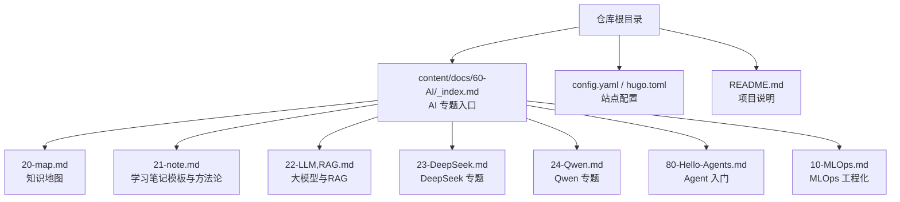
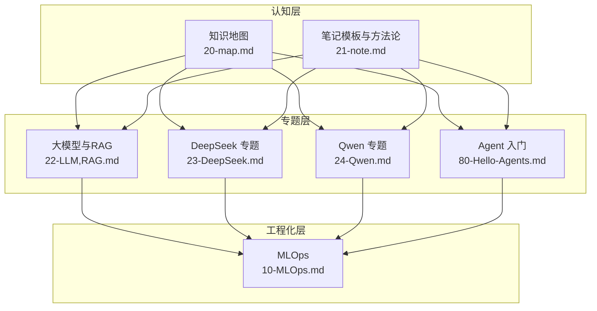
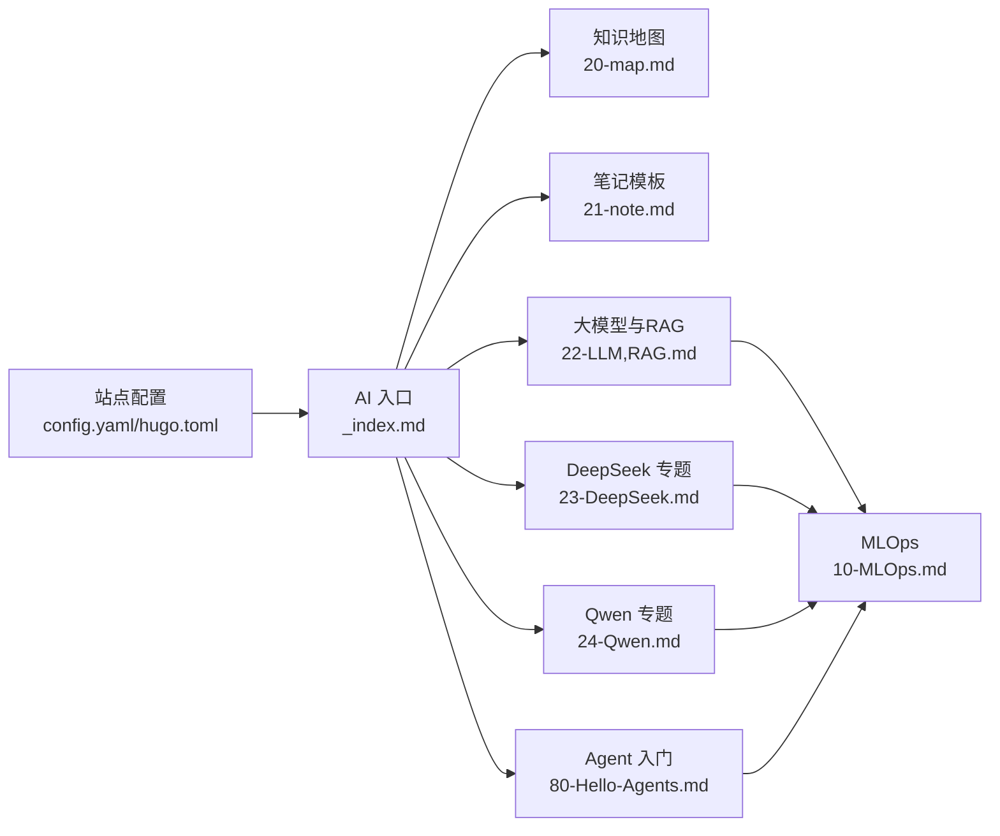

# AI学习资源与笔记

<cite>
**本文引用的文件**   
- [README.md](file://README.md)
- [config.yaml](file://config.yaml)
- [hugo.toml](file://hugo.toml)
- [content/docs/60-AI/_index.md](file://content/docs/60-AI/_index.md)
- [content/docs/60-AI/20-map.md](file://content/docs/60-AI/20-map.md)
- [content/docs/60-AI/21-note.md](file://content/docs/60-AI/21-note.md)
- [content/docs/60-AI/22-LLM,RAG.md](file://content/docs/60-AI/22-LLM,RAG.md)
- [content/docs/60-AI/23-DeepSeek.md](file://content/docs/60-AI/23-DeepSeek.md)
- [content/docs/60-AI/24-Qwen.md](file://content/docs/60-AI/24-Qwen.md)
- [content/docs/60-AI/80-Hello-Agents.md](file://content/docs/60-AI/80-Hello-Agents.md)
- [content/docs/60-AI/10-MLOps.md](file://content/docs/60-AI/10-MLOps.md)
</cite>

## 目录
1. [简介](#简介)
2. [项目结构](#项目结构)
3. [核心组件](#核心组件)
4. [架构总览](#架构总览)
5. [详细组件分析](#详细组件分析)
6. [依赖分析](#依赖分析)
7. [性能考虑](#性能考虑)
8. [故障排查指南](#故障排查指南)
9. [结论](#结论)
10. [附录](#附录)

## 简介
本仓库是一个基于 Hugo 的文档站点，聚焦于“AI学习资源整理”，旨在为不同背景的学习者提供从入门到进阶的系统化学习路径、知识地图、优质资源清单与实践建议。内容涵盖机器学习基础理论、深度学习算法、大模型与检索增强生成（RAG）、Agent 实践、以及 MLOps 工程化能力，帮助学习者构建完整的知识体系并落地实践。

## 项目结构
本项目采用 Hugo Book 主题组织文档，AI相关内容集中在 content/docs/60-AI 目录下，通过章节索引与各子页面形成层级化的学习路径。根级配置文件用于站点元数据与构建参数，README 提供总体说明。

图示来源
- [content/docs/60-AI/_index.md](file://content/docs/60-AI/_index.md)
- [content/docs/60-AI/20-map.md](file://content/docs/60-AI/20-map.md)
- [content/docs/60-AI/21-note.md](file://content/docs/60-AI/21-note.md)
- [content/docs/60-AI/22-LLM,RAG.md](file://content/docs/60-AI/22-LLM,RAG.md)
- [content/docs/60-AI/23-DeepSeek.md](file://content/docs/60-AI/23-DeepSeek.md)
- [content/docs/60-AI/24-Qwen.md](file://content/docs/60-AI/24-Qwen.md)
- [content/docs/60-AI/80-Hello-Agents.md](file://content/docs/60-AI/80-Hello-Agents.md)
- [content/docs/60-AI/10-MLOps.md](file://content/docs/60-AI/10-MLOps.md)
- [config.yaml](file://config.yaml)
- [hugo.toml](file://hugo.toml)
- [README.md](file://README.md)

章节来源
- [README.md](file://README.md)
- [config.yaml](file://config.yaml)
- [hugo.toml](file://hugo.toml)
- [content/docs/60-AI/_index.md](file://content/docs/60-AI/_index.md)

## 核心组件
- 知识地图：以结构化方式梳理 AI 领域关键概念与关系，便于快速定位学习重点。
- 学习笔记模板与方法论：提供可复用的笔记结构与学习方法，帮助建立系统化知识体系。
- 大模型与 RAG：介绍大语言模型的核心思想、应用范式与检索增强生成的实现思路。
- DeepSeek 专题：围绕特定模型的生态、特性与应用场景进行梳理。
- Qwen 专题：围绕另一主流模型的生态、特性与应用场景进行梳理。
- Agent 入门：讲解智能体的基本概念、常见模式与实践路径。
- MLOps：覆盖模型生命周期管理、部署与运维的工程化要点。

章节来源
- [content/docs/60-AI/20-map.md](file://content/docs/60-AI/20-map.md)
- [content/docs/60-AI/21-note.md](file://content/docs/60-AI/21-note.md)
- [content/docs/60-AI/22-LLM,RAG.md](file://content/docs/60-AI/22-LLM,RAG.md)
- [content/docs/60-AI/23-DeepSeek.md](file://content/docs/60-AI/23-DeepSeek.md)
- [content/docs/60-AI/24-Qwen.md](file://content/docs/60-AI/24-Qwen.md)
- [content/docs/60-AI/80-Hello-Agents.md](file://content/docs/60-AI/80-Hello-Agents.md)
- [content/docs/60-AI/10-MLOps.md](file://content/docs/60-AI/10-MLOps.md)

## 架构总览
本项目的“学习架构”由“知识地图—方法论—专题—工程化”四层组成，形成从认知到实践的闭环。

图示来源
- [content/docs/60-AI/20-map.md](file://content/docs/60-AI/20-map.md)
- [content/docs/60-AI/21-note.md](file://content/docs/60-AI/21-note.md)
- [content/docs/60-AI/22-LLM,RAG.md](file://content/docs/60-AI/22-LLM,RAG.md)
- [content/docs/60-AI/23-DeepSeek.md](file://content/docs/60-AI/23-DeepSeek.md)
- [content/docs/60-AI/24-Qwen.md](file://content/docs/60-AI/24-Qwen.md)
- [content/docs/60-AI/80-Hello-Agents.md](file://content/docs/60-AI/80-Hello-Agents.md)
- [content/docs/60-AI/10-MLOps.md](file://content/docs/60-AI/10-MLOps.md)

## 详细组件分析

### 知识地图（20-map）
- 目标：构建 AI 领域的结构化知识图谱，明确概念边界与关联关系，指导学习优先级。
- 适用人群：初学者快速建立全局观；进阶者查漏补缺与横向拓展。
- 使用建议：结合笔记模板将知识点转化为个人知识网络，定期回顾与更新。

章节来源
- [content/docs/60-AI/20-map.md](file://content/docs/60-AI/20-map.md)

### 学习笔记模板与方法论（21-note）
- 目标：提供统一的学习笔记结构与学习方法，提升学习效率与可复用性。
- 推荐结构：学习目标—核心概念—关键公式/流程—示例与练习—常见问题—延伸阅读。
- 方法建议：费曼技巧、间隔重复、主动回忆、以输出驱动输入。

章节来源
- [content/docs/60-AI/21-note.md](file://content/docs/60-AI/21-note.md)

### 大模型与检索增强生成（22-LLM,RAG）
- 目标：理解大语言模型的基本原理与典型应用，掌握 RAG 的设计与实现思路。
- 关键要点：提示工程、上下文窗口、检索策略、向量数据库、评估指标。
- 实践建议：从小型数据集开始，逐步引入检索与重排模块，关注延迟与成本。

章节来源
- [content/docs/60-AI/22-LLM,RAG.md](file://content/docs/60-AI/22-LLM,RAG.md)

### DeepSeek 专题（23-DeepSeek）
- 目标：围绕 DeepSeek 生态，梳理模型特性、工具链与典型应用场景。
- 关注点：模型能力边界、API 与 SDK、部署与优化、社区资源。
- 实践建议：选择代表性任务进行端到端实验，记录对比结果与经验总结。

章节来源
- [content/docs/60-AI/23-DeepSeek.md](file://content/docs/60-AI/23-DeepSeek.md)

### Qwen 专题（24-Qwen）
- 目标：围绕 Qwen 生态，梳理模型特性、工具链与典型应用场景。
- 关注点：多模态能力、长上下文、插件与工具调用、开源生态。
- 实践建议：结合业务数据构建专属助手或知识库问答系统。

章节来源
- [content/docs/60-AI/24-Qwen.md](file://content/docs/60-AI/24-Qwen.md)

### Agent 入门（80-Hello-Agents）
- 目标：介绍智能体的基本概念、常见模式与落地路径。
- 关键要点：规划—记忆—工具—反思；多 Agent 协作；安全与可控性。
- 实践建议：从单 Agent 小任务入手，逐步扩展至多 Agent 工作流。

章节来源
- [content/docs/60-AI/80-Hello-Agents.md](file://content/docs/60-AI/80-Hello-Agents.md)

### MLOps（10-MLOps）
- 目标：覆盖模型全生命周期的工程化能力，包括数据、训练、评估、部署与监控。
- 关键要点：版本控制、流水线编排、容器化、灰度发布、观测与回滚。
- 实践建议：在现有项目中引入最小可行 MLOps 流程，持续迭代完善。

章节来源
- [content/docs/60-AI/10-MLOps.md](file://content/docs/60-AI/10-MLOps.md)

## 依赖分析
- 内容依赖：各专题页面均受“知识地图”与“笔记模板”的指导，形成自上而下的学习约束。
- 工程依赖：MLOps 作为横切能力，贯穿所有专题的实践环节。
- 站点依赖：Hugo 配置与主题决定渲染与导航结构，影响阅读体验与可发现性。

图示来源
- [config.yaml](file://config.yaml)
- [hugo.toml](file://hugo.toml)
- [content/docs/60-AI/_index.md](file://content/docs/60-AI/_index.md)
- [content/docs/60-AI/20-map.md](file://content/docs/60-AI/20-map.md)
- [content/docs/60-AI/21-note.md](file://content/docs/60-AI/21-note.md)
- [content/docs/60-AI/22-LLM,RAG.md](file://content/docs/60-AI/22-LLM,RAG.md)
- [content/docs/60-AI/23-DeepSeek.md](file://content/docs/60-AI/23-DeepSeek.md)
- [content/docs/60-AI/24-Qwen.md](file://content/docs/60-AI/24-Qwen.md)
- [content/docs/60-AI/80-Hello-Agents.md](file://content/docs/60-AI/80-Hello-Agents.md)
- [content/docs/60-AI/10-MLOps.md](file://content/docs/60-AI/10-MLOps.md)

章节来源
- [config.yaml](file://config.yaml)
- [hugo.toml](file://hugo.toml)
- [content/docs/60-AI/_index.md](file://content/docs/60-AI/_index.md)

## 性能考虑
- 内容组织：保持章节粒度适中，避免单页过长导致加载缓慢。
- 图片与多媒体：压缩与懒加载，减少首屏体积。
- 搜索与导航：合理使用标签与分类，提高可发现性与检索效率。
- 增量更新：对高频更新的专题（如模型生态）采用独立页面，降低全站重建成本。

## 故障排查指南
- 构建失败：检查 Hugo 版本与主题兼容性，确认 config.yaml/hugo.toml 语法正确。
- 页面缺失：核对 content/docs/60-AI 下文件名与链接一致性，确保 _index.md 正确引用子页面。
- 渲染异常：清理缓存后重新构建，必要时切换主题版本或调整样式变量。
- 中文显示问题：确认主题 i18n 配置与字体支持，必要时引入中文字体资源。

## 结论
本仓库以“知识地图+方法论+专题+工程化”的结构，构建了面向 AI 学习的完整路径。建议学习者先通读知识地图与笔记模板，再按兴趣选择专题深入，最后借助 MLOps 将所学落地为可运行的工程实践。

## 附录

### 个性化学习路线建议
- 零基础入门：数学与编程基础 → 机器学习基础 → 深度学习入门 → 大模型与 RAG 概览 → 选择一个模型专题（DeepSeek/Qwen）→ 完成一个小型 Agent 任务 → 引入 MLOps 基础。
- 有工程背景：直接切入大模型与 RAG → 选择模型专题 → 搭建端到端应用 → 引入 MLOps 流水线与监控。
- 研究导向：精读前沿论文与开源实现 → 复现实验 → 在专题基础上提出改进方案 → 撰写技术报告与博客。

### 实践项目建议
- 基于 RAG 的知识库问答系统（结合向量检索与重排）。
- 面向垂直领域的智能助手（结合工具调用与多轮对话）。
- 模型微调与评测流水线（数据清洗、训练、评估、部署一体化）。

### 竞赛平台与实习机会
- 竞赛平台：Kaggle、天池、DataFountain、和鲸等。
- 实习机会：关注头部互联网公司与 AI 初创企业的校招与社招公告，优先选择具备完善数据与算力基础设施的团队。