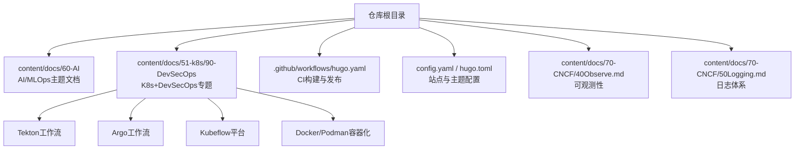
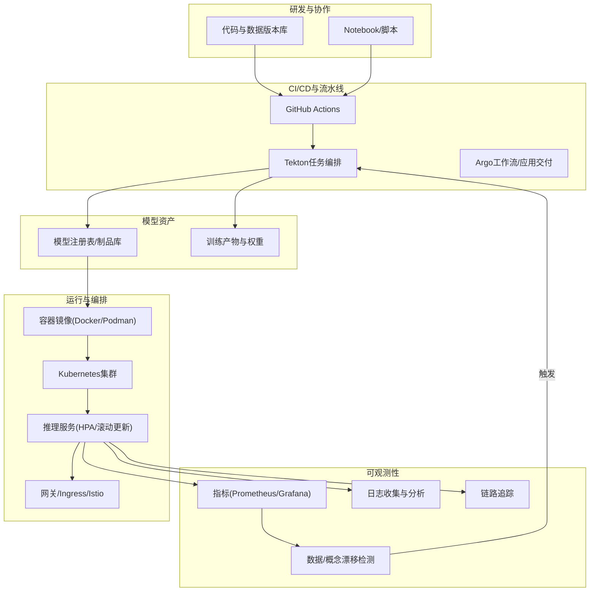
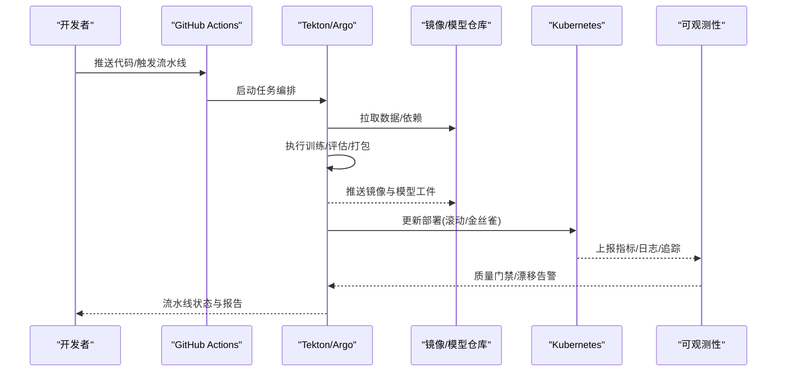
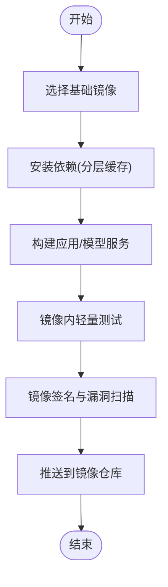
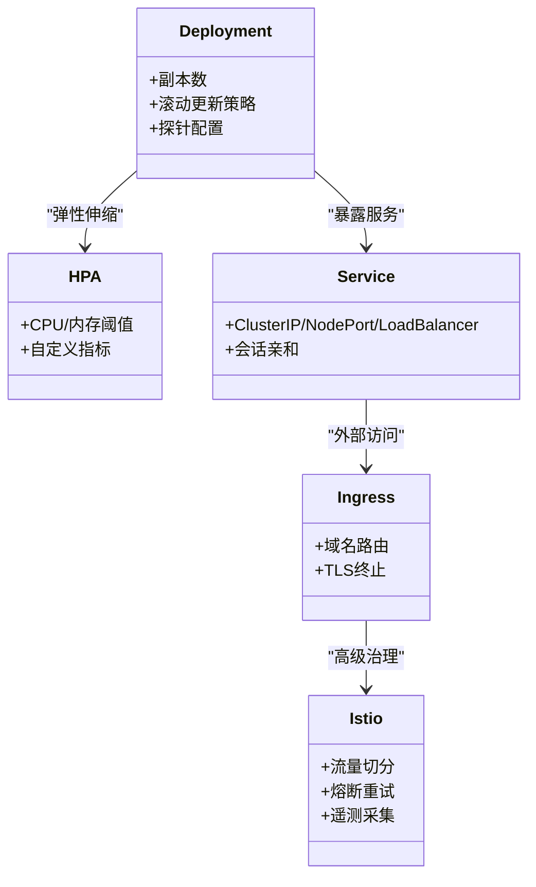
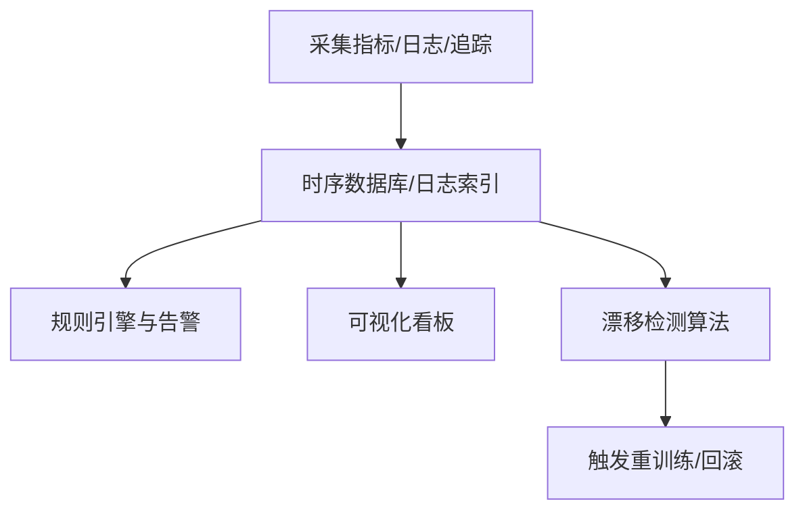
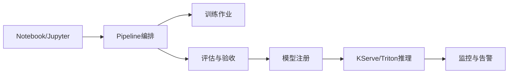
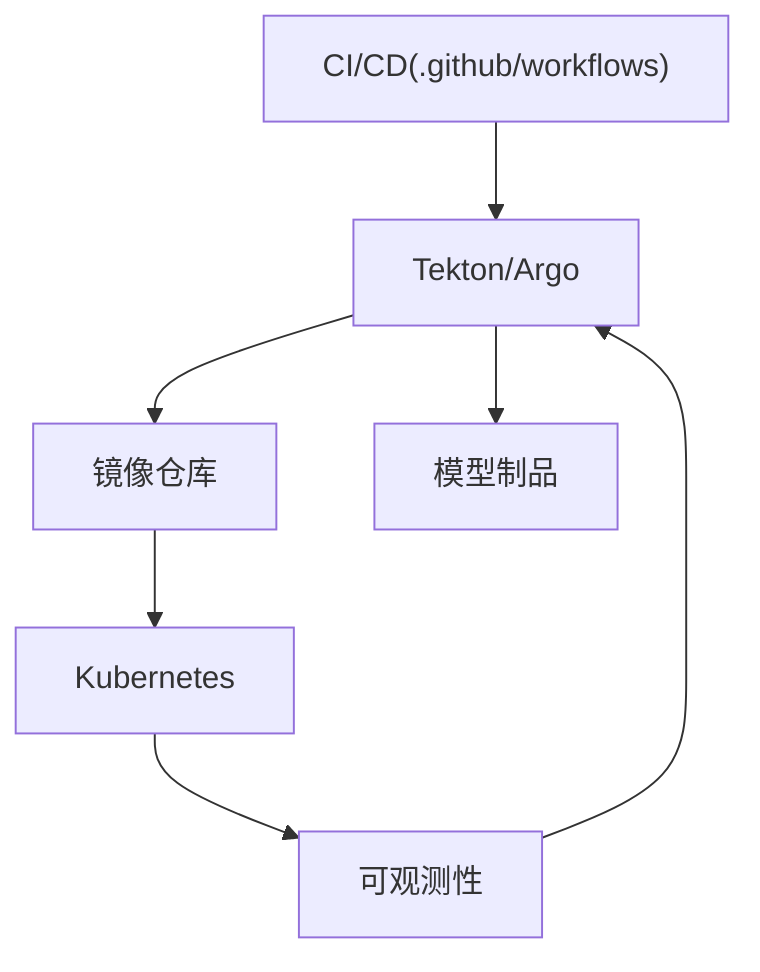

# MLOps实践指南

<cite>
**本文引用的文件**   
- [README.md](file://README.md)
- [config.yaml](file://config.yaml)
- [hugo.toml](file://hugo.toml)
- [.github/workflows/hugo.yaml](file://.github/workflows/hugo.yaml)
- [content/docs/60-AI/10-MLOps.md](file://content/docs/60-AI/10-MLOps.md)
- [content/docs/51-k8s/90-DevSecOps/_index.md](file://content/docs/51-k8s/90-DevSecOps/_index.md)
- [content/docs/51-k8s/90-DevSecOps/51-Tekton.md](file://content/docs/51-k8s/90-DevSecOps/51-Tekton.md)
- [content/docs/51-k8s/90-DevSecOps/52-Argo.md](file://content/docs/51-k8s/90-DevSecOps/52-Argo.md)
- [content/docs/51-k8s/90-DevSecOps/80-Kubeflow.md](file://content/docs/51-k8s/90-DevSecOps/80-Kubeflow.md)
- [content/docs/51-k8s/104-docker.md](file://content/docs/51-k8s/104-docker.md)
- [content/docs/51-k8s/103-Podman.md](file://content/docs/51-k8s/103-Podman.md)
- [content/docs/70-CNCF/40Observe.md](file://content/docs/70-CNCF/40Observe.md)
- [content/docs/70-CNCF/50Logging.md](file://content/docs/70-CNCF/50Logging.md)
</cite>

## 目录
1. [简介](#简介)
2. [项目结构](#项目结构)
3. [核心组件](#核心组件)
4. [架构总览](#架构总览)
5. [详细组件分析](#详细组件分析)
6. [依赖分析](#依赖分析)
7. [性能考虑](#性能考虑)
8. [故障排查指南](#故障排查指南)
9. [结论](#结论)
10. [附录](#附录)

## 简介
本指南面向希望在生产环境中落地机器学习运维（MLOps）的团队，围绕“数据版本化—实验追踪—自动化测试—持续集成—容器化部署—编排与发布—监控与回滚—重训练触发”的完整流水线展开。结合仓库中关于Kubernetes、CI/CD、容器化与可观测性的内容，提供从概念到落地的系统性方案，帮助构建可扩展、可观测、可治理的云原生ML平台。

## 项目结构
仓库采用Hugo静态站点组织文档，AI与MLOps相关内容集中在 docs/60-AI 与 docs/51-k8s/90-DevSecOps 等目录；CI/CD通过GitHub Actions在 .github/workflows 下定义；站点配置位于根目录的配置文件。

图表来源
- [content/docs/60-AI/10-MLOps.md](file://content/docs/60-AI/10-MLOps.md)
- [content/docs/51-k8s/90-DevSecOps/_index.md](file://content/docs/51-k8s/90-DevSecOps/_index.md)
- [.github/workflows/hugo.yaml](file://.github/workflows/hugo.yaml)
- [config.yaml](file://config.yaml)
- [hugo.toml](file://hugo.toml)

章节来源
- [README.md](file://README.md)
- [config.yaml](file://config.yaml)
- [hugo.toml](file://hugo.toml)
- [.github/workflows/hugo.yaml](file://.github/workflows/hugo.yaml)

## 核心组件
- 模型开发：以Notebook/脚本为入口，强调数据与代码的版本化、实验元数据记录与结果可复现。
- 训练流水线：将数据处理、特征工程、训练、评估封装为可重复执行的任务，支持分布式与弹性扩缩容。
- 模型注册与版本管理：对模型工件进行唯一标识、元数据沉淀与策略准入控制。
- CI/CD：代码提交触发自动化测试、镜像构建、制品归档与部署流水线。
- 容器化与编排：使用容器打包推理服务，借助Kubernetes实现高可用、弹性伸缩与滚动更新。
- 发布与流量治理：A/B测试、灰度发布、金丝雀发布与快速回滚。
- 监控与告警：指标、日志、链路追踪三位一体，覆盖数据漂移、模型退化与系统健康。
- 自动重训练：基于阈值或事件驱动的策略，触发再训练并进入审批与发布流程。

章节来源
- [content/docs/60-AI/10-MLOps.md](file://content/docs/60-AI/10-MLOps.md)
- [content/docs/51-k8s/90-DevSecOps/51-Tekton.md](file://content/docs/51-k8s/90-DevSecOps/51-Tekton.md)
- [content/docs/51-k8s/90-DevSecOps/52-Argo.md](file://content/docs/51-k8s/90-DevSecOps/52-Argo.md)
- [content/docs/51-k8s/90-DevSecOps/80-Kubeflow.md](file://content/docs/51-k8s/90-DevSecOps/80-Kubeflow.md)
- [content/docs/51-k8s/104-docker.md](file://content/docs/51-k8s/104-docker.md)
- [content/docs/51-k8s/103-Podman.md](file://content/docs/51-k8s/103-Podman.md)
- [content/docs/70-CNCF/40Observe.md](file://content/docs/70-CNCF/40Observe.md)
- [content/docs/70-CNCF/50Logging.md](file://content/docs/70-CNCF/50Logging.md)

## 架构总览
下图展示云原生ML平台的端到端架构：从数据与代码入库，到CI/CD流水线、模型注册、容器化推理、K8s编排与发布治理，再到可观测性与自动重训练闭环。

图表来源
- [.github/workflows/hugo.yaml](file://.github/workflows/hugo.yaml)
- [content/docs/51-k8s/90-DevSecOps/51-Tekton.md](file://content/docs/51-k8s/90-DevSecOps/51-Tekton.md)
- [content/docs/51-k8s/90-DevSecOps/52-Argo.md](file://content/docs/51-k8s/90-DevSecOps/52-Argo.md)
- [content/docs/51-k8s/104-docker.md](file://content/docs/51-k8s/104-docker.md)
- [content/docs/51-k8s/103-Podman.md](file://content/docs/51-k8s/103-Podman.md)
- [content/docs/70-CNCF/40Observe.md](file://content/docs/70-CNCF/40Observe.md)
- [content/docs/70-CNCF/50Logging.md](file://content/docs/70-CNCF/50Logging.md)

## 详细组件分析

### 组件一：CI/CD流水线（GitHub Actions + Tekton/Argo）
- 触发条件：代码提交、标签发布、定时任务或外部事件。
- 阶段划分：
  - 代码检查与单测
  - 数据/模型制品校验
  - 容器镜像构建与签名
  - 部署到目标环境（预发/生产）
  - 冒烟测试与回归验证
- 关键工件：镜像、模型权重、配置清单、变更审计日志。

图表来源
- [.github/workflows/hugo.yaml](file://.github/workflows/hugo.yaml)
- [content/docs/51-k8s/90-DevSecOps/51-Tekton.md](file://content/docs/51-k8s/90-DevSecOps/51-Tekton.md)
- [content/docs/51-k8s/90-DevSecOps/52-Argo.md](file://content/docs/51-k8s/90-DevSecOps/52-Argo.md)

章节来源
- [.github/workflows/hugo.yaml](file://.github/workflows/hugo.yaml)
- [content/docs/51-k8s/90-DevSecOps/51-Tekton.md](file://content/docs/51-k8s/90-DevSecOps/51-Tekton.md)
- [content/docs/51-k8s/90-DevSecOps/52-Argo.md](file://content/docs/51-k8s/90-DevSecOps/52-Argo.md)

### 组件二：容器化与镜像优化（Docker/Podman）
- 多阶段构建：分离依赖安装、编译与运行层，减小镜像体积。
- 安全加固：最小权限运行、非root用户、只读文件系统、密钥注入。
- 缓存与增量构建：利用层缓存提升构建速度。
- 镜像签名与扫描：确保供应链安全。

图表来源
- [content/docs/51-k8s/104-docker.md](file://content/docs/51-k8s/104-docker.md)
- [content/docs/51-k8s/103-Podman.md](file://content/docs/51-k8s/103-Podman.md)

章节来源
- [content/docs/51-k8s/104-docker.md](file://content/docs/51-k8s/104-docker.md)
- [content/docs/51-k8s/103-Podman.md](file://content/docs/51-k8s/103-Podman.md)

### 组件三：Kubernetes编排与服务治理
- 资源管理：Deployment/StatefulSet/HPA/VPA，按QoS与优先级调度。
- 发布策略：滚动更新、蓝绿/金丝雀、灰度放量与快速回滚。
- 网络与安全：Service/Ingress/Istio流量治理、mTLS、RBAC。
- 存储与持久化：PVC/CSI用于模型权重与中间产物。

图表来源
- [content/docs/51-k8s/90-DevSecOps/_index.md](file://content/docs/51-k8s/90-DevSecOps/_index.md)

章节来源
- [content/docs/51-k8s/90-DevSecOps/_index.md](file://content/docs/51-k8s/90-DevSecOps/_index.md)

### 组件四：可观测性与告警（指标/日志/追踪/漂移）
- 指标：请求延迟、吞吐、错误率、GPU/CPU利用率、队列长度。
- 日志：结构化日志、统一采集、检索与关联。
- 追踪：跨服务调用链、推理耗时分解。
- 漂移检测：输入分布变化、概念漂移、业务指标异常。

图表来源
- [content/docs/70-CNCF/40Observe.md](file://content/docs/70-CNCF/40Observe.md)
- [content/docs/70-CNCF/50Logging.md](file://content/docs/70-CNCF/50Logging.md)

章节来源
- [content/docs/70-CNCF/40Observe.md](file://content/docs/70-CNCF/40Observe.md)
- [content/docs/70-CNCF/50Logging.md](file://content/docs/70-CNCF/50Logging.md)

### 组件五：Kubeflow与云原生ML平台
- 组件协同：Notebook/Jupyter、Pipeline、Katib超参搜索、KServe/Triton推理、Model Registry。
- 工作负载：GPU节点池、抢占式实例、作业隔离与配额。
- 治理：命名空间、RBAC、网络策略、审计日志。

图表来源
- [content/docs/51-k8s/90-DevSecOps/80-Kubeflow.md](file://content/docs/51-k8s/90-DevSecOps/80-Kubeflow.md)

章节来源
- [content/docs/51-k8s/90-DevSecOps/80-Kubeflow.md](file://content/docs/51-k8s/90-DevSecOps/80-Kubeflow.md)

## 依赖分析
- 组件耦合：
  - CI/CD与流水线编排强耦合，需保证幂等与可重试。
  - 容器镜像与K8s部署清单需版本一致，避免漂移。
  - 可观测性贯穿全链路，是触发重训练与回滚的关键依据。
- 外部依赖：
  - 代码/制品仓库、镜像仓库、对象存储、消息总线、监控栈。
- 潜在风险：
  - 循环依赖（如监控触发流水线，流水线又写入监控）需解耦。
  - 大模型/大数据集导致构建与传输瓶颈，需分层缓存与增量构建。

图表来源
- [.github/workflows/hugo.yaml](file://.github/workflows/hugo.yaml)
- [content/docs/51-k8s/90-DevSecOps/51-Tekton.md](file://content/docs/51-k8s/90-DevSecOps/51-Tekton.md)
- [content/docs/51-k8s/90-DevSecOps/52-Argo.md](file://content/docs/51-k8s/90-DevSecOps/52-Argo.md)
- [content/docs/70-CNCF/40Observe.md](file://content/docs/70-CNCF/40Observe.md)

章节来源
- [.github/workflows/hugo.yaml](file://.github/workflows/hugo.yaml)
- [content/docs/51-k8s/90-DevSecOps/51-Tekton.md](file://content/docs/51-k8s/90-DevSecOps/51-Tekton.md)
- [content/docs/51-k8s/90-DevSecOps/52-Argo.md](file://content/docs/51-k8s/90-DevSecOps/52-Argo.md)
- [content/docs/70-CNCF/40Observe.md](file://content/docs/70-CNCF/40Observe.md)

## 性能考虑
- 构建与分发：
  - 镜像分层缓存、并行构建、按需拉取依赖。
  - 使用镜像加速与就近拉取，降低带宽与时延。
- 训练与推理：
  - GPU/CPU资源隔离与超分，合理设置requests/limits。
  - 批处理与动态批大小，减少尾延迟。
- 弹性与成本：
  - HPA/VPA根据指标自动扩缩容。
  - 抢占式实例与Spot节点降低成本。
- 可观测开销：
  - 采样与聚合，避免过度采集影响性能。

[本节为通用指导，不直接分析具体文件]

## 故障排查指南
- 常见问题定位：
  - 流水线失败：查看步骤日志、环境变量与凭据挂载。
  - 镜像构建慢：检查缓存命中、依赖下载源与并行度。
  - 部署失败：核对资源配额、镜像可达性与探针状态。
  - 推理异常：检查输入格式、依赖库版本与模型路径。
  - 漂移告警：确认数据管道一致性、时间窗口与阈值。
- 建议工具与流程：
  - 集中日志与链路追踪，建立问题回溯能力。
  - 建立标准Runbook与演练机制，缩短MTTR。

章节来源
- [content/docs/70-CNCF/40Observe.md](file://content/docs/70-CNCF/40Observe.md)
- [content/docs/70-CNCF/50Logging.md](file://content/docs/70-CNCF/50Logging.md)

## 结论
通过将数据与代码版本化、流水线自动化、容器化与编排标准化、以及可观测性与自动重训练闭环，团队可以构建稳定高效的云原生ML平台。建议在演进过程中逐步引入Kubeflow、Istio与完善的监控告警体系，并以灰度发布与回滚策略保障线上稳定性。

[本节为总结性内容，不直接分析具体文件]

## 附录
- 术语速查：
  - CI/CD：持续集成/持续交付
  - HPA/VPA：水平/垂直Pod自动扩缩容
  - A/B测试/灰度发布：流量切分与渐进式上线
  - 数据漂移/概念漂移：输入分布或目标关系变化
- 参考路径：
  - MLOps概览：[content/docs/60-AI/10-MLOps.md](file://content/docs/60-AI/10-MLOps.md)
  - 容器化：[content/docs/51-k8s/104-docker.md](file://content/docs/51-k8s/104-docker.md)、[content/docs/51-k8s/103-Podman.md](file://content/docs/51-k8s/103-Podman.md)
  - 编排与发布：[content/docs/51-k8s/90-DevSecOps/51-Tekton.md](file://content/docs/51-k8s/90-DevSecOps/51-Tekton.md)、[content/docs/51-k8s/90-DevSecOps/52-Argo.md](file://content/docs/51-k8s/90-DevSecOps/52-Argo.md)、[content/docs/51-k8s/90-DevSecOps/80-Kubeflow.md](file://content/docs/51-k8s/90-DevSecOps/80-Kubeflow.md)
  - 可观测性：[content/docs/70-CNCF/40Observe.md](file://content/docs/70-CNCF/40Observe.md)、[content/docs/70-CNCF/50Logging.md](file://content/docs/70-CNCF/50Logging.md)