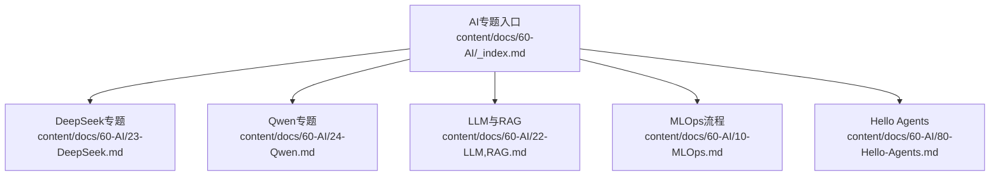
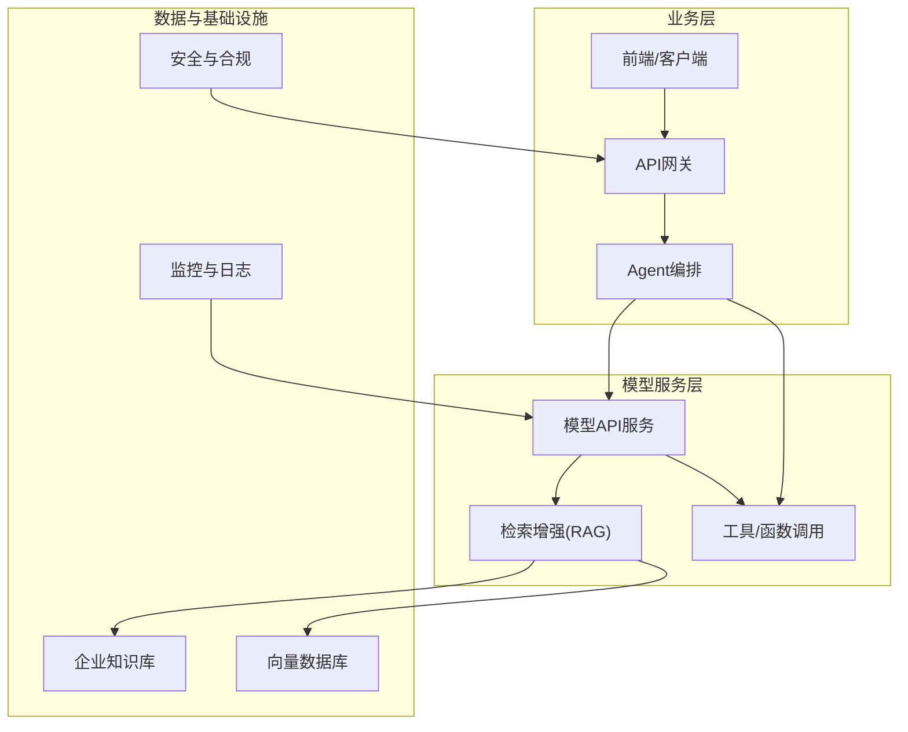
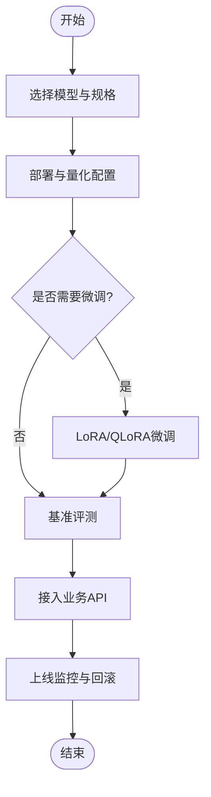
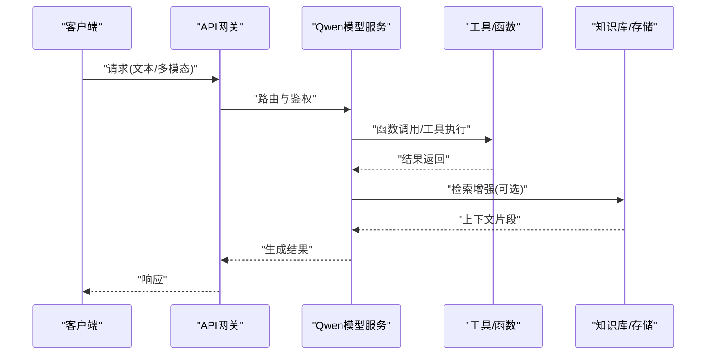
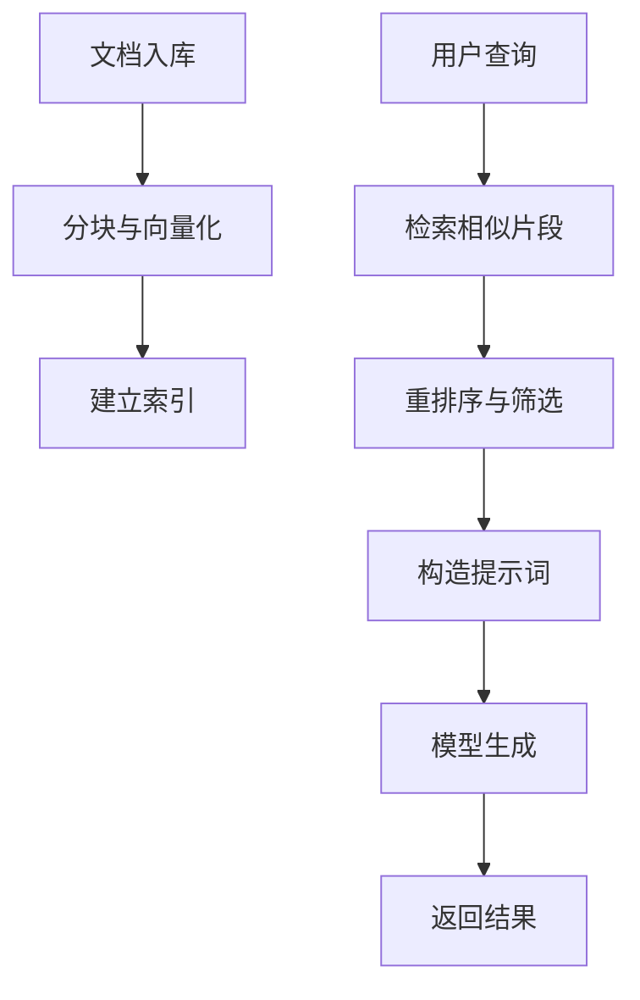
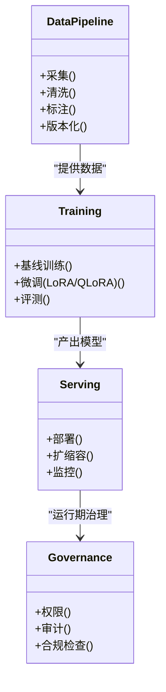
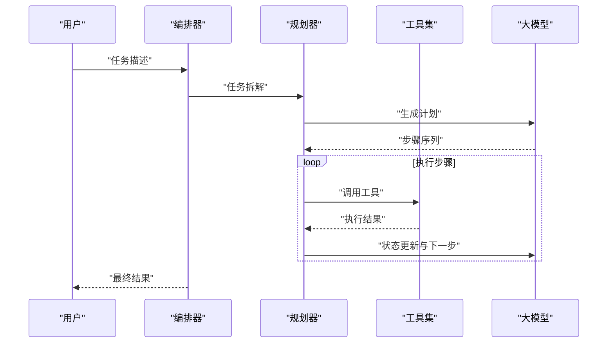
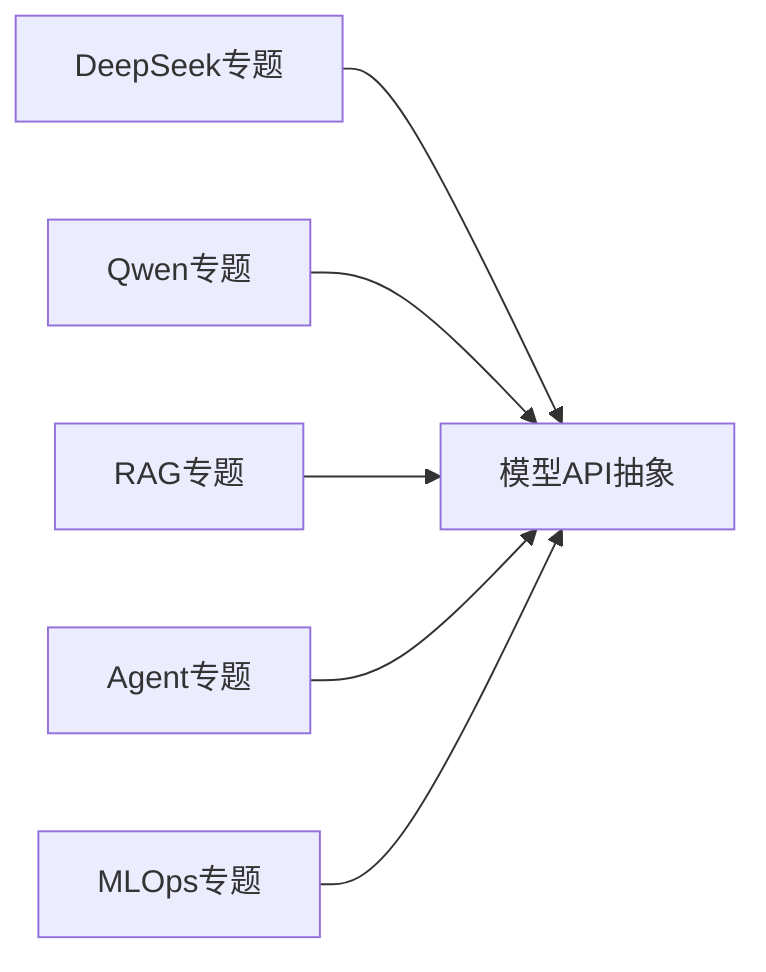

# 主流大模型应用

<cite>
**本文引用的文件**   
- [content/docs/60-AI/_index.md](file://content/docs/60-AI/_index.md)
- [content/docs/60-AI/23-DeepSeek.md](file://content/docs/60-AI/23-DeepSeek.md)
- [content/docs/60-AI/24-Qwen.md](file://content/docs/60-AI/24-Qwen.md)
- [content/docs/60-AI/22-LLM,RAG.md](file://content/docs/60-AI/22-LLM,RAG.md)
- [content/docs/60-AI/10-MLOps.md](file://content/docs/60-AI/10-MLOps.md)
- [content/docs/60-AI/80-Hello-Agents.md](file://content/docs/60-AI/80-Hello-Agents.md)
</cite>

## 目录
1. [简介](#简介)
2. [项目结构](#项目结构)
3. [核心组件](#核心组件)
4. [架构总览](#架构总览)
5. [详细组件分析](#详细组件分析)
6. [依赖分析](#依赖分析)
7. [性能考虑](#性能考虑)
8. [故障排查指南](#故障排查指南)
9. [结论](#结论)
10. [附录](#附录)

## 简介
本实践文档面向企业级AI应用落地，聚焦国产主流大模型（以DeepSeek、Qwen为代表）的能力对比、API调用范式、本地部署与推理优化、参数高效微调（LoRA/QLoRA）、以及安全合规与企业集成最佳实践。文档结合仓库中AI相关章节内容，提供从选型到落地的完整路径，帮助读者快速构建智能化企业应用。

## 项目结构
仓库采用Hugo静态站点组织文档，AI相关内容集中在 content/docs/60-AI 目录下，涵盖模型概览、RAG方案、MLOps流程、Agent入门等主题。

图表来源
- [content/docs/60-AI/_index.md](file://content/docs/60-AI/_index.md)
- [content/docs/60-AI/23-DeepSeek.md](file://content/docs/60-AI/23-DeepSeek.md)
- [content/docs/60-AI/24-Qwen.md](file://content/docs/60-AI/24-Qwen.md)
- [content/docs/60-AI/22-LLM,RAG.md](file://content/docs/60-AI/22-LLM,RAG.md)
- [content/docs/60-AI/10-MLOps.md](file://content/docs/60-AI/10-MLOps.md)
- [content/docs/60-AI/80-Hello-Agents.md](file://content/docs/60-AI/80-Hello-Agents.md)

章节来源
- [content/docs/60-AI/_index.md](file://content/docs/60-AI/_index.md)

## 核心组件
- DeepSeek专题：围绕DeepSeek系列模型的特点、能力边界与典型应用场景展开，便于在代码理解、长上下文、函数调用等方向进行选型评估。
- Qwen专题：围绕Qwen系列模型的多模态、中文生态、工具调用与工程化落地经验进行梳理。
- LLM与RAG：讲解检索增强生成在企业知识库问答、文档摘要、智能客服等场景的架构与实践要点。
- MLOps：覆盖模型版本管理、数据流水线、训练与评测、部署监控与回滚等全生命周期实践。
- Hello Agents：介绍Agent基础概念、任务编排与工具调用的入门路径，为复杂业务自动化提供思路。

章节来源
- [content/docs/60-AI/23-DeepSeek.md](file://content/docs/60-AI/23-DeepSeek.md)
- [content/docs/60-AI/24-Qwen.md](file://content/docs/60-AI/24-Qwen.md)
- [content/docs/60-AI/22-LLM,RAG.md](file://content/docs/60-AI/22-LLM,RAG.md)
- [content/docs/60-AI/10-MLOps.md](file://content/docs/60-AI/10-MLOps.md)
- [content/docs/60-AI/80-Hello-Agents.md](file://content/docs/60-AI/80-Hello-Agents.md)

## 架构总览
下图展示“企业智能应用”的典型分层：上层为业务系统与Agent编排，中层为大模型服务（云端或本地），底层为向量数据库、工具与外部系统。RAG将企业知识注入模型输出，MLOps保障模型持续演进与稳定交付。

图表来源
- [content/docs/60-AI/22-LLM,RAG.md](file://content/docs/60-AI/22-LLM,RAG.md)
- [content/docs/60-AI/80-Hello-Agents.md](file://content/docs/60-AI/80-Hello-Agents.md)
- [content/docs/60-AI/10-MLOps.md](file://content/docs/60-AI/10-MLOps.md)

## 详细组件分析

### DeepSeek专题分析
- 能力与适用场景：围绕代码理解、长上下文、函数调用等方向进行能力说明与场景匹配建议。
- API调用范式：文本生成、结构化输出、函数调用等常见接口模式与注意事项。
- 本地部署与优化：量化策略、显存优化与推理加速的关键点。
- 微调与评测：LoRA/QLoRA在垂直领域的适配方法与评测指标设计。

图表来源
- [content/docs/60-AI/23-DeepSeek.md](file://content/docs/60-AI/23-DeepSeek.md)
- [content/docs/60-AI/10-MLOps.md](file://content/docs/60-AI/10-MLOps.md)

章节来源
- [content/docs/60-AI/23-DeepSeek.md](file://content/docs/60-AI/23-DeepSeek.md)

### Qwen专题分析
- 多模态与中文生态：图像、表格、文档等多模态输入处理与中文语料优势。
- 工具与函数调用：在业务系统中对接外部API、数据库查询与计算工具的实践。
- 工程化落地：高并发、低延迟、可观测性与成本优化的综合方案。
- 安全合规：内容过滤、版权保护与审计留痕的企业级要求。

图表来源
- [content/docs/60-AI/24-Qwen.md](file://content/docs/60-AI/24-Qwen.md)
- [content/docs/60-AI/22-LLM,RAG.md](file://content/docs/60-AI/22-LLM,RAG.md)

章节来源
- [content/docs/60-AI/24-Qwen.md](file://content/docs/60-AI/24-Qwen.md)

### LLM与RAG专题分析
- 架构要点：检索器、索引器、重排序与生成器的协同工作流。
- 数据治理：文档清洗、分块策略、元数据标注与版本管理。
- 评测体系：召回率、准确率、幻觉率与端到端业务指标。
- 生产实践：缓存、批处理、异步与降级策略。

图表来源
- [content/docs/60-AI/22-LLM,RAG.md](file://content/docs/60-AI/22-LLM,RAG.md)

章节来源
- [content/docs/60-AI/22-LLM,RAG.md](file://content/docs/60-AI/22-LLM,RAG.md)

### MLOps专题分析
- 数据与实验管理：数据集版本、特征工程、实验追踪与复现。
- 训练与微调：分布式训练、超参搜索、LoRA/QLoRA流水线。
- 部署与监控：灰度发布、A/B测试、性能与质量监控、自动回滚。
- 安全与合规：权限控制、审计日志、敏感信息脱敏与合规检查。

图表来源
- [content/docs/60-AI/10-MLOps.md](file://content/docs/60-AI/10-MLOps.md)

章节来源
- [content/docs/60-AI/10-MLOps.md](file://content/docs/60-AI/10-MLOps.md)

### Hello Agents专题分析
- Agent基础：目标分解、记忆、规划与工具使用。
- 编排模式：单Agent、多Agent协作与人类在环。
- 工具集成：函数调用、API封装、错误重试与幂等性。
- 安全边界：权限最小化、输入校验与输出审查。

图表来源
- [content/docs/60-AI/80-Hello-Agents.md](file://content/docs/60-AI/80-Hello-Agents.md)

章节来源
- [content/docs/60-AI/80-Hello-Agents.md](file://content/docs/60-AI/80-Hello-Agents.md)

## 依赖分析
- 模块内聚与耦合：各专题相对独立，通过统一入口聚合；RAG与Agent对模型服务存在较强依赖。
- 外部依赖：向量数据库、对象存储、消息队列与监控系统在生产环境中常见。
- 潜在循环依赖：应避免在编排层直接反向依赖具体模型实现，保持抽象接口。

图表来源
- [content/docs/60-AI/23-DeepSeek.md](file://content/docs/60-AI/23-DeepSeek.md)
- [content/docs/60-AI/24-Qwen.md](file://content/docs/60-AI/24-Qwen.md)
- [content/docs/60-AI/22-LLM,RAG.md](file://content/docs/60-AI/22-LLM,RAG.md)
- [content/docs/60-AI/80-Hello-Agents.md](file://content/docs/60-AI/80-Hello-Agents.md)
- [content/docs/60-AI/10-MLOps.md](file://content/docs/60-AI/10-MLOps.md)

章节来源
- [content/docs/60-AI/_index.md](file://content/docs/60-AI/_index.md)

## 性能考虑
- 模型侧：合理选择模型规模与精度，启用KV Cache、连续批处理与张量并行。
- 推理侧：GPU内存优化、动态批与早退策略、CPU/GPU混合推理。
- 系统侧：连接池、限流熔断、缓存命中与异步流水线。
- 成本侧：冷热分离、按需扩缩容与资源配额管理。

[本节为通用指导，不直接分析具体文件]

## 故障排查指南
- 常见问题定位：超时、OOM、Token限制、格式错误与工具调用失败。
- 日志与追踪：链路ID、关键节点耗时与错误码沉淀。
- 回滚与降级：模型版本切换、默认规则兜底与只读模式。
- 安全事件：越权访问、注入攻击与敏感信息泄露的处置流程。

章节来源
- [content/docs/60-AI/10-MLOps.md](file://content/docs/60-AI/10-MLOps.md)

## 结论
通过系统化地掌握DeepSeek与Qwen等国产大模型的能力差异与工程化方法，结合RAG、Agent与MLOps实践，企业可在保证安全合规的前提下，快速构建高性能、可扩展的智能应用。建议在真实业务中优先完成数据治理与评测体系建设，再逐步推进模型微调与规模化部署。

[本节为总结性内容，不直接分析具体文件]

## 附录
- 术语表：RAG、LoRA、QLoRA、Agent、KV Cache、连续批处理等。
- 参考链接：各专题文档入口与延伸阅读。

[本节为补充信息，不直接分析具体文件]