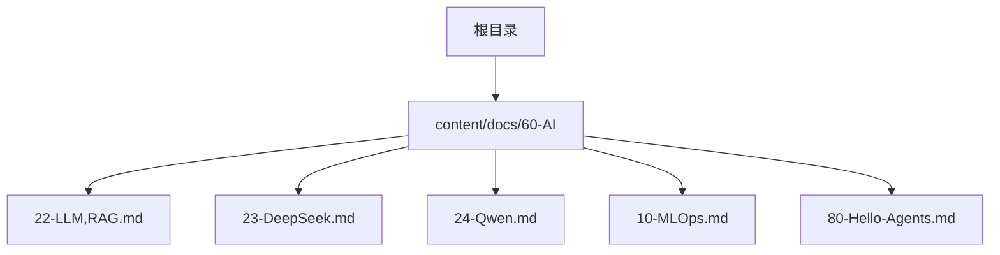
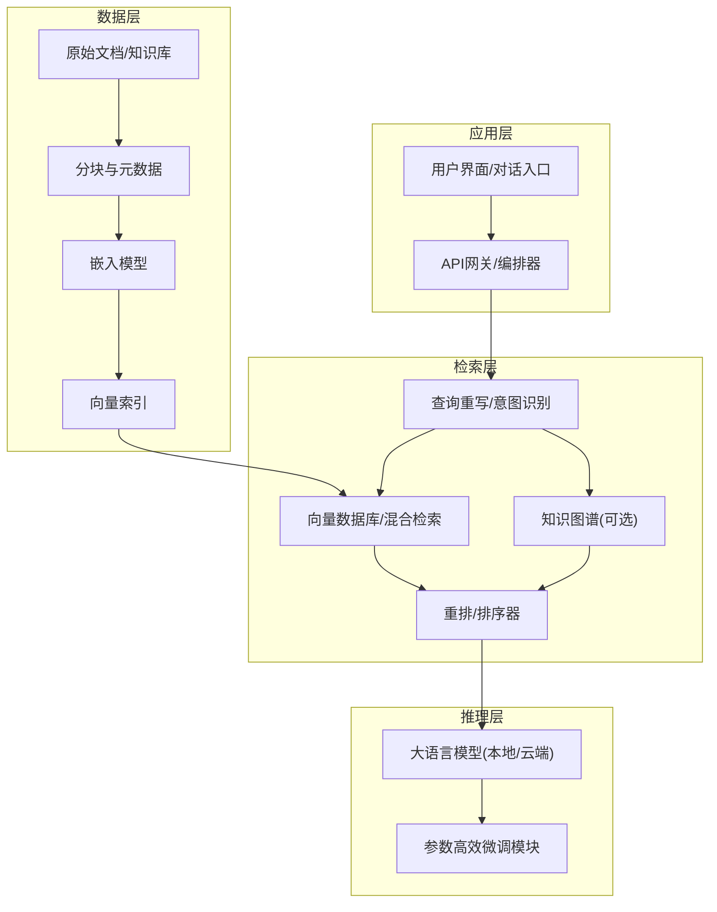
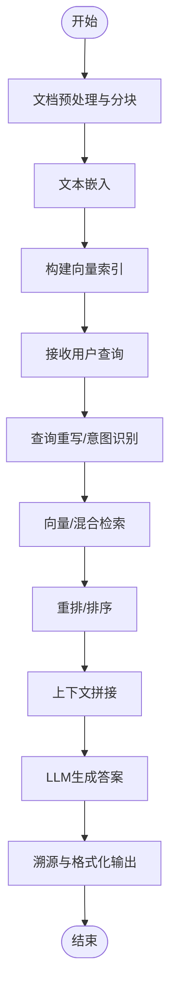
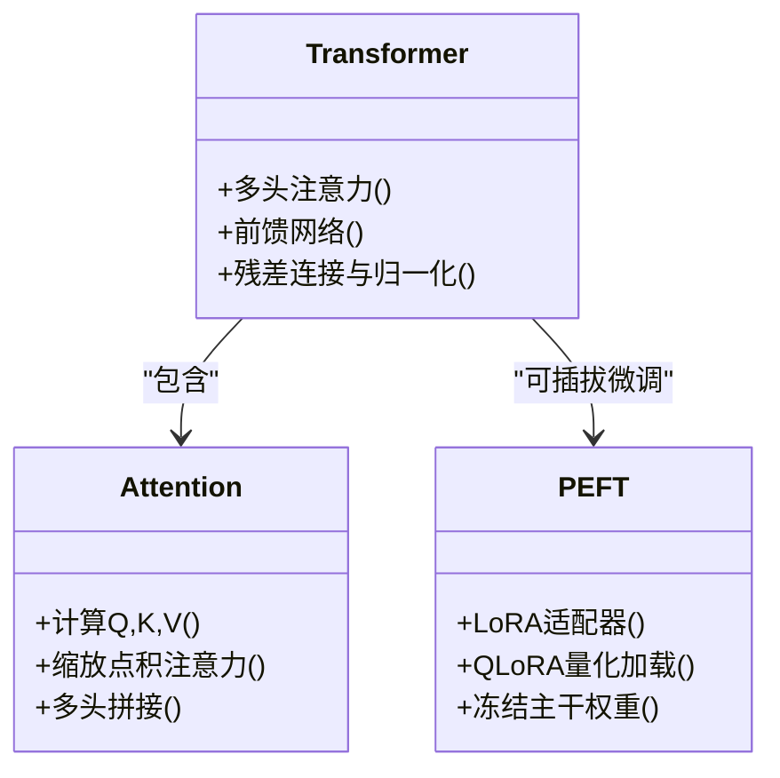
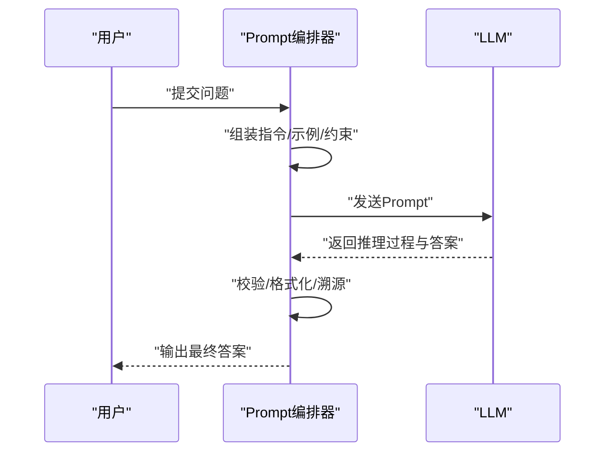
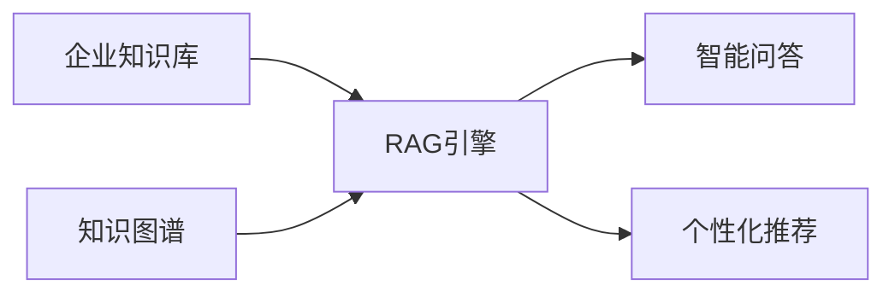
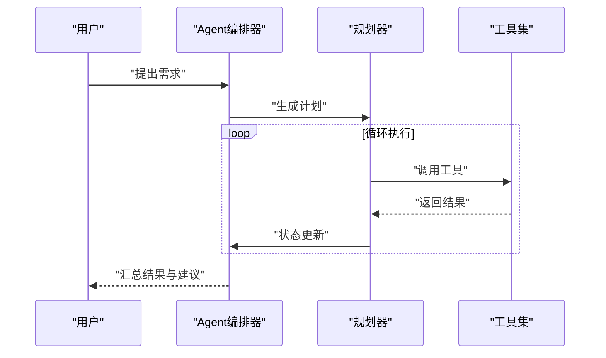
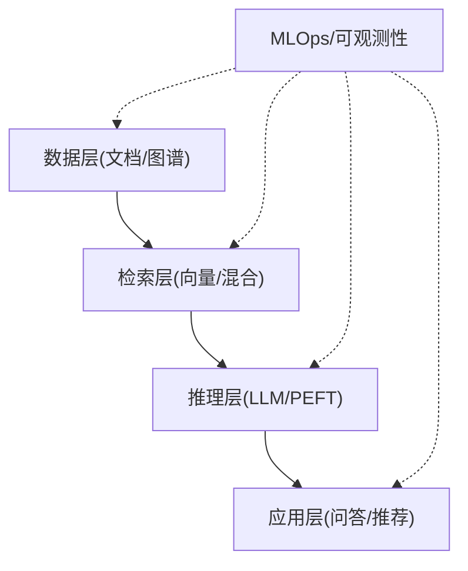

# 大语言模型与RAG技术

<cite>
**本文引用的文件**   
- [22-LLM,RAG.md](file://content/docs/60-AI/22-LLM,RAG.md)
- [23-DeepSeek.md](file://content/docs/60-AI/23-DeepSeek.md)
- [24-Qwen.md](file://content/docs/60-AI/24-Qwen.md)
- [10-MLOps.md](file://content/docs/60-AI/10-MLOps.md)
- [80-Hello-Agents.md](file://content/docs/60-AI/80-Hello-Agents.md)
</cite>

## 目录
1. [引言](#引言)
2. [项目结构](#项目结构)
3. [核心组件](#核心组件)
4. [架构总览](#架构总览)
5. [详细组件分析](#详细组件分析)
6. [依赖分析](#依赖分析)
7. [性能考虑](#性能考虑)
8. [故障排查指南](#故障排查指南)
9. [结论](#结论)
10. [附录](#附录)

## 引言
本技术文档围绕大语言模型（LLM）与检索增强生成（RAG）展开，结合仓库中AI相关文档，系统阐述RAG的核心原理、主流大模型架构要点、端到端实现路径、Prompt工程技巧、以及企业级落地实践。内容覆盖向量数据库选型、文本嵌入、相似度搜索、上下文拼接策略、查询优化与结果排序；同时给出性能调优、缓存策略与成本控制建议，帮助读者在企业环境中构建智能问答、知识图谱增强与个性化推荐服务。

## 项目结构
仓库采用Hugo静态站点组织内容，AI主题集中在 content/docs/60-AI 目录下，包含RAG、主流模型、Agent等专题文章。该结构便于按主题快速定位资料，适合用于构建知识库或内部Wiki。

图表来源
- [22-LLM,RAG.md](file://content/docs/60-AI/22-LLM,RAG.md)
- [23-DeepSeek.md](file://content/docs/60-AI/23-DeepSeek.md)
- [24-Qwen.md](file://content/docs/60-AI/24-Qwen.md)
- [10-MLOps.md](file://content/docs/60-AI/10-MLOps.md)
- [80-Hello-Agents.md](file://content/docs/60-AI/80-Hello-Agents.md)

章节来源
- [22-LLM,RAG.md](file://content/docs/60-AI/22-LLM,RAG.md)
- [23-DeepSeek.md](file://content/docs/60-AI/23-DeepSeek.md)
- [24-Qwen.md](file://content/docs/60-AI/24-Qwen.md)
- [10-MLOps.md](file://content/docs/60-AI/10-MLOps.md)
- [80-Hello-Agents.md](file://content/docs/60-AI/80-Hello-Agents.md)

## 核心组件
- RAG流水线：文档预处理 → 分块与元数据标注 → 文本嵌入 → 向量索引 → 查询重写与检索 → 上下文拼接 → LLM生成 → 后处理与溯源
- 主流大模型：Transformer架构、注意力机制、参数高效微调（PEFT）、多模态扩展
- Prompt工程：指令模板、Few-shot示例、思维链（CoT）
- 工程化能力：MLOps流程、可观测性、版本管理、灰度发布
- Agent与工具调用：任务规划、工具选择、执行与反思

章节来源
- [22-LLM,RAG.md](file://content/docs/60-AI/22-LLM,RAG.md)
- [23-DeepSeek.md](file://content/docs/60-AI/23-DeepSeek.md)
- [24-Qwen.md](file://content/docs/60-AI/24-Qwen.md)
- [10-MLOps.md](file://content/docs/60-AI/10-MLOps.md)
- [80-Hello-Agents.md](file://content/docs/60-AI/80-Hello-Agents.md)

## 架构总览
下图展示企业级RAG系统的典型分层与交互关系，涵盖数据层、检索层、推理层与应用层。

图表来源
- [22-LLM,RAG.md](file://content/docs/60-AI/22-LLM,RAG.md)
- [23-DeepSeek.md](file://content/docs/60-AI/23-DeepSeek.md)
- [24-Qwen.md](file://content/docs/60-AI/24-Qwen.md)
- [10-MLOps.md](file://content/docs/60-AI/10-MLOps.md)
- [80-Hello-Agents.md](file://content/docs/60-AI/80-Hello-Agents.md)

## 详细组件分析

### RAG流水线与关键决策点
- 文档预处理与分块
  - 目标：提升检索召回质量与上下文相关性
  - 策略：语义分块、重叠窗口、保留层级结构与元数据（来源、时间、权限）
- 文本嵌入与向量库选型
  - 维度与距离度量：根据领域语料选择合适嵌入模型与相似度函数
  - 向量库特性：吞吐、延迟、过滤能力、混合检索支持、可扩展性
- 相似度搜索与混合检索
  - 关键词+向量混合检索提升鲁棒性
  - 跨语言/术语对齐需配合同义词表与查询改写
- 上下文拼接策略
  - 动态裁剪：按相关性阈值与长度上限控制
  - 结构化注入：将表格、公式、代码片段以标记化方式嵌入提示词
- 查询优化与结果排序
  - 查询重写：去噪、扩词、意图分类
  - 重排：基于交叉编码器或轻量模型对候选片段打分
- 生成与溯源
  - 强制引用：在答案中标注来源片段ID
  - 拒答策略：低置信度时返回“未知”并引导二次提问

图表来源
- [22-LLM,RAG.md](file://content/docs/60-AI/22-LLM,RAG.md)

章节来源
- [22-LLM,RAG.md](file://content/docs/60-AI/22-LLM,RAG.md)

### 主流大模型架构要点
- Transformer与注意力机制
  - 自注意力捕获长程依赖，多头注意力增强表征多样性
  - 位置编码与归一化稳定训练
- 参数高效微调（PEFT）
  - LoRA/QLoRA降低显存占用，适配垂直领域
  - 冻结主干、仅训练低秩适配器，兼顾效果与成本
- 多模态与长上下文
  - 视觉/音频融合扩展应用场景
  - 长上下文窗口提升复杂任务处理能力

图表来源
- [23-DeepSeek.md](file://content/docs/60-AI/23-DeepSeek.md)
- [24-Qwen.md](file://content/docs/60-AI/24-Qwen.md)

章节来源
- [23-DeepSeek.md](file://content/docs/60-AI/23-DeepSeek.md)
- [24-Qwen.md](file://content/docs/60-AI/24-Qwen.md)

### Prompt工程与推理方法
- 指令模板设计
  - 明确角色、任务、输入格式与输出约束
  - 使用分隔符与占位符提高稳定性
- Few-shot学习
  - 精选代表性样例，覆盖边界情况
  - 控制示例数量以避免上下文溢出
- 思维链（Chain-of-Thought）
  - 引导逐步推理，提升复杂问题准确率
  - 结合验证步骤减少幻觉

图表来源
- [22-LLM,RAG.md](file://content/docs/60-AI/22-LLM,RAG.md)

章节来源
- [22-LLM,RAG.md](file://content/docs/60-AI/22-LLM,RAG.md)

### 企业场景落地
- 智能问答系统
  - 面向客服/内部知识库的即时问答
  - 强调准确性、可溯源与合规
- 知识图谱增强
  - 实体/关系抽取与图谱检索协同
  - 结构化与非结构化信息互补
- 个性化推荐服务
  - 用户画像与偏好注入到检索与排序
  - 冷启动与多样性平衡

图表来源
- [22-LLM,RAG.md](file://content/docs/60-AI/22-LLM,RAG.md)

章节来源
- [22-LLM,RAG.md](file://content/docs/60-AI/22-LLM,RAG.md)

### Agent与工具调用
- 任务规划：分解复杂目标为子任务
- 工具选择：根据意图匹配外部API/脚本
- 执行与反思：监控执行结果，必要时重试或回退

图表来源
- [80-Hello-Agents.md](file://content/docs/60-AI/80-Hello-Agents.md)

章节来源
- [80-Hello-Agents.md](file://content/docs/60-AI/80-Hello-Agents.md)

## 依赖分析
- 组件耦合
  - 检索层与数据层通过向量索引解耦，便于替换不同向量库
  - 推理层通过PEFT插件化接入，降低迁移成本
- 外部依赖
  - 嵌入模型、向量数据库、LLM服务（本地/云端）
  - 可观测性与日志系统支撑运维
- 潜在风险
  - 检索偏差导致生成错误
  - 长上下文带来的延迟与成本上升
  - 多源数据一致性维护

图表来源
- [10-MLOps.md](file://content/docs/60-AI/10-MLOps.md)
- [22-LLM,RAG.md](file://content/docs/60-AI/22-LLM,RAG.md)

章节来源
- [10-MLOps.md](file://content/docs/60-AI/10-MLOps.md)
- [22-LLM,RAG.md](file://content/docs/60-AI/22-LLM,RAG.md)

## 性能考虑
- 检索优化
  - 预计算常用查询的嵌入与缓存
  - 使用近似最近邻（ANN）与分区索引提升吞吐
- 生成优化
  - 限制上下文长度与候选片段数
  - 流式输出与增量解码降低首字延迟
- 资源与成本
  - 小模型+PEFT满足多数场景
  - 冷热分离：热数据走本地缓存，冷数据走云端
- 可观测性
  - 指标：召回率、NDCG、延迟、Token消耗、错误率
  - 追踪：请求链路、检索命中片段、生成轨迹

[本节为通用指导，不直接分析具体文件]

## 故障排查指南
- 常见问题
  - 检索命中率低：检查分块粒度、嵌入模型与相似度阈值
  - 生成幻觉：强化溯源与拒答策略，增加Few-shot与CoT
  - 延迟过高：引入缓存、批处理与异步编排
- 诊断手段
  - 记录检索Top-K片段与得分分布
  - 对比不同Prompt与上下文长度的效果
  - 监控向量库查询耗时与失败率

章节来源
- [10-MLOps.md](file://content/docs/60-AI/10-MLOps.md)
- [22-LLM,RAG.md](file://content/docs/60-AI/22-LLM,RAG.md)

## 结论
RAG通过将外部知识与LLM推理有机结合，显著提升问答准确性与可解释性。结合Prompt工程、PEFT与工程化能力，可在企业环境中快速落地智能问答、知识图谱增强与个性化推荐。持续的性能调优、缓存策略与成本控制是规模化部署的关键。

[本节为总结性内容，不直接分析具体文件]

## 附录
- 参考文档
  - RAG专题：[22-LLM,RAG.md](file://content/docs/60-AI/22-LLM,RAG.md)
  - DeepSeek模型要点：[23-DeepSeek.md](file://content/docs/60-AI/23-DeepSeek.md)
  - Qwen模型要点：[24-Qwen.md](file://content/docs/60-AI/24-Qwen.md)
  - MLOps实践：[10-MLOps.md](file://content/docs/60-AI/10-MLOps.md)
  - Agent入门：[80-Hello-Agents.md](file://content/docs/60-AI/80-Hello-Agents.md)