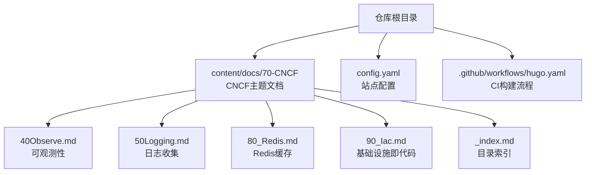
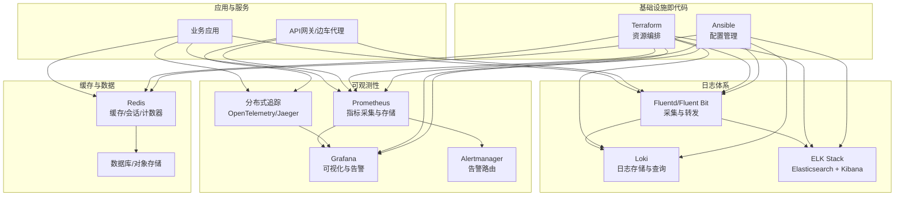
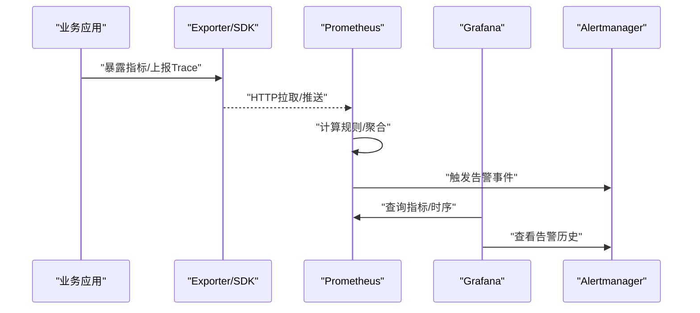
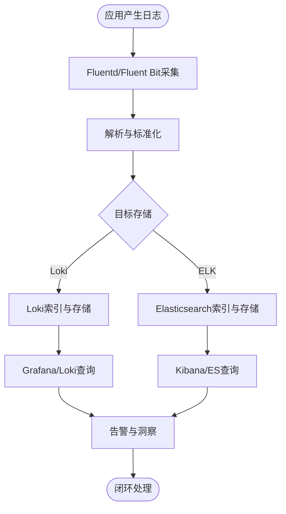
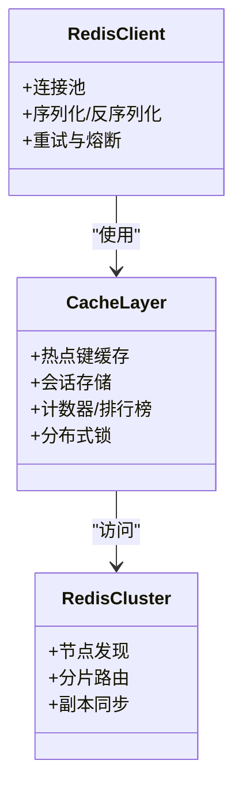
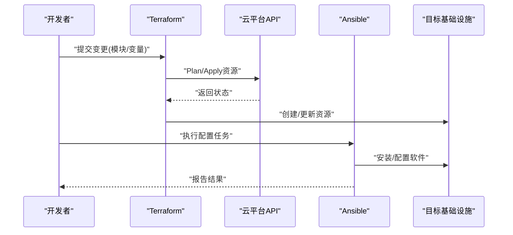
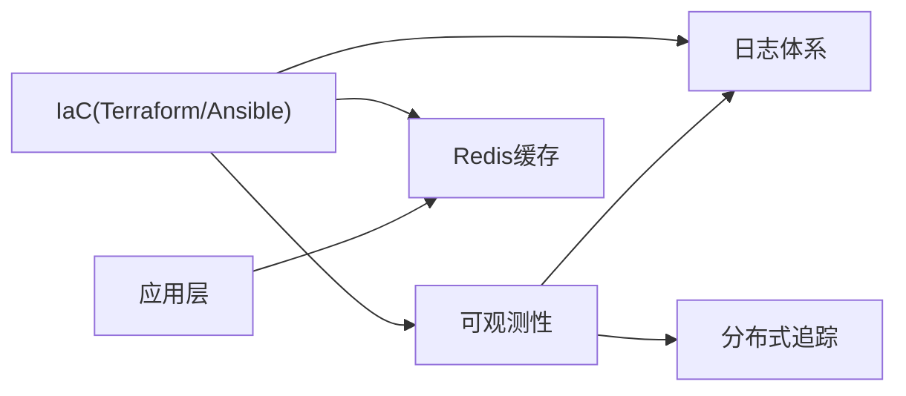

# CNCF项目生态

<cite>
**本文引用的文件**   
- [README.md](file://README.md)
- [config.yaml](file://config.yaml)
- [content/docs/70-CNCF/_index.md](file://content/docs/70-CNCF/_index.md)
- [content/docs/70-CNCF/40Observe.md](file://content/docs/70-CNCF/40Observe.md)
- [content/docs/70-CNCF/50Logging.md](file://content/docs/70-CNCF/50Logging.md)
- [content/docs/70-CNCF/80_Redis.md](file://content/docs/70-CNCF/80_Redis.md)
- [content/docs/70-CNCF/90_Iac.md](file://content/docs/70-CNCF/90_Iac.md)
</cite>

## 更新摘要
**变更内容**   
- 新增CNCF项目生态文档，涵盖可观测性、日志收集、Redis缓存和基础设施即代码等云原生技术栈
- 构建了完整的企业级云原生平台架构指南
- 提供了从架构设计到落地实施的全链路参考

## 目录
1. [简介](#简介)
2. [项目结构](#项目结构)
3. [核心组件](#核心组件)
4. [架构总览](#架构总览)
5. [详细组件分析](#详细组件分析)
6. [依赖关系分析](#依赖关系分析)
7. [性能考量](#性能考量)
8. [故障排查指南](#故障排查指南)
9. [结论](#结论)
10. [附录](#附录)

## 简介
本仓库以Hugo静态站点为载体，系统化沉淀CNCF生态在企业级云原生平台中的实践与指南。内容聚焦四大关键领域：可观测性（Prometheus、Grafana、分布式追踪）、日志收集（Fluentd、Loki、ELK Stack）、缓存系统（Redis在高并发场景的应用模式与集群架构），以及基础设施即代码（Terraform、Ansible）。目标是为企业团队提供从架构设计到落地实施的全链路参考，帮助构建稳定、高效、可演进的云原生平台。

## 项目结构
仓库采用"按主题分章节"的内容组织方式，核心文档位于 content/docs/70-CNCF 目录下，围绕可观测性、日志、缓存与IaC展开；站点配置与生成脚本位于根目录的配置文件与GitHub Actions工作流中。

图表来源
- [content/docs/70-CNCF/_index.md](file://content/docs/70-CNCF/_index.md)
- [content/docs/70-CNCF/40Observe.md](file://content/docs/70-CNCF/40Observe.md)
- [content/docs/70-CNCF/50Logging.md](file://content/docs/70-CNCF/50Logging.md)
- [content/docs/70-CNCF/80_Redis.md](file://content/docs/70-CNCF/80_Redis.md)
- [content/docs/70-CNCF/90_Iac.md](file://content/docs/70-CNCF/90_Iac.md)
- [config.yaml](file://config.yaml)

章节来源
- [README.md](file://README.md)
- [config.yaml](file://config.yaml)
- [content/docs/70-CNCF/_index.md](file://content/docs/70-CNCF/_index.md)

## 核心组件
- 可观测性体系
  - 指标采集与告警：Prometheus作为统一指标后端，结合Exporter采集系统与业务指标，配合Alertmanager实现告警路由与抑制。
  - 可视化与报表：Grafana对接Prometheus等数据源，构建多维看板与SLO仪表盘。
  - 分布式追踪：通过OpenTelemetry或Jaeger等方案，串联跨服务调用链，定位延迟与错误根因。
- 日志收集与分析
  - 采集层：Fluentd/Fluent Bit作为Agent侧采集器，统一格式并转发。
  - 存储与检索：Loki（轻量、低成本）或ELK Stack（Elasticsearch+Logstash+Kibana）提供高吞吐写入与复杂查询能力。
  - 治理策略：结构化日志、标签化索引、保留策略与冷热分层。
- 缓存系统（Redis）
  - 应用模式：热点键缓存、会话共享、计数与排行榜、消息队列桥接、分布式锁。
  - 集群架构：主从复制、哨兵高可用、Cluster分片扩展、读写分离与一致性权衡。
  - 运维要点：内存管理、持久化策略、网络拓扑与安全访问控制。
- 基础设施即代码（IaC）
  - Terraform：声明式资源编排，模块化与状态管理，多环境隔离与变更审计。
  - Ansible：配置管理与自动化运维，幂等任务与角色复用，与云平台API集成。
  - 最佳实践：版本化、最小权限、安全基线、回滚与漂移检测。

章节来源
- [content/docs/70-CNCF/40Observe.md](file://content/docs/70-CNCF/40Observe.md)
- [content/docs/70-CNCF/50Logging.md](file://content/docs/70-CNCF/50Logging.md)
- [content/docs/70-CNCF/80_Redis.md](file://content/docs/70-CNCF/80_Redis.md)
- [content/docs/70-CNCF/90_Iac.md](file://content/docs/70-CNCF/90_Iac.md)

## 架构总览
下图展示企业级云原生平台的整体架构视图，涵盖数据采集、传输、存储、分析与可视化全链路，并与IaC和缓存层协同。

图表来源
- [content/docs/70-CNCF/40Observe.md](file://content/docs/70-CNCF/40Observe.md)
- [content/docs/70-CNCF/50Logging.md](file://content/docs/70-CNCF/50Logging.md)
- [content/docs/70-CNCF/80_Redis.md](file://content/docs/70-CNCF/80_Redis.md)
- [content/docs/70-CNCF/90_Iac.md](file://content/docs/70-CNCF/90_Iac.md)

## 详细组件分析

### 可观测性组件分析
- Prometheus监控体系
  - 指标模型：时间序列、标签维度、采样间隔与保留周期。
  - 采集策略：Pull/Push混合、Service Discovery、联邦与远程读写。
  - 告警规则：阈值、复合条件、抑制与静默、通知渠道。
- Grafana可视化
  - 数据源接入：Prometheus、Loki、Jaeger等。
  - 看板设计：SLO/SLI指标、容量与成本视图、业务KPI。
  - 权限与协作：团队空间、只读/编辑权限、模板复用。
- 分布式追踪
  - 链路注入：SDK埋点、自动插桩、上下文传播。
  - 采样与压缩：动态采样、尾采样、聚合与降采样。
  - 关联分析：指标-日志-追踪三图联动，快速定位根因。

图表来源
- [content/docs/70-CNCF/40Observe.md](file://content/docs/70-CNCF/40Observe.md)

章节来源
- [content/docs/70-CNCF/40Observe.md](file://content/docs/70-CNCF/40Observe.md)

### 日志收集组件分析
- Fluentd/Fluent Bit
  - 插件生态：输入（systemd/journald/file/docker stdout）、过滤（JSON解析/字段裁剪）、输出（Loki/ES/S3）。
  - 可靠性：背压与缓冲、重试与死信队列、水平扩展。
- Loki vs ELK
  - Loki：基于标签索引、成本低、适合海量日志；查询语法与PromQL风格一致。
  - ELK：功能强大、全文检索与复杂分析；资源开销大、运维复杂度高。
- 治理与合规
  - 结构化日志规范、敏感信息脱敏、保留策略与归档、审计与溯源。

图表来源
- [content/docs/70-CNCF/50Logging.md](file://content/docs/70-CNCF/50Logging.md)

章节来源
- [content/docs/70-CNCF/50Logging.md](file://content/docs/70-CNCF/50Logging.md)

### Redis缓存组件分析
- 高并发应用模式
  - 热点键与预加载：降低DB压力，提升QPS。
  - 会话共享与状态外置：无状态服务横向扩展。
  - 计数与排行榜：原子操作与有序集合。
  - 分布式锁：避免竞态与重复执行。
- 集群与高可用
  - 主从复制与哨兵：故障自动切换。
  - Cluster分片：水平扩展与数据再平衡。
  - 一致性权衡：最终一致与强一致场景选择。
- 运维与优化
  - 内存淘汰策略、持久化（RDB/AOF）、连接池与超时、网络拓扑与安全。

图表来源
- [content/docs/70-CNCF/80_Redis.md](file://content/docs/70-CNCF/80_Redis.md)

章节来源
- [content/docs/70-CNCF/80_Redis.md](file://content/docs/70-CNCF/80_Redis.md)

### 基础设施即代码组件分析
- Terraform
  - 模块与变量：抽象与复用、环境差异化管理。
  - 状态与锁定：远程状态、并发控制与冲突解决。
  - 生命周期：计划、应用、销毁与漂移检测。
- Ansible
  - 角色与任务：幂等性与可测试性。
  - 配置基线与合规：安全加固与补丁管理。
  - 与云平台集成：动态库存与凭据管理。
- 最佳实践
  - 版本化与分支策略、最小权限原则、变更审批与审计、回滚预案。

图表来源
- [content/docs/70-CNCF/90_Iac.md](file://content/docs/70-CNCF/90_Iac.md)

章节来源
- [content/docs/70-CNCF/90_Iac.md](file://content/docs/70-CNCF/90_Iac.md)

## 依赖关系分析
- 组件耦合
  - 可观测性与日志：Grafana同时消费指标与日志，便于统一视角。
  - 日志与追踪：通过trace_id关联日志与链路，提升排障效率。
  - 缓存与应用：Redis作为外部依赖，需关注连接与超时策略。
  - IaC与各组件：Terraform/Ansible负责部署与配置，形成闭环。
- 潜在风险
  - 单点故障：Prometheus/Grafana/Loki/Redis需高可用与备份。
  - 资源争用：日志与追踪的高吞吐对存储与CPU有压力。
  - 配置漂移：IaC需持续校验与修复。

图表来源
- [content/docs/70-CNCF/40Observe.md](file://content/docs/70-CNCF/40Observe.md)
- [content/docs/70-CNCF/50Logging.md](file://content/docs/70-CNCF/50Logging.md)
- [content/docs/70-CNCF/80_Redis.md](file://content/docs/70-CNCF/80_Redis.md)
- [content/docs/70-CNCF/90_Iac.md](file://content/docs/70-CNCF/90_Iac.md)

## 性能考量
- 指标与日志
  - 合理采样与聚合，避免过度细粒度导致存储膨胀。
  - 标签基数控制，减少查询复杂度与内存占用。
  - 冷热分层与压缩，降低成本。
- 缓存
  - 热点键打散与本地缓存结合，降低远端压力。
  - 连接池与批量操作，提升吞吐。
  - 持久化与恢复时间评估，保障RTO/RPO。
- IaC
  - 并行执行与增量更新，缩短交付周期。
  - 状态拆分与环境隔离，降低冲突与风险。

## 故障排查指南
- 可观测性
  - 指标缺失：检查Exporter健康、SD配置与网络连通。
  - 告警风暴：启用抑制与静默，细化规则与分组。
  - 看板异常：确认数据源连通与权限。
- 日志
  - 采集丢失：检查Agent状态、缓冲与输出通道。
  - 查询缓慢：优化标签与索引，限制时间窗口。
  - 存储不足：调整保留策略与归档路径。
- 缓存
  - 命中率低：分析热点分布与过期策略。
  - 延迟升高：检查网络与持久化开销，考虑异步落盘。
  - 脑裂与不一致：验证哨兵/Cluster状态与网络分区。
- IaC
  - 状态冲突：锁定与串行化，合并变更。
  - 配置漂移：定期plan对比与自动修复。
  - 权限问题：最小权限与凭据轮换。

章节来源
- [content/docs/70-CNCF/40Observe.md](file://content/docs/70-CNCF/40Observe.md)
- [content/docs/70-CNCF/50Logging.md](file://content/docs/70-CNCF/50Logging.md)
- [content/docs/70-CNCF/80_Redis.md](file://content/docs/70-CNCF/80_Redis.md)
- [content/docs/70-CNCF/90_Iac.md](file://content/docs/70-CNCF/90_Iac.md)

## 结论
通过构建统一的指标、日志与追踪体系，结合Redis高并发缓存与Terraform/Ansible的IaC能力，企业可以打造具备高可用、可扩展与易运维的云原生平台。建议在演进过程中坚持"可观测先行、日志规范化、缓存分层、IaC驱动"的原则，逐步完善SLO治理与成本优化，持续提升交付质量与稳定性。

## 附录
- 术语表
  - SLO/SLI：服务等级目标/指标
  - RTO/RPO：恢复时间目标/恢复点目标
  - SD：服务发现
  - OTel：OpenTelemetry
- 参考链接
  - 各组件官方文档与最佳实践指南（参见对应章节引用）