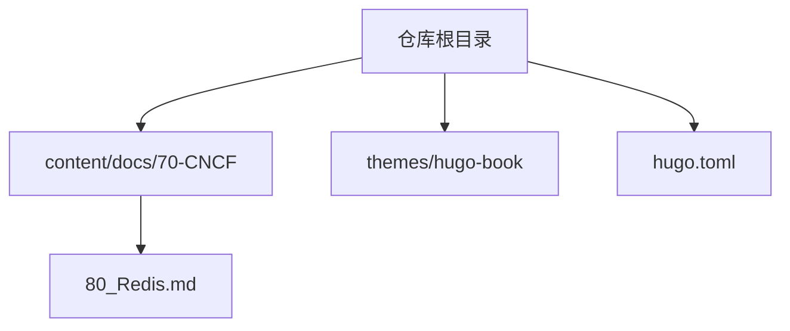
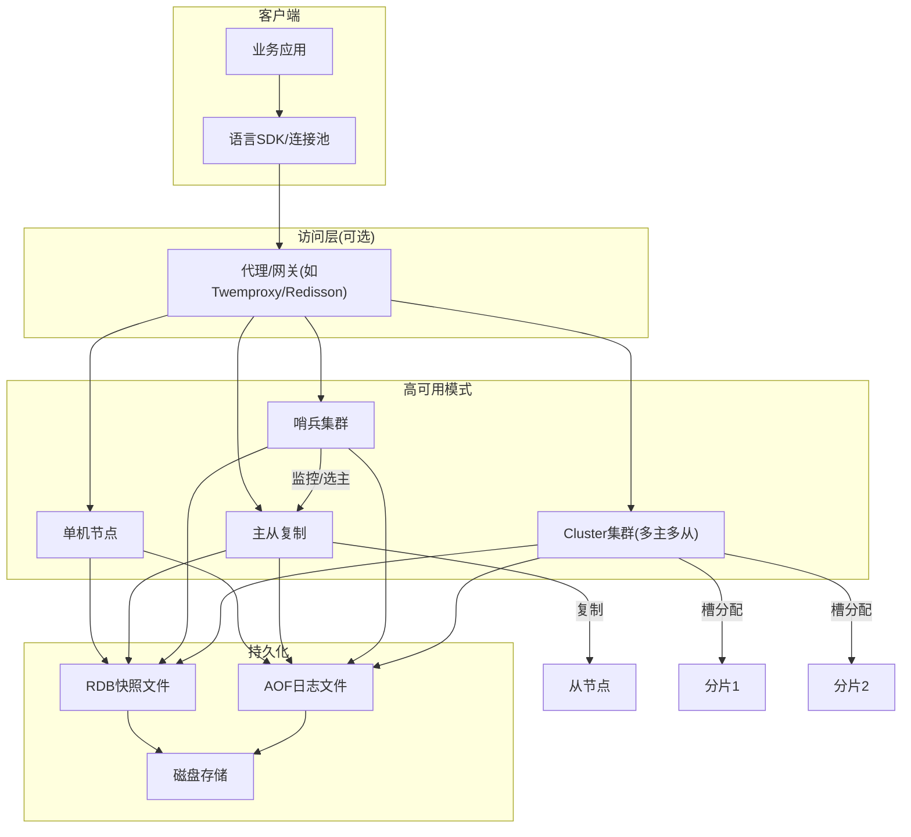
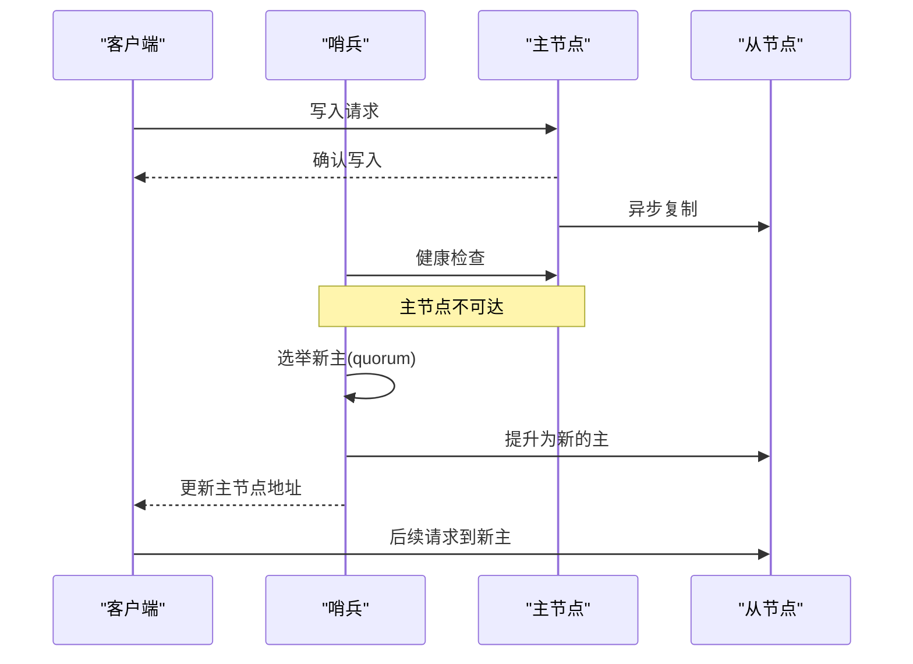
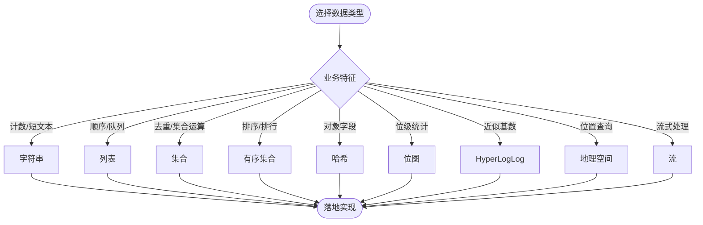
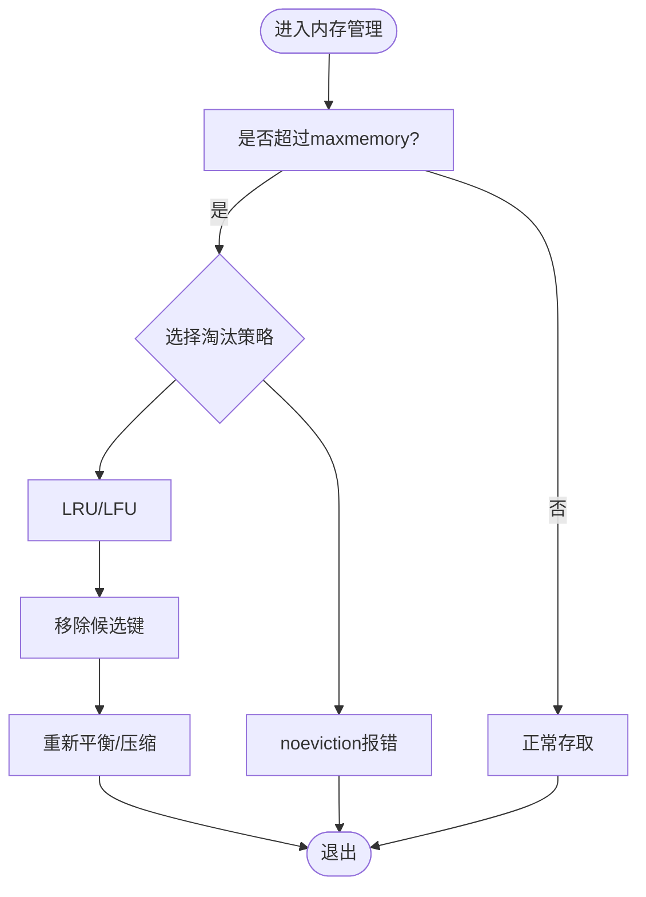
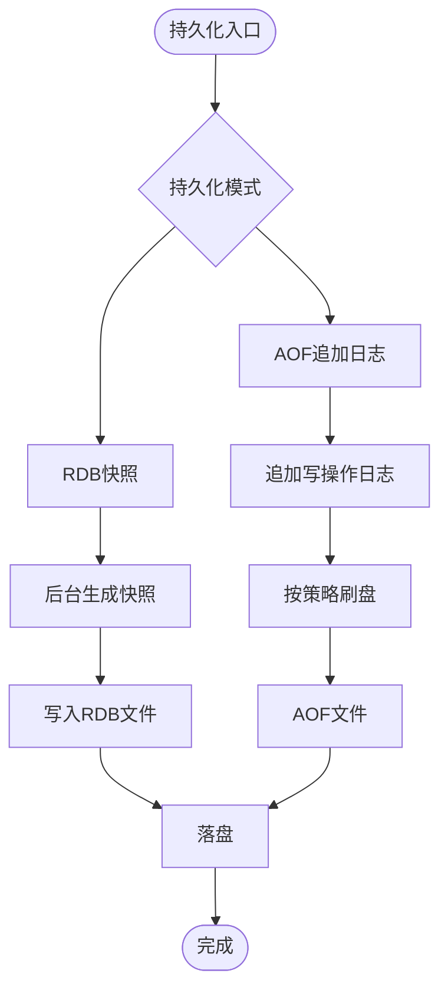
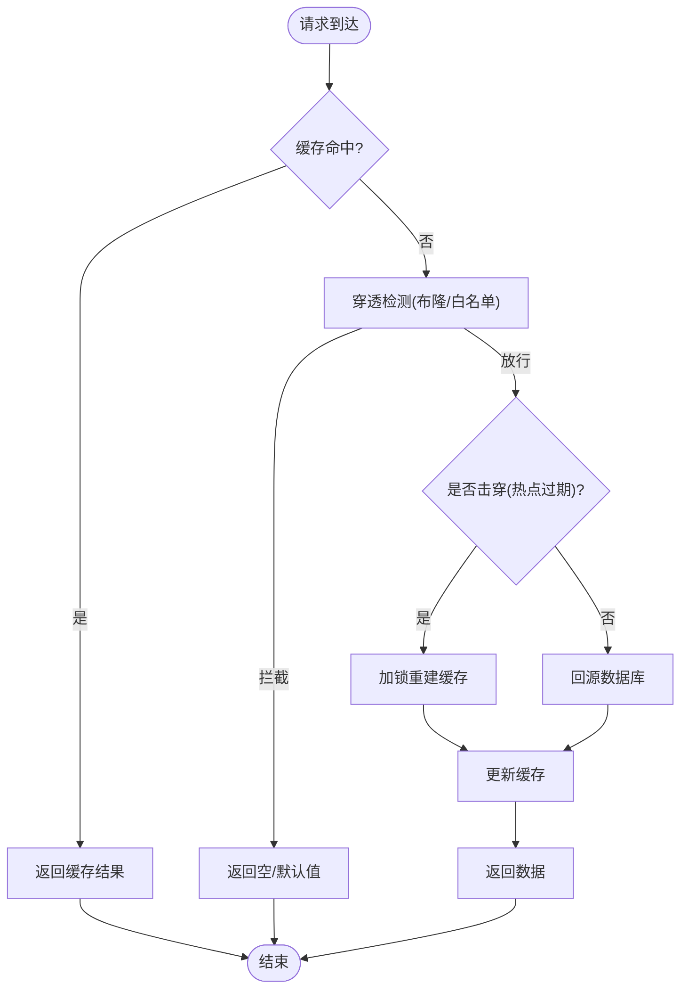
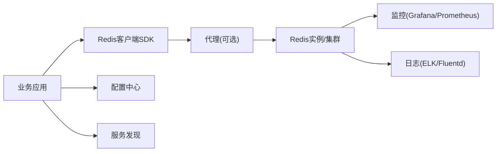

# Redis缓存系统

<cite>
**本文引用的文件**   
- [content/docs/70-CNCF/80_Redis.md](file://content/docs/70-CNCF/80_Redis.md)
</cite>

## 目录
1. [简介](#简介)
2. [项目结构](#项目结构)
3. [核心组件](#核心组件)
4. [架构总览](#架构总览)
5. [详细组件分析](#详细组件分析)
6. [依赖分析](#依赖分析)
7. [性能考虑](#性能考虑)
8. [故障排查指南](#故障排查指南)
9. [结论](#结论)
10. [附录](#附录)

## 简介
本技术文档围绕Redis在云原生环境下的应用模式与架构设计展开，覆盖单机、主从复制、哨兵模式与Cluster集群模式的部署方案；深入解析Redis数据结构特性、内存管理策略与持久化机制（RDB与AOF）；提供高并发场景下的缓存设计模式与防护策略（缓存穿透、击穿、雪崩）；介绍Redis在微服务架构中的典型使用场景（会话存储、消息队列、排行榜等）；并给出性能调优、监控指标与故障排查指南，以及安全配置、网络隔离与数据备份恢复方案。

## 项目结构
仓库采用Hugo静态站点组织内容，Redis相关文档位于“CNCF”主题目录下，便于与其他云原生主题内容统一编排与发布。

图表来源
- [content/docs/70-CNCF/80_Redis.md](file://content/docs/70-CNCF/80_Redis.md)

章节来源
- [content/docs/70-CNCF/80_Redis.md](file://content/docs/70-CNCF/80_Redis.md)

## 核心组件
本节聚焦Redis作为高性能键值存储的核心能力，包括：
- 数据结构：字符串、列表、集合、有序集合、哈希、位图、HyperLogLog、地理空间、流等
- 内存模型：单线程事件循环、对象编码与压缩、淘汰策略与内存上限控制
- 持久化：RDB快照与AOF追加日志的触发条件、合并与重写机制
- 高可用：主从复制、哨兵自动故障转移、Cluster分片与槽分配
- 扩展能力：Lua脚本、管道与批量命令、事务与WATCH

章节来源
- [content/docs/70-CNCF/80_Redis.md](file://content/docs/70-CNCF/80_Redis.md)

## 架构总览
下图展示Redis在云原生环境中的常见部署形态与交互关系，涵盖客户端、代理层（可选）、不同高可用模式及持久化存储。

图表来源
- [content/docs/70-CNCF/80_Redis.md](file://content/docs/70-CNCF/80_Redis.md)

## 详细组件分析

### 部署模式与拓扑
- 单机模式
  - 适用场景：开发测试、低流量或独立服务
  - 要点：最小化配置、合理设置maxmemory与淘汰策略、开启必要持久化
- 主从复制
  - 适用场景：读多写少、读写分离
  - 要点：全量/增量复制、延迟容忍、只读从节点分流
- 哨兵模式
  - 适用场景：需要自动故障转移的高可用
  - 要点：哨兵数量奇数、quorum阈值、failover超时与重试
- Cluster集群
  - 适用场景：水平扩展、海量数据与高吞吐
  - 要点：槽分配、跨分片事务限制、客户端路由与重定向处理

图表来源
- [content/docs/70-CNCF/80_Redis.md](file://content/docs/70-CNCF/80_Redis.md)

章节来源
- [content/docs/70-CNCF/80_Redis.md](file://content/docs/70-CNCF/80_Redis.md)

### 数据结构与使用建议
- 基础类型
  - 字符串：计数器、分布式锁、短文本缓存
  - 列表：简单消息队列、时间线
  - 集合：去重、交集并集差集统计
  - 有序集合：排行榜、延时任务
  - 哈希：对象字段级更新
- 高级类型
  - 位图：活跃用户统计、布隆过滤器替代
  - HyperLogLog：基数统计
  - 地理空间：附近搜索
  - 流：轻量级消息流

图表来源
- [content/docs/70-CNCF/80_Redis.md](file://content/docs/70-CNCF/80_Redis.md)

章节来源
- [content/docs/70-CNCF/80_Redis.md](file://content/docs/70-CNCF/80_Redis.md)

### 内存管理与淘汰策略
- 内存上限与碎片率
  - 设置maxmemory，关注碎片率与内存回收
- 淘汰策略
  - volatile-lru/lfu、allkeys-lru/lfu、noeviction等
- 对象编码与压缩
  - 小对象整型/embstr优化，大对象zmalloc管理
- 过期与惰性删除
  - TTL配合定期扫描与惰性失效

图表来源
- [content/docs/70-CNCF/80_Redis.md](file://content/docs/70-CNCF/80_Redis.md)

章节来源
- [content/docs/70-CNCF/80_Redis.md](file://content/docs/70-CNCF/80_Redis.md)

### 持久化机制：RDB与AOF
- RDB
  - 触发方式：手动save、bgsave、定时快照
  - 优点：恢复快、文件紧凑
  - 缺点：可能丢失最后一次快照后的数据
- AOF
  - 触发方式：appendfsync everysec/no/always
  - 优点：数据更安全
  - 缺点：体积较大、恢复较慢
- 混合持久化
  - RDB+AOF结合，兼顾速度与一致性

图表来源
- [content/docs/70-CNCF/80_Redis.md](file://content/docs/70-CNCF/80_Redis.md)

章节来源
- [content/docs/70-CNCF/80_Redis.md](file://content/docs/70-CNCF/80_Redis.md)

### 高并发缓存设计模式
- 缓存穿透
  - 现象：查询不存在的数据，直达后端
  - 防护：空值缓存、布隆过滤器前置校验、参数校验
- 缓存击穿
  - 现象：热点键过期瞬间大量请求涌入
  - 防护：互斥锁重建、逻辑过期、热点预热
- 缓存雪崩
  - 现象：大量键同时过期或缓存整体不可用
  - 防护：随机TTL、多级缓存、降级与熔断、限流

图表来源
- [content/docs/70-CNCF/80_Redis.md](file://content/docs/70-CNCF/80_Redis.md)

章节来源
- [content/docs/70-CNCF/80_Redis.md](file://content/docs/70-CNCF/80_Redis.md)

### 微服务架构中的典型场景
- 会话存储
  - 特点：高并发读、短生命周期、强一致要求低
  - 建议：合理TTL、序列化格式、分片与副本
- 消息队列
  - 特点：轻量、顺序性不强、可接受少量丢失
  - 建议：列表/流、消费者幂等、死信队列
- 排行榜
  - 特点：高频更新、范围查询
  - 建议：有序集合、分页与缓存聚合

章节来源
- [content/docs/70-CNCF/80_Redis.md](file://content/docs/70-CNCF/80_Redis.md)

### 性能调优与监控
- 关键指标
  - QPS/RT、命中率、内存使用与碎片率、持久化耗时、复制延迟、慢查询
- 调优方向
  - 连接池与批量命令、Pipeline、避免大Key/热Key、合理分片与副本
- 监控告警
  - 基于Prometheus/Grafana采集关键指标，设定阈值与自愈策略

章节来源
- [content/docs/70-CNCF/80_Redis.md](file://content/docs/70-CNCF/80_Redis.md)

### 安全配置与网络隔离
- 认证与鉴权
  - 启用密码、ACL细粒度权限控制
- 网络隔离
  - 绑定内网IP、VPC/子网隔离、防火墙策略
- 传输安全
  - TLS加密、证书轮换
- 审计与合规
  - 访问日志、敏感命令禁用、最小权限原则

章节来源
- [content/docs/70-CNCF/80_Redis.md](file://content/docs/70-CNCF/80_Redis.md)

### 备份与恢复
- 备份策略
  - 定期RDB快照、AOF持续追加、异地容灾
- 恢复流程
  - 停止写入、加载最新RDB、回放AOF、验证数据一致性
- 演练与验证
  - 定期演练恢复流程，记录RTO/RPO目标达成情况

章节来源
- [content/docs/70-CNCF/80_Redis.md](file://content/docs/70-CNCF/80_Redis.md)

## 依赖分析
Redis在云原生环境中通常与以下组件协作：
- 客户端SDK与连接池
- 代理/网关（可选）
- 监控与日志体系（Prometheus、Grafana、ELK等）
- 配置中心与服务发现
- 容器编排平台（Kubernetes）与存储卷

图表来源
- [content/docs/70-CNCF/80_Redis.md](file://content/docs/70-CNCF/80_Redis.md)

章节来源
- [content/docs/70-CNCF/80_Redis.md](file://content/docs/70-CNCF/80_Redis.md)

## 性能考虑
- 减少网络往返：使用Pipeline与批量命令
- 避免大Key与热Key：拆分与本地缓存结合
- 合理设置持久化与淘汰策略，降低抖动
- 使用只读副本分担读压力
- 关注慢查询与CPU占用，定位热点路径

[本节为通用指导，不直接分析具体文件]

## 故障排查指南
- 常见问题
  - 连接失败、认证错误、OOM、主从延迟、持久化阻塞、慢查询
- 排查步骤
  - 查看日志与监控指标、定位热点与慢查询、评估内存与碎片、检查网络与TLS
- 应急措施
  - 限流与降级、扩容与迁移、切换主从、清理大Key

章节来源
- [content/docs/70-CNCF/80_Redis.md](file://content/docs/70-CNCF/80_Redis.md)

## 结论
Redis在云原生环境下具备极高的灵活性与可扩展性。通过选择合适的部署模式、合理的内存与持久化策略、完善的高并发防护与监控体系，可以在保证性能的同时满足高可用与安全合规要求。建议在上线前进行容量规划与压测，建立完善的备份恢复与故障演练机制。

[本节为总结性内容，不直接分析具体文件]

## 附录
- 术语表
  - RDB：Redis Database Snapshot
  - AOF：Append Only File
  - LRU/LFU：最近最少使用/最不经常使用
  - Quorum：法定人数（哨兵选举）
  - Slot：槽（Cluster分片单位）

[本节为补充信息，不直接分析具体文件]