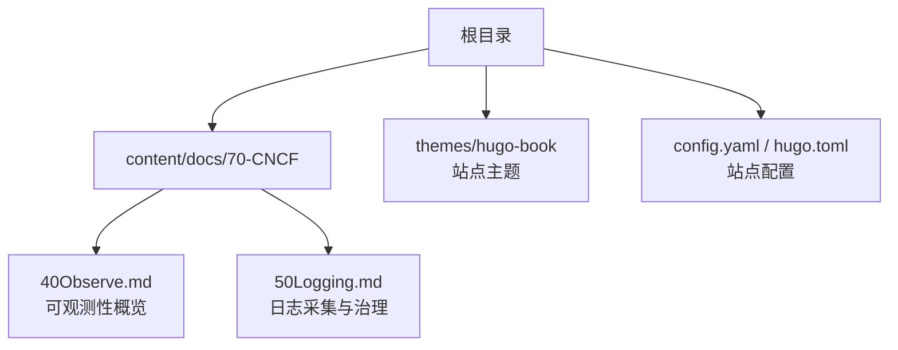
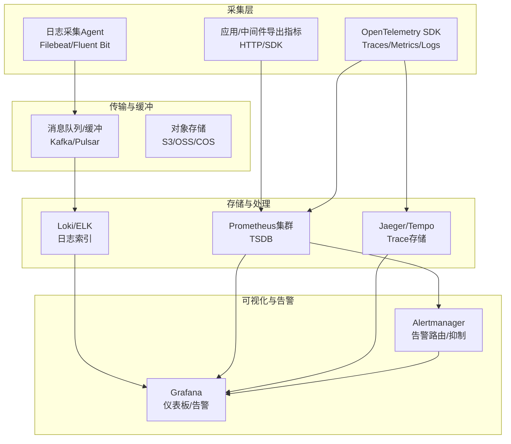
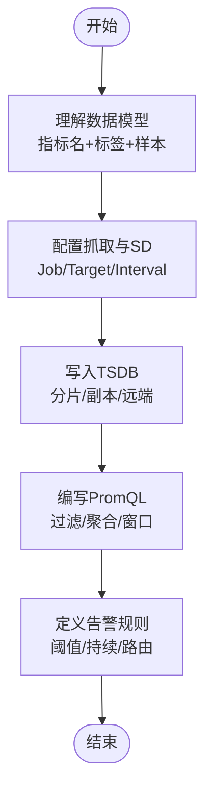
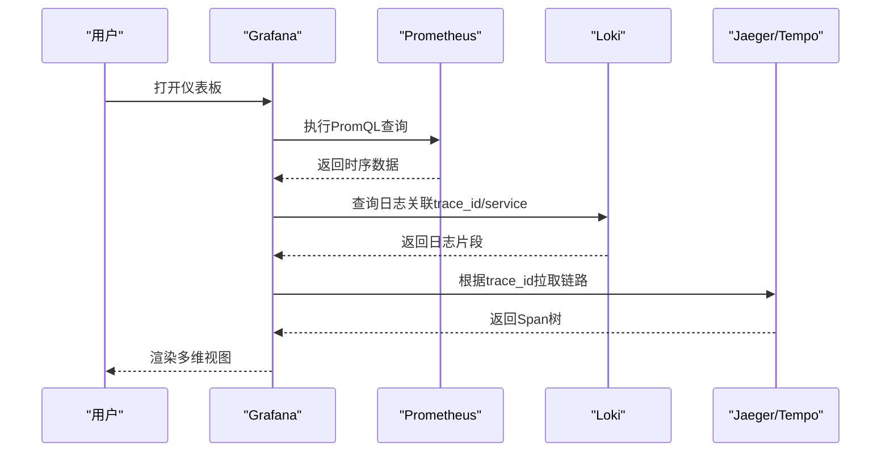
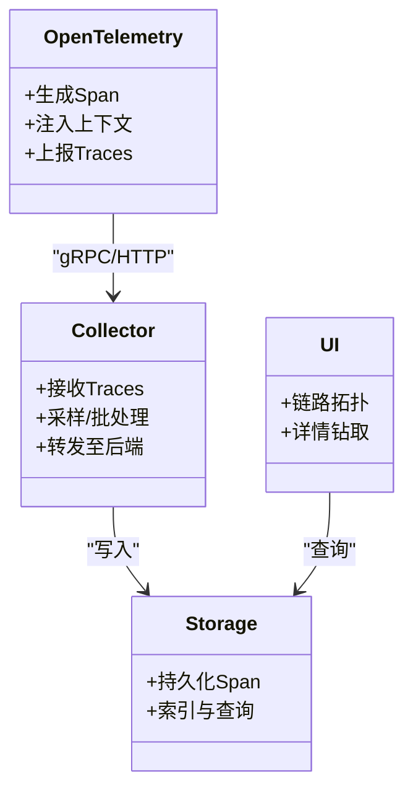
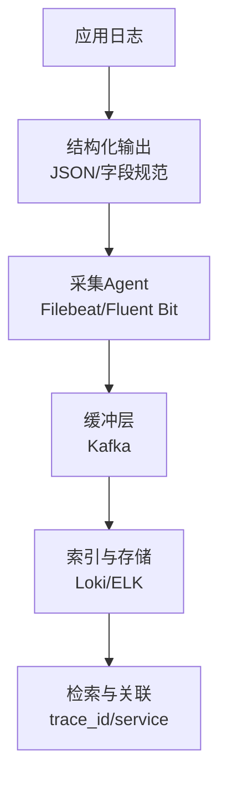
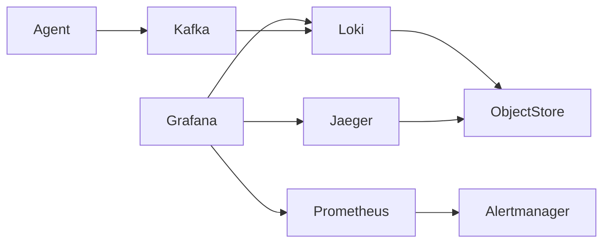

# 可观测性体系

<cite>
**本文引用的文件**   
- [40Observe.md](file://content/docs/70-CNCF/40Observe.md)
- [50Logging.md](file://content/docs/70-CNCF/50Logging.md)
</cite>

## 目录
1. [引言](#引言)
2. [项目结构](#项目结构)
3. [核心组件](#核心组件)
4. [架构总览](#架构总览)
5. [详细组件分析](#详细组件分析)
6. [依赖关系分析](#依赖关系分析)
7. [性能与容量规划](#性能与容量规划)
8. [故障排查指南](#故障排查指南)
9. [结论](#结论)
10. [附录](#附录)

## 引言
本技术文档围绕企业级可观测性体系，聚焦指标、日志、链路追踪“三位一体”方案。内容涵盖Prometheus监控架构与数据模型、PromQL查询语言与告警规则；Grafana可视化平台的数据源配置、仪表板设计模式与权限管理；分布式追踪系统（Jaeger、Tempo）的实现原理、采样策略与性能优化；以及高可用部署架构与容量规划建议。目标是帮助读者快速构建并运维一套稳定、可扩展、易用的可观测性平台。

## 项目结构
仓库为基于Hugo的静态站点，文档以Markdown形式组织。与可观测性相关的核心内容位于CNCF分类下的“可观测性”和“日志”两篇文章中，分别覆盖整体可观测性概览与日志采集治理实践。

图表来源
- [40Observe.md](file://content/docs/70-CNCF/40Observe.md)
- [50Logging.md](file://content/docs/70-CNCF/50Logging.md)

章节来源
- [40Observe.md](file://content/docs/70-CNCF/40Observe.md)
- [50Logging.md](file://content/docs/70-CNCF/50Logging.md)

## 核心组件
- Prometheus：时间序列数据库与指标采集编排器，负责拉取、存储与查询指标，支持Alertmanager告警。
- Grafana：统一可视化与分析平台，提供仪表板、告警、多数据源接入能力。
- 日志体系：以Filebeat/Fluent Bit等Agent采集，经Kafka或对象存储缓冲后，由Loki/ELK进行索引与检索。
- 分布式追踪：OpenTelemetry SDK埋点，Jaeger/Tempo作为后端存储与查询，结合服务网格（如Istio）自动注入上下文。

章节来源
- [40Observe.md](file://content/docs/70-CNCF/40Observe.md)
- [50Logging.md](file://content/docs/70-CNCF/50Logging.md)

## 架构总览
下图展示“指标+日志+追踪”一体化架构，强调数据流与控制面解耦，便于横向扩展与高可用。

图表来源
- [40Observe.md](file://content/docs/70-CNCF/40Observe.md)
- [50Logging.md](file://content/docs/70-CNCF/50Logging.md)

## 详细组件分析

### Prometheus监控架构与数据模型
- 数据模型要点
  - 指标名称与标签键值对构成唯一标识，时间戳与数值构成样本。
  - 四种基本类型：Counter、Gauge、Histogram、Summary。
  - 元数据与目标发现：Service Discovery、静态配置、动态发现。
- 抓取与存储
  - 拉取模型，按job/target维度分片；本地TSDB持久化，支持远端读写。
  - 联邦与分片聚合用于跨域/跨集群汇总。
- 查询语言PromQL
  - 选择器与过滤、聚合函数、时间窗口与速率计算、子查询与组合。
  - 最佳实践：避免高基数标签、合理设置保留期与压缩、预聚合热点指标。
- 告警规则
  - 规则文件定义阈值、持续时间、标签与注解；通过Alertmanager进行去重、分组、静默与通知。

图表来源
- [40Observe.md](file://content/docs/70-CNCF/40Observe.md)

章节来源
- [40Observe.md](file://content/docs/70-CNCF/40Observe.md)

### Grafana可视化平台
- 数据源配置
  - 支持Prometheus、Loki、Jaeger/Tempo、Elasticsearch等；推荐启用TLS与认证。
- 仪表板设计模式
  - 分层布局：业务视图→服务视图→实例视图；使用变量与模板实现复用。
  - 关键面板：趋势图、热力图、TopN、错误率、延迟分布、资源水位。
- 权限与协作
  - 角色与团队：Viewer/Editor/Admin；文件夹级权限；API Key与OAuth集成。
  - 版本控制：将Dashboard JSON纳入Git，配合CI/CD发布。

图表来源
- [40Observe.md](file://content/docs/70-CNCF/40Observe.md)
- [50Logging.md](file://content/docs/70-CNCF/50Logging.md)

章节来源
- [40Observe.md](file://content/docs/70-CNCF/40Observe.md)
- [50Logging.md](file://content/docs/70-CNCF/50Logging.md)

### 分布式追踪系统（Jaeger、Tempo）
- 实现原理
  - Trace/Span层级结构，携带上下文传播（W3C Trace Context/B3）。
  - 采集端：OpenTelemetry SDK自动/手动埋点；网关/边车（Envoy/Istio）注入。
  - 服务端：Collector汇聚、采样、落盘；查询服务提供检索与聚合。
- 采样策略
  - 固定比例、概率采样、尾部采样（按错误/慢请求优先）、自适应采样。
  - 注意：采样需与指标/日志关联，确保可回溯。
- 性能优化
  - 批量发送、压缩、限流；合理设置Span大小与属性数量；冷热分离存储。
  - 查询侧：索引优化、分区裁剪、缓存热点结果。

图表来源
- [40Observe.md](file://content/docs/70-CNCF/40Observe.md)

章节来源
- [40Observe.md](file://content/docs/70-CNCF/40Observe.md)

### 日志聚合与治理
- 采集与传输
  - Agent侧结构化输出JSON；统一字段（service、env、trace_id、level、ts）。
  - 通过Kafka缓冲削峰填谷，降低下游压力。
- 存储与检索
  - Loki采用标签索引+对象存储，成本低、适合云原生；ELK功能丰富但成本较高。
- 治理规范
  - 命名规范、敏感信息脱敏、采样与轮转、保留策略与合规审计。

图表来源
- [50Logging.md](file://content/docs/70-CNCF/50Logging.md)

章节来源
- [50Logging.md](file://content/docs/70-CNCF/50Logging.md)

## 依赖关系分析
- 组件耦合
  - Grafana对多数据源的松耦合依赖，通过插件机制扩展。
  - Prometheus与Alertmanager职责分离，便于独立扩缩容。
  - 追踪系统与指标/日志通过trace_id关联，形成闭环。
- 外部依赖
  - 对象存储（S3/OSS/COS）用于长期归档与冷备。
  - 消息队列（Kafka/Pulsar）用于日志与追踪的高吞吐缓冲。

图表来源
- [40Observe.md](file://content/docs/70-CNCF/40Observe.md)
- [50Logging.md](file://content/docs/70-CNCF/50Logging.md)

## 性能与容量规划
- 指标容量
  - 估算公式：样本数=目标数×指标数×(60/抓取间隔)。考虑标签基数膨胀与保留周期。
  - 存储：单节点TSDB建议磁盘IOPS与容量预留；多分片与副本提升可用性。
- 日志容量
  - 峰值QPS×平均行大小×保留天数；冷热分层与压缩策略降低成本。
- 追踪容量
  - Span数量与大小决定存储与查询开销；采样率与索引字段需权衡。
- 高可用设计
  - 无状态组件水平扩展（Grafana、Collector、查询服务）；有状态组件（Prometheus/Loki/TSDB）采用分片与副本。
  - 跨AZ部署、异地灾备与演练；网络与带宽规划。

[本节为通用指导，不直接分析具体文件]

## 故障排查指南
- 指标异常
  - 检查抓取健康状态、目标可达性与证书；核对标签基数与重复指标。
  - 使用PromQL定位热点与异常时间点，结合日志与追踪交叉验证。
- 日志缺失
  - 校验Agent运行状态与权限；确认Kafka消费滞后与下游积压。
  - 检查索引字段与保留策略，必要时重建索引。
- 链路断裂
  - 确认上下文传播是否贯穿上下游；检查采样导致的数据丢失。
  - 在Grafana中通过trace_id串联指标与日志，定位瓶颈与错误。

章节来源
- [40Observe.md](file://content/docs/70-CNCF/40Observe.md)
- [50Logging.md](file://content/docs/70-CNCF/50Logging.md)

## 结论
通过Prometheus+Grafana+日志与追踪体系的协同，企业可构建端到端的可观测性平台。关键在于：统一的数据模型与规范、合理的容量与高可用设计、严格的采样与治理策略，以及以问题为中心的排障流程。建议在灰度环境中先行落地，逐步完善指标、日志与追踪的联动能力。

[本节为总结性内容，不直接分析具体文件]

## 附录
- 术语表
  - Trace/Span：分布式调用链与最小工作单元。
  - TSDB：时间序列数据库，面向指标存储与查询。
  - SD：服务发现，动态维护抓取目标。
- 参考路径
  - 可观测性概览：[40Observe.md](file://content/docs/70-CNCF/40Observe.md)
  - 日志采集与治理：[50Logging.md](file://content/docs/70-CNCF/50Logging.md)