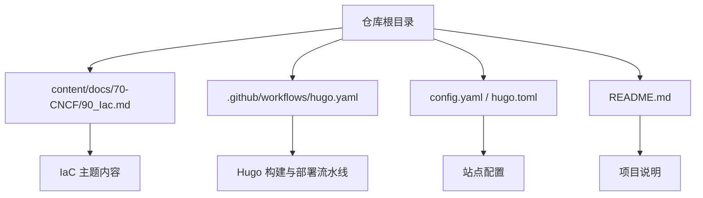
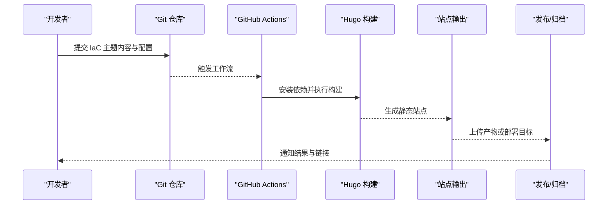
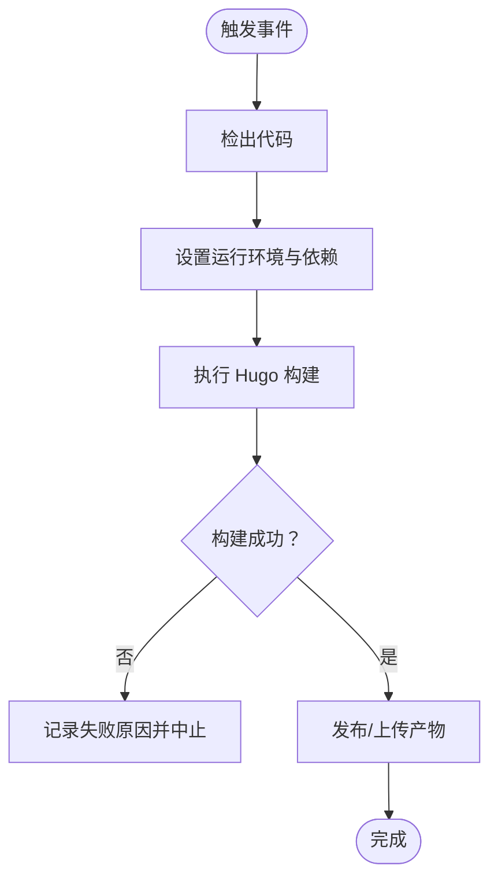
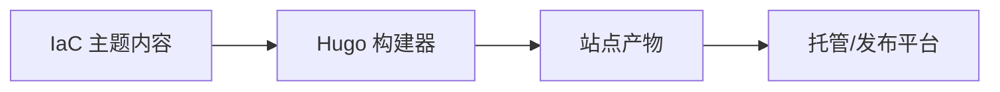

# 基础设施即代码

<cite>
**本文引用的文件**   
- [README.md](file://README.md)
- [config.yaml](file://config.yaml)
- [hugo.toml](file://hugo.toml)
- [.github/workflows/hugo.yaml](file://.github/workflows/hugo.yaml)
- [content/docs/70-CNCF/90_Iac.md](file://content/docs/70-CNCF/90_Iac.md)
</cite>

## 目录
1. [简介](#简介)
2. [项目结构](#项目结构)
3. [核心组件](#核心组件)
4. [架构总览](#架构总览)
5. [详细组件分析](#详细组件分析)
6. [依赖分析](#依赖分析)
7. [性能考虑](#性能考虑)
8. [故障排查指南](#故障排查指南)
9. [结论](#结论)
10. [附录](#附录)

## 简介
本指南面向企业级“基础设施即代码（IaC）”实践，围绕 Terraform、Ansible、Pulumi 等主流工具，系统阐述状态管理、模块化与多环境策略；Playbook 编写、角色管理与动态库存；云资源编排最佳实践（版本控制、代码审查、自动化测试）；变更管理、回滚与灾难恢复；CI/CD 集成、安全扫描与合规检查；多云治理与成本优化；以及企业级 IaC 架构设计与团队协作规范。文档同时结合仓库中已有的内容组织与 CI 流水线配置，给出可落地的落地建议与参考路径。

## 项目结构
该仓库为基于 Hugo 的静态站点，内容以 Markdown 为主，配合 GitHub Actions 构建发布。与 IaC 主题相关的源内容位于 content 目录下，CI 定义位于 .github/workflows。

图表来源
- [content/docs/70-CNCF/90_Iac.md](file://content/docs/70-CNCF/90_Iac.md)
- [.github/workflows/hugo.yaml](file://.github/workflows/hugo.yaml)
- [config.yaml](file://config.yaml)
- [hugo.toml](file://hugo.toml)
- [README.md](file://README.md)

章节来源
- [README.md](file://README.md)
- [config.yaml](file://config.yaml)
- [hugo.toml](file://hugo.toml)
- [.github/workflows/hugo.yaml](file://.github/workflows/hugo.yaml)
- [content/docs/70-CNCF/90_Iac.md](file://content/docs/70-CNCF/90_Iac.md)

## 核心组件
- 内容层：IaC 主题文章与示例，作为知识沉淀与团队规范载体。
- 构建层：Hugo 静态站点生成器，负责将 Markdown 渲染为站点页面。
- 流水线层：GitHub Actions 工作流，执行拉取、安装依赖、构建与发布。
- 配置层：站点与主题相关配置，统一站点行为与展示。

章节来源
- [content/docs/70-CNCF/90_Iac.md](file://content/docs/70-CNCF/90_Iac.md)
- [.github/workflows/hugo.yaml](file://.github/workflows/hugo.yaml)
- [config.yaml](file://config.yaml)
- [hugo.toml](file://hugo.toml)

## 架构总览
下图展示了从源码到站点的端到端流程，并标注了与 IaC 主题相关的内容入口与流水线环节。

图表来源
- [.github/workflows/hugo.yaml](file://.github/workflows/hugo.yaml)

## 详细组件分析

### IaC 主题内容组织
- 位置：content/docs/70-CNCF/90_Iac.md
- 作用：承载 IaC 专题的知识条目，可作为团队规范、最佳实践与案例的权威来源。
- 建议：
  - 按工具域拆分小节（Terraform、Ansible、Pulumi），便于检索与维护。
  - 引入“术语表”和“参考实现链接”，提升可读性与可操作性。
  - 使用“变更日志”记录规范演进，确保团队对齐。

章节来源
- [content/docs/70-CNCF/90_Iac.md](file://content/docs/70-CNCF/90_Iac.md)

### 构建与发布流水线（GitHub Actions）
- 位置：.github/workflows/hugo.yaml
- 职责：在推送或 PR 时触发 Hugo 构建，产出静态站点并交付到指定目标。
- 关键要点：
  - 缓存依赖与构建产物，缩短流水线耗时。
  - 对构建产物进行完整性校验（如哈希校验）。
  - 失败时提供清晰的错误上下文与重试策略。

图表来源
- [.github/workflows/hugo.yaml](file://.github/workflows/hugo.yaml)

章节来源
- [.github/workflows/hugo.yaml](file://.github/workflows/hugo.yaml)

### 站点配置（Hugo）
- 位置：config.yaml、hugo.toml
- 作用：定义站点元信息、主题、菜单、语言与构建参数等。
- 建议：
  - 将敏感信息与站点无关的配置抽离至环境变量或外部配置中心。
  - 通过分支或标签区分不同环境的站点构建参数。

章节来源
- [config.yaml](file://config.yaml)
- [hugo.toml](file://hugo.toml)

### 项目说明（README）
- 位置：README.md
- 作用：概述项目背景、快速开始与贡献方式。
- 建议：
  - 补充 IaC 专题的使用指引与示例仓库链接。
  - 明确版本策略与兼容性矩阵。

章节来源
- [README.md](file://README.md)

## 依赖分析
- 运行时依赖：Hugo（用于站点构建）、Go（Hugo 依赖）。
- 开发依赖：Markdown 编辑器、语法检查、样式规范。
- 外部服务：GitHub Actions、对象存储或托管平台（用于发布）。

图表来源
- [.github/workflows/hugo.yaml](file://.github/workflows/hugo.yaml)
- [config.yaml](file://config.yaml)
- [hugo.toml](file://hugo.toml)

章节来源
- [.github/workflows/hugo.yaml](file://.github/workflows/hugo.yaml)
- [config.yaml](file://config.yaml)
- [hugo.toml](file://hugo.toml)

## 性能考虑
- 构建优化：启用依赖缓存、增量构建与并行任务。
- 内容优化：图片与媒体压缩、按需加载与懒加载。
- 流水线优化：分阶段执行、失败快速返回、重试与超时控制。
- 产物瘦身：移除无用资源、开启压缩与缓存头。

[本节为通用指导，不直接分析具体文件]

## 故障排查指南
- 构建失败：
  - 检查工作流日志中的错误堆栈与退出码。
  - 确认 Hugo 版本与依赖是否匹配。
  - 验证内容语法与引用路径是否正确。
- 发布异常：
  - 核对凭据与权限。
  - 检查目标平台可达性与配额限制。
- 内容问题：
  - 使用本地预览快速定位渲染异常。
  - 借助 linter 与格式化工具统一风格。

章节来源
- [.github/workflows/hugo.yaml](file://.github/workflows/hugo.yaml)

## 结论
本指南以仓库现有内容组织与流水线为基础，给出了 IaC 主题内容的沉淀方式与站点构建发布的工程化实践。建议在此基础上进一步扩展：
- 将 IaC 最佳实践拆分为独立的可执行示例仓库，并与本文档建立双向链接。
- 在流水线中增加安全扫描、合规检查与成本估算步骤，形成闭环治理。
- 建立跨团队的 IaC 规范评审机制，确保一致性与可维护性。

[本节为总结性内容，不直接分析具体文件]

## 附录

### IaC 工具与实践清单（建议纳入主题内容）
- Terraform
  - 状态管理：远程后端、锁定、加密与访问控制。
  - 模块化：模块分层、输入输出契约与版本约束。
  - 多环境：目录隔离、变量与环境注入、策略门禁。
- Ansible
  - Playbook：结构化任务、条件与循环、错误处理。
  - 角色：职责分离、复用与依赖管理。
  - 动态库存：云平台 API 获取实例、标签驱动与缓存。
- Pulumi
  - 编程式定义：类型安全、条件与循环、跨语言复用。
  - 状态与并发：状态存储、冲突解决与并行更新。
  - 多环境：配置栈、变量与策略。
- 云资源编排最佳实践
  - 版本控制：语义化版本、变更摘要与回滚标记。
  - 代码审查：模板检查、依赖审计与安全扫描。
  - 自动化测试：计划对比、破坏性变更演练与回归测试。
- 变更管理与灾难恢复
  - 变更窗口、审批与灰度发布。
  - 快照与备份、回滚脚本与演练。
- CI/CD 集成
  - 流水线阶段：构建、测试、扫描、部署与验证。
  - 安全与合规：密钥管理、镜像扫描、基线检查。
- 多云治理与成本优化
  - 标签与归属、预算与告警、闲置资源回收。
  - 容量规划与弹性策略、预留与竞价实例组合。
- 企业级架构与协作
  - 分层仓库与共享库、权限模型与审计。
  - 规范评审、培训与知识库建设。

[本节为概念性清单，不直接分析具体文件]